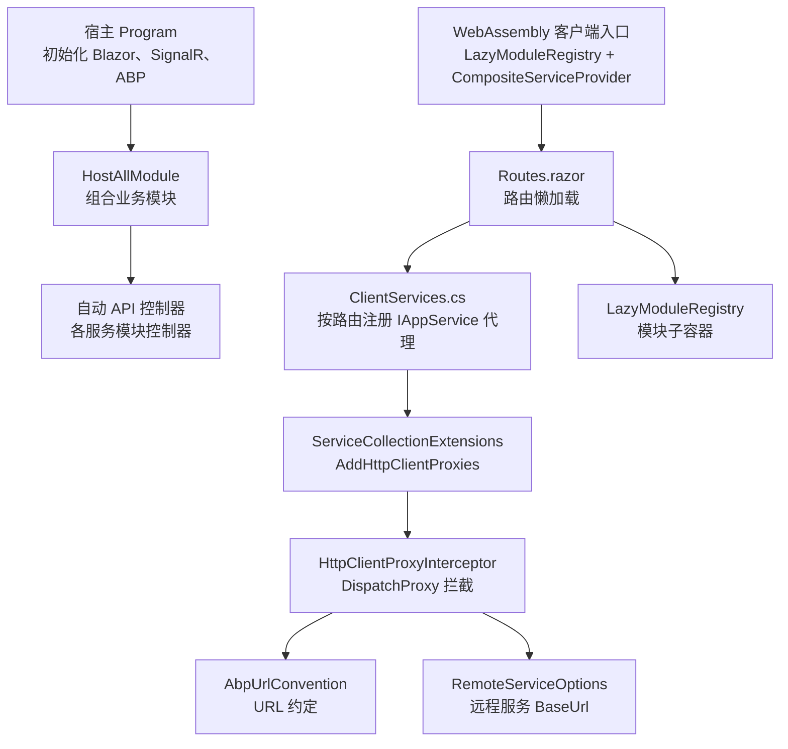
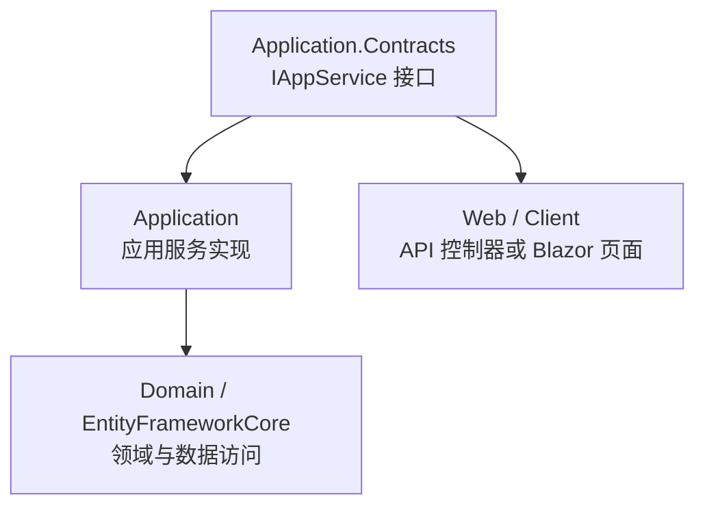
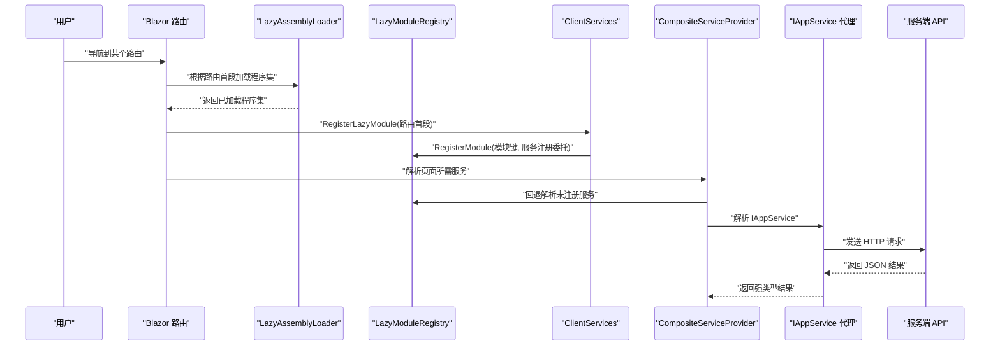
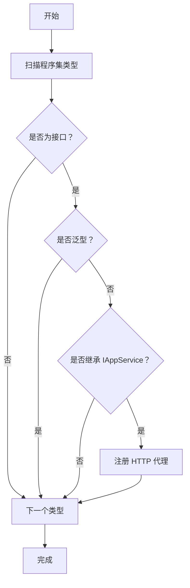
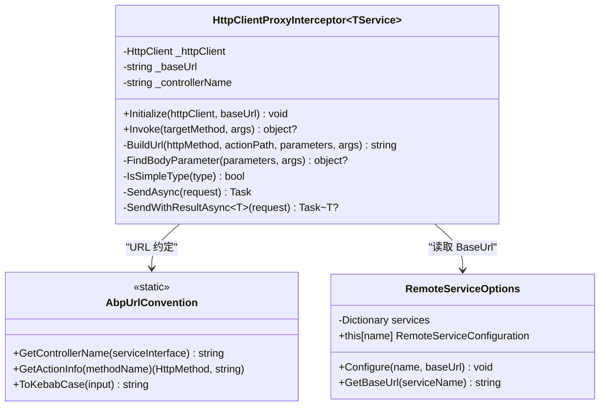
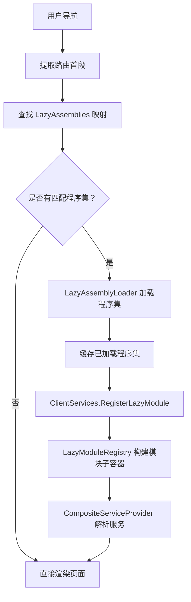
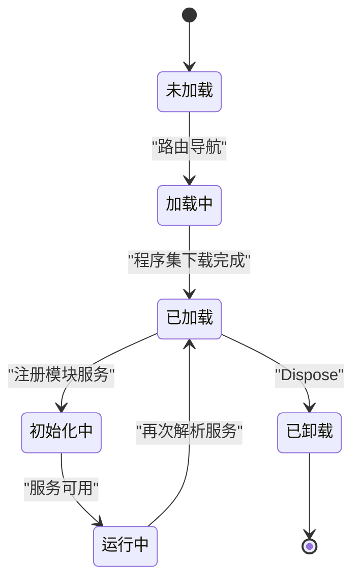
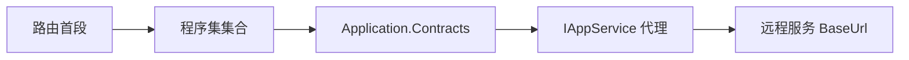

# 插件化扩展机制

<cite>
**本文引用的文件**   
- [README.md](file://README.md)
- [Program.cs](file://src/Host/H.AppLab.Web.Host/H.AppLab.Web.Host/Program.cs)
- [HostAllModule.cs](file://src/Host/H.AppLab.Web.Host/H.AppLab.Web.Host/HostAllModule.cs)
- [Routes.razor（Web 宿主客户端）](file://src/Host/H.AppLab.Web.Host/H.AppLab.Web.Host.Client/Routes.razor)
- [ClientServices.cs（Web 宿主客户端）](file://src/Host/H.AppLab.Web.Host/H.AppLab.Web.Host.Client/ClientServices.cs)
- [LazyModuleServices.cs](file://src/Host/H.AppLab.Web.Host/H.AppLab.Web.Host.Client/LazyModuleServices.cs)
- [Program.cs（WebAssembly 客户端入口）](file://src/Host/H.AppLab.Web.Host/H.AppLab.Web.Host.Client/Program.cs)
- [appsettings.json（客户端配置）](file://src/Host/H.AppLab.Web.Host/H.AppLab.Web.Host.Client/wwwroot/appsettings.json)
- [IAppService.cs](file://src/Utils/H.Abp.Application.Contracts/IAppService.cs)
- [HttpClientProxyInterceptor.cs](file://src/Utils/H.Abp.HttpClientProxy/HttpClientProxyInterceptor.cs)
- [ServiceCollectionExtensions.cs](file://src/Utils/H.Abp.HttpClientProxy/ServiceCollectionExtensions.cs)
- [AbpUrlConvention.cs](file://src/Utils/H.Abp.HttpClientProxy/AbpUrlConvention.cs)
- [RemoteServiceOptions.cs](file://src/Utils/H.Abp.HttpClientProxy/RemoteServiceOptions.cs)
</cite>

## 目录

1. [引言](#引言)
2. [项目结构与定位](#项目结构与定位)
3. [核心扩展模型](#核心扩展模型)
4. [架构总览](#架构总览)
5. [动态模块加载机制](#动态模块加载机制)
6. [运行时扩展点设计](#运行时扩展点设计)
7. [配置隔离与注入](#配置隔离与注入)
8. [插件生命周期管理](#插件生命周期管理)
9. [依赖关系分析](#依赖关系分析)
10. [性能优化建议](#性能优化建议)
11. [安全注意事项](#安全注意事项)
12. [插件开发模板与实践](#插件开发模板与实践)
13. [故障排查指南](#故障排查指南)
14. [结论](#结论)

## 引言

H.AppLab 平台采用模块化架构，支持单体部署与按服务独立部署。从仓库说明可以看出，该项目基于 .NET 与 Blazor，包含宿主程序、共享 UI 组件、低代码引擎、企业级业务服务、系统应用、数据库迁移工具以及通用工具库。

“插件化扩展机制”在当前仓库中并非以传统意义上的可热插拔二进制插件形式出现，而是通过以下机制实现：

- **服务端**：使用 ABP 模块化体系，由统一宿主模块 `HostAllModule` 显式声明依赖各业务模块的程序集和模块类。
- **客户端**：通过 Blazor WebAssembly 的懒加载程序集能力，按路由首段动态下载 `.dll`，并在导航时注册该模块对应的 `IAppService` HTTP 代理。
- **运行时扩展点**：以 `IAppService` 接口契约为核心，配合 `HttpClientProxyInterceptor` 将接口调用转换为 HTTP 请求；Blazor 路由与模块服务注册表共同构成前端扩展点。
- **配置隔离**：每个远程服务在 `RemoteServices` 配置节点中拥有独立的 `BaseUrl`；客户端和服务端分别维护各自的应用设置。
- **生命周期**：服务端的模块依赖由 ABP 模块系统管理；客户端的模块加载由路由触发，服务注册由 `LazyModuleRegistry` 管理。

因此，当前平台的“插件”更准确地说是一个**具备完整 Application.Contracts、Application、Web 层的服务模块**，并通过宿主或客户端的模块注册表接入。

**章节来源**
- [README.md:1-73](file://README.md#L1-L73)

## 项目结构与定位

仓库中与插件化扩展相关的主要位置如下：

| 区域 | 职责 | 关键文件 |
|---|---|---|
| 宿主程序入口 | 初始化 Blazor、SignalR、响应压缩、ABP 应用、静态资源、认证、授权、控制器、Hangfire、Razor 组件及额外程序集 | [Program.cs](file://src/Host/H.AppLab.Web.Host/H.AppLab.Web.Host/Program.cs) |
| 统一宿主模块 | 组合所有业务模块、注册 HTTP 客户端、Cookie 认证、多租户、自动 API 控制器 | [HostAllModule.cs](file://src/Host/H.AppLab.Web.Host/H.AppLab.Web.Host/HostAllModule.cs) |
| 客户端入口 | 创建 WebAssembly 宿主、注册 `LazyModuleRegistry`、替换容器工厂、初始化客户端服务 | [Program.cs（WebAssembly 客户端入口）](file://src/Host/H.AppLab.Web.Host/H.AppLab.Web.Host.Client/Program.cs) |
| 客户端路由 | 定义懒加载程序集映射、路由导航时加载程序集并注册延迟模块服务 | [Routes.razor（Web 宿主客户端）](file://src/Host/H.AppLab.Web.Host/H.AppLab.Web.Host.Client/Routes.razor) |
| 客户端服务注册 | 定义远程服务名称、批量注册命名 HttpClient、按路由键注册 `IAppService` 代理 | [ClientServices.cs（Web 宿主客户端）](file://src/Host/H.AppLab.Web.Host/H.AppLab.Web.Host.Client/ClientServices.cs) |
| 懒加载模块容器 | 提供模块子容器、组合式服务解析器、作用域包装 | [LazyModuleServices.cs](file://src/Host/H.AppLab.Web.Host/H.AppLab.Web.Host.Client/LazyModuleServices.cs) |
| 客户端配置 | 集中定义各远程服务的 `BaseUrl` | [appsettings.json（客户端配置）](file://src/Host/H.AppLab.Web.Host/H.AppLab.Web.Host.Client/wwwroot/appsettings.json) |
| 应用服务契约标记 | 标识可通过 HTTP 代理调用的服务接口 | [IAppService.cs](file://src/Utils/H.Abp.Application.Contracts/IAppService.cs) |
| HTTP 代理拦截器 | 将接口方法调用转换为 HTTP 请求 | [HttpClientProxyInterceptor.cs](file://src/Utils/H.Abp.HttpClientProxy/HttpClientProxyInterceptor.cs) |
| 代理注册扩展 | 扫描 `IAppService` 接口并注册代理 | [ServiceCollectionExtensions.cs](file://src/Utils/H.Abp.HttpClientProxy/ServiceCollectionExtensions.cs) |
| URL 约定 | 将接口名和方法名映射为 ABP 风格 URL | [AbpUrlConvention.cs](file://src/Utils/H.Abp.HttpClientProxy/AbpUrlConvention.cs) |
| 远程服务选项 | 存储远程服务名称到基础地址的映射 | [RemoteServiceOptions.cs](file://src/Utils/H.Abp.HttpClientProxy/RemoteServiceOptions.cs) |



**图表来源**
- [Program.cs:1-112](file://src/Host/H.AppLab.Web.Host/H.AppLab.Web.Host/Program.cs#L1-L112)
- [HostAllModule.cs:1-200](file://src/Host/H.AppLab.Web.Host/H.AppLab.Web.Host/HostAllModule.cs#L1-L200)
- [Program.cs（WebAssembly 客户端入口）:1-13](file://src/Host/H.AppLab.Web.Host/H.AppLab.Web.Host.Client/Program.cs#L1-L13)
- [Routes.razor（Web 宿主客户端）:1-145](file://src/Host/H.AppLab.Web.Host/H.AppLab.Web.Host.Client/Routes.razor#L1-L145)
- [ClientServices.cs（Web 宿主客户端）:1-193](file://src/Host/H.AppLab.Web.Host/H.AppLab.Web.Host.Client/ClientServices.cs#L1-L193)
- [LazyModuleServices.cs:1-141](file://src/Host/H.AppLab.Web.Host/H.AppLab.Web.Host.Client/LazyModuleServices.cs#L1-L141)
- [ServiceCollectionExtensions.cs:1-63](file://src/Utils/H.Abp.HttpClientProxy/ServiceCollectionExtensions.cs#L1-L63)
- [HttpClientProxyInterceptor.cs:1-200](file://src/Utils/H.Abp.HttpClientProxy/HttpClientProxyInterceptor.cs#L1-L200)
- [AbpUrlConvention.cs:1-86](file://src/Utils/H.Abp.HttpClientProxy/AbpUrlConvention.cs#L1-L86)
- [RemoteServiceOptions.cs:1-33](file://src/Utils/H.Abp.HttpClientProxy/RemoteServiceOptions.cs#L1-L33)

**章节来源**
- [Program.cs:1-112](file://src/Host/H.AppLab.Web.Host/H.AppLab.Web.Host/Program.cs#L1-L112)
- [HostAllModule.cs:1-200](file://src/Host/H.AppLab.Web.Host/H.AppLab.Web.Host/HostAllModule.cs#L1-L200)
- [Program.cs（WebAssembly 客户端入口）:1-13](file://src/Host/H.AppLab.Web.Host/H.AppLab.Web.Host.Client/Program.cs#L1-L13)
- [Routes.razor（Web 宿主客户端）:1-145](file://src/Host/H.AppLab.Web.Host/H.AppLab.Web.Host.Client/Routes.razor#L1-L145)
- [ClientServices.cs（Web 宿主客户端）:1-193](file://src/Host/H.AppLab.Web.Host/H.AppLab.Web.Host.Client/ClientServices.cs#L1-L193)
- [LazyModuleServices.cs:1-141](file://src/Host/H.AppLab.Web.Host/H.AppLab.Web.Host.Client/LazyModuleServices.cs#L1-L141)

## 核心扩展模型

当前 H.AppLab 的扩展模型围绕三个核心概念展开：

| 概念 | 含义 | 对应实现 |
|---|---|---|
| **模块** | 一个具有 Application.Contracts、Application、Web 等分层的业务单元 | 例如 Account、Organization、Approval、AI、Testing 等服务模块 |
| **扩展点** | 宿主通过模块声明接入模块；客户端通过路由和代理注册接入模块 | `HostAllModule.DependsOn`、`Routes.razor.LazyAssemblies`、`ClientServices.LazyModuleRegistrations` |
| **契约** | 前端只依赖 `IAppService` 接口，不感知后端是进程内实现还是 HTTP 调用 | `IAppService`、`HttpClientProxyInterceptor`、`AbpUrlConvention` |

### 模块边界

每个服务模块通常遵循以下结构：



**图表来源**
- [README.md:1-73](file://README.md#L1-L73)
- [ServiceCollectionExtensions.cs:1-63](file://src/Utils/H.Abp.HttpClientProxy/ServiceCollectionExtensions.cs#L1-L63)

### 契约标记

`IAppService` 是一个标记接口，用于标识可以通过 HTTP 代理远程调用的服务接口。其设计非常简洁：

| 元素 | 说明 |
|---|---|
| 命名空间 | `H.Abp.Application.Contracts` |
| 类型 | 接口 |
| 用途 | 作为 `AddHttpClientProxies` 扫描的目标基接口 |
| 约束 | 被扫描的接口必须继承该接口，且不能是 `IAppService` 本身 |

这种设计让插件开发者只需要定义普通 C# 接口并继承 `IAppService`，即可被客户端自动发现并生成 HTTP 代理。

**章节来源**
- [IAppService.cs:1-8](file://src/Utils/H.Abp.Application.Contracts/IAppService.cs#L1-L8)
- [ServiceCollectionExtensions.cs:27-42](file://src/Utils/H.Abp.HttpClientProxy/ServiceCollectionExtensions.cs#L27-L42)
- [README.md:1-73](file://README.md#L1-L73)

## 架构总览

H.AppLab 的扩展架构可以划分为四个层次：

1. **宿主层**：负责启动 Blazor Web App、SignalR、JSON 序列化、响应压缩、ABP 模块、认证、授权、静态资源和 Razor 组件。
2. **模块层**：由各业务模块组成，每个模块对外暴露 `IAppService` 接口。
3. **客户端运行时层**：负责按需加载程序集、注册代理、管理模块子容器。
4. **HTTP 代理层**：负责将接口调用转换为符合 ABP 约定的 HTTP 请求。



**图表来源**
- [Routes.razor（Web 宿主客户端）:1-145](file://src/Host/H.AppLab.Web.Host/H.AppLab.Web.Host.Client/Routes.razor#L1-L145)
- [ClientServices.cs（Web 宿主客户端）:1-193](file://src/Host/H.AppLab.Web.Host/H.AppLab.Web.Host.Client/ClientServices.cs#L1-L193)
- [LazyModuleServices.cs:1-141](file://src/Host/H.AppLab.Web.Host/H.AppLab.Web.Host.Client/LazyModuleServices.cs#L1-L141)
- [HttpClientProxyInterceptor.cs:1-200](file://src/Utils/H.Abp.HttpClientProxy/HttpClientProxyInterceptor.cs#L1-L200)

## 动态模块加载机制

### 程序集发现

客户端并未使用反射扫描整个文件系统查找插件程序集，而是采用**声明式程序集映射**。核心逻辑位于 `Routes.razor` 中的 `LazyAssemblies` 字典：

| 路由首段 | 加载的程序集 |
|---|---|
| `organization` | `H.Organization.Web.dll`、`H.Organization.Application.Contracts.dll` |
| `approval` | `H.Approval.Web.dll`、`H.Approval.Application.Contracts.dll`、`H.Organization.Application.Contracts.dll` |
| `testing` | `H.Testing.Web.dll`、`H.Testing.Application.Contracts.dll` |
| `notification` | `H.Notification.Web.dll`、`H.Notification.Application.Contracts.dll` |
| `order` | `H.Order.Web.dll`、`H.Order.Application.Contracts.dll` |
| `setting` | `H.Setting.Web.dll`、`H.Setting.Application.Contracts.dll` |
| `supply-chain` | `H.SupplyChain.Web.dll`、`H.SupplyChain.Application.Contracts.dll` |
| `background-task` | `H.BackgroundTask.Web.dll`、`H.BackgroundTask.Application.Contracts.dll` |
| `file` | `H.File.Web.dll`、`H.File.Application.Contracts.dll`、`Markdig.dll` |
| `account` | `H.Account.Web.dll`、`H.Account.Application.Contracts.dll` |
| `ai` | `H.AI.Web.dll`、`H.AI.Application.Contracts.dll` |
| `system` | `H.SystemPortal.Web.dll`、`H.SystemPortal.Application.Contracts.dll`、`H.Enterprise.Application.Contracts.dll` |
| `devhome` | 设计器、渲染器、元数据、组件、LowCode 基础链等多个程序集 |
| `designengine` | 设计器及其依赖链 |
| `app` | 渲染器及其依赖链 |

这个映射本质上是**插件清单**：它告诉 Blazor 当用户进入某个路由时，需要下载哪些程序集。

### 类型扫描

类型扫描发生在两个层面：

1. **服务端**：`HostAllModule.ConfigureServices` 中通过 `Configure<AbpAspNetCoreMvcOptions>` 显式调用 `ConventionalControllers.Create(...)` 注册各模块的程序集，从而发现控制器。
2. **客户端**：`ServiceCollectionExtensions.AddHttpClientProxies` 扫描传入程序集中的接口，筛选出继承 `IAppService` 的非泛型接口，并为每个接口注册代理。



**图表来源**
- [ServiceCollectionExtensions.cs:27-42](file://src/Utils/H.Abp.HttpClientProxy/ServiceCollectionExtensions.cs#L27-L42)
- [HostAllModule.cs:120-170](file://src/Host/H.AppLab.Web.Host/H.AppLab.Web.Host/HostAllModule.cs#L120-L170)

### 反射加载机制

客户端的动态加载依赖 Blazor WebAssembly 提供的 `LazyAssemblyLoader`。流程如下：

1. 路由导航时提取路径第一段。
2. 查找 `LazyAssemblies` 映射。
3. 过滤尚未加载的程序集。
4. 调用 `AssemblyLoader.LoadAssembliesAsync` 异步下载。
5. 将加载结果缓存到 `_loadedAssemblies`。
6. 更新 `AdditionalAssemblies`，使路由能够识别新程序集中的页面。

服务端则不使用 `AssemblyLoadContext` 进行运行时插件卸载，而是通过 ABP 模块系统在进程启动时加载所有依赖模块。

**章节来源**
- [Routes.razor（Web 宿主客户端）:1-145](file://src/Host/H.AppLab.Web.Host/H.AppLab.Web.Host.Client/Routes.razor#L1-L145)
- [ServiceCollectionExtensions.cs:27-42](file://src/Utils/H.Abp.HttpClientProxy/ServiceCollectionExtensions.cs#L27-L42)
- [HostAllModule.cs:100-170](file://src/Host/H.AppLab.Web.Host/H.AppLab.Web.Host/HostAllModule.cs#L100-L170)

## 运行时扩展点设计

### IAppService 接口代理

`HttpClientProxyInterceptor<TService>` 是基于 `DispatchProxy` 实现的 HTTP 客户端代理。其核心行为包括：

| 行为 | 实现方式 |
|---|---|
| 拦截接口方法调用 | 继承 `DispatchProxy` 并重写 `Invoke` |
| 解析 HTTP 方法与路径 | 使用 `AbpUrlConvention.GetActionInfo` |
| 构建 URL | 拼接 `/api/app/{controller}/{action}` |
| 处理路径参数 | 支持名为 `id` 的参数和以 `Id` 结尾的参数 |
| 处理查询参数 | 简单类型放入查询字符串，复杂 GET/DELETE 参数展开为属性 |
| 处理请求体 | POST/PUT 时将复杂参数序列化为 JSON 请求体 |
| 处理返回值 | 支持 `Task` 和 `Task<T>` |
| 错误处理 | 调用 `EnsureSuccessStatusCode` 抛出非成功状态异常 |



**图表来源**
- [HttpClientProxyInterceptor.cs:1-200](file://src/Utils/H.Abp.HttpClientProxy/HttpClientProxyInterceptor.cs#L1-L200)
- [AbpUrlConvention.cs:1-86](file://src/Utils/H.Abp.HttpClientProxy/AbpUrlConvention.cs#L1-L86)
- [RemoteServiceOptions.cs:1-33](file://src/Utils/H.Abp.HttpClientProxy/RemoteServiceOptions.cs#L1-L33)

### Blazor 组件注册

Blazor 组件注册主要通过两种方式实现：

1. **服务端**：`Program.cs` 中通过 `MapRazorComponents<App>().AddInteractiveWebAssemblyRenderMode().AddAdditionalAssemblies(...)` 显式注册各 Web 模块的 `_Imports` 程序集，使其 Razor 组件可用。
2. **客户端**：Blazor WebAssembly 的路由系统会自动发现程序集中的页面组件；懒加载程序集加载后，路由会更新 `AdditionalAssemblies` 以识别新页面。

这里没有使用统一的“组件注册中心”，而是依赖 Blazor 内置的程序集发现和路由机制。

### 路由动态注册

客户端路由并不动态添加路由规则，而是通过以下方式实现动态效果：

1. `Routes.razor` 中的 `LazyAssemblies` 将路由首段映射到程序集列表。
2. 导航时加载程序集。
3. `ClientServices.RegisterLazyModule` 根据路由首段或模块键注册模块服务。
4. `LazyModuleRegistry` 为每个模块构建独立子容器。
5. `CompositeServiceProvider` 在根容器解析失败时回退到模块子容器。



**图表来源**
- [Routes.razor（Web 宿主客户端）:1-145](file://src/Host/H.AppLab.Web.Host/H.AppLab.Web.Host.Client/Routes.razor#L1-L145)
- [ClientServices.cs（Web 宿主客户端）:100-193](file://src/Host/H.AppLab.Web.Host/H.AppLab.Web.Host.Client/ClientServices.cs#L100-L193)
- [LazyModuleServices.cs:1-141](file://src/Host/H.AppLab.Web.Host/H.AppLab.Web.Host.Client/LazyModuleServices.cs#L1-L141)

**章节来源**
- [Program.cs:1-112](file://src/Host/H.AppLab.Web.Host/H.AppLab.Web.Host/Program.cs#L1-L112)
- [HttpClientProxyInterceptor.cs:1-200](file://src/Utils/H.Abp.HttpClientProxy/HttpClientProxyInterceptor.cs#L1-L200)
- [Routes.razor（Web 宿主客户端）:1-145](file://src/Host/H.AppLab.Web.Host/H.AppLab.Web.Host.Client/R Routes.razor#L1-L145)
- [ClientServices.cs（Web 宿主客户端）:100-193](file://src/Host/H.AppLab.Web.Host/H.AppLab.Web.Host.Client/ClientServices.cs#L100-L193)
- [LazyModuleServices.cs:1-141](file://src/Host/H.AppLab.Web.Host/H.AppLab.Web.Host.Client/LazyModuleServices.cs#L1-L141)

## 配置隔离与注入

### 配置文件分离

平台存在两套主要配置：

| 配置来源 | 位置 | 用途 |
|---|---|---|
| 服务端配置 | `src/Host/H.AppLab.Web.Host/H.AppLab.Web.Host/appsettings.json` | 连接字符串、Meta 路径、测试模板路径、RemoteServices、Sites |
| 客户端配置 | `src/Host/H.AppLab.Web.Host/H.AppLab.Web.Host.Client/wwwroot/appsettings.json` | 各远程服务的 `BaseUrl` |

客户端配置仅包含 `RemoteServices`，而服务端配置还包含数据库连接、元数据文件路径、站点信息等。

### 环境变量注入

当前仓库中没有看到显式的环境变量绑定逻辑，但 ABP 和 ASP.NET Core 的配置系统默认支持环境变量覆盖。远程服务配置通过 `IConfiguration` 读取，因此可以在部署时通过环境变量或外部配置文件覆盖 `RemoteServices` 节点。

### 配置验证

当前实现中没有显式的配置验证模型，例如没有使用 DataAnnotations 或 FluentValidation 对 `RemoteServiceOptions` 进行校验。`RemoteServiceOptions.GetBaseUrl` 在未找到服务时会返回空字符串，这可能导致后续 HTTP 请求失败。

| 风险 | 说明 |
|---|---|
| 缺少必填字段校验 | 如果某个远程服务未配置 `BaseUrl`，代理仍会尝试创建请求 |
| 缺少 URL 格式校验 | 未验证 `BaseUrl` 是否为合法 URI |
| 缺少运行时健康检查 | 无法在服务启动时确认远程服务是否可达 |

**章节来源**
- [appsettings.json（客户端配置）:1-52](file://src/Host/H.AppLab.Web.Host/H.AppLab.Web.Host.Client/wwwroot/appsettings.json#L1-L52)
- [ServiceCollectionExtensions.cs:15-25](file://src/Utils/H.Abp.HttpClientProxy/ServiceCollectionExtensions.cs#L15-L25)
- [RemoteServiceOptions.cs:1-33](file://src/Utils/H.Abp.HttpClientProxy/RemoteServiceOptions.cs#L1-L33)

## 插件生命周期管理

### 加载阶段

#### 服务端

服务端的模块加载由 ABP 模块系统管理：

1. `Program.cs` 调用 `builder.AddApplicationAsync<HostAllModule>()`。
2. `HostAllModule` 通过 `[DependsOn(...)]` 声明依赖的所有应用模块。
3. ABP 按依赖顺序加载模块并执行生命周期回调。

#### 客户端

客户端的模块加载由路由触发：

1. 用户导航到某个路由。
2. `Routes.razor` 根据路由首段查找 `LazyAssemblies`。
3. 调用 `LazyAssemblyLoader.LoadAssembliesAsync` 下载程序集。
4. 将程序集加入 `_additionalAssemblies`。

### 初始化阶段

#### 服务端

`HostAllModule.ConfigureServices` 中完成：

- 注册 `HttpClient`
- 注册 `HttpContextAccessor`
- 配置 Cookie 认证
- 配置多租户
- 配置外部登录
- 注册 `LowCodeAppState`
- 注册全局 Toast 服务
- 配置自动 API 控制器

#### 客户端

客户端初始化分为两步：

1. 启动时注册基础服务：`LazyModuleRegistry`、`ClientServices.Configure`。
2. 导航时注册模块服务：`ClientServices.RegisterLazyModule`。

### 运行阶段

运行时由两部分组成：

1. **Blazor 组件树**：由路由决定加载哪些页面组件。
2. **服务解析**：由 `CompositeServiceProvider` 优先从根容器解析，再回退到模块子容器。

### 卸载阶段

当前实现中**没有真正的插件卸载机制**：

- 服务端使用 ABP 模块系统，模块在进程生命周期内常驻。
- 客户端程序集一旦通过 `LazyAssemblyLoader` 加载，就保留在内存中，并由 `_loadedAssemblies` 缓存。
- `LazyModuleRegistry` 实现了 `IDisposable`，会释放模块子容器，但不会卸载已加载的程序集。

如果需要支持运行时卸载，需要考虑：

- 使用 `AssemblyLoadContext` 隔离插件程序集。
- 避免根程序集持有插件对象引用。
- 实现明确的卸载回调。
- 清理事件订阅、定时器、缓存和临时文件。



**图表来源**
- [Program.cs:1-112](file://src/Host/H.AppLab.Web.Host/H.AppLab.Web.Host/Program.cs#L1-L112)
- [HostAllModule.cs:1-200](file://src/Host/H.AppLab.Web.Host/H.AppLab.Web.Host/HostAllModule.cs#L1-L200)
- [Routes.razor（Web 宿主客户端）:1-145](file://src/Host/H.AppLab.Web.Host/H.AppLab.Web.Host.Client/Routes.razor#L1-L145)
- [LazyModuleServices.cs:1-141](file://src/Host/H.AppLab.Web.Host/H.AppLab.Web.Host.Client/LazyModuleServices.cs#L1-L141)

**章节来源**
- [Program.cs:1-112](file://src/Host/H.AppLab.Web.Host/H.AppLab.Web.Host/Program.cs#L1-L112)
- [HostAllModule.cs:1-200](file://src/Host/H.AppLab.Web.Host/H.AppLab.Web.Host/HostAllModule.cs#L1-L200)
- [Routes.razor（Web 宿主客户端）:1-145](file://src/Host/H.AppLab.Web.Host/H.AppLab.Web.Host.Client/Routes.razor#L1-L145)
- [LazyModuleServices.cs:1-141](file://src/Host/H.AppLab.Web.Host/H.AppLab.Web.Host.Client/LazyModuleServices.cs#L1-L141)

## 依赖关系分析

### 客户端模块与服务注册映射

`ClientServices.cs` 定义了路由首段到模块服务注册的映射关系：

| 路由首段 | 模块键 | 注册行为 |
|---|---|---|
| `organization` | `organization` | 注册 Organization 代理 |
| `approval` | `approval` | 注册 Approval 和 Organization 代理 |
| `testing` | `testing` | 注册 Testing 代理、事件通知器、当前项目选择状态 |
| `notification` | `notification` | 注册 Notification 代理 |
| `order` | `order` | 注册 Order 代理 |
| `setting` | `setting` | 注册 Setting 代理 |
| `supply-chain` | `supply-chain` | 注册 SupplyChain 代理 |
| `background-task` | `background-task` | 注册 BackgroundTask 代理 |
| `file` | `file` | 注册 File 代理 |
| `account` | `account` | 注册 Account 代理 |
| `ai` | `ai` | 注册 AI 代理 |
| `system` | `system` | 注册 SystemPortal 和 Enterprise 代理 |
| `devhome` | `lowcode-render`、`lowcode-design` | 注册 LowCode 渲染和设计代理 |
| `designengine` | `lowcode-render`、`lowcode-design` | 注册 LowCode 渲染和设计代理 |
| `app` | `lowcode-render` | 注册 LowCode 渲染代理 |

### 程序集依赖关系

`Routes.razor` 中的 `LazyAssemblies` 明确了每个路由首段所需的程序集集合。例如 `devhome` 和 `designengine` 都依赖大量 LowCode 基础库，包括设计器、渲染器、元数据、组件和工具库。



**图表来源**
- [Routes.razor（Web 宿主客户端）:1-145](file://src/Host/H.AppLab.Web.Host/H.AppLab.Web.Host.Client/Routes.razor#L1-L145)
- [ClientServices.cs（Web 宿主客户端）:100-193](file://src/Host/H.AppLab.Web.Host/H.AppLab.Web.Host.Client/ClientServices.cs#L100-L193)

**章节来源**
- [Routes.razor（Web 宿主客户端）:1-145](file://src/Host/H.AppLab.Web.Host/H.AppLab.Web.Host.Client/Routes.razor#L1-L145)
- [ClientServices.cs（Web 宿主客户端）:100-193](file://src/Host/H.AppLab.Web.Host/H.AppLab.Web.Host.Client/ClientServices.cs#L100-L193)

## 性能优化建议

### 当前已实现的优化

1. **Blazor WebAssembly 懒加载**：首页只加载必要程序集，其他应用在导航时按需下载。
2. **响应压缩**：启用 Brotli 和 Gzip，并对 WASM 程序集启用压缩传输。
3. **静态资源指纹缓存**：WASM 程序集使用内容哈希文件名，浏览器可使用不可变长缓存。
4. **Release 模式 AOT 与裁剪**：减少最终发布包体积。
5. **命名 HttpClient**：为不同远程服务使用独立 HttpClient，便于单独配置超时和消息处理器。
6. **模块子容器**：每个模块构建独立 ServiceProvider，避免重复注册和容器膨胀。

### 可进一步优化的方向

| 方向 | 建议 |
|---|---|
| 程序集去重 | 合并 `LazyAssemblies` 与 `ClientServices` 中的模块映射，避免两处维护 |
| 配置校验 | 启动时对 `RemoteServices` 进行必填校验和 URL 格式校验 |
| 代理缓存 | 对频繁使用的 `IAppService` 实例增加轻量级本地缓存 |
| 并发控制 | 对同一模块的重复加载请求进行去重 |
| 加载进度反馈 | 在 `Navigating` 区域显示具体模块加载进度 |
| 失败重试 | 对网络失败的程序集加载增加重试策略 |
| 内存监控 | 记录已加载程序集数量和大小，防止无限增长 |
| 卸载支持 | 如需热插拔，引入 `AssemblyLoadContext` 并实现卸载钩子 |

**章节来源**
- [Program.cs:1-112](file://src/Host/H.AppLab.Web.Host/H.AppLab.Web.Host/Program.cs#L1-L112)
- [Routes.razor（Web 宿主客户端）:1-145](file://src/Host/H.AppLab.Web.Host/H.AppLab.Web.Host.Client/Routes.razor#L1-L145)
- [ClientServices.cs（Web 宿主客户端）:1-193](file://src/Host/H.AppLab.Web.Host/H.AppLab.Web.Host.Client/ClientServices.cs#L1-L193)

## 安全注意事项

### 当前安全措施

1. **HTTPS 重定向**：生产环境启用 HTTPS。
2. **HSTS**：启用 HTTP Strict Transport Security。
3. **反 CSRF**：禁用 ABP 自动验证 AntiForgery，因为 WASM 使用 Cookie 认证，SameSite Cookie 已提供足够保护。
4. **认证方案**：使用 Cookie 认证，区分系统 Cookie 和业务 Cookie。
5. **多租户**：启用 ABP 多租户，并从 Claim 中解析租户。
6. **错误页面**：使用自定义错误页面和状态码处理。

### 需要关注的安全点

| 风险 | 说明 |
|---|---|
| 远程服务地址可配置 | `BaseUrl` 来自配置，若未严格校验可能指向恶意服务器 |
| 动态代理未做请求白名单 | `HttpClientProxyInterceptor` 对所有匹配的 `IAppService` 接口开放 |
| 客户端 Cookie 透传 | `CookieHandler` 会将 Cookie 发送到远程服务，需确保远程服务可信 |
| 无插件签名校验 | 当前没有对加载的程序集进行签名或完整性校验 |
| 无沙箱隔离 | 程序集加载后仍可访问托管代码能力，不存在运行时沙箱 |
| 输入验证依赖服务端 | 客户端代理只负责序列化参数，不执行业务验证 |

建议在生产环境中：

- 对 `RemoteServices.BaseUrl` 做域名白名单校验。
- 使用受信任的远程服务网关。
- 为插件程序集引入签名验证。
- 限制插件可访问的资源范围。
- 记录远程服务调用日志和审计信息。

**章节来源**
- [Program.cs:1-112](file://src/Host/H.AppLab.Web.Host/H.AppLab.Web.Host/Program.cs#L1-L112)
- [HostAllModule.cs:120-200](file://src/Host/H.AppLab.Web.Host/H.AppLab.Web.Host/HostAllModule.cs#L120-L200)
- [HttpClientProxyInterceptor.cs:1-200](file://src/Utils/H.Abp.HttpClientProxy/HttpClientProxyInterceptor.cs#L1-L200)

## 插件开发模板与实践

### 新增插件所需步骤

#### 第一步：定义应用服务契约

在服务的 `Application.Contracts` 项目中定义继承 `IAppService` 的接口。例如已有服务中的 `IAccountAppService`、`IOrganizationAppService`、`IAiGenerateAppService` 等。

| 要求 | 说明 |
|---|---|
| 接口必须继承 `IAppService` | 否则不会被 `AddHttpClientProxies` 扫描 |
| 接口不能是泛型接口 | 当前扫描逻辑排除泛型接口 |
| 方法返回类型必须是 `Task` 或 `Task<T>` | 其他返回类型会抛出异常 |
| 方法命名应遵循 ABP 约定 | 例如 `GetXxx`、`CreateXxx`、`UpdateXxx`、`DeleteXxx` |

#### 第二步：注册客户端代理

在 `ClientServices.cs` 的 `LazyModuleRegistrations` 中添加路由首段到模块键的映射，并在其中调用 `AddHttpClientProxies`。

示例结构：

```text
[路由首段] = (s, _) =>
    s.AddHttpClientProxies(typeof(XXXApplicationContractsModule).Assembly, XXXRemoteServiceName),
```

#### 第三步：配置懒加载程序集

在 `Routes.razor` 的 `LazyAssemblies` 中添加路由首段到程序集数组的映射。

示例结构：

```text
["xxx"] = ["H.XXX.Web.dll", "H.XXX.Application.Contracts.dll"],
```

#### 第四步：配置远程服务地址

在客户端 `wwwroot/appsettings.json` 的 `RemoteServices` 中添加服务名和 `BaseUrl`。

#### 第五步：服务端注册模块

如果是单体部署，需要在 `HostAllModule` 的 `[DependsOn]` 中添加对应模块，并在 `ConfigureAutoApiControllers` 中注册控制器程序集。

### 现有参考实现

| 插件类型 | 参考位置 |
|---|---|
| 企业级服务模块 | `src/Services/*` 下的各个服务 |
| 系统应用模块 | `src/System/*` |
| 低代码设计引擎 | `src/LowCode/DesignEngine` |
| 低代码渲染引擎 | `src/LowCode/RenderEngine` |
| 客户端代理注册 | `ClientServices.cs` |
| 路由懒加载 | `Routes.razor` |
| HTTP 代理实现 | `HttpClientProxyInterceptor.cs` |

### 推荐最佳实践

1. **契约优先**：先定义 `IAppService` 接口，再实现服务端逻辑。
2. **模块内聚**：每个插件只暴露必要的接口，避免跨模块隐式依赖。
3. **配置外置**：不要硬编码 `BaseUrl`、连接字符串等敏感配置。
4. **版本兼容**：保持接口向后兼容，避免破坏已有客户端调用。
5. **错误语义清晰**：使用明确的 DTO 和错误响应，而不是裸抛异常。
6. **幂等设计**：GET、DELETE 等方法应保证幂等。
7. **分页规范**：列表接口建议使用分页 DTO，如 `PagedResultDto`。
8. **权限控制**：在服务端对接口方法进行授权校验。

**章节来源**
- [IAppService.cs:1-8](file://src/Utils/H.Abp.Application.Contracts/IAppService.cs#L1-L8)
- [HttpClientProxyInterceptor.cs:1-200](file://src/Utils/H.Abp.HttpClientProxy/HttpClientProxyInterceptor.cs#L1-L200)
- [ServiceCollectionExtensions.cs:27-63](file://src/Utils/H.Abp.HttpClientProxy/ServiceCollectionExtensions.cs#L27-L63)
- [Routes.razor（Web 宿主客户端）:1-145](file://src/Host/H.AppLab.Web.Host/H.AppLab.Web.Host.Client/Routes.razor#L1-L145)
- [ClientServices.cs（Web 宿主客户端）:100-193](file://src/Host/H.AppLab.Web.Host/H.AppLab.Web.Host.Client/ClientServices.cs#L100-L193)
- [HostAllModule.cs:100-200](file://src/Host/H.AppLab.Web.Host/H.AppLab.Web.Host/HostAllModule.cs#L100-L200)

## 故障排查指南

### 常见问题

| 现象 | 可能原因 | 排查建议 |
|---|---|---|
| 页面导航后卡在加载中 | 程序集未正确配置在 `LazyAssemblies` 中 | 检查路由首段与程序集映射 |
| 页面找不到 | 程序集已加载但未加入 `AdditionalAssemblies` | 检查 `OnNavigateAsync` 中更新逻辑 |
| `IAppService` 解析失败 | 未在 `LazyModuleRegistrations` 中注册模块代理 | 检查 `ClientServices` 中的模块注册 |
| HTTP 调用 404 | URL 约定不匹配或服务端未注册控制器 | 检查接口命名和 `AbpUrlConvention` |
| 远程服务地址为空 | `RemoteServices` 中未配置对应服务 | 检查客户端或服务端配置 |
| Cookie 未携带 | `CookieHandler` 未添加到命名 HttpClient | 检查 `ClientServices.Configure` |
| 模块服务冲突 | 多个模块注册了相同服务 | 检查模块键和服务生命周期 |
| 程序集重复加载 | 多处引用相同程序集但未去重 | 检查 `LazyAssemblies` 和模块依赖 |

### 调试技巧

1. **查看已加载程序集**：在 `Routes.razor` 中检查 `_loadedAssemblies`。
2. **查看模块注册状态**：在 `LazyModuleRegistry` 中检查 `_registeredKeys`。
3. **查看远程服务配置**：检查 `RemoteServiceOptions` 是否正确加载 `BaseUrl`。
4. **查看 HTTP 请求**：通过浏览器开发者工具或 Fiddler 观察代理生成的 URL。
5. **查看服务端控制器路由**：确认 ABP 自动控制器已注册。
6. **启用详细错误**：开发环境下 SignalR 已启用详细错误输出。

**章节来源**
- [Routes.razor（Web 宿主客户端）:1-145](file://src/Host/H.AppLab.Web.Host/H.AppLab.Web.Host.Client/Routes.razor#L1-L145)
- [ClientServices.cs（Web 宿主客户端）:1-193](file://src/Host/H.AppLab.Web.Host/H.AppLab.Web.Host.Client/ClientServices.cs#L1-L193)
- [LazyModuleServices.cs:1-141](file://src/Host/H.AppLab.Web.Host/H.AppLab.Web.Host.Client/LazyModuleServices.cs#L1-L141)
- [HttpClientProxyInterceptor.cs:1-200](file://src/Utils/H.Abp.HttpClientProxy/HttpClientProxyInterceptor.cs#L1-L200)
- [AbpUrlConvention.cs:1-86](file://src/Utils/H.Abp.HttpClientProxy/AbpUrlConvention.cs#L1-L86)
- [RemoteServiceOptions.cs:1-33](file://src/Utils/H.Abp.HttpClientProxy/RemoteServiceOptions.cs#L1-L33)

## 结论

H.AppLab 平台的插件化扩展机制并不是传统意义上的热插拔插件系统，而是一个基于模块化架构、Blazor WebAssembly 懒加载和 HTTP 代理契约的现代扩展方案。其核心特征如下：

- **扩展边界清晰**：每个插件是一个完整的业务模块，包含契约、应用服务、数据访问和 Web 层。
- **加载时机可控**：客户端通过路由懒加载程序集，避免一次性加载全部依赖。
- **扩展点稳定**：`IAppService` 是前后端解耦的关键契约，代理机制屏蔽了 HTTP 调用细节。
- **配置可隔离**：每个远程服务拥有独立的 `BaseUrl`，便于多环境和多服务部署。
- **生命周期明确**：服务端由 ABP 模块管理，客户端由路由和模块容器管理。
- **可扩展性强**：当前实现为未来引入签名校验、沙箱隔离、运行时卸载等高级特性预留了空间。

对于插件开发者而言，最重要的原则是：**契约先行、配置外置、边界清晰、错误可控**。只要遵循这些原则，就可以像现有 Account、Organization、AI、Testing 等服务一样，平滑地集成到 H.AppLab 平台中。