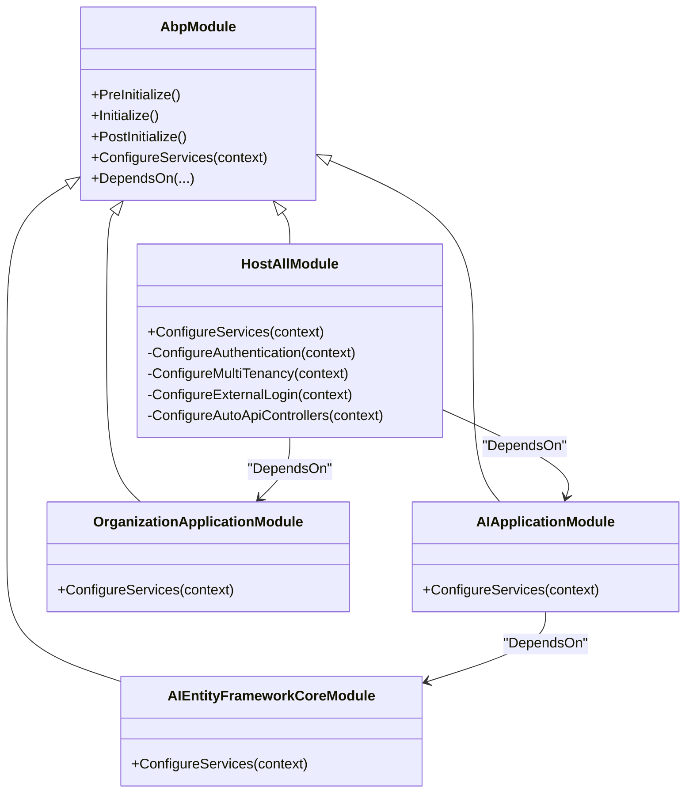
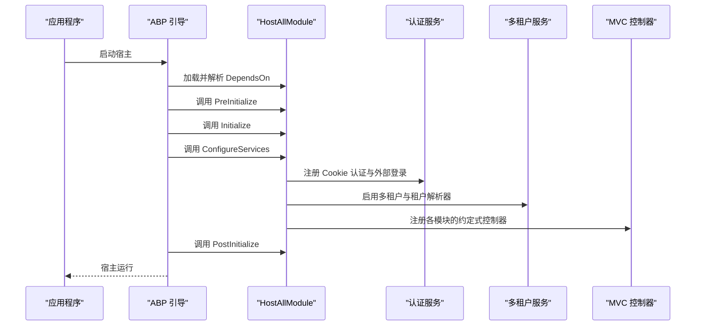
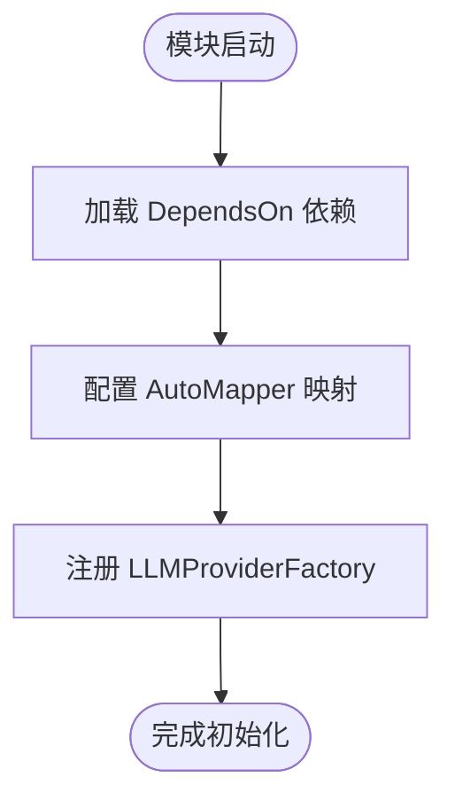
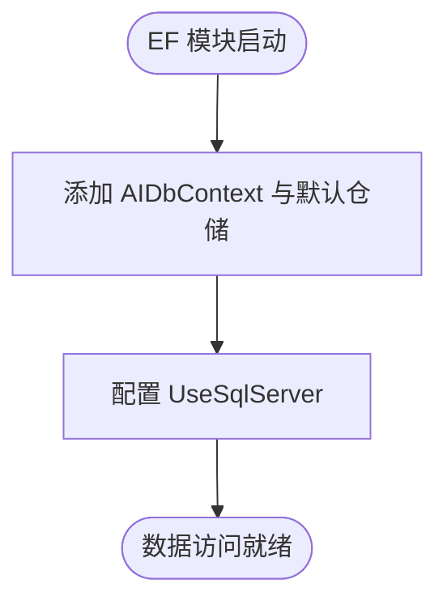
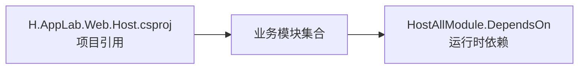

# 模块依赖管理

<cite>
**本文引用的文件**   
- [HostAllModule.cs](file://src/Host/H.AppLab.Web.Host/H.AppLab.Web.Host/HostAllModule.cs)
- [H.AppLab.Web.Host.csproj](file://src/Host/H.AppLab.Web.Host/H.AppLab.Web.Host/H.AppLab.Web.Host.csproj)
- [AIApplicationModule.cs](file://src/Services/AI/H.AI.Application/AIApplicationModule.cs)
- [AIEntityFrameworkCoreModule.cs](file://src/Services/AI/H.AI.EntityFrameworkCore/AIEntityFrameworkCoreModule.cs)
- [OrganizationApplicationModule.cs](file://src/Services/Organization/H.Organization.Application/OrganizationApplicationModule.cs)
</cite>

## 目录
1. [引言](#引言)
2. [项目结构与定位](#项目结构与定位)
3. [核心组件](#核心组件)
4. [架构总览](#架构总览)
5. [详细组件分析](#详细组件分析)
6. [依赖关系分析](#依赖关系分析)
7. [性能与可维护性](#性能与可维护性)
8. [故障排查指南](#故障排查指南)
9. [结论](#结论)
10. [附录：工具与最佳实践](#附录工具与最佳实践)

## 引言
本文面向 H.AppLab 平台，系统性说明基于 ABP Framework 的模块依赖管理机制。重点覆盖：
- IModule 的实现方式与 ModuleDependency（在 ABP 中体现为 DependsOn）属性配置；
- 模块启动生命周期与顺序控制（PreInitialize、Initialize、PostInitialize）；
- 循环依赖的检测与化解策略（接口隔离、事件总线解耦）；
- NuGet 包版本管理与项目引用关系；
- 模块依赖图生成工具与常见问题的诊断和解决方案。

## 项目结构与定位
H.AppLab 是一个多模块 .NET 应用，采用分层与领域服务拆分：
- Host 层：Web 宿主入口，聚合所有业务模块；
- Services 层：按业务域划分的应用模块、实体框架模块等；
- LowCode 层：低代码设计引擎与渲染引擎相关模块；
- System 层：企业级与系统门户相关模块；
- Utils 层：通用工具库与 ABP 扩展。

```mermaid
graph TB
    subgraph "宿主"
        HOST["H.AppLab.Web.Host<br/>统一宿主模块"]
    end

    subgraph "低代码"
        DESIGN_APP["DesignEngine.Application"]
        RENDER_APP["RenderEngine.Application"]
    end

    subgraph "业务服务"
        ACCOUNT["Account.Application"]
        AI["AI.Application"]
        ORG["Organization.Application"]
        APPROVAL["Approval.Application"]
        ORDER["Order.Application"]
        SETTING["Setting.Application"]
        SUPPLYCHAIN["SupplyChain.Application"]
        BACKGROUND["BackgroundTask.Application"]
        FILE["File.Application"]
        NOTIFICATION["Notification.Application"]
        ENTERPRISE["Enterprise.Application"]
        SYSTEMPORTAL["SystemPortal.Application"]
        TESTING["Testing.Application"]
        PORTAL["Portal.Application"]
    end

    HOST --> DESIGN_APP
    HOST --> RENDER_APP
    HOST --> ACCOUNT
    HOST --> AI
    HOST --> ORG
    HOST --> APPROVAL
    HOST --> ORDER
    HOST --> SETTING
    HOST --> SUPPLYCHAIN
    HOST --> BACKGROUND
    HOST --> FILE
    HOST --> NOTIFICATION
    HOST --> ENTERPRISE
    HOST --> SYSTEMPORTAL
    HOST --> TESTING
    HOST --> PORTAL
```

图表来源
- [H.AppLab.Web.Host.csproj:1-64](file://src/Host/H.AppLab.Web.Host/H.AppLab.Web.Host/H.AppLab.Web.Host.csproj#L1-L64)
- [HostAllModule.cs:1-80](file://src/Host/H.AppLab.Web.Host/H.AppLab.Web.Host/HostAllModule.cs#L1-L80)

章节来源
- [H.AppLab.Web.Host.csproj:1-64](file://src/Host/H.AppLab.Web.Host/H.AppLab.Web.Host/H.AppLab.Web.Host.csproj#L1-L64)

## 核心组件
- 统一宿主模块：HostAllModule 负责聚合各业务模块，并通过 DependsOn 声明模块依赖，同时完成认证、多租户、跨站请求防护、自动 API 控制器注册等服务配置。
- 业务应用模块：例如 AIApplicationModule、OrganizationApplicationModule 等，通过 DependsOn 引用底层数据访问模块或共享基础模块，并在 ConfigureServices 中完成映射与服务注册。
- 数据访问模块：例如 AIEntityFrameworkCoreModule，使用 AddAbpDbContext 与 Configure<AbpDbContextOptions> 注册数据库上下文与存储提供程序。

章节来源
- [HostAllModule.cs:1-207](file://src/Host/H.AppLab.Web.Host/H.AppLab.Web.Host/HostAllModule.cs#L1-L207)
- [AIApplicationModule.cs:1-23](file://src/Services/AI/H.AI.Application/AIApplicationModule.cs#L1-L23)
- [AIEntityFrameworkCoreModule.cs:1-26](file://src/Services/AI/H.AI.EntityFrameworkCore/AIEntityFrameworkCoreModule.cs#L1-L26)
- [OrganizationApplicationModule.cs:1-15](file://src/Services/Organization/H.Organization.Application/OrganizationApplicationModule.cs#L1-L15)

## 架构总览
ABP 模块系统以 AbpModule 为核心，通过 DependsOn 构建依赖图，并按生命周期方法有序初始化。

图表来源
- [HostAllModule.cs:1-80](file://src/Host/H.AppLab.Web.Host/H.AppLab.Web.Host/HostAllModule.cs#L1-L80)
- [AIApplicationModule.cs:1-23](file://src/Services/AI/H.AI.Application/AIApplicationModule.cs#L1-L23)
- [AIEntityFrameworkCoreModule.cs:1-26](file://src/Services/AI/H.AI.EntityFrameworkCore/AIEntityFrameworkCoreModule.cs#L1-L26)
- [OrganizationApplicationModule.cs:1-15](file://src/Services/Organization/H.Organization.Application/OrganizationApplicationModule.cs#L1-L15)

## 详细组件分析

### 统一宿主模块：HostAllModule
职责：
- 作为宿主入口模块，聚合所有应用模块；
- 通过 DependsOn 声明对 ABP 基础设施与各业务模块的依赖；
- 在 ConfigureServices 中注册 HTTP 客户端、HttpContextAccessor、Cookie 认证、外部登录、多租户、自动 API 控制器等。

关键行为：
- 依赖声明：对 AbpAutofacModule、AbpAspNetCoreMvcModule、AbpAspNetCoreMultiTenancyModule 以及各业务 Application 模块进行 DependsOn；
- 服务注册：AddHttpClient、AddHttpContextAccessor；
- 认证与多租户：配置 Cookie 认证方案、外部登录选项、ITenantStore 与租户解析器；
- 控制器发现：为各模块 Assembly 注册 ConventionalControllers。

图表来源
- [HostAllModule.cs:1-207](file://src/Host/H.AppLab.Web.Host/H.AppLab.Web.Host/HostAllModule.cs#L1-L207)

章节来源
- [HostAllModule.cs:1-207](file://src/Host/H.AppLab.Web.Host/H.AppLab.Web.Host/HostAllModule.cs#L1-L207)

### 应用模块示例：AIApplicationModule
职责：
- 将 AI 应用层与其数据访问层绑定；
- 配置 AutoMapper 映射；
- 注册 LLMProviderFactory 服务。

依赖关系：
- 依赖 AIEntityFrameworkCoreModule 与 AbpAutoMapperModule；
- 在 ConfigureServices 中完成映射和服务注册。

图表来源
- [AIApplicationModule.cs:1-23](file://src/Services/AI/H.AI.Application/AIApplicationModule.cs#L1-L23)

章节来源
- [AIApplicationModule.cs:1-23](file://src/Services/AI/H.AI.Application/AIApplicationModule.cs#L1-L23)

### 数据访问模块示例：AIEntityFrameworkCoreModule
职责：
- 注册 AIDbContext 并启用默认仓储；
- 配置 EF Core 使用 SQL Server。

依赖关系：
- 依赖 AbpEntityFrameworkCoreModule 与 AbpEntityFrameworkCoreSqlServerModule；
- 通过 AddAbpDbContext 与 Configure<AbpDbContextOptions> 完成数据访问配置。

图表来源
- [AIEntityFrameworkCoreModule.cs:1-26](file://src/Services/AI/H.AI.EntityFrameworkCore/AIEntityFrameworkCoreModule.cs#L1-L26)

章节来源
- [AIEntityFrameworkCoreModule.cs:1-26](file://src/Services/AI/H.AI.EntityFrameworkCore/AIEntityFrameworkCoreModule.cs#L1-L26)

### 轻量应用模块示例：OrganizationApplicationModule
职责：
- 通过 DependsOn 绑定 OrganizationEntityFrameworkCoreModule；
- 保留 ConfigureServices 扩展点，便于后续扩展。

章节来源
- [OrganizationApplicationModule.cs:1-15](file://src/Services/Organization/H.Organization.Application/OrganizationApplicationModule.cs#L1-L15)

## 依赖关系分析

### 项目引用与模块依赖
- 项目引用：H.AppLab.Web.Host.csproj 显式引用多个 Application 与 EntityFrameworkCore 项目，确保编译期依赖可见。
- 模块依赖：HostAllModule.cs 通过 DependsOn 声明运行时模块依赖，决定模块加载顺序与生命周期执行顺序。

图表来源
- [H.AppLab.Web.Host.csproj:1-64](file://src/Host/H.AppLab.Web.Host/H.AppLab.Web.Host/H.AppLab.Web.Host.csproj#L1-L64)
- [HostAllModule.cs:1-80](file://src/Host/H.AppLab.Web.Host/H.AppLab.Web.Host/HostAllModule.cs#L1-L80)

章节来源
- [H.AppLab.Web.Host.csproj:1-64](file://src/Host/H.AppLab.Web.Host/H.AppLab.Web.Host/H.AppLab.Web.Host.csproj#L1-L64)
- [HostAllModule.cs:1-80](file://src/Host/H.AppLab.Web.Host/H.AppLab.Web.Host/HostAllModule.cs#L1-L80)

### 模块生命周期与顺序
ABP 模块的生命周期阶段如下：
- PreInitialize：用于早期配置，如设置模块元信息、注册配置键；
- Initialize：用于模块内部的服务与配置初始化；
- PostInitialize：在所有模块 Initialize 完成后执行，适合做跨模块的最终装配。

建议：
- 在 PreInitialize 中进行最小化、无副作用的配置；
- 在 Initialize 中注册服务、配置映射与仓储；
- 在 PostInitialize 中进行需要其他模块已就绪的后置操作，避免循环依赖。

章节来源
- [HostAllModule.cs:1-207](file://src/Host/H.AppLab.Web.Host/H.AppLab.Web.Host/HostAllModule.cs#L1-L207)

## 性能与可维护性
- 模块化边界清晰：每个业务域拥有独立的 Application 与 EF Core 模块，降低耦合度；
- 依赖声明集中：HostAllModule 作为聚合点，便于统一管理模块组合；
- 服务注册收敛：仅在模块内 ConfigureServices 中注册自身所需服务，避免全局污染；
- 控制器发现自动化：通过 ConventionalControllers 按模块装配，减少手动维护成本。

[本节为通用指导，不直接分析具体文件]

## 故障排查指南

常见问题与解决思路：
- 模块未加载或未生效：
  - 检查 HostAllModule 是否包含对应模块的 DependsOn；
  - 确认 csproj 是否引用了对应的项目或包；
  - 核对模块命名空间与类名是否正确。
- 循环依赖报错：
  - 优先通过接口隔离与事件总线解耦打破环；
  - 将公共逻辑下沉到更基础的模块，避免上层互相依赖；
  - 在 PostInitialize 中处理跨模块最终装配，避免 Initialize 阶段的相互构造。
- 控制器未注册：
  - 确认 HostAllModule.ConfigureAutoApiControllers 已为模块 Assembly 调用 Create；
  - 检查控制器所在程序集是否正确引用。
- 多租户或认证异常：
  - 检查 HostAllModule 中的认证方案、Cookie 配置、ITenantStore 与租户解析器是否已正确注册；
  - 校验外部登录配置项与凭据是否正确。

章节来源
- [HostAllModule.cs:1-207](file://src/Host/H.AppLab.Web.Host/H.AppLab.Web.Host/HostAllModule.cs#L1-L207)

## 结论
H.AppLab 通过 ABP 模块体系实现了清晰的依赖管理与启动流程。HostAllModule 作为聚合点，借助 DependsOn 声明模块依赖，配合生命周期方法完成渐进式初始化。业务模块遵循“应用层 + 数据访问层”的拆分模式，保持高内聚低耦合。结合项目引用与模块依赖的双重约束，可在保证可维护性的同时提升扩展能力。

[本节为总结性内容，不直接分析具体文件]

## 附录：工具与最佳实践

- 模块依赖图生成工具：
  - 使用 dotnet 依赖分析与可视化工具（如 Visual Studio 依赖图、NDepend、CodeScene）绘制模块依赖；
  - 在 CI 中集成依赖扫描，检测新增循环依赖。
- 循环依赖化解策略：
  - 接口隔离：抽取公共接口到独立程序集，让双方依赖接口而非实现；
  - 事件总线解耦：通过 ABP 事件总线发布/订阅，避免直接调用；
  - 后置装配：在 PostInitialize 中完成跨模块的最终装配。
- NuGet 包版本管理：
  - 统一在中央包管理文件中定义 ABP 及相关包版本，确保一致性与可重现构建；
  - 定期升级 ABP 包，关注 Breaking Changes 与迁移指南。
- 项目引用与模块依赖一致性：
  - 新增模块时同步更新 csproj 引用与 HostAllModule.DependsOn；
  - 使用静态分析工具检查未使用的引用或缺失的模块依赖。

[本节为通用指导，不直接分析具体文件]