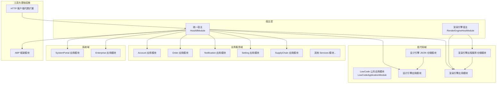
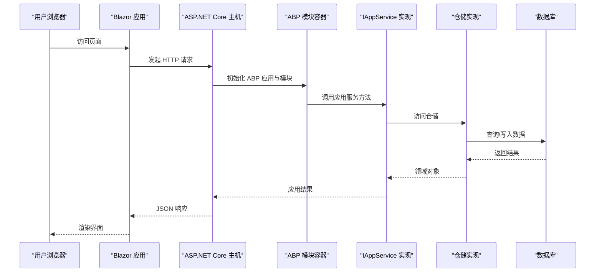
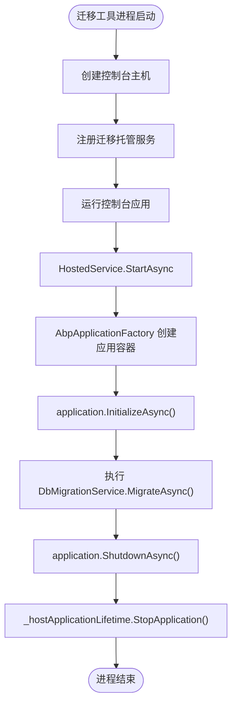
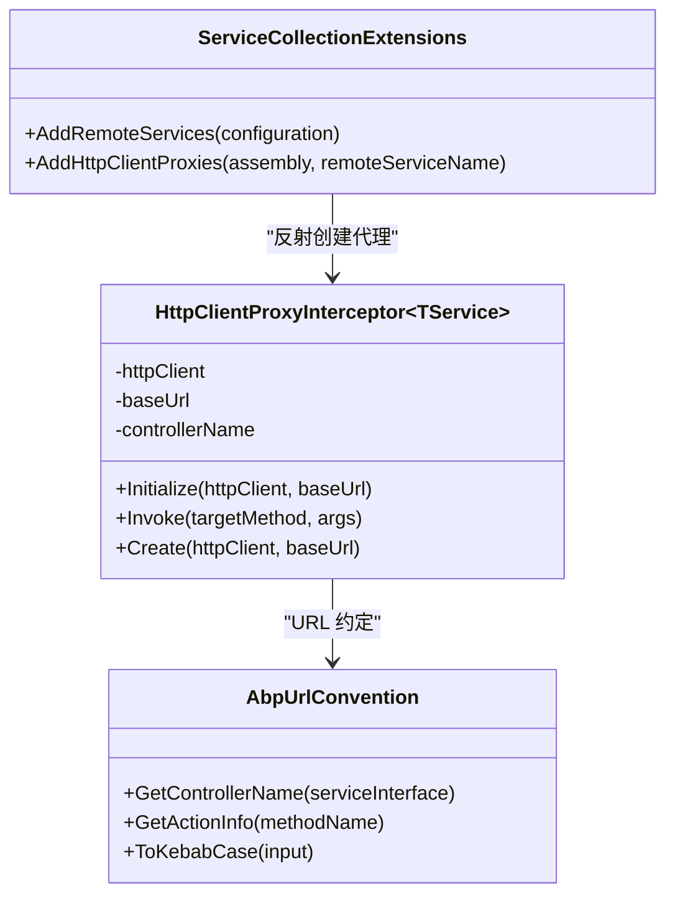
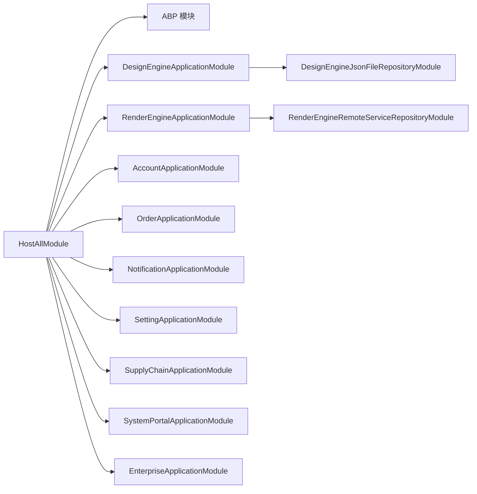
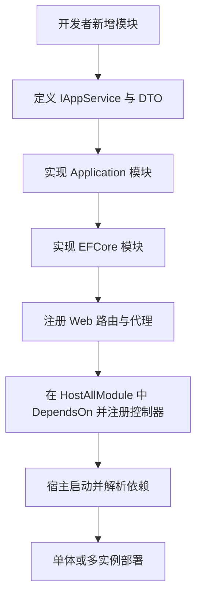

# 模块化架构设计

<cite>
**本文引用的文件**   
- [README.md](file://README.md)
- [HostAllModule.cs](file://src/Host/H.AppLab.Web.Host/H.AppLab.Web.Host/HostAllModule.cs)
- [Program.cs（主宿主）](file://src/Host/H.AppLab.Web.Host/H.AppLab.Web.Host/Program.cs)
- [AccountApplicationModule.cs](file://src/Services/Account/H.Account.Application/AccountApplicationModule.cs)
- [LowCodeApplicationModule.cs](file://src/LowCode/Common/H.LowCode.Application/LowCodeApplicationModule.cs)
- [SystemPortalApplicationModule.cs](file://src/System/SystemPortal/H.SystemPortal.Application/SystemPortalApplicationModule.cs)
- [RenderEngineHostModule.cs](file://src/Host/RenderEngine/H.LowCode.RenderEngine.Host/RenderEngineHostModule.cs)
- [LowCodeDbMigratorModule.cs](file://src/Tools/H.LowCode.DbMigrator/LowCodeDbMigratorModule.cs)
- [Program.cs（低代码迁移工具）](file://src/Tools/H.LowCode.DbMigrator/Program.cs)
- [HostedService.cs（迁移托管服务）](file://src/Tools/H.LowCode.DbMigrator/HostedService.cs)
- [DesignEngineJsonFileRepositoryModule.cs](file://src/LowCode/DesignEngine/H.LowCode.DesignEngine.Repository.JsonFile/DesignEngineJsonFileRepositoryModule.cs)
- [RenderEngineRemoteServiceRepositoryModule.cs](file://src/LowCode/RenderEngine/H.LowCode.RenderEngine.Repository.RemoteService/RenderEngineRemoteServiceRepositoryModule.cs)
- [ServiceCollectionExtensions.cs（HTTP 客户端代理扩展）](file://src/Utils/H.Abp.HttpClientProxy/ServiceCollectionExtensions.cs)
- [HttpClientProxyInterceptor.cs（HTTP 客户端代理拦截器）](file://src/Utils/H.Abp.HttpClientProxy/HttpClientProxyInterceptor.cs)
- [AbpUrlConvention.cs（ABP URL 约定）](file://src/Utils/H.Abp.HttpClientProxy/AbpUrlConvention.cs)
</cite>

## 目录
1. [引言](#引言)
2. [项目结构](#项目结构)
3. [核心组件](#核心组件)
4. [架构总览](#架构总览)
5. [详细组件分析](#详细组件分析)
6. [依赖关系分析](#依赖关系分析)
7. [性能与运行时特性](#性能与运行时特性)
8. [故障排查指南](#故障排查指南)
9. [结论](#结论)
10. [附录：模块边界与扩展实践](#附录模块边界与扩展实践)

## 引言
本文件面向 H.AppLab 平台的模块化架构设计，基于 ABP Framework 的模块体系，说明以下关键主题：
- 模块定义、依赖管理与生命周期。
- 限界上下文划分原则，特别是 LowCode、Services、System 三大领域的职责与边界。
- 模块解耦策略，包括接口契约、事件总线、外部服务调用。
- 模块启动顺序、依赖解析和资源释放机制。
- 插件化扩展机制，包括动态模块加载、运行时扩展点、配置隔离。
- 模块依赖图与扩展开发指南。

项目 README 明确了整体目标：采用 .NET + Blazor 的模块化架构，支持单体部署和按服务独立部署；Host 仅做服务注册，业务按 Application.Contracts / Application / EntityFrameworkCore / Web 分层组织，并包含 LowCode 设计与渲染引擎、企业级 Services 以及 System 系统应用。

**章节来源**
- [README.md:1-73](file://README.md#L1-L73)

## 项目结构
H.AppLab 仓库采用领域与层次相结合的模块化组织方式：
- Host：宿主程序，不包含业务逻辑，负责装配 ABP 模块、Blazor 渲染管线、中间件、认证授权、多租户、静态资源等。
- LowCode：低代码平台核心，包含 Common 公共库、DesignEngine 设计引擎、RenderEngine 渲染引擎及元数据。
- Services：按限界上下文划分的业务模块，如 Account、Organization、Approval、AI、Notification、Order、Setting、SupplyChain、BackgroundTask、Testing 等。
- System：系统级应用 Enterprise、SystemPortal，面向平台运营侧，与 Services 严格隔离。
- Tools：每个服务的 DbMigrator 控制台程序，用于数据库迁移。
- Utils：跨领域工具库，包括 ABP 应用契约扩展、HTTP 客户端代理、Blazor 工具、ID 生成器等。
- Components：可复用的前端 UI 组件，如 AppDrawer。

**图表来源**
- [HostAllModule.cs:1-200](file://src/Host/H.AppLab.Web.Host/H.AppLab.Web.Host/HostAllModule.cs#L1-L200)
- [RenderEngineHostModule.cs:1-39](file://src/Host/RenderEngine/H.LowCode.RenderEngine.Host/RenderEngineHostModule.cs#L1-L39)
- [DesignEngineJsonFileRepositoryModule.cs:1-30](file://src/LowCode/DesignEngine/H.LowCode.DesignEngine.Repository.JsonFile/DesignEngineJsonFileRepositoryModule.cs#L1-L30)
- [RenderEngineRemoteServiceRepositoryModule.cs:1-18](file://src/LowCode/RenderEngine/H.LowCode.RenderEngine.Repository.RemoteService/RenderEngineRemoteServiceRepositoryModule.cs#L1-L18)

**章节来源**
- [README.md:1-73](file://README.md#L1-L73)

## 核心组件
本节聚焦 ABP 模块体系在 H.AppLab 中的实现，重点包括：
- 统一宿主模块 HostAllModule：聚合所有应用模块、注册 HTTP 客户端、Cookie 认证、多租户、外部登录、自动 API 控制器等。
- 各业务模块 ApplicationModule：通过 DependsOn 声明依赖，按需注册服务。
- 仓储实现模块：通过不同 RepositoryModule 切换 JsonFile 或 RemoteService 实现。
- 迁移工具模块：DbMigrator 使用 AbpApplicationFactory 创建独立应用容器执行迁移。
- HTTP 客户端代理：为 Blazor WASM 提供 IAppService 接口的 HTTP 动态代理，屏蔽底层 HTTP 细节。

**章节来源**
- [HostAllModule.cs:1-200](file://src/Host/H.AppLab.Web.Host/H.AppLab.Web.Host/HostAllModule.cs#L1-L200)
- [AccountApplicationModule.cs:1-22](file://src/Services/Account/H.Account.Application/AccountApplicationModule.cs#L1-L22)
- [LowCodeApplicationModule.cs:1-13](file://src/LowCode/Common/H.LowCode.Application/LowCodeApplicationModule.cs#L1-L13)
- [SystemPortalApplicationModule.cs:1-12](file://src/System/SystemPortal/H.SystemPortal.Application/SystemPortalApplicationModule.cs#L1-L12)
- [DesignEngineJsonFileRepositoryModule.cs:1-30](file://src/LowCode/DesignEngine/H.LowCode.DesignEngine.Repository.JsonFile/DesignEngineJsonFileRepositoryModule.cs#L1-L30)
- [RenderEngineRemoteServiceRepositoryModule.cs:1-18](file://src/LowCode/RenderEngine/H.LowCode.RenderEngine.Repository.RemoteService/RenderEngineRemoteServiceRepositoryModule.cs#L1-L18)
- [ServiceCollectionExtensions.cs:1-63](file://src/Utils/H.Abp.HttpClientProxy/ServiceCollectionExtensions.cs#L1-L63)

## 架构总览
H.AppLab 的模块化架构围绕 ABP 的模块系统展开：
- 宿主层（Host）通过 AbpModule 组合多个应用模块，完成服务装配、中间件管道、认证授权、多租户、Blazor 渲染模式、SignalR、响应压缩、Hangfire 等。
- 低代码域（LowCode）以 Application.Contracts 暴露能力，Application 层编排流程，Domain 层维护领域模型，EntityFrameworkCore 提供持久化，Repository.* 模块注入具体存储实现。
- 业务服务域（Services）每个限界上下文遵循统一的分层与模块命名规范，便于单体或多实例部署。
- 系统域（System）与业务服务域解耦，专注于平台运营管理。
- 工具域（Tools）提供每个服务的 DbMigrator 工具，使用 ABP 应用工厂构建独立运行环境执行迁移。

**图表来源**
- [Program.cs（主宿主）:1-112](file://src/Host/H.AppLab.Web.Host/H.AppLab.Web.Host/Program.cs#L1-L112)
- [HostAllModule.cs:1-200](file://src/Host/H.AppLab.Web.Host/H.AppLab.Web.Host/HostAllModule.cs#L1-L200)
- [DesignEngineJsonFileRepositoryModule.cs:1-30](file://src/LowCode/DesignEngine/H.LowCode.DesignEngine.Repository.JsonFile/DesignEngineJsonFileRepositoryModule.cs#L1-L30)

## 详细组件分析

### 统一宿主模块 HostAllModule
HostAllModule 是单体宿主的入口模块，集中声明对 ABP 基础模块和低代码、业务、系统模块的依赖，并在 ConfigureServices 中完成：
- 注册 HttpClient 与 HttpContextAccessor。
- 配置 Cookie 认证（区分系统与第三方登录方案）。
- 启用多租户，并注入自定义租户存储与租户解析贡献者。
- 配置外部登录（微信、钉钉）。
- 设置 LowCodeAppState（设计时状态）、全局 Toast 提示服务。
- 注册各模块的自动 API 控制器。
- 关闭 WASM 的 CSRF 校验，依靠 SameSite Cookie 保护。

该模块体现了 ABP 模块“声明式依赖 + 集中配置”的设计思想，使宿主保持简单清晰，业务模块内聚且可替换。

**章节来源**
- [HostAllModule.cs:1-200](file://src/Host/H.AppLab.Web.Host/H.AppLab.Web.Host/HostAllModule.cs#L1-L200)

### 低代码应用模块 LowCodeApplicationModule
LowCodeApplicationModule 作为 LowCode 公共应用模块，注册当前应用上下文服务 CurrentApp，供设计器和渲染器共享应用状态。该模块展示了 ABP 模块的最小可用形态：通过 DependsOn 声明依赖，并通过 ConfigureServices 注册轻量服务。

**章节来源**
- [LowCodeApplicationModule.cs:1-13](file://src/LowCode/Common/H.LowCode.Application/LowCodeApplicationModule.cs#L1-L13)

### 系统门户模块 SystemPortalApplicationModule
SystemPortalApplicationModule 展示系统域模块的典型用法：在 ConfigureServices 中注册单例的系统用户存储 SystemUserStore，体现系统管理模块对全局状态或配置中心式数据的依赖。

**章节来源**
- [SystemPortalApplicationModule.cs:1-12](file://src/System/SystemPortal/H.SystemPortal.Application/SystemPortalApplicationModule.cs#L1-L12)

### 渲染引擎宿主模块 RenderEngineHostModule
RenderEngineHostModule 是 RenderEngine 的独立宿主模块，依赖 RenderEngineApplicationModule、EntityFrameworkCore 模块与 JsonFile 仓储模块，并设置 LowCodeAppState(false) 表示运行时状态。它展示了如何以最小依赖组装一个独立运行的低代码渲染服务。

**章节来源**
- [RenderEngineHostModule.cs:1-39](file://src/Host/RenderEngine/H.LowCode.RenderEngine.Host/RenderEngineHostModule.cs#L1-L39)

### 仓储实现模块与可插拔存储
设计引擎与渲染引擎均提供多种仓储实现，并通过 Module 切换：
- DesignEngineJsonFileRepositoryModule：将应用、菜单、页面、数据源、组件库、模板等实体映射到文件系统 JSON。
- RenderEngineRemoteServiceRepositoryModule：通过远程服务调用获取渲染所需元数据，适合微服务或远端部署场景。

这种设计体现了 ABP 模块的可插拔性：通过 DependsOn 与 ConfigureServices 的替换绑定，可以在不修改上层应用的情况下切换持久化策略。

**章节来源**
- [DesignEngineJsonFileRepositoryModule.cs:1-30](file://src/LowCode/DesignEngine/H.LowCode.DesignEngine.Repository.JsonFile/DesignEngineJsonFileRepositoryModule.cs#L1-L30)
- [RenderEngineRemoteServiceRepositoryModule.cs:1-18](file://src/LowCode/RenderEngine/H.LowCode.RenderEngine.Repository.RemoteService/RenderEngineRemoteServiceRepositoryModule.cs#L1-L18)

### 数据库迁移工具与生命周期
低代码迁移工具由 Program 启动，注册 HostedService，后者使用 AbpApplicationFactory 创建 LowCodeDbMigratorModule 的应用容器，读取配置、添加日志、执行迁移后关闭应用。LowCodeDbMigratorModule 注册数据种子、迁移服务、MigrationCurrentApp 以及专用 DbContext，确保迁移过程与业务 DbContext 解耦。

**图表来源**
- [Program.cs（低代码迁移工具）:1-38](file://src/Tools/H.LowCode.DbMigrator/Program.cs#L1-L38)
- [HostedService.cs:1-47](file://src/Tools/H.LowCode.DbMigrator/HostedService.cs#L1-L47)
- [LowCodeDbMigratorModule.cs:1-40](file://src/Tools/H.LowCode.DbMigrator/LowCodeDbMigratorModule.cs#L1-L40)

**章节来源**
- [Program.cs（低代码迁移工具）:1-38](file://src/Tools/H.LowCode.DbMigrator/Program.cs#L1-L38)
- [HostedService.cs:1-47](file://src/Tools/H.LowCode.DbMigrator/HostedService.cs#L1-L47)
- [LowCodeDbMigratorModule.cs:1-40](file://src/Tools/H.LowCode.DbMigrator/LowCodeDbMigratorModule.cs#L1-L40)

### HTTP 客户端代理与接口契约
H.Abp.HttpClientProxy 为 Blazor WASM 提供基于 IAppService 接口的 HTTP 动态代理，主要组件：
- ServiceCollectionExtensions：从配置 RemoteServices 节点读取远程服务地址，扫描程序集注册代理。
- HttpClientProxyInterceptor：基于 DispatchProxy 拦截接口方法调用，转换为 HTTP 请求。
- AbpUrlConvention：将接口名和方法名转换为 ABP 风格 URL，保证与后端路由一致。

**图表来源**
- [ServiceCollectionExtensions.cs:1-63](file://src/Utils/H.Abp.HttpClientProxy/ServiceCollectionExtensions.cs#L1-L63)
- [HttpClientProxyInterceptor.cs:1-234](file://src/Utils/H.Abp.HttpClientProxy/HttpClientProxyInterceptor.cs#L1-L234)
- [AbpUrlConvention.cs:1-86](file://src/Utils/H.Abp.HttpClientProxy/AbpUrlConvention.cs#L1-L86)

**章节来源**
- [ServiceCollectionExtensions.cs:1-63](file://src/Utils/H.Abp.HttpClientProxy/ServiceCollectionExtensions.cs#L1-L63)
- [HttpClientProxyInterceptor.cs:1-234](file://src/Utils/H.Abp.HttpClientProxy/HttpClientProxyInterceptor.cs#L1-L234)
- [AbpUrlConvention.cs:1-86](file://src/Utils/H.Abp.HttpClientProxy/AbpUrlConvention.cs#L1-L86)

## 依赖关系分析
H.AppLab 的依赖关系遵循 ABP 模块依赖图原则：
- 宿主模块 HostAllModule 显式 DependsOn 所有应用模块，形成聚合根。
- 各业务模块 ApplicationModule 依赖其 EFCore 模块与 ABP 领域模块。
- 仓储实现模块依赖 Domain 模块，并通过 ConfigureServices 绑定接口到实现。
- 低代码域通过 Common 应用模块提供共享服务，DesignEngine 与 RenderEngine 各自拥有独立应用模块与仓储实现。
- 工具模块（DbMigrator）通过独立的 Program 与 Module 构建最小应用容器，避免侵入业务模块。

**图表来源**
- [HostAllModule.cs:1-200](file://src/Host/H.AppLab.Web.Host/H.AppLab.Web.Host/HostAllModule.cs#L1-L200)
- [DesignEngineJsonFileRepositoryModule.cs:1-30](file://src/LowCode/DesignEngine/H.LowCode.DesignEngine.Repository.JsonFile/DesignEngineJsonFileRepositoryModule.cs#L1-L30)
- [RenderEngineRemoteServiceRepositoryModule.cs:1-18](file://src/LowCode/RenderEngine/H.LowCode.RenderEngine.Repository.RemoteService/RenderEngineRemoteServiceRepositoryModule.cs#L1-L18)

**章节来源**
- [HostAllModule.cs:1-200](file://src/Host/H.AppLab.Web.Host/H.AppLab.Web.Host/HostAllModule.cs#L1-L200)

## 性能与运行时特性
主宿主 Program 中启用了多项性能优化与运行时特性：
- SignalR 最大消息大小与详细错误开关，适合实时交互场景。
- JSON 序列化使用驼峰命名策略。
- Brotli 与 Gzip 响应压缩，降低 WASM 程序集传输体积。
- 静态资源 MapStaticAssets 统一处理缓存，避免 boot manifest 与指纹程序集不一致导致的加载失败。
- Blazor InteractiveWebAssemblyRenderMode 与 AdditionalAssemblies 声明懒加载程序集集合。

这些配置与 README 中提到的“WASM 懒加载”“Release 模式 AOT 与裁剪”“自研 DI 支撑懒加载后的服务注册”共同构成 H.AppLab 的前端性能优化策略。

**章节来源**
- [Program.cs（主宿主）:1-112](file://src/Host/H.AppLab.Web.Host/H.AppLab.Web.Host/Program.cs#L1-L112)
- [README.md:1-73](file://README.md#L1-L73)

## 故障排查指南
常见模块相关问题的排查要点：
- 模块依赖缺失：检查 AbpModule 的 DependsOn 是否包含所需模块；确认宿主是否正确引用并注册对应 Assembly。
- 控制器未注册：确认 HostAllModule.ConfigureAutoApiControllers 中已为相应模块 Assembly 调用 ConventionalControllers.Create。
- 认证与多租户异常：检查 Cookie Scheme、登录路径、TenantId Claim 解析器链；确认 ITenantStore 与 ClaimsTenantResolveContributor 的配置。
- WASM 启动失败：确认静态资源 MapStaticAssets 未被手动标记 immutable；检查 boot manifest 与指纹程序集一致性。
- 远程服务代理失败：检查 RemoteServices 配置与 AddHttpClientProxies 扫描的程序集；确认 AbpUrlConvention 生成的 URL 与后端路由一致。
- 迁移失败：确认 LowCodeDbMigratorModule 中 MigrationsAssembly 指向正确程序集；检查 appsettings.json 连接字符串与日志配置。

**章节来源**
- [HostAllModule.cs:1-200](file://src/Host/H.AppLab.Web.Host/H.AppLab.Web.Host/HostAllModule.cs#L1-L200)
- [Program.cs（主宿主）:1-112](file://src/Host/H.AppLab.Web.Host/H.AppLab.Web.Host/Program.cs#L1-L112)
- [ServiceCollectionExtensions.cs:1-63](file://src/Utils/H.Abp.HttpClientProxy/ServiceCollectionExtensions.cs#L1-L63)
- [AbpUrlConvention.cs:1-86](file://src/Utils/H.Abp.HttpClientProxy/AbpUrlConvention.cs#L1-L86)
- [LowCodeDbMigratorModule.cs:1-40](file://src/Tools/H.LowCode.DbMigrator/LowCodeDbMigratorModule.cs#L1-L40)

## 结论
H.AppLab 平台通过 ABP Framework 的模块化架构实现了清晰的领域边界、可插拔的存储实现、统一的宿主装配与完善的运行时优化。LowCode、Services、System 三大领域通过 Application.Contracts 与 AbpModule 的依赖声明进行解耦，配合 HTTP 客户端代理与仓储实现切换，既能满足单体快速交付，也支持微服务与插件化扩展。结合 Blazor WASM 懒加载与响应压缩，系统在可维护性与性能之间取得平衡。

## 附录：模块边界与扩展实践

### 限界上下文划分原则
- LowCode 领域：负责应用与组件的可视化设计、元数据建模与动态渲染，强调可插拔仓储与主题扩展。
- Services 领域：按企业级业务能力划分限界上下文，每个上下文拥有独立 Application.Contracts、Application、EntityFrameworkCore、Web 模块。
- System 领域：面向平台运营，与业务服务严格隔离，避免业务变更影响系统管理能力。

### 模块解耦策略
- 接口契约：通过 IAppService 与 DTO 定义跨进程边界；前端仅依赖契约，后端提供进程内或 HTTP 代理实现。
- 事件总线：ABP 内置事件总线可用于模块间异步解耦（例如通知、审计、后台任务），需在各模块中订阅与发布。
- 外部服务调用：通过 RemoteServices 配置与 AddHttpClientProxies 统一管理远程服务地址与代理注册。

### 模块生命周期管理
- 启动顺序：由 ABP 根据 DependsOn 计算依赖拓扑，依次执行模块初始化。
- 依赖解析：Autofac 容器解析服务，模块在 ConfigureServices 中注册服务。
- 资源释放：应用容器 ShutdownAsync 后释放作用域服务与连接池；迁移工具通过 HostedService 控制进程生命周期。

### 插件化扩展机制
- 动态模块加载：通过新 Module 与 DependsOn 声明依赖，宿主聚合模块即可扩展功能。
- 运行时扩展点：仓储接口（如 IAppRepository、IMenuRepository）允许替换 JsonFile 或 RemoteService 实现。
- 配置隔离：各模块通过 IConfiguration 读取自身配置段，宿主通过 AddRemoteServices 集中管理远程服务地址。

### 模块依赖图与扩展开发指南
- 新增业务模块步骤：
  1. 创建 Application.Contracts、Application、EntityFrameworkCore、Web 四个模块项目。
  2. 在 ApplicationModule 中 DependsOn 对应的 EFCore 模块与 ABP 领域模块。
  3. 在 WebModule 中注册前端路由与服务代理。
  4. 在 HostAllModule 中 DependsOn 新模块并注册控制器 Assembly。
- 新增低代码仓储实现：
  1. 新建 Repository.Module，DependsOn 对应 Domain 模块。
  2. 在 ConfigureServices 中将接口绑定到新实现。
  3. 在宿主或运行环境中选择启用该仓储模块。

**章节来源**
- [README.md:1-73](file://README.md#L1-L73)
- [HostAllModule.cs:1-200](file://src/Host/H.AppLab.Web.Host/H.AppLab.Web.Host/HostAllModule.cs#L1-L200)
- [DesignEngineJsonFileRepositoryModule.cs:1-30](file://src/LowCode/DesignEngine/H.LowCode.DesignEngine.Repository.JsonFile/DesignEngineJsonFileRepositoryModule.cs#L1-L30)
- [RenderEngineRemoteServiceRepositoryModule.cs:1-18](file://src/LowCode/RenderEngine/H.LowCode.RenderEngine.Repository.RemoteService/RenderEngineRemoteServiceRepositoryModule.cs#L1-L18)