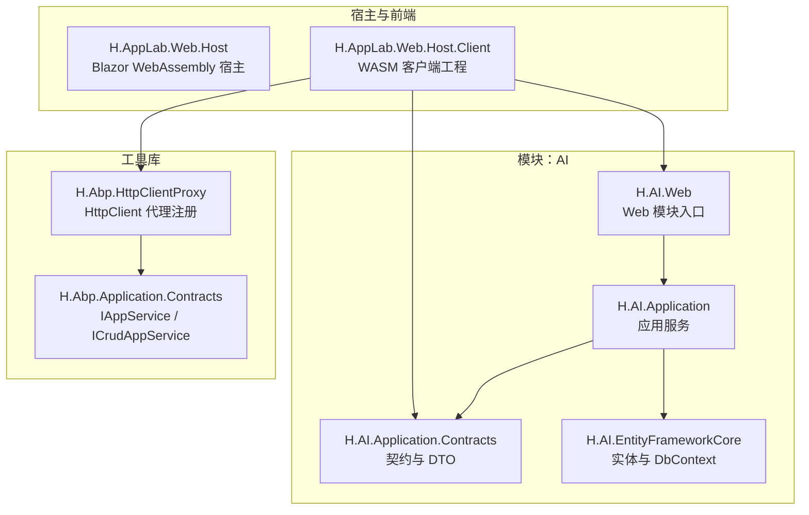
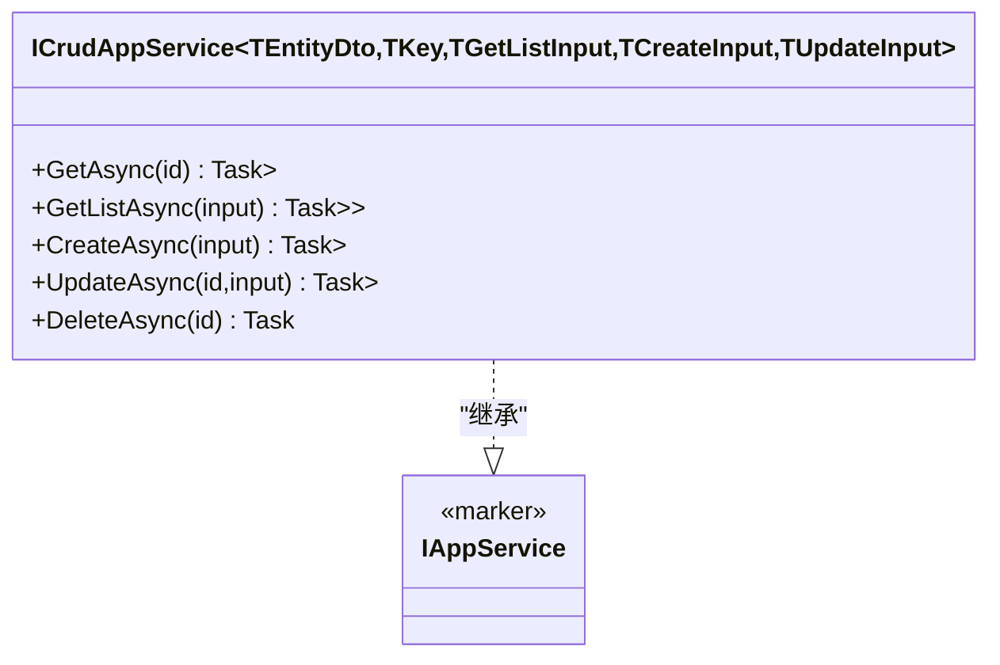
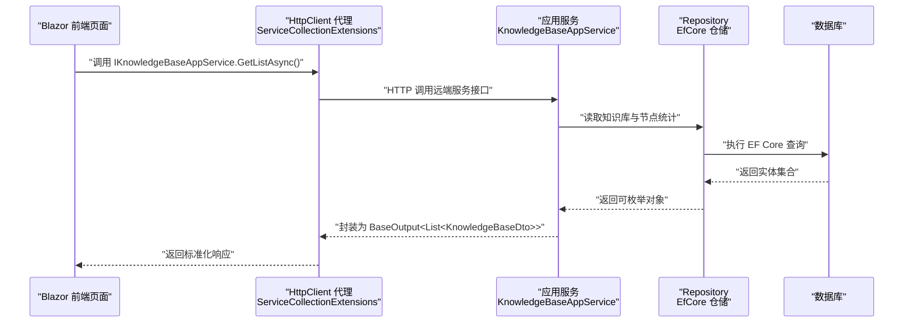
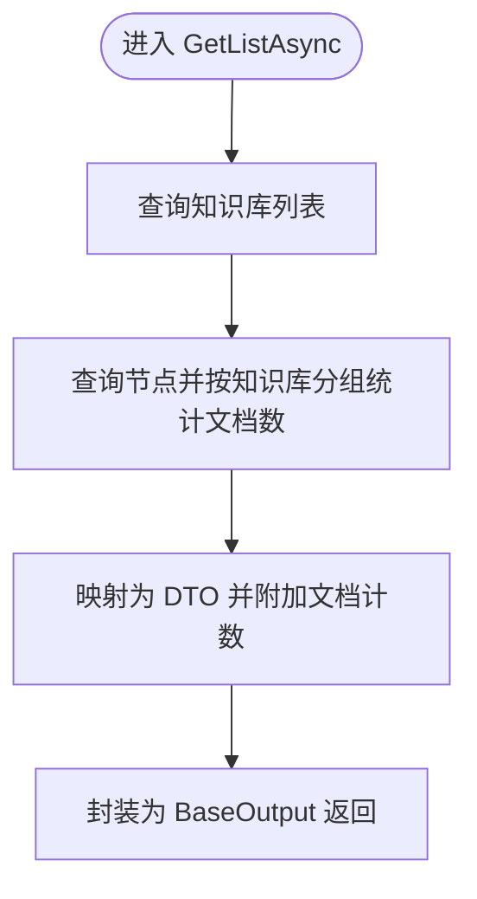
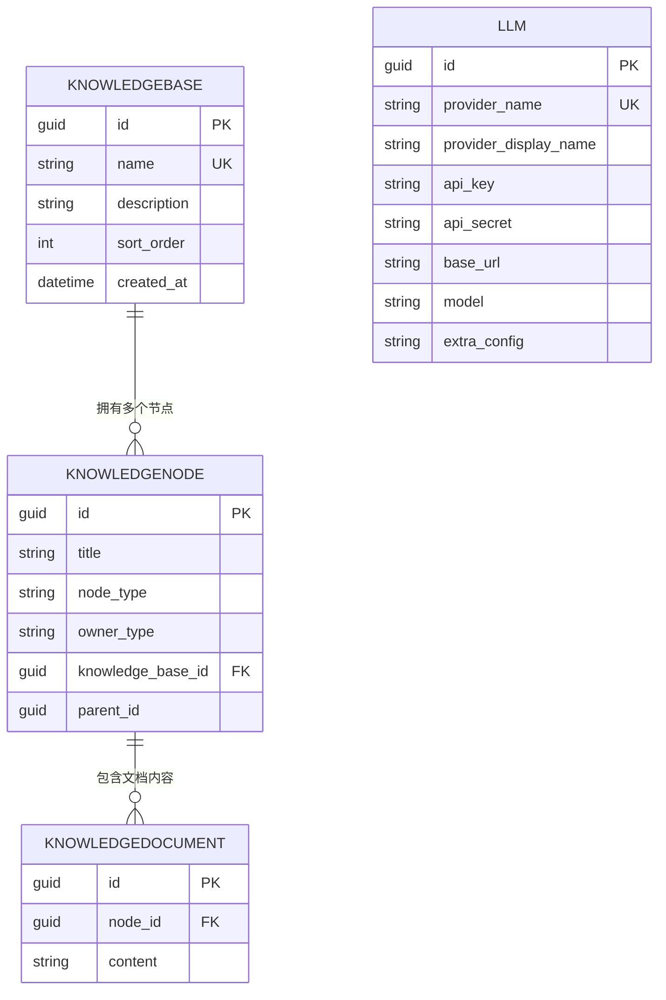
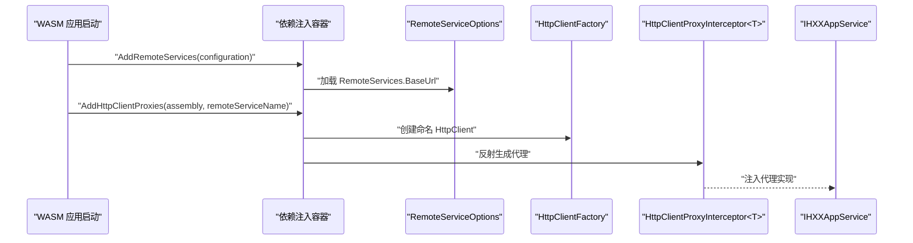
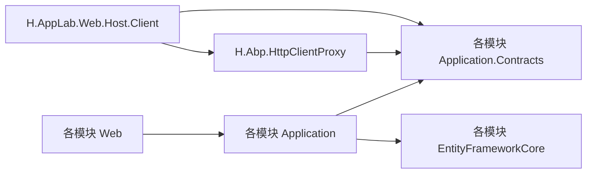

# 模块开发指南

<cite>
**本文引用的文件**   
- [IAppService.cs](file://src/Utils/H.Abp.Application.Contracts/IAppService.cs)
- [ICrudAppService.cs](file://src/Utils/H.Abp.Application.Contracts/ICrudAppService.cs)
- [CreateKnowledgeBaseDto.cs](file://src/Services/AI/H.AI.Application.Contracts/Dtos/Knowledge/CreateKnowledgeBaseDto.cs)
- [IKnowledgeBaseAppService.cs](file://src/Services/AI/H.AI.Application.Contracts/Services/Knowledge/IKnowledgeBaseAppService.cs)
- [KnowledgeBaseAppService.cs](file://src/Services/AI/H.AI.Application/Services/KnowledgeBaseAppService.cs)
- [KnowledgeBaseEntity.cs](file://src/Services/AI/H.AI.EntityFrameworkCore/Entities/KnowledgeBaseEntity.cs)
- [AIDbContext.cs](file://src/Services/AI/H.AI.EntityFrameworkCore/AIDbContext.cs)
- [AIWebModule.cs](file://src/Services/AI/H.AI.Web/AIWebModule.cs)
- [H.AppLab.Web.Host.Client.csproj](file://src/Host/H.AppLab.Web.Host/H.AppLab.Web.Host.Client/H.AppLab.Web.Host.Client.csproj)
- [ServiceCollectionExtensions.cs](file://src/Utils/H.Abp.HttpClientProxy/ServiceCollectionExtensions.cs)
- [appsettings.json（账户迁移工具）](file://src/Tools/H.Account.DbMigrator/appsettings.json)
- [appsettings.json（AI 迁移工具）](file://src/Tools/H.AI.DbMigrator/appsettings.json)
</cite>

## 目录
1. [引言](#引言)
2. [项目结构](#项目结构)
3. [核心组件](#核心组件)
4. [架构总览](#架构总览)
5. [详细组件分析](#详细组件分析)
6. [依赖关系分析](#依赖关系分析)
7. [性能考虑](#性能考虑)
8. [故障排查](#故障排查)
9. [结论](#结论)
10. [附录：新模块创建清单](#附录新模块创建清单)

## 引言
本指南面向希望在 H.AppLab 平台中新增业务模块的开发者。文档基于仓库中现有 AI、Account、Approval、Order 等服务的实现模式，系统说明：
- 如何使用现有模板和目录规范快速搭建模块；
- 如何定义并实现 IAppService 接口与 CRUD 服务契约；
- 如何使用 EntityFramework Core、AbpDbContext 与 Repository 进行数据访问；
- 如何在 Blazor WebAssembly 前端通过 HttpClient 代理调用后端 API；
- 如何编写测试、打包部署并进行版本管理。

## 项目结构
H.AppLab 采用“领域服务 + 宿主 + 工具”的分层组织方式。每个业务能力通常以 Services 下的一个独立子域表示，例如 AI、Account、Approval、Order 等。典型的服务模块包含以下工程：
- Application：应用服务层，承载业务流程编排、DTO 映射、事务边界与错误处理。
- Application.Contracts：对外暴露的应用服务契约与 DTO，供客户端与服务间复用。
- EntityFrameworkCore：领域实体、DbContext、数据库配置与迁移。
- Web：ASP.NET Core Web 模块入口、控制器或 API 注册。
- Host 与 Client：宿主程序集与 Blazor WebAssembly 客户端工程，负责聚合各模块并提供延迟加载能力。

图表来源
- [H.AppLab.Web.Host.Client.csproj:1-147](file://src/Host/H.AppLab.Web.Host/H.AppLab.Web.Host.Client/H.AppLab.Web.Host.Client.csproj#L1-L147)
- [ServiceCollectionExtensions.cs:1-63](file://src/Utils/H.Abp.HttpClientProxy/ServiceCollectionExtensions.cs#L1-L63)
- [AIWebModule.cs:1-8](file://src/Services/AI/H.AI.Web/AIWebModule.cs#L1-L8)

章节来源
- [H.AppLab.Web.Host.Client.csproj:1-147](file://src/Host/H.AppLab.Web.Host/H.AppLab.Web.Host.Client/H.AppLab.Web.Host.Client.csproj#L1-L147)

## 核心组件
本节聚焦模块开发中最关键的抽象与约定。

### IAppService 与 ICrudAppService
- IAppService 是标记接口，用于标识可通过 HTTP 代理远程调用的服务接口。
- ICrudAppService 提供标准的增删改查方法签名，封装在统一的 BaseOutput 与分页结果类型之上，便于前后端统一响应格式。

图表来源
- [IAppService.cs:1-8](file://src/Utils/H.Abp.Application.Contracts/IAppService.cs#L1-L8)
- [ICrudAppService.cs:1-15](file://src/Utils/H.Abp.Application.Contracts/ICrudAppService.cs#L1-L15)

章节来源
- [IAppService.cs:1-8](file://src/Utils/H.Abp.Application.Contracts/IAppService.cs#L1-L8)
- [ICrudAppService.cs:1-15](file://src/Utils/H.Abp.Application.Contracts/ICrudAppService.cs#L1-L15)

### DTO 设计
DTO 用于服务契约与前端交互，建议遵循以下原则：
- 输入 DTO 使用验证特性描述必填、长度等约束。
- 输出 DTO 保持最小可用字段，避免泄露内部实现细节。
- 对于复杂查询，可使用专用输入 DTO，如分页、排序与过滤条件。

示例参考路径
- [CreateKnowledgeBaseDto.cs:1-18](file://src/Services/AI/H.AI.Application.Contracts/Dtos/Knowledge/CreateKnowledgeBaseDto.cs#L1-L18)

章节来源
- [CreateKnowledgeBaseDto.cs:1-18](file://src/Services/AI/H.AI.Application.Contracts/Dtos/Knowledge/CreateKnowledgeBaseDto.cs#L1-L18)

## 架构总览
从前端到后端的典型请求链路如下：

图表来源
- [ServiceCollectionExtensions.cs:1-63](file://src/Utils/H.Abp.HttpClientProxy/ServiceCollectionExtensions.cs#L1-L63)
- [KnowledgeBaseAppService.cs:1-133](file://src/Services/AI/H.AI.Application/Services/KnowledgeBaseAppService.cs#L1-L133)
- [AIDbContext.cs:1-68](file://src/Services/AI/H.AI.EntityFrameworkCore/AIDbContext.cs#L1-L68)

## 详细组件分析

### 应用服务层：IAppService 实现模式
以 AI 模块的知识库管理为例，应用服务职责包括：
- 接收 DTO 输入，进行参数校验与业务规则检查；
- 通过 IRepository 访问数据；
- 使用 AutoMapper 将实体映射为 DTO；
- 将结果封装为 BaseOutput 返回；
- 对异常进行业务语义化处理。

图表来源
- [KnowledgeBaseAppService.cs:1-133](file://src/Services/AI/H.AI.Application/Services/KnowledgeBaseAppService.cs#L1-L133)

#### 关键实现要点
- 列表查询优先使用 GetQueryableAsync 构建 LINQ 查询，减少内存压力。
- 多表关联与聚合尽量在服务层完成，保持 DTO 简洁。
- 名称唯一性校验在 Create 与 Update 中分别处理，避免重复。
- 删除时级联清理相关节点与文档，保证数据一致性。

章节来源
- [IKnowledgeBaseAppService.cs:1-16](file://src/Services/AI/H.AI.Application.Contracts/Services/Knowledge/IKnowledgeBaseAppService.cs#L1-L16)
- [KnowledgeBaseAppService.cs:1-133](file://src/Services/AI/H.AI.Application/Services/KnowledgeBaseAppService.cs#L1-L133)

### 数据访问层：EntityFramework Core 集成
AI 模块通过 AbpDbContext 与 ModelBuilder 配置实体与索引：
- 使用 ConnectionStringName 指定连接字符串名称；
- 为实体设置主键、列长度、必填属性与唯一索引；
- 合理定义复合索引提升查询性能。

图表来源
- [AIDbContext.cs:1-68](file://src/Services/AI/H.AI.EntityFrameworkCore/AIDbContext.cs#L1-L68)
- [KnowledgeBaseEntity.cs:1-18](file://src/Services/AI/H.AI.EntityFrameworkCore/Entities/KnowledgeBaseEntity.cs#L1-L18)

章节来源
- [AIDbContext.cs:1-68](file://src/Services/AI/H.AI.EntityFrameworkCore/AIDbContext.cs#L1-L68)
- [KnowledgeBaseEntity.cs:1-18](file://src/Services/AI/H.AI.EntityFrameworkCore/Entities/KnowledgeBaseEntity.cs#L1-L18)

### 前端客户端：HttpClient 代理生成与状态管理
- 服务契约由 IAppService 标记，运行时扫描所有标记接口并生成 HttpClient 代理。
- 通过 AddRemoteServices 与 AddHttpClientProxies 注入代理实例。
- 在 Blazor WASM 宿主工程中，通过 BlazorWebAssemblyLazyLoad 按需加载各模块的程序集与调试符号，降低初始包体积。

图表来源
- [ServiceCollectionExtensions.cs:1-63](file://src/Utils/H.Abp.HttpClientProxy/ServiceCollectionExtensions.cs#L1-L63)
- [H.AppLab.Web.Host.Client.csproj:1-147](file://src/Host/H.AppLab.Web.Host/H.AppLab.Web.Host.Client/H.AppLab.Web.Host.Client.csproj#L1-L147)

章节来源
- [ServiceCollectionExtensions.cs:1-63](file://src/Utils/H.Abp.HttpClientProxy/ServiceCollectionExtensions.cs#L1-L63)
- [H.AppLab.Web.Host.Client.csproj:1-147](file://src/Host/H.AppLab.Web.Host/H.AppLab.Web.Host.Client/H.AppLab.Web.Host.Client.csproj#L1-L147)

### Web 模块与托管
- 模块的 Web 入口类通常为空的标记类，配合 ABP 模块机制启用 API。
- 宿主工程引用各模块 Web 工程，并在发布时将模块程序集作为 WASM 懒加载项。

章节来源
- [AIWebModule.cs:1-8](file://src/Services/AI/H.AI.Web/AIWebModule.cs#L1-L8)
- [H.AppLab.Web.Host.Client.csproj:1-147](file://src/Host/H.AppLab.Web.Host/H.AppLab.Web.Host.Client/H.AppLab.Web.Host.Client.csproj#L1-L147)

## 依赖关系分析
模块间的依赖遵循清晰的单向流：
- 前端仅依赖契约与代理，不直接耦合后端实现。
- 应用服务依赖契约与 EF 仓储，但不感知 HTTP 传输细节。
- EF 层仅关注持久化模型与数据库映射。

图表来源
- [H.AppLab.Web.Host.Client.csproj:1-147](file://src/Host/H.AppLab.Web.Host/H.AppLab.Web.Host.Client/H.AppLab.Web.Host.Client.csproj#L1-L147)
- [ServiceCollectionExtensions.cs:1-63](file://src/Utils/H.Abp.HttpClientProxy/ServiceCollectionExtensions.cs#L1-L63)

## 性能考虑
- 使用 GetQueryableAsync 与 LINQ 组合查询，避免一次性加载全部数据。
- 对高频查询建立合适索引，尤其是复合索引与唯一索引。
- 在前端使用 BlazorWebAssemblyLazyLoad 按路由懒加载模块，减少首屏体积。
- 在 Release 模式下启用 AOT 编译以降低 WASM 启动时间。

[本节为通用优化建议，不直接分析具体文件]

## 故障排查
常见定位方向：
- 连接字符串未配置或名称不一致：检查迁移工具的 appsettings.json 与 EF 中的 ConnectionStringName。
- 代理无法解析：确认 IAppService 已正确标记，且 AddHttpClientProxies 扫描的 assembly 包含该接口。
- 路由或模块未加载：确认 WASM 宿主已将对应 Web 与 Application.Contracts 程序集加入 BlazorWebAssemblyLazyLoad。
- 数据一致性问题：确保删除与更新操作的事务范围完整，必要时在服务层显式处理异常与回滚逻辑。

章节来源
- [appsettings.json（账户迁移工具）:1-5](file://src/Tools/H.Account.DbMigrator/appsettings.json#L1-L5)
- [appsettings.json（AI 迁移工具）:1-5](file://src/Tools/H.AI.DbMigrator/appsettings.json#L1-L5)
- [ServiceCollectionExtensions.cs:1-63](file://src/Utils/H.Abp.HttpClientProxy/ServiceCollectionExtensions.cs#L1-L63)
- [H.AppLab.Web.Host.Client.csproj:1-147](file://src/Host/H.AppLab.Web.Host/H.AppLab.Web.Host.Client/H.AppLab.Web.Host.Client.csproj#L1-L147)

## 结论
H.AppLab 的模块开发围绕 IAppService 契约、EF Core 数据层与 HttpClient 代理展开。通过标准化的 DTO、Repository 与 BaseOutput 响应模型，可以在不同模块间保持一致的开发体验。结合 WASM 懒加载与 AOT 编译，可以在保证功能扩展性的同时优化前端性能。

[本节为总结性内容，不直接分析具体文件]

## 附录：新模块创建清单
- 创建契约工程
  - 新建 Application.Contracts 工程，定义 IAppService 派生接口与 DTO。
  - 输入 DTO 添加必要验证特性；输出 DTO 保持最小字段。
  - 参考路径：[IKnowledgeBaseAppService.cs:1-16](file://src/Services/AI/H.AI.Application.Contracts/Services/Knowledge/IKnowledgeBaseAppService.cs#L1-L16)、[CreateKnowledgeBaseDto.cs:1-18](file://src/Services/AI/H.AI.Application.Contracts/Dtos/Knowledge/CreateKnowledgeBaseDto.cs#L1-L18)。

- 创建应用服务工程
  - 新建 Application 工程，实现契约接口。
  - 使用 IRepository 进行数据访问；使用 AutoMapper 做实体与 DTO 映射。
  - 将结果封装为 BaseOutput；对异常进行业务语义化处理。
  - 参考路径：[KnowledgeBaseAppService.cs:1-133](file://src/Services/AI/H.AI.Application/Services/KnowledgeBaseAppService.cs#L1-L133)。

- 创建数据访问工程
  - 新建 EntityFrameworkCore 工程，定义实体与 AIDbContext 风格上下文。
  - 使用 ConnectionStringName 指定连接字符串；配置主键、列长度与索引。
  - 参考路径：[KnowledgeBaseEntity.cs:1-18](file://src/Services/AI/H.AI.EntityFrameworkCore/Entities/KnowledgeBaseEntity.cs#L1-L18)、[AIDbContext.cs:1-68](file://src/Services/AI/H.AI.EntityFrameworkCore/AIDbContext.cs#L1-L68)。

- 创建 Web 模块
  - 新建 Web 工程，放置空标记类作为模块入口。
  - 参考路径：[AIWebModule.cs:1-8](file://src/Services/AI/H.AI.Web/AIWebModule.cs#L1-L8)。

- 注册 HTTP 代理
  - 在宿主或客户端工程中调用 AddRemoteServices 与 AddHttpClientProxies。
  - 确保 IAppService 接口位于被扫描的程序集中。
  - 参考路径：[ServiceCollectionExtensions.cs:1-63](file://src/Utils/H.Abp.HttpClientProxy/ServiceCollectionExtensions.cs#L1-L63)。

- 前端懒加载配置
  - 在 WASM 宿主工程中将该模块的 Web 与 Application.Contracts 程序集加入 BlazorWebAssemblyLazyLoad。
  - 参考路径：[H.AppLab.Web.Host.Client.csproj:1-147](file://src/Host/H.AppLab.Web.Host/H.AppLab.Web.Host.Client/H.AppLab.Web.Host.Client.csproj#L1-L147)。

- 数据库迁移
  - 为新模块创建 DbMigrator 工程，配置 appsettings.json 的连接字符串。
  - 运行迁移生成数据库结构与初始数据。
  - 参考路径：[appsettings.json（AI 迁移工具）:1-5](file://src/Tools/H.AI.DbMigrator/appsettings.json#L1-L5)、[appsettings.json（账户迁移工具）:1-5](file://src/Tools/H.Account.DbMigrator/appsettings.json#L1-L5)。

- 测试策略
  - 单元测试覆盖应用服务的关键分支：成功、不存在、重复值、级联删除等。
  - 使用内存数据库或 InMemory EF Core 上下文隔离外部依赖。
  - 对 DTO 映射使用 AutoFixture 或等价工具构造测试数据。

- 打包与部署
  - 发布模块 Web 工程；确保 WASM 宿主已声明懒加载程序集。
  - 在 Release 下启用 AOT 以提升启动性能。
  - 将模块程序集随宿主一起部署，并保证远端服务 BaseUrl 配置正确。

[本节为流程性指导，不直接分析具体文件]