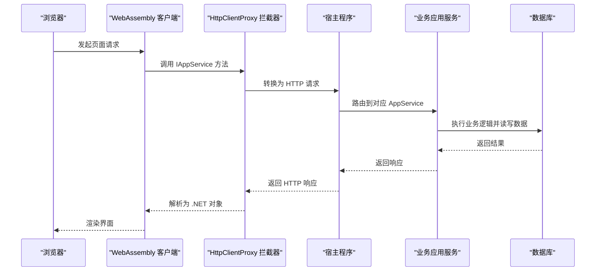
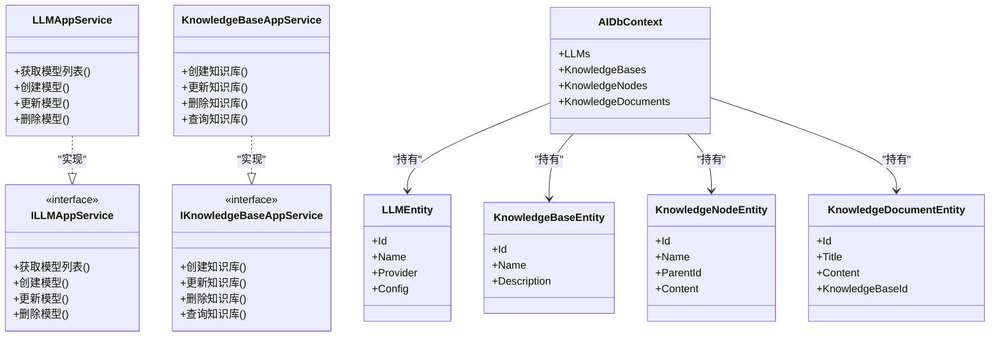
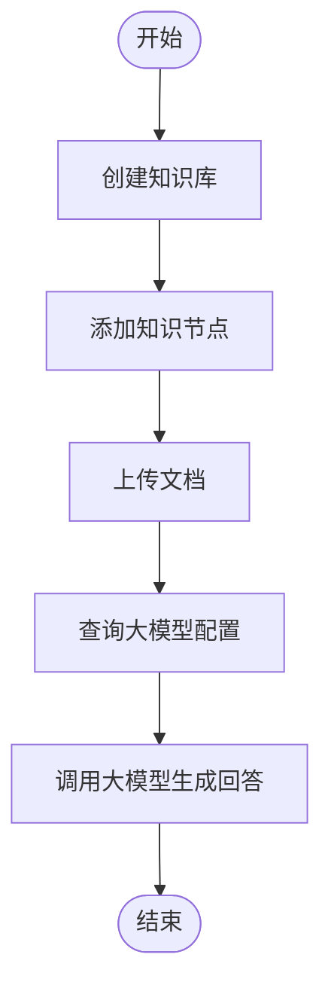
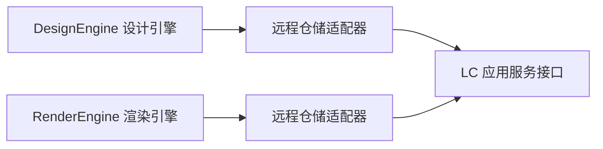
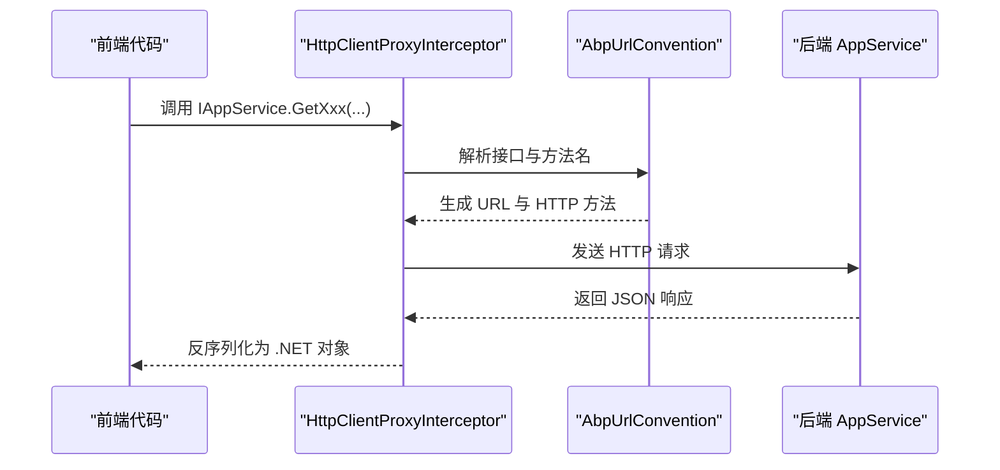

# 限界上下文划分

<cite>
**本文引用的文件**   
- [README.md](file://README.md)
- [H.AppLab.Web.Host.csproj](file://src/Host/H.AppLab.Web.Host/H.AppLab.Web.Host/H.AppLab.Web.Host.csproj)
- [H.AppLab.Web.Host.Client.csproj](file://src/Host/H.AppLab.Web.Host/H.AppLab.Web.Host.Client/H.AppLab.Web.Host.Client.csproj)
- [Program.cs](file://src/Tools/H.AI.DbMigrator/Program.cs)
- [AIDbContextFactory.cs](file://src/Tools/H.AI.DbMigrator/AIDbContextFactory.cs)
- [AIApplicationModule.cs](file://src/Services/AI/H.AI.Application/AIApplicationModule.cs)
- [AIWebModule.cs](file://src/Services/AI/H.AI.Web/AIWebModule.cs)
- [LLMAppService.cs](file://src/Services/AI/H.AI.Application/Services/LLMAppService.cs)
- [KnowledgeBaseAppService.cs](file://src/Services/AI/H.AI.Application/Services/KnowledgeBaseAppService.cs)
- [ILLMAppService.cs](file://src/Services/AI/H.AI.Application.Contracts/Services/Llms/ILLMAppService.cs)
- [IKnowledgeBaseAppService.cs](file://src/Services/AI/H.AI.Application.Contracts/Services/Knowledge/IKnowledgeBaseAppService.cs)
- [AIDbContext.cs](file://src/Services/AI/H.AI.EntityFrameworkCore/AIDbContext.cs)
- [KnowledgeBaseEntity.cs](file://src/Services/AI/H.AI.EntityFrameworkCore/Entities/KnowledgeBaseEntity.cs)
- [KnowledgeDocumentEntity.cs](file://src/Services/AI/H.AI.EntityFrameworkCore/Entities/KnowledgeDocumentEntity.cs)
- [KnowledgeNodeEntity.cs](file://src/Services/AI/H.AI.EntityFrameworkCore/Entities/KnowledgeNodeEntity.cs)
- [LLMEntity.cs](file://src/Services/AI/H.AI.EntityFrameworkCore/Entities/LLMEntity.cs)
- [DesignEngineRemoteServiceRepositoryModule.cs](file://src/LowCode/DesignEngine/H.LowCode.DesignEngine.Repository.RemoteService/DesignEngineRemoteServiceRepositoryModule.cs)
- [RenderEngineRemoteServiceRepositoryModule.cs](file://src/LowCode/RenderEngine/H.LowCode.RenderEngine.Repository.RemoteService/RenderEngineRemoteServiceRepositoryModule.cs)
- [AbpUrlConvention.cs](file://src/Utils/H.Abp.HttpClientProxy/AbpUrlConvention.cs)
- [HttpClientProxyInterceptor.cs](file://src/Utils/H.Abp.HttpClientProxy/HttpClientProxyInterceptor.cs)
- [ServiceCollectionExtensions.cs](file://src/Utils/H.Abp.HttpClientProxy/ServiceCollectionExtensions.cs)
- [IAppService.cs](file://src/Utils/H.Abp.Application.Contracts/IAppService.cs)
- [ICrudAppService.cs](file://src/Utils/H.Abp.Application.Contracts/ICrudAppService.cs)
</cite>

## 目录
1. [引言](#引言)
2. [项目结构](#项目结构)
3. [核心限界上下文](#核心限界上下文)
4. [架构总览](#架构总览)
5. [详细组件分析](#详细组件分析)
6. [依赖关系分析](#依赖关系分析)
7. [性能与一致性策略](#性能与一致性策略)
8. [故障排查指南](#故障排查指南)
9. [结论](#结论)
10. [附录：限界上下文扩展最佳实践](#附录限界上下文扩展最佳实践)

## 引言
本文件面向 H.AppLab 平台的限界上下文（Bounded Context）划分，重点说明三大限界上下文的职责边界、领域模型、业务流程与数据关系：
- LowCode（低代码平台）：负责应用与组件的元数据设计、发布与渲染。
- Services（业务服务）：按企业级业务能力划分的多个限界上下文，如账户、组织、审批、通知、订单、供应链、测试等。
- System（系统管理）：面向平台运营的系统级应用，包括企业管理和系统门户。

项目采用模块化架构，支持单体部署与按服务独立部署；前端基于 Blazor Web App，通过 IAppService 接口进行 HTTP 动态调用，实现服务端进程内调用与客户端 HTTP 代理的统一抽象。

**章节来源**
- [README.md:1-73](file://README.md#L1-L73)

## 项目结构
从仓库结构看，H.AppLab 以 src 为根，划分为 Host、Components、LowCode、Services、System、Tools、Utils 等顶层模块：
- Host：宿主程序集合，包含全量单体宿主与各服务的单服务宿主。
- Components：共享 UI 组件，如 AppDrawer。
- LowCode：低代码核心，包含 Common、DesignEngine、RenderEngine 与 meta 元数据目录。
- Services：各业务服务限界上下文，每个服务通常包含 Application、Application.Contracts、EntityFrameworkCore、Web 分层。
- System：系统级应用，包含 Enterprise 与 SystemPortal。
- Tools：每个服务对应的 DbMigrator 控制台程序。
- Utils：通用工具库，包括 ABP 契约扩展、HTTP 动态代理、Blazor 工具、ID 生成等。

```mermaid
graph TB
    subgraph "宿主与前端"
        Host["宿主程序<br/>H.AppLab.Web.Host"]
        Client["WebAssembly 客户端<br/>H.AppLab.Web.Host.Client"]
    end

    subgraph "低代码平台 LowCode"
        LC_Common["Common 公共部分"]
        LC_Design["DesignEngine 设计引擎"]
        LC_Render["RenderEngine 渲染引擎"]
        LC_Meta["meta 元数据"]
    end

    subgraph "业务服务 Services"
        S_Account["Account 账户"]
        S_Org["Organization 组织"]
        S_Approval["Approval 审批"]
        S_AI["AI 人工智能"]
        S_Notify["Notification 通知"]
        S_Order["Order 订单"]
        S_Supply["SupplyChain 供应链"]
        S_Testing["Testing 测试"]
        S_Setting["Setting 设置"]
        S_File["File 文件"]
        S_Background["BackgroundTask 后台任务"]
        S_Portal["Portal 门户"]
    end

    subgraph "系统管理 System"
        Sys_Enterprise["Enterprise 企业管理"]
        Sys_SystemPortal["SystemPortal 系统门户"]
    end

    subgraph "工具与基础设施"
        Utils["Utils 工具库"]
        Tools["Tools 迁移工具"]
    end

    Client --> Host
    Host --> LC_Design
    Host --> LC_Render
    Host --> S_Account
    Host --> S_Org
    Host --> S_Approval
    Host --> S_AI
    Host --> S_Notify
    Host --> S_Order
    Host --> S_Supply
    Host --> S_Testing
    Host --> S_Setting
    Host --> S_File
    Host --> S_Background
    Host --> Sys_Enterprise
    Host --> Sys_SystemPortal
    Client --> Utils
    Tools --> S_Account
    Tools --> S_AI
    Tools --> S_Testing
```

**图示来源**
- [H.AppLab.Web.Host.csproj:20-62](file://src/Host/H.AppLab.Web.Host/H.AppLab.Web.Host/H.AppLab.Web.Host.csproj#L20-L62)
- [H.AppLab.Web.Host.Client.csproj:114-145](file://src/Host/H.AppLab.Web.Host/H.AppLab.Web.Host.Client/H.AppLab.Web.Host.Client.csproj#L114-L145)

**章节来源**
- [README.md:1-73](file://README.md#L1-L73)
- [H.AppLab.Web.Host.csproj:20-62](file://src/Host/H.AppLab.Web.Host/H.AppLab.Web.Host/H.AppLab.Web.Host.csproj#L20-L62)
- [H.AppLab.Web.Host.Client.csproj:114-145](file://src/Host/H.AppLab.Web.Host/H.AppLab.Web.Host.Client/H.AppLab.Web.Host.Client.csproj#L114-L145)

## 核心限界上下文
### LowCode 限界上下文
职责边界：
- 提供应用与组件的可视化设计能力，产出应用与组件的元数据。
- 根据元数据动态渲染可运行的应用，支持多种主题与组件库。
- 提供元数据存储的多仓储实现（JsonFile、EntityFrameworkCore、RemoteService）。

核心实体与领域模型（概念性）：
- 应用实体：用于描述一个低代码应用的配置、菜单、页面、组件引用等元数据。
- 组件实体：用于描述可复用 UI 组件的定义、属性、事件、插槽等。
- 页面实体：用于描述页面的布局、数据源、交互行为。
- 模板实体：用于封装常用页面或组件的组合模式，便于快速构建。

主要业务流程：
- 设计阶段：用户在 DesignEngine 中编辑应用/组件，保存元数据到仓储。
- 发布阶段：将元数据发布到目标环境，供 RenderEngine 加载。
- 运行阶段：RenderEngine 读取元数据，动态渲染页面与组件。

数据关系（概念性）：
- 应用聚合多个页面与组件引用。
- 组件可被多个应用复用。
- 模板是应用或组件的组合产物，可被实例化为具体应用或组件使用。

### Services 限界上下文
职责边界：
- 按企业级业务能力拆分限界上下文，每个服务拥有独立的数据库、应用服务、领域模型与 Web API。
- 对外暴露 IAppService 接口，供前端或其他服务通过 HTTP 动态代理调用。
- 内部遵循 ABP 分层：Application.Contracts、Application、EntityFrameworkCore、Web。

代表性限界上下文示例：
- Account：账户管理与认证授权相关能力。
- Organization：组织、成员、角色等权限基础。
- Approval：审批流程定义、实例与任务。
- AI：大模型接入、知识库、文档与知识节点。
- Notification：通知渠道、类别、发送记录与业务关联。
- Order：订单、供应商等供应链相关业务。
- SupplyChain：供应链集成、接口映射与数据同步。
- Testing：测试计划、用例、执行引擎、报告等。
- Setting：系统与应用设置项管理。
- File：文件对象与项目文件管理。
- BackgroundTask：后台任务与执行记录。

核心实体与领域模型（以 AI 为例）：
- LLM：大语言模型配置与提供者信息。
- KnowledgeBase：知识库，包含多个知识节点。
- KnowledgeNode：知识节点，表示树状结构的知识点。
- KnowledgeDocument：知识库中的文档资源，与节点存在归属关系。

主要业务流程（以 AI 为例）：
- 模型配置：创建与更新 LLM 提供者。
- 知识库管理：创建知识库、添加/更新知识节点、上传文档。
- 智能问答：基于知识库与大模型完成问答或内容生成。

数据关系（以 AI 为例）：
- KnowledgeBase 聚合多个 KnowledgeNode。
- KnowledgeDocument 属于某个 KnowledgeBase 或节点。
- LLM 作为外部能力提供方，被应用服务调用。

### System 限界上下文
职责边界：
- 面向平台运营侧，提供企业管理与系统门户能力。
- 与 Services 下的企业级应用严格隔离，避免业务耦合。
- 通过应用服务暴露管理能力，如系统账户、用户、应用管理等。

代表性限界上下文示例：
- Enterprise：企业管理相关能力，如租户、企业维度数据隔离。
- SystemPortal：系统门户，提供平台运维界面与管理入口。

核心实体与领域模型（概念性）：
- 企业实体：代表平台上的企业租户。
- 系统账户与用户：管理系统访问权限与身份。
- 应用管理：管理平台应用注册、菜单与导航。

主要业务流程：
- 企业管理：创建与维护企业租户信息。
- 系统门户：管理员登录、查看平台状态、管理应用与用户。

## 架构总览
H.AppLab 的整体架构由宿主、前端客户端、低代码平台、业务服务与系统管理组成。前端通过 IAppService 接口与后端通信，在服务端为进程内调用，在客户端为 HTTP 动态代理。

**图示来源**
- [AbpUrlConvention.cs](file://src/Utils/H.Abp.HttpClientProxy/AbpUrlConvention.cs)
- [HttpClientProxyInterceptor.cs](file://src/Utils/H.Abp.HttpClientProxy/HttpClientProxyInterceptor.cs)
- [ServiceCollectionExtensions.cs](file://src/Utils/H.Abp.HttpClientProxy/ServiceCollectionExtensions.cs)
- [IAppService.cs](file://src/Utils/H.Abp.Application.Contracts/IAppService.cs)

## 详细组件分析
### AI 限界上下文组件分析
AI 限界上下文围绕大模型接入与知识库构建展开，包含应用服务、领域模型与持久化层。

**图示来源**
- [LLMAppService.cs](file://src/Services/AI/H.AI.Application/Services/LLMAppService.cs)
- [KnowledgeBaseAppService.cs](file://src/Services/AI/H.AI.Application/Services/KnowledgeBaseAppService.cs)
- [ILLMAppService.cs](file://src/Services/AI/H.AI.Application.Contracts/Services/Llms/ILLMAppService.cs)
- [IKnowledgeBaseAppService.cs](file://src/Services/AI/H.AI.Application.Contracts/Services/Knowledge/IKnowledgeBaseAppService.cs)
- [AIDbContext.cs](file://src/Services/AI/H.AI.EntityFrameworkCore/AIDbContext.cs)
- [LLMEntity.cs](file://src/Services/AI/H.AI.EntityFrameworkCore/Entities/LLMEntity.cs)
- [KnowledgeBaseEntity.cs](file://src/Services/AI/H.AI.EntityFrameworkCore/Entities/KnowledgeBaseEntity.cs)
- [KnowledgeNodeEntity.cs](file://src/Services/AI/H.AI.EntityFrameworkCore/Entities/KnowledgeNodeEntity.cs)
- [KnowledgeDocumentEntity.cs](file://src/Services/AI/H.AI.EntityFrameworkCore/Entities/KnowledgeDocumentEntity.cs)

#### AI 限界上下文业务流程图

**图示来源**
- [KnowledgeBaseAppService.cs](file://src/Services/AI/H.AI.Application/Services/KnowledgeBaseAppService.cs)
- [LLMAppService.cs](file://src/Services/AI/H.AI.Application/Services/LLMAppService.cs)

**章节来源**
- [AIApplicationModule.cs](file://src/Services/AI/H.AI.Application/AIApplicationModule.cs)
- [AIWebModule.cs](file://src/Services/AI/H.AI.Web/AIWebModule.cs)
- [LLMAppService.cs](file://src/Services/AI/H.AI.Application/Services/LLMAppService.cs)
- [KnowledgeBaseAppService.cs](file://src/Services/AI/H.AI.Application/Services/KnowledgeBaseAppService.cs)
- [ILLMAppService.cs](file://src/Services/AI/H.AI.Application.Contracts/Services/Llms/ILLMAppService.cs)
- [IKnowledgeBaseAppService.cs](file://src/Services/AI/H.Application.Contracts/Services/Knowledge/IKnowledgeBaseAppService.cs)
- [AIDbContext.cs](file://src/Services/AI/H.AI.EntityFrameworkCore/AIDbContext.cs)
- [LLMEntity.cs](file://src/Services/AI/H.AI.EntityFrameworkCore/Entities/LLMEntity.cs)
- [KnowledgeBaseEntity.cs](file://src/Services/AI/H.AI.EntityFrameworkCore/Entities/KnowledgeBaseEntity.cs)
- [KnowledgeNodeEntity.cs](file://src/Services/AI/H.AI.EntityFrameworkCore/Entities/KnowledgeNodeEntity.cs)
- [KnowledgeDocumentEntity.cs](file://src/Services/AI/H.AI.EntityFrameworkCore/Entities/KnowledgeDocumentEntity.cs)

### LowCode 限界上下文远程仓储集成
LowCode 的 DesignEngine 与 RenderEngine 均支持 RemoteService 仓储实现，以便跨限界上下文读取元数据。

**图示来源**
- [DesignEngineRemoteServiceRepositoryModule.cs](file://src/LowCode/DesignEngine/H.LowCode.DesignEngine.Repository.RemoteService/DesignEngineRemoteServiceRepositoryModule.cs)
- [RenderEngineRemoteServiceRepositoryModule.cs](file://src/LowCode/RenderEngine/H.LowCode.RenderEngine.Repository.RemoteService/RenderEngineRemoteServiceRepositoryModule.cs)

**章节来源**
- [DesignEngineRemoteServiceRepositoryModule.cs](file://src/LowCode/DesignEngine/H.LowCode.DesignEngine.Repository.RemoteService/DesignEngineRemoteServiceRepositoryModule.cs)
- [RenderEngineRemoteServiceRepositoryModule.cs](file://src/LowCode/RenderEngine/H.LowCode.RenderEngine.Repository.RemoteService/RenderEngineRemoteServiceRepositoryModule.cs)

### 前端 HTTP 动态代理机制
前端通过 HttpClientProxy 拦截 IAppService 接口调用，按 ABP 路由约定生成 HTTP 请求。

**图示来源**
- [HttpClientProxyInterceptor.cs](file://src/Utils/H.Abp.HttpClientProxy/HttpClientProxyInterceptor.cs)
- [AbpUrlConvention.cs](file://src/Utils/H.Abp.HttpClientProxy/AbpUrlConvention.cs)
- [ServiceCollectionExtensions.cs](file://src/Utils/H.Abp.HttpClientProxy/ServiceCollectionExtensions.cs)
- [IAppService.cs](file://src/Utils/H.Abp.Application.Contracts/IAppService.cs)

**章节来源**
- [AbpUrlConvention.cs](file://src/Utils/H.Abp.HttpClientProxy/AbpUrlConvention.cs)
- [HttpClientProxyInterceptor.cs](file://src/Utils/H.Abp.HttpClientProxy/HttpClientProxyInterceptor.cs)
- [ServiceCollectionExtensions.cs](file://src/Utils/H.Abp.HttpClientProxy/ServiceCollectionExtensions.cs)
- [IAppService.cs](file://src/Utils/H.Abp.Application.Contracts/IAppService.cs)

## 依赖关系分析
### 宿主与服务引用
宿主程序通过 csproj 引用各限界上下文的应用服务与 EF Core 模块，形成单体部署时的依赖图。

```mermaid
graph TB
    Host["H.AppLab.Web.Host"] --> LC_Design["DesignEngine.Application"]
    Host --> LC_Render["RenderEngine.Application"]
    Host --> S_Account["Account.Application"]
    Host --> S_Org["Organization.Application"]
    Host --> S_Approval["Approval.Application"]
    Host --> S_AI["AI.Application"]
    Host --> S_Notify["Notification.Application"]
    Host --> S_Order["Order.Application"]
    Host --> S_Supply["SupplyChain.Application"]
    Host --> S_Testing["Testing.Application"]
    Host --> S_Setting["Setting.Application"]
    Host --> S_File["File.Application"]
    Host --> S_Background["BackgroundTask.Application"]
    Host --> Sys_Enterprise["Enterprise.Application"]
    Host --> Sys_SystemPortal["SystemPortal.Application"]
```

**图示来源**
- [H.AppLab.Web.Host.csproj:20-62](file://src/Host/H.AppLab.Web.Host/H.AppLab.Web.Host/H.AppLab.Web.Host.csproj#L20-L62)

### 客户端与服务引用
WebAssembly 客户端通过 csproj 引用各服务的 Web 工程与工具库，形成运行时依赖。

```mermaid
graph TB
    Client["H.AppLab.Web.Host.Client"] --> Utils_Http["H.Abp.HttpClientProxy"]
    Client --> Portal["Portal.Web"]
    Client --> Account["Account.Web"]
    Client --> Org["Organization.Web"]
    Client --> DevHome["LowCode.DevHome"]
    Client --> Render["LowCode.RenderEngine"]
    Client --> Approval["Approval.Web"]
    Client --> Testing["Testing.Web"]
    Client --> Notification["Notification.Web"]
    Client --> AI["AI.Web"]
    Client --> Order["Order.Web"]
    Client --> Setting["Setting.Web"]
    Client --> Supply["SupplyChain.Web"]
    Client --> Background["BackgroundTask.Web"]
    Client --> File["File.Web"]
    Client --> SystemPortal["SystemPortal.Web"]
```

**图示来源**
- [H.AppLab.Web.Host.Client.csproj:114-145](file://src/Host/H.AppLab.Web.Host/H.AppLab.Web.Host.Client/H.AppLab.Web.Host.Client.csproj#L114-L145)

**章节来源**
- [H.AppLab.Web.Host.csproj:20-62](file://src/Host/H.AppLab.Web.Host/H.AppLab.Web.Host/H.AppLab.Web.Host.csproj#L20-L62)
- [H.AppLab.Web.Host.Client.csproj:114-145](file://src/Host/H.AppLab.Web.Host/H.AppLab.Web.Host.Client/H.AppLab.Web.Host.Client.csproj#L114-L145)

## 性能与一致性策略
### 性能特性
- 前端懒加载：首页仅加载必要程序集，其余应用在导航时按需下载，减少初始包体积。
- AOT 与裁剪：Release 模式启用 AOT 与 Trimming，进一步降低体积与启动时间。
- 组合式 DI：LazyModuleRegistry 与 CompositeServiceProvider 支撑懒加载后的服务注册与解析回退。

### 分布式事务与一致性
- 跨限界上下文的数据一致性建议采用最终一致性与补偿机制：
  - 同步调用：优先用于强一致场景，但需控制超时与重试策略。
  - 异步消息：通过 RabbitMQ 等消息中间件解耦跨上下文变更，结合幂等键与重试队列保证可靠性。
  - 补偿事务：对失败操作记录补偿日志，并提供补偿服务进行回滚或修复。
- 本地事务：每个限界上下文内部使用本地数据库事务保证原子性；跨上下文不依赖分布式事务，而通过事件驱动的一致性方案达成最终一致。

[本节为通用指导，不涉及具体文件]

## 故障排查指南
常见问题与定位要点：
- 迁移失败：检查 DbMigrator 程序是否成功连接到数据库，确认连接字符串与迁移脚本。
- 远程仓储不可用：检查 DesignEngine 与 RenderEngine 的 RemoteService 仓储模块是否正确注册，以及远端服务地址配置。
- 前端代理异常：确认 HttpClientProxy 已正确扫描 IAppService 接口，且 AbpUrlConvention 路由规则生效。
- 服务未启动：检查宿主程序中各 Application 与 EntityFrameworkCore 模块是否已注册。

**章节来源**
- [Program.cs](file://src/Tools/H.AI.DbMigrator/Program.cs)
- [AIDbContextFactory.cs](file://src/Tools/H.AI.DbMigrator/AIDbContextFactory.cs)
- [DesignEngineRemoteServiceRepositoryModule.cs](file://src/LowCode/DesignEngine/H.LowCode.DesignEngine.Repository.RemoteService/DesignEngineRemoteServiceRepositoryModule.cs)
- [RenderEngineRemoteServiceRepositoryModule.cs](file://src/LowCode/RenderEngine/H.LowCode.RenderEngine.Repository.RemoteService/RenderEngineRemoteServiceRepositoryModule.cs)
- [HttpClientProxyInterceptor.cs](file://src/Utils/H.Abp.HttpClientProxy/HttpClientProxyInterceptor.cs)

## 结论
H.AppLab 通过 LowCode、Services、System 三大限界上下文实现了低代码平台与企业级业务的清晰分离。LowCode 聚焦元数据设计与渲染，Services 按业务能力拆分限界上下文，System 提供平台运营能力。前端通过 IAppService 动态代理统一访问后端，宿主支持单体与独立部署。建议在跨上下文场景中采用最终一致性与补偿机制，提升系统的可扩展性与可维护性。

[本节为总结性内容，不涉及具体文件]

## 附录：限界上下文扩展最佳实践
- 新增业务限界上下文：
  - 按照 Application.Contracts / Application / EntityFrameworkCore / Web 四层结构创建新项目。
  - 在宿主 csproj 中引用新服务的应用与 EF Core 模块。
  - 在前端客户端 csproj 中引用新服务的 Web 工程。
  - 为新服务编写 IAppService 接口与实现，并通过 HttpClientProxy 暴露给前端。
- 新增低代码组件或模板：
  - 在 LowCode.Common 中扩展组件基类或默认组件库。
  - 在 DesignEngine 中增加组件/模板管理应用服务。
  - 在 RenderEngine 中增加渲染逻辑与主题适配。
- 跨上下文数据一致性：
  - 使用事件驱动的最终一致方案，避免直接跨上下文写库。
  - 对关键业务路径引入幂等键与重试队列，确保消息可靠投递。
  - 对失败路径提供补偿服务，支持人工干预与自动化修复。
- 前端懒加载优化：
  - 在 Routes.razor 中按路由触发程序集加载。
  - 使用 LazyModuleRegistry 管理模块容器，CompositeServiceProvider 提供回退解析。
  - Release 模式启用 AOT 与 Trimming，减少包体积。

[本节为通用指导，不涉及具体文件]