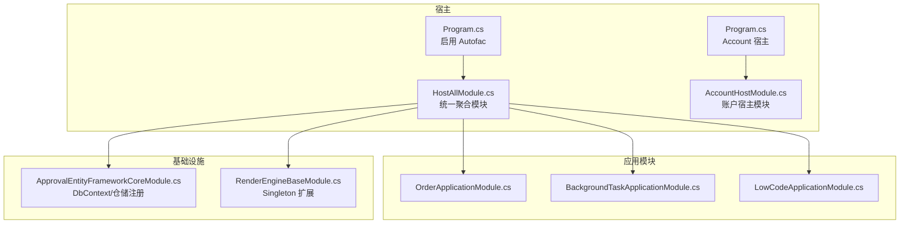
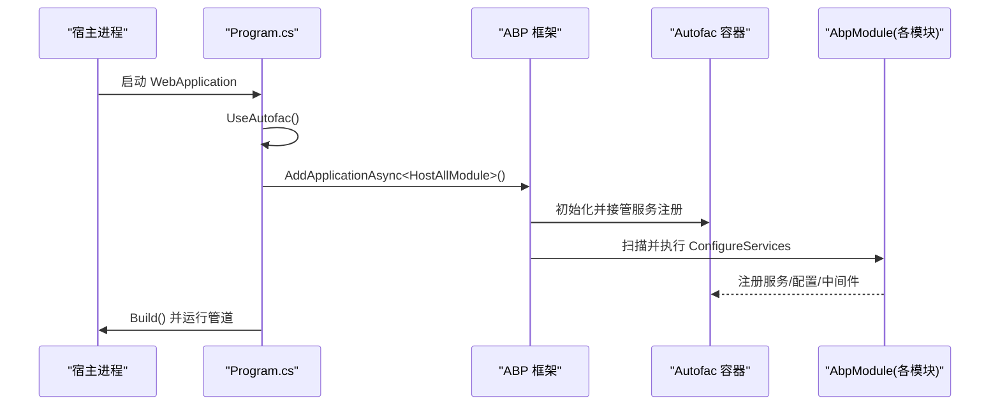
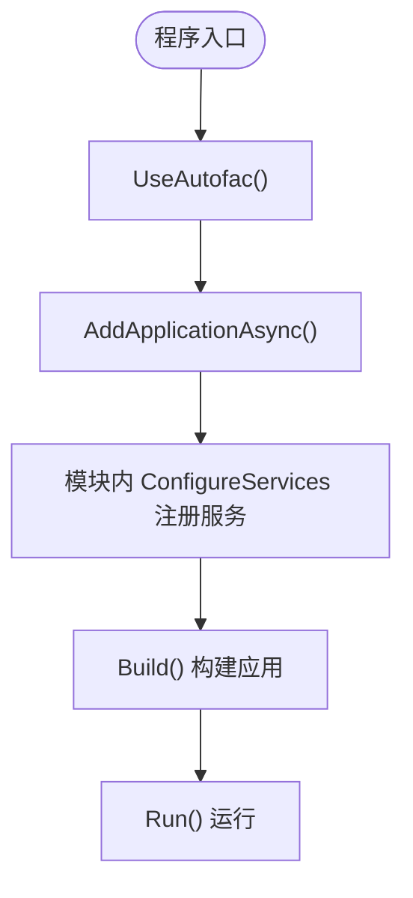
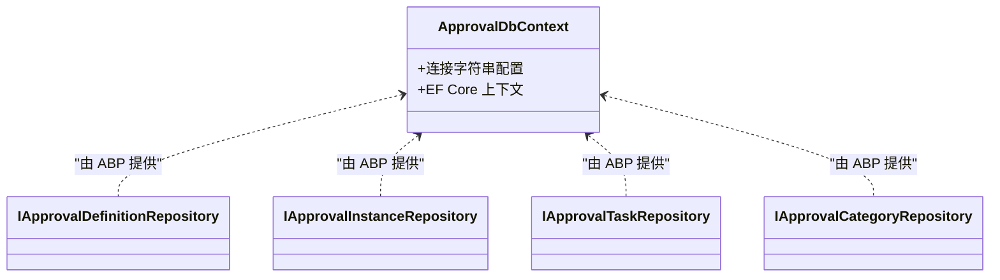
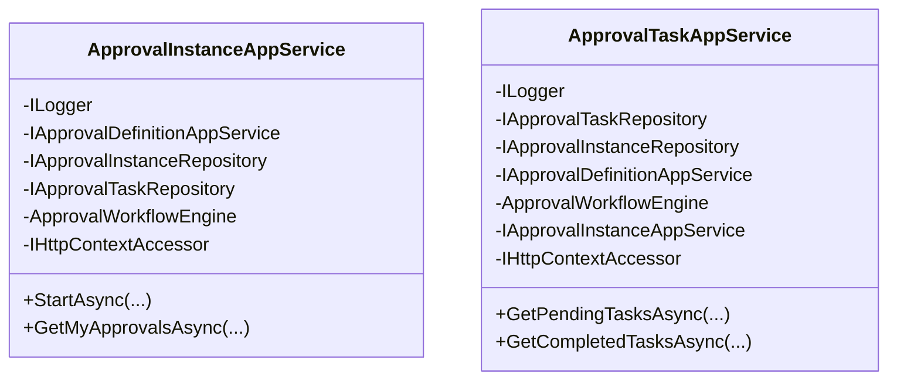
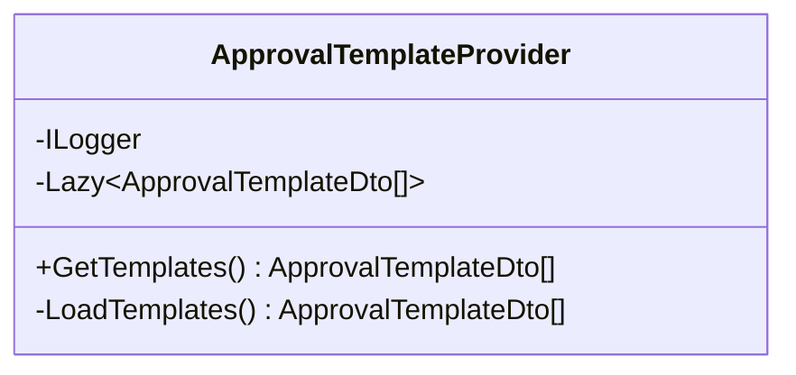
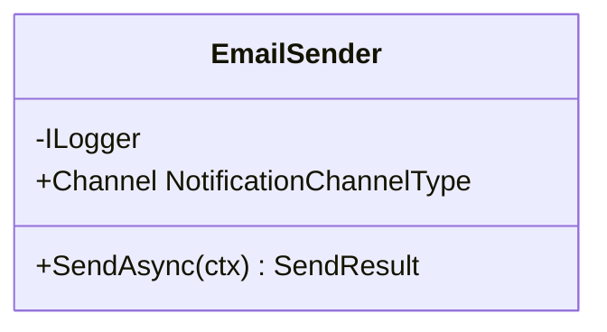
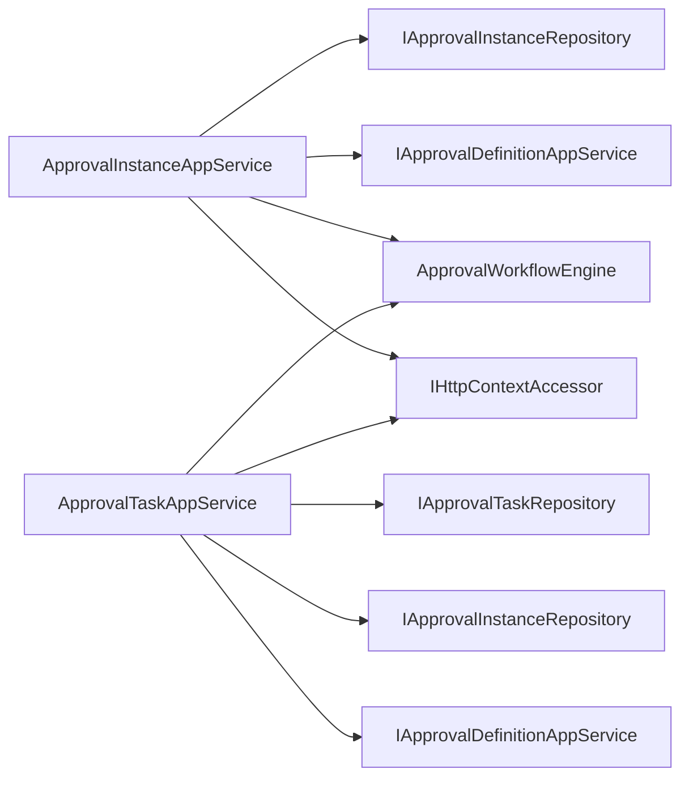

# 依赖注入容器

<cite>
**本文引用的文件**   
- [Program.cs](file://src/Host/H.AppLab.Host.All/H.AppLab.Host.All/Program.cs)
- [Program.cs](file://src/Host/Account/H.Account.Host/Program.cs)
- [HostAllModule.cs](file://src/Host/H.AppLab.Host.All/H.AppLab.Host.All/HostAllModule.cs)
- [AccountHostModule.cs](file://src/Host/Account/H.Account.Host/AccountHostModule.cs)
- [ApprovalEntityFrameworkCoreModule.cs](file://src/Services/Approval/H.Approval.EntityFrameworkCore/ApprovalEntityFrameworkCoreModule.cs)
- [OrderApplicationModule.cs](file://src/Services/Order/H.Order.Application/OrderApplicationModule.cs)
- [BackgroundTaskApplicationModule.cs](file://src/Services/BackgroundTask/H.BackgroundTask.Application/BackgroundTaskApplicationModule.cs)
- [ApprovalTemplateProvider.cs](file://src/Services/Approval/H.Approval.Application/Templates/ApprovalTemplateProvider.cs)
- [EmailSender.cs](file://src/Services/Notification/H.Notification.Application/Sending/EmailSender.cs)
- [LowCodeApplicationModule.cs](file://src/LowCode/Common/H.LowCode.Application/LowCodeApplicationModule.cs)
- [RenderEngineBaseModule.cs](file://src/LowCode/RenderEngine/H.LowCode.RenderEngineBase/RenderEngineBaseModule.cs)
- [ApprovalInstanceAppService.cs](file://src/Services/Approval/H.Approval.Application/Services/ApprovalInstanceAppService.cs)
- [ApprovalTaskAppService.cs](file://src/Services/Approval/H.Approval.Application/Services/ApprovalTaskAppService.cs)
</cite>

## 目录
1. [简介](#简介)
2. [项目结构](#项目结构)
3. [核心组件](#核心组件)
4. [架构总览](#架构总览)
5. [详细组件分析](#详细组件分析)
6. [依赖关系分析](#依赖关系分析)
7. [性能考量](#性能考量)
8. [故障排查指南](#故障排查指南)
9. [结论](#结论)
10. [附录](#附录)

## 简介
本文件面向 AppLab 平台，系统性说明 Autofac 在 ABP 框架中的集成与使用方式，覆盖服务注册、生命周期管理、依赖解析等关键主题。文档结合仓库中宿主模块与各业务模块的实际实现，给出：
- 如何在模块中注册服务（单例、作用域、瞬态）
- 构造函数注入、属性注入与方法注入的最佳实践
- 常见服务注册模式与循环依赖的解决思路
- 不同生命周期服务的管理示例与图示

## 项目结构
AppLab 采用多模块、多宿主的分层架构。宿主层通过 ABP 模块化机制组合各应用模块，并在 Program 启动阶段启用 Autofac 作为 DI 容器。各业务模块在各自的 Module 中完成服务注册与配置。

图表来源
- [Program.cs:48-51](file://src/Host/H.AppLab.Host.All/H.AppLab.Host.All/Program.cs#L48-L51)
- [Program.cs:10-13](file://src/Host/Account/H.Account.Host/Program.cs#L10-L13)
- [HostAllModule.cs:37-78](file://src/Host/H.AppLab.Host.All/H.AppLab.Host.All/HostAllModule.cs#L37-L78)
- [ApprovalEntityFrameworkCoreModule.cs:14-28](file://src/Services/Approval/H.Approval.EntityFrameworkCore/ApprovalEntityFrameworkCoreModule.cs#L14-L28)
- [RenderEngineBaseModule.cs:8-13](file://src/LowCode/RenderEngine/H.LowCode.RenderEngineBase/RenderEngineBaseModule.cs#L8-L13)

章节来源
- [Program.cs:48-51](file://src/Host/H.AppLab.Host.All/H.AppLab.Host.All/Program.cs#L48-L51)
- [Program.cs:10-13](file://src/Host/Account/H.Account.Host/Program.cs#L10-L13)
- [HostAllModule.cs:37-78](file://src/Host/H.AppLab.Host.All/H.AppLab.Host.All/HostAllModule.cs#L37-L78)

## 核心组件
- Autofac 集成点
  - 宿主 Program 调用 UseAutofac() 将 ABP 的依赖注入容器切换为 Autofac。
  - 宿主模块通过 DependsOn 声明依赖 AbpAutofacModule，确保容器能力可用。
- 模块与服务注册
  - 各 Application/EfCore 模块在 ConfigureServices 中使用 context.Services 进行服务注册。
  - 通过 AddTransient/AddScoped/AddSingleton 控制生命周期。
- 典型服务类型
  - 应用服务（AppService）：ABP 自动发现并注册（遵循约定）。
  - 领域服务/仓储：按需要显式注册，通常 Scoped/Transient。
  - 配置对象：通过 Configure<T>() 绑定配置。
  - 第三方库：如 Hangfire、CAP、AutoMapper 等在各自模块中注册。

章节来源
- [Program.cs:48-51](file://src/Host/H.AppLab.Host.All/H.AppLab.Host.All/Program.cs#L48-L51)
- [HostAllModule.cs:37-78](file://src/Host/H.AppLab.Host.All/H.AppLab.Host.All/HostAllModule.cs#L37-L78)
- [ApprovalEntityFrameworkCoreModule.cs:14-28](file://src/Services/Approval/H.Approval.EntityFrameworkCore/ApprovalEntityFrameworkCoreModule.cs#L14-L28)
- [OrderApplicationModule.cs:18-48](file://src/Services/Order/H.Order.Application/OrderApplicationModule.cs#L18-L48)
- [BackgroundTaskApplicationModule.cs:17-56](file://src/Services/BackgroundTask/H.BackgroundTask.Application/BackgroundTaskApplicationModule.cs#L17-L56)

## 架构总览
下图展示了从请求进入宿主到 ABP 模块加载、服务注册的总体流程，以及 Autofac 容器的介入点。

图表来源
- [Program.cs:48-51](file://src/Host/H.AppLab.Host.All/H.AppLab.Host.All/Program.cs#L48-L51)
- [HostAllModule.cs:81-111](file://src/Host/H.AppLab.Host.All/H.AppLab.Host.All/HostAllModule.cs#L81-L111)

## 详细组件分析

### 宿主与 Autofac 集成
- 在 Program 中启用 Autofac，并通过 AddApplicationAsync 加载统一宿主模块。
- 统一宿主模块聚合所有业务模块，集中配置认证、多租户、控制器约定等。

图表来源
- [Program.cs:48-51](file://src/Host/H.AppLab.Host.All/H.AppLab.Host.All/Program.cs#L48-L51)
- [HostAllModule.cs:81-111](file://src/Host/H.AppLab.Host.All/H.AppLab.Host.All/HostAllModule.cs#L81-L111)

章节来源
- [Program.cs:48-51](file://src/Host/H.AppLab.Host.All/H.AppLab.Host.All/Program.cs#L48-L51)
- [HostAllModule.cs:81-111](file://src/Host/H.AppLab.Host.All/H.AppLab.Host.All/HostAllModule.cs#L81-L111)

### EF Core 与仓储注册（作用域/瞬态）
- DbContext 默认按 ABP 约定为作用域；仓储可按需注册为瞬态或作用域。
- 示例中展示了对多个仓储的瞬态注册，便于按需创建与释放。

图表来源
- [ApprovalEntityFrameworkCoreModule.cs:14-28](file://src/Services/Approval/H.Approval.EntityFrameworkCore/ApprovalEntityFrameworkCoreModule.cs#L14-L28)

章节来源
- [ApprovalEntityFrameworkCoreModule.cs:14-28](file://src/Services/Approval/H.Approval.EntityFrameworkCore/ApprovalEntityFrameworkCoreModule.cs#L14-L28)

### 应用服务与依赖注入（构造函数注入）
- 应用服务通过构造函数注入 ILogger、IHttpContextAccessor、仓储、工作流引擎等依赖。
- 推荐优先使用构造函数注入，保证依赖明确、可测试性强。

图表来源
- [ApprovalInstanceAppService.cs:22-36](file://src/Services/Approval/H.Approval.Application/Services/ApprovalInstanceAppService.cs#L22-L36)
- [ApprovalTaskAppService.cs:23-39](file://src/Services/Approval/H.Approval.Application/Services/ApprovalTaskAppService.cs#L23-L39)

章节来源
- [ApprovalInstanceAppService.cs:22-36](file://src/Services/Approval/H.Approval.Application/Services/ApprovalInstanceAppService.cs#L22-L36)
- [ApprovalTaskAppService.cs:23-39](file://src/Services/Approval/H.Approval.Application/Services/ApprovalTaskAppService.cs#L23-L39)

### 单例服务与懒加载（模板提供者）
- 模板提供者实现 ISingletonDependency，内部使用 Lazy 延迟加载 JSON 资源，避免启动时开销。
- 适合全局共享且初始化成本较高的服务。

图表来源
- [ApprovalTemplateProvider.cs:13-35](file://src/Services/Approval/H.Approval.Application/Templates/ApprovalTemplateProvider.cs#L13-L35)

章节来源
- [ApprovalTemplateProvider.cs:13-35](file://src/Services/Approval/H.Approval.Application/Templates/ApprovalTemplateProvider.cs#L13-L35)

### 瞬态服务（邮件发送器）
- 邮件发送器实现 IChannelSender 与 ITransientDependency，每次请求独立实例，避免状态污染。
- 适用于无状态、轻量级的操作型服务。

图表来源
- [EmailSender.cs:27-34](file://src/Services/Notification/H.Notification.Application/Sending/EmailSender.cs#L27-L34)

章节来源
- [EmailSender.cs:27-34](file://src/Services/Notification/H.Notification.Application/Sending/EmailSender.cs#L27-L34)

### 作用域服务（设计时状态）
- LowCodeAppState 以作用域方式注册，确保每个请求拥有独立的设计时状态。
- 适合需要跨方法但限于请求生命周期的状态管理。

章节来源
- [HostAllModule.cs:99-101](file://src/Host/H.AppLab.Host.All/H.AppLab.Host.All/HostAllModule.cs#L99-L101)

### 扩展方法与自定义生命周期（WASM 场景）
- RenderEngineBaseModule 提供扩展方法，注册 ListDataOperationManager 为单例，确保 WASM 端状态保持。
- 体现通过 IServiceCollection 扩展封装领域服务的注册策略。

章节来源
- [RenderEngineBaseModule.cs:8-13](file://src/LowCode/RenderEngine/H.LowCode.RenderEngineBase/RenderEngineBaseModule.cs#L8-L13)

### 工厂模式与协议分发（供应商客户端）
- OrderApplicationModule 注册多种 ISupplierClient 实现与 SupplierClientFactory，按 Protocol 动态选择实现。
- 体现“开闭原则”下的可扩展性：新增协议只需新增实现并注册。

章节来源
- [OrderApplicationModule.cs:23-27](file://src/Services/Order/H.Order.Application/OrderApplicationModule.cs#L23-L27)

### 后台任务与调度（Hangfire）
- BackgroundTaskApplicationModule 注册背景作业执行器与调度器，并配置 Hangfire 存储与服务器。
- 体现将外部系统（Hangfire）与 DI 容器整合的典型模式。

章节来源
- [BackgroundTaskApplicationModule.cs:17-56](file://src/Services/BackgroundTask/H.BackgroundTask.Application/BackgroundTaskApplicationModule.cs#L17-L56)

### 当前应用上下文（瞬态）
- LowCodeApplicationModule 注册 ICurrentApp 为瞬态，用于获取当前应用上下文信息。

章节来源
- [LowCodeApplicationModule.cs:9-12](file://src/LowCode/Common/H.LowCode.Application/LowCodeApplicationModule.cs#L9-L12)

## 依赖关系分析
- 模块耦合
  - 统一宿主模块聚合大量子模块，形成高内聚、低耦合的分层边界。
  - 各应用模块通过接口解耦，仓储与应用服务之间通过 ABP 约定的数据访问层交互。
- 直接/间接依赖
  - 应用服务依赖仓储、工作流引擎、HTTP 上下文访问器等。
  - 基础设施模块（EF Core、Hangfire、CAP）通过各自 Module 暴露服务。
- 循环依赖
  - 通过接口抽象与延迟解析（LazyServiceProvider）降低环风险。
  - 若出现环，建议拆分职责或使用事件总线/消息队列解耦。

图表来源
- [ApprovalInstanceAppService.cs:22-36](file://src/Services/Approval/H.Approval.Application/Services/ApprovalInstanceAppService.cs#L22-L36)
- [ApprovalTaskAppService.cs:23-39](file://src/Services/Approval/H.Approval.Application/Services/ApprovalTaskAppService.cs#L23-L39)

章节来源
- [ApprovalInstanceAppService.cs:22-36](file://src/Services/Approval/H.Approval.Application/Services/ApprovalInstanceAppService.cs#L22-L36)
- [ApprovalTaskAppService.cs:23-39](file://src/Services/Approval/H.Approval.Application/Services/ApprovalTaskAppService.cs#L23-L39)

## 性能考量
- 生命周期选择
  - 单例：仅用于无状态、线程安全的服务（如模板提供者、只读配置缓存）。
  - 作用域：适合请求级状态（如 HttpContext 相关、设计时状态）。
  - 瞬态：适合轻量、无状态的操作型服务（如邮件发送器）。
- 延迟初始化
  - 使用 Lazy 减少启动时间与冷路径开销（如模板加载）。
- 外部系统接入
  - 合理设置超时、重试与连接池（如 CAP、Hangfire、HttpClient）。
- 内存与并发
  - 避免在单例中持有可变状态；必要时使用并发安全的集合或锁。

[本节为通用指导，不直接分析具体文件]

## 故障排查指南
- 常见问题
  - 未正确启用 Autofac：确认 Program 中已调用 UseAutofac() 且模块 DependsOn AbpAutofacModule。
  - 服务未注册：检查对应 Module 的 ConfigureServices 是否包含 AddTransient/AddScoped/AddSingleton。
  - 循环依赖：检查服务间引用，必要时引入接口或延迟解析。
  - 生命周期误用：单例中持有瞬态/作用域依赖会导致异常或状态泄漏。
- 定位步骤
  - 查看模块加载顺序与 DependsOn 声明。
  - 检查 EF Core 连接字符串与仓储注册。
  - 核对第三方库（Hangfire/CAP/AutoMapper）的配置与注册。

章节来源
- [Program.cs:48-51](file://src/Host/H.AppLab.Host.All/H.AppLab.Host.All/Program.cs#L48-L51)
- [HostAllModule.cs:37-78](file://src/Host/H.AppLab.Host.All/H.AppLab.Host.All/HostAllModule.cs#L37-L78)
- [ApprovalEntityFrameworkCoreModule.cs:14-28](file://src/Services/Approval/H.Approval.EntityFrameworkCore/ApprovalEntityFrameworkCoreModule.cs#L14-L28)

## 结论
AppLab 平台基于 ABP 与 Autofac 构建了清晰、可扩展的依赖注入体系。通过模块化组织、合理的生命周期管理与最佳实践（构造函数注入、接口抽象、延迟初始化），实现了高内聚、低耦合与良好的可维护性。建议在新增功能时遵循现有模式，确保服务注册与生命周期一致，避免循环依赖与状态污染。

[本节为总结，不直接分析具体文件]

## 附录
- 常用生命周期选择建议
  - 单例：全局配置、只读缓存、模板提供者
  - 作用域：请求级状态、数据库上下文、设计时状态
  - 瞬态：无状态操作、外部通信封装（SMTP、Webhook）
- 常见注册模式
  - 接口到实现的映射（工厂/策略）
  - 扩展方法封装领域服务注册
  - 第三方库集成（Hangfire、CAP、AutoMapper）

[本节为补充说明，不直接分析具体文件]