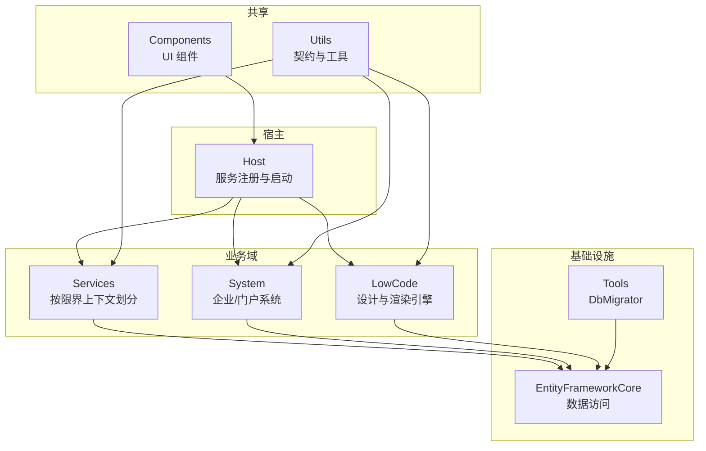
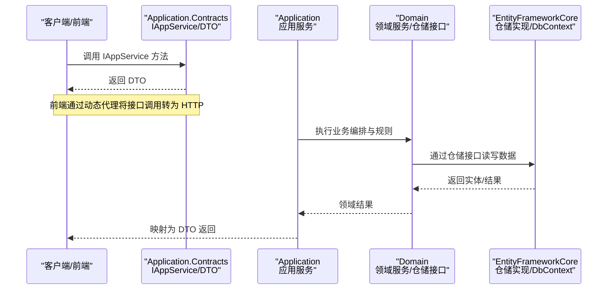
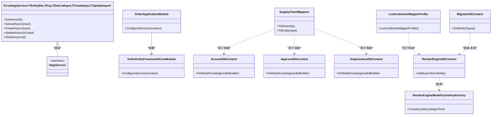
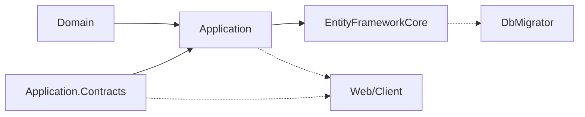

# 分层架构设计

<cite>
**本文引用的文件**   
- [README.md](file://README.md)
- [IAppService.cs](file://src/Utils/H.Abp.Application.Contracts/IAppService.cs)
- [ICrudAppService.cs](file://src/Utils/H.Abp.Application.Contracts/ICrudAppService.cs)
- [EntityDto.cs](file://src/Utils/H.Abp.Application.Contracts/EntityDto.cs)
- [PagedResultDto.cs](file://src/Utils/H.Abp.Application.Contracts/PagedResultDto.cs)
- [OrderApplicationContractsModule.cs](file://src\Services\Order\H.Order.Application.Contracts\OrderApplicationContractsModule.cs)
- [OrderApplicationModule.cs](file://src\Services\Order\H.Order.Application\OrderApplicationModule.cs)
- [OrderEntityFrameworkCoreModule.cs](file://src\Services\Order\H.Order.EntityFrameworkCore\OrderEntityFrameworkCoreModule.cs)
- [AccountDbContext.cs](file://src\Services\Account\H.Account.EntityFrameworkCore\AccountDbContext.cs)
- [ApprovalDbContext.cs](file://src\Services\Approval\H.Approval.EntityFrameworkCore\ApprovalDbContext.cs)
- [OrganizationDbContext.cs](file://src\Services\Organization\H.Organization.EntityFrameworkCore\OrganizationDbContext.cs)
- [SupplyChainMappers.cs](file://src\Services\SupplyChain\H.SupplyChain.Application\Mapping\SupplyChainMappers.cs)
- [LowCodeAutoMapperProfile.cs](file://src\LowCode\RenderEngine\H.LowCode.RenderEngine.Application\MapperProfiles\LowCodeAutoMapperProfile.cs)
- [RenderEngineEntityFrameworkCoreModule.cs](file://src\LowCode\RenderEngine\H.LowCode.RenderEngine.EntityFrameworkCore\RenderEngineEntityFrameworkCoreModule.cs)
- [RenderEngineDbContext.cs](file://src\LowCode\RenderEngine\H.LowCode.RenderEngine.EntityFrameworkCore\EntityFrameworkCore\RenderEngineDbContext.cs)
- [RenderEngineModelCacheKeyFactory.cs](file://src\LowCode\RenderEngine\H.LowCode.RenderEngine.EntityFrameworkCore\EntityFrameworkCore\Extensions\RenderEngineModelCacheKeyFactory.cs)
- [MigratorDbContext.cs](file://src\Tools\H.LowCode.DbMigrator\MigrationServices\MigratorDbContext.cs)
- [EntityFrameworkCoreDbSchemaMigrator.cs](file://src\Tools\H.LowCode.DbMigrator\MigrationServices\EntityFrameworkCoreDbSchemaMigrator.cs)
</cite>

## 目录
1. [引言](#引言)
2. [项目结构](#项目结构)
3. [核心组件](#核心组件)
4. [架构总览](#架构总览)
5. [详细组件分析](#详细组件分析)
6. [依赖关系分析](#依赖关系分析)
7. [性能考量](#性能考量)
8. [故障排查指南](#故障排查指南)
9. [结论](#结论)
10. [附录](#附录)

## 引言
本文件面向 AppLab 平台，系统化阐述基于 ABP 框架的分层架构模式与实现。重点说明 Application.Contracts（接口与 DTO）、Application（应用服务实现）、Domain（领域逻辑）与 EntityFrameworkCore（数据访问层）的职责边界、依赖方向与数据流向；并通过接口隔离实现松耦合。文档同时给出 DTO 映射原则与实践、典型代码示例路径以及分层架构图，帮助读者快速理解并落地最佳实践。

## 项目结构
- 宿主程序 Host：不包含业务逻辑，仅进行各模块的服务注册与启动编排。支持单体与按服务独立部署两种模式。
- 共享 UI Components：提供可复用的前端组件（如 AppDrawer）。
- LowCode：低代码核心，包含元数据 Schema、组件基类、默认组件库、设计与渲染引擎等。
- Services：按限界上下文划分的业务模块，每个模块遵循 Application.Contracts / Application / EntityFrameworkCore / Web 分层。
- System：系统级应用（Enterprise、SystemPortal），与企业级应用严格隔离。
- Tools：数据库迁移工具（DbMigrator）。
- Utils：通用工具与契约基础类型（如 IAppService、ICrudAppService、DTO 基类等）。

图表来源 
- [README.md:1-74](file://README.md#L1-L74)

章节来源
- [README.md:1-74](file://README.md#L1-L74)

## 核心组件
- 应用契约层（Application.Contracts）
  - 定义对外暴露的 IAppService 接口与 DTO，作为前后端与服务间通信契约。
  - 提供 ICrudAppService 统一 CRUD 签名，简化重复代码。
  - 提供通用 DTO 基类（EntityDto、PagedResultDto 等）。
- 应用服务层（Application）
  - 实现 IAppService 接口，编排业务流程，协调领域服务与仓储。
  - 负责输入校验、权限检查、事务边界、异常处理与 DTO 映射。
- 领域层（Domain）
  - 封装领域模型、领域服务与领域事件，承载核心业务规则。
  - 通过仓储接口与数据层解耦。
- 数据访问层（EntityFrameworkCore）
  - 使用 EF Core 配置实体、关系与查询优化。
  - 提供 DbContext 与仓储实现，屏蔽持久化细节。

章节来源
- [IAppService.cs:1-9](file://src/Utils/H.Abp.Application.Contracts/IAppService.cs#L1-L9)
- [ICrudAppService.cs:1-14](file://src/Utils/H.Abp.Application.Contracts/ICrudAppService.cs#L1-L14)
- [EntityDto.cs:1-7](file://src/Utils/H.Abp.Application.Contracts/EntityDto.cs#L1-L7)
- [PagedResultDto.cs:1-20](file://src/Utils/H.Abp.Application.Contracts/PagedResultDto.cs#L1-L20)

## 架构总览
ABP 分层在 AppLab 中的典型调用链如下：Web/客户端 → Application.Contracts（HTTP 代理或进程内）→ Application（应用服务）→ Domain（领域服务/仓储接口）→ EntityFrameworkCore（仓储实现/DbContext）。

图表来源 
- [OrderApplicationModule.cs:1-49](file://src\Services\Order\H.Order.Application\OrderApplicationModule.cs#L1-L49)
- [OrderEntityFrameworkCoreModule.cs:1-31](file://src\Services\Order\H.Order.EntityFrameworkCore\OrderEntityFrameworkCoreModule.cs#L1-L31)

章节来源
- [OrderApplicationModule.cs:1-49](file://src\Services\Order\H.Order.Application\OrderApplicationModule.cs#L1-L49)
- [OrderEntityFrameworkCoreModule.cs:1-31](file://src\Services\Order\H.Order.EntityFrameworkCore\OrderEntityFrameworkCoreModule.cs#L1-L31)

## 详细组件分析

### 契约层（Application.Contracts）职责与约定
- 职责
  - 定义 IAppService 接口族与 DTO，作为跨进程/跨层的稳定契约。
  - 提供统一的 CRUD 接口签名与分页结果结构，降低重复开发成本。
- 约定
  - 所有对外服务接口需继承 IAppService，便于动态代理扫描与路由生成。
  - DTO 尽量只包含传输所需字段，避免泄露领域内部结构。
- 典型示例路径
  - 契约标记与装配：[OrderApplicationContractsModule.cs:1-10](file://src\Services\Order\H.Order.Application.Contracts\OrderApplicationContractsModule.cs#L1-L10)
  - 基础接口与 DTO：[IAppService.cs:1-9](file://src/Utils/H.Abp.Application.Contracts/IAppService.cs#L1-L9)、[ICrudAppService.cs:1-14](file://src/Utils/H.Abp.Application.Contracts/ICrudAppService.cs#L1-L14)、[EntityDto.cs:1-7](file://src/Utils/H.Abp.Application.Contracts/EntityDto.cs#L1-L7)、[PagedResultDto.cs:1-20](file://src/Utils/H.Abp.Application.Contracts/PagedResultDto.cs#L1-L20)

章节来源
- [OrderApplicationContractsModule.cs:1-10](file://src\Services\Order\H.Order.Application.Contracts\OrderApplicationContractsModule.cs#L1-L10)
- [IAppService.cs:1-9](file://src/Utils/H.Abp.Application.Contracts/IAppService.cs#L1-L9)
- [ICrudAppService.cs:1-14](file://src/Utils/H.Abp.Application.Contracts/ICrudAppService.cs#L1-L14)
- [EntityDto.cs:1-7](file://src/Utils/H.Abp.Application.Contracts/EntityDto.cs#L1-L7)
- [PagedResultDto.cs:1-20](file://src/Utils/H.Abp.Application.Contracts/PagedResultDto.cs#L1-L20)

### 应用服务层（Application）职责与实现要点
- 职责
  - 实现 IAppService，编排跨领域用例，处理输入输出、权限、事务与异常。
  - 协调领域服务与仓储，完成 DTO 与实体之间的映射。
- 实现要点
  - 使用 ABP 的 ApplicationService 基类，自动获得日志、验证、审计等横切能力。
  - 通过 DI 注入仓储接口，避免直接依赖 EF Core。
  - 对复杂映射采用手工扩展方法或 AutoMapper Profile。
- 典型示例路径
  - 模块装配与依赖声明：[OrderApplicationModule.cs:1-49](file://src\Services\Order\H.Order.Application\OrderApplicationModule.cs#L1-L49)
  - 手工映射示例：[SupplyChainMappers.cs:1-276](file://src\Services\SupplyChain\H.SupplyChain.Application\Mapping\SupplyChainMappers.cs#L1-L276)
  - AutoMapper 配置示例：[LowCodeAutoMapperProfile.cs:1-17](file://src\LowCode\RenderEngine\H.LowCode.RenderEngine.Application\MapperProfiles\LowCodeAutoMapperProfile.cs#L1-L17)

章节来源
- [OrderApplicationModule.cs:1-49](file://src\Services\Order\H.Order.Application\OrderApplicationModule.cs#L1-L49)
- [SupplyChainMappers.cs:1-276](file://src\Services\SupplyChain\H.SupplyChain.Application\Mapping\SupplyChainMappers.cs#L1-L276)
- [LowCodeAutoMapperProfile.cs:1-17](file://src\LowCode\RenderEngine\H.LowCode.RenderEngine.Application\MapperProfiles\LowCodeAutoMapperProfile.cs#L1-L17)

### 领域层（Domain）职责与边界
- 职责
  - 定义领域模型、领域服务、领域事件与仓储接口，封装核心业务规则。
  - 不依赖具体技术栈（如 EF Core），通过接口与外部解耦。
- 边界
  - 不包含 UI、HTTP、序列化等技术细节。
  - 通过仓储接口与数据层交互，保证领域纯净性。
- 典型示例路径
  - 领域模块占位与扩展点：[RenderEngineDomainModule.cs:1-11](file://src\LowCode\RenderEngine\H.LowCode.RenderEngine.Domain\RenderEngineDomainModule.cs#L1-L11)

章节来源
- [RenderEngineDomainModule.cs:1-11](file://src\LowCode\RenderEngine\H.LowCode.RenderEngine.Domain\RenderEngineDomainModule.cs#L1-L11)

### 数据访问层（EntityFrameworkCore）职责与配置
- 职责
  - 定义 DbContext、实体映射、索引与关系，提供仓储实现。
  - 管理连接字符串、数据库提供者与模型缓存键。
- 配置要点
  - 使用 AbpDbContext 与 AddAbpDbContext 简化仓储生成。
  - 针对多租户/多应用场景，使用自定义 ModelCacheKeyFactory 隔离模型缓存。
- 典型示例路径
  - EF Core 模块注册与连接配置：[OrderEntityFrameworkCoreModule.cs:1-31](file://src\Services\Order\H.Order.EntityFrameworkCore\OrderEntityFrameworkCoreModule.cs#L1-L31)
  - Identity 上下文示例：[AccountDbContext.cs:1-33](file://src\Services\Account\H.Account.EntityFrameworkCore\AccountDbContext.cs#L1-L33)
  - 复杂实体关系配置：[ApprovalDbContext.cs:43-71](file://src\Services\Approval\H.Approval.EntityFrameworkCore\ApprovalDbContext.cs#L43-L71)、[OrganizationDbContext.cs:81-118](file://src\Services\Organization\H.Organization.EntityFrameworkCore\OrganizationDbContext.cs#L81-L118)
  - 多应用模型缓存键工厂：[RenderEngineModelCacheKeyFactory.cs:1-13](file://src\LowCode\RenderEngine\H.LowCode.RenderEngine.EntityFrameworkCore\EntityFrameworkCore\Extensions\RenderEngineModelCacheKeyFactory.cs#L1-L13)
  - 动态实体迁移上下文：[MigratorDbContext.cs:1-36](file://src\Tools\H.LowCode.DbMigrator\MigrationServices\MigratorDbContext.cs#L1-L36)

章节来源
- [OrderEntityFrameworkCoreModule.cs:1-31](file://src\Services\Order\H.Order.EntityFrameworkCore\OrderEntityFrameworkCoreModule.cs#L1-L31)
- [AccountDbContext.cs:1-33](file://src\Services\Account\H.Account.EntityFrameworkCore\AccountDbContext.cs#L1-L33)
- [ApprovalDbContext.cs:43-71](file://src\Services\Approval\H.Approval.EntityFrameworkCore\ApprovalDbContext.cs#L43-L71)
- [OrganizationDbContext.cs:81-118](file://src\Services\Organization\H.Organization.EntityFrameworkCore\OrganizationDbContext.cs#L81-L118)
- [RenderEngineModelCacheKeyFactory.cs:1-13](file://src\LowCode\RenderEngine\H.LowCode.RenderEngine.EntityFrameworkCore\EntityFrameworkCore\Extensions\RenderEngineModelCacheKeyFactory.cs#L1-L13)
- [MigratorDbContext.cs:1-36](file://src\Tools\H.LowCode.DbMigrator\MigrationServices\MigratorDbContext.cs#L1-L36)

### DTO 映射设计与最佳实践
- 设计原则
  - DTO 仅承载传输所需字段，避免直接暴露领域实体。
  - 使用统一的基类（EntityDto、FullAuditedEntityDto 等）与分页结构（PagedResultDto）。
  - 映射策略：简单场景用手工扩展方法（清晰可控），复杂场景用 AutoMapper Profile（集中维护）。
- 最佳实践
  - 在 Application 层集中实现映射，保持 Domain 纯净。
  - 对批量映射进行性能优化（如先收集 ID 再批量查询，减少 N+1）。
- 典型示例路径
  - 手工映射扩展方法：[SupplyChainMappers.cs:1-276](file://src\Services\SupplyChain\H.SupplyChain.Application\Mapping\SupplyChainMappers.cs#L1-L276)
  - AutoMapper Profile 配置：[LowCodeAutoMapperProfile.cs:1-17](file://src\LowCode\RenderEngine\H.LowCode.RenderEngine.Application\MapperProfiles\LowCodeAutoMapperProfile.cs#L1-L17)

章节来源
- [SupplyChainMappers.cs:1-276](file://src\Services\SupplyChain\H.SupplyChain.Application\Mapping\SupplyChainMappers.cs#L1-L276)
- [LowCodeAutoMapperProfile.cs:1-17](file://src\LowCode\RenderEngine\H.LowCode.RenderEngine.Application\MapperProfiles\LowCodeAutoMapperProfile.cs#L1-L17)

### 分层架构图（代码级映射）

图表来源 
- [IAppService.cs:1-9](file://src/Utils/H.Abp.Application.Contracts/IAppService.cs#L1-L9)
- [ICrudAppService.cs:1-14](file://src/Utils/H.Abp.Application.Contracts/ICrudAppService.cs#L1-L14)
- [OrderApplicationModule.cs:1-49](file://src\Services\Order\H.Order.Application\OrderApplicationModule.cs#L1-L49)
- [OrderEntityFrameworkCoreModule.cs:1-31](file://src\Services\Order\H.Order.EntityFrameworkCore\OrderEntityFrameworkCoreModule.cs#L1-L31)
- [AccountDbContext.cs:1-33](file://src\Services\Account\H.Account.EntityFrameworkCore\AccountDbContext.cs#L1-L33)
- [ApprovalDbContext.cs:43-71](file://src\Services\Approval\H.Approval.EntityFrameworkCore\ApprovalDbContext.cs#L43-L71)
- [OrganizationDbContext.cs:81-118](file://src\Services\Organization\H.Organization.EntityFrameworkCore\OrganizationDbContext.cs#L81-L118)
- [SupplyChainMappers.cs:1-276](file://src\Services\SupplyChain\H.SupplyChain.Application\Mapping\SupplyChainMappers.cs#L1-L276)
- [LowCodeAutoMapperProfile.cs:1-17](file://src\LowCode\RenderEngine\H.LowCode.RenderEngine.Application\MapperProfiles\LowCodeAutoMapperProfile.cs#L1-L17)
- [RenderEngineDbContext.cs:1-39](file://src\LowCode\RenderEngine\H.LowCode.RenderEngine.EntityFrameworkCore\EntityFrameworkCore\RenderEngineDbContext.cs#L1-L39)
- [RenderEngineModelCacheKeyFactory.cs:1-13](file://src\LowCode\RenderEngine\H.LowCode.RenderEngine.EntityFrameworkCore\EntityFrameworkCore\Extensions\RenderEngineModelCacheKeyFactory.cs#L1-L13)
- [MigratorDbContext.cs:1-36](file://src\Tools\H.LowCode.DbMigrator\MigrationServices\MigratorDbContext.cs#L1-L36)

## 依赖关系分析
- 依赖方向
  - Application.Contracts 不依赖其他层，仅被上层（Web/Client）与 Application 引用。
  - Application 依赖 Contracts 与 Domain，通过 DI 获取仓储接口。
  - Domain 不依赖任何基础设施，仅定义仓储接口。
  - EntityFrameworkCore 依赖 Domain（仓储接口）与 EF Core 框架。
- 模块装配
  - 各模块通过 AbpModule 声明 DependsOn，确保加载顺序与依赖正确性。
- 典型示例路径
  - 应用模块装配：[OrderApplicationModule.cs:1-49](file://src\Services\Order\H.Order.Application\OrderApplicationModule.cs#L1-L49)
  - EF Core 模块装配：[OrderEntityFrameworkCoreModule.cs:1-31](file://src\Services\Order\H.Order.EntityFrameworkCore\OrderEntityFrameworkCoreModule.cs#L1-L31)

图表来源 
- [OrderApplicationModule.cs:1-49](file://src\Services\Order\H.Order.Application\OrderApplicationModule.cs#L1-L49)
- [OrderEntityFrameworkCoreModule.cs:1-31](file://src\Services\Order\H.Order.EntityFrameworkCore\OrderEntityFrameworkCoreModule.cs#L1-L31)

章节来源
- [OrderApplicationModule.cs:1-49](file://src\Services\Order\H.Order.Application\OrderApplicationModule.cs#L1-L49)
- [OrderEntityFrameworkCoreModule.cs:1-31](file://src\Services\Order\H.Order.EntityFrameworkCore\OrderEntityFrameworkCoreModule.cs#L1-L31)

## 性能考量
- 数据传输对象（DTO）最小化：仅传输必要字段，减少网络与序列化开销。
- 批量查询与去重：在应用服务中先收集 ID，再进行批量查询，避免 N+1 问题。
- 模型缓存键隔离：在多应用/多租户场景下，使用自定义 ModelCacheKeyFactory 避免模型冲突。
- 懒加载与 AOT：前端按需加载程序集，Release 启用 AOT 与裁剪，减小包体积。
- 异步与并发：仓储与 EF Core 操作使用异步 API，提升吞吐。

章节来源
- [SupplyChainMappers.cs:1-276](file://src\Services\SupplyChain\H.SupplyChain.Application\Mapping\SupplyChainMappers.cs#L1-L276)
- [RenderEngineModelCacheKeyFactory.cs:1-13](file://src\LowCode\RenderEngine\H.LowCode.RenderEngine.EntityFrameworkCore\EntityFrameworkCore\Extensions\RenderEngineModelCacheKeyFactory.cs#L1-L13)
- [README.md:69-74](file://README.md#L69-L74)

## 故障排查指南
- 数据库迁移失败
  - 检查 DbMigrator 上下文是否正确加载动态实体类型。
  - 确认连接字符串与迁移文件位置。
  - 参考路径：[MigratorDbContext.cs:1-36](file://src\Tools\H.LowCode.DbMigrator\MigrationServices\MigratorDbContext.cs#L1-L36)、[EntityFrameworkCoreDbSchemaMigrator.cs:1-28](file://src\Tools\H.LowCode.DbMigrator\MigrationServices\EntityFrameworkCoreDbSchemaMigrator.cs#L1-L28)
- 模型缓存冲突
  - 在多应用环境下，确保自定义 ModelCacheKeyFactory 能区分不同应用实例。
  - 参考路径：[RenderEngineModelCacheKeyFactory.cs:1-13](file://src\LowCode\RenderEngine\H.LowCode.RenderEngine.EntityFrameworkCore\EntityFrameworkCore\Extensions\RenderEngineModelCacheKeyFactory.cs#L1-L13)
- 实体关系配置错误
  - 检查 OnModelCreating 中的 HasOne/HasMany、外键与删除行为。
  - 参考路径：[ApprovalDbContext.cs:43-71](file://src\Services\Approval\H.Approval.EntityFrameworkCore\ApprovalDbContext.cs#L43-L71)、[OrganizationDbContext.cs:81-118](file://src\Services\Organization\H.Organization.EntityFrameworkCore\OrganizationDbContext.cs#L81-L118)
- 映射不一致
  - 手工映射与 AutoMapper 配置需保持一致，避免字段遗漏或类型不匹配。
  - 参考路径：[SupplyChainMappers.cs:1-276](file://src\Services\SupplyChain\H.SupplyChain.Application\Mapping\SupplyChainMappers.cs#L1-L276)、[LowCodeAutoMapperProfile.cs:1-17](file://src\LowCode\RenderEngine\H.LowCode.RenderEngine.Application\MapperProfiles\LowCodeAutoMapperProfile.cs#L1-L17)

章节来源
- [MigratorDbContext.cs:1-36](file://src\Tools\H.LowCode.DbMigrator\MigrationServices\MigratorDbContext.cs#L1-L36)
- [EntityFrameworkCoreDbSchemaMigrator.cs:1-28](file://src\Tools\H.LowCode.DbMigrator\MigrationServices\EntityFrameworkCoreDbSchemaMigrator.cs#L1-L28)
- [RenderEngineModelCacheKeyFactory.cs:1-13](file://src\LowCode\RenderEngine\H.LowCode.RenderEngine.EntityFrameworkCore\EntityFrameworkCore\Extensions\RenderEngineModelCacheKeyFactory.cs#L1-L13)
- [ApprovalDbContext.cs:43-71](file://src\Services\Approval\H.Approval.EntityFrameworkCore\ApprovalDbContext.cs#L43-L71)
- [OrganizationDbContext.cs:81-118](file://src\Services\Organization\H.Organization.EntityFrameworkCore\OrganizationDbContext.cs#L81-L118)
- [SupplyChainMappers.cs:1-276](file://src\Services\SupplyChain\H.SupplyChain.Application\Mapping\SupplyChainMappers.cs#L1-L276)
- [LowCodeAutoMapperProfile.cs:1-17](file://src\LowCode\RenderEngine\H.LowCode.RenderEngine.Application\MapperProfiles\LowCodeAutoMapperProfile.cs#L1-L17)

## 结论
AppLab 平台基于 ABP 的分层架构实现了清晰的职责划分与松耦合：Application.Contracts 作为稳定契约，Application 编排业务，Domain 承载核心规则，EntityFrameworkCore 专注数据访问。通过接口隔离、DTO 最小化与合理的映射策略，系统在可维护性、可扩展性与性能方面均具备良好表现。结合模块化装配与动态代理，前后端与服务间通信简洁高效，适合大规模企业级应用与低代码平台的持续演进。

## 附录
- 关键概念速查
  - IAppService：应用服务标记接口，用于 HTTP 动态代理与远程调用。
  - ICrudAppService：标准 CRUD 接口签名，减少样板代码。
  - PagedResultDto：统一分页结果结构。
  - AbpModule：模块装配与依赖声明。
- 典型示例路径汇总
  - 契约与 DTO：[IAppService.cs:1-9](file://src/Utils/H.Abp.Application.Contracts/IAppService.cs#L1-L9)、[ICrudAppService.cs:1-14](file://src/Utils/H.Abp.Application.Contracts/ICrudAppService.cs#L1-L14)、[EntityDto.cs:1-7](file://src/Utils/H.Abp.Application.Contracts/EntityDto.cs#L1-L7)、[PagedResultDto.cs:1-20](file://src/Utils/H.Abp.Application.Contracts/PagedResultDto.cs#L1-L20)
  - 应用模块：[OrderApplicationModule.cs:1-49](file://src\Services\Order\H.Order.Application\OrderApplicationModule.cs#L1-L49)
  - EF Core 模块：[OrderEntityFrameworkCoreModule.cs:1-31](file://src\Services\Order\H.Order.EntityFrameworkCore\OrderEntityFrameworkCoreModule.cs#L1-L31)
  - 上下文与映射：[AccountDbContext.cs:1-33](file://src\Services\Account\H.Account.EntityFrameworkCore\AccountDbContext.cs#L1-L33)、[ApprovalDbContext.cs:43-71](file://src\Services\Approval\H.Approval.EntityFrameworkCore\ApprovalDbContext.cs#L43-L71)、[OrganizationDbContext.cs:81-118](file://src\Services\Organization\H.Organization.EntityFrameworkCore\OrganizationDbContext.cs#L81-L118)
  - 映射实现：[SupplyChainMappers.cs:1-276](file://src\Services\SupplyChain\H.SupplyChain.Application\Mapping\SupplyChainMappers.cs#L1-L276)、[LowCodeAutoMapperProfile.cs:1-17](file://src\LowCode\RenderEngine\H.LowCode.RenderEngine.Application\MapperProfiles\LowCodeAutoMapperProfile.cs#L1-L17)
  - 模型缓存与迁移：[RenderEngineModelCacheKeyFactory.cs:1-13](file://src\LowCode\RenderEngine\H.LowCode.RenderEngine.EntityFrameworkCore\EntityFrameworkCore\Extensions\RenderEngineModelCacheKeyFactory.cs#L1-L13)、[MigratorDbContext.cs:1-36](file://src\Tools\H.LowCode.DbMigrator\MigrationServices\MigratorDbContext.cs#L1-L36)