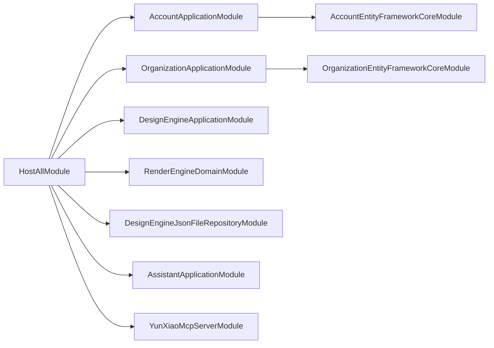
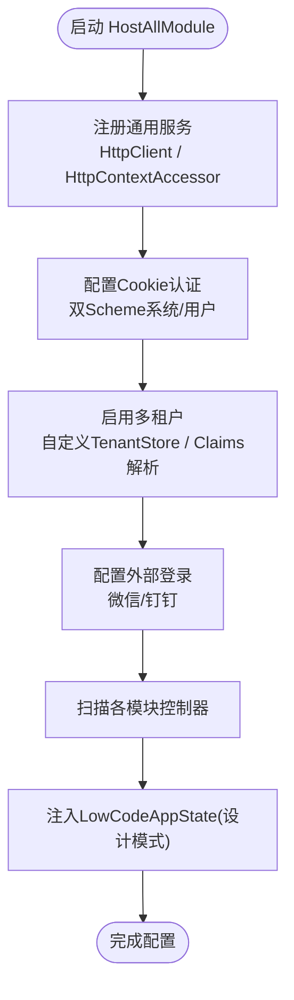
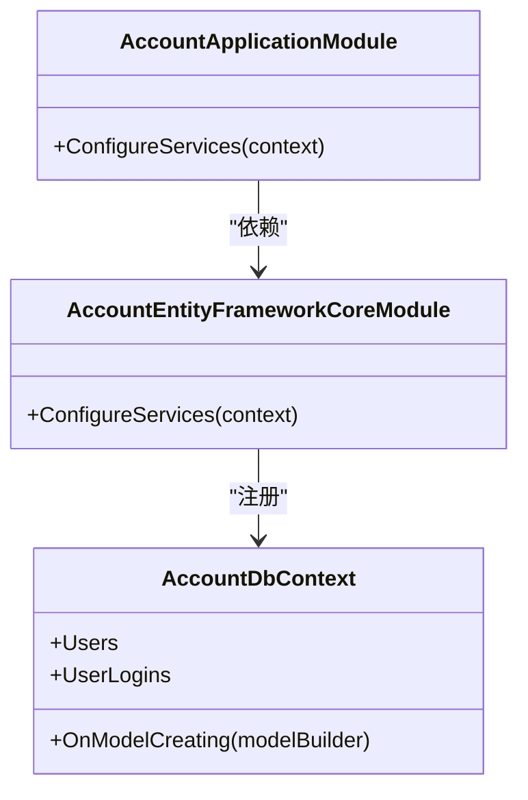
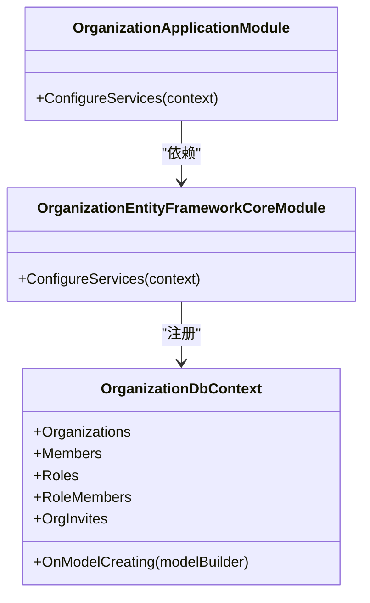
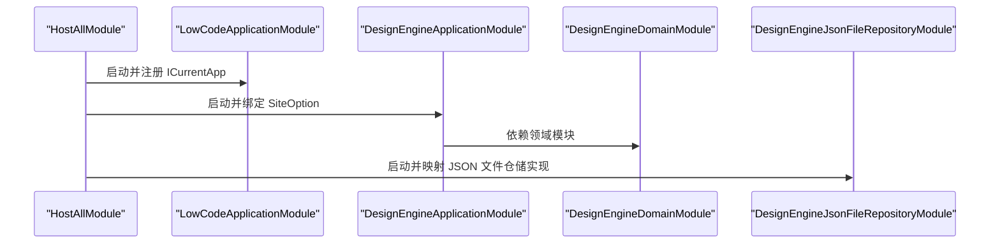
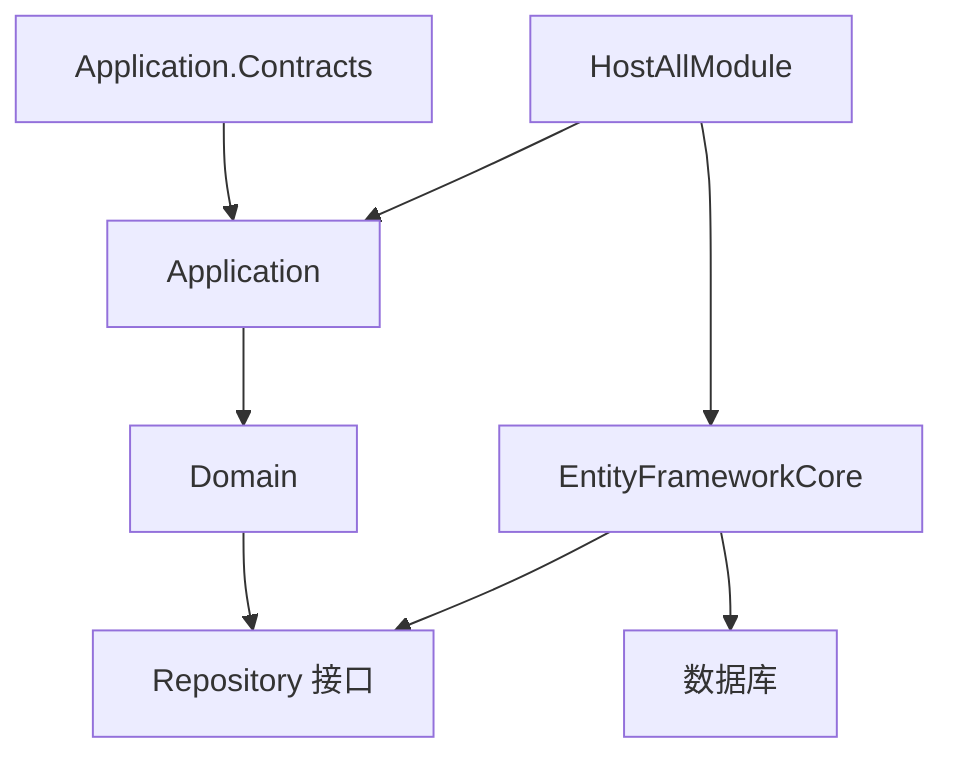

# 模块化设计

<cite>
**本文引用的文件**   
- [HostAllModule.cs](file://src/Host/H.AppLab.Host.All/H.AppLab.Host.All/HostAllModule.cs)
- [AccountApplicationModule.cs](file://src/Services/Account/H.Account.Application/AccountApplicationModule.cs)
- [OrganizationApplicationModule.cs](file://src/Services/Organization/H.Organization.Application/OrganizationApplicationModule.cs)
- [LowCodeApplicationModule.cs](file://src/LowCode/Common/H.LowCode.Application/LowCodeApplicationModule.cs)
- [DesignEngineApplicationModule.cs](file://src/LowCode/DesignEngine/H.LowCode.DesignEngine.Application/DesignEngineApplicationModule.cs)
- [RenderEngineDomainModule.cs](file://src/LowCode/RenderEngine/H.LowCode.RenderEngine.Domain/RenderEngineDomainModule.cs)
- [DesignEngineJsonFileRepositoryModule.cs](file://src/LowCode/DesignEngine/H.LowCode.DesignEngine.Repository.JsonFile/DesignEngineJsonFileRepositoryModule.cs)
- [AccountEntityFrameworkCoreModule.cs](file://src/Services/Account/H.Account.EntityFrameworkCore/AccountEntityFrameworkCoreModule.cs)
- [OrganizationEntityFrameworkCoreModule.cs](file://src/Services/Organization/H.Organization.EntityFrameworkCore/OrganizationEntityFrameworkCoreModule.cs)
- [AccountDbContext.cs](file://src/Services/Account/H.Account.EntityFrameworkCore/AccountDbContext.cs)
- [OrganizationDbContext.cs](file://src/Services/Organization/H.Organization.EntityFrameworkCore/OrganizationDbContext.cs)
</cite>

## 目录
1. [简介](#简介)
2. [项目结构](#项目结构)
3. [核心组件](#核心组件)
4. [架构总览](#架构总览)
5. [详细组件分析](#详细组件分析)
6. [依赖关系分析](#依赖关系分析)
7. [性能考量](#性能考量)
8. [故障排查指南](#故障排查指南)
9. [结论](#结论)
10. [附录](#附录)

## 简介
本设计文档面向AppLab平台的ABP模块化架构，系统性阐述模块定义、依赖管理与生命周期管理；解释HostAllModule如何聚合所有业务模块并实现解耦；说明Application.Contracts、Application、Domain、EntityFrameworkCore等分层职责与交互方式；描述模块启动顺序、配置共享与依赖注入容器的使用；并提供模块依赖图，展示Account、Organization、LowCode（DesignEngine/RenderEngine）等核心模块的依赖关系。

## 项目结构
AppLab采用典型的ABP分层与模块化组织：
- Host层：统一宿主模块HostAllModule负责聚合各应用模块、注册服务、启用多租户与认证、扫描控制器。
- Services层：按业务域划分模块（Account、Organization、Approval、Notification、Order、Setting、SupplyChain、BackgroundTask、Testing等），每个模块包含Application.Contracts、Application、EntityFrameworkCore、Web等子项目。
- LowCode层：分为Common（基础能力）、DesignEngine（设计器）、RenderEngine（渲染器），各自遵循Contracts/Application/Domain/EF Core分层。
- Agent层：Assistant与MCP Server作为扩展能力，通过独立模块集成。
- Tools层：DbMigrator工具用于数据库迁移与种子数据初始化。

```mermaid
graph TB
subgraph "宿主"
Host["HostAllModule"]
end
subgraph "业务服务"
Account["Account 模块<br/>Application + EF Core"]
Org["Organization 模块<br/>Application + EF Core"]
Approval["Approval 模块"]
Notification["Notification 模块"]
Order["Order 模块"]
Setting["Setting 模块"]
SupplyChain["SupplyChain 模块"]
BackgroundTask["BackgroundTask 模块"]
Testing["Testing 模块"]
Enterprise["Enterprise 模块"]
Portal["Portal 模块"]
SystemPortal["SystemPortal 模块"]
end
subgraph "低代码"
LC_Common["LowCode.Common(Application)"]
DesignApp["DesignEngine(Application)"]
RenderDomain["RenderEngine(Domain)"]
JsonRepo["DesignEngine.JsonFile Repository"]
end
subgraph "代理"
Assistant["Assistant(Application)"]
YunXiao["YunXiao MCP Server"]
end
Host --> Account
Host --> Org
Host --> Approval
Host --> Notification
Host --> Order
Host --> Setting
Host --> SupplyChain
Host --> BackgroundTask
Host --> Testing
Host --> Enterprise
Host --> Portal
Host --> SystemPortal
Host --> LC_Common
Host --> DesignApp
Host --> RenderDomain
Host --> JsonRepo
Host --> Assistant
Host --> YunXiao
```

[本图为概念性结构示意，不直接映射具体源码文件]

## 核心组件
- HostAllModule：统一宿主模块，聚合所有业务与应用模块，集中配置认证、多租户、外部登录、自动API控制器扫描、HttpClient与HttpContextAccessor等通用能力。
- 各业务模块Application层：以AbpModule形式声明依赖，按需注册服务、绑定配置、暴露API。
- 各业务模块EF Core层：以AbpModule形式注册DbContext、默认仓储、连接字符串与数据库提供程序。
- LowCode公共模块：提供跨设计器与渲染器的共享能力（如当前应用上下文）。
- DesignEngine与RenderEngine：分别承担“设计时”与“运行时”的职责，并通过Repository抽象支持多种存储实现（如JSON文件、远程服务等）。

章节来源
- [HostAllModule.cs:37-78](file://src/Host/H.AppLab.Host.All/H.AppLab.Host.All/HostAllModule.cs#L37-L78)
- [AccountApplicationModule.cs:9-22](file://src/Services/Account/H.Account.Application/AccountApplicationModule.cs#L9-L22)
- [OrganizationApplicationModule.cs:7-16](file://src/Services/Organization/H.Organization.Application/OrganizationApplicationModule.cs#L7-L16)
- [LowCodeApplicationModule.cs:7-13](file://src/LowCode/Common/H.LowCode.Application/LowCodeApplicationModule.cs#L7-L13)
- [DesignEngineApplicationModule.cs:12-22](file://src/LowCode/DesignEngine/H.LowCode.DesignEngine.Application/DesignEngineApplicationModule.cs#L12-L22)
- [RenderEngineDomainModule.cs:6-11](file://src/LowCode/RenderEngine/H.LowCode.RenderEngine.Domain/RenderEngineDomainModule.cs#L6-L11)
- [DesignEngineJsonFileRepositoryModule.cs:9-25](file://src/LowCode/DesignEngine/H.LowCode.DesignEngine.Repository.JsonFile/DesignEngineJsonFileRepositoryModule.cs#L9-L25)

## 架构总览
下图展示了HostAllModule对核心模块的聚合关系以及关键依赖方向。HostAllModule通过DependsOn声明依赖，从而在ABP容器启动阶段完成模块加载与服务注册。

图表来源
- [HostAllModule.cs:37-78](file://src/Host/H.AppLab.Host.All/H.AppLab.Host.All/HostAllModule.cs#L37-L78)
- [AccountApplicationModule.cs:9-12](file://src/Services/Account/H.Account.Application/AccountApplicationModule.cs#L9-L12)
- [OrganizationApplicationModule.cs:7-9](file://src/Services/Organization/H.Organization.Application/OrganizationApplicationModule.cs#L7-L9)
- [DesignEngineApplicationModule.cs:12-15](file://src/LowCode/DesignEngine/H.LowCode.DesignEngine.Application/DesignEngineApplicationModule.cs#L12-L15)
- [RenderEngineDomainModule.cs:6-11](file://src/LowCode/RenderEngine/H.LowCode.RenderEngine.Domain/RenderEngineDomainModule.cs#L6-L11)
- [DesignEngineJsonFileRepositoryModule.cs:9-10](file://src/LowCode/DesignEngine/H.LowCode.DesignEngine.Repository.JsonFile/DesignEngineJsonFileRepositoryModule.cs#L9-L10)

章节来源
- [HostAllModule.cs:37-78](file://src/Host/H.AppLab.Host.All/H.AppLab.Host.All/HostAllModule.cs#L37-L78)

## 详细组件分析

### HostAllModule（统一宿主模块）
- 模块聚合：通过DependsOn声明对ABP基础模块与各业务模块的依赖，确保启动顺序与装配正确。
- 服务注册：
  - 通用服务：HttpClient、HttpContextAccessor。
  - 认证：Cookie认证（系统Cookie Scheme区分），设置登录与拒绝路径、过期策略。
  - 多租户：启用多租户、自定义ITenantStore从企业库读取租户信息、Claims解析优先、无效租户清理并重定向。
  - 外部登录：绑定ExternalLogin配置，注册微信与钉钉认证服务。
  - 控制器扫描：按模块Assembly注册Convention Controllers，避免手动路由。
  - 低代码状态：注入LowCodeAppState（设计时为true）。
- 安全与CSRF：WASM场景关闭服务端CSRF校验，依赖SameSite Cookie保护。

图表来源
- [HostAllModule.cs:81-111](file://src/Host/H.AppLab.Host.All/H.AppLab.Host.All/HostAllModule.cs#L81-L111)
- [HostAllModule.cs:115-133](file://src/Host/H.AppLab.Host.All/H.AppLab.Host.All/HostAllModule.cs#L115-L133)
- [HostAllModule.cs:171-201](file://src/Host/H.AppLab.Host.All/H.AppLab.Host.All/HostAllModule.cs#L171-L201)
- [HostAllModule.cs:158-169](file://src/Host/H.AppLab.Host.All/H.AppLab.Host.All/HostAllModule.cs#L158-L169)
- [HostAllModule.cs:135-156](file://src/Host/H.AppLab.Host.All/H.AppLab.Host.All/HostAllModule.cs#L135-L156)

章节来源
- [HostAllModule.cs:37-78](file://src/Host/H.AppLab.Host.All/H.AppLab.Host.All/HostAllModule.cs#L37-L78)
- [HostAllModule.cs:81-111](file://src/Host/H.AppLab.Host.All/H.AppLab.Host.All/HostAllModule.cs#L81-L111)
- [HostAllModule.cs:115-133](file://src/Host/H.AppLab.Host.All/H.AppLab.Host.All/HostAllModule.cs#L115-L133)
- [HostAllModule.cs:135-156](file://src/Host/H.AppLab.Host.All/H.AppLab.Host.All/HostAllModule.cs#L135-L156)
- [HostAllModule.cs:158-169](file://src/Host/H.AppLab.Host.All/H.AppLab.Host.All/HostAllModule.cs#L158-L169)
- [HostAllModule.cs:171-201](file://src/Host/H.AppLab.Host.All/H.AppLab.Host.All/HostAllModule.cs#L171-L201)

### Account 模块（账户与身份）
- Application层：依赖EF Core与ABP Identity Domain，注册HttpContextAccessor与HttpClient供外部登录服务使用。
- EF Core层：注册AccountDbContext、默认仓储、SQL Server提供程序与连接字符串映射。
- DbContext：继承AbpDbContext，包含Identity实体集，并在OnModelCreating中调用ConfigureIdentity进行模型配置。

图表来源
- [AccountApplicationModule.cs:9-22](file://src/Services/Account/H.Account.Application/AccountApplicationModule.cs#L9-L22)
- [AccountEntityFrameworkCoreModule.cs:11-36](file://src/Services/Account/H.Account.EntityFrameworkCore/AccountEntityFrameworkCoreModule.cs#L11-L36)
- [AccountDbContext.cs:9-28](file://src/Services/Account/H.Account.EntityFrameworkCore/AccountDbContext.cs#L9-L28)

章节来源
- [AccountApplicationModule.cs:9-22](file://src/Services/Account/H.Account.Application/AccountApplicationModule.cs#L9-L22)
- [AccountEntityFrameworkCoreModule.cs:11-36](file://src/Services/Account/H.Account.EntityFrameworkCore/AccountEntityFrameworkCoreModule.cs#L11-L36)
- [AccountDbContext.cs:9-28](file://src/Services/Account/H.Account.EntityFrameworkCore/AccountDbContext.cs#L9-L28)

### Organization 模块（组织架构）
- Application层：依赖EF Core模块，用于组织、成员、角色等业务能力。
- EF Core层：注册OrganizationDbContext、默认仓储、SQL Server提供程序与连接字符串映射。
- DbContext：定义组织树、成员、角色、邀请等实体及关系映射。

图表来源
- [OrganizationApplicationModule.cs:7-16](file://src/Services/Organization/H.Organization.Application/OrganizationApplicationModule.cs#L7-L16)
- [OrganizationEntityFrameworkCoreModule.cs:10-31](file://src/Services/Organization/H.Organization.EntityFrameworkCore/OrganizationEntityFrameworkCoreModule.cs#L10-L31)
- [OrganizationDbContext.cs:10-145](file://src/Services/Organization/H.Organization.EntityFrameworkCore/OrganizationDbContext.cs#L10-L145)

章节来源
- [OrganizationApplicationModule.cs:7-16](file://src/Services/Organization/H.Organization.Application/OrganizationApplicationModule.cs#L7-L16)
- [OrganizationEntityFrameworkCoreModule.cs:10-31](file://src/Services/Organization/H.Organization.EntityFrameworkCore/OrganizationEntityFrameworkCoreModule.cs#L10-L31)
- [OrganizationDbContext.cs:10-145](file://src/Services/Organization/H.Organization.EntityFrameworkCore/OrganizationDbContext.cs#L10-L145)

### LowCode 公共与应用模块
- LowCodeApplicationModule：注册ICurrentApp为单例或瞬态（示例为瞬态），用于在设计/渲染过程中获取当前应用上下文。
- DesignEngineApplicationModule：依赖LowCodeApplicationModule与DesignEngineDomainModule，并绑定站点配置（SiteOption）。
- RenderEngineDomainModule：领域层模块标记，承载渲染引擎领域能力。
- DesignEngineJsonFileRepositoryModule：将领域仓储接口映射到基于JSON文件的实现，便于开发调试与快速迭代。

图表来源
- [LowCodeApplicationModule.cs:7-13](file://src/LowCode/Common/H.LowCode.Application/LowCodeApplicationModule.cs#L7-L13)
- [DesignEngineApplicationModule.cs:12-22](file://src/LowCode/DesignEngine/H.LowCode.DesignEngine.Application/DesignEngineApplicationModule.cs#L12-L22)
- [RenderEngineDomainModule.cs:6-11](file://src/LowCode/RenderEngine/H.LowCode.RenderEngine.Domain/RenderEngineDomainModule.cs#L6-L11)
- [DesignEngineJsonFileRepositoryModule.cs:9-25](file://src/LowCode/DesignEngine/H.LowCode.DesignEngine.Repository.JsonFile/DesignEngineJsonFileRepositoryModule.cs#L9-L25)

章节来源
- [LowCodeApplicationModule.cs:7-13](file://src/LowCode/Common/H.LowCode.Application/LowCodeApplicationModule.cs#L7-L13)
- [DesignEngineApplicationModule.cs:12-22](file://src/LowCode/DesignEngine/H.LowCode.DesignEngine.Application/DesignEngineApplicationModule.cs#L12-L22)
- [RenderEngineDomainModule.cs:6-11](file://src/LowCode/RenderEngine/H.LowCode.RenderEngine.Domain/RenderEngineDomainModule.cs#L6-L11)
- [DesignEngineJsonFileRepositoryModule.cs:9-25](file://src/LowCode/DesignEngine/H.LowCode.DesignEngine.Repository.JsonFile/DesignEngineJsonFileRepositoryModule.cs#L9-L25)

## 依赖关系分析
- 模块层次与职责：
  - Application.Contracts：定义DTO、枚举、服务接口，供上层调用与前端生成客户端代理。
  - Application：编排业务流程，依赖Contracts与Domain，通常不包含持久化细节。
  - Domain：领域模型、领域事件、仓储接口定义。
  - EntityFrameworkCore：实现仓储接口、配置DbContext与模型映射。
- 解耦机制：
  - 通过AbpModule的DependsOn声明依赖，避免硬编码耦合。
  - 仓储接口与实现分离，可替换存储后端（如JSON文件、远程服务）。
  - HostAllModule集中扫描控制器，业务模块无需关心路由注册。
- 启动顺序：
  - ABP框架根据DependsOn拓扑排序加载模块，确保被依赖模块先于依赖方初始化。
  - HostAllModule最后聚合所有模块，保证全局配置生效。

[本图为概念性依赖示意，不直接映射具体源码文件]

章节来源
- [HostAllModule.cs:37-78](file://src/Host/H.AppLab.Host.All/H.AppLab.Host.All/HostAllModule.cs#L37-L78)
- [AccountApplicationModule.cs:9-12](file://src/Services/Account/H.Account.Application/AccountApplicationModule.cs#L9-L12)
- [OrganizationApplicationModule.cs:7-9](file://src/Services/Organization/H.Organization.Application/OrganizationApplicationModule.cs#L7-L9)
- [DesignEngineJsonFileRepositoryModule.cs:9-25](file://src/LowCode/DesignEngine/H.LowCode.DesignEngine.Repository.JsonFile/DesignEngineJsonFileRepositoryModule.cs#L9-L25)

## 性能考量
- 依赖注入容器：
  - 合理使用服务生命周期（Transient/Scoped/Singleton），避免不必要的对象创建与内存占用。
  - HttpClient建议使用工厂或IHttpClientFactory（已在HostAllModule中注册）。
- 数据库访问：
  - 使用默认仓储减少样板代码，注意分页与查询优化。
  - 合理拆分DbContext，降低模型加载开销。
- 控制器扫描：
  - 仅扫描必要模块的Assembly，避免过多反射影响启动时间。
- 多租户：
  - Claims解析优先，减少中间件链处理成本。
  - 无效租户快速清理并重定向，避免后续请求失败。

[本节为通用指导，不直接分析具体文件]

## 故障排查指南
- 认证失败或重定向异常：
  - 检查Cookie Scheme配置与登录路径是否正确。
  - 确认SameSite与滑动过期策略是否符合预期。
- 多租户解析错误：
  - 验证Claims中的TenantId是否存在且有效。
  - 检查ITenantStore实现是否返回正确的租户信息。
- 控制器未注册：
  - 确认HostAllModule中对各模块Assembly的ConventionalControllers.Create调用是否完整。
- 外部登录失败：
  - 核对ExternalLogin配置项与第三方平台回调地址。
  - 检查WeChatAuthService与DingTalkAuthService的注册与实现。

章节来源
- [HostAllModule.cs:115-133](file://src/Host/H.AppLab.Host.All/H.AppLab.Host.All/HostAllModule.cs#L115-L133)
- [HostAllModule.cs:171-201](file://src/Host/H.AppLab.Host.All/H.AppLab.Host.All/HostAllModule.cs#L171-L201)
- [HostAllModule.cs:135-156](file://src/Host/H.AppLab.Host.All/H.AppLab.Host.All/HostAllModule.cs#L135-L156)
- [HostAllModule.cs:158-169](file://src/Host/H.AppLab.Host.All/H.AppLab.Host.All/HostAllModule.cs#L158-L169)

## 结论
AppLab平台基于ABP框架实现了清晰的模块化架构：HostAllModule作为统一入口聚合各业务模块，通过DependsOn声明依赖、集中配置认证与多租户、扫描控制器，达到高内聚低耦合的目标。各模块遵循Application.Contracts、Application、Domain、EntityFrameworkCore的分层职责，仓储接口与实现分离，便于扩展与替换。整体架构具备良好的可维护性与可扩展性，适合持续演进与团队协作。

[本节为总结性内容，不直接分析具体文件]

## 附录
- 模块启动顺序建议：
  - 先加载基础设施与公共模块（如LowCodeApplicationModule）。
  - 再加载领域与EF Core模块（如AccountEntityFrameworkCoreModule、OrganizationEntityFrameworkCoreModule）。
  - 最后由HostAllModule聚合所有模块并完成全局配置。
- 配置共享最佳实践：
  - 使用Options模式绑定配置（如SiteOption、ExternalLogin）。
  - 通过AbpModule.Configure<T>()集中管理模块级配置。
- 依赖注入容器使用要点：
  - 明确服务生命周期，避免循环依赖。
  - 使用构造函数注入，保持模块间松耦合。

[本节为补充说明，不直接分析具体文件]