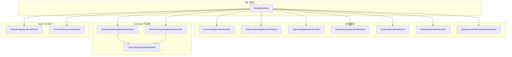
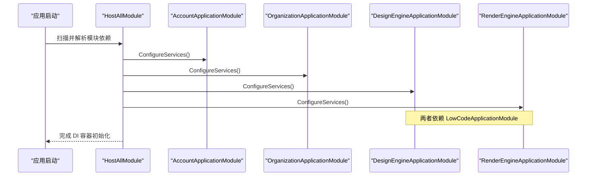
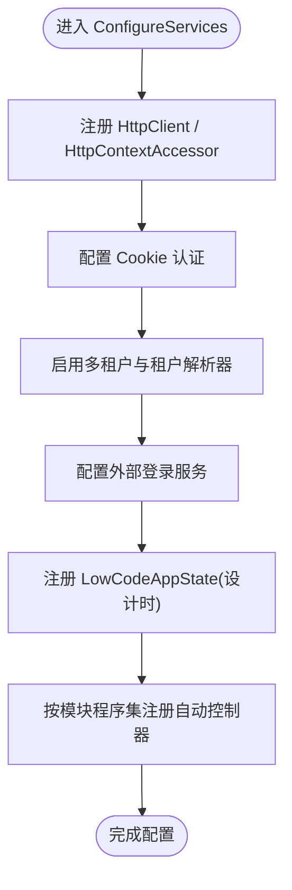
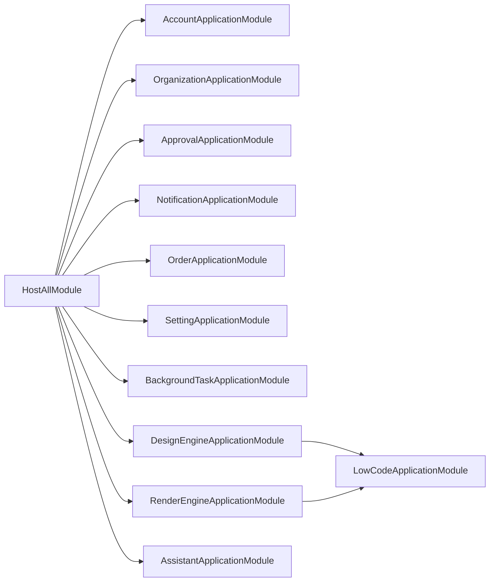
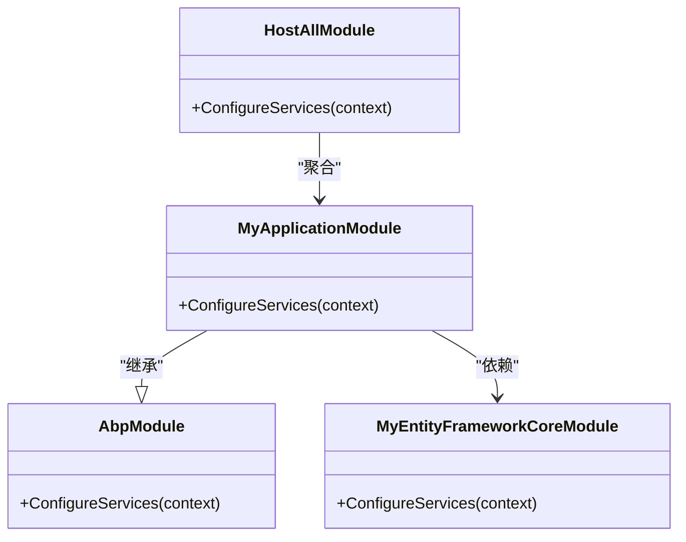

# 模块定义与注册

<cite>
**本文引用的文件**   
- [HostAllModule.cs](file://src/Host/H.AppLab.Host.All/H.AppLab.Host.All/HostAllModule.cs)
- [AccountApplicationModule.cs](file://src/Services/Account/H.Account.Application/AccountApplicationModule.cs)
- [OrganizationApplicationModule.cs](file://src/Services/Organization/H.Organization.Application/OrganizationApplicationModule.cs)
- [DesignEngineApplicationModule.cs](file://src/LowCode/DesignEngine/H.LowCode.DesignEngine.Application/DesignEngineApplicationModule.cs)
- [RenderEngineApplicationModule.cs](file://src/LowCode/RenderEngine/H.LowCode.RenderEngine.Application/RenderEngineApplicationModule.cs)
- [ApprovalApplicationModule.cs](file://src/Services/Approval/H.Approval.Application/ApprovalApplicationModule.cs)
- [BackgroundTaskApplicationModule.cs](file://src/Services/BackgroundTask/H.BackgroundTask.Application/BackgroundTaskApplicationModule.cs)
- [AssistantApplicationModule.cs](file://src/Agent/Assistant/H.Assistant.Application/AssistantApplicationModule.cs)
- [NotificationApplicationModule.cs](file://src/Services/Notification/H.Notification.Application/NotificationApplicationModule.cs)
- [OrderApplicationModule.cs](file://src/Services/Order/H.Order.Application/OrderApplicationModule.cs)
- [SettingApplicationModule.cs](file://src/Services/Setting/H.Setting.Application/SettingApplicationModule.cs)
- [LowCodeComponentBaseModule.cs](file://src/LowCode/Common/H.LowCode.ComponentBase/LowCodeComponentBaseModule.cs)
</cite>

## 目录
1. [简介](#简介)
2. [项目结构](#项目结构)
3. [核心组件](#核心组件)
4. [架构总览](#架构总览)
5. [详细组件分析](#详细组件分析)
6. [依赖关系分析](#依赖关系分析)
7. [性能考量](#性能考量)
8. [故障排查指南](#故障排查指南)
9. [结论](#结论)
10. [附录：自定义模块开发示例](#附录自定义模块开发示例)

## 简介
本文件面向 AppLab 平台，系统化说明 ABP 框架下的模块定义与注册机制。重点涵盖：
- 使用 [DependsOn] 特性声明模块依赖
- 统一宿主聚合模块 HostAllModule 的职责与加载策略
- ApplicationModule 的注册方式、启动顺序、配置加载与 DI 容器初始化过程
- 核心模块（Account、Organization、LowCode 等）的依赖图与加载顺序
- 自定义模块开发的完整步骤与实践建议

## 项目结构
AppLab 采用“统一宿主 + 多业务模块”的分层与模块化设计：
- 统一宿主：H.AppLab.Host.All 中的 HostAllModule 作为聚合入口，集中声明并启用所有应用模块
- 业务模块：各 Services 下的 Application 层模块（如 Account、Organization、Approval 等）通过 [DependsOn] 声明依赖
- LowCode 子系统：包含 DesignEngine 与 RenderEngine 两套引擎，各自拥有独立的 Application、Domain、EF Core、Repository 等模块
- Agent 与 MCP：Assistant 模块提供 AI 助手能力，YunXiao MCP Server 作为外部集成点

图表来源 
- [HostAllModule.cs:37-78](file://src/Host/H.AppLab.Host.All/H.AppLab.Host.All/HostAllModule.cs#L37-L78)
- [DesignEngineApplicationModule.cs:12-15](file://src/LowCode/DesignEngine/H.LowCode.DesignEngine.Application/DesignEngineApplicationModule.cs#L12-L15)
- [RenderEngineApplicationModule.cs:11-17](file://src/LowCode/RenderEngine/H.LowCode.RenderEngine.Application/RenderEngineApplicationModule.cs#L11-L17)

章节来源
- [HostAllModule.cs:37-78](file://src/Host/H.AppLab.Host.All/H.AppLab.Host.All/HostAllModule.cs#L37-L78)

## 核心组件
- HostAllModule：统一宿主聚合模块，集中声明所有业务模块与基础设施模块，完成认证、多租户、控制器发现、外部登录等全局配置
- 各 ApplicationModule：以 [DependsOn] 声明对 EF Core 模块、ABP 基础模块或领域模块的依赖，并在 ConfigureServices 中完成服务注册与配置绑定
- LowCode 子系统：DesignEngine 与 RenderEngine 均依赖公共 LowCodeApplicationModule，形成清晰的依赖层次
- Agent 与 MCP：AssistantApplicationModule 依赖 Core 与 EF Core 模块，并提供 LLM、工具注册、MCP 客户端等能力；YunXiaoMcpServerModule 作为 MCP 服务端集成

章节来源
- [HostAllModule.cs:81-111](file://src/Host/H.AppLab.Host.All/H.AppLab.Host.All/HostAllModule.cs#L81-L111)
- [AccountApplicationModule.cs:9-22](file://src/Services/Account/H.Account.Application/AccountApplicationModule.cs#L9-L22)
- [OrganizationApplicationModule.cs:7-16](file://src/Services/Organization/H.Organization.Application/OrganizationApplicationModule.cs#L7-L16)
- [DesignEngineApplicationModule.cs:12-29](file://src/LowCode/DesignEngine/H.LowCode.DesignEngine.Application/DesignEngineApplicationModule.cs#L12-L29)
- [RenderEngineApplicationModule.cs:11-29](file://src/LowCode/RenderEngine/H.LowCode.RenderEngine.Application/RenderEngineApplicationModule.cs#L11-L29)
- [AssistantApplicationModule.cs:12-46](file://src/Agent/Assistant/H.Assistant.Application/AssistantApplicationModule.cs#L12-L46)

## 架构总览
ABP 模块系统在启动时按依赖拓扑排序加载模块，依次执行每个模块的 ConfigureServices 与 OnApplicationInitialization。HostAllModule 作为根节点，确保所有子模块在正确的上下文中被解析与装配。

图表来源 
- [HostAllModule.cs:37-78](file://src/Host/H.AppLab.Host.All/H.AppLab.Host.All/HostAllModule.cs#L37-L78)
- [DesignEngineApplicationModule.cs:12-15](file://src/LowCode/DesignEngine/H.LowCode.DesignEngine.Application/DesignEngineApplicationModule.cs#L12-L15)
- [RenderEngineApplicationModule.cs:11-17](file://src/LowCode/RenderEngine/H.LowCode.RenderEngine.Application/RenderEngineApplicationModule.cs#L11-L17)

## 详细组件分析

### HostAllModule：统一宿主聚合模块
- 职责
  - 通过 [DependsOn] 声明所有业务与基础设施模块
  - 配置认证（Cookie）、多租户、外部登录、Auto API 控制器发现
  - 注入 LowCodeAppState（设计时标志）
- 关键流程
  - ConfigureServices：注册 HttpClient、HttpContextAccessor、认证、多租户、外部登录、AntiForgery、AutoApiControllers
  - ConfigureMultiTenancy：启用多租户、注册 ITenantStore、设置 ClaimsTenantResolveContributor、处理无效租户错误页
  - ConfigureAutoApiControllers：按模块程序集注册 MVC 控制器

图表来源 
- [HostAllModule.cs:81-111](file://src/Host/H.AppLab.Host.All/H.AppLab.Host.All/HostAllModule.cs#L81-L111)
- [HostAllModule.cs:135-156](file://src/Host/H.AppLab.Host.All/H.AppLab.Host.All/HostAllModule.cs#L135-L156)
- [HostAllModule.cs:171-201](file://src/Host/H.AppLab.Host.All/H.AppLab.Host.All/HostAllModule.cs#L171-L201)

章节来源
- [HostAllModule.cs:37-78](file://src/Host/H.AppLab.Host.All/H.AppLab.Host.All/HostAllModule.cs#L37-L78)
- [HostAllModule.cs:81-111](file://src/Host/H.AppLab.Host.All/H.AppLab.Host.All/HostAllModule.cs#L81-L111)
- [HostAllModule.cs:135-156](file://src/Host/H.AppLab.Host.All/H.AppLab.Host.All/HostAllModule.cs#L135-L156)
- [HostAllModule.cs:171-201](file://src/Host/H.AppLab.Host.All/H.AppLab.Host.All/HostAllModule.cs#L171-L201)

### AccountApplicationModule：账户应用模块
- 依赖：AccountEntityFrameworkCoreModule、AbpIdentityDomainModule
- 配置：注册 HttpContextAccessor、HttpClient（用于第三方登录）

章节来源
- [AccountApplicationModule.cs:9-22](file://src/Services/Account/H.Account.Application/AccountApplicationModule.cs#L9-L22)

### OrganizationApplicationModule：组织应用模块
- 依赖：OrganizationEntityFrameworkCoreModule
- 配置：无额外服务注册（示例为空实现）

章节来源
- [OrganizationApplicationModule.cs:7-16](file://src/Services/Organization/H.Organization.Application/OrganizationApplicationModule.cs#L7-L16)

### DesignEngineApplicationModule：低代码设计引擎应用模块
- 依赖：LowCodeApplicationModule、DesignEngineDomainModule
- 配置：绑定 SiteOption、忽略验证拦截器反射类型

章节来源
- [DesignEngineApplicationModule.cs:12-29](file://src/LowCode/DesignEngine/H.LowCode.DesignEngine.Application/DesignEngineApplicationModule.cs#L12-L29)

### RenderEngineApplicationModule：低代码渲染引擎应用模块
- 依赖：AbpAutoMapperModule、LowCodeApplicationModule、RenderEngineDomainModule
- 配置：绑定 MetaOption、注册 AutoMapper 映射

章节来源
- [RenderEngineApplicationModule.cs:11-29](file://src/LowCode/RenderEngine/H.LowCode.RenderEngine.Application/RenderEngineApplicationModule.cs#L11-L29)

### ApprovalApplicationModule：审批应用模块
- 依赖：ApprovalEntityFrameworkCoreModule
- 配置：注册 Elsa 工作流引擎（管理/运行时），添加自包含审批工作流引擎

章节来源
- [ApprovalApplicationModule.cs:13-36](file://src/Services/Approval/H.Approval.Application/ApprovalApplicationModule.cs#L13-L36)

### BackgroundTaskApplicationModule：后台任务应用模块
- 依赖：BackgroundTaskEntityFrameworkCoreModule
- 配置：注册 Hangfire 存储与服务器、作业调度器与执行器

章节来源
- [BackgroundTaskApplicationModule.cs:12-55](file://src/Services/BackgroundTask/H.BackgroundTask.Application/BackgroundTaskApplicationModule.cs#L12-L55)

### AssistantApplicationModule：AI 助手应用模块
- 依赖：AssistantEntityFrameworkCoreModule、AbpAutoMapperModule、AssistantCoreModule
- 配置：注册 LLMProviderFactory、IToolRegistry、McpClientManager、AgentFactory、TaskWorker

章节来源
- [AssistantApplicationModule.cs:12-46](file://src/Agent/Assistant/H.Assistant.Application/AssistantApplicationModule.cs#L12-L46)

### NotificationApplicationModule：通知应用模块
- 依赖：NotificationEntityFrameworkCoreModule、AbpAutoMapperModule
- 配置：注册 HttpContextAccessor、HttpClient、AutoMapper 映射

章节来源
- [NotificationApplicationModule.cs:9-26](file://src/Services/Notification/H.Notification.Application/NotificationApplicationModule.cs#L9-L26)

### OrderApplicationModule：订单应用模块
- 依赖：OrderEntityFrameworkCoreModule
- 配置：注册供应商客户端工厂与实现、路由引擎与分发服务、CAP Outbox/消息队列与消费者

章节来源
- [OrderApplicationModule.cs:13-48](file://src/Services/Order/H.Order.Application/OrderApplicationModule.cs#L13-L48)

### SettingApplicationModule：设置应用模块
- 依赖：SettingEntityFrameworkCoreModule
- 配置：无额外服务注册（示例为空实现）

章节来源
- [SettingApplicationModule.cs:7-15](file://src/Services/Setting/H.Setting.Application/SettingApplicationModule.cs#L7-L15)

### LowCodeComponentBaseModule：低代码组件基类标记
- 作用：作为模块标记类，便于识别与引用

章节来源
- [LowCodeComponentBaseModule.cs:1-9](file://src/LowCode/Common/H.LowCode.ComponentBase/LowCodeComponentBaseModule.cs#L1-L9)

## 依赖关系分析
- 模块依赖图（核心模块）

图表来源 
- [HostAllModule.cs:37-78](file://src/Host/H.AppLab.Host.All/H.AppLab.Host.All/HostAllModule.cs#L37-L78)
- [DesignEngineApplicationModule.cs:12-15](file://src/LowCode/DesignEngine/H.LowCode.DesignEngine.Application/DesignEngineApplicationModule.cs#L12-L15)
- [RenderEngineApplicationModule.cs:11-17](file://src/LowCode/RenderEngine/H.LowCode.RenderEngine.Application/RenderEngineApplicationModule.cs#L11-L17)

- 启动顺序与生命周期
  - 启动顺序：由 ABP 根据 [DependsOn] 构建依赖拓扑，按拓扑排序加载模块
  - 生命周期：每个模块先执行 ConfigureServices，再执行 OnApplicationInitialization；HostAllModule 负责全局配置与控制器发现
  - 配置加载：各模块从 IConfiguration 读取连接字符串与选项（如 SiteOption、MetaOption、Hangfire/CAP/Elsa 配置）
  - DI 容器初始化：HostAllModule 与子模块共同向 ServiceCollection 注册服务，最终由 ABP 容器解析

章节来源
- [HostAllModule.cs:81-111](file://src/Host/H.AppLab.Host.All/H.AppLab.Host.All/HostAllModule.cs#L81-L111)
- [BackgroundTaskApplicationModule.cs:33-55](file://src/Services/BackgroundTask/H.BackgroundTask.Application/BackgroundTaskApplicationModule.cs#L33-L55)
- [OrderApplicationModule.cs:35-48](file://src/Services/Order/H.Order.Application/OrderApplicationModule.cs#L35-L48)
- [ApprovalApplicationModule.cs:20-36](file://src/Services/Approval/H.Approval.Application/ApprovalApplicationModule.cs#L20-L36)

## 性能考量
- 控制器发现：HostAllModule 按模块程序集注册自动控制器，避免全量扫描带来的开销
- 单例与瞬态：合理选择服务生命周期（如 ToolRegistry、McpClientManager 使用单例保持状态）
- 外部依赖初始化：Elsa、Hangfire、CAP 等在模块内按需初始化，减少不必要的资源占用
- 验证与映射：仅在需要的模块中启用 AutoMapper 映射，避免全局扫描

[本节为通用指导，不直接分析具体文件]

## 故障排查指南
- 多租户相关
  - 现象：访问被重定向到首页或返回错误页
  - 排查：检查 ITenantStore 是否正确注册、ClaimsTenantResolveContributor 是否优先于内置解析器、__tenant Cookie 是否有效
  - 参考：HostAllModule 的多租户配置与错误页处理
- 认证相关
  - 现象：登录路径或访问拒绝路径未生效
  - 排查：确认 Cookie 认证方案名称与路径配置是否正确
- 控制器未注册
  - 现象：API 无法访问
  - 排查：确认 ConfigureAutoApiControllers 是否按模块程序集注册了控制器
- 外部依赖未初始化
  - 现象：工作流、后台任务、消息队列异常
  - 排查：检查对应模块的 ConfigureServices 是否调用 AddElsa/AddHangfire/AddCap 等

章节来源
- [HostAllModule.cs:171-201](file://src/Host/H.AppLab.Host.All/H.AppLab.Host.All/HostAllModule.cs#L171-L201)
- [HostAllModule.cs:135-156](file://src/Host/H.AppLab.Host.All/H.AppLab.Host.All/HostAllModule.cs#L135-L156)
- [ApprovalApplicationModule.cs:20-36](file://src/Services/Approval/H.Approval.Application/ApprovalApplicationModule.cs#L20-L36)
- [BackgroundTaskApplicationModule.cs:33-55](file://src/Services/BackgroundTask/H.BackgroundTask.Application/BackgroundTaskApplicationModule.cs#L33-L55)
- [OrderApplicationModule.cs:35-48](file://src/Services/Order/H.Order.Application/OrderApplicationModule.cs#L35-L48)

## 结论
AppLab 通过 HostAllModule 将各业务模块与基础设施模块统一聚合，借助 ABP 的模块系统实现清晰的依赖管理与生命周期控制。各 ApplicationModule 通过 [DependsOn] 声明依赖，并在 ConfigureServices 中完成服务注册与配置绑定。该模式具备良好的扩展性与可维护性，适合大型平台的持续演进。

[本节为总结性内容，不直接分析具体文件]

## 附录：自定义模块开发示例
以下为一个最小化的自定义模块开发流程，适用于新增业务模块：
- 新建模块类并继承 AbpModule
- 使用 [DependsOn] 声明依赖（如 EF Core 模块、ABP 基础模块、领域模块）
- 在 ConfigureServices 中注册服务与配置绑定
- 在统一宿主 HostAllModule 的 [DependsOn] 中引入新模块
- 如需暴露 API，确保 ConfigureAutoApiControllers 能发现对应程序集

图表来源 
- [HostAllModule.cs:37-78](file://src/Host/H.AppLab.Host.All/H.AppLab.Host.All/HostAllModule.cs#L37-L78)

章节来源
- [HostAllModule.cs:37-78](file://src/Host/H.AppLab.Host.All/H.AppLab.Host.All/HostAllModule.cs#L37-L78)