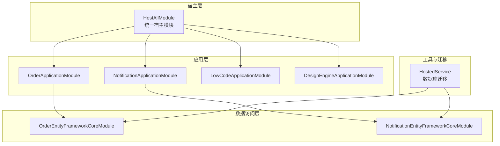
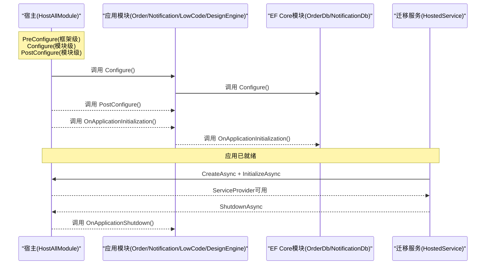
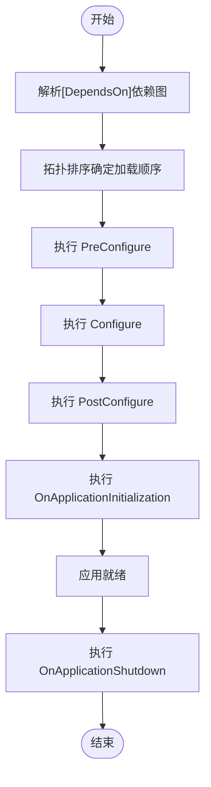
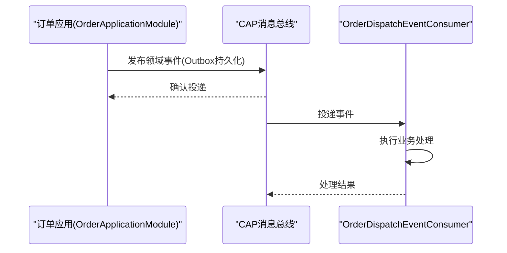
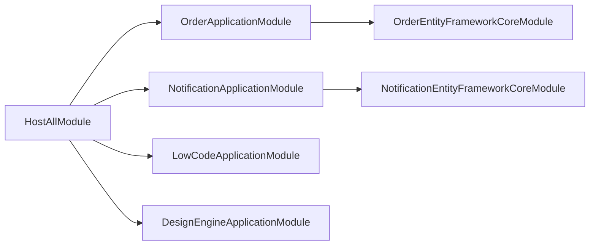

# 模块生命周期管理

<cite>
**本文引用的文件**   
- [HostAllModule.cs](file://src/Host/H.AppLab.Host.All/H.AppLab.Host.All/HostAllModule.cs)
- [NotificationApplicationModule.cs](file://src/Services/Notification/H.Notification.Application/NotificationApplicationModule.cs)
- [OrderApplicationModule.cs](file://src/Services/Order/H.Order.Application/OrderApplicationModule.cs)
- [LowCodeApplicationModule.cs](file://src/LowCode/Common/H.LowCode.Application/LowCodeApplicationModule.cs)
- [DesignEngineApplicationModule.cs](file://src/LowCode/DesignEngine/H.LowCode.DesignEngine.Application/DesignEngineApplicationModule.cs)
- [OrderEntityFrameworkCoreModule.cs](file://src/Services/Order/H.Order.EntityFrameworkCore/OrderEntityFrameworkCoreModule.cs)
- [NotificationEntityFrameworkCoreModule.cs](file://src/Services/Notification/H.Notification.EntityFrameworkCore/NotificationEntityFrameworkCoreModule.cs)
- [HostedService.cs](file://src/Tools/H.LowCode.DbMigrator/HostedService.cs)
- [OrderDispatchEventConsumer.cs](file://src/Services/Order/H.Order.Application/Services/OrderDispatchEventConsumer.cs)
- [OrderEvents.cs](file://src/Services/Order/H.Order.Application.Contracts/Events/OrderEvents.cs)
</cite>

## 目录
1. [简介](#简介)
2. [项目结构](#项目结构)
3. [核心组件](#核心组件)
4. [架构总览](#架构总览)
5. [详细组件分析](#详细组件分析)
6. [依赖关系分析](#依赖关系分析)
7. [性能考虑](#性能考虑)
8. [故障排查指南](#故障排查指南)
9. [结论](#结论)
10. [附录](#附录)

## 简介
本文件面向AppLab平台，系统化说明ABP模块的生命周期方法（PreConfigure、Configure、PostConfigure、OnApplicationInitialization、OnApplicationShutdown）的执行时机与用途，解释模块启动顺序控制机制，以及在不同阶段如何进行服务配置与初始化。同时总结模块间通信与事件处理机制，并提供流程图与实际应用场景的代码示例路径，帮助开发者在正确阶段完成正确的初始化工作。

## 项目结构
AppLab采用多模块分层组织：宿主层统一装配各业务模块；应用层按领域划分模块；数据访问层通过EF Core模块注册DbContext与仓储；工具与迁移程序通过独立宿主运行并在应用生命周期内执行一次性任务。

图表来源 
- [HostAllModule.cs:37-78](file://src/Host/H.AppLab.Host.All/H.AppLab.Host.All/HostAllModule.cs#L37-L78)
- [OrderApplicationModule.cs:13-16](file://src/Services/Order/H.Order.Application/OrderApplicationModule.cs#L13-L16)
- [NotificationApplicationModule.cs:9-12](file://src/Services/Notification/H.Notification.Application/NotificationApplicationModule.cs#L9-L12)
- [LowCodeApplicationModule.cs:7-12](file://src/LowCode/Common/H.LowCode.Application/LowCodeApplicationModule.cs#L7-L12)
- [DesignEngineApplicationModule.cs:12-15](file://src/LowCode/DesignEngine/H.LowCode.DesignEngine.Application/DesignEngineApplicationModule.cs#L12-L15)
- [OrderEntityFrameworkCoreModule.cs:9-11](file://src/Services/Order/H.Order.EntityFrameworkCore/OrderEntityFrameworkCoreModule.cs#L9-L11)
- [NotificationEntityFrameworkCoreModule.cs:10-12](file://src/Services/Notification/H.Notification.EntityFrameworkCore/NotificationEntityFrameworkCoreModule.cs#L10-L12)
- [HostedService.cs:25-42](file://src/Tools/H.LowCode.DbMigrator/HostedService.cs#L25-L42)

章节来源
- [HostAllModule.cs:37-78](file://src/Host/H.AppLab.Host.All/H.AppLab.Host.All/HostAllModule.cs#L37-L78)

## 核心组件
- 统一宿主模块：集中声明所有子模块的依赖关系，并在此阶段完成认证、多租户、反伪造、控制器约定等全局配置。
- 应用模块：在各模块的Configure中注册服务、绑定配置、启用特性（如AutoMapper）。
- EF Core模块：为每个领域注册DbContext、仓储、连接字符串与数据库提供程序。
- 迁移宿主服务：以独立进程方式创建应用、初始化、执行迁移并关闭应用。

章节来源
- [HostAllModule.cs:81-111](file://src/Host/H.AppLab.Host.All/H.AppLab.Host.All/HostAllModule.cs#L81-L111)
- [OrderApplicationModule.cs:18-48](file://src/Services/Order/H.Order.Application/OrderApplicationModule.cs#L18-L48)
- [NotificationApplicationModule.cs:15-26](file://src/Services/Notification/H.Notification.Application/NotificationApplicationModule.cs#L15-L26)
- [OrderEntityFrameworkCoreModule.cs:11-30](file://src/Services/Order/H.Order.EntityFrameworkCore/OrderEntityFrameworkCoreModule.cs#L11-L30)
- [NotificationEntityFrameworkCoreModule.cs:12-31](file://src/Services/Notification/H.Notification.EntityFrameworkCore/NotificationEntityFrameworkCoreModule.cs#L12-L31)
- [HostedService.cs:23-42](file://src/Tools/H.LowCode.DbMigrator/HostedService.cs#L23-L42)

## 架构总览
下图展示ABP模块生命周期关键阶段与宿主、应用、数据层的交互关系。

图表来源 
- [HostAllModule.cs:81-111](file://src/Host/H.AppLab.Host.All/H.AppLab.Host.All/HostAllModule.cs#L81-L111)
- [OrderApplicationModule.cs:18-48](file://src/Services/Order/H.Order.Application/OrderApplicationModule.cs#L18-L48)
- [NotificationApplicationModule.cs:15-26](file://src/Services/Notification/H.Notification.Application/NotificationApplicationModule.cs#L15-L26)
- [OrderEntityFrameworkCoreModule.cs:11-30](file://src/Services/Order/H.Order.EntityFrameworkCore/OrderEntityFrameworkCoreModule.cs#L11-L30)
- [NotificationEntityFrameworkCoreModule.cs:12-31](file://src/Services/Notification/H.Notification.EntityFrameworkCore/NotificationEntityFrameworkCoreModule.cs#L12-L31)
- [HostedService.cs:25-42](file://src/Tools/H.LowCode.DbMigrator/HostedService.cs#L25-L42)

## 详细组件分析

### ABP模块生命周期方法与时机
- PreConfigure
  - 作用：框架级或模块级预配置，通常在容器构建前执行，适合设置最小化配置或覆盖默认值。
  - 在本项目中未直接重写该方法，但可通过Abp模块扩展点实现。
- Configure
  - 作用：模块服务注册与配置的核心阶段。本项目广泛使用此阶段进行服务注册、选项绑定、特性启用。
  - 示例：
    - 统一宿主：HTTP客户端、HttpContextAccessor、认证、多租户、反伪造、控制器约定等。
    - 订单模块：HttpClient、ISupplierClient工厂、领域服务、CAP消息总线消费者。
    - 通知模块：HttpContextAccessor、HttpClient、AutoMapper映射。
    - 低代码应用：注册当前应用上下文服务。
    - 设计引擎应用：站点选项绑定。
- PostConfigure
  - 作用：在所有模块Configure完成后执行，适合跨模块的最终调整与校验。
  - 本项目未直接重写，但可在需要时用于最终一致性检查。
- OnApplicationInitialization
  - 作用：应用初始化完成后的钩子，适合执行需要完整DI容器的初始化逻辑（如缓存预热、后台任务启动）。
  - 本项目未直接重写，但迁移流程展示了InitializeAsync的使用。
- OnApplicationShutdown
  - 作用：应用关闭前的清理钩子，适合释放资源、停止后台任务、持久化状态等。
  - 本项目未直接重写，但可结合IHostedService或托管服务进行优雅停机。

章节来源
- [HostAllModule.cs:81-111](file://src/Host/H.AppLab.Host.All/H.AppLab.Host.All/HostAllModule.cs#L81-L111)
- [OrderApplicationModule.cs:18-48](file://src/Services/Order/H.Order.Application/OrderApplicationModule.cs#L18-L48)
- [NotificationApplicationModule.cs:15-26](file://src/Services/Notification/H.Notification.Application/NotificationApplicationModule.cs#L15-L26)
- [LowCodeApplicationModule.cs:9-12](file://src/LowCode/Common/H.LowCode.Application/LowCodeApplicationModule.cs#L9-L12)
- [DesignEngineApplicationModule.cs:18-22](file://src/LowCode/DesignEngine/H.LowCode.DesignEngine.Application/DesignEngineApplicationModule.cs#L18-L22)
- [HostedService.cs:25-42](file://src/Tools/H.LowCode.DbMigrator/HostedService.cs#L25-L42)

### 模块启动顺序控制机制
- 依赖声明：通过[DependsOn]声明模块依赖，ABP据此确定加载顺序，确保被依赖模块先于依赖者初始化。
- 宿主装配：HostAllModule集中声明所有应用模块与基础设施模块的依赖，保证统一的启动顺序。
- 典型依赖链：
  - 应用模块 → EF Core模块（DbContext、仓储、连接字符串）
  - 应用模块 → 其他应用模块（跨域服务、共享契约）
  - 宿主 → 所有应用模块（控制器、认证、多租户等）

图表来源 
- [HostAllModule.cs:37-78](file://src/Host/H.AppLab.Host.All/H.AppLab.Host.All/HostAllModule.cs#L37-L78)
- [OrderApplicationModule.cs:13-16](file://src/Services/Order/H.Order.Application/OrderApplicationModule.cs#L13-L16)
- [NotificationApplicationModule.cs:9-12](file://src/Services/Notification/H.Notification.Application/NotificationApplicationModule.cs#L9-L12)

章节来源
- [HostAllModule.cs:37-78](file://src/Host/H.AppLab.Host.All/H.AppLab.Host.All/HostAllModule.cs#L37-L78)

### 不同阶段的配置与初始化实践
- 服务注册（Configure）
  - 统一宿主：AddHttpClient、AddHttpContextAccessor、认证Cookie、多租户、反伪造、控制器约定。
  - 订单模块：供应商客户端工厂、领域服务、CAP存储与队列、消费者。
  - 通知模块：HttpContextAccessor、HttpClient、AutoMapper映射。
  - 低代码应用：ICurrentApp单例/瞬态注册。
  - 设计引擎应用：站点选项绑定。
- 数据访问（EF Core模块）
  - 注册DbContext与默认仓储、配置数据库提供程序与连接字符串。
- 应用初始化（OnApplicationInitialization）
  - 适合执行需要完整容器的初始化逻辑（本项目通过迁移流程演示了InitializeAsync的使用）。
- 应用关闭（OnApplicationShutdown）
  - 适合释放资源、停止后台任务（本项目未直接实现，可按需添加）。

章节来源
- [HostAllModule.cs:81-111](file://src/Host/H.AppLab.Host.All/H.AppLab.Host.All/HostAllModule.cs#L81-L111)
- [OrderApplicationModule.cs:18-48](file://src/Services/Order/H.Order.Application/OrderApplicationModule.cs#L18-L48)
- [NotificationApplicationModule.cs:15-26](file://src/Services/Notification/H.Notification.Application/NotificationApplicationModule.cs#L15-L26)
- [LowCodeApplicationModule.cs:9-12](file://src/LowCode/Common/H.LowCode.Application/LowCodeApplicationModule.cs#L9-L12)
- [DesignEngineApplicationModule.cs:18-22](file://src/LowCode/DesignEngine/H.LowCode.DesignEngine.Application/DesignEngineApplicationModule.cs#L18-L22)
- [OrderEntityFrameworkCoreModule.cs:11-30](file://src/Services/Order/H.Order.EntityFrameworkCore/OrderEntityFrameworkCoreModule.cs#L11-L30)
- [NotificationEntityFrameworkCoreModule.cs:12-31](file://src/Services/Notification/H.Notification.EntityFrameworkCore/NotificationEntityFrameworkCoreModule.cs#L12-L31)
- [HostedService.cs:25-42](file://src/Tools/H.LowCode.DbMigrator/HostedService.cs#L25-L42)

### 模块间通信与事件处理机制
- CAP消息总线（订单模块）
  - 在应用模块中配置CAP存储（SqlServer Outbox）与内存队列（开发环境），注册消费者监听领域事件。
  - 事件定义位于Contracts层，消费者实现于Application层。
- 事件消费流程
  - 生产者发布事件（例如订单分发相关事件）→ CAP持久化与传输 → 消费者订阅处理。

图表来源 
- [OrderApplicationModule.cs:33-48](file://src/Services/Order/H.Order.Application/OrderApplicationModule.cs#L33-L48)
- [OrderDispatchEventConsumer.cs](file://src/Services/Order/H.Order.Application/Services/OrderDispatchEventConsumer.cs)
- [OrderEvents.cs](file://src/Services/Order/H.Order.Application.Contracts/Events/OrderEvents.cs)

章节来源
- [OrderApplicationModule.cs:33-48](file://src/Services/Order/H.Order.Application/OrderApplicationModule.cs#L33-L48)
- [OrderDispatchEventConsumer.cs](file://src/Services/Order/H.Order.Application/Services/OrderDispatchEventConsumer.cs)
- [OrderEvents.cs](file://src/Services/Order/H.Order.Application.Contracts/Events/OrderEvents.cs)

### 实际应用场景的代码示例路径
- 统一宿主服务注册与认证配置：[HostAllModule.cs:81-111](file://src/Host/H.AppLab.Host.All/H.AppLab.Host.All/HostAllModule.cs#L81-L111)
- 订单模块CAP集成与消费者注册：[OrderApplicationModule.cs:33-48](file://src/Services/Order/H.Order.Application/OrderApplicationModule.cs#L33-L48)
- 通知模块AutoMapper与HttpClient配置：[NotificationApplicationModule.cs:15-26](file://src/Services/Notification/H.Notification.Application/NotificationApplicationModule.cs#L15-L26)
- 低代码应用服务注册：[LowCodeApplicationModule.cs:9-12](file://src/LowCode/Common/H.LowCode.Application/LowCodeApplicationModule.cs#L9-L12)
- 设计引擎应用配置绑定：[DesignEngineApplicationModule.cs:18-22](file://src/LowCode/DesignEngine/H.LowCode.DesignEngine.Application/DesignEngineApplicationModule.cs#L18-L22)
- EF Core DbContext与仓储注册：[OrderEntityFrameworkCoreModule.cs:11-30](file://src/Services/Order/H.Order.EntityFrameworkCore/OrderEntityFrameworkCoreModule.cs#L11-L30)、[NotificationEntityFrameworkCoreModule.cs:12-31](file://src/Services/Notification/H.Notification.EntityFrameworkCore/NotificationEntityFrameworkCoreModule.cs#L12-L31)
- 迁移流程中的应用初始化与关闭：[HostedService.cs:25-42](file://src/Tools/H.LowCode.DbMigrator/HostedService.cs#L25-L42)

## 依赖关系分析
- 宿主对应用模块的依赖：HostAllModule通过[DependsOn]声明所有应用模块，确保控制器、认证、多租户等全局能力生效。
- 应用模块对EF Core模块的依赖：各应用模块依赖对应EF Core模块以获取DbContext与仓储。
- 应用模块间的依赖：通过[DependsOn]声明跨模块依赖，避免循环依赖并确保加载顺序。

图表来源 
- [HostAllModule.cs:37-78](file://src/Host/H.AppLab.Host.All/H.AppLab.Host.All/HostAllModule.cs#L37-L78)
- [OrderApplicationModule.cs:13-16](file://src/Services/Order/H.Order.Application/OrderApplicationModule.cs#L13-L16)
- [NotificationApplicationModule.cs:9-12](file://src/Services/Notification/H.Notification.Application/NotificationApplicationModule.cs#L9-L12)
- [LowCodeApplicationModule.cs:7-12](file://src/LowCode/Common/H.LowCode.Application/LowCodeApplicationModule.cs#L7-L12)
- [DesignEngineApplicationModule.cs:12-15](file://src/LowCode/DesignEngine/H.LowCode.DesignEngine.Application/DesignEngineApplicationModule.cs#L12-L15)
- [OrderEntityFrameworkCoreModule.cs:9-11](file://src/Services/Order/H.Order.EntityFrameworkCore/OrderEntityFrameworkCoreModule.cs#L9-L11)
- [NotificationEntityFrameworkCoreModule.cs:10-12](file://src/Services/Notification/H.Notification.EntityFrameworkCore/NotificationEntityFrameworkCoreModule.cs#L10-L12)

章节来源
- [HostAllModule.cs:37-78](file://src/Host/H.AppLab.Host.All/H.AppLab.Host.All/HostAllModule.cs#L37-L78)

## 性能考虑
- 服务注册优化：仅在Configure中注册必要服务，避免重复或冗余注册。
- 异步初始化：将耗时初始化逻辑放入OnApplicationInitialization或使用后台任务，避免阻塞请求。
- 连接池与HttpClient：合理配置HttpClient与数据库连接池，减少连接建立开销。
- 事件驱动解耦：使用CAP等消息总线进行异步解耦，提升系统吞吐与弹性。

## 故障排查指南
- 模块加载失败
  - 检查[DependsOn]依赖是否正确，是否存在循环依赖。
  - 确认宿主是否包含所有必要的模块引用。
- 服务未找到
  - 确认服务是否在对应模块的Configure中注册。
  - 检查生命周期（Transient/Scoped/Singleton）是否符合使用场景。
- 数据库连接问题
  - 检查EF Core模块的连接字符串与数据库提供程序配置。
- 迁移失败
  - 查看迁移服务的日志，确认应用初始化成功且ServiceProvider可用。

章节来源
- [HostAllModule.cs:81-111](file://src/Host/H.AppLab.Host.All/H.AppLab.Host.All/HostAllModule.cs#L81-L111)
- [OrderEntityFrameworkCoreModule.cs:11-30](file://src/Services/Order/H.Order.EntityFrameworkCore/OrderEntityFrameworkCoreModule.cs#L11-L30)
- [NotificationEntityFrameworkCoreModule.cs:12-31](file://src/Services/Notification/H.Notification.EntityFrameworkCore/NotificationEntityFrameworkCoreModule.cs#L12-L31)
- [HostedService.cs:25-42](file://src/Tools/H.LowCode.DbMigrator/HostedService.cs#L25-L42)

## 结论
AppLab基于ABP模块化架构，通过[DependsOn]声明依赖关系与宿主统一装配，实现了清晰的模块启动顺序与生命周期管理。开发者应在Configure阶段完成服务注册与配置，在OnApplicationInitialization阶段执行需要完整容器的初始化逻辑，在OnApplicationShutdown阶段进行资源清理。模块间通信推荐使用CAP等消息总线进行异步解耦，提升系统的可扩展性与稳定性。

## 附录
- 最佳实践建议
  - 将领域无关的基础设施配置放在宿主模块。
  - 领域相关的服务与配置放在各自的应用模块。
  - 数据访问配置集中在EF Core模块。
  - 使用事件驱动模式降低模块耦合度。
- 参考文件
  - 宿主模块：[HostAllModule.cs](file://src/Host/H.AppLab.Host.All/H.AppLab.Host.All/HostAllModule.cs)
  - 应用模块：[OrderApplicationModule.cs](file://src/Services/Order/H.Order.Application/OrderApplicationModule.cs)、[NotificationApplicationModule.cs](file://src/Services/Notification/H.Notification.Application/NotificationApplicationModule.cs)、[LowCodeApplicationModule.cs](file://src/LowCode/Common/H.LowCode.Application/LowCodeApplicationModule.cs)、[DesignEngineApplicationModule.cs](file://src/LowCode/DesignEngine/H.LowCode.DesignEngine.Application/DesignEngineApplicationModule.cs)
  - EF Core模块：[OrderEntityFrameworkCoreModule.cs](file://src/Services/Order/H.Order.EntityFrameworkCore/OrderEntityFrameworkCoreModule.cs)、[NotificationEntityFrameworkCoreModule.cs](file://src/Services/Notification/H.Notification.EntityFrameworkCore/NotificationEntityFrameworkCoreModule.cs)
  - 迁移服务：[HostedService.cs](file://src/Tools/H.LowCode.DbMigrator/HostedService.cs)
  - 事件与消费者：[OrderDispatchEventConsumer.cs](file://src/Services/Order/H.Order.Application/Services/OrderDispatchEventConsumer.cs)、[OrderEvents.cs](file://src/Services/Order/H.Order.Application.Contracts/Events/OrderEvents.cs)