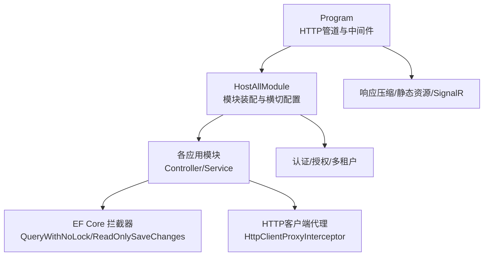
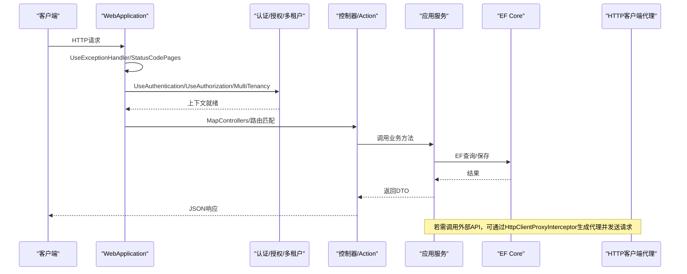
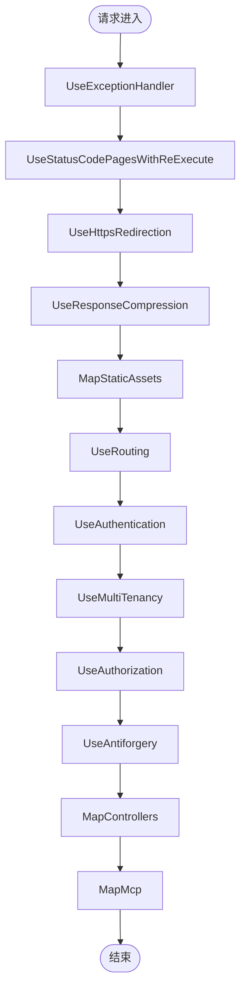
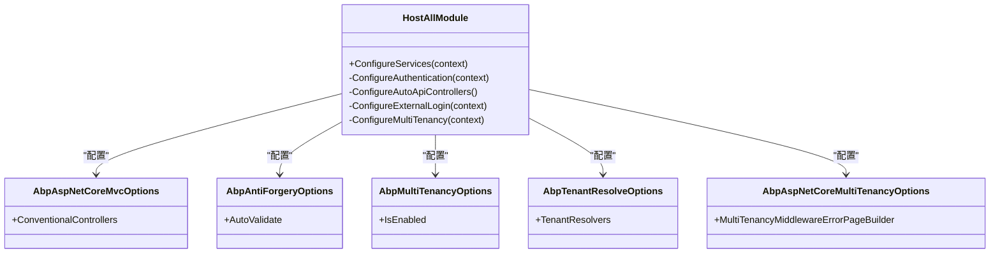
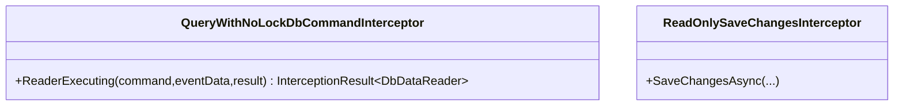
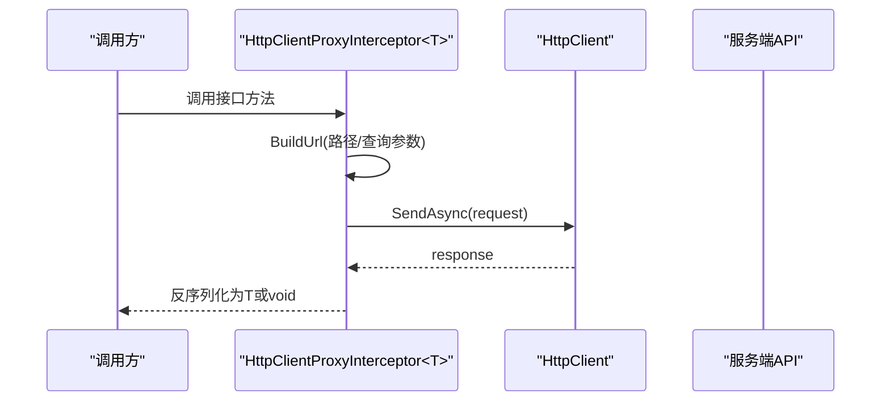
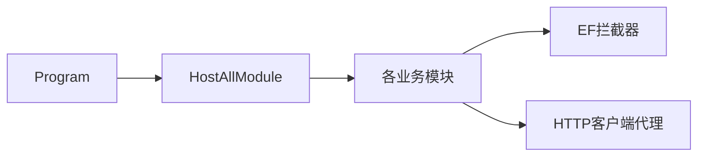

# 横切关注点处理

<cite>
**本文引用的文件**   
- [Program.cs](file://src/Host/H.AppLab.Host.All/H.AppLab.Host.All/Program.cs)
- [HostAllModule.cs](file://src/Host/H.AppLab.Host.All/H.AppLab.Host.All/HostAllModule.cs)
- [HttpClientProxyInterceptor.cs](file://src/Utils/H.Abp.HttpClientProxy/HttpClientProxyInterceptor.cs)
- [QueryWithNoLockDbCommandInterceptor.cs](file://src/LowCode/DesignEngine/H.LowCode.DesignEngine.EntityFrameworkCore/EntityFrameworkCore/Extensions/QueryWithNoLockDbCommandInterceptor.cs)
- [ReadOnlySaveChangesInterceptor.cs](file://src/LowCode/DesignEngine/H.LowCode.DesignEngine.EntityFrameworkCore/EntityFrameworkCore/Extensions/ReadOnlySaveChangesInterceptor.cs)
- [ServiceCollectionExtensions.cs](file://src/Utils/H.Abp.HttpClientProxy/ServiceCollectionExtensions.cs)
- [AccountHostModule.cs](file://src/Host/Account/H.Account.Host/AccountHostModule.cs)
</cite>

## 目录
1. [简介](#简介)
2. [项目结构](#项目结构)
3. [核心组件](#核心组件)
4. [架构总览](#架构总览)
5. [详细组件分析](#详细组件分析)
6. [依赖关系分析](#依赖关系分析)
7. [性能考量](#性能考量)
8. [故障排查指南](#故障排查指南)
9. [结论](#结论)
10. [附录](#附录)

## 简介
本文件面向AppLab平台的横切关注点（日志、异常、验证、缓存、审计等）在模块化架构中的实现方式，重点说明如何通过AOP与中间件机制统一处理请求生命周期内的通用能力。文档涵盖：
- 中间件的注册与配置（认证、授权、多租户、异常处理、压缩、路由等）
- 全局异常处理器的集成位置与扩展点
- 自定义拦截器（EF Core DbCommandInterceptor、HTTP客户端代理）
- 过滤器与扩展方法的使用建议
- 横切关注点的最佳实践与常见问题排查

## 项目结构
AppLab采用ABP模块化架构，宿主模块集中装配各业务模块，并在Program中编排HTTP管道。横切关注点主要分布在以下位置：
- Program：HTTP管道、服务注册、中间件顺序
- HostAllModule：跨模块的控制器发现、认证、多租户、外部登录等配置
- Utils：HTTP客户端代理拦截器与扩展方法
- EF Core Extensions：数据库命令拦截器（只读优化、NOLOCK注入）

图表来源 
- [Program.cs:1-115](file://src/Host/H.AppLab.Host.All/H.AppLab.Host.All/Program.cs#L1-L115)
- [HostAllModule.cs:1-203](file://src/Host/H.AppLab.Host.All/H.AppLab.Host.All/HostAllModule.cs#L1-L203)

章节来源
- [Program.cs:1-115](file://src/Host/H.AppLab.Host.All/H.AppLab.Host.All/Program.cs#L1-L115)
- [HostAllModule.cs:1-203](file://src/Host/H.AppLab.Host.All/H.AppLab.Host.All/HostAllModule.cs#L1-L203)

## 核心组件
- HTTP管道与中间件编排：异常处理、状态码页面、HTTPS重定向、响应压缩、静态资源、路由、认证、多租户、授权、反伪造、控制器映射、MCP端点、Hangfire仪表盘、Blazor组件映射
- 模块装配与横切配置：自动控制器发现、Cookie认证、多租户解析、外部登录绑定
- 数据库层拦截器：只读事务优化、NOLOCK提示注入
- HTTP客户端代理：基于DispatchProxy的接口到HTTP调用转换，便于前端或远程服务调用的横切增强（如重试、超时、日志、鉴权头）

章节来源
- [Program.cs:1-115](file://src/Host/H.AppLab.Host.All/H.AppLab.Host.All/Program.cs#L1-L115)
- [HostAllModule.cs:1-203](file://src/Host/H.AppLab.Host.All/H.AppLab.Host.All/HostAllModule.cs#L1-L203)
- [QueryWithNoLockDbCommandInterceptor.cs:1-36](file://src/LowCode/DesignEngine/H.LowCode.DesignEngine.EntityFrameworkCore/EntityFrameworkCore/Extensions/QueryWithNoLockDbCommandInterceptor.cs#L1-L36)
- [ReadOnlySaveChangesInterceptor.cs](file://src/LowCode/DesignEngine/H.LowCode.DesignEngine.EntityFrameworkCore/EntityFrameworkCore/Extensions/ReadOnlySaveChangesInterceptor.cs)
- [HttpClientProxyInterceptor.cs:1-219](file://src/Utils/H.Abp.HttpClientProxy/HttpClientProxyInterceptor.cs#L1-L219)

## 架构总览
下图展示从请求进入ASP.NET Core到业务处理的横切流程，以及EF Core与HTTP客户端的拦截点。

图表来源 
- [Program.cs:1-115](file://src/Host/H.AppLab.Host.All/H.AppLab.Host.All/Program.cs#L1-L115)
- [HostAllModule.cs:1-203](file://src/Host/H.AppLab.Host.All/H.AppLab.Host.All/HostAllModule.cs#L1-L203)
- [HttpClientProxyInterceptor.cs:1-219](file://src/Utils/H.Abp.HttpClientProxy/HttpClientProxyInterceptor.cs#L1-L219)

## 详细组件分析

### 中间件与全局异常处理
- 开发环境：启用WASM调试；生产环境：启用异常处理器、HSTS
- 状态码页面：使用自定义路径执行非2xx响应
- HTTPS重定向与响应压缩：提升安全与传输效率
- 静态资源：MapStaticAssets统一管理WASM资源缓存策略
- 认证/授权/多租户：按顺序挂载，确保后续组件可访问用户与租户上下文
- 控制器与MCP端点：MapControllers与MapMcp暴露API与服务

图表来源 
- [Program.cs:1-115](file://src/Host/H.AppLab.Host.All/H.AppLab.Host.All/Program.cs#L1-L115)

章节来源
- [Program.cs:1-115](file://src/Host/H.AppLab.Host.All/H.AppLab.Host.All/Program.cs#L1-L115)

### 模块装配与横切配置
- 自动控制器发现：通过AbpAspNetCoreMvcOptions.ConventionalControllers为各模块程序集注册控制器
- Cookie认证：默认与系统双Cookie方案，支持登录/拒绝路径与过期策略
- 多租户：启用并自定义ITenantStore，优先从Claims解析租户ID，并提供无效租户的错误页处理
- 外部登录：绑定配置并注册第三方认证服务

图表来源 
- [HostAllModule.cs:1-203](file://src/Host/H.AppLab.Host.All/H.AppLab.Host.All/HostAllModule.cs#L1-L203)

章节来源
- [HostAllModule.cs:1-203](file://src/Host/H.AppLab.Host.All/H.AppLab.Host.All/HostAllModule.cs#L1-L203)

### 自定义拦截器：EF Core DbCommandInterceptor
- QueryWithNoLockDbCommandInterceptor：在ReaderExecuting阶段修改SQL，为FROM/JOIN表别名追加WITH (NOLOCK)，提升读取性能
- ReadOnlySaveChangesInterceptor：用于只读场景下的保存变更拦截（具体逻辑见对应文件）

图表来源 
- [QueryWithNoLockDbCommandInterceptor.cs:1-36](file://src/LowCode/DesignEngine/H.LowCode.DesignEngine.EntityFrameworkCore/EntityFrameworkCore/Extensions/QueryWithNoLockDbCommandInterceptor.cs#L1-L36)
- [ReadOnlySaveChangesInterceptor.cs](file://src/LowCode/DesignEngine/H.LowCode.DesignEngine.EntityFrameworkCore/EntityFrameworkCore/Extensions/ReadOnlySaveChangesInterceptor.cs)

章节来源
- [QueryWithNoLockDbCommandInterceptor.cs:1-36](file://src/LowCode/DesignEngine/H.LowCode.DesignEngine.EntityFrameworkCore/EntityFrameworkCore/Extensions/QueryWithNoLockDbCommandInterceptor.cs#L1-L36)
- [ReadOnlySaveChangesInterceptor.cs](file://src/LowCode/DesignEngine/H.LowCode.DesignEngine.EntityFrameworkCore/EntityFrameworkCore/Extensions/ReadOnlySaveChangesInterceptor.cs)

### 自定义拦截器：HTTP客户端代理（DispatchProxy）
- HttpClientProxyInterceptor<TService>：将接口方法调用转换为HTTP请求，遵循ABP URL约定，自动处理路径参数、查询参数与JSON序列化
- 支持Task与Task<T>返回类型，自动处理空内容与反序列化
- 提供Create工厂方法与Initialize初始化方法

图表来源 
- [HttpClientProxyInterceptor.cs:1-219](file://src/Utils/H.Abp.HttpClientProxy/HttpClientProxyInterceptor.cs#L1-L219)

章节来源
- [HttpClientProxyInterceptor.cs:1-219](file://src/Utils/H.Abp.HttpClientProxy/HttpClientProxyInterceptor.cs#L1-L219)

### 过滤器与扩展方法
- 扩展方法：ServiceCollectionExtensions提供便捷的服务注册入口（例如HTTP客户端代理的扩展）
- 过滤器：可在控制器或全局注册IExceptionFilter/IActionFilter以补充横切逻辑（如统一日志、限流、校验）

章节来源
- [ServiceCollectionExtensions.cs](file://src/Utils/H.Abp.HttpClientProxy/ServiceCollectionExtensions.cs)

### 认证与多租户示例（账户宿主）
- AccountHostModule展示了如何在独立宿主中配置认证、外部登录与控制器发现，可作为其他模块参考

章节来源
- [AccountHostModule.cs:1-44](file://src/Host/Account/H.Account.Host/AccountHostModule.cs#L1-L44)

## 依赖关系分析
- Program依赖HostAllModule进行应用初始化与模块装配
- HostAllModule依赖多个业务模块的Application/Web/EfCore模块
- EF Core拦截器由各自模块的DbContext配置注册
- HTTP客户端代理作为工具库被上层服务或客户端引用

图表来源 
- [Program.cs:1-115](file://src/Host/H.AppLab.Host.All/H.AppLab.Host.All/Program.cs#L1-L115)
- [HostAllModule.cs:1-203](file://src/Host/H.AppLab.Host.All/H.AppLab.Host.All/HostAllModule.cs#L1-L203)

章节来源
- [Program.cs:1-115](file://src/Host/H.AppLab.Host.All/H.AppLab.Host.All/Program.cs#L1-L115)
- [HostAllModule.cs:1-203](file://src/Host/H.AppLab.Host.All/H.AppLab.Host.All/HostAllModule.cs#L1-L203)

## 性能考量
- 响应压缩：启用Brotli与Gzip，针对WASM与二进制资源优化传输体积
- 静态资源缓存：MapStaticAssets对指纹化资源启用不可变缓存，避免启动清单失效导致的静默404
- EF NOLOCK：读取查询注入WITH (NOLOCK)减少锁竞争，提高并发读取性能
- 只读事务：ReadOnlySaveChangesInterceptor在只读场景下避免不必要的写操作

[本节为通用指导，不直接分析具体文件]

## 故障排查指南
- 认证失败或登录跳转异常：检查Cookie认证配置与登录路径设置
- 多租户错误导致404：确认ITenantStore与Claims解析器是否生效，查看MultiTenancyMiddlewareErrorPageBuilder行为
- 静态资源加载失败：确认MapStaticAssets未被覆盖，避免对整个/_framework标记为immutable
- EF查询性能问题：检查NOLOCK注入是否正确，必要时调整隔离级别或索引
- HTTP客户端调用异常：检查URL构建规则、参数命名与JSON序列化选项

章节来源
- [Program.cs:1-115](file://src/Host/H.AppLab.Host.All/H.AppLab.Host.All/Program.cs#L1-L115)
- [HostAllModule.cs:1-203](file://src/Host/H.AppLab.Host.All/H.AppLab.Host.All/HostAllModule.cs#L1-L203)
- [QueryWithNoLockDbCommandInterceptor.cs:1-36](file://src/LowCode/DesignEngine/H.LowCode.DesignEngine.EntityFrameworkCore/EntityFrameworkCore/Extensions/QueryWithNoLockDbCommandInterceptor.cs#L1-L36)
- [HttpClientProxyInterceptor.cs:1-219](file://src/Utils/H.Abp.HttpClientProxy/HttpClientProxyInterceptor.cs#L1-L219)

## 结论
AppLab平台通过ABP模块化与ASP.NET Core中间件体系，实现了横切关注点的统一治理。Program负责HTTP管道编排，HostAllModule集中配置认证、授权、多租户与控制器发现；EF Core拦截器与HTTP客户端代理提供了底层与网络层的横切增强。结合扩展方法与过滤器，可在不侵入业务代码的前提下实现日志、异常、验证、缓存、审计等能力的标准化落地。

[本节为总结性内容，不直接分析具体文件]

## 附录
- 横切关注点扩展建议：
  - 日志：在中间件或过滤器中统一记录请求/响应与耗时
  - 异常：通过UseExceptionHandler捕获并输出结构化错误信息
  - 验证：在ActionFilter或模型绑定阶段进行参数校验
  - 缓存：在HTTP层或应用服务层引入分布式缓存策略
  - 审计：在EF SaveChanges或领域事件中进行审计记录

[本节为通用指导，不直接分析具体文件]