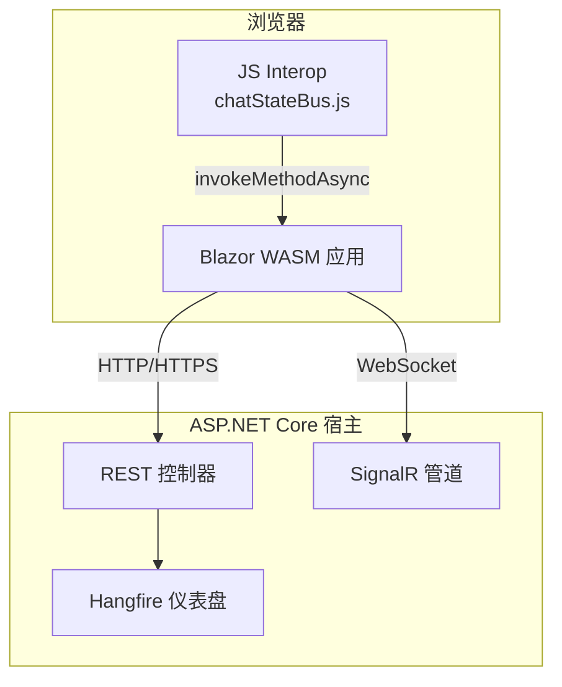
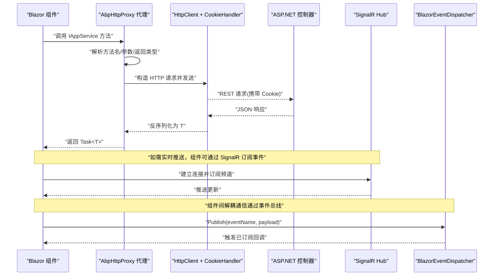
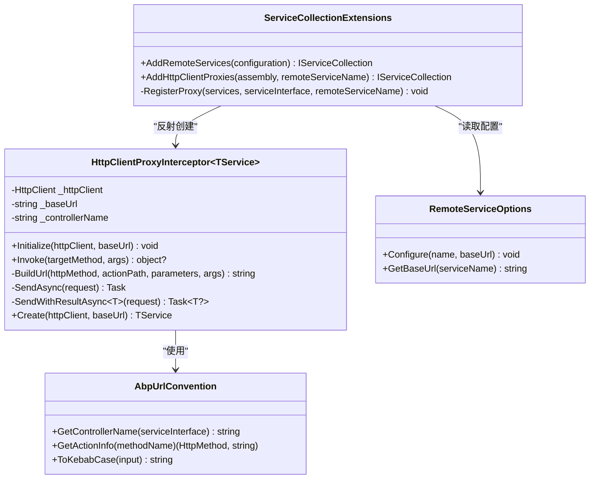
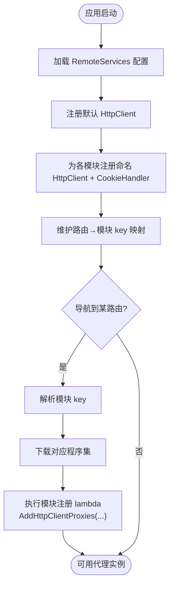
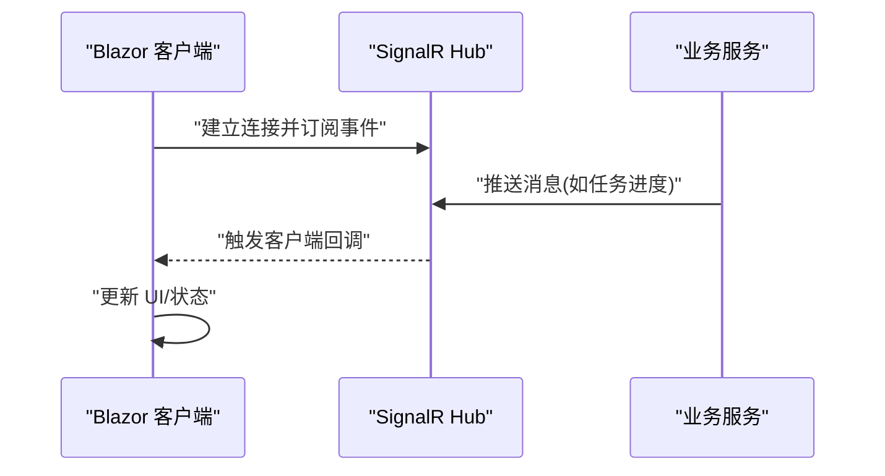
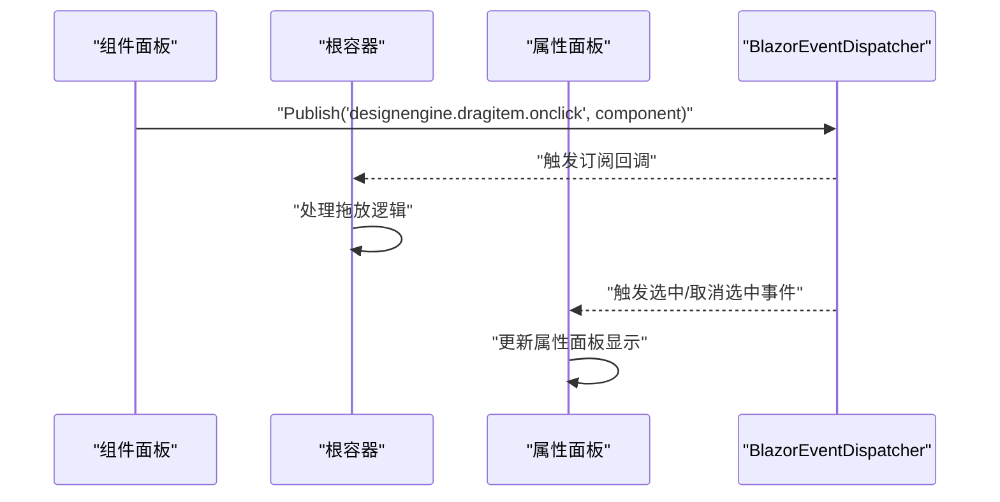
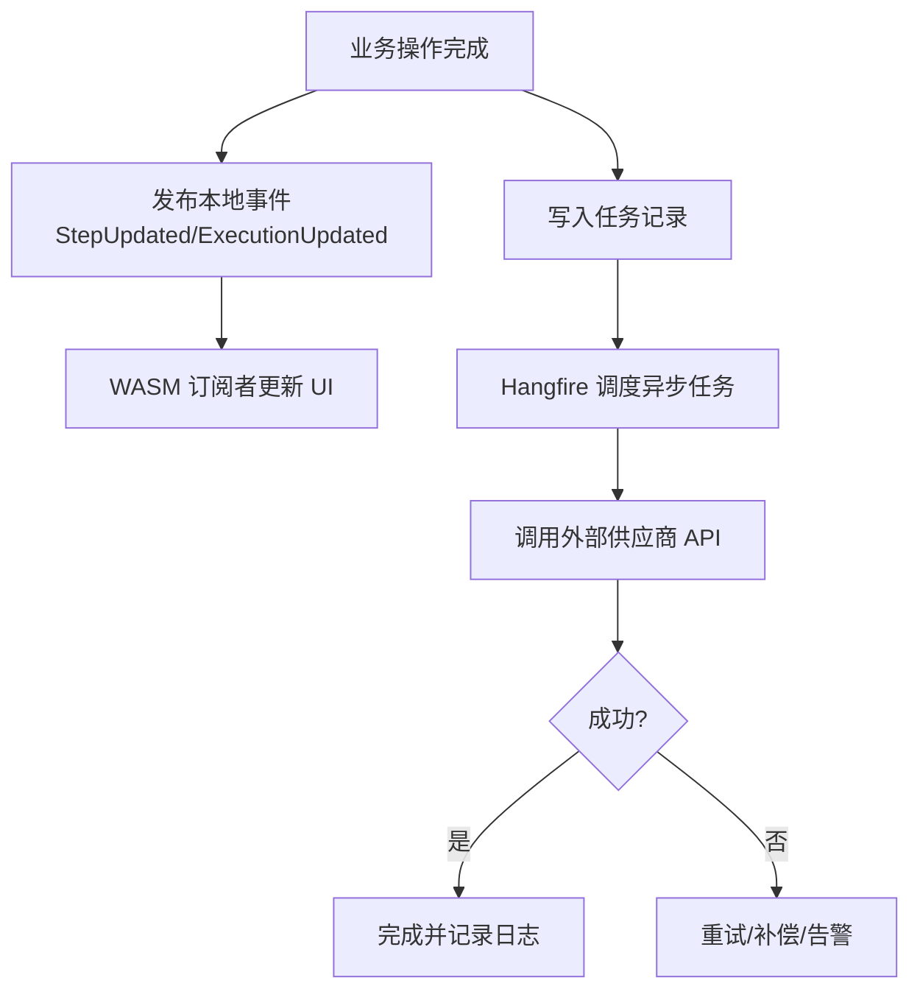
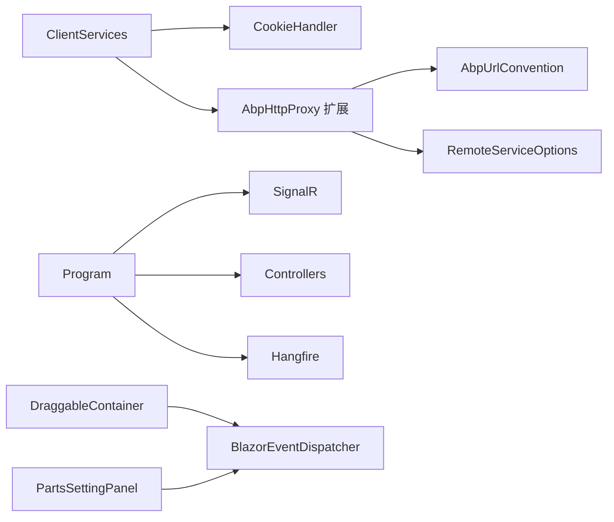

# 通信模式

<cite>
**本文引用的文件**   
- [HttpClientProxyInterceptor.cs](file://src/Utils/H.Abp.HttpClientProxy/HttpClientProxyInterceptor.cs)
- [AbpUrlConvention.cs](file://src/Utils/H.Abp.HttpClientProxy/AbpUrlConvention.cs)
- [ServiceCollectionExtensions.cs](file://src/Utils/H.Abp.HttpClientProxy/ServiceCollectionExtensions.cs)
- [RemoteServiceOptions.cs](file://src/Utils/H.Abp.HttpClientProxy/RemoteServiceOptions.cs)
- [Program.cs](file://src/Host/H.AppLab.Host.All/H.AppLab.Host.All/Program.cs)
- [ClientServices.cs](file://src/Host/H.AppLab.Host.All/H.AppLab.Host.All.Client/ClientServices.cs)
- [CookieHandler.cs](file://src/Host/H.AppLab.Host.All/H.AppLab.Host.All.Client/CookieHandler.cs)
- [BlazorEventDispatcher.cs](file://src/Utils/H.Util.Blazor/BlazorEventDispatcher.cs)
- [DraggableContainer.razor](file://src/LowCode/DesignEngine/H.LowCode.DesignEngine/DraggableComponents/DraggableContainer.razor)
- [PartsSettingPanel.razor](file://src/LowCode/DesignEngine/H.LowCode.PartsDesignEngine/SettingPanel/PartsSettingPanel.razor)
- [TestExecutionEventNotifier.cs](file://src/Services/Testing/H.Testing.Application.Contracts/Services/TestExecutionEventNotifier.cs)
- [chatStateBus.js](file://src/Agent/Assistant/H.Assistant.Web/wwwroot/js/chatStateBus.js)
- [Error.razor](file://src/Host/H.AppLab.Host.All/H.AppLab.Host.All/Components/Pages/Error.razor)
</cite>

## 目录
1. [简介](#简介)
2. [项目结构](#项目结构)
3. [核心组件](#核心组件)
4. [架构总览](#架构总览)
5. [详细组件分析](#详细组件分析)
6. [依赖关系分析](#依赖关系分析)
7. [性能考量](#性能考量)
8. [故障排查指南](#故障排查指南)
9. [结论](#结论)
10. [附录](#附录)

## 简介
本文件面向AppLab平台，系统化阐述前后端与组件间的通信模式，覆盖：
- HTTP RESTful API 调用与动态代理生成（基于 AbpHttpProxy）
- SignalR 实时通信配置与使用场景
- Blazor 组件间通信（父子、兄弟、全局事件总线）
- 事件驱动架构（本地事件、消息队列、分布式事务的接入点）
- 错误处理、重试机制与超时控制策略
- 关键时序图与数据流说明

## 项目结构
- 客户端（Blazor WebAssembly）通过 HttpClient 发起 REST 请求，并使用自定义拦截器将接口方法映射为 HTTP 调用。
- 服务端提供 ASP.NET Core 控制器与 SignalR Hub，承载 REST 与实时通信。
- 组件层通过事件总线与状态服务进行跨组件通信。
- 模块按路由懒加载，按需注册远程服务代理，减少初始包体积。

[本图为概念性结构示意，不直接映射具体源码文件]

## 核心组件
- AbpHttpProxy 动态代理：基于 DispatchProxy 将 IAppService 接口方法转换为 HTTP 请求，自动构建 URL、参数与 JSON 序列化。
- 客户端服务注册：按模块懒加载，为每个命名 HttpClient 注入 CookieHandler，确保认证凭据随请求发送。
- 事件分发器：BlazorEventDispatcher 提供进程内事件总线，用于兄弟组件解耦通信。
- SignalR 配置：在宿主 Program 中启用并配置最大消息大小与详细错误输出。
- 测试执行事件通知：TestExecutionEventNotifier 暴露 .NET 事件，供服务端与 WASM 共享类型以推送执行进度。

章节来源
- [HttpClientProxyInterceptor.cs:1-219](file://src/Utils/H.Abp.HttpClientProxy/HttpClientProxyInterceptor.cs#L1-L219)
- [AbpUrlConvention.cs:1-87](file://src/Utils/H.Abp.HttpClientProxy/AbpUrlConvention.cs#L1-L87)
- [ServiceCollectionExtensions.cs:1-64](file://src/Utils/H.Abp.HttpClientProxy/ServiceCollectionExtensions.cs#L1-L64)
- [RemoteServiceOptions.cs:1-34](file://src/Utils/H.Abp.HttpClientProxy/RemoteServiceOptions.cs#L1-L34)
- [ClientServices.cs:1-171](file://src/Host/H.AppLab.Host.All/H.AppLab.Host.All.Client/ClientServices.cs#L1-L171)
- [CookieHandler.cs:1-17](file://src/Host/H.AppLab.Host.All/H.AppLab.Host.All.Client/CookieHandler.cs#L1-L17)
- [BlazorEventDispatcher.cs:1-51](file://src/Utils/H.Util.Blazor/BlazorEventDispatcher.cs#L1-L51)
- [Program.cs:14-19](file://src/Host/H.AppLab.Host.All/H.AppLab.Host.All/Program.cs#L14-L19)
- [TestExecutionEventNotifier.cs:1-26](file://src/Services/Testing/H.Testing.Application.Contracts/Services/TestExecutionEventNotifier.cs#L1-L26)

## 架构总览
下图展示从前端到后端的典型调用路径，包括 REST 与 SignalR 两条通道，以及组件内事件总线。

图表来源
- [HttpClientProxyInterceptor.cs:30-70](file://src/Utils/H.Abp.HttpClientProxy/HttpClientProxyInterceptor.cs#L30-L70)
- [AbpUrlConvention.cs:34-67](file://src/Utils/H.Abp.HttpClientProxy/AbpUrlConvention.cs#L34-L67)
- [ClientServices.cs:46-81](file://src/Host/H.AppLab.Host.All/H.AppLab.Host.All.Client/ClientServices.cs#L46-L81)
- [Program.cs:14-19](file://src/Host/H.AppLab.Host.All/H.AppLab.Host.All/Program.cs#L14-L19)

## 详细组件分析

### AbpHttpProxy 动态代理与类型安全客户端
- 代理拦截器基于 DispatchProxy 实现，统一处理 Invoke，根据方法签名推断 HTTP 方法与动作路径。
- URL 约定遵循 ABP 风格：控制器名称由接口名派生（去除 I 前缀与 AppService/AppApplicationService 后缀），方法名前缀映射为 HTTP 动词（GetList/GetAll/Get/Put/Update/Delete/Remove/Create/Add/Insert/Post/Patch）。
- 参数处理：名为 id 的简单类型参数作为路径段；其他简单参数放入查询字符串；GET/DELETE 的复杂参数展开为查询键值对；POST/PUT 的复杂参数放入 JSON Body。
- 返回类型支持 Task 与 Task<T>，T 通过 System.Text.Json 反序列化，属性采用驼峰命名且大小写不敏感。
- 工厂方法 Create 接收 HttpClient 与 baseUrl，内部通过反射创建代理实例并初始化。

图表来源
- [HttpClientProxyInterceptor.cs:1-219](file://src/Utils/H.Abp.HttpClientProxy/HttpClientProxyInterceptor.cs#L1-L219)
- [AbpUrlConvention.cs:1-87](file://src/Utils/H.Abp.HttpClientProxy/AbpUrlConvention.cs#L1-L87)
- [ServiceCollectionExtensions.cs:1-64](file://src/Utils/H.Abp.HttpClientProxy/ServiceCollectionExtensions.cs#L1-L64)
- [RemoteServiceOptions.cs:1-34](file://src/Utils/H.Abp.HttpClientProxy/RemoteServiceOptions.cs#L1-L34)

章节来源
- [HttpClientProxyInterceptor.cs:30-70](file://src/Utils/H.Abp.HttpClientProxy/HttpClientProxyInterceptor.cs#L30-L70)
- [AbpUrlConvention.cs:34-67](file://src/Utils/H.Abp.HttpClientProxy/AbpUrlConvention.cs#L34-L67)
- [ServiceCollectionExtensions.cs:35-62](file://src/Utils/H.Abp.HttpClientProxy/ServiceCollectionExtensions.cs#L35-L62)

### 客户端服务注册与懒加载
- ClientServices.Configure 注册默认 HttpClient 与各命名 HttpClient，并为每个命名客户端添加 CookieHandler，使 fetch 请求携带认证 Cookie。
- 通过 AddRemoteServices 从配置节点 RemoteServices 读取 BaseUrl，并由 AddHttpClientProxies 扫描程序集中所有继承 IAppService 的接口，注册代理实现。
- 路由首段到模块 key 的映射表决定懒加载时机，仅在对应程序集下载完成后才执行注册 lambda，避免启动时下载多余代码。

图表来源
- [ClientServices.cs:46-81](file://src/Host/H.AppLab.Host.All/H.AppLab.Host.All.Client/ClientServices.cs#L46-L81)
- [ClientServices.cs:96-145](file://src/Host/H.AppLab.Host.All/H.AppLab.Host.All.Client/ClientServices.cs#L96-L145)
- [ClientServices.cs:150-169](file://src/Host/H.AppLab.Host.All/H.AppLab.Host.All.Client/ClientServices.cs#L150-L169)

章节来源
- [ClientServices.cs:1-171](file://src/Host/H.AppLab.Host.All/H.AppLab.Host.All.Client/ClientServices.cs#L1-L171)
- [CookieHandler.cs:1-17](file://src/Host/H.AppLab.Host.All/H.AppLab.Host.All.Client/CookieHandler.cs#L1-L17)

### SignalR 实时通信
- 宿主 Program 中启用 SignalR，设置最大接收消息大小为 1MB，并在开发环境开启详细错误信息。
- 前端可通过 Blazor 的 SignalR 客户端建立连接并订阅服务器推送的事件，适用于聊天、任务进度等实时场景。
- chatStateBus.js 展示了 JS Interop 调用 Blazor 方法的示例，可用于前端与组件之间的桥接。

图表来源
- [Program.cs:14-19](file://src/Host/H.AppLab.Host.All/H.AppLab.Host.All/Program.cs#L14-L19)
- [chatStateBus.js:78-110](file://src/Agent/Assistant/H.Assistant.Web/wwwroot/js/chatStateBus.js#L78-L110)

章节来源
- [Program.cs:14-19](file://src/Host/H.AppLab.Host.All/H.AppLab.Host.All/Program.cs#L14-L19)
- [chatStateBus.js:78-110](file://src/Agent/Assistant/H.Assistant.Web/wwwroot/js/chatStateBus.js#L78-L110)

### Blazor 组件间通信（父子、兄弟、全局）
- 父子组件通信：通过参数与事件回调（标准 Blazor 模式）。
- 兄弟组件通信：通过 BlazorEventDispatcher 发布/订阅事件，例如设计引擎中的拖拽点击事件。
- 全局状态管理：LowCodeAppState 等单例服务可跨组件共享状态。

图表来源
- [BlazorEventDispatcher.cs:18-49](file://src/Utils/H.Util.Blazor/BlazorEventDispatcher.cs#L18-L49)
- [DraggableContainer.razor:61-76](file://src/LowCode/DesignEngine/H.LowCode.DesignEngine/DraggableComponents/DraggableContainer.razor#L61-L76)
- [PartsSettingPanel.razor:42-66](file://src/LowCode/DesignEngine/H.LowCode.PartsDesignEngine/SettingPanel/PartsSettingPanel.razor#L42-L66)

章节来源
- [BlazorEventDispatcher.cs:1-51](file://src/Utils/H.Util.Blazor/BlazorEventDispatcher.cs#L1-L51)
- [DraggableContainer.razor:61-76](file://src/LowCode/DesignEngine/H.LowCode.DesignEngine/DraggableComponents/DraggableContainer.razor#L61-L76)
- [PartsSettingPanel.razor:42-66](file://src/LowCode/DesignEngine/H.LowCode.PartsDesignEngine/SettingPanel/PartsSettingPanel.razor#L42-L66)

### 事件驱动架构（本地事件、消息队列、分布式事务）
- 本地事件：TestExecutionEventNotifier 暴露 .NET 事件，服务端与 WASM 共享同一实现类型，便于推送执行步骤与结果。
- 消息队列：Hangfire 用于后台任务调度与持久化，Dashboard 提供可视化监控。
- 分布式事务：通过领域事件与外部系统交互（如供应商 API 调用）时，结合重试与补偿机制保证一致性。

图表来源
- [TestExecutionEventNotifier.cs:11-24](file://src/Services/Testing/H.Testing.Application.Contracts/Services/TestExecutionEventNotifier.cs#L11-L24)
- [Program.cs:90-91](file://src/Host/H.AppLab.Host.All/H.AppLab.Host.All/Program.cs#L90-L91)

章节来源
- [TestExecutionEventNotifier.cs:1-26](file://src/Services/Testing/H.Testing.Application.Contracts/Services/TestExecutionEventNotifier.cs#L1-L26)
- [Program.cs:90-91](file://src/Host/H.AppLab.Host.All/H.AppLab.Host.All/Program.cs#L90-L91)

## 依赖关系分析
- 客户端依赖：
  - AbpHttpProxy 依赖 AbpUrlConvention 与 RemoteServiceOptions，用于 URL 约定与配置读取。
  - ClientServices 依赖 IHttpClientFactory 与 CookieHandler，负责命名客户端与认证凭据传递。
- 服务端依赖：
  - Program 启用 SignalR、控制器、Hangfire 与静态资源托管。
- 组件依赖：
  - DraggableContainer 与 PartsSettingPanel 依赖 BlazorEventDispatcher 进行事件解耦。

图表来源
- [ClientServices.cs:46-81](file://src/Host/H.AppLab.Host.All/H.AppLab.Host.All.Client/ClientServices.cs#L46-L81)
- [ServiceCollectionExtensions.cs:35-62](file://src/Utils/H.Abp.HttpClientProxy/ServiceCollectionExtensions.cs#L35-L62)
- [AbpUrlConvention.cs:14-29](file://src/Utils/H.Abp.HttpClientProxy/AbpUrlConvention.cs#L14-L29)
- [RemoteServiceOptions.cs:14-33](file://src/Utils/H.Abp.HttpClientProxy/RemoteServiceOptions.cs#L14-L33)
- [Program.cs:87-91](file://src/Host/H.AppLab.Host.All/H.AppLab.Host.All/Program.cs#L87-L91)
- [DraggableContainer.razor:61-76](file://src/LowCode/DesignEngine/H.LowCode.DesignEngine/DraggableComponents/DraggableContainer.razor#L61-L76)
- [PartsSettingPanel.razor:42-66](file://src/LowCode/DesignEngine/H.LowCode.PartsDesignEngine/SettingPanel/PartsSettingPanel.razor#L42-L66)

章节来源
- [ClientServices.cs:1-171](file://src/Host/H.AppLab.Host.All/H.AppLab.Host.All.Client/ClientServices.cs#L1-L171)
- [ServiceCollectionExtensions.cs:1-64](file://src/Utils/H.Abp.HttpClientProxy/ServiceCollectionExtensions.cs#L1-L64)
- [AbpUrlConvention.cs:1-87](file://src/Utils/H.Abp.HttpClientProxy/AbpUrlConvention.cs#L1-L87)
- [RemoteServiceOptions.cs:1-34](file://src/Utils/H.Abp.HttpClientProxy/RemoteServiceOptions.cs#L1-L34)
- [Program.cs:87-91](file://src/Host/H.AppLab.Host.All/H.AppLab.Host.All/Program.cs#L87-L91)
- [DraggableContainer.razor:61-76](file://src/LowCode/DesignEngine/H.LowCode.DesignEngine/DraggableComponents/DraggableContainer.razor#L61-L76)
- [PartsSettingPanel.razor:42-66](file://src/LowCode/DesignEngine/H.LowCode.PartsDesignEngine/SettingPanel/PartsSettingPanel.razor#L42-L66)

## 性能考量
- 压缩传输：启用 Brotli 与 Gzip 压缩，降低 WASM 程序集与静态资源体积。
- 懒加载：按路由模块懒加载程序集与服务注册，减少初始包大小与启动时间。
- 连接复用：IHttpClientFactory 管理 HttpClient 生命周期，避免端口耗尽与 DNS 失效问题。
- 大消息限制：SignalR 最大接收消息设置为 1MB，需根据业务权衡。
- 序列化优化：System.Text.Json 驼峰命名与大小写不敏感，提升前后端兼容性。

章节来源
- [Program.cs:27-46](file://src/Host/H.AppLab.Host.All/H.AppLab.Host.All/Program.cs#L27-L46)
- [ClientServices.cs:96-145](file://src/Host/H.AppLab.Host.All/H.AppLab.Host.All.Client/ClientServices.cs#L96-L145)
- [HttpClientProxyInterceptor.cs:17-21](file://src/Utils/H.Abp.HttpClientProxy/HttpClientProxyInterceptor.cs#L17-L21)

## 故障排查指南
- 常见错误页面：Error.razor 显示请求 ID 与环境提示，便于定位问题。
- 异常传播：代理层在 SendAsync/SendWithResultAsync 中调用 EnsureSuccessStatusCode，非 2xx 会抛出异常。
- 调试建议：
  - 开发环境启用详细错误与 WASM 调试。
  - 检查 CookieHandler 是否正确附加凭据。
  - 确认 RemoteServices 配置 BaseUrl 正确。
  - 查看 Hangfire Dashboard 了解后台任务执行情况。

章节来源
- [Error.razor:1-36](file://src/Host/H.AppLab.Host.All/H.AppLab.Host.All/Components/Pages/Error.razor#L1-L36)
- [HttpClientProxyInterceptor.cs:191-206](file://src/Utils/H.Abp.HttpClientProxy/HttpClientProxyInterceptor.cs#L191-L206)
- [Program.cs:58-66](file://src/Host/H.AppLab.Host.All/H.AppLab.Host.All/Program.cs#L58-L66)
- [Program.cs:90-91](file://src/Host/H.AppLab.Host.All/H.AppLab.Host.All/Program.cs#L90-L91)

## 结论
AppLab 平台的通信模式以 AbpHttpProxy 为核心，结合 Blazor 组件事件总线与 SignalR 实时通道，形成“REST + 事件 + 实时”的立体通信体系。通过懒加载与压缩优化，兼顾了可扩展性与性能。建议在后续迭代中补充统一的错误码规范、重试与熔断策略，以及更完善的分布式事务保障。

## 附录
- 最佳实践建议：
  - 接口命名遵循 ABP 约定，确保 URL 自动生成正确。
  - 组件间通信优先使用事件总线，避免强耦合。
  - 对外部依赖调用增加重试与超时控制，提升鲁棒性。
  - 使用 Hangfire 管理耗时任务，并通过 Dashboard 监控健康度。