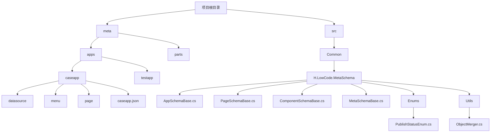
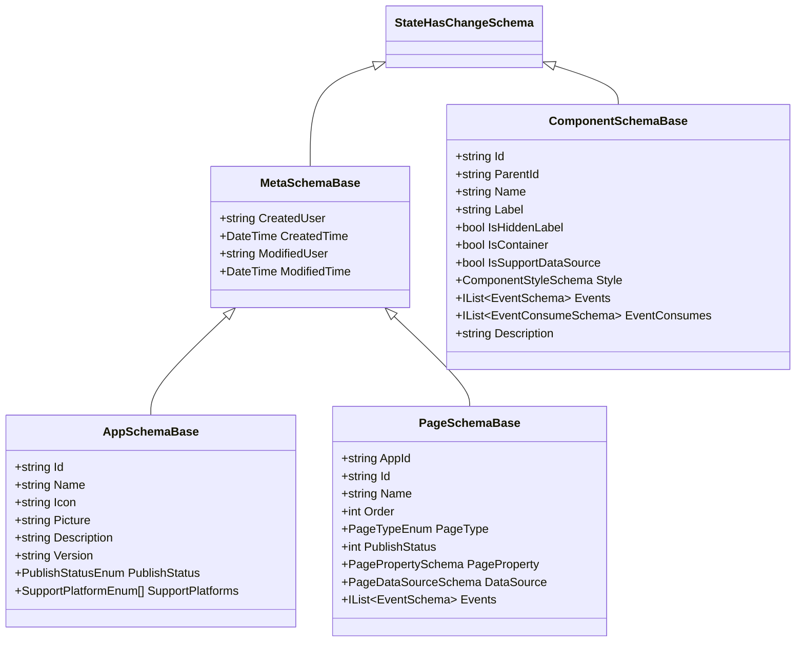
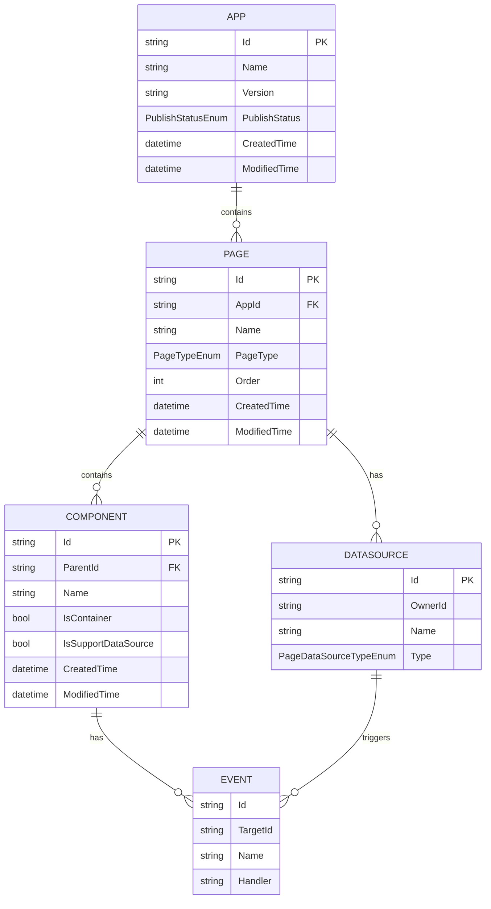

# 元数据（Meta）

<cite>
**本文档引用的文件**  
- [MetaSchemaBase.cs](file://src/Common/H.LowCode.MetaSchema/MetaSchemaBase.cs)
- [AppSchemaBase.cs](file://src/Common/H.LowCode.MetaSchema/AppSchemaBase.cs)
- [PageSchemaBase.cs](file://src/Common/H.LowCode.MetaSchema/PageSchemaBase.cs)
- [ComponentSchemaBase.cs](file://src/Common/H.LowCode.MetaSchema/ComponentSchemaBase.cs)
- [PublishStatusEnum.cs](file://src/Common/H.LowCode.MetaSchema/Enums/PublishStatusEnum.cs)
- [ObjectMerger.cs](file://src/Common/H.LowCode.MetaSchema/Utils/ObjectMerger.cs)
- [caseapp.json](file://meta/apps/caseapp/caseapp.json)
</cite>

## 目录
1. [引言](#引言)  
2. [项目结构](#项目结构)  
3. [核心组件分析](#核心组件分析)  
4. [元数据继承体系](#元数据继承体系)  
5. [元数据生命周期与发布状态](#元数据生命周期与发布状态)  
6. [元数据合并与校验机制](#元数据合并与校验机制)  
7. [元数据结构树形图](#元数据结构树形图)  
8. [结论](#结论)

## 引言

在低代码平台中，元数据是驱动系统配置、设计与渲染的核心。它通过结构化的JSON文件进行序列化存储，并在设计引擎与渲染引擎之间传递，实现“一次设计，多端运行”的能力。本文深入分析元数据的设计原理、继承体系、存储结构、合并机制与生命周期管理，揭示其作为系统配置中枢的关键作用。

## 项目结构

低代码平台的项目结构清晰地划分为两个主要部分：`meta`（元数据）和`src`（源代码）。

- `meta`目录存放所有应用的元数据配置，按应用（如`caseapp`、`testapp`）组织，每个应用包含`datasource`（数据源）、`menu`（菜单）、`page`（页面）等子目录，以及应用级别的`caseapp.json`文件。
- `src`目录包含平台的核心源代码，其中`H.LowCode.MetaSchema`命名空间定义了所有元数据模式的基类与结构。



**图示来源**  
- [meta/apps/caseapp](file://meta/apps/caseapp)
- [src/Common/H.LowCode.MetaSchema](file://src/Common/H.LowCode.MetaSchema)

## 核心组件分析

### 元数据基类：MetaSchemaBase

`MetaSchemaBase`是所有元数据模式的抽象基类，继承自`StateHasChangeSchema`，封装了元数据的通用审计字段。

```csharp
public abstract class MetaSchemaBase : StateHasChangeSchema
{
    [JsonPropertyName("cu")]
    public string CreatedUser { get; set; }

    [JsonPropertyName("ct")]
    public DateTime CreatedTime { get; set; }

    [JsonPropertyName("mu")]
    public string ModifiedUser { get; set; }

    [JsonPropertyName("mt")]
    public DateTime ModifiedTime { get; set; }
}
```

该类定义了创建用户、创建时间、修改用户和修改时间四个属性，确保所有元数据实体都具备完整的变更追踪能力。

**本节来源**  
- [MetaSchemaBase.cs](file://src/Common/H.LowCode.MetaSchema/MetaSchemaBase.cs#L5-L18)

### 应用元数据：AppSchemaBase

`AppSchemaBase`继承自`MetaSchemaBase`，定义了应用级别的元数据结构。

```csharp
public abstract class AppSchemaBase : MetaSchemaBase
{
    public string Id { get; set; }
    [JsonPropertyName("n")] public string Name { get; set; }
    public string Icon { get; set; }
    [JsonPropertyName("pic")] public string Picture { get; set; }
    [JsonPropertyName("desc")] public string Description { get; set; }
    [JsonPropertyName("v")] public string Version { get; set; }
    [JsonPropertyName("pub")] public PublishStatusEnum PublishStatus { get; set; }
    [JsonPropertyName("platform")] public SupportPlatformEnum[] SupportPlatforms { get; set; } = [0];
}
```

关键字段包括：
- `Id`：应用唯一标识
- `Name`：应用名称
- `PublishStatus`：发布状态（开发中、审批中、已发布）
- `SupportPlatforms`：支持的运行平台

**本节来源**  
- [AppSchemaBase.cs](file://src/Common/H.LowCode.MetaSchema/AppSchemaBase.cs#L4-L27)

### 页面元数据：PageSchemaBase

`PageSchemaBase`同样继承自`MetaSchemaBase`，描述页面的配置信息。

```csharp
public abstract class PageSchemaBase : MetaSchemaBase
{
    [JsonPropertyName("aid")] public string AppId { get; set; }
    [JsonPropertyName("id")] public string Id { get; set; } = ShortIdGenerator.Generate();
    [JsonPropertyName("n")] public string Name { get; set; }
    [JsonPropertyName("order")] public int Order { get; set; }
    [JsonPropertyName("pt")] public PageTypeEnum PageType { get; set; }
    [JsonPropertyName("pub")] public int PublishStatus { get; set; }
    [JsonPropertyName("pageprop")] public PagePropertySchema PageProperty { get; set; } = new();
    [JsonPropertyName("ds")] public PageDataSourceSchema DataSource { get; set; } = new();
    [JsonPropertyName("evs")] public IList<EventSchema> Events { get; set; }
}
```

它包含页面所属应用ID、页面类型、页面属性、数据源和事件列表等核心信息。

**本节来源**  
- [PageSchemaBase.cs](file://src/Common/H.LowCode.MetaSchema/PageSchemaBase.cs#L5-L39)

### 组件元数据：ComponentSchemaBase

`ComponentSchemaBase`定义了页面中组件的元数据结构。

```csharp
public abstract class ComponentSchemaBase : StateHasChangeSchema
{
    [JsonPropertyName("id")] public string Id { get; set; } = ShortIdGenerator.Generate();
    [JsonPropertyName("pid")] public string ParentId { get; set; }
    [JsonPropertyName("n")] public string Name { get; set; }
    [JsonPropertyName("lb")] public string Label { get; set; }
    [JsonPropertyName("container")] public bool IsContainer { get; set; }
    [JsonPropertyName("sptds")] public bool IsSupportDataSource { get; set; }
    [JsonPropertyName("stl")] public ComponentStyleSchema Style { get; set; } = new();
    [JsonPropertyName("evs")] public IList<EventSchema> Events { get; set; }
    [JsonPropertyName("evcs")] public IList<EventConsumeSchema> EventConsumes { get; set; }
    [JsonPropertyName("desc")] public string Description { get; set; }
}
```

组件元数据包含ID、父级ID、标签、是否为容器、是否支持数据源、样式、事件等，是构建页面UI的基础。

**本节来源**  
- [ComponentSchemaBase.cs](file://src/Common/H.LowCode.MetaSchema/ComponentSchemaBase.cs#L5-L77)

## 元数据继承体系

元数据通过继承体系实现了结构的统一与扩展。以下是核心类的继承关系图：



**图示来源**  
- [MetaSchemaBase.cs](file://src/Common/H.LowCode.MetaSchema/MetaSchemaBase.cs)
- [AppSchemaBase.cs](file://src/Common/H.LowCode.MetaSchema/AppSchemaBase.cs)
- [PageSchemaBase.cs](file://src/Common/H.LowCode.MetaSchema/PageSchemaBase.cs)
- [ComponentSchemaBase.cs](file://src/Common/H.LowCode.MetaSchema/ComponentSchemaBase.cs)

## 元数据生命周期与发布状态

元数据的生命周期贯穿设计、发布和运行三个阶段。

### 发布状态管理

`PublishStatusEnum`枚举定义了元数据的三种发布状态：

```csharp
public enum PublishStatusEnum
{
    Development,  // 开发中
    Approving,    // 审批中
    Published     // 已发布
}
```

- **开发中**：设计师正在编辑，未发布。
- **审批中**：提交审核，等待批准。
- **已发布**：审核通过，可供运行引擎加载。

该状态机制确保了元数据在不同环境（开发、测试、生产）中的安全流转。

**本节来源**  
- [PublishStatusEnum.cs](file://src/Common/H.LowCode.MetaSchema/Enums/PublishStatusEnum.cs#L8-L13)

### 元数据序列化与存储

元数据以JSON格式存储在`meta/apps/{appname}/`目录下。例如，`caseapp.json`文件存储了`caseapp`应用的元数据：

```json
{
  "id": "caseapp",
  "n": "案例应用",
  "desc": "用于演示的案例应用",
  "v": "1.0.0",
  "pub": 2,
  "platform": [0],
  "cu": "admin",
  "ct": "2025-02-25T10:00:00Z",
  "mu": "admin",
  "mt": "2025-02-25T10:00:00Z"
}
```

此文件在设计时由设计引擎生成，在运行时由渲染引擎加载，实现了配置的持久化与传递。

**本节来源**  
- [caseapp.json](file://meta/apps/caseapp/caseapp.json)

## 元数据合并与校验机制

`ObjectMerger`类提供了元数据的深度合并能力，用于处理版本更新、配置覆盖等场景。

### 合并逻辑

```csharp
public static class ObjectMerger
{
    public static void Merge(Type type, object source, object target)
    {
        if (target == null || source == null)
            throw new ArgumentNullException();

        var properties = type.GetProperties(BindingFlags.Public | BindingFlags.Instance);

        foreach (var property in properties)
        {
            var sourcePropertyValue = property.GetValue(source);
            if (sourcePropertyValue == null || IsDefaultValue(property.PropertyType, sourcePropertyValue))
                continue;

            if (IsCollectionType(property.PropertyType))
            {
                MergeCollections(property, target, sourcePropertyValue);
            }
            else if (IsArrayType(property.PropertyType))
            {
                MergeArray(property, target, sourcePropertyValue);
            }
            else if (property.PropertyType.IsClass && property.PropertyType != typeof(string))
            {
                var targetPropertyValue = property.GetValue(target);
                if (targetPropertyValue == null)
                {
                    targetPropertyValue = Activator.CreateInstance(property.PropertyType);
                    property.SetValue(target, targetPropertyValue);
                }
                Merge(property.PropertyType, sourcePropertyValue, targetPropertyValue);
            }
            else
            {
                property.SetValue(target, sourcePropertyValue);
            }
        }
    }
}
```

### 合并规则

1. **空值跳过**：`source`属性为`null`时不合并。
2. **默认值跳过**：`source`属性为默认值时不合并。
3. **集合处理**：递归合并集合中的每个元素。
4. **数组处理**：扩展目标数组以匹配源数组长度，并合并元素。
5. **引用类型**：递归合并嵌套对象。
6. **值类型**：直接覆盖目标值。

该机制确保了元数据在升级或合并时，既能保留现有配置，又能安全地应用新变更。

**本节来源**  
- [ObjectMerger.cs](file://src/Common/H.LowCode.MetaSchema/Utils/ObjectMerger.cs#L10-L174)

## 元数据结构树形图

以下为`caseapp`应用的元数据结构树形图，展示了其作为系统配置中枢的完整视图：



**图示来源**  
- [AppSchemaBase.cs](file://src/Common/H.LowCode.MetaSchema/AppSchemaBase.cs)
- [PageSchemaBase.cs](file://src/Common/H.LowCode.MetaSchema/PageSchemaBase.cs)
- [ComponentSchemaBase.cs](file://src/Common/H.LowCode.MetaSchema/ComponentSchemaBase.cs)
- [caseapp.json](file://meta/apps/caseapp/caseapp.json)

## 结论

元数据是低代码平台的核心驱动力。通过`MetaSchemaBase`基类及其继承体系，平台实现了统一的元数据模型。元数据以JSON文件形式序列化存储，贯穿设计、发布和运行全生命周期。`ObjectMerger`提供了安全的合并机制，`PublishStatusEnum`确保了配置的有序流转。整个系统以元数据为中枢，实现了配置化、可追溯、高内聚的低代码开发体验。