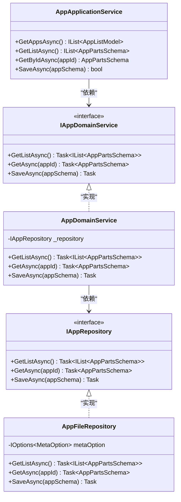
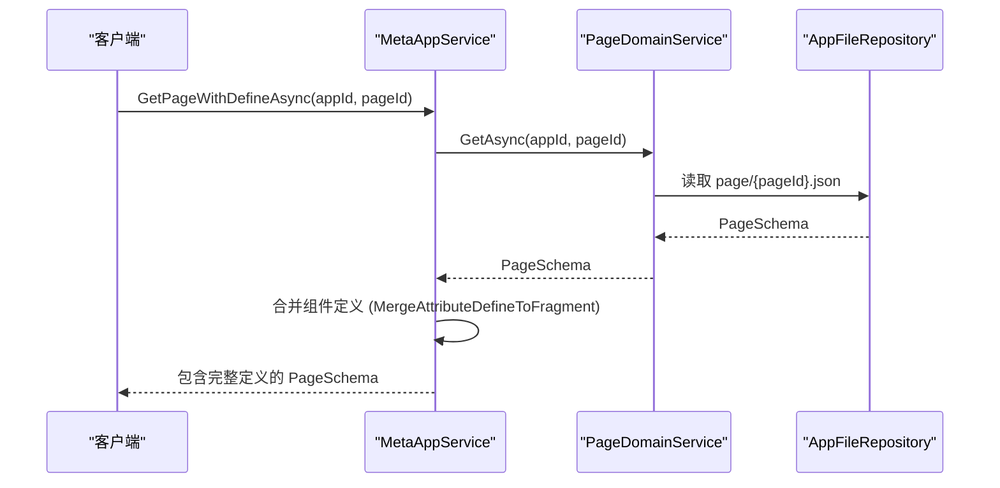

# 应用（App）

<cite>
**本文档引用的文件**   
- [AppSchemaBase.cs](file://src\Common\H.LowCode.MetaSchema\AppSchemaBase.cs)
- [SupportPlatformEnum.cs](file://src\Common\H.LowCode.MetaSchema\Enums\SupportPlatformEnum.cs)
- [PublishStatusEnum.cs](file://src\Common\H.LowCode.MetaSchema\Enums\PublishStatusEnum.cs)
- [caseapp.json](file://meta\apps\caseapp\caseapp.json)
- [AppApplicationService.cs](file://src\DesignEngine\H.LowCode.DesignEngine.Application\AppServices\AppApplicationService.cs)
- [AppDomainService.cs](file://src\DesignEngine\H.LowCode.DesignEngine.Domain\MetaDomainServices\AppDomainService.cs)
- [AppFileRepository.cs](file://src\DesignEngine\H.LowCode.DesignEngine.Repository.JsonFile\Repositories\AppFileRepository.cs)
- [AppSchema.cs](file://src\Common\H.LowCode.MetaSchema.RenderEngine\AppSchema.cs)
- [AppPartsSchema.cs](file://src\Common\H.LowCode.MetaSchema.DesignEngine\AppPartsSchema.cs)
- [MetaAppService.cs](file://src\RenderEngine\H.LowCode.RenderEngine.Application\RenderAppServices\MetaAppService.cs)
- [AppCascadingModel.cs](file://src\Common\H.LowCode.ComponentBase\CascadingModels\AppCascadingModel.cs)
</cite>

## 目录
1. [应用概述](#应用概述)
2. [应用元数据结构](#应用元数据结构)
3. [应用的创建、编辑、发布与删除流程](#应用的创建编辑发布与删除流程)
4. [应用在设计引擎与渲染引擎中的处理逻辑](#应用在设计引擎与渲染引擎中的处理逻辑)
5. [应用的聚合能力与部署边界](#应用的聚合能力与部署边界)

## 应用概述

在低代码平台中，“应用”（App）是最顶层的容器，代表一个完整的、可独立运行和部署的业务系统。它不仅定义了系统的名称、标识、图标、描述等基本信息，还通过元数据配置决定了其支持的平台类型和当前的发布状态。每个应用都拥有唯一的标识（Id），并作为组织和管理其内部页面、菜单、数据源等资源的逻辑边界。

应用的生命周期由设计引擎（DesignEngine）管理，其运行时表现则由渲染引擎（RenderEngine）负责。设计引擎允许开发者通过可视化界面进行应用的构建和修改，而渲染引擎则将这些元数据转换为最终用户可交互的前端界面。

**Section sources**
- [AppSchemaBase.cs](file://src\Common\H.LowCode.MetaSchema\AppSchemaBase.cs#L4-L27)

## 应用元数据结构

应用的元数据结构基于 `AppSchemaBase` 抽象类定义，该类继承自 `MetaSchemaBase`，并包含了一系列核心属性。这些属性通过 JSON 序列化特性（如 `[JsonPropertyName]`）映射为简短的键名，以优化存储和传输效率。

### AppSchemaBase 类属性结构

```csharp
public abstract class AppSchemaBase : MetaSchemaBase
{
    public string Id { get; set; }

    [JsonPropertyName("n")]
    public string Name { get; set; }

    public string Icon { get; set; }

    [JsonPropertyName("pic")]
    public string Picture { get; set; }

    [JsonPropertyName("desc")]
    public string Description { get; set; }

    [JsonPropertyName("v")]
    public string Version { get; set; }

    [JsonPropertyName("pub")]
    public PublishStatusEnum PublishStatus { get; set; }

    [JsonPropertyName("platform")]
    public SupportPlatformEnum[] SupportPlatforms { get; set; } = [0];
}
```

#### 关键属性说明
- **Id**: 应用的唯一标识符。
- **Name (n)**: 应用的显示名称。
- **Description (desc)**: 应用的描述信息。
- **PublishStatus (pub)**: 应用的发布状态，枚举值见下文。
- **SupportPlatforms (platform)**: 应用支持的平台数组，枚举值见下文。

### 支持的平台类型 (SupportPlatformEnum)

```csharp
public enum SupportPlatformEnum
{
    [Display(Name = "Web")]
    Web,
    [Display(Name = "App")]
    Mobile,
    [Display(Name = "小程序")]
    WXMiniApp
}
```

此枚举定义了应用可以部署的目标平台。例如，`[0, 2]` 表示该应用同时支持 Web 和小程序。

### 发布状态 (PublishStatusEnum)

```csharp
public enum PublishStatusEnum
{
    Development,
    Approving,
    Published
}
```

此枚举表示应用的当前状态：
- **Development**: 开发中，应用仅对开发者可见。
- **Approving**: 审核中，应用已提交发布，等待审批。
- **Published**: 已发布，应用对最终用户可见并可访问。

### 应用元数据实例 (caseapp.json)

以 `meta/apps/caseapp/caseapp.json` 文件为例，其内容如下：

```json
{"id":"caseapp","n":"用例系统","desc":"展示典型页面案例 (参考 amis 示例)","platform":[0,2],"mt":"2025-05-29T16:49:31.1628431Z"}
```

- **id**: `caseapp`
- **n (Name)**: `用例系统`
- **desc (Description)**: `展示典型页面案例 (参考 amis 示例)`
- **platform (SupportPlatforms)**: `[0, 2]` (Web 和 小程序)
- **mt (ModifiedTime)**: 最后修改时间

此实例清晰地展示了应用元数据的完整结构。

**Section sources**
- [AppSchemaBase.cs](file://src\Common\H.LowCode.MetaSchema\AppSchemaBase.cs#L4-L27)
- [SupportPlatformEnum.cs](file://src\Common\H.LowCode.MetaSchema\Enums\SupportPlatformEnum.cs#L9-L17)
- [PublishStatusEnum.cs](file://src\Common\H.LowCode.MetaSchema\Enums\PublishStatusEnum.cs#L8-L13)
- [caseapp.json](file://meta\apps\caseapp\caseapp.json)

## 应用的创建、编辑、发布与删除流程

应用的生命周期管理主要在设计引擎中完成，其核心服务是 `AppApplicationService`。该服务通过依赖 `IAppDomainService` 来实现业务逻辑，并最终由 `IAppRepository` 负责与文件系统进行持久化交互。

### 核心服务与依赖关系



**Diagram sources**
- [AppApplicationService.cs](file://src\DesignEngine\H.LowCode.DesignEngine.Application\AppServices\AppApplicationService.cs#L14-L51)
- [IAppDomainService.cs](file://src\DesignEngine\H.LowCode.DesignEngine.Domain\MetaDomainServices\IAppDomainService.cs#L5-L12)
- [AppDomainService.cs](file://src\DesignEngine\H.LowCode.DesignEngine.Domain\MetaDomainServices\AppDomainService.cs#L7-L30)
- [IAppRepository.cs](file://src\DesignEngine\H.LowCode.DesignEngine.Domain\MetaRepositories\IAppRepository.cs#L6-L13)
- [AppFileRepository.cs](file://src\DesignEngine\H.LowCode.DesignEngine.Repository.JsonFile\Repositories\AppFileRepository.cs#L10-L68)

### 流程详解

1.  **创建/编辑 (Create/Edit)**:
    - 开发者在设计引擎界面中创建或修改应用信息。
    - 操作触发 `AppApplicationService.SaveAsync(AppPartsSchema)` 方法。
    - 该方法将 `AppPartsSchema` 对象传递给 `AppDomainService.SaveAsync`。
    - `AppDomainService` 调用 `AppFileRepository.SaveAsync` 将元数据持久化到文件系统（`meta/apps/{appId}/{appId}.json`）。

2.  **发布 (Publish)**:
    - 本代码库中未直接体现发布流程，但可通过 `PublishStatus` 字段的变更来推断。
    - 当开发者点击“发布”时，系统会将 `PublishStatus` 从 `Development` 或 `Approving` 更新为 `Published`，然后调用 `SaveAsync` 进行持久化。

3.  **删除 (Delete)**:
    - 本代码库中未提供 `DeleteAsync` 方法，但逻辑上应由 `AppApplicationService` 调用 `AppDomainService`，再由 `AppDomainService` 指示 `AppFileRepository` 删除对应的应用目录和文件。

4.  **读取 (Read)**:
    - `AppApplicationService.GetListAsync()` 用于获取所有应用列表。
    - `AppApplicationService.GetByIdAsync(appId)` 用于获取特定应用的详细信息。
    - 这些请求最终由 `AppFileRepository` 从文件系统中读取 `.json` 文件并反序列化为对象。

**Section sources**
- [AppApplicationService.cs](file://src\DesignEngine\H.LowCode.DesignEngine.Application\AppServices\AppApplicationService.cs#L14-L51)
- [AppDomainService.cs](file://src\DesignEngine\H.LowCode.DesignEngine.Domain\MetaDomainServices\AppDomainService.cs#L7-L30)
- [AppFileRepository.cs](file://src\DesignEngine\H.LowCode.DesignEngine.Repository.JsonFile\Repositories\AppFileRepository.cs#L10-L68)

## 应用在设计引擎与渲染引擎中的处理逻辑

应用在设计引擎和渲染引擎中使用不同的模型类，以适应各自不同的需求。

### 模型类差异

- **设计引擎 (DesignEngine)**:
  - 使用 `AppPartsSchema` 类。
  - 该类继承自 `AppSchemaBase`，并可能包含更多与设计时相关的元数据或扩展属性（尽管在当前代码中未体现）。
  - 主要用于在设计界面中展示和编辑应用。

- **渲染引擎 (RenderEngine)**:
  - 使用 `AppSchema` 类。
  - 该类同样继承自 `AppSchemaBase`，但更侧重于运行时所需的精简信息。
  - 用于在最终用户访问时，快速加载应用的基本配置。

```csharp
// 设计引擎模型
public class AppPartsSchema : AppSchemaBase { }

// 渲染引擎模型
public class AppSchema : AppSchemaBase { }
```

### 渲染引擎中的处理逻辑

渲染引擎通过 `MetaAppService` 提供服务，该服务可以获取应用的菜单和页面信息。



**Diagram sources**
- [MetaAppService.cs](file://src\RenderEngine\H.LowCode.RenderEngine.Application\RenderAppServices\MetaAppService.cs#L11-L50)
- [AppFileRepository.cs](file://src\RenderEngine\H.LowCode.RenderEngine.Repository.JsonFile\Repositories\AppFileRepository.cs#L9-L50)

`MetaAppService.GetPageWithDefineAsync` 方法不仅获取页面，还会将页面中组件的属性定义（Attribute Define）合并到组件片段（Fragment）中，确保渲染引擎能获得完整的、可直接使用的组件信息。

**Section sources**
- [AppSchema.cs](file://src\Common\H.LowCode.MetaSchema.RenderEngine\AppSchema.cs#L5-L8)
- [AppPartsSchema.cs](file://src\Common\H.LowCode.MetaSchema.DesignEngine\AppPartsSchema.cs#L5-L8)
- [MetaAppService.cs](file://src\RenderEngine\H.LowCode.RenderEngine.Application\RenderAppServices\MetaAppService.cs#L11-L50)

## 应用的聚合能力与部署边界

应用作为低代码平台中的顶级容器，其核心作用之一就是聚合和组织相关的资源。

### 资源聚合

根据项目结构，一个应用（如 `caseapp`）的目录下包含三个子目录：
- **page**: 存放该应用的所有页面元数据（`.json` 文件）。
- **menu**: 存放该应用的所有菜单项元数据（`.json` 文件）。
- **datasource**: 存放该应用的所有数据源配置（`.json` 文件）。

这种基于文件系统的目录结构清晰地定义了应用的边界。所有与 `caseapp` 相关的页面、菜单和数据源都被限定在 `meta/apps/caseapp/` 目录下，实现了资源的物理隔离和逻辑聚合。

### 独立部署单元

应用的独立性体现在：
1.  **独立的元数据**: 每个应用都有自己的 `app.json` 文件，包含其独有的配置。
2.  **独立的资源集**: 应用的页面、菜单、数据源等资源不与其他应用共享（除非通过特定机制引用）。
3.  **独立的发布状态**: 每个应用可以独立地进行开发、审核和发布，互不影响。

因此，应用是低代码平台中一个完整的、可独立部署和管理的业务单元。当需要部署或迁移一个业务系统时，只需处理其对应的整个应用目录即可。

**Section sources**
- [caseapp.json](file://meta\apps\caseapp\caseapp.json)
- [AppCascadingModel.cs](file://src\Common\H.LowCode.ComponentBase\CascadingModels\AppCascadingModel.cs#L8-L10)