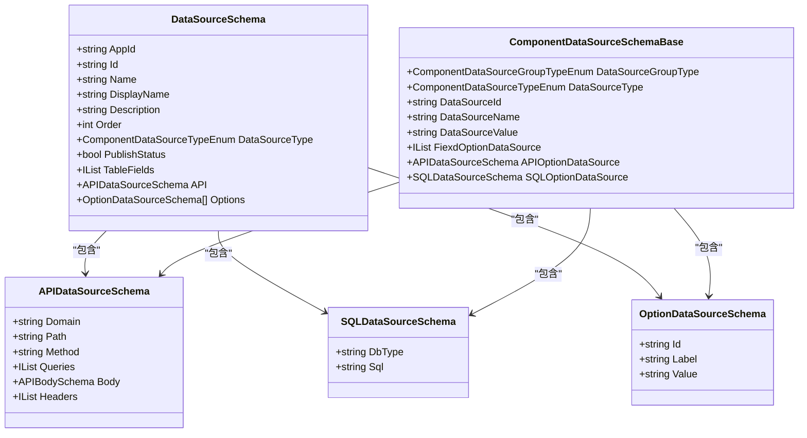
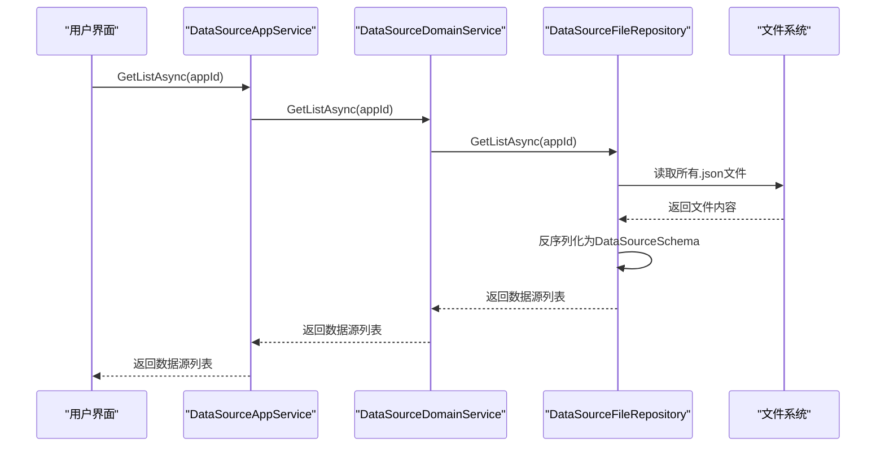
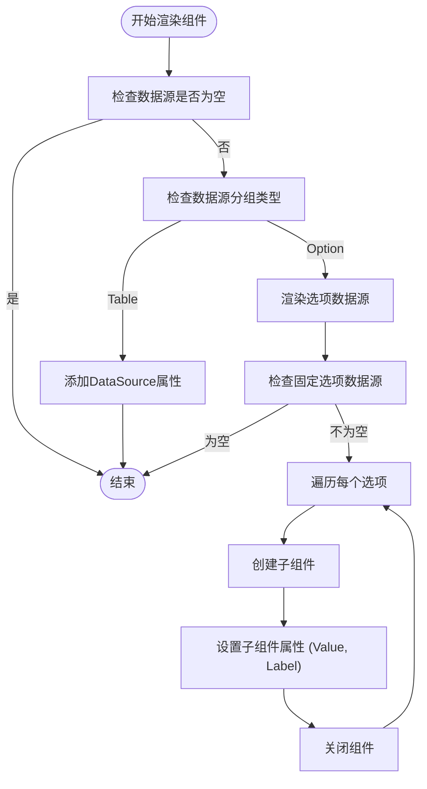

# 数据源（DataSource）

<cite>
**本文档中引用的文件**   
- [DataSourceSchema.cs](file://src\Common\H.LowCode.MetaSchema\DataSourceSchema.cs)
- [APIDataSourceSchema.cs](file://src\Common\H.LowCode.MetaSchema\DataSourceSchemas\APIDataSourceSchema.cs)
- [SQLDataSourceSchema.cs](file://src\Common\H.LowCode.MetaSchema\DataSourceSchemas\SQLDataSourceSchema.cs)
- [OptionDataSourceSchema.cs](file://src\Common\H.LowCode.MetaSchema\DataSourceSchemas\OptionDataSourceSchema.cs)
- [ComponentDataSourceSchema.cs](file://src\Common\H.LowCode.MetaSchema\DataSourceSchemas\ComponentDataSourceSchema.cs)
- [ComponentDataSourceTypeEnum.cs](file://src\Common\H.LowCode.MetaSchema\Enums\ComponentDataSourceTypeEnum.cs)
- [DataSourceFileRepository.cs](file://src\DesignEngine\H.LowCode.DesignEngine.Repository.JsonFile\Repositories\DataSourceFileRepository.cs)
- [DataSourceDomainService.cs](file://src\DesignEngine\H.LowCode.DesignEngine.Domain\MetaDomainServices\DataSourceDomainService.cs)
- [DataSourceAppService.cs](file://src\DesignEngine\H.LowCode.DesignEngine.Application\AppServices\DataSourceAppService.cs)
- [qgzhc7w3z.json](file://meta\apps\caseapp\datasource\qgzhc7w3z.json)
- [RenderEngineDynamicComponentBase.cs](file://src\RenderEngine\H.LowCode.RenderEngine.Abstraction\RenderEngineDynamicComponentBase.cs)
- [DesignEngineDynamicComponentBase.cs](file://src\DesignEngine\H.LowCode.DesignEngineBase\DesignEngineDynamicComponentBase.cs)
</cite>

## 目录
1. [引言](#引言)
2. [数据源核心设计](#数据源核心设计)
3. [数据源类型与配置](#数据源类型与配置)
4. [API数据源配置示例](#api数据源配置示例)
5. [异步获取与绑定机制](#异步获取与绑定机制)
6. [设计与渲染引擎策略](#设计与渲染引擎策略)

## 引言
数据源（DataSource）是低代码平台中实现数据连接与抽象的核心模块。它为前端组件提供统一的数据访问接口，支持多种数据来源，包括数据库、API接口和静态选项。本文档将深入解析数据源的设计原理、配置方式、运行时行为以及在设计和渲染引擎中的实现策略。

## 数据源核心设计

数据源的设计基于一个清晰的继承与组合结构，以`DataSourceSchema`基类为核心，通过属性和组合模式支持多种数据源类型。



**图示来源**
- [DataSourceSchema.cs](file://src\Common\H.LowCode.MetaSchema\DataSourceSchema.cs)
- [APIDataSourceSchema.cs](file://src\Common\H.LowCode.MetaSchema\DataSourceSchemas\APIDataSourceSchema.cs)
- [SQLDataSourceSchema.cs](file://src\Common\H.LowCode.MetaSchema\DataSourceSchemas\SQLDataSourceSchema.cs)
- [OptionDataSourceSchema.cs](file://src\Common\H.LowCode.MetaSchema\DataSourceSchemas\OptionDataSourceSchema.cs)
- [ComponentDataSourceSchema.cs](file://src\Common\H.LowCode.MetaSchema\DataSourceSchemas\ComponentDataSourceSchema.cs)

**本节来源**
- [DataSourceSchema.cs](file://src\Common\H.LowCode.MetaSchema\DataSourceSchema.cs)
- [ComponentDataSourceSchema.cs](file://src\Common\H.LowCode.MetaSchema\DataSourceSchemas\ComponentDataSourceSchema.cs)

## 数据源类型与配置

数据源通过`ComponentDataSourceTypeEnum`枚举定义了多种类型，每种类型对应不同的配置参数和使用场景。

### 数据源类型枚举
```csharp
public enum ComponentDataSourceTypeEnum
{
    None = 0,
    DB = 1,           // 数据库表
    API = 2,          // API接口
    Option = 3,       // 选项列表
    SQL = 6,          // 自定义SQL
    Expression = 7,   // 表达式
    Fiexd = 8         // 固定值
}
```

### 主要数据源类型详解

#### **API数据源 (API)**
用于连接外部HTTP API。其配置参数定义在`APIDataSourceSchema`类中：
- **Domain**: API的域名或基础URL
- **Path**: 请求路径
- **Method**: HTTP方法 (GET, POST等)
- **Queries**: URL查询参数列表
- **Headers**: HTTP请求头列表
- **Body**: 请求体，支持JSON、文本、Multipart等多种格式

#### **SQL数据源 (SQL)**
用于执行自定义SQL查询。其配置参数定义在`SQLDataSourceSchema`类中：
- **DbType**: 数据库类型 (如MySQL, PostgreSQL)
- **Sql**: 要执行的SQL语句

#### **选项数据源 (Option)**
用于提供下拉框、单选框等组件的选项列表。其配置参数定义在`OptionDataSourceSchema`记录中：
- **Label**: 选项显示文本
- **Value**: 选项实际值

**本节来源**
- [ComponentDataSourceTypeEnum.cs](file://src\Common\H.LowCode.MetaSchema\Enums\ComponentDataSourceTypeEnum.cs)
- [APIDataSourceSchema.cs](file://src\Common\H.LowCode.MetaSchema\DataSourceSchemas\APIDataSourceSchema.cs)
- [SQLDataSourceSchema.cs](file://src\Common\H.LowCode.MetaSchema\DataSourceSchemas\SQLDataSourceSchema.cs)
- [OptionDataSourceSchema.cs](file://src\Common\H.LowCode.MetaSchema\DataSourceSchemas\OptionDataSourceSchema.cs)

## API数据源配置示例

以`qgzhc7w3z.json`文件为例，该文件定义了一个数据库表数据源，其结构如下：

```json
{
  "aid": "caseapp",
  "id": "qgzhc7w3z",
  "n": "tb_test1",
  "disn": "测试表1",
  "desc": "xxx",
  "type": 1,
  "fields": [
    {
      "id": "9080f5b9-b155-4aa2-82d9-dc7a20192c06",
      "n": "f_id",
      "disn": "主键",
      "type": "varchar",
      "pk": true
    },
    {
      "id": "b4c09312-7267-45fc-94c1-15f893d0f5ea",
      "n": "f_field1",
      "disn": "字段1",
      "type": "varchar",
      "nul": true
    }
    // ... 其他字段
  ],
  "ops": [],
  "modifiedTime": "2025-03-23T10:17:51.3553924Z"
}
```

**关键配置说明**:
- **aid**: 所属应用ID (`caseapp`)
- **id**: 数据源唯一标识符 (`qgzhc7w3z`)
- **n**: 数据源名称 (`tb_test1`)
- **disn**: 显示名称 (`测试表1`)
- **type**: 数据源类型，值为`1`，对应`ComponentDataSourceTypeEnum.DB`，表示这是一个数据库表数据源
- **fields**: 字段列表，定义了表的结构，包括字段名(`n`)、显示名(`disn`)、数据类型(`type`)、是否为主键(`pk`)、是否可为空(`nul`)等属性
- **ops**: 选项列表，此数据源为空

**本节来源**
- [qgzhc7w3z.json](file://meta\apps\caseapp\datasource\qgzhc7w3z.json)
- [DataSourceSchema.cs](file://src\Common\H.LowCode.MetaSchema\DataSourceSchema.cs)

## 异步获取与绑定机制

数据源在应用运行时通过异步机制进行获取、绑定和刷新。

### **异步获取流程**
数据源的获取由`DataSourceFileRepository`实现，遵循典型的仓储模式：
1.  **应用服务层** (`DataSourceAppService`): 提供`GetListAsync`和`GetByIdAsync`等异步API。
2.  **领域服务层** (`DataSourceDomainService`): 作为中介，调用仓储层。
3.  **仓储层** (`DataSourceFileRepository`): 从文件系统异步读取JSON文件，并反序列化为`DataSourceSchema`对象。



**图示来源**
- [DataSourceAppService.cs](file://src\DesignEngine\H.LowCode.DesignEngine.Application\AppServices\DataSourceAppService.cs)
- [DataSourceDomainService.cs](file://src\DesignEngine\H.LowCode.DesignEngine.Domain\MetaDomainServices\DataSourceDomainService.cs)
- [DataSourceFileRepository.cs](file://src\DesignEngine\H.LowCode.DesignEngine.Repository.JsonFile\Repositories\DataSourceFileRepository.cs)

### **组件绑定与刷新**
在渲染引擎中，数据源通过`RenderEngineDynamicComponentBase`类绑定到组件上。
- **绑定**: 在组件的渲染树构建过程中，通过`builder.AddAttribute()`方法将数据源对象作为属性传递给组件。
- **刷新**: 当数据源内容更新时，组件会重新渲染，从而展示最新数据。

```csharp
// 伪代码示例：在组件中绑定数据源
if (dataSource.DataSourceGroupType == ComponentDataSourceGroupTypeEnum.Table)
{
    builder.AddAttribute(index++, "DataSource", component.DataSource);
}
```

**本节来源**
- [DataSourceFileRepository.cs](file://src\DesignEngine\H.LowCode.DesignEngine.Repository.JsonFile\Repositories\DataSourceFileRepository.cs)
- [DataSourceDomainService.cs](file://src\DesignEngine\H.LowCode.DesignEngine.Domain\MetaDomainServices\DataSourceDomainService.cs)
- [DataSourceAppService.cs](file://src\DesignEngine\H.LowCode.DesignEngine.Application\AppServices\DataSourceAppService.cs)
- [RenderEngineDynamicComponentBase.cs](file://src\RenderEngine\H.LowCode.RenderEngine.Abstraction\RenderEngineDynamicComponentBase.cs)

## 设计与渲染引擎策略

### **设计引擎：测试连接与错误处理**
在设计引擎中，虽然当前代码未实现完整的“测试连接”功能，但其架构已为此功能预留了空间。
- **错误处理**: 代码中使用了`ArgumentNullException`和`ArgumentException`等异常来处理无效输入，确保数据完整性。
- **未来扩展**: 可以在`DataSourceAppService`中添加`TestConnectionAsync`方法，该方法会根据数据源类型（API、SQL）发起实际的连接测试，并返回结果。

### **渲染引擎：缓存与安全调用**
在渲染引擎中，数据源的调用策略侧重于性能和安全。
- **缓存策略**: 当前实现直接从文件系统读取，未使用内存缓存。在生产环境中，可以引入内存缓存（如`IMemoryCache`）来存储频繁访问的数据源，减少I/O开销。
- **安全调用**: 代码通过以下方式确保安全：
    1.  **空值检查**: 在访问数据源或其属性前，会进行`null`检查，防止空引用异常。
    2.  **类型安全**: 使用`Type.GetType()`动态加载组件类型时，会进行空值检查并抛出明确的异常。
    3.  **参数验证**: 在保存数据源时，会验证`Id`等关键字段是否为空。



**图示来源**
- [RenderEngineDynamicComponentBase.cs](file://src\RenderEngine\H.LowCode.RenderEngine.Abstraction\RenderEngineDynamicComponentBase.cs)
- [DesignEngineDynamicComponentBase.cs](file://src\DesignEngine\H.LowCode.DesignEngineBase\DesignEngineDynamicComponentBase.cs)

**本节来源**
- [DataSourceFileRepository.cs](file://src\DesignEngine\H.LowCode.DesignEngine.Repository.JsonFile\Repositories\DataSourceFileRepository.cs)
- [RenderEngineDynamicComponentBase.cs](file://src\RenderEngine\H.LowCode.RenderEngine.Abstraction\RenderEngineDynamicComponentBase.cs)
- [DesignEngineDynamicComponentBase.cs](file://src\DesignEngine\H.LowCode.DesignEngineBase\DesignEngineDynamicComponentBase.cs)