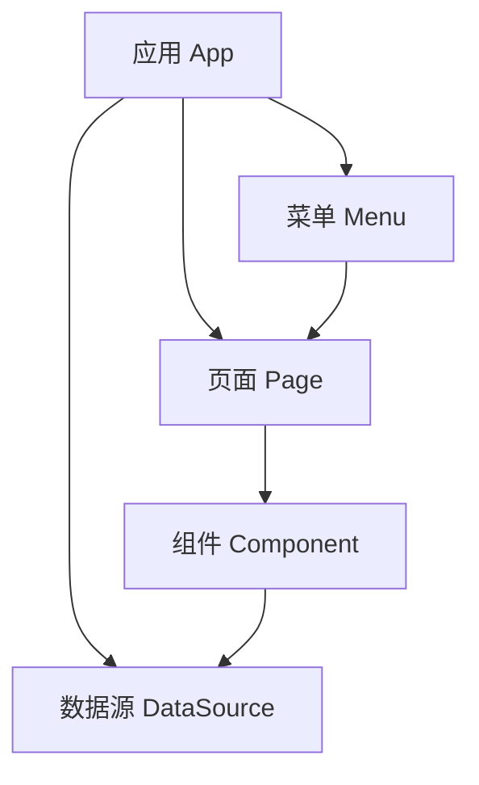

# 核心概念

<cite>
**本文档引用文件**  
- [caseapp.json](file://meta/apps/caseapp/caseapp.json)
- [AppSchemaBase.cs](file://src/Common/H.LowCode.MetaSchema/AppSchemaBase.cs)
- [PageSchemaBase.cs](file://src/Common/H.LowCode.MetaSchema/PageSchemaBase.cs)
- [ComponentSchemaBase.cs](file://src/Common/H.LowCode.MetaSchema/ComponentSchemaBase.cs)
- [DataSourceSchema.cs](file://src/Common/H.LowCode.MetaSchema/DataSourceSchema.cs)
- [MenuSchema.cs](file://src/Common/H.LowCode.MetaSchema/MenuSchema.cs)
- [0lgu6xpop.json](file://meta/apps/caseapp/page/0lgu6xpop.json)
</cite>

## 目录
1. [元数据（Meta）](#元数据meta)
2. [应用（App）](#应用app)
3. [页面（Page）](#页面page)
4. [组件（Component）](#组件component)
5. [数据源（DataSource）](#数据源datasource)
6. [菜单（Menu）](#菜单menu)
7. [核心概念协同机制](#核心概念协同机制)

## 元数据（Meta）

元数据是低代码平台的核心驱动机制，系统通过结构化的JSON配置文件定义应用的全部行为与界面，实现无代码配置化开发。所有功能模块（如应用、页面、组件等）均通过元数据进行描述和实例化，平台运行时解析这些元数据并动态渲染UI与逻辑。

元数据以分层结构组织，存储于`meta`目录下，按应用划分。每个元数据文件对应一个实体（如应用、页面、数据源等），通过唯一ID进行关联。

## 应用（App）

应用是低代码系统的顶层容器，代表一个独立的业务系统或功能模块。它包含多个页面、菜单、数据源等资源，并定义其全局属性。

### 应用元数据结构

应用的元数据模型由`AppSchemaBase`类定义，继承自`MetaSchemaBase`，其核心属性如下：

```csharp
public abstract class AppSchemaBase : MetaSchemaBase
{
    public string Id { get; set; }
    [JsonPropertyName("n")]
    public string Name { get; set; }
    public string Icon { get; set; }
    [JsonPropertyName("pic")]
    public string Picture { get; set; }
    [JsonPropertyName("desc")]
    public string Description { get; set; }
    [JsonPropertyName("v")]
    public string Version { get; set; }
    [JsonPropertyName("pub")]
    public PublishStatusEnum PublishStatus { get; set; }
    [JsonPropertyName("platform")]
    public SupportPlatformEnum[] SupportPlatforms { get; set; } = [0];
}
```

### 应用实例：用例系统

以`caseapp.json`为例，其内容如下：

```json
{
  "id": "caseapp",
  "n": "用例系统",
  "desc": "展示典型页面案例 (参考 amis 示例)",
  "platform": [0, 2],
  "mt": "2025-05-29T16:49:31.1628431Z"
}
```

- **id**: `caseapp`，应用唯一标识符。
- **n**: `用例系统`，应用名称。
- **desc**: 应用描述，说明其用途。
- **platform**: 支持平台，`[0, 2]`表示支持Web和移动端。
- **mt**: 最后修改时间。

**Section sources**
- [caseapp.json](file://meta/apps/caseapp/caseapp.json#L1-L5)
- [AppSchemaBase.cs](file://src/Common/H.LowCode.MetaSchema/AppSchemaBase.cs#L1-L29)

## 页面（Page）

页面是用户界面的基本单元，代表一个可访问的视图或功能界面。一个应用可包含多个页面，支持多种类型，如表单、列表、报表、仪表盘等。

### 页面元数据结构

页面的元数据模型由`PageSchemaBase`类定义：

```csharp
public abstract class PageSchemaBase : MetaSchemaBase
{
    [JsonPropertyName("aid")]
    public string AppId { get; set; }
    [JsonPropertyName("id")]
    public string Id { get; set; }
    [JsonPropertyName("n")]
    public string Name { get; set; }
    [JsonPropertyName("order")]
    public int Order { get; set; }
    [JsonPropertyName("pt")]
    public PageTypeEnum PageType { get; set; }
    [JsonPropertyName("pub")]
    public int PublishStatus { get; set; }
    [JsonPropertyName("pageprop")]
    public PagePropertySchema PageProperty { get; set; }
    [JsonPropertyName("ds")]
    public PageDataSourceSchema DataSource { get; set; }
    [JsonPropertyName("evs")]
    public IList<EventSchema> Events { get; set; }
}
```

### 页面实例：地图页面

以`0lgu6xpop.json`为例：

```json
{
  "aid": "caseapp",
  "id": "0lgu6xpop",
  "n": "地图",
  "order": 82,
  "pt": 0,
  "pub": 0,
  "comps": [],
  "pageprop": { "playout": 2 },
  "ds": {
    "type": 0,
    "fields": [],
    "options": [],
    "createdTime": "0001-01-01T00:00:00",
    "modifiedTime": "0001-01-01T00:00:00"
  },
  "i18n": {},
  "createdTime": "0001-01-01T00:00:00",
  "modifiedTime": "2024-09-12T13:28:30.4945123Z"
}
```

- **aid**: 所属应用ID，`caseapp`。
- **id**: 页面唯一ID，`0lgu6xpop`。
- **n**: 页面名称，`地图`。
- **order**: 排序序号，用于菜单排序。
- **pt**: 页面类型，`0`表示普通页面。
- **pub**: 发布状态，`0`表示未发布。
- **pageprop**: 页面属性，`playout: 2`可能表示布局类型。
- **ds**: 页面级数据源配置。

**Section sources**
- [0lgu6xpop.json](file://meta/apps/caseapp/page/0lgu6xpop.json#L1-L1)
- [PageSchemaBase.cs](file://src/Common/H.LowCode.MetaSchema/PageSchemaBase.cs#L1-L40)

## 组件（Component）

组件是可复用的UI元素，如按钮、输入框、表格、图表等。它们是构建页面的基本“积木”，支持属性、样式和事件的可视化配置。

### 组件元数据结构

组件的元数据模型由`ComponentSchemaBase`类定义：

```csharp
public abstract class ComponentSchemaBase : StateHasChangeSchema
{
    [JsonPropertyName("id")]
    public string Id { get; set; }
    [JsonPropertyName("pid")]
    public string ParentId { get; set; }
    [JsonPropertyName("n")]
    public string Name { get; set; }
    [JsonPropertyName("lb")]
    public string Label { get; set; }
    [JsonPropertyName("hlb")]
    public bool IsHiddenLabel { get; set; }
    [JsonPropertyName("container")]
    public bool IsContainer { get; set; }
    [JsonPropertyName("sptds")]
    public bool IsSupportDataSource { get; set; }
    [JsonPropertyName("stl")]
    public ComponentStyleSchema Style { get; set; }
    [JsonPropertyName("evs")]
    public IList<EventSchema> Events { get; set; }
    [JsonPropertyName("evcs")]
    public IList<EventConsumeSchema> EventConsumes { get; set; }
    [JsonPropertyName("desc")]
    public string Description { get; set; }
}
```

关键属性说明：
- **Id/ParentId**: 构建组件树结构。
- **IsContainer**: 标识是否为容器组件（可包含子组件）。
- **Style**: 组件样式配置。
- **Events**: 组件事件（如点击、变更）的定义。
- **EventConsumes**: 事件消费配置，用于跨组件通信。

**Section sources**
- [ComponentSchemaBase.cs](file://src/Common/H.LowCode.MetaSchema/ComponentSchemaBase.cs#L1-L78)

## 数据源（DataSource）

数据源是系统与数据连接的抽象层，用于定义页面或组件所需的数据来源。支持多种类型，实现数据与界面的解耦。

### 数据源元数据结构

数据源的元数据模型由`DataSourceSchema`类定义：

```csharp
public class DataSourceSchema : MetaSchemaBase
{
    [JsonPropertyName("aid")]
    public string AppId { get; set; }
    public string Id { get; set; }
    [JsonPropertyName("n")]
    public string Name { get; set; }
    [JsonPropertyName("disn")]
    public string DisplayName { get; set; }
    [JsonPropertyName("type")]
    public ComponentDataSourceTypeEnum DataSourceType { get; set; }
    
    #region DataSourceType=Table
    [JsonPropertyName("fields")]
    public IList<TableFieldSchema> TableFields { get; set; }
    #endregion

    #region DataSourceType=API
    [JsonPropertyName("api")]
    public APIDataSourceSchema API { get; set; }
    #endregion

    #region DataSourceType=Option
    [JsonPropertyName("ops")]
    public OptionDataSourceSchema[] Options { get; set; }
    [JsonPropertyName("vals")]
    public IDictionary<string, string> Values { get; set; }
    #endregion
}
```

支持的数据源类型包括：
- **Table**: 数据库表结构，通过`TableFields`定义字段。
- **API**: 外部API接口，通过`API`对象配置请求方式、URL、参数等。
- **Option**: 静态选项或字典数据，用于下拉框等组件，通过`Options`或`Values`定义键值对。

**Section sources**
- [DataSourceSchema.cs](file://src/Common/H.LowCode.MetaSchema/DataSourceSchema.cs#L1-L70)

## 菜单（Menu）

菜单是系统的导航结构，组织应用内的页面访问路径，支持多级树形结构。

### 菜单元数据结构

菜单的元数据模型由`MenuSchema`类定义：

```csharp
public class MenuSchema : MetaSchemaBase
{
    [JsonPropertyName("aid")]
    public string AppId { get; set; }
    public string Id { get; set; }
    [JsonPropertyName("pid")]
    public string ParentId { get; set; }
    [JsonPropertyName("t")]
    public string Title { get; set; }
    [JsonPropertyName("type")]
    public int MenuType { get; set; } // 0-菜单 1-目录
    public string Icon { get; set; }
    [JsonPropertyName("path")]
    public string MenuUrl { get; set; }
    public int Order { get; set; }
    [JsonPropertyName("childs")]
    public IList<MenuSchema> Childrens { get; set; }
}
```

- **MenuType**: 区分菜单项（链接到页面）和目录（仅作为分组容器）。
- **MenuUrl**: 菜单对应的页面路由。
- **Childrens**: 子菜单列表，实现树形结构。

**Section sources**
- [MenuSchema.cs](file://src/Common/H.LowCode.MetaSchema/MenuSchema.cs#L1-L39)

## 核心概念协同机制

低代码平台的各个核心概念通过元数据协同工作，形成一个完整的无代码开发体系：

1. **应用（App）** 作为顶层容器，定义了系统的全局信息。
2. **菜单（Menu）** 基于应用构建导航结构，将用户引导至特定**页面（Page）**。
3. **页面（Page）** 作为UI容器，通过`comps`数组引用多个**组件（Component）**，构建用户界面。
4. **组件（Component）** 通过配置**数据源（DataSource）** 获取数据，实现动态内容展示。
5. 所有实体的元数据均以JSON文件形式存储，由平台统一加载、解析和渲染。

这种基于元数据的架构实现了：
- **配置化开发**：无需编写代码，通过修改JSON即可改变系统行为。
- **高可维护性**：所有配置集中管理，易于版本控制和迁移。
- **动态性**：运行时可动态加载不同应用的元数据，实现插件化。



**Diagram sources**
- [AppSchemaBase.cs](file://src/Common/H.LowCode.MetaSchema/AppSchemaBase.cs#L1-L29)
- [MenuSchema.cs](file://src/Common/H.LowCode.MetaSchema/MenuSchema.cs#L1-L39)
- [PageSchemaBase.cs](file://src/Common/H.LowCode.MetaSchema/PageSchemaBase.cs#L1-L40)
- [ComponentSchemaBase.cs](file://src/Common/H.LowCode.MetaSchema/ComponentSchemaBase.cs#L1-L78)
- [DataSourceSchema.cs](file://src/Common/H.LowCode.MetaSchema/DataSourceSchema.cs#L1-L70)