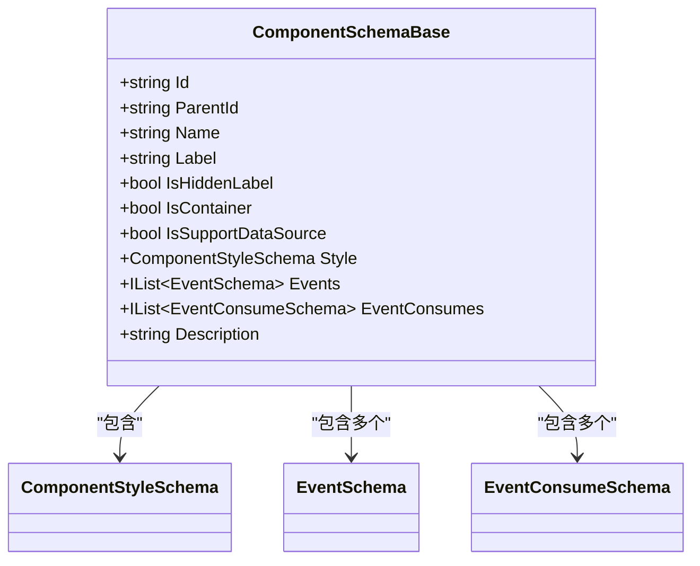
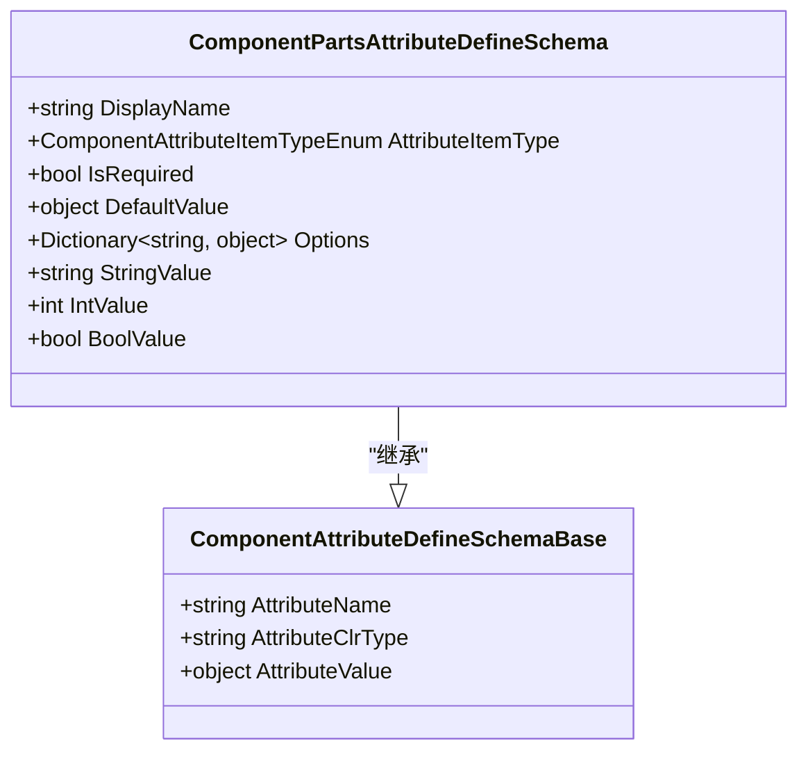
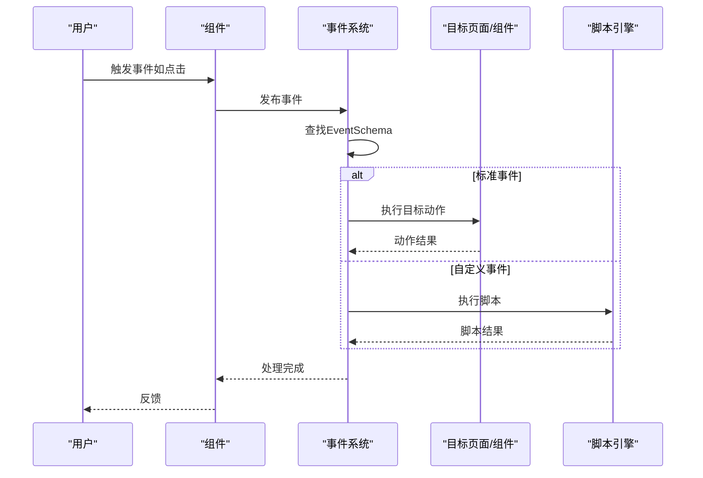
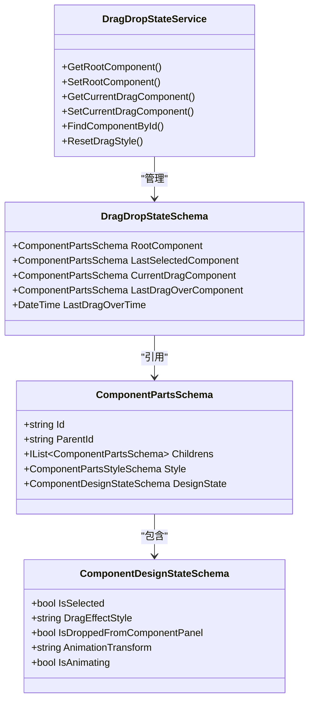
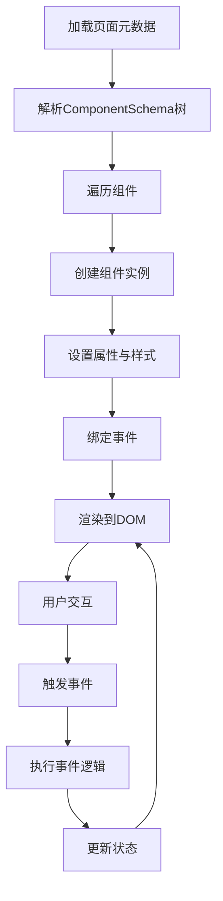

# 组件（Component）

<cite>
**本文档引用的文件**  
- [ComponentSchemaBase.cs](file://src\Common\H.LowCode.MetaSchema\ComponentSchemaBase.cs)
- [ComponentAttributeDefineSchemaBase.cs](file://src\Common\H.LowCode.MetaSchema\PropertySchemas\ComponentAttributeDefineSchemaBase.cs)
- [ComponentStyleSchema.cs](file://src\Common\H.LowCode.MetaSchema\PropertySchemas\ComponentStyleSchema.cs)
- [EventSchema.cs](file://src\Common\H.LowCode.MetaSchema\PropertySchemas\EventSchema.cs)
- [EventTargetTypeEnum.cs](file://src\Common\H.LowCode.MetaSchema\Enums\EventTargetTypeEnum.cs)
- [52391a70.json](file://meta\parts\componentParts\antdesign\52391a70.json)
- [DragDropStateService.cs](file://src\DesignEngine\H.LowCode.DesignEngineBase\Services\DragDropStateService.cs)
- [ComponentPartsAttributeDefineSchema.cs](file://src\Common\H.LowCode.MetaSchema.DesignEngine\PropertySchemas\ComponentPartsAttributeDefineSchema.cs)
- [ComponentPartsStyleSchema.cs](file://src\Common\H.LowCode.MetaSchema.DesignEngine\PropertySchemas\ComponentPartsStyleSchema.cs)
- [ComponentDesignStateSchema.cs](file://src\Common\H.LowCode.MetaSchema.DesignEngine\PropertySchemas\ComponentDesignStateSchema.cs)
- [ComponentPartsSchema.cs](file://src\Common\H.LowCode.MetaSchema.DesignEngine\ComponentPartsSchema.cs)
</cite>

## 目录
1. [组件系统概述](#组件系统概述)  
2. [组件基础结构](#组件基础结构)  
3. [属性与样式配置模型](#属性与样式配置模型)  
4. [事件绑定与触发机制](#事件绑定与触发机制)  
5. [实际配置示例分析](#实际配置示例分析)  
6. [设计时拖拽行为](#设计时拖拽行为)  
7. [运行时渲染流程](#运行时渲染流程)  
8. [总结](#总结)

## 组件系统概述

本系统中的“组件”是低代码平台中可复用的UI元素，其设计遵循模块化、可配置和可扩展的原则。组件在设计时通过元数据定义其结构、属性、样式和事件，在运行时根据配置动态渲染。系统通过分层架构将设计时与运行时逻辑分离，确保灵活性与性能。

组件的核心实现基于 `ComponentSchemaBase` 类，并通过设计时专用的 `ComponentPartsSchema` 扩展支持拖拽、选中状态等交互功能。属性、样式和事件均采用独立的模式进行管理，便于动态配置与持久化。

**组件系统的关键特性包括：**
- 基于ID的唯一标识与父子层级结构
- 支持容器与非容器组件的区分
- 动态属性与样式配置
- 事件绑定支持标准动作与自定义脚本
- 设计时拖拽状态管理
- 元数据驱动的渲染机制

## 组件基础结构

所有组件均继承自 `ComponentSchemaBase` 类，该类定义了组件的通用结构，包括ID、类型、属性、样式和事件等核心字段。

```csharp
public abstract class ComponentSchemaBase : StateHasChangeSchema
{
    [JsonPropertyName("id")]
    public string Id { get; set; } = ShortIdGenerator.Generate();

    [JsonPropertyName("pid")]
    public string ParentId { get; set; }

    [JsonPropertyName("n")]
    public string Name { get; set; }

    [JsonPropertyName("lb")]
    public string Label { get; set; }

    [JsonPropertyName("hlb")]
    public bool IsHiddenLabel { get; set; }

    [JsonPropertyName("container")]
    public bool IsContainer { get; set; }

    [JsonPropertyName("sptds")]
    public bool IsSupportDataSource { get; set; }

    [JsonPropertyName("stl")]
    public ComponentStyleSchema Style { get; set; } = new();

    [JsonPropertyName("evs")]
    public IList<EventSchema> Events { get; set; }

    [JsonPropertyName("evcs")]
    public IList<EventConsumeSchema> EventConsumes { get; set; }

    [JsonPropertyName("desc")]
    public string Description { get; set; }
}
```

### 核心字段说明

:Id: 组件实例的唯一标识符，使用短ID生成器生成。  
:ParentId: 父组件ID，用于构建组件树结构。  
:Name: 组件名称，通常对应框架中的组件类型（如 `Input`）。  
:Label: 显示标签，用于在设计器中标识组件。  
:IsContainer: 是否为容器组件，容器可包含子组件。  
:IsSupportDataSource: 是否支持数据源绑定，容器组件默认不支持。  
:Style: 组件样式配置，类型为 `ComponentStyleSchema`。  
:Events: 事件列表，包含绑定的事件及其处理逻辑。  
:EventConsumes: 事件消费列表，用于声明组件可触发的事件。  
:Description: 组件描述信息。

**组件基础结构类图**



**图示来源**  
- [ComponentSchemaBase.cs](file://src\Common\H.LowCode.MetaSchema\ComponentSchemaBase.cs)

**本节来源**  
- [ComponentSchemaBase.cs](file://src\Common\H.LowCode.MetaSchema\ComponentSchemaBase.cs)

## 属性与样式配置模型

组件的属性与样式采用独立的配置模型，支持动态定义与运行时修改。

### 属性定义模型

组件属性由 `ComponentAttributeDefineSchemaBase` 定义，其设计时实现为 `ComponentPartsAttributeDefineSchema`。

```csharp
public abstract class ComponentAttributeDefineSchemaBase
{
    [JsonPropertyName("attrn")]
    public string AttributeName { get; set; }

    [JsonPropertyName("attrt")]
    public string AttributeClrType { get; set; }

    [JsonPropertyName("attrv")]
    public object AttributeValue { get; set; }
}
```

设计时扩展类 `ComponentPartsAttributeDefineSchema` 增加了显示名称、类型、是否必填、默认值等元信息：

:DisplayName: 属性在设计器中的显示名称。  
:AttributeItemType: 属性类型，决定设计器中渲染的控件类型（如开关、输入框等）。  
:IsRequired: 是否为必填项。  
:DefaultValue: 默认值。  
:Options: 可选项，用于下拉框等控件。  
:StringValue/IntValue/BoolValue: 提供类型安全的访问器。

**属性配置类图**



**图示来源**  
- [ComponentAttributeDefineSchemaBase.cs](file://src\Common\H.LowCode.MetaSchema\PropertySchemas\ComponentAttributeDefineSchemaBase.cs)
- [ComponentPartsAttributeDefineSchema.cs](file://src\Common\H.LowCode.MetaSchema.DesignEngine\PropertySchemas\ComponentPartsAttributeDefineSchema.cs)

### 样式配置模型

组件样式由 `ComponentStyleSchema` 定义，包含布局与外观相关属性：

:ItemWidth: 组件宽度（4-24栅格系统）。  
:ItemHeight: 组件高度（像素）。  
:LabelWidth: 标签宽度（像素）。  
:DefaultStyle: 默认CSS样式。  
:CustomStyle: 自定义CSS样式。

设计时使用 `ComponentPartsStyleSchema`，字段基本一致，部分字段为可空类型以支持继承。

```csharp
public class ComponentPartsStyleSchema
{
    public double? ItemWidth { get; set; }
    public double ItemHeight { get; set; } = 85;
    public double LabelWidth { get; set; } = 180;
    public string Display { get; set; } = "inline";
    public string Position { get; set; } = "static";
    public string DefaultStyle { get; set; }
    public string CustomStyle { get; set; }
}
```

**本节来源**  
- [ComponentAttributeDefineSchemaBase.cs](file://src\Common\H.LowCode.MetaSchema\PropertySchemas\ComponentAttributeDefineSchemaBase.cs)
- [ComponentPartsAttributeDefineSchema.cs](file://src\Common\H.LowCode.MetaSchema.DesignEngine\PropertySchemas\ComponentPartsAttributeDefineSchema.cs)
- [ComponentStyleSchema.cs](file://src\Common\H.LowCode.MetaSchema\PropertySchemas\ComponentStyleSchema.cs)
- [ComponentPartsStyleSchema.cs](file://src\Common\H.LowCode.MetaSchema.DesignEngine\PropertySchemas\ComponentPartsStyleSchema.cs)

## 事件绑定与触发机制

组件事件通过 `EventSchema` 类进行定义，支持标准事件与自定义脚本两种处理方式。

```csharp
public class EventSchema
{
    [JsonPropertyName("en")]
    public string EventName { get; set; }

    [JsonPropertyName("eht")]
    public EventTargetTypeEnum EventHandlerType { get; set; }

    // 标准事件
    [JsonPropertyName("etid")]
    public string EventTargetId { get; set; }

    [JsonPropertyName("eta")]
    public string EventTargetAction { get; set; }

    // 自定义事件
    [JsonPropertyName("ecl")]
    public EventCustomLanguageEnum EventCustomLanguage { get; set; }

    [JsonPropertyName("ecs")]
    public string EventCustomScript { get; set; }

    public IDictionary<string, string> EventArgs { get; set; }
}
```

### 事件类型枚举

`EventTargetTypeEnum` 定义了事件的处理目标类型：

:None: 无处理。  
:Page: 页面级操作（如跳转、刷新）。  
:Component: 组件级操作（如触发组件方法）。  
:Custom: 执行自定义脚本。

`EventCustomLanguageEnum` 支持多种脚本语言：

:JavaScript: JavaScript脚本。  
:Python: Python脚本。  
:CSharp: C#脚本。

### 事件处理流程

1. 用户在UI上触发事件（如点击按钮）。
2. 系统查找该组件绑定的 `EventSchema`。
3. 根据 `EventHandlerType` 分支处理：
   - 若为 `Page` 或 `Component`，执行预定义动作。
   - 若为 `Custom`，执行 `EventCustomScript` 中的脚本。
4. 传递 `EventArgs` 作为参数。

**事件机制序列图**



**图示来源**  
- [EventSchema.cs](file://src\Common\H.LowCode.MetaSchema\PropertySchemas\EventSchema.cs)
- [EventTargetTypeEnum.cs](file://src\Common\H.LowCode.MetaSchema\Enums\EventTargetTypeEnum.cs)

**本节来源**  
- [EventSchema.cs](file://src\Common\H.LowCode.MetaSchema\PropertySchemas\EventSchema.cs)
- [EventTargetTypeEnum.cs](file://src\Common\H.LowCode.MetaSchema\Enums\EventTargetTypeEnum.cs)

## 实际配置示例分析

以 `antdesign` 组件库中的输入框组件为例，其元数据文件 `52391a70.json` 定义了该组件的完整配置。

```json
{
    "cn": "Input",
    "ct": 1,
    "frag": {
        "dt": "AntDesign.Input`1[System.String], AntDesign",
        "valt": "System.String",
        "attrs": [
            {
                "attrn": "TValue",
                "attrt": "System.String"
            }
        ]
    },
    "attrdefgroups": [
        {
            "gn": "基础属性",
            "attrdefs": [
                {
                    "disn": "是否禁用",
                    "pt": 6,
                    "desc": "",
                    "dftval": false,
                    "attrn": "Disabled",
                    "attrt": "System.Boolean",
                    "attrv": false
                },
                {
                    "pt": 2,
                    "disn": "最大长度",
                    "desc": "字段输入的最大长度,为0时表示不限制长度",
                    "dftval": 0,
                    "attrn": "MaxLength",
                    "attrt": "System.Int32",
                    "attrv": 0
                },
                {
                    "pt": 1,
                    "disn": "输入提示",
                    "desc": "组件输入时的 Placeholder 提示",
                    "dftval": "",
                    "attrn": "Placeholder",
                    "attrt": "System.String",
                    "attrv": ""
                }
            ]
        }
    ],
    "childs": [],
    "sptds": false,
    "order": 10,
    "pub": 1,
    "mt": "2025-02-24T15:36:15.8037414Z",
    "id": "cj8ac3m42",
    "libid": "antdesign",
    "partsId": "52391a70",
    "lb": "输入框-A",
    "container": false,
    "stl": {
        "itemh": 85,
        "labelw": 180,
        "display": "inline",
        "pos": "static"
    }
}
```

### 配置解析

:cn: 组件类名，对应 `AntDesign.Input`。  
:frag: 组件片段信息，包含泛型类型与值类型。  
:attrdefgroups: 属性定义分组，此处为“基础属性”，包含禁用、最大长度、提示文本三个可配置项。  
:stl: 默认样式配置。  
:container: 非容器组件，不可嵌套子组件。

该配置表明，设计器在拖拽此组件时，将生成一个 `Input` 组件实例，并提供三个可配置属性。

**本节来源**  
- [52391a70.json](file://meta\parts\componentParts\antdesign\52391a70.json)

## 设计时拖拽行为

在设计时，组件的拖拽行为由 `DragDropStateService` 服务管理，该服务维护了当前页面的拖拽状态。

### 核心状态管理

`DragDropStateService` 使用字典存储每个页面的 `DragDropStateSchema`，键为 `appId-pageId`。

```csharp
private IDictionary<string, DragDropStateSchema> schemaStates = new Dictionary<string, DragDropStateSchema>();
```

`DragDropStateSchema` 包含以下关键字段：

:RootComponent: 页面根组件，构成组件树。  
:LastSelectedComponent: 最后选中的组件。  
:CurrentDragComponent: 当前正在拖拽的组件。  
:LastDragOverComponent: 最后一次悬停的组件。  
:LastDragOverTime: 悬停时间。

### 拖拽流程

1. 从组件面板拖拽组件时，创建新组件实例并设置为 `CurrentDragComponent`。
2. 拖拽过程中，实时更新悬停组件（`LastDragOverComponent`）。
3. 释放时，将组件插入到目标容器的 `Childrens` 列表中。
4. 更新 `RootComponent` 并触发界面刷新。

### 设计状态

`ComponentDesignStateSchema` 用于记录组件在设计器中的临时状态：

:IsSelected: 是否被选中。  
:DragEffectStyle: 拖拽悬停时的视觉效果。  
:IsDroppedFromComponentPanel: 是否为新拖入的组件。  
:AnimationTransform: 动画变换样式（用于平滑让位）。  
:IsAnimating: 是否正在执行动画。

这些状态不持久化，仅用于提升设计器交互体验。

**拖拽状态服务类图**



**图示来源**  
- [DragDropStateService.cs](file://src\DesignEngine\H.LowCode.DesignEngineBase\Services\DragDropStateService.cs)
- [ComponentDesignStateSchema.cs](file://src\Common\H.LowCode.MetaSchema.DesignEngine\PropertySchemas\ComponentDesignStateSchema.cs)
- [ComponentPartsSchema.cs](file://src\Common\H.LowCode.MetaSchema.DesignEngine\ComponentPartsSchema.cs)

**本节来源**  
- [DragDropStateService.cs](file://src\DesignEngine\H.LowCode.DesignEngineBase\Services\DragDropStateService.cs)
- [ComponentDesignStateSchema.cs](file://src\Common\H.LowCode.MetaSchema.DesignEngine\PropertySchemas\ComponentDesignStateSchema.cs)

## 运行时渲染流程

在运行时，系统根据 `ComponentSchema` 结构动态生成UI。

### 渲染流程

1. 加载页面元数据，解析 `ComponentSchema` 树。
2. 遍历组件树，为每个组件创建对应的Blazor组件实例。
3. 根据 `Style` 应用布局与样式。
4. 根据 `Events` 绑定事件处理程序。
5. 将组件挂载到DOM中并渲染。

### 组件实例化

系统通过反射或工厂模式，根据 `Name` 字段查找对应的组件类型，并传入 `AttributeValue` 进行初始化。

例如，`Name: "Input"` 将实例化 `AntDesign.Input` 组件，并设置 `Placeholder`、`MaxLength` 等属性。

### 数据流



**本节来源**  
- [ComponentSchemaBase.cs](file://src\Common\H.LowCode.MetaSchema\ComponentSchemaBase.cs)
- [ComponentPartsSchema.cs](file://src\Common\H.LowCode.MetaSchema.DesignEngine\ComponentPartsSchema.cs)

## 总结

本文系统性地解析了低代码平台中“组件”的实现机制。组件作为可复用的UI元素，其核心由 `ComponentSchemaBase` 定义，包含ID、类型、属性、样式和事件等通用结构。属性与样式通过独立的模式进行动态配置，支持灵活的UI定制。事件系统支持标准动作与自定义脚本，增强了交互能力。

在设计时，`DragDropStateService` 服务管理组件的拖拽、选中等交互状态，提升设计器用户体验。在运行时，系统根据元数据配置动态渲染组件树，实现高效、可扩展的UI生成。

该架构实现了设计时与运行时的分离，既保证了开发灵活性，又确保了运行时性能，是低代码平台的核心基础。