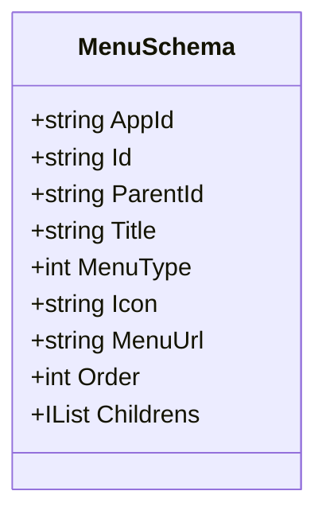
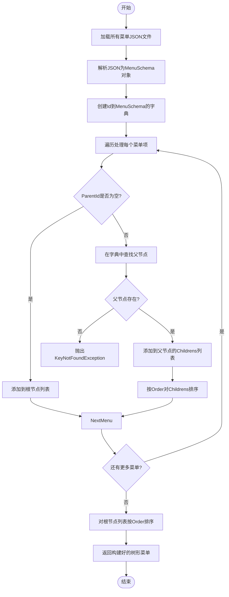
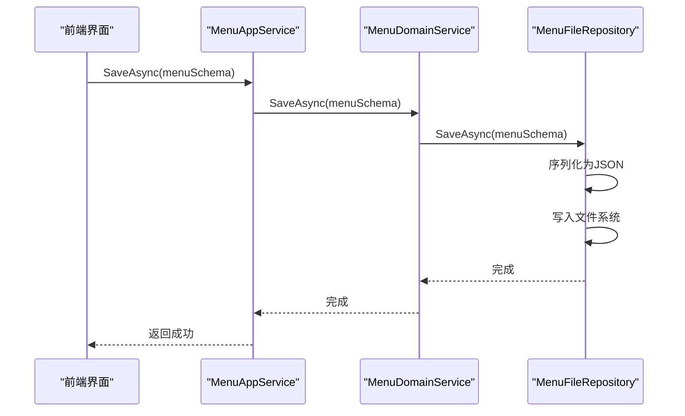

# 菜单（Menu）

<cite>
**本文档中引用的文件**   
- [MenuSchema.cs](file://src\Common\H.LowCode.MetaSchema\MenuSchema.cs)
- [5omcgxevf.json](file://meta\apps\caseapp\menu\5omcgxevf.json)
- [MenuAppService.cs](file://src\DesignEngine\H.LowCode.DesignEngine.Application\AppServices\MenuAppService.cs)
- [MenuDomainService.cs](file://src\DesignEngine\H.LowCode.DesignEngine.Domain\MetaDomainServices\MenuDomainService.cs)
- [MenuFileRepository.cs](file://src\DesignEngine\H.LowCode.DesignEngine.Repository.JsonFile\Repositories\MenuFileRepository.cs)
- [ThemePartLayoutBase.cs](file://src\RenderEngine\H.LowCode.RenderEngine.Abstraction\ThemePartLayoutBase.cs)
</cite>

## 目录
1. [菜单数据结构与属性](#菜单数据结构与属性)
2. [菜单项父子关系与排序逻辑](#菜单项父子关系与排序逻辑)
3. [设计引擎中的可视化编辑流程](#设计引擎中的可视化编辑流程)
4. [渲染引擎中的动态生成与高亮匹配](#渲染引擎中的动态生成与高亮匹配)
5. [多语言支持机制](#多语言支持机制)
6. [权限过滤实现](#权限过滤实现)

## 菜单数据结构与属性

菜单功能的核心数据结构由 `MenuSchema` 类定义，该类继承自 `MetaSchemaBase`，用于描述菜单项的组织方式和行为特性。每个菜单项包含以下关键属性：

- **AppId (aid)**: 关联的应用ID，标识菜单所属的应用。
- **Id**: 菜单项的唯一标识符，使用 `ShortIdGenerator.Generate()` 自动生成。
- **ParentId (pid)**: 父菜单项的ID，用于构建层级结构；若为空，则为根节点。
- **Title (t)**: 菜单项的显示标题。
- **MenuType (type)**: 菜单类型，0 表示菜单项，1 表示目录（容器）。
- **Icon**: 图标名称，用于前端展示。
- **MenuUrl (path)**: 菜单项对应的路由地址，通常指向一个页面ID。
- **Order**: 排序序号，决定同级菜单项的显示顺序。
- **Childrens (childs)**: 子菜单项列表，类型为 `IList<MenuSchema>`，初始为空列表。



**图示来源**
- [MenuSchema.cs](file://src\Common\H.LowCode.MetaSchema\MenuSchema.cs#L5-L37)

**本节来源**
- [MenuSchema.cs](file://src\Common\H.LowCode.MetaSchema\MenuSchema.cs#L5-L37)

## 菜单项父子关系与排序逻辑

菜单项通过 `ParentId` 和 `Childrens` 属性形成树形结构。系统在加载所有菜单项后，通过 `BuildTreeMenus` 方法将其构建成具有父子关系的树。

以 `5omcgxevf.json` 文件为例，其内容如下：
```json
{
    "aid": "caseapp",
    "id": "5omcgxevf",
    "pid": "i7ftaaue",
    "t": "多标签页表单",
    "type": 0,
    "icon": "home",
    "path": "gndz2vecz",
    "order": 5,
    "childs": []
}
```
此菜单项的 `pid` 为 `i7ftaaue`，表明它是ID为 `i7ftaaue` 的菜单项的子节点。`order` 值为 5，表示其在同级菜单中的排序位置。

`BuildTreeMenus` 方法的逻辑如下：
1. 遍历所有菜单项，建立一个以 `Id` 为键的字典 `menuDic`。
2. 再次遍历菜单项，如果 `ParentId` 为空，则将其加入根节点列表 `treeMenus`；否则，根据 `ParentId` 在 `menuDic` 中查找父节点，并将当前节点添加到父节点的 `Childrens` 列表中。
3. 对每个父节点的 `Childrens` 列表按 `Order` 排序。
4. 最后对根节点列表 `treeMenus` 按 `Order` 排序。



**图示来源**
- [MenuFileRepository.cs](file://src\DesignEngine\H.LowCode.DesignEngine.Repository.JsonFile\Repositories\MenuFileRepository.cs#L100-L129)

**本节来源**
- [5omcgxevf.json](file://meta\apps\caseapp\menu\5omcgxevf.json)
- [MenuFileRepository.cs](file://src\DesignEngine\H.LowCode.DesignEngine.Repository.JsonFile\Repositories\MenuFileRepository.cs#L100-L129)

## 设计引擎中的可视化编辑流程

菜单在设计引擎中的增删改查（CRUD）操作由 `MenuAppService` 类提供服务接口。该服务通过依赖注入获取 `IMenuDomainService`，并将其委托给 `MenuDomainService` 进行领域逻辑处理。

`MenuAppService` 提供的主要方法包括：
- `GetListAsync(appId)`: 获取指定应用的所有菜单项列表。
- `GetByIdAsync(appId, menuId)`: 根据ID获取单个菜单项。
- `SaveAsync(menuSchema)`: 保存或更新一个菜单项。
- `DeleteAsync(appId, menuId)`: 删除指定的菜单项。

`MenuDomainService` 作为领域服务，不包含业务逻辑，仅作为协调者，将请求转发给 `IMenuRepository` 的具体实现。

在 `MenuFileRepository` 中，`SaveAsync` 方法将 `MenuSchema` 对象序列化为JSON字符串，并保存到以 `appId` 和 `menuId` 命名的文件中（路径格式为 `{metaBaseDir}\{appId}\menu\{menuId}.json`）。`DeleteAsync` 方法在删除前会检查是否存在子节点，若存在则抛出异常，防止误删。

拖拽排序功能在前端实现，用户调整顺序后，系统会更新相关菜单项的 `Order` 字段，并调用 `SaveAsync` 保存所有受影响的菜单项。



**图示来源**
- [MenuAppService.cs](file://src\DesignEngine\H.LowCode.DesignEngine.Application\AppServices\MenuAppService.cs#L20-L35)
- [MenuDomainService.cs](file://src\DesignEngine\H.LowCode.DesignEngine.Domain\MetaDomainServices\MenuDomainService.cs#L20-L28)
- [MenuFileRepository.cs](file://src\DesignEngine\H.LowCode.DesignEngine.Repository.JsonFile\Repositories\MenuFileRepository.cs#L50-L65)

**本节来源**
- [MenuAppService.cs](file://src\DesignEngine\H.LowCode.DesignEngine.Application\AppServices\MenuAppService.cs)
- [MenuDomainService.cs](file://src\DesignEngine\H.LowCode.DesignEngine.Domain\MetaDomainServices\MenuDomainService.cs)
- [MenuFileRepository.cs](file://src\DesignEngine\H.LowCode.DesignEngine.Repository.JsonFile\Repositories\MenuFileRepository.cs)

## 渲染引擎中的动态生成与高亮匹配

在应用运行时，渲染引擎通过 `ThemePartLayoutBase` 类的 `GetMenusAsync` 方法获取并处理菜单数据。该方法首先调用 `MetaAppService.GetMenusAsync` 从后端获取原始菜单列表。

一个关键的处理逻辑是：如果菜单列表中不存在 `MenuUrl` 为 "index" 的项，系统会自动在列表开头插入一个“首页”菜单项，确保应用有一个默认入口。

```csharp
protected async Task<IList<MenuSchema>> GetMenusAsync(string appId)
{
    var menus = await GetMenuListAsync(appId);
    string IndexUrl = "index";
    if (menus.Any(t => string.Equals(t.MenuUrl, IndexUrl, StringComparison.OrdinalIgnoreCase)) == false)
    {
        menus.Insert(0, new MenuSchema
        {
            MenuUrl = IndexUrl,
            Title = "首页",
            Id = IndexUrl
        });
    }
    return menus;
}
```

高亮匹配机制通常在前端组件中实现，通过比较当前路由（`NavigationManager.Uri`）与菜单项的 `MenuUrl` 来确定哪个菜单项应被高亮。虽然在提供的代码中未直接体现高亮逻辑，但 `NavigationManager` 已被注入，为实现此功能提供了基础。

**本节来源**
- [ThemePartLayoutBase.cs](file://src\RenderEngine\H.LowCode.RenderEngine.Abstraction\ThemePartLayoutBase.cs#L20-L38)

## 多语言支持机制

当前代码库中，菜单的 `Title` 字段是一个简单的字符串（`string Title`），并未直接体现多语言支持的复杂机制（如资源文件、本地化服务等）。然而，在 `ThemePartLayoutBase` 中插入“首页”菜单项时，其标题被硬编码为中文 `"首页"`。

这表明多语言支持可能在更高层或通过其他机制实现。一种可能的实现方式是：`Title` 字段存储的是一个键（key），前端在渲染时根据当前语言环境从一个全局的翻译字典中查找对应的值。但基于现有代码，更直接的推断是，菜单标题在设计时即被设置为特定语言的文本，多语言切换可能需要维护多套菜单配置或通过外部翻译服务动态处理。

**本节来源**
- [MenuSchema.cs](file://src\Common\H.LowCode.MetaSchema\MenuSchema.cs#L18)
- [ThemePartLayoutBase.cs](file://src\RenderEngine\H.LowCode.RenderEngine.Abstraction\ThemePartLayoutBase.cs#L30)

## 权限过滤实现

在提供的代码片段中，没有直接实现菜单权限过滤的逻辑。`MenuAppService`、`MenuDomainService` 和 `MenuFileRepository` 都只负责菜单数据的存取，未涉及用户权限的检查。

权限控制可能在更高层的应用服务或前端组件中实现。例如，在 `GetListAsync` 返回菜单列表后，另一个服务可能会根据当前用户的权限角色，过滤掉其无权访问的菜单项。或者，权限信息可能作为额外的字段（如 `Roles` 或 `Permissions`）存储在 `MenuSchema` 中，但在当前定义中并未包含此类字段。

因此，可以推断权限过滤是一个待实现或在其他模块中实现的功能，当前菜单系统主要关注结构和导航，而将安全控制交由其他组件处理。

**本节来源**
- [MenuSchema.cs](file://src\Common\H.LowCode.MetaSchema\MenuSchema.cs)
- [MenuAppService.cs](file://src\DesignEngine\H.LowCode.DesignEngine.Application\AppServices\MenuAppService.cs)
- [MenuDomainService.cs](file://src\DesignEngine\H.LowCode.DesignEngine.Domain\MetaDomainServices\MenuDomainService.cs)