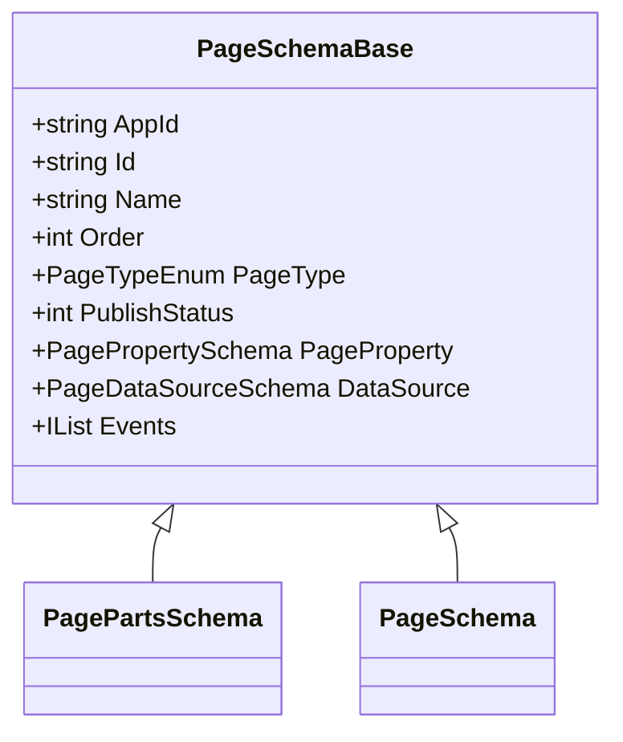
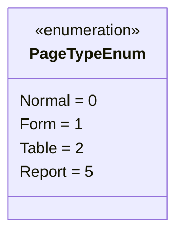
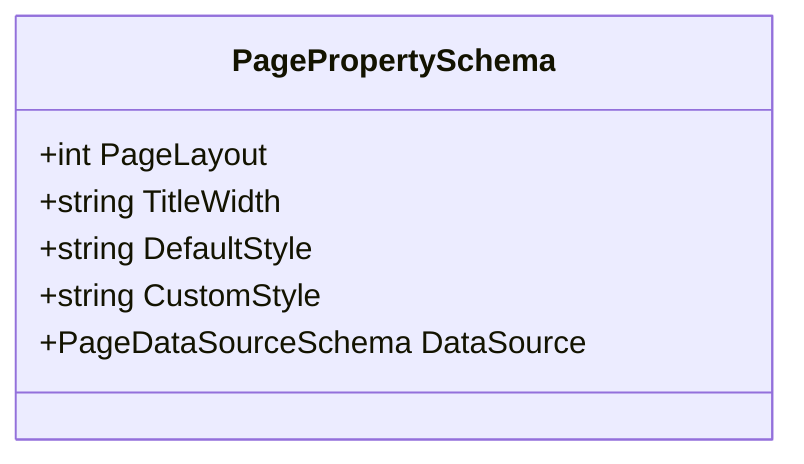
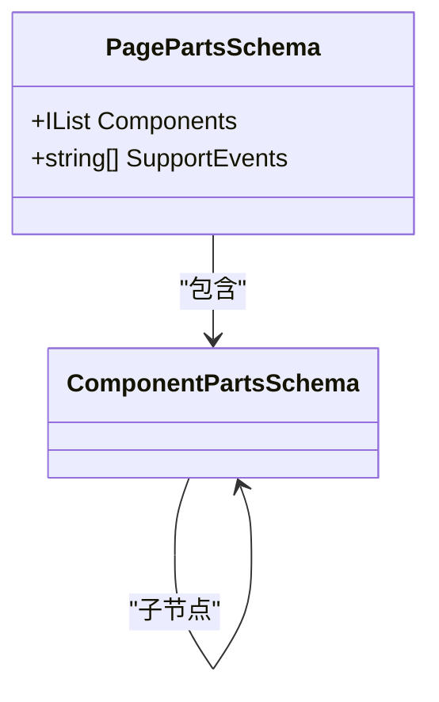
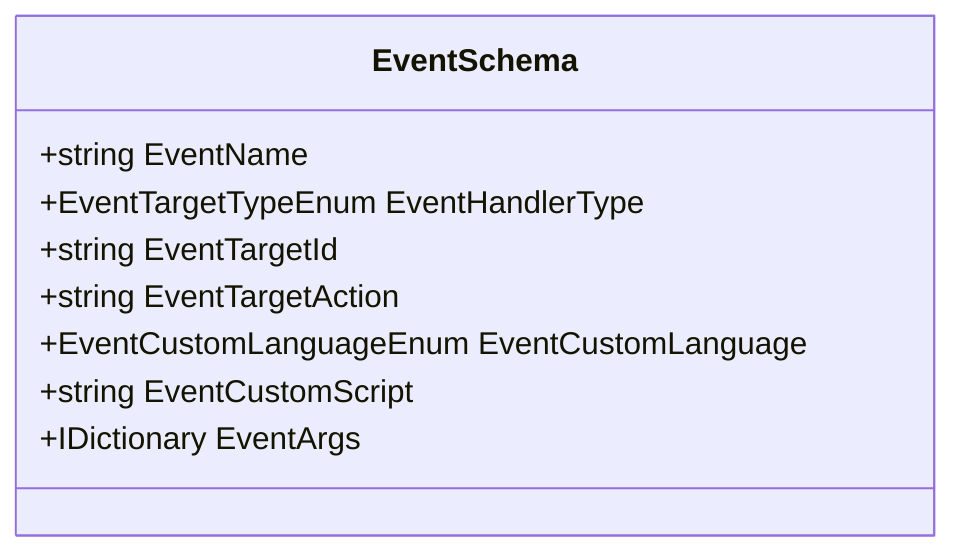
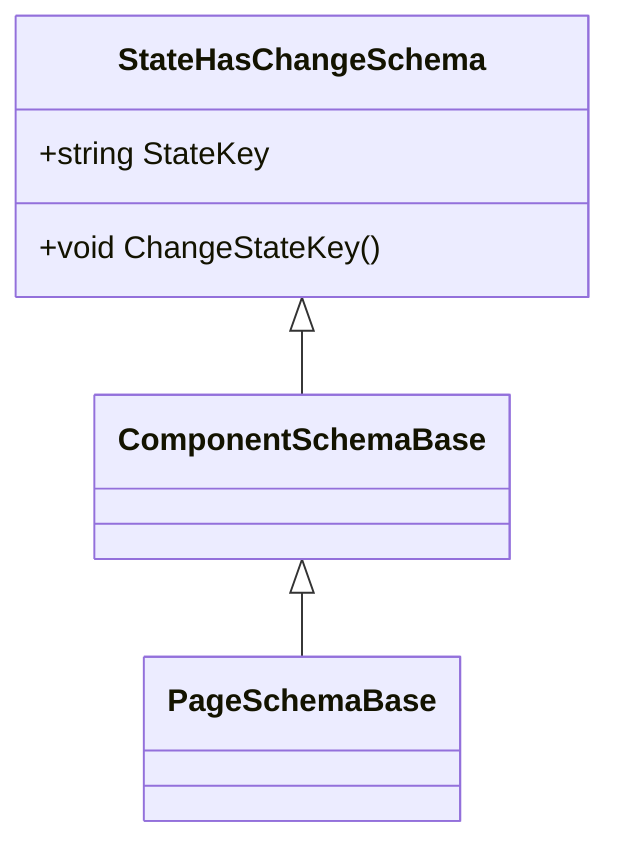
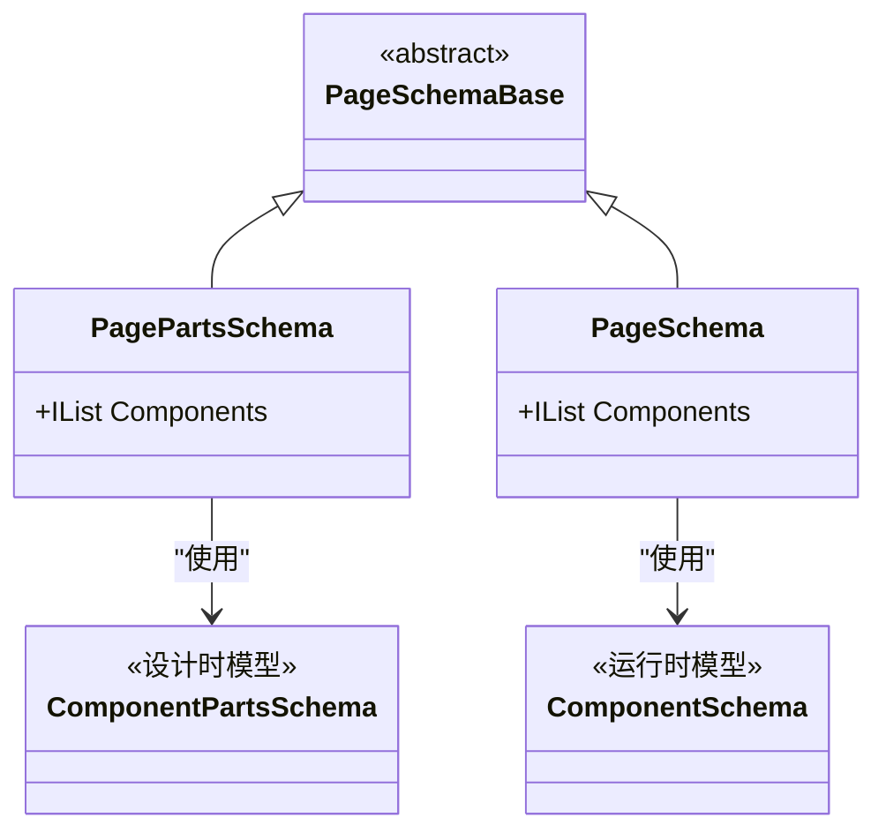

# 页面（Page）

<cite>
**本文档中引用的文件**
- [PageSchemaBase.cs](file://src\Common\H.LowCode.MetaSchema\PageSchemaBase.cs)
- [PageTypeEnum.cs](file://src\Common\H.LowCode.MetaSchema\Enums\PageTypeEnum.cs)
- [PagePropertySchema.cs](file://src\Common\H.LowCode.MetaSchema\PropertySchemas\PagePropertySchema.cs)
- [StateHasChangeSchema.cs](file://src\Common\H.LowCode.MetaSchema\StateHasChangeSchema.cs)
- [EventSchema.cs](file://src\Common\H.LowCode.MetaSchema\PropertySchemas\EventSchema.cs)
- [ComponentSchemaBase.cs](file://src\Common\H.LowCode.MetaSchema\ComponentSchemaBase.cs)
- [ComponentPartsSchema.cs](file://src\Common\H.LowCode.MetaSchema.DesignEngine\ComponentPartsSchema.cs)
- [PagePartsSchema.cs](file://src\Common\H.LowCode.MetaSchema.DesignEngine\PagePartsSchema.cs)
- [PageSchema.cs](file://src\Common\H.LowCode.MetaSchema.RenderEngine\PageSchema.cs)
- [ComponentSchema.cs](file://src\Common\H.LowCode.MetaSchema.RenderEngine\ComponentSchema.cs)
- [0lgu6xpop.json](file://meta\apps\caseapp\page\0lgu6xpop.json)
</cite>

## 目录
1. [引言](#引言)
2. [页面基本结构](#页面基本结构)
3. [页面类型](#页面类型)
4. [页面布局配置](#页面布局配置)
5. [组件树与页面结构](#组件树与页面结构)
6. [事件处理机制](#事件处理机制)
7. [数据源绑定](#数据源绑定)
8. [页面状态管理](#页面状态管理)
9. [设计与渲染引擎中的页面模型](#设计与渲染引擎中的页面模型)
10. [拖拽构建与动态渲染流程](#拖拽构建与动态渲染流程)

## 引言
本文档全面介绍低代码平台中“页面”作为用户界面基本单元的建模方式。基于 `PageSchemaBase` 和 `PagePropertySchema` 等核心类，详细解释页面的类型、布局配置、事件处理机制、组件树结构以及状态管理。通过分析 `0lgu6xpop.json` 示例文件，展示页面元数据的实际结构，并阐述页面在设计引擎中的拖拽构建过程和在渲染引擎中的动态加载与渲染流程。

## 页面基本结构

页面的基本结构由 `PageSchemaBase` 类定义，该类是所有页面模型的基类，包含了页面的核心元数据。

**图示来源**
- [PageSchemaBase.cs](file://src\Common\H.LowCode.MetaSchema\PageSchemaBase.cs#L5-L39)

**本节来源**
- [PageSchemaBase.cs](file://src\Common\H.LowCode.MetaSchema\PageSchemaBase.cs#L5-L39)

### 核心属性说明
- **AppId (aid)**: 所属应用的唯一标识符。
- **Id (id)**: 页面自身的唯一标识符。
- **Name (n)**: 页面的显示名称。
- **Order**: 页面在菜单中的排序序号。
- **PageType (pt)**: 页面类型，枚举值定义了页面的用途。
- **PublishStatus (pub)**: 发布状态，标记页面是否已发布。
- **PageProperty (pageprop)**: 页面的属性配置，如布局、样式等。
- **DataSource (ds)**: 页面级数据源配置。
- **Events (evs)**: 页面级事件集合。

## 页面类型

页面类型由 `PageTypeEnum` 枚举定义，用于区分不同功能和用途的页面。

**图示来源**
- [PageTypeEnum.cs](file://src\Common\H.LowCode.MetaSchema\Enums\PageTypeEnum.cs#L9-L19)

**本节来源**
- [PageTypeEnum.cs](file://src\Common\H.LowCode.MetaSchema\Enums\PageTypeEnum.cs#L9-L19)

### 类型详解
- **普通 (Normal)**: 基础的静态页面，用于展示内容或作为容器。
- **表单 (Form)**: 用于数据录入和编辑的页面，通常包含输入控件和提交逻辑。
- **列表 (Table)**: 用于展示和管理数据列表的页面，支持分页、搜索和操作。
- **报表 (Report)**: 用于数据可视化和分析的页面，通常包含图表和统计信息。

## 页面布局配置

页面的布局配置由 `PagePropertySchema` 类管理，主要控制页面的整体外观和结构。

**图示来源**
- [PagePropertySchema.cs](file://src\Common\H.LowCode.MetaSchema\PropertySchemas\PagePropertySchema.cs#L5-L36)

**本节来源**
- [PagePropertySchema.cs](file://src\Common\H.LowCode.MetaSchema\PropertySchemas\PagePropertySchema.cs#L5-L36)

### 布局属性说明
- **PageLayout (playout)**: 页面布局类型，数值代表列数：
  - `1`: 一列布局
  - `2`: 二列布局
  - `3`: 三列布局
  - `4`: 四列布局
- **TitleWidth (titlew)**: 标题区域的宽度设置。
- **DefaultStyle (dsty)**: 页面的默认样式。
- **CustomStyle (csty)**: 页面的自定义CSS样式。

## 组件树与页面结构

页面由一个或多个组件构成，形成一个树状结构。`PagePartsSchema` 类在设计引擎中定义了这一结构。

**图示来源**
- [PagePartsSchema.cs](file://src\Common\H.LowCode.MetaSchema.DesignEngine\PagePartsSchema.cs#L5-L15)
- [ComponentPartsSchema.cs](file://src\Common\H.LowCode.MetaSchema.DesignEngine\ComponentPartsSchema.cs#L5-L177)

**本节来源**
- [PagePartsSchema.cs](file://src\Common\H.LowCode.MetaSchema.DesignEngine\PagePartsSchema.cs#L5-L15)
- [ComponentPartsSchema.cs](file://src\Common\H.LowCode.MetaSchema.DesignEngine\ComponentPartsSchema.cs#L5-L177)

### 组件树结构分析
- **Components (comps)**: 页面的根组件列表，是组件树的起点。
- **ComponentPartsSchema**: 设计引擎中的组件模型，继承自 `ComponentSchemaBase`，并扩展了设计时所需的属性，如 `Fragment`、`Childrens` 等。
- **Childrens (childs)**: 每个组件可以包含子组件，形成嵌套的树状结构，实现复杂的UI布局。

## 事件处理机制

页面和组件的交互行为通过事件机制来处理，`EventSchema` 类定义了事件的结构。

**图示来源**
- [EventSchema.cs](file://src\Common\H.LowCode.MetaSchema\PropertySchemas\EventSchema.cs#L5-L45)

**本节来源**
- [EventSchema.cs](file://src\Common\H.LowCode.MetaSchema\PropertySchemas\EventSchema.cs#L5-L45)

### 事件类型与属性
事件分为标准事件和自定义事件：
- **标准事件**:
  - `EventName`: 触发的事件名称，如 `OnClick`。
  - `EventHandlerType`: 事件处理器类型。
  - `EventTargetId`: 事件目标组件的ID。
  - `EventTargetAction`: 目标组件执行的动作，如 `Navigate`。
  - `EventArgs`: 传递给事件处理器的参数。
- **自定义事件**:
  - `EventCustomLanguage`: 自定义脚本的语言。
  - `EventCustomScript`: 自定义脚本的内容。

## 数据源绑定

页面和组件可以绑定数据源，以实现动态数据展示。`PageDataSourceSchema` 和 `ComponentPartsDataSourceSchema` 分别管理页面和组件的数据源。

**本节来源**
- [PageSchemaBase.cs](file://src\Common\H.LowCode.MetaSchema\PageSchemaBase.cs#L32-L33)
- [ComponentPartsSchema.cs](file://src\Common\H.LowCode.MetaSchema.DesignEngine\ComponentPartsSchema.cs#L29-L30)

### 数据源配置
- **PageDataSourceSchema (ds)**: 定义在 `PageSchemaBase` 中，为整个页面提供数据。
- **ComponentPartsDataSourceSchema (ds)**: 定义在 `ComponentPartsSchema` 中，为单个组件提供数据，支持固定选项、SQL查询、API调用等多种数据源类型。

## 页面状态管理

页面的状态管理通过 `StateHasChangeSchema` 基类实现，为需要响应状态变化的组件提供基础支持。

**图示来源**
- [StateHasChangeSchema.cs](file://src\Common\H.LowCode.MetaSchema\StateHasChangeSchema.cs#L6-L15)
- [ComponentSchemaBase.cs](file://src\Common\H.LowCode.MetaSchema\ComponentSchemaBase.cs#L5-L77)
- [PageSchemaBase.cs](file://src\Common\H.LowCode.MetaSchema\PageSchemaBase.cs#L5-L39)

**本节来源**
- [StateHasChangeSchema.cs](file://src\Common\H.LowCode.MetaSchema\StateHasChangeSchema.cs#L6-L15)

### 状态管理机制
- **StateKey**: 一个内部生成的唯一键，用于标识组件的当前状态。
- **ChangeStateKey()**: 当组件状态发生变化时，调用此方法生成新的 `StateKey`，通知框架进行重新渲染。

## 设计与渲染引擎中的页面模型

低代码平台采用分离的设计，设计引擎和渲染引擎使用不同的页面模型。

**图示来源**
- [PagePartsSchema.cs](file://src\Common\H.LowCode.MetaSchema.DesignEngine\PagePartsSchema.cs#L5-L15)
- [PageSchema.cs](file://src\Common\H.LowCode.MetaSchema.RenderEngine\PageSchema.cs#L5-L9)
- [ComponentPartsSchema.cs](file://src\Common\H.LowCode.MetaSchema.DesignEngine\ComponentPartsSchema.cs#L5-L177)
- [ComponentSchema.cs](file://src\Common\H.LowCode.MetaSchema.RenderEngine\ComponentSchema.cs#L7-L71)

**本节来源**
- [PagePartsSchema.cs](file://src\Common\H.LowCode.MetaSchema.DesignEngine\PagePartsSchema.cs#L5-L15)
- [PageSchema.cs](file://src\Common\H.LowCode.MetaSchema.RenderEngine\PageSchema.cs#L5-L9)
- [ComponentSchema.cs](file://src\Common\H.LowCode.MetaSchema.RenderEngine\ComponentSchema.cs#L7-L71)

### 模型对比
- **设计引擎 (PagePartsSchema)**:
  - 使用 `ComponentPartsSchema` 作为组件类型。
  - 包含设计时所需的信息，如物料ID、属性定义分组等。
  - 支持拖拽、属性编辑等设计操作。
- **渲染引擎 (PageSchema)**:
  - 使用 `ComponentSchema` 作为组件类型。
  - 是一个精简的、用于运行时渲染的模型。
  - 通过 `MergeAttributeDefineToFragment` 方法将属性定义合并到渲染片段中。

## 拖拽构建与动态渲染流程

### 拖拽构建流程
1. 用户从组件面板拖拽一个组件物料。
2. 设计引擎创建一个 `ComponentPartsSchema` 实例。
3. 该实例被添加到 `PagePartsSchema` 的 `Components` 树中。
4. 用户通过属性面板修改组件属性，这些属性存储在 `AttributeDefineGroups` 中。
5. 修改完成后，页面元数据（如 `0lgu6xpop.json`）被持久化。

### 动态渲染流程
1. 渲染引擎加载页面的JSON元数据。
2. 将 `PageSchema` 和 `ComponentSchema` 对象反序列化。
3. 遍历 `Components` 树，为每个组件调用 `RenderComponentRecursive`。
4. 根据 `Fragment` 中的 `TypeName` 动态创建Blazor组件实例。
5. 将 `AttributeDefineGroups` 中的属性合并到 `Fragment.Attributes`。
6. 最终生成完整的UI并呈现给用户。

**本节来源**
- [DesignEngineDynamicComponentBase.cs](file://src\DesignEngine\H.LowCode.DesignEngineBase\DesignEngineDynamicComponentBase.cs)
- [0lgu6xpop.json](file://meta\apps\caseapp\page\0lgu6xpop.json)