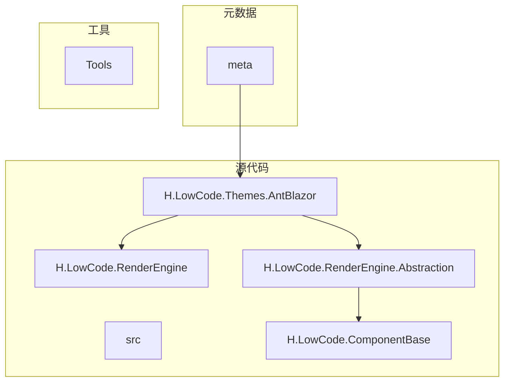
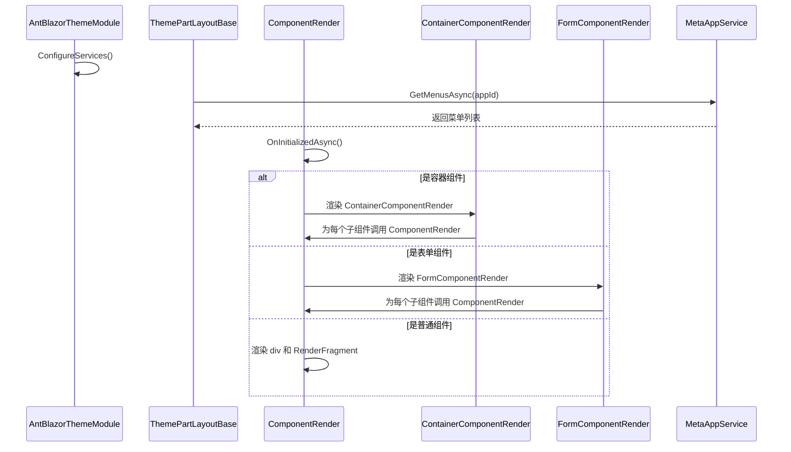
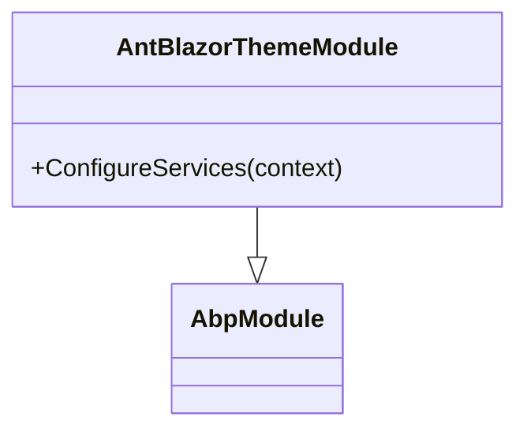
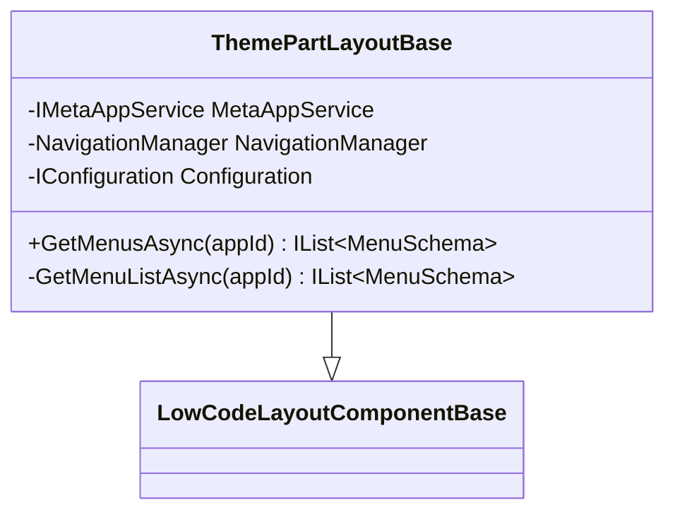
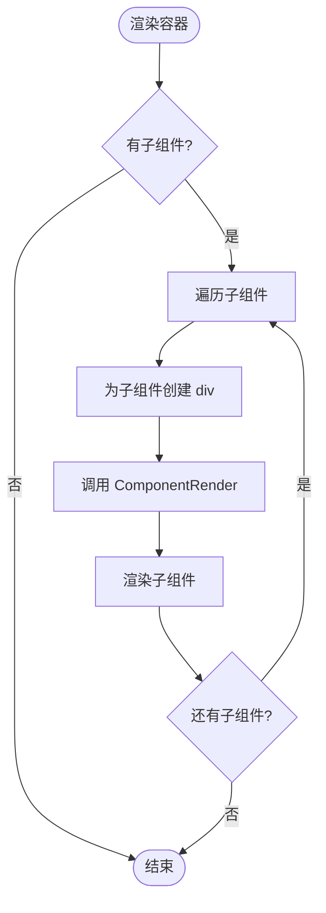
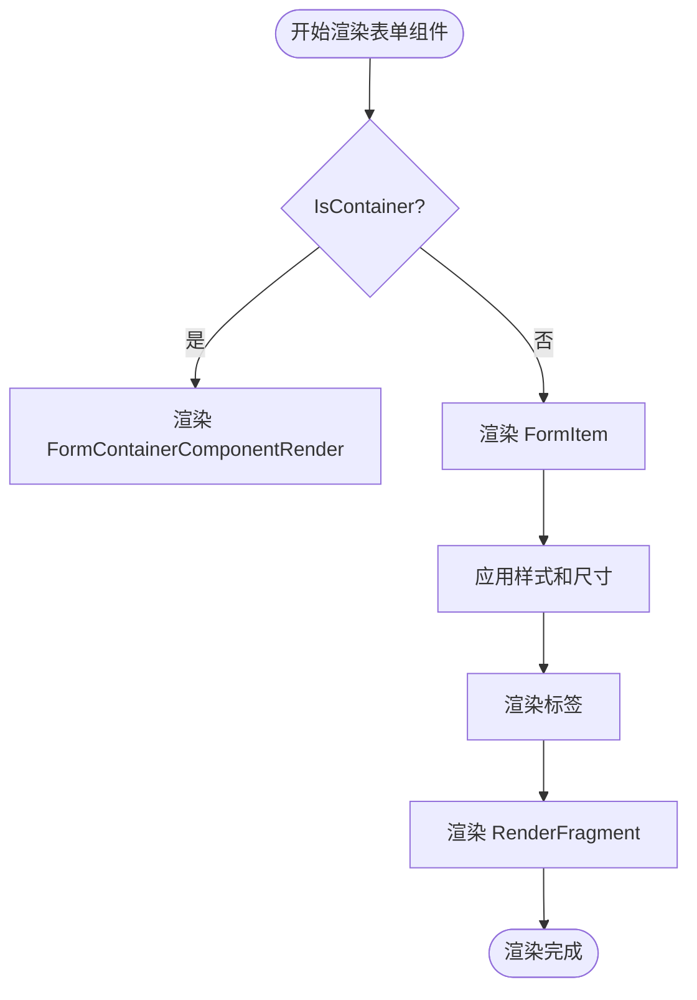
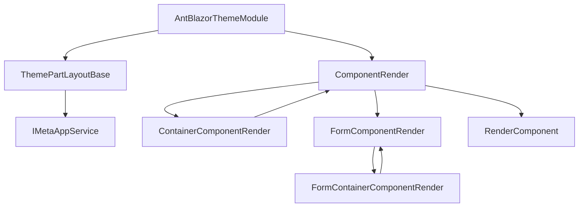

# 主题系统

<cite>
**本文档引用的文件**   
- [AntBlazorThemeModule.cs](file://src/RenderEngine/H.LowCode.Themes.AntBlazor/AntBlazorThemeModule.cs)
- [ThemePartLayoutBase.cs](file://src/RenderEngine/H.LowCode.RenderEngine.Abstraction/ThemePartLayoutBase.cs)
- [ComponentRender.razor](file://src/RenderEngine/H.LowCode.Themes.AntBlazor/ComponentRender/ComponentRender.razor)
- [ContainerComponentRender.razor](file://src/RenderEngine/H.LowCode.Themes.AntBlazor/ComponentRender/ContainerComponentRender.razor)
- [FormComponentRender.razor](file://src/RenderEngine/H.LowCode.Themes.AntBlazor/ComponentRender/FormComponentRender.razor)
- [FormContainerComponentRender.razor](file://src/RenderEngine/H.LowCode.Themes.AntBlazor/ComponentRender/FormContainerComponentRender.razor)
- [ComponentRender.razor.css](file://src/RenderEngine/H.LowCode.Themes.AntBlazor/ComponentRender/ComponentRender.razor.css)
- [ContainerComponentRender.razor.css](file://src/RenderEngine/H.LowCode.Themes.AntBlazor/ComponentRender/ContainerComponentRender.razor.css)
- [FormComponentRender.razor.css](file://src/RenderEngine/H.LowCode.Themes.AntBlazor/ComponentRender/FormComponentRender.razor.css)
- [FormContainerComponentRender.razor.css](file://src/RenderEngine/H.LowCode.Themes.AntBlazor/ComponentRender/FormContainerComponentRender.razor.css)
</cite>

## 目录
1. [简介](#简介)
2. [项目结构](#项目结构)
3. [核心组件](#核心组件)
4. [架构概述](#架构概述)
5. [详细组件分析](#详细组件分析)
6. [依赖分析](#依赖分析)
7. [性能考虑](#性能考虑)
8. [故障排除指南](#故障排除指南)
9. [结论](#结论)

## 简介
本文档旨在全面解释低代码平台中的主题系统，重点介绍如何通过 `AntBlazorThemeModule` 集成 Ant Design Blazor 组件库并定制用户界面外观。文档将详细说明 `ComponentRender` 组件如何根据元数据动态渲染不同类型的 UI 控件，并应用相应的 CSS 样式。同时，将阐述 `ThemePartLayoutBase` 基类的作用，以及自定义主题如何覆盖默认渲染行为。最后，提供开发自定义主题的步骤、最佳实践和常见问题解决方案。

## 项目结构
项目采用分层架构，主要分为 `meta`（元数据）、`src`（源代码）和 `Tools`（工具）三大目录。`src` 目录下包含多个模块，其中与主题系统直接相关的是 `H.LowCode.Themes.AntBlazor` 模块，它位于 `src/RenderEngine` 目录下，负责 UI 的渲染和主题定制。`H.LowCode.RenderEngine.Abstraction` 模块提供了主题布局的基类。



**Diagram sources**
- [AntBlazorThemeModule.cs](file://src/RenderEngine/H.LowCode.Themes.AntBlazor/AntBlazorThemeModule.cs)
- [ThemePartLayoutBase.cs](file://src/RenderEngine/H.LowCode.RenderEngine.Abstraction/ThemePartLayoutBase.cs)

**Section sources**
- [AntBlazorThemeModule.cs](file://src/RenderEngine/H.LowCode.Themes.AntBlazor/AntBlazorThemeModule.cs)
- [ThemePartLayoutBase.cs](file://src/RenderEngine/H.LowCode.RenderEngine.Abstraction/ThemePartLayoutBase.cs)

## 核心组件
主题系统的核心组件包括 `AntBlazorThemeModule`、`ComponentRender` 及其衍生组件（`ContainerComponentRender`、`FormComponentRender`、`FormContainerComponentRender`），以及基类 `ThemePartLayoutBase`。这些组件共同协作，实现了基于元数据的动态 UI 渲染和主题化。

**Section sources**
- [AntBlazorThemeModule.cs](file://src/RenderEngine/H.LowCode.Themes.AntBlazor/AntBlazorThemeModule.cs)
- [ComponentRender.razor](file://src/RenderEngine/H.LowCode.Themes.AntBlazor/ComponentRender/ComponentRender.razor)
- [ThemePartLayoutBase.cs](file://src/RenderEngine/H.LowCode.RenderEngine.Abstraction/ThemePartLayoutBase.cs)

## 架构概述
主题系统的架构围绕着“元数据驱动渲染”的理念构建。`AntBlazorThemeModule` 作为模块入口，负责注册服务和组件映射。`ThemePartLayoutBase` 提供了布局和菜单获取的基础功能。`ComponentRender` 是核心渲染引擎，它根据 `ComponentSchema` 元数据决定渲染哪种具体的 UI 组件（如容器、表单等），并递归地处理子组件。样式通过 Razor 组件的 CSS 文件（`.razor.css`）进行局部作用域管理。



**Diagram sources**
- [AntBlazorThemeModule.cs](file://src/RenderEngine/H.LowCode.Themes.AntBlazor/AntBlazorThemeModule.cs#L12-L18)
- [ThemePartLayoutBase.cs](file://src/RenderEngine/H.LowCode.RenderEngine.Abstraction/ThemePartLayoutBase.cs#L11-L43)
- [ComponentRender.razor](file://src/RenderEngine/H.LowCode.Themes.AntBlazor/ComponentRender/ComponentRender.razor#L1-L60)
- [ContainerComponentRender.razor](file://src/RenderEngine/H.LowCode.Themes.AntBlazor/ComponentRender/ContainerComponentRender.razor#L1-L27)
- [FormComponentRender.razor](file://src/RenderEngine/H.LowCode.Themes.AntBlazor/ComponentRender/FormComponentRender.razor#L1-L54)

## 详细组件分析

### AntBlazorThemeModule 分析
`AntBlazorThemeModule` 是一个继承自 `AbpModule` 的模块类，它是集成 Ant Design Blazor 库的入口点。目前该类的 `ConfigureServices` 方法为空，但其设计意图是注册主题相关的服务、配置依赖注入容器，并可能注册自定义的组件映射，以将通用的 `ComponentSchema` 映射到具体的 Ant Design Blazor 组件上。



**Diagram sources**
- [AntBlazorThemeModule.cs](file://src/RenderEngine/H.LowCode.Themes.AntBlazor/AntBlazorThemeModule.cs#L12-L18)

**Section sources**
- [AntBlazorThemeModule.cs](file://src/RenderEngine/H.LowCode.Themes.AntBlazor/AntBlazorThemeModule.cs#L12-L18)

### ThemePartLayoutBase 分析
`ThemePartLayoutBase` 是一个抽象类，继承自 `LowCodeLayoutComponentBase`。它通过依赖注入获取 `IMetaAppService`、`NavigationManager` 和 `IConfiguration`。其主要功能是提供一个 `GetMenusAsync` 方法，该方法调用 `MetaAppService` 获取应用的菜单列表，并确保列表中包含一个默认的“首页”菜单项。这为所有基于此基类的主题布局提供了统一的菜单处理逻辑。



**Diagram sources**
- [ThemePartLayoutBase.cs](file://src/RenderEngine/H.LowCode.RenderEngine.Abstraction/ThemePartLayoutBase.cs#L11-L43)

**Section sources**
- [ThemePartLayoutBase.cs](file://src/RenderEngine/H.LowCode.RenderEngine.Abstraction/ThemePartLayoutBase.cs#L11-L43)

### ComponentRender 分析
`ComponentRender` 是一个 Razor 组件，继承自 `RenderEngineDynamicComponentBase`。它是整个渲染系统的核心。它接收一个 `ComponentSchema` 参数，并根据 `Component.IsContainer` 的值决定渲染 `ContainerComponentRender` 还是普通组件的 div 容器。对于普通组件，它会计算宽度和高度，并应用默认和自定义的 CSS 样式。它通过 `Init` 方法初始化 `_renderFragment`，该片段由 `RenderComponent` 方法生成，实现了对具体 UI 控件的渲染。

```mermaid
flowchart TD
Start([开始渲染]) --> CheckContainer{"IsContainer?"}
CheckContainer --> |是| RenderContainer[渲染 ContainerComponentRender]
CheckContainer --> |否| RenderDiv[渲染 div 容器]
RenderDiv --> ApplyStyle[应用样式和尺寸]
ApplyStyle --> RenderLabel[渲染标签 (可选)]
RenderLabel --> RenderFragment[渲染 RenderFragment]
RenderFragment --> End([渲染完成])
```

**Diagram sources**
- [ComponentRender.razor](file://src/RenderEngine/H.LowCode.Themes.AntBlazor/ComponentRender/ComponentRender.razor#L1-L60)

**Section sources**
- [ComponentRender.razor](file://src/RenderEngine/H.LowCode.Themes.AntBlazor/ComponentRender/ComponentRender.razor#L1-L60)

### ContainerComponentRender 分析
`ContainerComponentRender` 专门用于渲染容器类型的组件。它遍历 `ContainerComponent.Childrens` 集合，并为每个子组件创建一个 div 容器，然后在其中递归地调用 `ComponentRender` 组件。这实现了组件树的递归渲染。



**Diagram sources**
- [ContainerComponentRender.razor](file://src/RenderEngine/H.LowCode.Themes.AntBlazor/ComponentRender/ContainerComponentRender.razor#L1-L27)

**Section sources**
- [ContainerComponentRender.razor](file://src/RenderEngine/H.LowCode.Themes.AntBlazor/ComponentRender/ContainerComponentRender.razor#L1-L27)

### FormComponentRender 分析
`FormComponentRender` 用于渲染表单内的组件。它的结构与 `ComponentRender` 类似，但使用了 Ant Design Blazor 的 `FormItem` 组件来包裹内部内容，这为表单字段提供了统一的布局和验证支持。标签的显示由 `Component.IsHiddenLabel` 控制。



**Diagram sources**
- [FormComponentRender.razor](file://src/RenderEngine/H.LowCode.Themes.AntBlazor/ComponentRender/FormComponentRender.razor#L1-L54)

**Section sources**
- [FormComponentRender.razor](file://src/RenderEngine/H.LowCode.Themes.AntBlazor/ComponentRender/FormComponentRender.razor#L1-L54)

## 依赖分析
主题系统内部组件之间存在明确的依赖关系。`ComponentRender` 依赖于 `ContainerComponentRender` 和 `FormComponentRender` 来处理特定类型的组件。`FormComponentRender` 又依赖于 `FormContainerComponentRender`。`ThemePartLayoutBase` 依赖于 `IMetaAppService` 来获取菜单数据。外部依赖包括 Ant Design Blazor 库（通过命名空间引用）和 ABP 框架（用于模块化）。



**Diagram sources**
- [AntBlazorThemeModule.cs](file://src/RenderEngine/H.LowCode.Themes.AntBlazor/AntBlazorThemeModule.cs)
- [ThemePartLayoutBase.cs](file://src/RenderEngine/H.LowCode.RenderEngine.Abstraction/ThemePartLayoutBase.cs)
- [ComponentRender.razor](file://src/RenderEngine/H.LowCode.Themes.AntBlazor/ComponentRender/ComponentRender.razor)
- [ContainerComponentRender.razor](file://src/RenderEngine/H.LowCode.Themes.AntBlazor/ComponentRender/ContainerComponentRender.razor)
- [FormComponentRender.razor](file://src/RenderEngine/H.LowCode.Themes.AntBlazor/ComponentRender/FormComponentRender.razor)
- [FormContainerComponentRender.razor](file://src/RenderEngine/H.LowCode.Themes.AntBlazor/ComponentRender/FormContainerComponentRender.razor)

**Section sources**
- [AntBlazorThemeModule.cs](file://src/RenderEngine/H.LowCode.Themes.AntBlazor/AntBlazorThemeModule.cs)
- [ThemePartLayoutBase.cs](file://src/RenderEngine/H.LowCode.RenderEngine.Abstraction/ThemePartLayoutBase.cs)
- [ComponentRender.razor](file://src/RenderEngine/H.LowCode.Themes.AntBlazor/ComponentRender/ComponentRender.razor)

## 性能考虑
由于渲染是递归进行的，对于深度嵌套或包含大量组件的页面，可能会产生性能开销。建议在 `ComponentSchema` 中合理使用 `IsHiddenLabel` 等属性来减少不必要的 DOM 元素。CSS 样式使用了 Razor 组件的局部作用域，避免了全局样式污染，但应确保样式规则的效率。

## 故障排除指南
- **组件未渲染**：检查 `ComponentSchema` 是否正确传递给 `ComponentRender`，并确认 `Component` 参数不为 null。
- **样式未生效**：检查 `.razor.css` 文件是否与 Razor 组件位于同一目录，并确认类名拼写正确。
- **菜单不显示**：确认 `IMetaAppService.GetMenusAsync` 方法能正确返回数据，并检查 `ThemePartLayoutBase` 中的逻辑。
- **循环依赖错误**：避免在 `ComponentRender` 和其子组件之间创建无限递归的调用。

## 结论
本文档详细解析了低代码平台的主题系统。`AntBlazorThemeModule` 提供了集成点，`ThemePartLayoutBase` 定义了布局基础，而 `ComponentRender` 及其家族组件则实现了基于元数据的动态、递归渲染。通过理解这些组件的协作方式，开发者可以创建自定义主题，覆盖默认行为，并实现丰富的 UI 定制。