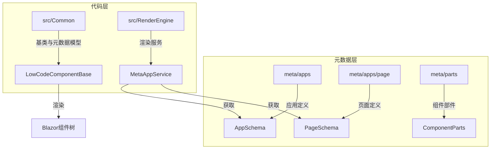
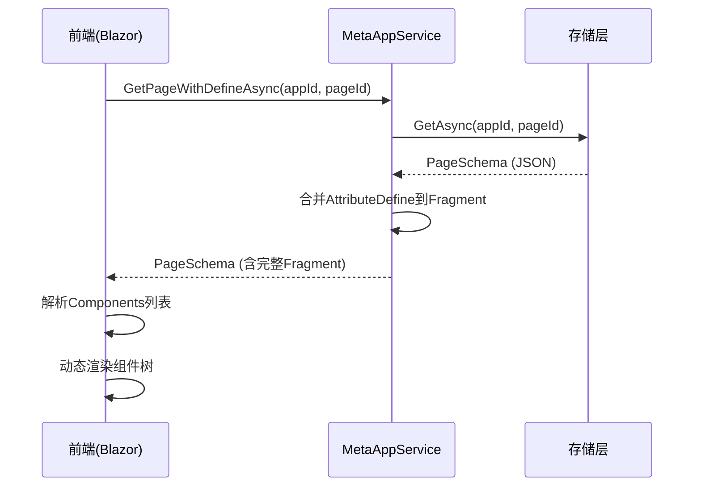
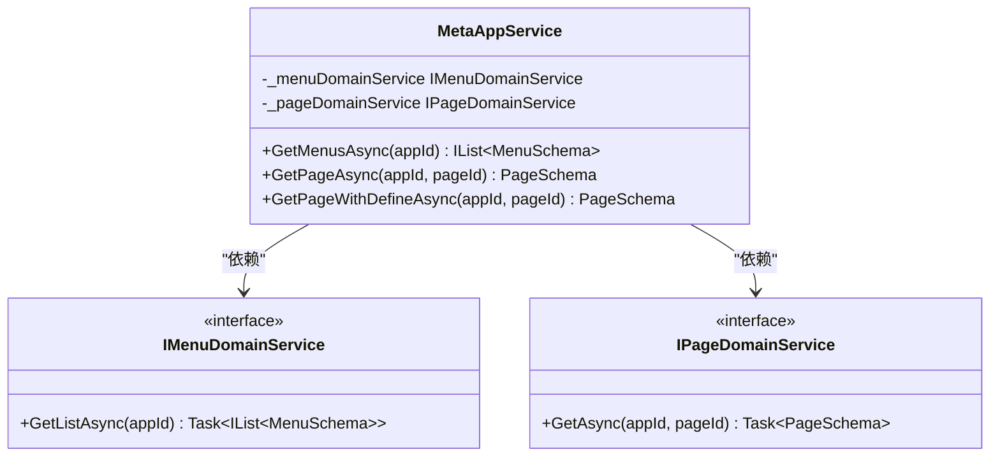
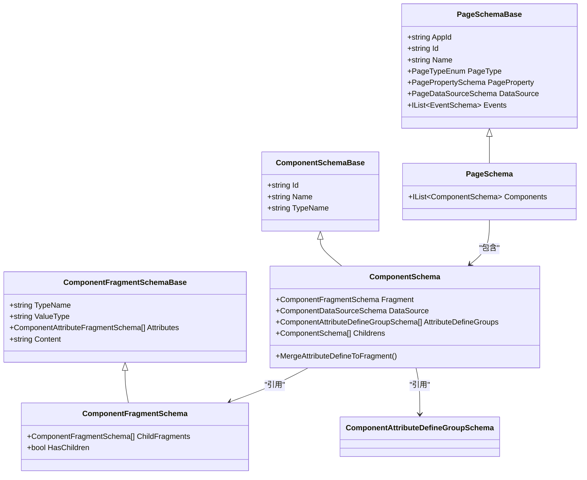
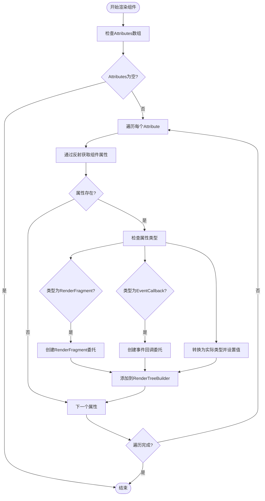
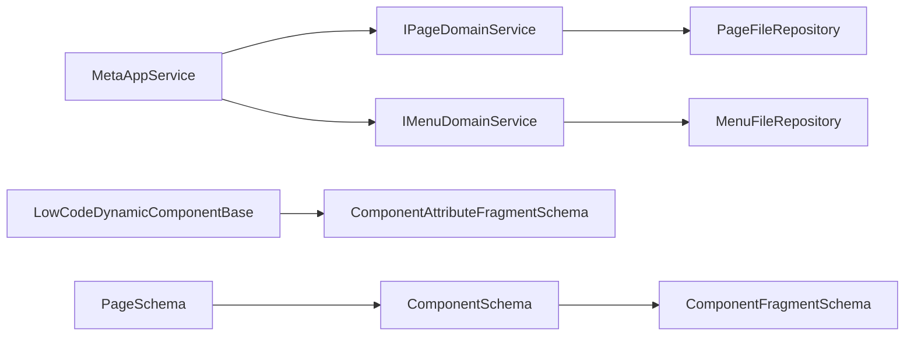

# 元数据驱动渲染流程

<cite>
**本文档引用的文件**   
- [MetaAppService.cs](file://src/RenderEngine/H.LowCode.RenderEngine.Application/RenderAppServices/MetaAppService.cs)
- [PageSchema.cs](file://src/Common/H.LowCode.MetaSchema.RenderEngine/PageSchema.cs)
- [ComponentSchema.cs](file://src/Common/H.LowCode.MetaSchema.RenderEngine/ComponentSchema.cs)
- [ComponentFragmentSchema.cs](file://src/Common/H.LowCode.MetaSchema.RenderEngine/PropertySchemas/ComponentFragmentSchema.cs)
- [ComponentFragmentSchemaBase.cs](file://src/Common/H.LowCode.MetaSchema/PropertySchemas/ComponentFragmentSchemaBase.cs)
- [LowCodeComponentBase.cs](file://src/Common/H.LowCode.ComponentBase/LowCodeComponentBase.cs)
- [LowCodeDynamicComponentBase.cs](file://src/Common/H.LowCode.ComponentBase/LowCodeDynamicComponentBase.cs)
- [LowCodePageComponentBase.cs](file://src/Common/H.LowCode.ComponentBase/LowCodePageComponentBase.cs)
- [PageSchemaBase.cs](file://src/Common/H.LowCode.MetaSchema/PageSchemaBase.cs)
- [PagePropertySchema.cs](file://src/Common/H.LowCode.MetaSchema/PropertySchemas/PagePropertySchema.cs)
</cite>

## 目录
1. [引言](#引言)
2. [项目结构](#项目结构)
3. [核心组件](#核心组件)
4. [架构概述](#架构概述)
5. [详细组件分析](#详细组件分析)
6. [依赖分析](#依赖分析)
7. [性能考虑](#性能考虑)
8. [故障排除指南](#故障排除指南)
9. [结论](#结论)

## 引言
本文档深入讲解低代码平台中元数据驱动的页面构建流程。重点分析渲染引擎如何基于JSON元数据动态生成Blazor组件树，涵盖从元数据获取、解析、组件实例化到属性绑定和事件注册的完整生命周期。文档旨在为开发者提供清晰的技术实现路径和最佳实践指导。

## 项目结构
项目采用分层架构，主要分为元数据（meta）和源代码（src）两大目录。元数据目录存储应用、页面、菜单和组件的JSON定义，而源代码目录则包含实现渲染逻辑的核心类库。

**Diagram sources**
- [meta/apps](file://meta/apps)
- [src/Common](file://src/Common)
- [src/RenderEngine](file://src/RenderEngine)

**Section sources**
- [project_structure](file://project_structure)

## 核心组件
核心组件包括`MetaAppService`、`PageSchema`、`ComponentSchema`和`LowCodeDynamicComponentBase`。`MetaAppService`负责从存储层获取元数据，`PageSchema`和`ComponentSchema`定义了页面和组件的数据结构，而`LowCodeDynamicComponentBase`则负责将元数据映射为实际的Blazor组件。

**Section sources**
- [MetaAppService.cs](file://src/RenderEngine/H.LowCode.RenderEngine.Application/RenderAppServices/MetaAppService.cs)
- [PageSchema.cs](file://src/Common/H.LowCode.MetaSchema.RenderEngine/PageSchema.cs)
- [ComponentSchema.cs](file://src/Common/H.LowCode.MetaSchema.RenderEngine/ComponentSchema.cs)
- [LowCodeDynamicComponentBase.cs](file://src/Common/H.LowCode.ComponentBase/LowCodeDynamicComponentBase.cs)

## 架构概述
系统采用元数据驱动的架构，通过分离设计时（Design Time）和运行时（Runtime）关注点，实现高度灵活的UI构建。设计时通过设计器生成JSON元数据，运行时由渲染引擎解析元数据并动态构建组件树。

**Diagram sources**
- [MetaAppService.cs](file://src/RenderEngine/H.LowCode.RenderEngine.Application/RenderAppServices/MetaAppService.cs)
- [IPageDomainService.cs](file://src/RenderEngine/H.LowCode.RenderEngine.Domain/MetaDomainServices/IPageDomainService.cs)

## 详细组件分析

### MetaAppService 分析
`MetaAppService`是渲染引擎的应用服务入口，负责协调元数据的获取和预处理。

**Diagram sources**
- [MetaAppService.cs](file://src/RenderEngine/H.LowCode.RenderEngine.Application/RenderAppServices/MetaAppService.cs)
- [IMenuDomainService.cs](file://src/RenderEngine/H.LowCode.RenderEngine.Domain/MetaDomainServices/IMenuDomainService.cs)
- [IPageDomainService.cs](file://src/RenderEngine/H.LowCode.RenderEngine.Domain/MetaDomainServices/IPageDomainService.cs)

**Section sources**
- [MetaAppService.cs](file://src/RenderEngine/H.LowCode.RenderEngine.Application/RenderAppServices/MetaAppService.cs)

### 页面与组件元数据分析
`PageSchema`和`ComponentSchema`构成了元数据模型的核心，定义了页面和组件的结构。

**Diagram sources**
- [PageSchema.cs](file://src/Common/H.LowCode.MetaSchema.RenderEngine/PageSchema.cs)
- [ComponentSchema.cs](file://src/Common/H.LowCode.MetaSchema.RenderEngine/ComponentSchema.cs)
- [ComponentFragmentSchema.cs](file://src/Common/H.LowCode.MetaSchema.RenderEngine/PropertySchemas/ComponentFragmentSchema.cs)
- [PageSchemaBase.cs](file://src/Common/H.LowCode.MetaSchema/PageSchemaBase.cs)

**Section sources**
- [PageSchema.cs](file://src/Common/H.LowCode.MetaSchema.RenderEngine/PageSchema.cs)
- [ComponentSchema.cs](file://src/Common/H.LowCode.MetaSchema.RenderEngine/ComponentSchema.cs)

### 动态组件渲染分析
`LowCodeDynamicComponentBase`是动态渲染的核心，负责将`ComponentFragmentSchema`中的属性映射到实际的Blazor组件。

**Diagram sources**
- [LowCodeDynamicComponentBase.cs](file://src/Common/H.LowCode.ComponentBase/LowCodeDynamicComponentBase.cs)
- [ComponentAttributeFragmentSchema.cs](file://src/Common/H.LowCode.MetaSchema/PropertySchemas/ComponentFragmentSchemaBase.cs)

**Section sources**
- [LowCodeDynamicComponentBase.cs](file://src/Common/H.LowCode.ComponentBase/LowCodeDynamicComponentBase.cs)

## 依赖分析
系统各组件间存在清晰的依赖关系，遵循依赖倒置原则。

**Diagram sources**
- [MetaAppService.cs](file://src/RenderEngine/H.LowCode.RenderEngine.Application/RenderAppServices/MetaAppService.cs)
- [IPageDomainService.cs](file://src/RenderEngine/H.LowCode.RenderEngine.Domain/MetaDomainServices/IPageDomainService.cs)
- [PageFileRepository.cs](file://src/RenderEngine/H.LowCode.RenderEngine.Repository.JsonFile/Repositories/PageFileRepository.cs)
- [LowCodeDynamicComponentBase.cs](file://src/Common/H.LowCode.ComponentBase/LowCodeDynamicComponentBase.cs)

**Section sources**
- [MetaAppService.cs](file://src/RenderEngine/H.LowCode.RenderEngine.Application/RenderAppServices/MetaAppService.cs)
- [LowCodeDynamicComponentBase.cs](file://src/Common/H.LowCode.ComponentBase/LowCodeDynamicComponentBase.cs)

## 性能考虑
1. **元数据合并**：`GetPageWithDefineAsync`在服务端完成`AttributeDefine`到`Fragment`的合并，避免了前端重复计算。
2. **反射优化**：`LowCodeDynamicComponentBase`中使用`GetProperty`进行属性查找，建议在高频率场景下缓存`PropertyInfo`对象。
3. **JSON序列化**：使用`JsonPropertyName`特性减少序列化后的数据体积。
4. **懒加载**：`LazyServiceProvider`确保服务实例按需创建。

## 故障排除指南
1. **组件未渲染**：检查`ComponentSchema`的`TypeName`是否正确，确保组件类型在程序集中可被找到。
2. **属性绑定失败**：确认`ComponentAttributeFragmentSchema`中的`AttributeName`与目标组件的属性名完全匹配（区分大小写）。
3. **事件不触发**：验证`AttributeValue`是否指向了正确的、可访问的方法名。
4. **类型转换错误**：检查`AttributeClrType`是否为有效的.NET类型全名。

**Section sources**
- [LowCodeDynamicComponentBase.cs](file://src/Common/H.LowCode.ComponentBase/LowCodeDynamicComponentBase.cs)
- [ComponentSchema.cs](file://src/Common/H.LowCode.MetaSchema.RenderEngine/ComponentSchema.cs)

## 结论
该低代码平台通过`MetaAppService`获取结构化的`PageSchema`元数据，并利用`LowCodeDynamicComponentBase`的反射机制，实现了从JSON定义到Blazor UI组件的无缝转换。这种元数据驱动的架构极大地提升了UI构建的灵活性和可维护性，为快速应用开发提供了坚实的基础。