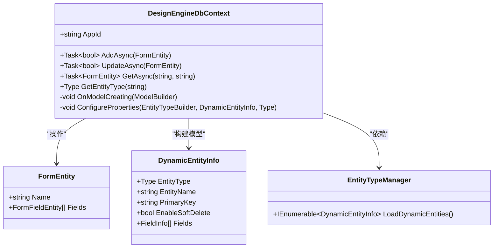

# 存储实现

<cite>
**本文档引用文件**  
- [AppFileRepository.cs](file://src/DesignEngine/H.LowCode.DesignEngine.Repository.JsonFile/Repositories/AppFileRepository.cs)
- [AppRemoteServiceRepository.cs](file://src/DesignEngine/H.LowCode.DesignEngine.Repository.RemoteService/Repositories/AppRemoteServiceRepository.cs)
- [DesignEngineDbContext.cs](file://src/DesignEngine/H.LowCode.DesignEngine.EntityFrameworkCore/EntityFrameworkCore/DesignEngineDbContext.cs)
- [FileRepositoryBase.cs](file://src/DesignEngine/H.LowCode.DesignEngine.Repository.JsonFile/Base/FileRepositoryBase.cs)
- [appsettings.json](file://src/DesignEngine/H.LowCode.DesignEngine.Host/appsettings.json)
- [appsettings.json](file://src/RenderEngine/H.LowCode.RenderEngine.Host/appsettings.json)
</cite>

## 目录
1. [引言](#引言)
2. [三种存储方式概述](#三种存储方式概述)
3. [JsonFile 存储实现](#jsonfile-存储实现)
4. [RemoteService 存储实现](#remoteservice-存储实现)
5. [EntityFrameworkCore 存储实现](#entityframeworkcore-存储实现)
6. [性能与适用场景对比](#性能与适用场景对比)
7. [配置方法与 RepositoryType 设置](#配置方法与-repositorytype-设置)
8. [扩展新的存储实现](#扩展新的存储实现)

## 引言

本文档旨在详细分析低代码平台中三种核心存储实现方式：**JsonFile**、**RemoteService** 和 **EntityFrameworkCore**。通过深入解析其代码结构、应用场景、配置方式及性能特征，帮助开发者理解如何根据实际需求选择合适的存储策略，并支持未来扩展新的数据源类型。

## 三种存储方式概述

在当前项目架构中，存在三种主要的元数据与应用数据存储机制：

- **JsonFile**：基于文件系统的本地存储，从 `meta` 目录读取 JSON 文件作为元数据源。
- **RemoteService**：通过调用远程 API 接口获取和保存数据，适用于分布式或微服务架构。
- **EntityFrameworkCore**：使用 EF Core 通过 `DbContext` 访问关系型数据库，支持动态实体映射与复杂查询。

这三种方式分别适用于不同环境，具有各自的优缺点和扩展性。

## JsonFile 存储实现

### 基本原理

`JsonFile` 存储实现通过读写本地文件系统中的 JSON 文件来持久化元数据。所有应用的元数据（如应用配置、页面、菜单、数据源等）均以 `.json` 文件形式存储在 `meta/apps` 和 `meta/parts` 目录下。

#### 核心类：AppFileRepository

`AppFileRepository` 是 `IAppRepository` 接口的具体实现，负责从文件系统加载和保存 `AppPartsSchema` 对象。

```csharp
public class AppFileRepository : FileRepositoryBase, IAppRepository
{
    private static string appFileName_Format = @"{0}\{1}\{2}.json";

    public AppFileRepository(IOptions<MetaOption> metaOption) : base(metaOption)
    {
        // 初始化元数据根路径
    }

    public async Task<IList<AppPartsSchema>> GetListAsync()
    {
        List<AppPartsSchema> appSchemas = [];
        var directories = Directory.GetDirectories(_metaBaseDir);
        foreach (var directory in directories)
        {
            DirectoryInfo dirInfo = new(directory);
            var fileName = string.Format(appFileName_Format, _metaBaseDir, dirInfo.Name, dirInfo.Name);
            if (!File.Exists(fileName)) continue;

            var appSchemaJson = ReadAllText(fileName);
            var appSchema = appSchemaJson.FromJson<AppPartsSchema>();
            appSchemas.Add(appSchema);
        }
        return await Task.FromResult(appSchemas);
    }

    public async Task<AppPartsSchema> GetAsync(string appId)
    {
        string fileName = string.Format(appFileName_Format, _metaBaseDir, appId, appId);
        var appSchemaJson = ReadAllText(fileName);
        var appSchema = appSchemaJson.FromJson<AppPartsSchema>();
        return await Task.FromResult(appSchema);
    }

    public async Task SaveAsync(AppPartsSchema appSchema)
    {
        string fileName = string.Format(appFileName_Format, _metaBaseDir, appSchema.Id, appSchema.Id);
        string fileDirectory = Path.GetDirectoryName(fileName);
        if (!Directory.Exists(fileDirectory)) Directory.CreateDirectory(fileDirectory);

        File.WriteAllText(fileName, appSchema.ToJson(), Encoding.UTF8);
        await Task.CompletedTask;
    }
}
```

#### 基类：FileRepositoryBase

`FileRepositoryBase` 提供了通用的文件读取功能：

```csharp
protected static string ReadAllText(string fileName)
{
    if (!File.Exists(fileName))
        throw new FileNotFoundException(fileName);
    return File.ReadAllText(fileName, Encoding.UTF8);
}
```

### 应用场景

- **开发环境**：便于快速迭代和调试，无需数据库依赖。
- **静态部署**：适合内容不频繁变更的低代码应用。
- **轻量级系统**：无数据库依赖，部署简单。

### 优点与局限

| 特性 | 说明 |
|------|------|
| **优点** | 部署简单、无需数据库、适合静态内容 |
| **缺点** | 并发写入风险、性能随文件数量增长下降、缺乏事务支持 |

**Section sources**
- [AppFileRepository.cs](file://src/DesignEngine/H.LowCode.DesignEngine.Repository.JsonFile/Repositories/AppFileRepository.cs#L1-L70)
- [FileRepositoryBase.cs](file://src/DesignEngine/H.LowCode.DesignEngine.Repository.JsonFile/Base/FileRepositoryBase.cs#L1-L31)

## RemoteService 存储实现

### 基本原理

`RemoteService` 存储实现通过 HTTP 调用远程服务获取或提交数据，适用于跨服务共享元数据的场景。

#### 核心类：AppRemoteServiceRepository

```csharp
public class AppRemoteServiceRepository : RemoteServiceRepositoryBase, IAppRepository
{
    public AppRemoteServiceRepository(IOptions<MetaOption> metaOption)
    {
    }

    public Task<AppPartsSchema> GetAsync(string appId)
    {
        throw new NotImplementedException();
    }

    public Task<IList<AppPartsSchema>> GetListAsync()
    {
        throw new NotImplementedException();
    }

    public Task SaveAsync(AppPartsSchema appSchema)
    {
        throw new NotImplementedException();
    }
}
```

> **注意**：当前实现仅为骨架，尚未完成具体远程调用逻辑。

### 配置方式

在 `appsettings.json` 中配置远程服务地址：

```json
"RemoteServices": {
  "Default": {
    "BaseUrl": "https://localhost:5191"
  }
}
```

### 应用场景

- **微服务架构**：多个服务共享同一元数据源。
- **集中式管理**：通过统一 API 管理所有低代码应用配置。
- **云原生部署**：与 Kubernetes、Service Mesh 集成。

### 优点与局限

| 特性 | 说明 |
|------|------|
| **优点** | 支持分布式、可扩展性强、便于集中管理 |
| **缺点** | 网络延迟、依赖服务可用性、需实现完整 API 客户端 |

**Section sources**
- [AppRemoteServiceRepository.cs](file://src/DesignEngine/H.LowCode.DesignEngine.Repository.RemoteService/Repositories/AppRemoteServiceRepository.cs#L1-L34)

## EntityFrameworkCore 存储实现

### 基本原理

`EntityFrameworkCore` 实现通过 `DesignEngineDbContext` 访问数据库，支持动态实体映射、软删除、字段精度控制等高级特性。

#### 核心类：DesignEngineDbContext

```csharp
public class DesignEngineDbContext : DbContext
{
    private EntityTypeManager _entityTypeManager;

    public DesignEngineDbContext(DbContextOptions<DesignEngineDbContext> options,
        EntityTypeManager entityTypeManager) : base(options)
    {
        _entityTypeManager = entityTypeManager;
    }

    protected override void OnModelCreating(ModelBuilder modelBuilder)
    {
        var dynamicEntities = _entityTypeManager.LoadDynamicEntities();
        for (var i = 0; i < dynamicEntities.Count(); i++)
        {
            var dynamicEntity = dynamicEntities[i];
            var entityBuilder = modelBuilder.Entity(dynamicEntity.EntityType)
                .ToTable(dynamicEntity.EntityName);
            ConfigureProperties(entityBuilder, dynamicEntity, dynamicEntity.EntityType);
            entityBuilder.HasKey(dynamicEntity.PrimaryKey);
            if (dynamicEntity.EnableSoftDelete)
            {
                modelBuilder.Entity(dynamicEntity.EntityType, eb =>
                {
                    eb.HasQueryFilter(SoftDeleteQueryFilterExpression(dynamicEntity.EntityType));
                });
            }
        }
    }

    private void ConfigureProperties(EntityTypeBuilder entityBuilder, DynamicEntityInfo dynamicEntity, Type entityType)
    {
        foreach (var field in dynamicEntity.Fields)
        {
            PropertyBuilder propertyBuilder = entityBuilder.Property(field.ClrType, field.Name);
            if (field.ClrType == typeof(string))
            {
                propertyBuilder.HasMaxLength(field.MaxLength ?? 50);
                propertyBuilder.IsUnicode(field.IsUnicode ?? true);
            }
            else if (field.ClrType == typeof(decimal))
            {
                propertyBuilder.HasPrecision(field.Precision ?? 12, field.Scale ?? 2);
            }
            if (!field.IsNullable) propertyBuilder.IsRequired();
            if (field.DefaultValue != null) propertyBuilder.HasDefaultValue(field.DefaultValue);
        }
    }
}
```

### 动态实体支持

通过 `EntityTypeManager` 加载运行时定义的实体类型，实现无需编译的表结构变更。

### 数据库配置

```json
"ConnectionStrings": {
  "Default": "Server=(localdb)\\MSSQLLocalDB;Database=H_LowCode;Trusted_Connection=True;TrustServerCertificate=True"
}
```

### 应用场景

- **生产环境**：需要高并发、事务支持、数据一致性的场景。
- **复杂业务系统**：涉及多表关联、复杂查询的应用。
- **企业级部署**：要求高可用、可监控、可备份的系统。

### 优点与局限

| 特性 | 说明 |
|------|------|
| **优点** | 强大的 ORM 支持、事务安全、高性能查询、支持复杂模型 |
| **缺点** | 部署复杂、需要数据库维护、学习成本较高 |



**Diagram sources**
- [DesignEngineDbContext.cs](file://src/DesignEngine/H.LowCode.DesignEngine.EntityFrameworkCore/EntityFrameworkCore/DesignEngineDbContext.cs#L1-L226)

**Section sources**
- [DesignEngineDbContext.cs](file://src/DesignEngine/H.LowCode.DesignEngine.EntityFrameworkCore/EntityFrameworkCore/DesignEngineDbContext.cs#L1-L226)

## 性能与适用场景对比

| 特性 | JsonFile | RemoteService | EntityFrameworkCore |
|------|----------|---------------|---------------------|
| **读取性能** | 快（小文件） | 中（网络延迟） | 快（索引优化） |
| **写入性能** | 慢（文件锁） | 中（网络延迟） | 快（事务批处理） |
| **并发支持** | 差 | 中（依赖服务） | 强 |
| **扩展性** | 低 | 高 | 中 |
| **部署复杂度** | 低 | 中 | 高 |
| **适用环境** | 开发/测试 | 微服务/云原生 | 生产/企业级 |

## 配置方法与 RepositoryType 设置

虽然当前配置文件中未显式定义 `RepositoryType`，但可通过依赖注入模块选择启用的存储实现。

### 启用 JsonFile 存储

在模块加载时注册 `DesignEngineJsonFileRepositoryModule`：

```csharp
services.AddLowCode()
        .AddRepository<DesignEngineJsonFileRepositoryModule>();
```

### 启用 RemoteService 存储

注册 `DesignEngineRemoteServiceRepositoryModule`：

```csharp
services.AddLowCode()
        .AddRepository<DesignEngineRemoteServiceRepositoryModule>();
```

### 启用 EntityFrameworkCore 存储

注册 `DesignEngineEntityFrameworkCoreModule` 并配置数据库连接：

```csharp
services.AddDbContext<DesignEngineDbContext>(options =>
    options.UseSqlServer(Configuration.GetConnectionString("Default")));
```

## 扩展新的存储实现

要支持新的数据源（如 Redis、MongoDB、YAML 文件等），需遵循以下步骤：

1. **创建新模块项目**：如 `H.LowCode.DesignEngine.Repository.Redis`
2. **继承基础抽象类**：根据场景继承 `FileRepositoryBase` 或新建 `RedisRepositoryBase`
3. **实现接口**：实现 `IAppRepository`, `IPageRepository` 等接口
4. **注册模块**：提供 `XXXRepositoryModule` 类用于 DI 注册
5. **配置切换机制**：通过 `appsettings.json` 中的 `RepositoryType` 字段动态选择实现

示例结构：

```csharp
public class AppRedisRepository : RedisRepositoryBase, IAppRepository
{
    public Task<AppPartsSchema> GetAsync(string appId) { ... }
    public Task<IList<AppPartsSchema>> GetListAsync() { ... }
    public Task SaveAsync(AppPartsSchema appSchema) { ... }
}
```

通过接口抽象与依赖注入，系统具备良好的可扩展性。

**Section sources**
- [AppFileRepository.cs](file://src/DesignEngine/H.LowCode.DesignEngine.Repository.JsonFile/Repositories/AppFileRepository.cs)
- [AppRemoteServiceRepository.cs](file://src/DesignEngine/H.LowCode.DesignEngine.Repository.RemoteService/Repositories/AppRemoteServiceRepository.cs)
- [DesignEngineDbContext.cs](file://src/DesignEngine/H.LowCode.DesignEngine.EntityFrameworkCore/EntityFrameworkCore/DesignEngineDbContext.cs)