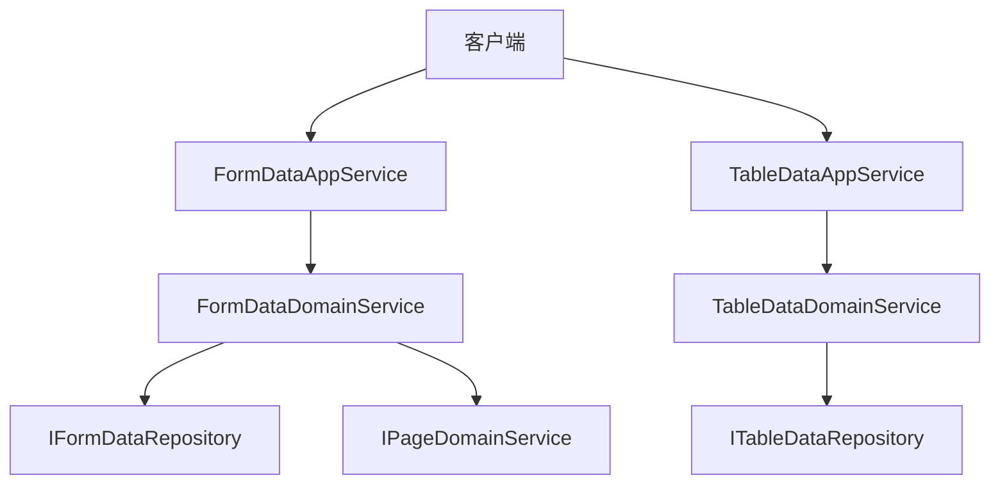
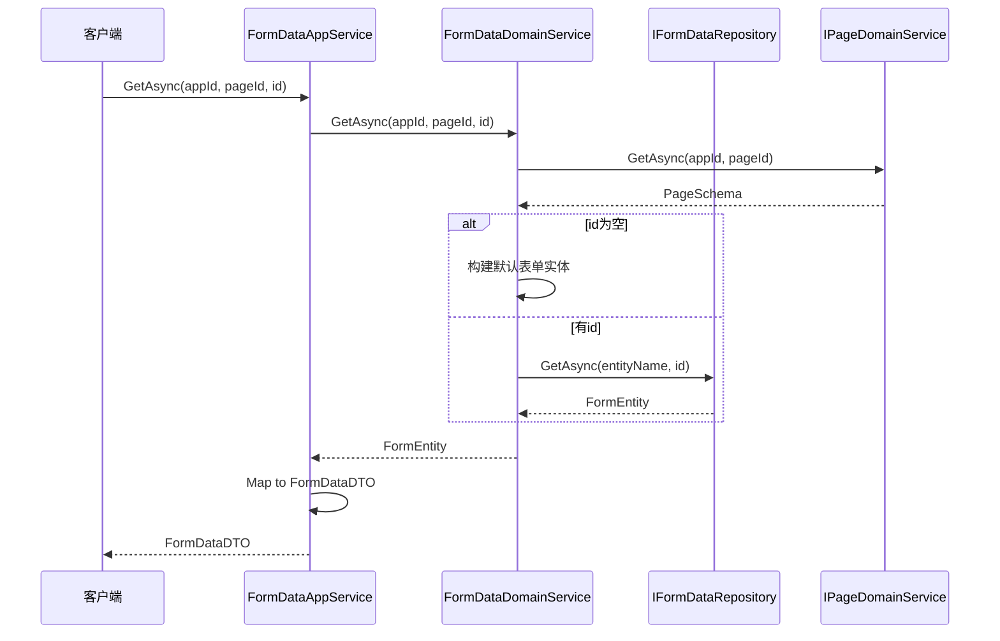

# 数据访问机制

<cite>
**本文档引用文件**  
- [FormDataAppService.cs](file://src/RenderEngine/H.LowCode.RenderEngine.Application/DataAppServices/FormDataAppService.cs)
- [TableDataAppService.cs](file://src/RenderEngine/H.LowCode.RenderEngine.Application/DataAppServices/TableDataAppService.cs)
- [FormDataDomainService.cs](file://src/RenderEngine/H.LowCode.RenderEngine.Domain/DataDomainServices/FormDataDomainService.cs)
- [TableDataDomainService.cs](file://src/RenderEngine/H.LowCode.RenderEngine.Domain/DataDomainServices/TableDataDomainService.cs)
- [IFormDataRepository.cs](file://src/RenderEngine/H.LowCode.RenderEngine.Domain/DataRepositories/IFormDataRepository.cs)
- [ITableDataRepository.cs](file://src/RenderEngine/H.LowCode.RenderEngine.Domain/DataRepositories/ITableDataRepository.cs)
- [FormDataDTO.cs](file://src/RenderEngine/H.LowCode.RenderEngine.Application.Contracts/DataDTOs/FormDataDTO.cs)
- [TableGetListInput.cs](file://src/RenderEngine/H.LowCode.RenderEngine.Application.Contracts/DataDTOs/TableGetListInput.cs)
- [LowCodeAutoMapperProfile.cs](file://src/RenderEngine/H.LowCode.RenderEngine.Application/MapperProfiles/LowCodeAutoMapperProfile.cs)
- [FormEntity.cs](file://src/Common/H.LowCode.Entity/Base/FormEntity.cs)
</cite>

## 目录
1. [简介](#简介)
2. [核心组件概览](#核心组件概览)
3. [数据访问服务分析](#数据访问服务分析)
4. [领域服务与仓储协作机制](#领域服务与仓储协作机制)
5. [DTO对象结构与映射规则](#dto对象结构与映射规则)
6. [典型调用流程与异常处理](#典型调用流程与异常处理)
7. [分页与过滤功能展望](#分页与过滤功能展望)
8. [错误排查指南](#错误排查指南)

## 简介
本文档详细阐述低代码平台中数据访问层的设计与实现，重点分析`FormDataAppService`和`TableDataAppService`所提供的API接口及其背后业务逻辑。文档涵盖服务如何通过领域服务（DomainService）协调仓储接口（Repository）完成对表单数据和表格数据的增删改查操作。同时，深入解析数据传输对象（DTO）的结构设计、AutoMapper在实体与DTO之间转换的作用机制，并提供典型使用场景与常见问题解决方案。

## 核心组件概览
系统采用分层架构设计，主要包含以下核心组件：
- **应用服务层（AppService）**：对外暴露API接口，处理请求参数与响应封装
- **领域服务层（DomainService）**：实现核心业务逻辑，协调多个仓储或服务
- **仓储接口层（Repository）**：定义数据访问契约，屏蔽底层存储细节
- **数据传输对象（DTO）**：用于服务间数据传递，避免暴露实体细节



**图示来源**  
- [FormDataAppService.cs](file://src/RenderEngine/H.LowCode.RenderEngine.Application/DataAppServices/FormDataAppService.cs)
- [FormDataDomainService.cs](file://src/RenderEngine/H.LowCode.RenderEngine.Domain/DataDomainServices/FormDataDomainService.cs)
- [IFormDataRepository.cs](file://src/RenderEngine/H.LowCode.RenderEngine.Domain/DataRepositories/IFormDataRepository.cs)

## 数据访问服务分析

### FormDataAppService 接口实现
`FormDataAppService`实现了`IFormDataAppService`接口，提供表单数据的获取、保存和删除功能。

```csharp
public async Task<FormDataDTO> GetAsync(string appId, string pageId, string id)
{
    var entity = await _formDataDomainService.GetAsync(appId, pageId, id);
    var dto = ObjectMapper.Map<FormEntity, FormDataDTO>(entity);
    return dto;
}

public async Task<bool> SaveAsync(FormDataDTO dto)
{
    var entity = ObjectMapper.Map<FormDataDTO, FormEntity>(dto);
    return await _formDataDomainService.SaveAsync(entity);
}

public async Task<bool> DeleteAsync(string appId, string pageId, string id)
{
    return await _formDataDomainService.DeleteAsync(appId, pageId, id);
}
```

该服务通过依赖注入获取`FormDataDomainService`实例，并利用`ObjectMapper`完成`FormEntity`与`FormDataDTO`之间的自动转换。

**本节来源**  
- [FormDataAppService.cs](file://src/RenderEngine/H.LowCode.RenderEngine.Application/DataAppServices/FormDataAppService.cs)

### TableDataAppService 接口实现
当前`TableDataAppService`的`GetList`方法尚未实现，仅抛出`NotImplementedException`异常。

```csharp
public async Task<TableGetListOutput> GetList(TableGetListInput input)
{
    throw new NotImplementedException();
}
```

`TableGetListInput`输入参数类目前为空，表明分页、过滤等高级功能尚未定义具体结构。

**本节来源**  
- [TableDataAppService.cs](file://src/RenderEngine/H.LowCode.RenderEngine.Application/DataAppServices/TableDataAppService.cs)
- [TableGetListInput.cs](file://src/RenderEngine/H.LowCode.RenderEngine.Application.Contracts/DataDTOs/TableGetListInput.cs)

## 领域服务与仓储协作机制

### FormDataDomainService 业务逻辑
`FormDataDomainService`负责处理表单数据的核心业务逻辑：

1. **获取数据**：根据`appId`和`pageId`查询页面元数据，确定实体名称；若`id`为空则返回默认表单结构，否则从仓储中加载具体数据。
2. **保存数据**：根据实体是否包含`Id`判断为新增或更新操作。
3. **删除数据**：同样需先获取页面元数据以确定实体名称，再调用仓储执行删除。

```csharp
public async Task<FormEntity> GetAsync(string appId, string pageId, string id)
{
    var formPageSchema = await _pageDomainService.GetAsync(appId, pageId);
    if (formPageSchema == null)
        throw new KeyNotFoundException($"page not found: appId={appId}, pageId={pageId}");

    string entityName = formPageSchema.DataSource.DataSourceValue;

    if (string.IsNullOrEmpty(id))
    {
        // 构建默认表单实体
    }

    var entity = await _formDataRepository.GetAsync(entityName, id);
    if (entity == null)
        throw new EntityNotFoundException($"Entity {entityName} Not Found: {id}");

    return entity;
}
```

**本节来源**  
- [FormDataDomainService.cs](file://src/RenderEngine/H.LowCode.RenderEngine.Domain/DataDomainServices/FormDataDomainService.cs)

### IFormDataRepository 数据访问契约
`IFormDataRepository`定义了表单数据的基本CRUD操作接口：

- `Task<bool> AddAsync(FormEntity entity)`：新增实体
- `Task<bool> UpdateAsync(FormEntity entity)`：更新实体
- `Task<FormEntity> GetAsync(string entityName, string id)`：根据实体名和ID获取数据
- `Task<bool> DeleteAsync(string entityName, string id)`：根据实体名和ID删除数据

**本节来源**  
- [IFormDataRepository.cs](file://src/RenderEngine/H.LowCode.RenderEngine.Domain/DataRepositories/IFormDataRepository.cs)

## DTO对象结构与映射规则

### FormDataDTO 结构解析
`FormDataDTO`是表单数据的主要传输对象，包含以下属性：

- `Name`：实体名称
- `Fields`：字段列表（`FormFieldDTO`类型）
- `ValidationRules`：验证规则列表

`FormFieldDTO`中`Value`属性具有特殊处理逻辑：通过`TypeName`动态解析实际类型，并使用`ConvertToRealType`方法进行类型转换，确保数据完整性。

```csharp
public object Value
{
    get
    {
        if (string.IsNullOrEmpty(TypeName))
            return new InvalidDataException(...);

        var type = Type.GetType(TypeName);
        var realValue = _value.ConvertToRealType(type);
        return realValue;
    }
}
```

**本节来源**  
- [FormDataDTO.cs](file://src/RenderEngine/H.LowCode.RenderEngine.Application.Contracts/DataDTOs/FormDataDTO.cs)

### AutoMapper 映射配置
`LowCodeAutoMapperProfile`定义了实体与DTO之间的双向映射关系：

```csharp
CreateMap<FormEntity, FormDataDTO>();
CreateMap<FormDataDTO, FormEntity>();

CreateMap<FormFieldEntity, FormFieldDTO>();
CreateMap<FormFieldDTO, FormFieldEntity>();
```

此配置使得`ObjectMapper.Map<T1, T2>()`方法能够自动完成复杂对象的属性映射，极大简化了数据转换代码。

**本节来源**  
- [LowCodeAutoMapperProfile.cs](file://src/RenderEngine/H.LowCode.RenderEngine.Application/MapperProfiles/LowCodeAutoMapperProfile.cs)

## 典型调用流程与异常处理

### 表单数据获取流程


**图示来源**  
- [FormDataAppService.cs](file://src/RenderEngine/H.LowCode.RenderEngine.Application/DataAppServices/FormDataAppService.cs)
- [FormDataDomainService.cs](file://src/RenderEngine/H.LowCode.RenderEngine.Domain/DataDomainServices/FormDataDomainService.cs)

### 异常处理机制
系统在关键节点抛出特定异常：
- `KeyNotFoundException`：页面未找到
- `EntityNotFoundException`：数据实体未找到
- `InvalidDataException`：类型解析失败或数据无效

这些异常由上层框架统一捕获并转换为HTTP错误响应。

**本节来源**  
- [FormDataDomainService.cs](file://src/RenderEngine/H.LowCode.RenderEngine.Domain/DataDomainServices/FormDataDomainService.cs)
- [FormDataDTO.cs](file://src/RenderEngine/H.LowCode.RenderEngine.Application.Contracts/DataDTOs/FormDataDTO.cs)

## 分页与过滤功能展望
当前`TableDataAppService`尚未实现分页与过滤功能。未来应扩展`TableGetListInput`类，添加如下字段：

```csharp
public class TableGetListInput
{
    public int Page { get; set; } = 1;
    public int PageSize { get; set; } = 10;
    public string Filter { get; set; }
    public string Sort { get; set; }
}
```

同时需完善`ITableDataRepository`接口，支持分页查询方法。

**本节来源**  
- [TableDataAppService.cs](file://src/RenderEngine/H.LowCode.RenderEngine.Application/DataAppServices/TableDataAppService.cs)
- [TableGetListInput.cs](file://src/RenderEngine/H.LowCode.RenderEngine.Application.Contracts/DataDTOs/TableGetListInput.cs)

## 错误排查指南

### 常见问题与解决方案

| 问题现象 | 可能原因 | 解决方案 |
|--------|--------|--------|
| 获取表单数据时报“page not found” | appId或pageId错误 | 检查前端传递的参数是否正确 |
| 保存数据失败 | 实体Name为空 | 确保DTO中Name字段已赋值，或检查默认赋值逻辑 |
| Value类型转换异常 | TypeName为空或类型不存在 | 检查组件定义中的ValueType配置 |
| 删除操作失败 | 页面元数据无法加载 | 确认页面配置文件存在且格式正确 |

### 调试建议
1. 启用日志记录，查看`FormDataDomainService`和`FormDataRepository`的执行轨迹
2. 使用调试器跟踪`ObjectMapper.Map`调用，确认DTO与实体映射是否正确
3. 检查`LazyServiceProvider.GetRequiredService<T>()`是否成功解析依赖

**本节来源**  
- [FormDataDomainService.cs](file://src/RenderEngine/H.LowCode.RenderEngine.Domain/DataDomainServices/FormDataDomainService.cs)
- [FormDataDTO.cs](file://src/RenderEngine/H.LowCode.RenderEngine.Application.Contracts/DataDTOs/FormDataDTO.cs)
- [LowCodeAutoMapperProfile.cs](file://src/RenderEngine/H.LowCode.RenderEngine.Application/MapperProfiles/LowCodeAutoMapperProfile.cs)