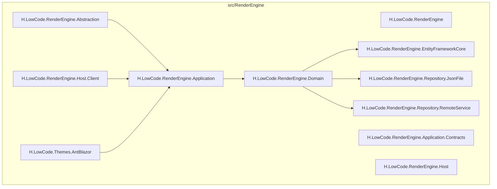
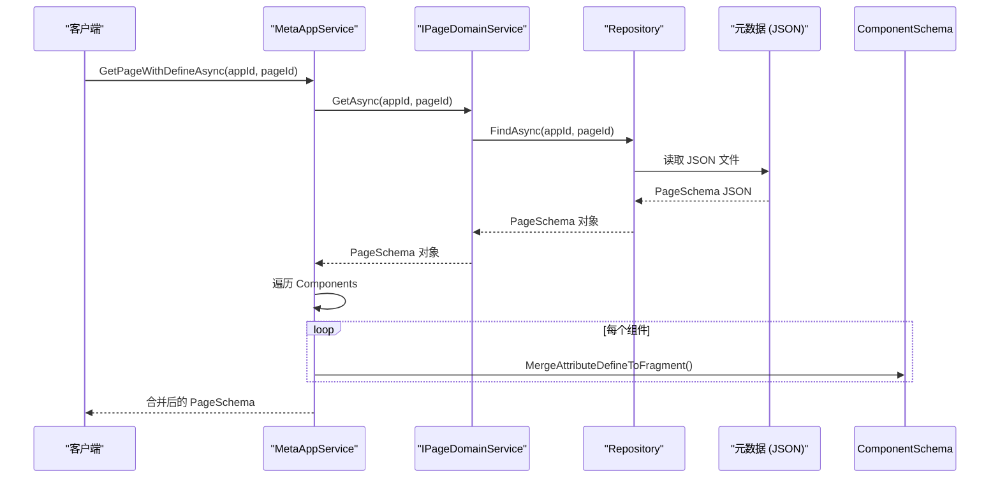
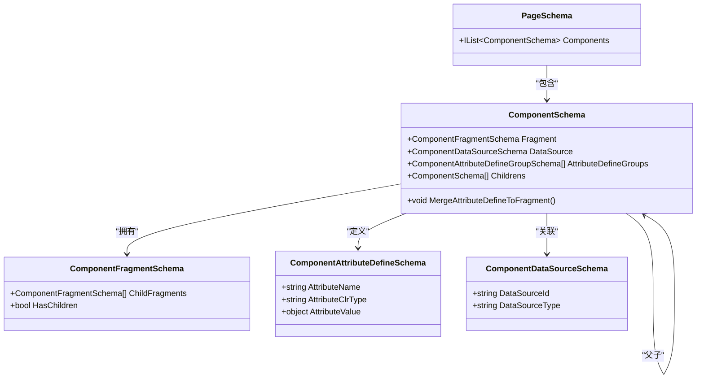
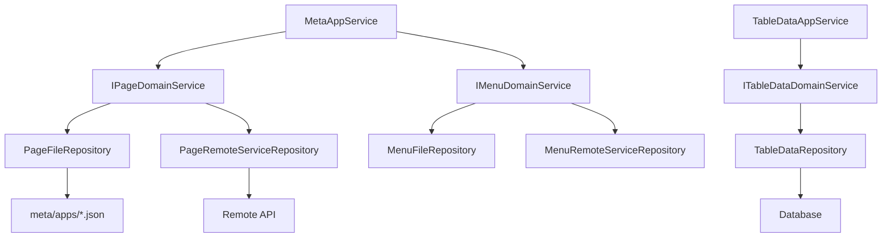

# 渲染引擎

<cite>
**本文档引用的文件**  
- [MetaAppService.cs](file://src/RenderEngine/H.LowCode.RenderEngine.Application/RenderAppServices/MetaAppService.cs)
- [PageSchema.cs](file://src/Common/H.LowCode.MetaSchema.RenderEngine/PageSchema.cs)
- [ComponentSchema.cs](file://src/Common/H.LowCode.MetaSchema.RenderEngine/ComponentSchema.cs)
- [ComponentFragmentSchema.cs](file://src/Common/H.LowCode.MetaSchema.RenderEngine/PropertySchemas/ComponentFragmentSchema.cs)
- [ComponentAttributeDefineSchema.cs](file://src/Common/H.LowCode.MetaSchema.RenderEngine/PropertySchemas/ComponentAttributeDefineSchema.cs)
- [ComponentDataSourceSchema.cs](file://src/Common/H.LowCode.MetaSchema.RenderEngine/DataSourceSchemas/ComponentDataSourceSchema.cs)
- [RenderEngineLowCodeComponentBase.cs](file://src/RenderEngine/H.LowCode.RenderEngine.Abstraction/RenderEngineLowCodeComponentBase.cs)
- [AppSchema.cs](file://src/Common/H.LowCode.MetaSchema.RenderEngine/AppSchema.cs)
- [MenuSchema.cs](file://src/Common/H.LowCode.MetaSchema/MenuSchema.cs)
- [AntBlazorThemeModule.cs](file://src/RenderEngine/H.LowCode.Themes.AntBlazor/AntBlazorThemeModule.cs)
- [FormDataAppService.cs](file://src/RenderEngine/H.LowCode.RenderEngine.Application/DataAppServices/FormDataAppService.cs)
- [TableDataAppService.cs](file://src/RenderEngine/H.LowCode.RenderEngine.Application/DataAppServices/TableDataAppService.cs)
- [AppFileRepository.cs](file://src/RenderEngine/H.LowCode.RenderEngine.Repository.JsonFile/Repositories/AppFileRepository.cs)
- [PageFileRepository.cs](file://src/RenderEngine/H.LowCode.RenderEngine.Repository.JsonFile/Repositories/PageFileRepository.cs)
</cite>

## 目录
1. [简介](#简介)
2. [项目结构](#项目结构)
3. [核心组件](#核心组件)
4. [架构概述](#架构概述)
5. [详细组件分析](#详细组件分析)
6. [依赖分析](#依赖分析)
7. [性能考量](#性能考量)
8. [故障排除指南](#故障排除指南)
9. [结论](#结论)

## 简介
本技术文档深入解析低代码平台中的**渲染引擎**模块，详细阐述其运行时行为与架构设计。渲染引擎的核心职责是从元数据中读取配置，并动态生成用户界面。其设计强调轻量性与高性能，通过元数据驱动的方式实现灵活的UI构建。本文档将从启动流程、页面渲染机制、主题系统、数据访问等方面全面剖析该模块的实现原理，为开发者提供清晰的技术参考。

## 项目结构
渲染引擎模块采用分层架构设计，各子模块职责清晰，共同协作完成UI的动态渲染。其目录结构体现了典型的领域驱动设计（DDD）模式。



**Diagram sources**
- [RenderEngineModule.cs](file://src/RenderEngine/H.LowCode.RenderEngine/RenderEngineModule.cs)
- [RenderEngineApplicationModule.cs](file://src/RenderEngine/H.LowCode.RenderEngine.Application/RenderEngineApplicationModule.cs)

**中文说明**：
- **H.LowCode.RenderEngine.Abstraction**：定义了渲染引擎的核心抽象基类，如 `RenderEngineLowCodeComponentBase`，为所有动态组件提供基础能力。
- **H.LowCode.RenderEngine.Application**：应用服务层，包含 `MetaAppService` 等服务，负责协调领域逻辑，提供API接口。
- **H.LowCode.RenderEngine.Domain**：领域层，包含核心业务逻辑和领域服务，如 `IPageDomainService` 和 `IMenuDomainService`。
- **H.LowCode.RenderEngine.EntityFrameworkCore**：数据访问层，基于Entity Framework Core实现，负责与数据库交互。
- **H.LowCode.RenderEngine.Repository.JsonFile** 和 **RemoteService**：两种元数据存储的实现，分别支持从本地JSON文件或远程服务加载元数据。
- **H.LowCode.Themes.AntBlazor**：主题模块，实现了基于Ant Design Blazor的UI外观定制。

## 核心组件
渲染引擎的核心组件围绕元数据的加载、解析和渲染展开。

**Section sources**
- [MetaAppService.cs](file://src/RenderEngine/H.LowCode.RenderEngine.Application/RenderAppServices/MetaAppService.cs)
- [PageSchema.cs](file://src/Common/H.LowCode.MetaSchema.RenderEngine/PageSchema.cs)
- [ComponentSchema.cs](file://src/Common/H.LowCode.MetaSchema.RenderEngine/ComponentSchema.cs)

## 架构概述
渲染引擎的架构遵循清晰的分层模式，从元数据源到最终UI呈现，数据流和控制流明确。



**Diagram sources**
- [MetaAppService.cs](file://src/RenderEngine/H.LowCode.RenderEngine.Application/RenderAppServices/MetaAppService.cs)
- [PageFileRepository.cs](file://src/RenderEngine/H.LowCode.RenderEngine.Repository.JsonFile/Repositories/PageFileRepository.cs)

**中文说明**：
1.  **启动与元数据加载**：渲染引擎启动后，通过 `MetaAppService` 提供的接口，从 `meta/apps` 目录下的JSON文件（或远程服务）加载 `AppSchema`、`PageSchema` 等元数据对象。
2.  **元数据查询**：`MetaAppService` 作为统一的元数据查询入口，封装了对底层 `IAppDomainService`、`IPageDomainService` 等领域服务的调用。
3.  **页面渲染流程**：当需要渲染一个页面时，引擎获取 `PageSchema`，该对象包含一个组件树（`Components`）。引擎会遍历树中的每个 `ComponentSchema`，根据其类型实例化对应的 `LowCodeComponentBase` 派生组件。
4.  **数据绑定与事件**：组件的属性（如文本、样式）通过 `ComponentFragmentSchema` 中的 `Attributes` 进行数据绑定。事件处理逻辑则通过元数据中的 `EventSchema` 进行注册。
5.  **主题定制**：`AntBlazorThemeModule` 等主题模块通过注入特定的CSS和组件渲染逻辑，实现UI外观的统一和定制。

## 详细组件分析

### 元数据服务分析
`MetaAppService` 是渲染引擎与元数据之间的桥梁，其核心方法 `GetPageWithDefineAsync` 展示了元数据的处理逻辑。

```csharp
public async Task<PageSchema> GetPageWithDefineAsync(string appId, string pageId)
{
    var pageSchema = await _pageDomainService.GetAsync(appId, pageId);

    if (pageSchema?.Components != null)
    {
        foreach (var component in pageSchema.Components)
        {
            if (component == null)
                continue;

            component.MergeAttributeDefineToFragment();
        }
    }

    return pageSchema;
}
```

此方法在获取页面元数据后，会调用每个组件的 `MergeAttributeDefineToFragment` 方法，将设计时定义的属性（`AttributeDefineGroups`）合并到运行时的渲染片段（`Fragment`）中，确保组件能正确渲染。

**Section sources**
- [MetaAppService.cs](file://src/RenderEngine/H.LowCode.RenderEngine.Application/RenderAppServices/MetaAppService.cs)

### 页面与组件元数据结构分析
渲染引擎的元数据结构是其动态性的基础，核心类之间的关系如下：



**Diagram sources**
- [PageSchema.cs](file://src/Common/H.LowCode.MetaSchema.RenderEngine/PageSchema.cs)
- [ComponentSchema.cs](file://src/Common/H.LowCode.MetaSchema.RenderEngine/ComponentSchema.cs)
- [ComponentFragmentSchema.cs](file://src/Common/H.LowCode.MetaSchema.RenderEngine/PropertySchemas/ComponentFragmentSchema.cs)

**中文说明**：
- **PageSchema**：页面元数据的根对象，包含一个 `Components` 列表，代表页面的组件树。
- **ComponentSchema**：组件元数据的核心，包含：
    - `Fragment`：定义了组件在UI上的渲染形态和属性。
    - `DataSource`：关联了组件所需的数据源（如API、数据库查询）。
    - `AttributeDefineGroups`：设计时定义的属性组，通过 `MergeAttributeDefineToFragment()` 方法合并到 `Fragment` 中。
    - `Childrens`：支持嵌套的子组件，形成树状结构。
- **ComponentFragmentSchema**：渲染片段，其 `ChildFragments` 属性支持更复杂的嵌套渲染。
- **ComponentDataSourceSchema**：定义了组件数据源的ID和类型，用于 `TableDataAppService` 或 `FormDataAppService` 与后端API或数据库进行交互，获取真实数据。

### 主题系统分析
主题系统通过 `H.LowCode.Themes.AntBlazor` 模块实现，它提供了一套基于Ant Design Blazor的CSS样式和组件渲染模板（如 `ComponentRender.razor.css`），从而实现UI外观的统一和品牌化定制。

**Section sources**
- [AntBlazorThemeModule.cs](file://src/RenderEngine/H.LowCode.Themes.AntBlazor/AntBlazorThemeModule.cs)

## 依赖分析
渲染引擎的依赖关系清晰，体现了低耦合的设计原则。



**Diagram sources**
- [MetaAppService.cs](file://src/RenderEngine/H.LowCode.RenderEngine.Application/RenderAppServices/MetaAppService.cs)
- [AppFileRepository.cs](file://src/RenderEngine/H.LowCode.RenderEngine.Repository.JsonFile/Repositories/AppFileRepository.cs)
- [TableDataAppService.cs](file://src/RenderEngine/H.LowCode.RenderEngine.Application/DataAppServices/TableDataAppService.cs)

**中文说明**：
- **内部依赖**：上层模块（Application）依赖下层模块（Domain），Domain层通过依赖注入使用具体的Repository实现。
- **外部依赖**：数据访问层（EntityFrameworkCore）依赖于数据库，而Repository.JsonFile则依赖于文件系统中的JSON元数据。

## 性能考量
渲染引擎的设计充分考虑了性能：
1.  **轻量性**：核心逻辑集中在元数据解析和组件实例化，避免了复杂的运行时计算。
2.  **高效加载**：元数据以JSON格式存储，解析速度快。`FileRepository` 实现了高效的文件读取。
3.  **按需加载**：通常只加载当前页面所需的元数据，减少了内存占用。
4.  **强依赖元数据**：系统的性能和灵活性高度依赖于元数据结构的合理设计。结构清晰、冗余少的元数据能显著提升渲染效率。

## 故障排除指南
- **页面无法渲染**：检查 `meta/apps/[appId]/page/[pageId].json` 文件是否存在且格式正确。确认 `PageSchema` 中的组件ID是否能在 `meta/parts/componentParts` 中找到对应的定义。
- **组件属性不生效**：检查 `ComponentSchema` 的 `AttributeDefineGroups` 是否正确配置，并确认 `MergeAttributeDefineToFragment()` 方法是否被成功调用。
- **数据无法加载**：检查 `ComponentDataSourceSchema` 中的 `DataSourceId` 是否正确，并确认 `TableDataAppService` 或 `FormDataAppService` 能否成功连接到后端数据源。

**Section sources**
- [MetaAppService.cs](file://src/RenderEngine/H.LowCode.RenderEngine.Application/RenderAppServices/MetaAppService.cs)
- [ComponentSchema.cs](file://src/Common/H.LowCode.MetaSchema.RenderEngine/ComponentSchema.cs)

## 结论
渲染引擎是低代码平台的核心执行单元，它通过解析 `meta` 目录下的JSON元数据，动态构建出功能完整的用户界面。其架构设计遵循分层原则，职责分明，通过 `MetaAppService` 统一对外提供元数据查询服务。页面渲染流程高效，能够根据 `PageSchema` 中的组件树实例化组件，并处理数据绑定与事件。主题系统和灵活的数据访问机制（支持本地文件和远程服务）进一步增强了其可定制性和适应性。该引擎的轻量性和高性能使其非常适合快速构建和部署动态应用。