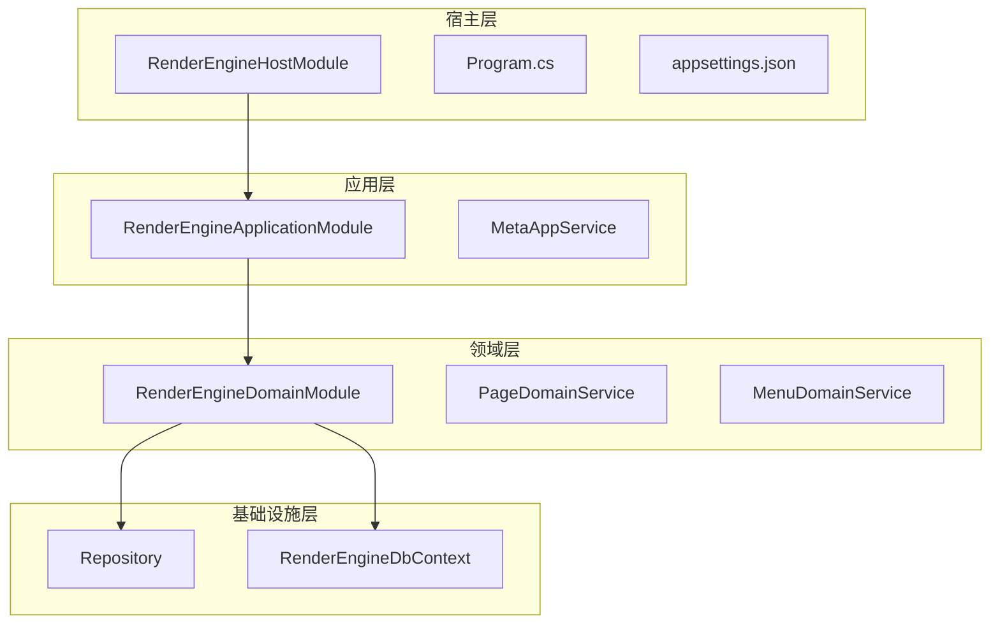
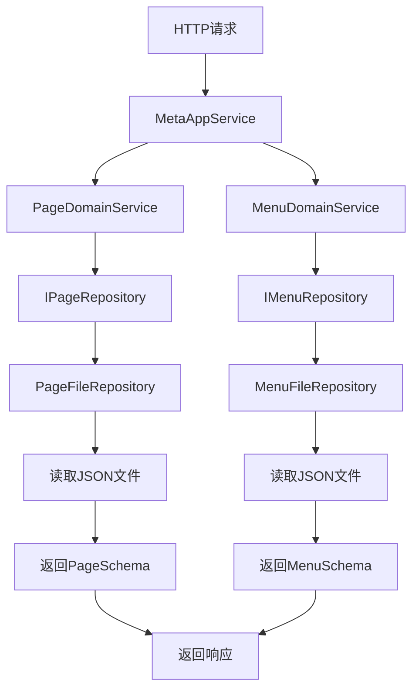
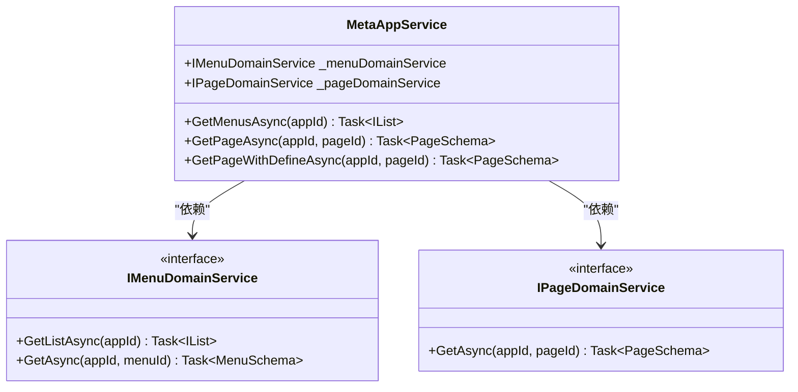
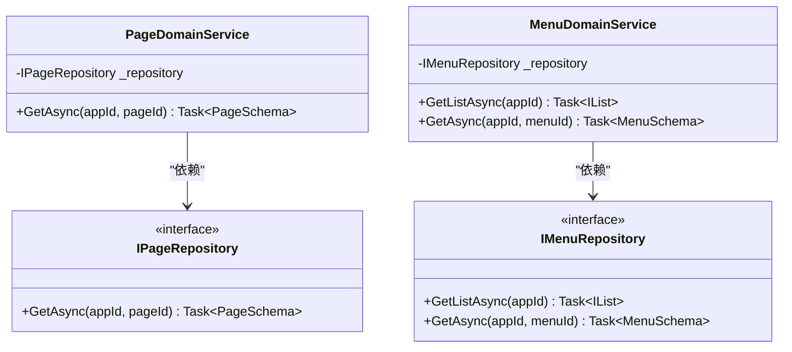
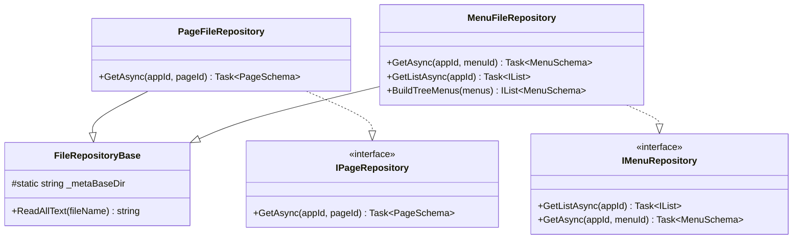
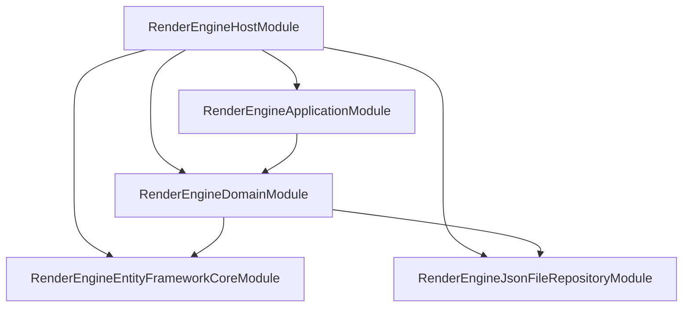

# 渲染引擎架构设计

<cite>
**本文档引用的文件**  
- [RenderEngineHostModule.cs](file://src/RenderEngine/H.LowCode.RenderEngine.Host/RenderEngineHostModule.cs)
- [Program.cs](file://src/RenderEngine/H.LowCode.RenderEngine.Host/Program.cs)
- [appsettings.json](file://src/RenderEngine/H.LowCode.RenderEngine.Host/appsettings.json)
- [MetaAppService.cs](file://src/RenderEngine/H.LowCode.RenderEngine.Application/RenderAppServices/MetaAppService.cs)
- [PageDomainService.cs](file://src/RenderEngine/H.LowCode.RenderEngine.Domain/MetaDomainServices/PageDomainService.cs)
- [MenuDomainService.cs](file://src/RenderEngine/H.LowCode.RenderEngine.Domain/MetaDomainServices/MenuDomainService.cs)
- [IPageRepository.cs](file://src/RenderEngine/H.LowCode.RenderEngine.Domain/MetaRepositories/IPageRepository.cs)
- [IMenuRepository.cs](file://src/RenderEngine/H.LowCode.RenderEngine.Domain/MetaRepositories/IMenuRepository.cs)
- [PageFileRepository.cs](file://src/RenderEngine/H.LowCode.RenderEngine.Repository.JsonFile/Repositories/PageFileRepository.cs)
- [MenuFileRepository.cs](file://src/RenderEngine/H.LowCode.RenderEngine.Repository.JsonFile/Repositories/MenuFileRepository.cs)
- [FileRepositoryBase.cs](file://src/RenderEngine/H.LowCode.RenderEngine.Repository.JsonFile/Base/FileRepositoryBase.cs)
- [RenderEngineDbContext.cs](file://src/RenderEngine/H.LowCode.RenderEngine.EntityFrameworkCore/EntityFrameworkCore/RenderEngineDbContext.cs)
- [RenderEngineApplicationModule.cs](file://src/RenderEngine/H.LowCode.RenderEngine.Application/RenderEngineApplicationModule.cs)
</cite>

## 目录
1. [简介](#简介)
2. [项目结构](#项目结构)
3. [核心组件](#核心组件)
4. [架构概述](#架构概述)
5. [详细组件分析](#详细组件分析)
6. [依赖分析](#依赖分析)
7. [性能考虑](#性能考虑)
8. [故障排除指南](#故障排除指南)
9. [结论](#结论)

## 简介
本文档旨在全面描述渲染引擎的架构设计，涵盖其分层结构：宿主层（Host）、应用层（Application）、领域层（Domain）和基础设施层（EntityFrameworkCore/Repository）。文档详细说明了各模块的职责划分与依赖关系，特别是基于ABP框架的模块化加载机制下的初始化流程。同时，解释了如何通过依赖注入整合MetaAppService、数据服务与存储实现，并涵盖启动过程中的配置加载、数据库上下文初始化以及元数据服务注册。最后，提供系统上下文图和组件交互图，说明请求从HTTP入口到元数据输出的完整路径。

## 项目结构
渲染引擎采用分层架构设计，各层职责明确，通过ABP模块化机制进行组织和加载。整体结构分为宿主层、应用层、领域层和基础设施层，同时支持多种存储实现方式（如JSON文件和数据库）。

**图示来源**
- [RenderEngineHostModule.cs](file://src/RenderEngine/H.LowCode.RenderEngine.Host/RenderEngineHostModule.cs)
- [RenderEngineApplicationModule.cs](file://src/RenderEngine/H.LowCode.RenderEngine.Application/RenderEngineApplicationModule.cs)
- [RenderEngineDbContext.cs](file://src/RenderEngine/H.LowCode.RenderEngine.EntityFrameworkCore/EntityFrameworkCore/RenderEngineDbContext.cs)

**本节来源**
- [RenderEngineHostModule.cs](file://src/RenderEngine/H.LowCode.RenderEngine.Host/RenderEngineHostModule.cs)
- [RenderEngineApplicationModule.cs](file://src/RenderEngine/H.LowCode.RenderEngine.Application/RenderEngineApplicationModule.cs)

## 核心组件
渲染引擎的核心组件包括MetaAppService、领域服务（Domain Services）和存储库（Repositories），它们共同协作完成元数据的获取与处理。MetaAppService作为应用服务入口，通过依赖注入调用领域服务，领域服务再调用存储库从JSON文件或数据库中获取原始数据。

**本节来源**
- [MetaAppService.cs](file://src/RenderEngine/H.LowCode.RenderEngine.Application/RenderAppServices/MetaAppService.cs)
- [PageDomainService.cs](file://src/RenderEngine/H.LowCode.RenderEngine.Domain/MetaDomainServices/PageDomainService.cs)
- [MenuDomainService.cs](file://src/RenderEngine/H.LowCode.RenderEngine.Domain/MetaDomainServices/MenuDomainService.cs)

## 架构概述
渲染引擎采用典型的分层架构，各层之间通过接口进行解耦，确保高内聚低耦合。宿主层负责应用的启动和模块加载，应用层提供API接口，领域层封装业务逻辑，基础设施层负责数据持久化。

**图示来源**
- [MetaAppService.cs](file://src/RenderEngine/H.LowCode.RenderEngine.Application/RenderAppServices/MetaAppService.cs)
- [PageDomainService.cs](file://src/RenderEngine/H.LowCode.RenderEngine.Domain/MetaDomainServices/PageDomainService.cs)
- [MenuDomainService.cs](file://src/RenderEngine/H.LowCode.RenderEngine.Domain/MetaDomainServices/MenuDomainService.cs)
- [PageFileRepository.cs](file://src/RenderEngine/H.LowCode.RenderEngine.Repository.JsonFile/Repositories/PageFileRepository.cs)
- [MenuFileRepository.cs](file://src/RenderEngine/H.LowCode.RenderEngine.Repository.JsonFile/Repositories/MenuFileRepository.cs)

## 详细组件分析

### MetaAppService 分析
MetaAppService 是渲染引擎的应用服务，负责处理来自前端的元数据请求。它通过LazyServiceProvider获取领域服务的实例，实现了延迟加载和依赖解耦。

#### 类图

**图示来源**
- [MetaAppService.cs](file://src/RenderEngine/H.LowCode.RenderEngine.Application/RenderAppServices/MetaAppService.cs)
- [IMenuDomainService.cs](file://src/RenderEngine/H.LowCode.RenderEngine.Domain/MetaRepositories/IMenuRepository.cs)
- [IPageDomainService.cs](file://src/RenderEngine/H.LowCode.RenderEngine.Domain/MetaRepositories/IPageRepository.cs)

**本节来源**
- [MetaAppService.cs](file://src/RenderEngine/H.LowCode.RenderEngine.Application/RenderAppServices/MetaAppService.cs)

### 领域服务分析
领域服务封装了业务逻辑，PageDomainService和MenuDomainService分别负责页面和菜单的业务处理。它们通过构造函数注入对应的存储库接口，实现了业务逻辑与数据访问的分离。

#### 类图

**图示来源**
- [PageDomainService.cs](file://src/RenderEngine/H.LowCode.RenderEngine.Domain/MetaDomainServices/PageDomainService.cs)
- [MenuDomainService.cs](file://src/RenderEngine/H.LowCode.RenderEngine.Domain/MetaDomainServices/MenuDomainService.cs)
- [IPageRepository.cs](file://src/RenderEngine/H.LowCode.RenderEngine.Domain/MetaRepositories/IPageRepository.cs)
- [IMenuRepository.cs](file://src/RenderEngine/H.LowCode.RenderEngine.Domain/MetaRepositories/IMenuRepository.cs)

**本节来源**
- [PageDomainService.cs](file://src/RenderEngine/H.LowCode.RenderEngine.Domain/MetaDomainServices/PageDomainService.cs)
- [MenuDomainService.cs](file://src/RenderEngine/H.LowCode.RenderEngine.Domain/MetaDomainServices/MenuDomainService.cs)

### 存储库分析
存储库层负责数据的持久化操作，支持JSON文件和数据库两种实现方式。FileRepositoryBase提供了通用的文件读取功能，具体的存储库如PageFileRepository和MenuFileRepository继承该基类并实现特定接口。

#### 类图

**图示来源**
- [FileRepositoryBase.cs](file://src/RenderEngine/H.LowCode.RenderEngine.Repository.JsonFile/Base/FileRepositoryBase.cs)
- [PageFileRepository.cs](file://src/RenderEngine/H.LowCode.RenderEngine.Repository.JsonFile/Repositories/PageFileRepository.cs)
- [MenuFileRepository.cs](file://src/RenderEngine/H.LowCode.RenderEngine.Repository.JsonFile/Repositories/MenuFileRepository.cs)
- [IPageRepository.cs](file://src/RenderEngine/H.LowCode.RenderEngine.Domain/MetaRepositories/IPageRepository.cs)
- [IMenuRepository.cs](file://src/RenderEngine/H.LowCode.RenderEngine.Domain/MetaRepositories/IMenuRepository.cs)

**本节来源**
- [FileRepositoryBase.cs](file://src/RenderEngine/H.LowCode.RenderEngine.Repository.JsonFile/Base/FileRepositoryBase.cs)
- [PageFileRepository.cs](file://src/RenderEngine/H.LowCode.RenderEngine.Repository.JsonFile/Repositories/PageFileRepository.cs)
- [MenuFileRepository.cs](file://src/RenderEngine/H.LowCode.RenderEngine.Repository.JsonFile/Repositories/MenuFileRepository.cs)

## 依赖分析
渲染引擎通过ABP框架的依赖注入机制管理组件间的依赖关系。宿主模块RenderEngineHostModule通过[DependsOn]特性声明了对应用层、领域层和基础设施层模块的依赖，确保模块按正确顺序加载。

**图示来源**
- [RenderEngineHostModule.cs](file://src/RenderEngine/H.LowCode.RenderEngine.Host/RenderEngineHostModule.cs)
- [RenderEngineApplicationModule.cs](file://src/RenderEngine/H.LowCode.RenderEngine.Application/RenderEngineApplicationModule.cs)

**本节来源**
- [RenderEngineHostModule.cs](file://src/RenderEngine/H.LowCode.RenderEngine.Host/RenderEngineHostModule.cs)
- [RenderEngineApplicationModule.cs](file://src/RenderEngine/H.LowCode.RenderEngine.Application/RenderEngineApplicationModule.cs)

## 性能考虑
渲染引擎在性能方面进行了多项优化：
1. 使用LazyServiceProvider实现领域服务的延迟加载，减少启动时的资源消耗。
2. 在数据库上下文RenderEngineDbContext中使用ReadOnlySaveChangesInterceptor拦截器，避免不必要的保存操作。
3. JSON文件存储库中禁用变更跟踪（IsChangeTrackingEnabled = false），提高读取性能。
4. 菜单数据在加载后构建成树形结构并排序，减少前端处理开销。

## 故障排除指南
### 常见问题
1. **无法读取JSON文件**：检查appsettings.json中的Meta.appsFilePath配置路径是否正确，确保文件存在且格式合法。
2. **依赖注入失败**：确认模块间的[DependsOn]依赖关系是否完整，特别是宿主模块对其他模块的引用。
3. **数据库连接失败**：检查ConnectionStrings配置，确保数据库服务正常运行。
4. **菜单显示顺序错误**：确认菜单JSON文件中的Order字段是否正确设置。

**本节来源**
- [appsettings.json](file://src/RenderEngine/H.LowCode.RenderEngine.Host/appsettings.json)
- [RenderEngineHostModule.cs](file://src/RenderEngine/H.LowCode.RenderEngine.Host/RenderEngineHostModule.cs)
- [RenderEngineDbContext.cs](file://src/RenderEngine/H.LowCode.RenderEngine.EntityFrameworkCore/EntityFrameworkCore/RenderEngineDbContext.cs)

## 结论
渲染引擎采用清晰的分层架构和模块化设计，通过ABP框架实现了组件间的松耦合和依赖注入。系统支持多种数据存储方式，具有良好的扩展性和维护性。启动流程通过宿主模块统一管理，配置加载和数据库初始化过程简洁明了。整体架构设计合理，能够有效支持低代码平台的元数据渲染需求。