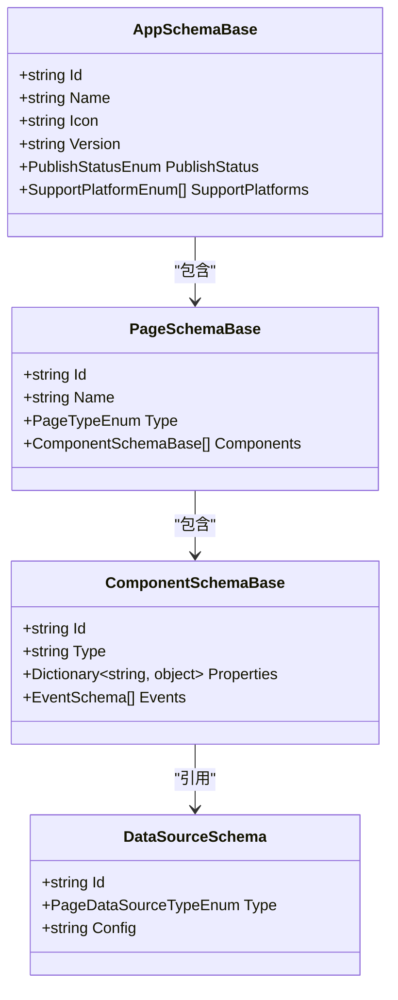

# 目录结构详解

<cite>
**本文档引用文件**  
- [AppSchemaBase.cs](file://src/Common/H.LowCode.MetaSchema/AppSchemaBase.cs)
- [meta](file://meta)
- [Common](file://src/Common)
- [DesignEngine](file://src/DesignEngine)
- [RenderEngine](file://src/RenderEngine)
- [Tools](file://src/Tools)
- [README.md](file://README.md)
- [TODO.md](file://TODO.md)
</cite>

## 目录结构

本项目采用模块化分层架构，整体目录结构清晰，职责分明。主要分为 `meta`（元数据）、`src`（源码）和工具类目录，适用于低代码平台的可视化设计与运行时渲染场景。

```mermaid
graph TD
A[LowCode项目] --> B[meta]
A --> C[src]
A --> D[Tools]
A --> E[README.md]
A --> F[TODO.md]
A --> G[global.json]
B --> B1[apps]
B --> B2[parts/componentParts/antdesign]
C --> C1[Common]
C --> C2[DesignEngine]
C --> C3[RenderEngine]
C1 --> C1a[H.LowCode.ComponentBase]
C1 --> C1b[H.LowCode.MetaSchema]
C1 --> C1c[H.LowCode.Entity]
C1 --> C1d[H.LowCode.Configuration]
C2 --> C2a[H.LowCode.DesignEngine.Application]
C2 --> C2b[H.LowCode.DesignEngine.Domain]
C2 --> C2c[H.LowCode.DesignEngine.EntityFrameworkCore]
C2 --> C2d[H.LowCode.DesignEngine.Host]
C2 --> C2e[H.LowCode.DesignEngine.Host.Client]
C3 --> C3a[H.LowCode.RenderEngine.Application]
C3 --> C3b[H.LowCode.RenderEngine.Domain]
C3 --> C3c[H.LowCode.RenderEngine.EntityFrameworkCore]
C3 --> C3d[H.LowCode.RenderEngine.Host]
C3 --> C3e[H.LowCode.RenderEngine.Host.Client]
C3 --> C3f[H.LowCode.Themes.AntBlazor]
```



**图示来源**  
- [项目结构](file://.)

## meta目录：元数据定义中心

`meta` 目录用于存放低代码平台中所有应用和组件的元数据定义，采用 JSON 文件形式存储，实现配置驱动的灵活架构。

### 应用元数据（apps）

该目录下存放具体应用的配置信息，如 `caseapp` 和 `testapp`。每个应用包含以下子目录：

- **datasource**：定义数据源配置，如 API、SQL 查询等，文件如 `iumn5yg5t.json`。
- **menu**：菜单结构定义，控制应用导航，文件如 `5omcgxevf.json`。
- **page**：页面布局与组件配置，描述页面结构，文件如 `0lgu6xpop.json`。
- **应用主配置**：如 `caseapp.json`，继承自 `AppSchemaBase`，包含应用 ID、名称、图标、版本、发布状态等核心属性。

```json
{
  "id": "caseapp",
  "n": "案例应用",
  "icon": "book",
  "v": "1.0.0",
  "pub": 1,
  "platform": [0]
}
```

### 组件部件元数据（parts/componentParts）

存放可视化设计器中可拖拽的组件物料定义，基于 Ant Design 组件库封装。每个 JSON 文件代表一个可复用的组件模板（如按钮、表单字段），包含属性定义、样式、事件等元信息，支持设计时动态加载与渲染。

**本节来源**  
- [meta/apps/caseapp](file://meta/apps/caseapp)
- [meta/parts/componentParts/antdesign](file://meta/parts/componentParts/antdesign)

## Common模块：跨引擎共享基础

`src/Common` 模块为整个低代码平台提供通用基础类与元模型定义，被 `DesignEngine` 和 `RenderEngine` 共同引用，确保设计与运行时的一致性。

### 核心元数据结构（H.LowCode.MetaSchema）

该命名空间定义了平台的核心元数据模型，采用基类继承方式组织：

- **AppSchemaBase.cs**：应用元数据基类，包含名称、图标、版本、发布状态（`PublishStatusEnum`）、支持平台（`SupportPlatformEnum`）等。
- **PageSchemaBase.cs**：页面元数据基类。
- **ComponentSchemaBase.cs**：组件元数据基类。
- **DataSourceSchema.cs**：数据源元数据，支持 API、SQL、选项列表等多种类型。
- **PropertySchemas**：属性定义，如 `ValidationRuleSchema`（校验规则）、`EventSchema`（事件绑定）、`TableColumnSchema`（表格列配置）。



**图示来源**  
- [AppSchemaBase.cs](file://src/Common/H.LowCode.MetaSchema/AppSchemaBase.cs)
- [PageSchemaBase.cs](file://src/Common/H.LowCode.MetaSchema/PageSchemaBase.cs)
- [ComponentSchemaBase.cs](file://src/Common/H.LowCode.MetaSchema/ComponentSchemaBase.cs)

### 设计与渲染专用元模型

- **H.LowCode.MetaSchema.DesignEngine**：专为设计器扩展的元模型，如 `ComponentPartsSchema`、`ComponentPartsAttributeDefineSchema`，用于描述组件物料的可配置项。
- **H.LowCode.MetaSchema.RenderEngine**：运行时渲染专用模型，如 `AppSchema`、`ComponentSchema`，可能包含优化后的结构。

### 基础设施类

- **H.LowCode.ComponentBase**：提供 Blazor 组件基类，如 `LowCodeComponentBase`、`LowCodePageComponentBase`，封装通用状态管理与生命周期。
- **H.LowCode.Entity**：实体管理，包含 `EntityBase` 基类、`EntityFactory` 工厂类及动态实体构建工具。
- **H.LowCode.Configuration.Options**：配置选项类，如 `MetaOption`、`SiteOption`，用于依赖注入配置。

**本节来源**  
- [Common](file://src/Common)

## DesignEngine：可视化设计引擎

`DesignEngine` 模块实现低代码平台的可视化设计功能，基于 ABP 框架分层设计，支持服务端与客户端协同。

### 分层架构

遵循典型的领域驱动设计（DDD）分层：

- **Application**：应用服务层，如 `PageAppService`、`MenuAppService`，处理业务用例。
- **Application.Contracts**：应用服务契约，定义接口如 `IPageAppService` 和 DTO。
- **Domain**：领域层，包含领域服务（`PageDomainService`）和仓储接口（`IPageRepository`）。
- **EntityFrameworkCore**：数据访问层，实现仓储（`PageFileRepository`）和 `DbContext`。
- **Model**：数据传输对象（DTO）模型。

### 多仓储支持

- **Repository.JsonFile**：基于文件系统的仓储实现，直接读写 `meta` 目录下的 JSON 文件，适用于开发与静态部署。
- **Repository.RemoteService**：远程服务仓储，通过 HTTP 调用后端 API，适用于云部署。

### 宿主模块（Host）

- **H.LowCode.DesignEngine.Host**：服务端宿主，包含 `Program.cs` 和 `appsettings.json`，启动 ASP.NET Core 服务。
- **H.LowCode.DesignEngine.Host.Client**：客户端宿主，用于 Blazor WebAssembly 模式，包含客户端配置。

### 设计器基础组件

- **H.LowCode.DesignEngineBase**：提供拖拽组件基类（`DraggableItem`）、状态服务（`DragDropStateService`）等。
- **H.LowCode.PartsDesignEngine**：组件物料设计专用模块，增强物料管理功能。

**本节来源**  
- [DesignEngine](file://src/DesignEngine)

## RenderEngine：运行时渲染引擎

`RenderEngine` 模块负责将 `meta` 中的元数据在运行时动态渲染为可交互的 Web 页面。

### 核心职责

- **MetaAppService**：获取应用、页面、菜单等元数据。
- **DataAppServices**：处理表单（`FormDataAppService`）和表格（`TableDataAppService`）的数据读写。

### 主题支持

- **H.LowCode.Themes.AntBlazor**：集成 Ant Design Blazor 组件库，提供 `ComponentRender` 组件渲染器和主题样式。

### 宿主与客户端

与 `DesignEngine` 类似，包含 `Host`（服务端）和 `Host.Client`（客户端），支持服务端渲染（SSR）和 WebAssembly 模式。

**本节来源**  
- [RenderEngine](file://src/RenderEngine)

## Tools：工具模块

提供平台维护与迁移工具。

### H.LowCode.DbMigrator

基于 Entity Framework Core 的数据库迁移工具，用于管理 `DesignEngine` 和 `RenderEngine` 的数据库模式。

- **MigrationGenerator**：生成迁移脚本。
- **MigrationServices**：执行迁移逻辑。
- **Migrations**：存放迁移文件，如 `20250225020741_Initial.cs`。

### H.LowCode.MetaMigrator

元数据迁移工具，用于在不同环境间同步 `meta` 目录的 JSON 配置。当前实现为占位程序。

**本节来源**  
- [Tools](file://src/Tools)

## 模块依赖与解耦设计

项目通过清晰的依赖关系实现高内聚、低耦合：

- **Common** 为 `DesignEngine` 和 `RenderEngine` 提供共享契约，二者均依赖 `Common`，但互不依赖。
- **meta** 作为配置中心，被 `DesignEngine.Repository.JsonFile` 和 `RenderEngine.Repository.JsonFile` 直接读取，实现配置与代码分离。
- **Host.Client** 模块允许在 SSR 模式下，服务端（Host）与客户端（Host.Client）共享配置（`appsettings.json`），实现无缝集成。
- 使用接口（如 `IPageRepository`）和依赖注入，可灵活切换 `JsonFile` 与 `RemoteService` 仓储实现。

**本节来源**  
- [项目结构](file://.)
- [DesignEngine](file://src/DesignEngine)
- [RenderEngine](file://src/RenderEngine)