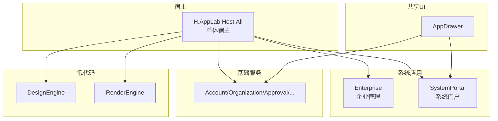
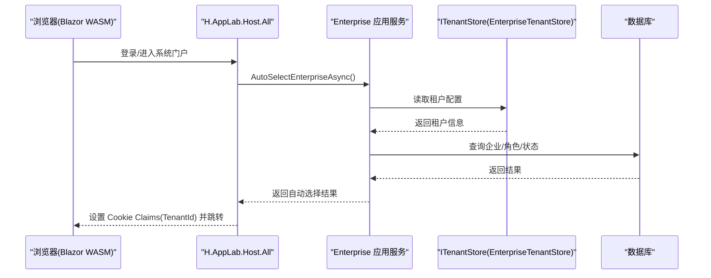
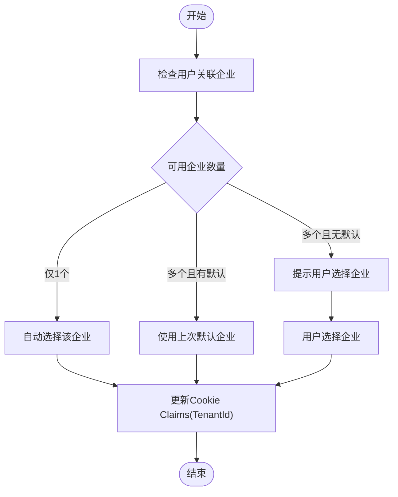
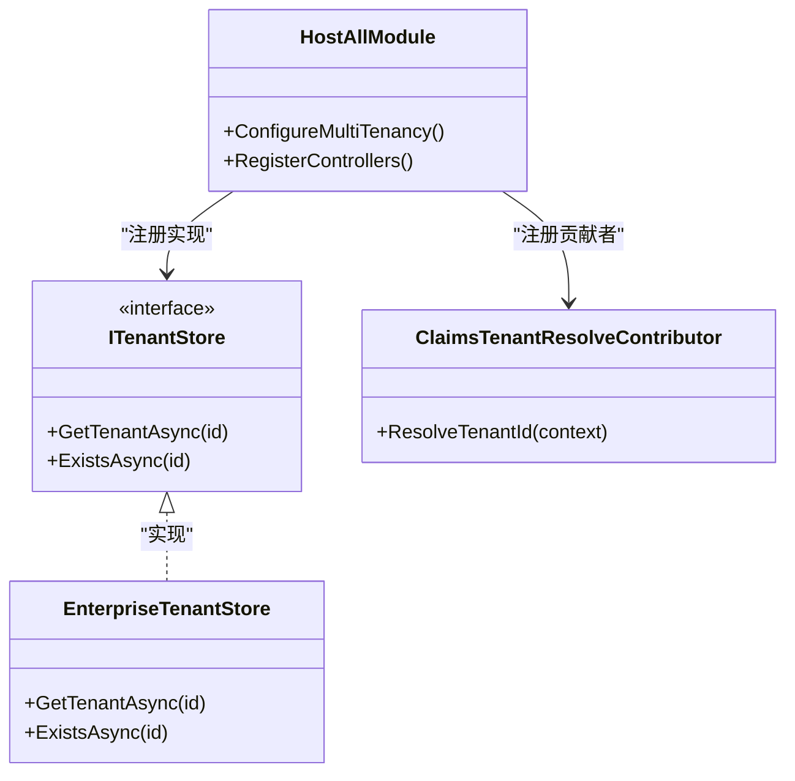
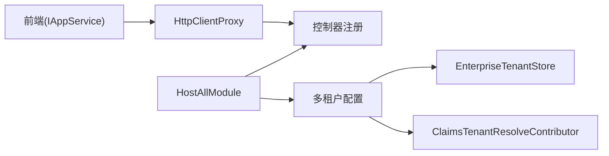

# 系统管理

<cite>
**本文引用的文件**
- [README.md](file://README.md)
- [HostAllModule.cs](file://src/Host/H.AppLab.Host.All/H.AppLab.Host.All/HostAllModule.cs)
- [ClaimsTenantResolveContributor.cs](file://src/Host/H.AppLab.Host.All/H.AppLab.Host.All/ClaimsTenantResolveContributor.cs)
- [IEnterpriseAppService.cs](file://src/System/Enterprise/H.Enterprise.Application.Contracts/Services/IEnterpriseAppService.cs)
</cite>

## 目录
1. [简介](#简介)
2. [项目结构](#项目结构)
3. [核心组件](#核心组件)
4. [架构总览](#架构总览)
5. [详细组件分析](#详细组件分析)
6. [依赖关系分析](#依赖关系分析)
7. [性能考虑](#性能考虑)
8. [故障排查指南](#故障排查指南)
9. [结论](#结论)
10. [附录](#附录)

## 简介
本文件面向 AppLab 的系统管理功能，聚焦企业管理（Enterprise）与系统门户（SystemPortal）两大模块，系统性阐述多租户机制、用户与权限、菜单导航、监控日志与配置管理等运维能力，并提供部署与环境配置、性能优化及故障排查建议。文档以仓库源码为依据，结合模块化架构与宿主装配方式，帮助读者快速理解并落地企业级应用的管理与运营。

## 项目结构
- 宿主程序（Host）
  - H.AppLab.Host.All：单体宿主，聚合所有服务与系统应用的控制器注册与模块装配。
  - 其他 Host 为单服务宿主（如 Account、RenderEngine 等），便于独立部署。
- 共享 UI 组件（Components）
  - AppDrawer：统一顶部导航、侧边菜单与应用切换能力，供各应用复用。
- 低代码平台（LowCode）
  - DesignEngine 与 RenderEngine 分离，元数据驱动页面与组件渲染。
- 基础服务（Services）
  - 按限界上下文划分的企业级应用（Account、Organization、Approval、Notification、Order、Setting、SupplyChain、BackgroundTask、Testing 等）。
- 系统级应用（System）
  - Enterprise：企业管理与多租户核心。
  - SystemPortal：系统门户，承载平台运营侧入口与全局能力。
- 工具（Tools）
  - 各服务的 DbMigrator 控制台程序，用于数据库迁移。
- 工具库（Utils）
  - Abp 契约扩展、HTTP 动态代理、Blazor 工具、ID 生成器等。

图表来源
- [HostAllModule.cs:139-155](file://src/Host/H.AppLab.Host.All/H.AppLab.Host.All/HostAllModule.cs#L139-L155)

章节来源
- [README.md:1-74](file://README.md#L1-L74)

## 核心组件
- 企业管理（Enterprise）
  - 提供企业的创建、更新、删除、激活、启用/禁用、选择企业、自动选择企业、当前企业与角色查询等能力。
  - 通过 IEnterpriseAppService 暴露标准应用服务接口，支持分页查询与 DTO 传输。
- 系统门户（SystemPortal）
  - 作为平台运营入口，聚合系统级能力与全局导航，配合 AppDrawer 实现统一的菜单与布局体验。
- 多租户机制
  - 在宿主中启用 ABP 多租户，并通过自定义 ITenantStore 从 Enterprise 数据库读取租户配置；Claims 解析器基于 Claims 识别租户，实现请求级租户隔离。

章节来源
- [IEnterpriseAppService.cs:1-82](file://src/System/Enterprise/H.Enterprise.Application.Contracts/Services/IEnterpriseAppService.cs#L1-L82)
- [HostAllModule.cs:171-180](file://src/Host/H.AppLab.Host.All/H.AppLab.Host.All/HostAllModule.cs#L171-L180)
- [ClaimsTenantResolveContributor.cs](file://src/Host/H.AppLab.Host.All/H.AppLab.Host.All/ClaimsTenantResolveContributor.cs)

## 架构总览
系统采用 Blazor Web App（Server + WebAssembly Client）模式，单体宿主集中注册各模块的控制器与服务，前端通过 IAppService 动态 HTTP 代理调用后端服务，实现前后端解耦与懒加载。

图表来源
- [IEnterpriseAppService.cs:60-75](file://src/System/Enterprise/H.Enterprise.Application.Contracts/Services/IEnterpriseAppService.cs#L60-L75)
- [HostAllModule.cs:171-180](file://src/Host/H.AppLab.Host.All/H.AppLab.Host.All/HostAllModule.cs#L171-L180)

## 详细组件分析

### 企业管理（Enterprise）
- 能力概览
  - 企业生命周期管理：创建、更新、删除、激活、启用/禁用。
  - 企业选择与自动选择：根据用户与企业关系智能选择默认企业，减少交互成本。
  - 当前企业与角色：获取当前选择的企业信息与用户在其中的角色（Owner/Admin/Member 等）。
- 关键接口
  - GetListAsync、GetByIdAsync、CreateAsync、UpdateAsync、DeleteAsync
  - ActivateAsync、EnableAsync、DisableAsync
  - SelectEnterpriseAsync、AutoSelectEnterpriseAsync
  - GetCurrentEnterpriseAsync、GetCurrentEnterpriseRoleAsync、GetMyEnterprisesAsync
- 数据流与权限
  - 自动选择流程会校验用户可用企业数量与历史默认值，必要时引导用户进入选择页。
  - 选择企业后更新 Cookie Claims，注入 TenantId，后续请求按租户隔离。

图表来源
- [IEnterpriseAppService.cs:60-75](file://src/System/Enterprise/H.Enterprise.Application.Contracts/Services/IEnterpriseAppService.cs#L60-L75)

章节来源
- [IEnterpriseAppService.cs:1-82](file://src/System/Enterprise/H.Enterprise.Application.Contracts/Services/IEnterpriseAppService.cs#L1-L82)

### 系统门户（SystemPortal）
- 定位与职责
  - 作为平台运营入口，聚合系统级能力与全局导航，提供统一的布局与菜单体验。
  - 与 AppDrawer 协作，实现跨应用切换与菜单动态渲染。
- 集成要点
  - 在宿主中注册 SystemPortalApplicationModule 的控制器，确保路由与页面可访问。
  - 通过 AppDrawer 提供的模型（AppCategoryInfo/AppItemInfo）配置应用分类、图标与打开方式。

章节来源
- [HostAllModule.cs:139-155](file://src/Host/H.AppLab.Host.All/H.AppLab.Host.All/HostAllModule.cs#L139-L155)
- [README.md:58-62](file://README.md#L58-L62)

### 多租户管理机制
- 启用与存储
  - 在宿主中启用 ABP 多租户，并注册自定义 ITenantStore（EnterpriseTenantStore），从 Enterprise 数据库读取租户配置。
- 租户识别
  - ClaimsTenantResolveContributor 基于 Claims 解析租户标识，实现请求级租户隔离。
- 资源隔离与权限控制
  - 通过 TenantId 注入到当前上下文，数据访问层按租户过滤；角色与权限在企业维度进行控制。

图表来源
- [HostAllModule.cs:171-180](file://src/Host/H.AppLab.Host.All/H.AppLab.Host.All/HostAllModule.cs#L171-L180)
- [ClaimsTenantResolveContributor.cs](file://src/Host/H.AppLab.Host.All/H.AppLab.Host.All/ClaimsTenantResolveContributor.cs)

章节来源
- [HostAllModule.cs:171-180](file://src/Host/H.AppLab.Host.All/H.AppLab.Host.All/HostAllModule.cs#L171-L180)
- [ClaimsTenantResolveContributor.cs](file://src/Host/H.AppLab.Host.All/H.AppLab.Host.All/ClaimsTenantResolveContributor.cs)

### 用户管理、角色权限与菜单导航
- 用户与角色
  - 用户与企业关联，角色在企业维度生效（Owner/Admin/Member 等）。
  - 通过 GetCurrentEnterpriseRoleAsync 获取当前企业在当前用户中的角色。
- 菜单与导航
  - AppDrawer 提供统一菜单与顶部导航，支持按应用分类与图标配置。
  - 系统门户与业务应用通过 AppItemInfo 配置跳转地址与打开方式，实现跨应用切换。

章节来源
- [IEnterpriseAppService.cs:75-81](file://src/System/Enterprise/H.Enterprise.Application.Contracts/Services/IEnterpriseAppService.cs#L75-L81)
- [README.md:58-62](file://README.md#L58-L62)

### 系统监控、日志管理与配置管理
- 监控与日志
  - 宿主持有统一启动入口，便于接入集中式日志与监控（如 Serilog、OpenTelemetry）。
  - 各服务遵循分层架构，可在 Application 层埋点记录关键操作与异常。
- 配置管理
  - 外部登录、远程服务地址等通过配置文件节点统一管理（如 ExternalLogin、RemoteServices）。
  - 前端通过 HttpClientProxy 动态代理，按 AbpUrlConvention 将接口方法映射为 HTTP 请求。

章节来源
- [README.md:63-67](file://README.md#L63-L67)
- [HostAllModule.cs:158-169](file://src/Host/H.AppLab.Host.All/H.AppLab.Host.All/HostAllModule.cs#L158-L169)

## 依赖关系分析
- 宿主装配
  - HostAllModule 集中注册各模块控制器，包括 SystemPortal、Enterprise、Account、Organization、Approval、Notification、Order、Setting、SupplyChain、BackgroundTask 等。
- 多租户依赖
  - 启用 ABP 多租户，注册 EnterpriseTenantStore 与 ClaimsTenantResolveContributor。
- 前端依赖
  - 前端依赖 IAppService 接口，通过 HttpClientProxy 动态生成 HTTP 客户端，降低耦合。

图表来源
- [HostAllModule.cs:139-155](file://src/Host/H.AppLab.Host.All/H.AppLab.Host.All/HostAllModule.cs#L139-L155)
- [HostAllModule.cs:171-180](file://src/Host/H.AppLab.Host.All/H.AppLab.Host.All/HostAllModule.cs#L171-L180)
- [README.md:63-67](file://README.md#L63-L67)

章节来源
- [HostAllModule.cs:139-155](file://src/Host/H.AppLab.Host.All/H.AppLab.Host.All/HostAllModule.cs#L139-L155)
- [HostAllModule.cs:171-180](file://src/Host/H.AppLab.Host.All/H.AppLab.Host.All/HostAllModule.cs#L171-L180)
- [README.md:63-67](file://README.md#L63-L67)

## 性能考虑
- 前端懒加载
  - 首页仅加载必要程序集，其余 Contracts、LowCode 库与第三方依赖在导航时按需下载，显著减少首屏体积。
- AOT 与裁剪
  - Release 模式启用 AOT 与裁剪，进一步减小包体；Debug 模式额外加载 .pdb 以支持调试。
- 动态代理与约定路由
  - 通过 DispatchProxy 拦截 IAppService 调用，按 ABP 路由约定转换为 HTTP 请求，避免手写客户端代码，提升开发效率与维护性。

章节来源
- [README.md:69-74](file://README.md#L69-L74)
- [README.md:63-67](file://README.md#L63-L67)

## 故障排查指南
- 多租户相关问题
  - 若出现租户无法识别或数据越权，检查 ClaimsTenantResolveContributor 是否正确解析 TenantId，以及 EnterpriseTenantStore 是否能正确读取租户配置。
- 企业选择失败
  - 确认 AutoSelectEnterpriseAsync 逻辑是否满足“仅一个可用企业”或“存在默认企业”的条件；否则需引导用户进入选择页。
- 前端代理调用异常
  - 检查 RemoteServices 配置是否正确，AbpUrlConvention 是否匹配接口方法命名规范（GetXxx → GET，CreateXxx → POST 等）。
- 数据库迁移问题
  - 使用 Tools 下对应 DbMigrator 执行迁移，确保数据库结构与实体定义一致。

章节来源
- [IEnterpriseAppService.cs:60-75](file://src/System/Enterprise/H.Enterprise.Application.Contracts/Services/IEnterpriseAppService.cs#L60-L75)
- [README.md:48-55](file://README.md#L48-L55)
- [README.md:63-67](file://README.md#L63-L67)

## 结论
AppLab 的系统管理以 Enterprise 与 SystemPortal 为核心，依托 ABP 多租户与 Claims 解析实现严格的租户隔离与权限控制。通过 AppDrawer 与 IAppService 动态代理，系统实现了统一的导航体验与前后端解耦。结合懒加载与 AOT 裁剪，系统在性能与可维护性上具备良好表现。建议在部署与运维中重点关注多租户配置、日志监控与数据库迁移，以确保系统的稳定与高效运行。

## 附录
- 本地开发与部署
  - 环境准备：.NET SDK、WSL + Docker（Engine+Compose）+ Portainer。
  - 启动依赖服务：Redis、RabbitMQ 等。
  - 数据库迁移：通过 Tools 下对应 DbMigrator 创建/更新数据库结构。
  - 启动主程序：H.AppLab.Host.All，默认地址 http://localhost:5045（https: 7065）。

章节来源
- [README.md:38-55](file://README.md#L38-L55)