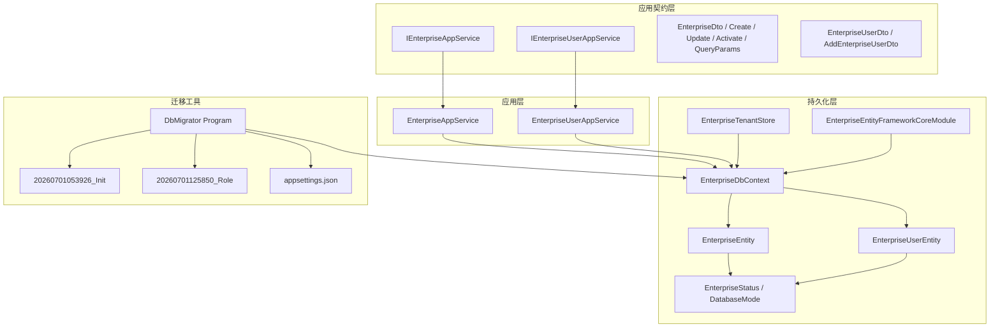
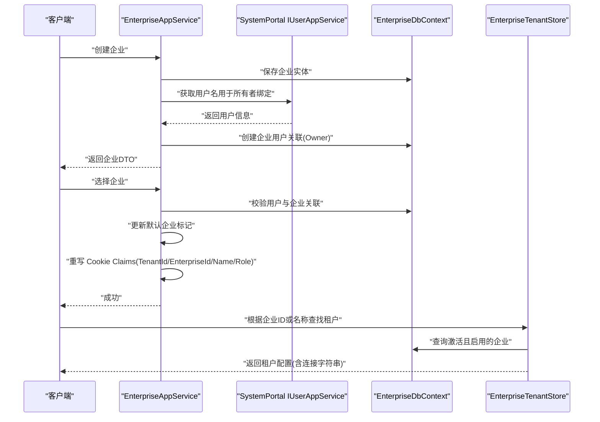
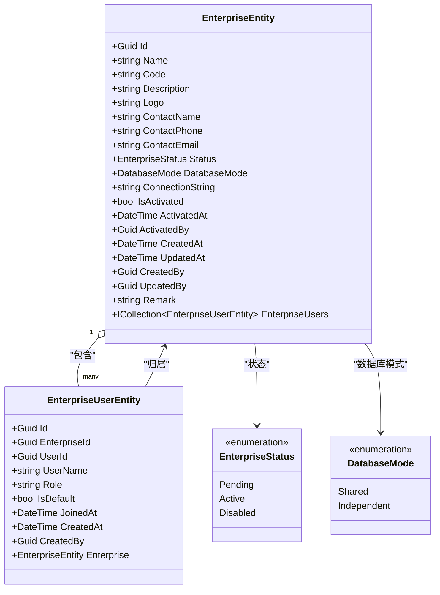
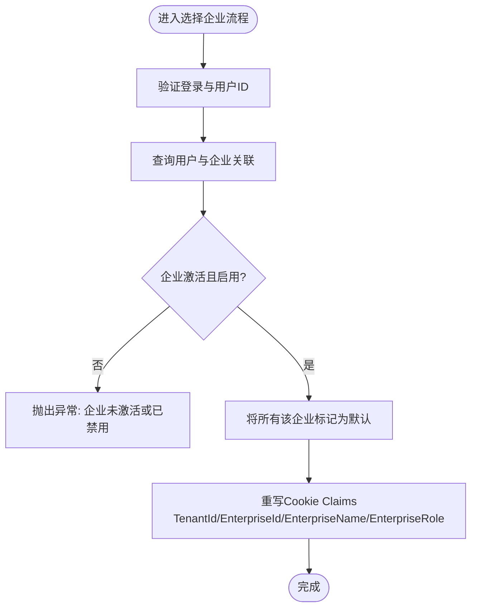
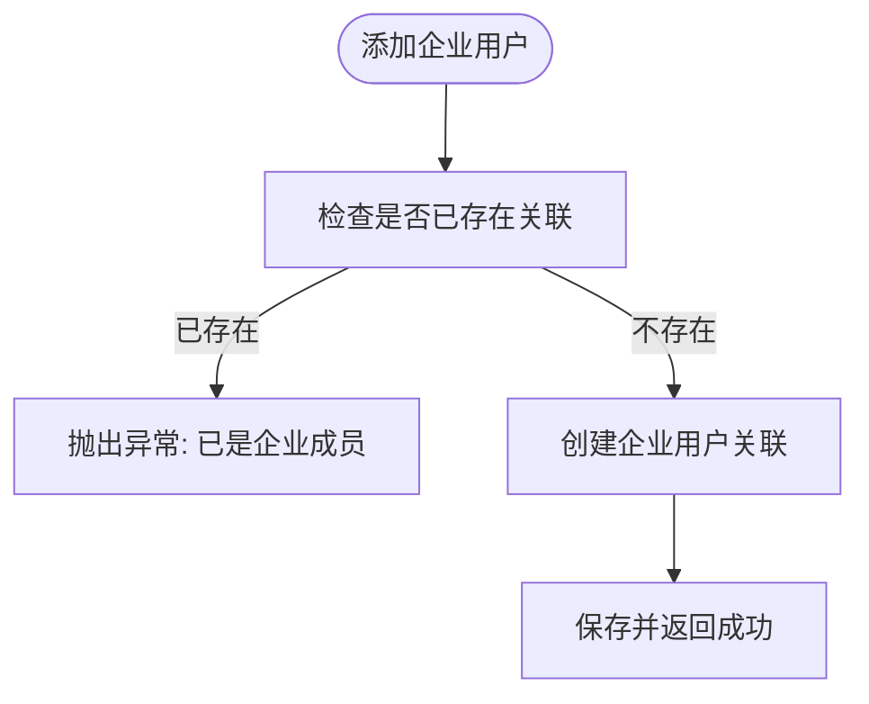
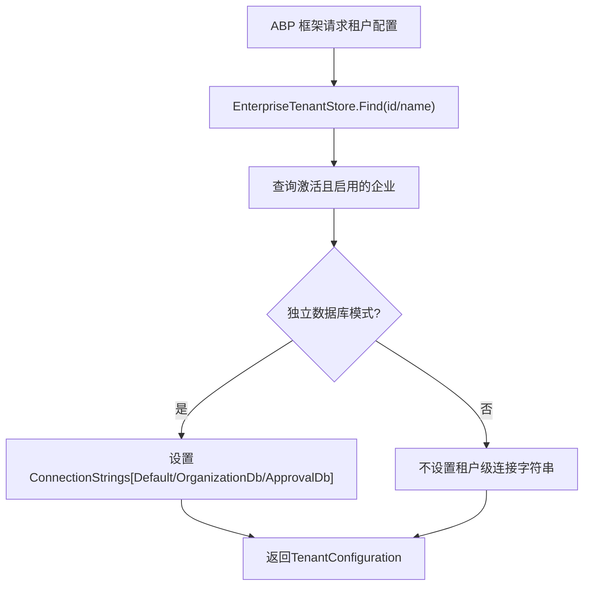
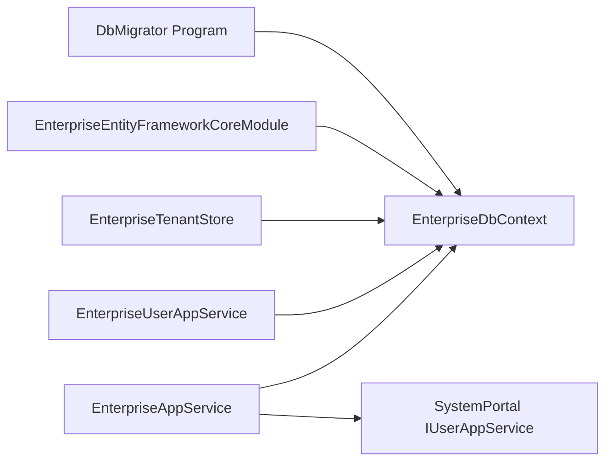
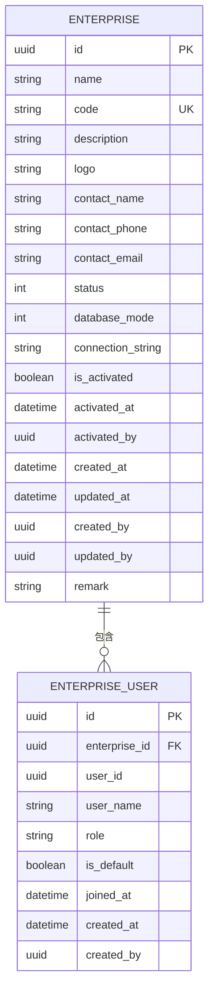

# Enterprise 企业管理

<cite>
**本文引用的文件**   
- [EnterpriseDto.cs](file://src/System/Enterprise/H.Enterprise.Application.Contracts/Dtos/EnterpriseDto.cs)
- [EnterpriseUserDto.cs](file://src/System/Enterprise/H.Enterprise.Application.Contracts/Dtos/EnterpriseUserDto.cs)
- [IEnterpriseAppService.cs](file://src/System/Enterprise/H.Enterprise.Application.Contracts/Services/IEnterpriseAppService.cs)
- [IEnterpriseUserAppService.cs](file://src/System/Enterprise/H.Enterprise.Application.Contracts/Services/IEnterpriseUserAppService.cs)
- [EnterpriseAppService.cs](file://src/System/Enterprise/H.Enterprise.Application/Services/EnterpriseAppService.cs)
- [EnterpriseUserAppService.cs](file://src/System/Enterprise/H.Enterprise.Application/Services/EnterpriseUserAppService.cs)
- [EnterpriseEntity.cs](file://src/System/Enterprise/H.Enterprise.EntityFrameworkCore/Entities/EnterpriseEntity.cs)
- [EnterpriseUserEntity.cs](file://src/System/Enterprise/H.Enterprise.EntityFrameworkCore/Entities/EnterpriseUserEntity.cs)
- [Enums.cs](file://src/System/Enterprise/H.Enterprise.EntityFrameworkCore/Entities/Enums.cs)
- [EnterpriseDbContext.cs](file://src/System/Enterprise/H.Enterprise.EntityFrameworkCore/EnterpriseDbContext.cs)
- [EnterpriseTenantStore.cs](file://src/System/Enterprise/H.Enterprise.EntityFrameworkCore/EnterpriseTenantStore.cs)
- [EnterpriseEntityFrameworkCoreModule.cs](file://src/System/Enterprise/H.Enterprise.EntityFrameworkCore/EnterpriseEntityFrameworkCoreModule.cs)
- [20260701053926_Init.cs](file://src/Tools/H.Enterprise.DbMigrator/Migrations/20260701053926_Init.cs)
- [20260701125850_Role.cs](file://src/Tools/H.Enterprise.DbMigrator/Migrations/20260701125850_Role.cs)
- [EnterpriseDbContextFactory.cs](file://src/Tools/H.Enterprise.DbMigrator/EnterpriseDbContextFactory.cs)
- [Program.cs](file://src/Tools/H.Enterprise.DbMigrator/Program.cs)
- [appsettings.json](file://src/Tools/H.Enterprise.DbMigrator/appsettings.json)
</cite>

## 目录
1. [引言](#引言)
2. [项目结构](#项目结构)
3. [核心组件](#核心组件)
4. [架构总览](#架构总览)
5. [详细组件分析](#详细组件分析)
6. [依赖关系分析](#依赖关系分析)
7. [性能与多租户特性](#性能与多租户特性)
8. [数据库设计与迁移](#数据库设计与迁移)
9. [API 接口定义](#api-接口定义)
10. [使用示例与部署指南](#使用示例与部署指南)
11. [故障排查](#故障排查)
12. [结论](#结论)

## 引言
本文件面向 AppLab 的 Enterprise（企业管理）子系统，聚焦企业租户管理的领域模型与设计实现。Enterprise 子系统提供企业实体、企业用户关联、角色能力、激活与启用状态管理、企业选择与默认企业设置、以及与 ABP 多租户框架的集成。它通过 EF Core 持久化数据，并通过自定义租户存储将企业记录映射为 ABP 租户配置，从而在共享数据库或独立数据库模式下支撑多租户隔离。同时，Enterprise 子系统与 SystemPortal 的用户服务协作，完成创建企业时自动绑定创建者为所有者等跨服务操作。

## 项目结构
Enterprise 子系统按典型分层组织：
- 应用契约层：定义 DTO、查询参数与应用服务接口。
- 应用层：实现企业与企业用户的业务逻辑。
- 实体与持久化层：定义领域实体、EF Core 上下文、租户存储与模块注册。
- 迁移工具：提供 EF Core 迁移生成与执行入口。

**图表来源**
- [IEnterpriseAppService.cs:1-82](file://src/System/Enterprise/H.Enterprise.Application.Contracts/Services/IEnterpriseAppService.cs#L1-L82)
- [IEnterpriseUserAppService.cs:1-35](file://src/System/Enterprise/H.Enterprise.Application.Contracts/Services/IEnterpriseUserAppService.cs#L1-L35)
- [EnterpriseAppService.cs:1-480](file://src/System/Enterprise/H.Enterprise.Application/Services/EnterpriseAppService.cs#L1-L480)
- [EnterpriseUserAppService.cs:1-133](file://src/System/Enterprise/H.Enterprise.Application/Services/EnterpriseUserAppService.cs#L1-L133)
- [EnterpriseDbContext.cs:1-83](file://src/System/Enterprise/H.Enterprise.EntityFrameworkCore/EnterpriseDbContext.cs#L1-L83)
- [EnterpriseEntity.cs:1-107](file://src/System/Enterprise/H.Enterprise.EntityFrameworkCore/Entities/EnterpriseEntity.cs#L1-L107)
- [EnterpriseUserEntity.cs:1-58](file://src/System/Enterprise/H.Enterprise.EntityFrameworkCore/Entities/EnterpriseUserEntity.cs#L1-L58)
- [Enums.cs:1-38](file://src/System/Enterprise/H.Enterprise.EntityFrameworkCore/Entities/Enums.cs#L1-L38)
- [EnterpriseTenantStore.cs:1-86](file://src/System/Enterprise/H.Enterprise.EntityFrameworkCore/EnterpriseTenantStore.cs#L1-L86)
- [EnterpriseEntityFrameworkCoreModule.cs:1-29](file://src/System/Enterprise/H.Enterprise.EntityFrameworkCore/EnterpriseEntityFrameworkCoreModule.cs#L1-L29)
- [20260701053926_Init.cs:1-101](file://src/Tools/H.Enterprise.DbMigrator/Migrations/20260701053926_Init.cs#L1-L101)
- [20260701125850_Role.cs:1-27](file://src/Tools/H.Enterprise.DbMigrator/Migrations/20260701125850_Role.cs#L1-L27)
- [Program.cs:1-56](file://src/Tools/H.Enterprise.DbMigrator/Program.cs#L1-L56)
- [appsettings.json:1-5](file://src/Tools/H.Enterprise.DbMigrator/appsettings.json#L1-L5)

**章节来源**
- [IEnterpriseAppService.cs:1-82](file://src/System/Enterprise/H.Enterprise.Application.Contracts/Services/IEnterpriseAppService.cs#L1-L82)
- [IEnterpriseUserAppService.cs:1-35](file://src/System/Enterprise/H.Enterprise.Application.Contracts/Services/IEnterpriseUserAppService.cs#L1-L35)
- [EnterpriseAppService.cs:1-480](file://src/System/Enterprise/H.Enterprise.Application/Services/EnterpriseAppService.cs#L1-L480)
- [EnterpriseUserAppService.cs:1-133](file://src/System/Enterprise/H.Enterprise.Application/Services/EnterpriseUserAppService.cs#L1-L133)
- [EnterpriseDbContext.cs:1-83](file://src/System/Enterprise/H.Enterprise.EntityFrameworkCore/EnterpriseDbContext.cs#L1-L83)
- [EnterpriseEntityFrameworkCoreModule.cs:1-29](file://src/System/Enterprise/H.Enterprise.EntityFrameworkCore/EnterpriseEntityFrameworkCoreModule.cs#L1-L29)
- [Program.cs:1-56](file://src/Tools/H.Enterprise.DbMigrator/Program.cs#L1-L56)

## 核心组件
- 领域实体：
  - 企业实体承载企业名称、编码、描述、Logo、联系人信息、状态、数据库模式、连接字符串、激活信息与审计字段，并维护与企业用户的集合关系。
  - 企业用户实体记录用户与企业之间的关联、冗余用户名、角色、是否默认企业、加入时间与审计字段。
- 应用服务：
  - 企业管理服务负责企业信息 CRUD、状态变更、当前企业选择与自动选择、当前企业角色读取，以及与其他服务的协作。
  - 企业用户管理服务负责企业成员增删、角色更新、默认企业设置。
- 持久化与多租户：
  - EF Core 上下文定义表名、属性约束、索引与外键关系。
  - 租户存储从企业表读取激活且启用的企业，映射为 ABP 租户配置；当企业处于独立数据库模式时，注入对应连接字符串以覆盖默认租户连接。
  - 模块注册 EF Core 数据库上下文并在应用初始化时确保数据库存在。
- 迁移工具：
  - 提供设计时 DbContext 工厂、程序入口执行迁移，以及初始表结构与后续角色索引迁移。

**章节来源**
- [EnterpriseEntity.cs:1-107](file://src/System/Enterprise/H.Enterprise.EntityFrameworkCore/Entities/EnterpriseEntity.cs#L1-L107)
- [EnterpriseUserEntity.cs:1-58](file://src/System/Enterprise/H.Enterprise.EntityFrameworkCore/Entities/EnterpriseUserEntity.cs#L1-L58)
- [IEnterpriseAppService.cs:1-82](file://src/System/Enterprise/H.Enterprise.Application.Contracts/Services/IEnterpriseAppService.cs#L1-L82)
- [IEnterpriseUserAppService.cs:1-35](file://src/System/Enterprise/H.Enterprise.Application.Contracts/Services/IEnterpriseUserAppService.cs#L1-L35)
- [EnterpriseDbContext.cs:1-83](file://src/System/Enterprise/H.Enterprise.EntityFrameworkCore/EnterpriseDbContext.cs#L1-L83)
- [EnterpriseTenantStore.cs:1-86](file://src/System/Enterprise/H.Enterprise.EntityFrameworkCore/EnterpriseTenantStore.cs#L1-L86)
- [EnterpriseEntityFrameworkCoreModule.cs:1-29](file://src/System/Enterprise/H.Enterprise.EntityFrameworkCore/EnterpriseEntityFrameworkCoreModule.cs#L1-L29)
- [Program.cs:1-56](file://src/Tools/H.Enterprise.DbMigrator/Program.cs#L1-L56)

## 架构总览
Enterprise 子系统遵循分层架构，结合 ABP 多租户机制与 EF Core 数据持久化。整体调用链如下：

**图表来源**
- [EnterpriseAppService.cs:1-480](file://src/System/Enterprise/H.Enterprise.Application/Services/EnterpriseAppService.cs#L1-L480)
- [EnterpriseTenantStore.cs:1-86](file://src/System/Enterprise/H.Enterprise.EntityFrameworkCore/EnterpriseTenantStore.cs#L1-L86)
- [EnterpriseDbContext.cs:1-83](file://src/System/Enterprise/H.Enterprise.EntityFrameworkCore/EnterpriseDbContext.cs#L1-L83)

## 详细组件分析

### 领域实体与枚举
企业实体与企业用户实体构成基础领域模型，企业状态与数据库模式通过枚举表达。企业实体拥有集合导航到企业用户，企业用户实体反向引用企业实体。

**图表来源**
- [EnterpriseEntity.cs:1-107](file://src/System/Enterprise/H.Enterprise.EntityFrameworkCore/Entities/EnterpriseEntity.cs#L1-L107)
- [EnterpriseUserEntity.cs:1-58](file://src/System/Enterprise/H.Enterprise.EntityFrameworkCore/Entities/EnterpriseUserEntity.cs#L1-L58)
- [Enums.cs:1-38](file://src/System/Enterprise/H.Enterprise.EntityFrameworkCore/Entities/Enums.cs#L1-L38)

**章节来源**
- [EnterpriseEntity.cs:1-107](file://src/System/Enterprise/H.Enterprise.EntityFrameworkCore/Entities/EnterpriseEntity.cs#L1-L107)
- [EnterpriseUserEntity.cs:1-58](file://src/System/Enterprise/H.Enterprise.EntityFrameworkCore/Entities/EnterpriseUserEntity.cs#L1-L58)
- [Enums.cs:1-38](file://src/System/Enterprise/H.Enterprise.EntityFrameworkCore/Entities/Enums.cs#L1-L38)

### 企业管理服务
企业管理服务提供以下核心能力：
- 分页查询企业列表，支持关键词、状态、数据库模式、激活状态的过滤。
- 根据 ID 获取企业详情，包含用户数量统计。
- 创建企业：校验编码唯一性，设置初始状态为待审核，创建者自动成为 Owner 并设为默认企业。
- 更新企业信息：支持普通更新与仅企业拥有者可执行的“当前企业更新”。
- 删除企业：仅允许删除未激活的企业。
- 激活企业：校验数据库模式与连接字符串，写入激活信息与状态。
- 启用/禁用企业：切换企业可用状态。
- 获取当前用户关联的所有企业。
- 选择企业：校验用户属于该企业，更新默认企业标记并重写认证 Cookie 中的企业相关 Claims。
- 自动选择企业：优先选择默认企业，若只有一个可用企业则直接选择；否则返回结果由前端引导选择。
- 获取当前企业与当前企业角色：基于 Cookie Claims 回退到最近一次的角色值。

**图表来源**
- [EnterpriseAppService.cs:201-480](file://src/System/Enterprise/H.Enterprise.Application/Services/EnterpriseAppService.cs#L201-L480)

**章节来源**
- [IEnterpriseAppService.cs:1-82](file://src/System/Enterprise/H.Enterprise.Application.Contracts/Services/IEnterpriseAppService.cs#L1-L82)
- [EnterpriseAppService.cs:1-480](file://src/System/Enterprise/H.Enterprise.Application/Services/EnterpriseAppService.cs#L1-L480)

### 企业用户管理服务
企业用户管理服务负责：
- 获取指定企业的用户列表，并按角色优先级与加入时间排序。
- 添加用户到企业：检查重复，创建关联记录，初始角色可配置。
- 移除用户：不允许移除 Owner。
- 设置默认企业：清空用户所有默认标记，仅保留目标企业。
- 更新用户角色：不允许修改 Owner 角色。

**图表来源**
- [EnterpriseUserAppService.cs:1-133](file://src/System/Enterprise/H.Enterprise.Application/Services/EnterpriseUserAppService.cs#L1-L133)

**章节来源**
- [IEnterpriseUserAppService.cs:1-35](file://src/System/Enterprise/H.Enterprise.Application.Contracts/Services/IEnterpriseUserAppService.cs#L1-L35)
- [EnterpriseUserAppService.cs:1-133](file://src/System/Enterprise/H.Enterprise.Application/Services/EnterpriseUserAppService.cs#L1-L133)

### 多租户集成
EnterpriseTenantStore 作为 ABP 的 ITenantStore 实现，从企业表中查找激活且启用的企业，并映射为租户配置。当企业处于独立数据库模式时，将连接字符串注入到多个数据库键，使 ABP 框架优先使用该连接字符串进行数据访问，从而实现独立数据库的多租户隔离。

**图表来源**
- [EnterpriseTenantStore.cs:1-86](file://src/System/Enterprise/H.Enterprise.EntityFrameworkCore/EnterpriseTenantStore.cs#L1-L86)

**章节来源**
- [EnterpriseTenantStore.cs:1-86](file://src/System/Enterprise/H.Enterprise.EntityFrameworkCore/EnterpriseTenantStore.cs#L1-L86)

### 与 Organization、Account 等服务协作
- Account 集成：EnterpriseAppService 在创建企业时调用 SystemPortal 的用户服务获取用户名，并将创建者绑定为企业 Owner，同时写入冗余用户名，便于展示与查询。
- Organization 集成：在独立数据库模式中，EnterpriseTenantStore 将企业的连接字符串同时赋给 OrganizationDb 键，使其他域（如组织、审批、通知等）在同一租户下共享该连接字符串，达到跨服务的数据隔离。

**章节来源**
- [EnterpriseAppService.cs:1-200](file://src/System/Enterprise/H.Enterprise.Application/Services/EnterpriseAppService.cs#L1-L200)
- [EnterpriseTenantStore.cs:1-86](file://src/System/Enterprise/H.Enterprise.EntityFrameworkCore/EnterpriseTenantStore.cs#L1-L86)

## 依赖关系分析
- 应用服务依赖 EF Core 上下文进行数据读写。
- 企业管理服务依赖 SystemPortal 的用户服务以获取用户名。
- 租户存储依赖 EF Core 上下文读取企业配置。
- 模块注册依赖配置文件提供连接字符串，并在应用初始化时确保数据库存在。
- 迁移工具依赖 EF Core 与 Host 构建器执行迁移。

**图表来源**
- [EnterpriseAppService.cs:1-480](file://src/System/Enterprise/H.Enterprise.Application/Services/EnterpriseAppService.cs#L1-L480)
- [EnterpriseUserAppService.cs:1-133](file://src/System/Enterprise/H.Enterprise.Application/Services/EnterpriseUserAppService.cs#L1-L133)
- [EnterpriseTenantStore.cs:1-86](file://src/System/Enterprise/H.Enterprise.EntityFrameworkCore/EnterpriseTenantStore.cs#L1-L86)
- [EnterpriseEntityFrameworkCoreModule.cs:1-29](file://src/System/Enterprise/H.Enterprise.EntityFrameworkCore/EnterpriseEntityFrameworkCoreModule.cs#L1-L29)
- [Program.cs:1-56](file://src/Tools/H.Enterprise.DbMigrator/Program.cs#L1-L56)

**章节来源**
- [EnterpriseAppService.cs:1-480](file://src/System/Enterprise/H.Enterprise.Application/Services/EnterpriseAppService.cs#L1-L480)
- [EnterpriseUserAppService.cs:1-133](file://src/System/Enterprise/H.Enterprise.Application/Services/EnterpriseUserAppService.cs#L1-L133)
- [EnterpriseTenantStore.cs:1-86](file://src/System/Enterprise/H.Enterprise.EntityFrameworkCore/EnterpriseTenantStore.cs#L1-L86)
- [EnterpriseEntityFrameworkCoreModule.cs:1-29](file://src/System/Enterprise/H.Enterprise.EntityFrameworkCore/EnterpriseEntityFrameworkCoreModule.cs#L1-L29)
- [Program.cs:1-56](file://src/Tools/H.Enterprise.DbMigrator/Program.cs#L1-L56)

## 性能与多租户特性
- 查询优化：分页查询采用 Skip/Take 与 CountAsync，避免全量加载；企业列表查询包含企业用户集合以计算用户数量，但注意 Include 会带来额外 JOIN 开销，建议在高频场景中对用户数量采用异步计数或缓存。
- 索引设计：对企业编码、状态、企业用户复合唯一键、UserId、Role 建立索引，提升常见查询与去重性能。
- 多租户隔离：
  - 共享数据库模式：通过 TenantId 逻辑隔离，企业数据与租户数据在同一数据库中。
  - 独立数据库模式：通过租户级连接字符串隔离不同企业的数据库实例，适用于强隔离需求。
- 认证与权限：企业选择后重写 Cookie Claims，后续鉴权可通过 EnterpriseRole 与 EnterpriseId 进行细粒度控制。

**章节来源**
- [EnterpriseAppService.cs:1-480](file://src/System/Enterprise/H.Enterprise.Application/Services/EnterpriseAppService.cs#L1-L480)
- [EnterpriseDbContext.cs:1-83](file://src/System/Enterprise/H.Enterprise.EntityFrameworkCore/EnterpriseDbContext.cs#L1-L83)
- [EnterpriseTenantStore.cs:1-86](file://src/System/Enterprise/H.Enterprise.EntityFrameworkCore/EnterpriseTenantStore.cs#L1-L86)

## 数据库设计与迁移

### 数据模型图

**图表来源**
- [20260701053926_Init.cs:1-101](file://src/Tools/H.Enterprise.DbMigrator/Migrations/20260701053926_Init.cs#L1-L101)
- [20260701125850_Role.cs:1-27](file://src/Tools/H.Enterprise.DbMigrator/Migrations/20260701125850_Role.cs#L1-L27)
- [EnterpriseDbContext.cs:1-83](file://src/System/Enterprise/H.Enterprise.EntityFrameworkCore/EnterpriseDbContext.cs#L1-L83)

### 迁移策略
- 初始迁移创建企业表与企业用户表，定义主键、外键、唯一索引与常规索引。
- 角色迁移增加企业用户表的 Role 列索引，提升按角色查询的性能。
- 设计时 DbContext 工厂与程序入口支持 dotnet ef 命令生成迁移与运行时执行迁移。

**章节来源**
- [20260701053926_Init.cs:1-101](file://src/Tools/H.Enterprise.DbMigrator/Migrations/20260701053926_Init.cs#L1-L101)
- [20260701125850_Role.cs:1-27](file://src/Tools/H.Enterprise.DbMigrator/Migrations/20260701125850_Role.cs#L1-L27)
- [EnterpriseDbContextFactory.cs:1-27](file://src/Tools/H.Enterprise.DbMigrator/EnterpriseDbContextFactory.cs#L1-L27)
- [Program.cs:1-56](file://src/Tools/H.Enterprise.DbMigrator/Program.cs#L1-L56)

## API 接口定义

### 企业管理服务接口
- 获取企业列表（分页）：返回 BaseOutput<PagedResult<EnterpriseDto>>。
- 根据 ID 获取企业详情：返回 BaseOutput<EnterpriseDto?>。
- 创建企业：输入 CreateEnterpriseDto，返回 BaseOutput<EnterpriseDto>。
- 更新企业信息：输入 UpdateEnterpriseDto，返回 BaseOutput<EnterpriseDto>。
- 更新当前企业信息：仅企业拥有者可操作，返回 BaseOutput<EnterpriseDto>。
- 删除企业：仅 Pending/Disabled 可删除，返回 BaseOutput。
- 激活企业：输入 ActivateEnterpriseDto，设置数据库模式与连接字符串，返回 BaseOutput。
- 启用企业：返回 BaseOutput。
- 禁用企业：返回 BaseOutput。
- 获取当前用户关联的所有企业：返回 BaseOutput<List<EnterpriseDto>>。
- 选择企业：更新 Cookie Claims 并设置 TenantId，返回 BaseOutput。
- 登录后自动选择企业：返回 BaseOutput<EnterpriseAutoSelectResultDto>。
- 获取当前选择的企业信息：返回 BaseOutput<EnterpriseDto?>。
- 获取当前企业在当前用户中的角色：返回 BaseOutput<string?>。

**章节来源**
- [IEnterpriseAppService.cs:1-82](file://src/System/Enterprise/H.Enterprise.Application.Contracts/Services/IEnterpriseAppService.cs#L1-L82)

### 企业用户管理服务接口
- 获取企业的用户列表：返回 BaseOutput<List<EnterpriseUserDto>>。
- 添加用户到企业：输入 AddEnterpriseUserDto，返回 BaseOutput。
- 从企业移除用户：返回 BaseOutput。
- 设置默认企业：返回 BaseOutput。
- 更新用户在企业中的角色：返回 BaseOutput。

**章节来源**
- [IEnterpriseUserAppService.cs:1-35](file://src/System/Enterprise/H.Enterprise.Application.Contracts/Services/IEnterpriseUserAppService.cs#L1-L35)

### DTO 模型说明
- EnterpriseDto：企业输出模型，包含基本信息、状态、数据库模式、激活信息与用户数量。
- CreateEnterpriseDto：创建企业输入，包含名称、编码、描述与联系人信息，带长度校验。
- UpdateEnterpriseDto：更新企业输入，包含名称、描述、Logo、联系人信息与备注，带长度校验。
- ActivateEnterpriseDto：激活企业输入，包含数据库模式与独立数据库连接字符串。
- EnterpriseQueryParams：分页查询参数，包含关键词、状态、数据库模式、激活状态、页码与大小。
- PagedResult<T>：通用分页结果，包含 Items、TotalCount、PageIndex、PageSize、HasPreviousPage、HasNextPage。
- EnterpriseUserDto：企业用户输出模型，包含企业、用户、角色、默认标记与加入时间。
- AddEnterpriseUserDto：添加企业用户输入，包含企业ID、用户ID与角色。

**章节来源**
- [EnterpriseDto.cs:1-136](file://src/System/Enterprise/H.Enterprise.Application.Contracts/Dtos/EnterpriseDto.cs#L1-L136)
- [EnterpriseUserDto.cs:1-36](file://src/System/Enterprise/H.Enterprise.Application.Contracts/Dtos/EnterpriseUserDto.cs#L1-L36)

## 使用示例与部署指南

### 企业初始化流程
- 创建企业：调用创建接口，传入名称与可选编码、描述、联系人信息；系统会设置状态为待审核，并将创建者绑定为 Owner 与默认企业。
- 激活企业：超管调用激活接口，选择数据库模式为 Shared 或 Independent；Independent 模式需填写连接字符串；系统写入激活信息与状态。
- 启用企业：激活后可启用企业，使其对租户可用。
- 选择企业：用户登录后选择企业，系统将默认企业标记更新并签发新的 Cookie Claims，包括 TenantId、EnterpriseId、EnterpriseName 与 EnterpriseRole。

**章节来源**
- [EnterpriseAppService.cs:1-480](file://src/System/Enterprise/H.Enterprise.Application/Services/EnterpriseAppService.cs#L1-L480)

### 多租户环境部署
- 共享数据库模式：
  - 企业表与租户数据在同一数据库，通过 TenantId 区分。
  - 无需额外连接字符串，ABP 框架使用默认连接字符串。
- 独立数据库模式：
  - 在企业激活时填写独立数据库连接字符串。
  - EnterpriseTenantStore 将连接字符串注入 Default、OrganizationDb、ApprovalDb 等键，使各服务在租户上下文中访问独立数据库。
- 启动与迁移：
  - 运行迁移工具，读取 appsettings.json 中 EnterpriseDb 连接字符串，执行 EF Core 迁移。
  - 模块在应用初始化时确保数据库存在，适合本地开发快速启动。

**章节来源**
- [EnterpriseTenantStore.cs:1-86](file://src/System/Enterprise/H.Enterprise.EntityFrameworkCore/EnterpriseTenantStore.cs#L1-L86)
- [EnterpriseEntityFrameworkCoreModule.cs:1-29](file://src/System/Enterprise/H.Enterprise.EntityFrameworkCore/EnterpriseEntityFrameworkCoreModule.cs#L1-L29)
- [Program.cs:1-56](file://src/Tools/H.Enterprise.DbMigrator/Program.cs#L1-L56)
- [appsettings.json:1-5](file://src/Tools/H.Enterprise.DbMigrator/appsettings.json#L1-L5)

## 故障排查
- 企业编码重复：创建企业时报错提示编码已存在，请更换编码。
- 未登录或无法获取 HTTP 上下文：更新当前企业信息或选择企业时会抛错，请确认用户已登录且中间件正常。
- 不属于该企业：选择企业或更新当前企业信息时校验失败，请确认用户已被添加到企业。
- 已激活企业不可删除：只有 Pending/Disabled 状态的企业可删除，请先禁用或删除前取消激活。
- 独立数据库模式缺少连接字符串：激活企业时报错，请在 ActivateEnterpriseDto 中提供连接字符串。
- 用户已在企业中：添加企业用户时报错，请勿重复添加。
- 不能移除或修改 Owner 角色：所有权保护规则禁止移除或修改 Owner 角色。
- 企业未激活或已禁用：选择企业时报错，请先激活并启用企业。

**章节来源**
- [EnterpriseAppService.cs:1-480](file://src/System/Enterprise/H.Enterprise.Application/Services/EnterpriseAppService.cs#L1-L480)
- [EnterpriseUserAppService.cs:1-133](file://src/System/Enterprise/H.Enterprise.Application/Services/EnterpriseUserAppService.cs#L1-L133)

## 结论
Enterprise 子系统围绕企业实体与企业用户关联构建了完整的企业管理能力，涵盖企业生命周期管理、成员与角色管理、企业选择与默认企业设置，并与 ABP 多租户框架深度集成。通过共享数据库与独立数据库两种模式，满足从轻量到强隔离的多租户场景。配合 EF Core 的表结构与索引设计，系统在功能完整性与性能方面具备良好基础。建议在生产环境中完善动态数据库创建与迁移流程，并对高频查询引入缓存与异步统计，以提升整体性能与用户体验。