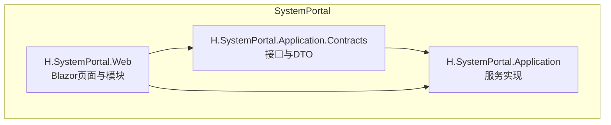
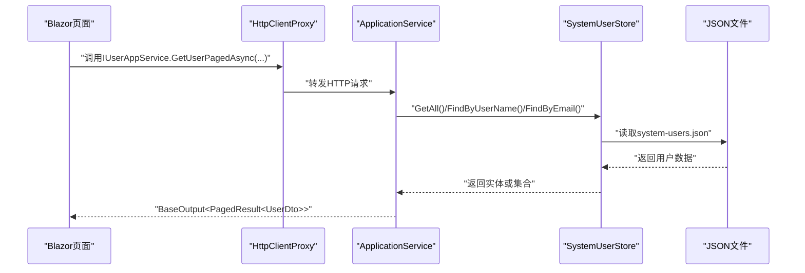
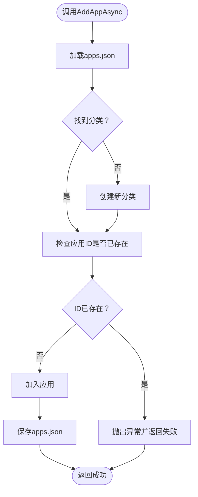
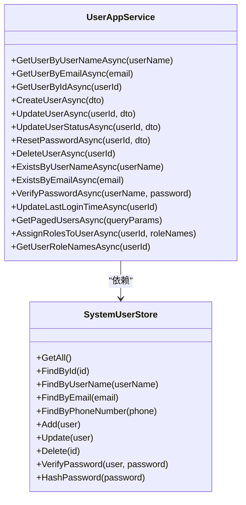
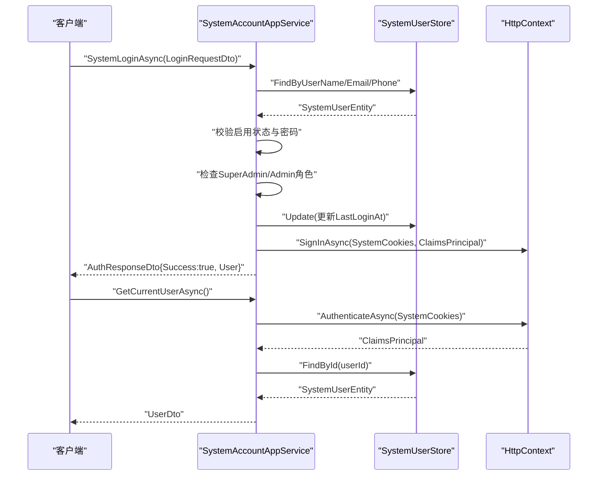
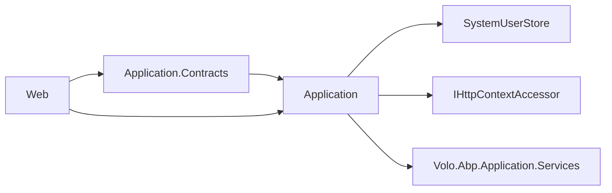

# SystemPortal 系统门户

<cite>
**本文引用的文件**   
- [README.md](file://README.md)
- [IAppManageAppService.cs](file://src/System/SystemPortal/H.SystemPortal.Application.Contracts/Services/IAppManageAppService.cs)
- [IUserAppService.cs](file://src/System/SystemPortal/H.SystemPortal.Application.Contracts/Services/IUserAppService.cs)
- [ISystemAccountAppService.cs](file://src/System/SystemPortal/H.SystemPortal.Application.Contracts/Services/ISystemAccountAppService.cs)
- [UserDto.cs](file://src/System/SystemPortal/H.SystemPortal.Application.Contracts/Dtos/UserDto.cs)
- [UserType.cs](file://src/System/SystemPortal/H.SystemPortal.Application.Contracts/Enums/UserType.cs)
- [SystemRoleNames.cs](file://src/System/SystemPortal/H.SystemPortal.Application.Contracts/Constants/SystemRoleNames.cs)
- [AppManageAppService.cs](file://src/System/SystemPortal/H.SystemPortal.Application/Services/AppManageAppService.cs)
- [UserAppService.cs](file://src/System/SystemPortal/H.SystemPortal.Application/Services/UserAppService.cs)
- [SystemAccountAppService.cs](file://src/System/SystemPortal/H.SystemPortal.Application/Services/SystemAccountAppService.cs)
- [SystemUserStore.cs](file://src/System/SystemPortal/H.SystemPortal.Application/Services/SystemUserStore.cs)
- [SystemPortalApplicationModule.cs](file://src/System/SystemPortal/H.SystemPortal.Application/SystemPortalApplicationModule.cs)
- [SystemPortalWebModule.cs](file://src/System/SystemPortal/H.SystemPortal.Web/SystemPortalWebModule.cs)
- [apps.json](file://src/System/SystemPortal/data/apps.json)
- [system-users.json](file://src/System/SystemPortal/data/system-users.json)
</cite>

## 目录
1. [简介](#简介)
2. [项目结构](#项目结构)
3. [核心组件](#核心组件)
4. [架构总览](#架构总览)
5. [详细组件分析](#详细组件分析)
6. [依赖关系分析](#依赖关系分析)
7. [性能与扩展性](#性能与扩展性)
8. [管理员操作手册](#管理员操作手册)
9. [常见问题排查](#常见问题排查)
10. [结论](#结论)

## 简介
SystemPortal 是 AppLab 的系统级门户子系统，负责平台运营侧的统一入口、应用聚合导航、系统账户登录与会话管理、以及系统用户与角色管理。它与应用抽屉（AppDrawer）配合，把组织管理、审批、通知、配置、后台任务、文件、供应链、订单、低代码开发、AI 工作台、自动化测试等各个业务应用统一接入到系统门户中，提供统一的导航、权限控制与管理界面。

从职责边界看：
- SystemPortal 负责“系统级”配置与管理：系统账户认证、系统用户与角色、应用菜单与分类的维护。
- 各 Services 下的企业级应用专注于领域功能：如 Order、Approval、SupplyChain、Organization 等。
- 前端通过 Blazor 页面组件展示管理界面；后端通过 ABP Application Service 暴露接口；数据目前以 JSON 文件作为轻量持久化实现。

该子模块遵循 ABP Framework 的分层约定：Application.Contracts 定义对外契约 DTO 与服务接口，Application 实现服务逻辑，Web 提供页面与模块标记。

**章节来源**
- [README.md:1-73](file://README.md#L1-L73)

## 项目结构
SystemPortal 由三个主要工程组成：
- H.SystemPortal.Application.Contracts：对外契约，包含应用管理、用户管理、系统账户管理的接口和 DTO。
- H.SystemPortal.Application：服务实现，封装应用菜单与系统用户的增删改查、登录校验、会话管理等逻辑。
- H.SystemPortal.Web：Blazor Web 模块与页面，承载系统门户的布局、登录页、应用管理页、用户管理页、企业列表页等。

**图表来源**
- [SystemPortalApplicationModule.cs:1-12](file://src/System/SystemPortal/H.SystemPortal.Application/SystemPortalApplicationModule.cs#L1-L12)
- [SystemPortalWebModule.cs:1-8](file://src/System/SystemPortal/H.SystemPortal.Web/SystemPortalWebModule.cs#L1-L8)

**章节来源**
- [README.md:1-73](file://README.md#L1-L73)
- [SystemPortalApplicationModule.cs:1-12](file://src/System/SystemPortal/H.SystemPortal.Application/SystemPortalApplicationModule.cs#L1-L12)
- [SystemPortalWebModule.cs:1-8](file://src/System/SystemPortal/H.SystemPortal.Web/SystemPortalWebModule.cs#L1-L8)

## 核心组件
SystemPortal 的核心能力集中在三类应用服务：

- 应用管理服务 IAppManageAppService：负责应用分类与应用项的查询与增删改，底层基于 apps.json。
- 用户管理服务 IUserAppService：负责系统用户的创建、更新、分页查询、状态变更、密码重置、删除、用户名/邮箱唯一性校验、密码验证、最后登录时间更新，以及用户角色分配与读取。
- 系统账户管理服务 ISystemAccountAppService：负责系统管理员登录、当前登录用户获取与登出，使用独立的 Cookie 认证方案。

这些服务的 DTO 包括 UserDto、CreateUserDto、UpdateUserDto、UpdateUserStatusDto、ResetPasswordDto、UserQueryParams、PagedResult、LoginRequestDto、AuthResponseDto 等，用于前后端交互的数据载体。

**章节来源**
- [IAppManageAppService.cs:1-41](file://src/System/SystemPortal/H.SystemPortal.Application.Contracts/Services/IAppManageAppService.cs#L1-L41)
- [IUserAppService.cs:1-30](file://src/System/SystemPortal/H.SystemPortal.Application.Contracts/Services/IUserAppService.cs#L1-L30)
- [ISystemAccountAppService.cs:1-22](file://src/System/SystemPortal/H.SystemPortal.Application.Contracts/Services/ISystemAccountAppService.cs#L1-L22)
- [UserDto.cs:1-186](file://src/System/SystemPortal/H.SystemPortal.Application.Contracts/Dtos/UserDto.cs#L1-L186)

## 架构总览
SystemPortal 的整体调用链如下：
- 前端页面（AppManagement.razor、UsersList.razor、UsersEdit.razor、EnterpriseList.razor 等）通过 ABP HttpClientProxy 动态代理调用后端 IAppService。
- 后端 Application Service 根据职责拆分：
  - AppManageAppService 读写 apps.json，维护应用分类与菜单。
  - UserAppService 通过 SystemUserStore 读写 system-users.json，并实现用户管理与角色分配。
  - SystemAccountAppService 进行系统管理员身份校验，并使用 IHttpContextAccessor 写入 SystemCookies 认证信息。

**图表来源**
- [UserAppService.cs:1-260](file://src/System/SystemPortal/H.SystemPortal.Application/Services/UserAppService.cs#L1-L260)
- [SystemUserStore.cs:1-235](file://src/System/SystemPortal/H.SystemPortal.Application/Services/SystemUserStore.cs#L1-L235)

## 详细组件分析

### 应用管理（AppManageAppService）
AppManageAppService 的职责是维护系统门户的应用目录，支持：
- 获取所有应用分类与对应应用列表。
- 添加应用与分类。
- 更新与删除应用。
- 删除分类（若分类下仍有应用则拒绝）。

实现要点：
- 通过 FindAppsJsonFile 确定 apps.json 的路径，在 DEBUG 与非 DEBUG 环境分别定位 data/apps.json。
- LoadAppData 与 SaveAppDataAsync 完成 JSON 的反序列化与带缩进的可读序列化。
- AddAppAsync/UpdateAppAsync/DeleteAppAsync 对 AppCategoryInfo[] 与 AppItemInfo 进行操作，保证 ID 不重复与分类存在性。
- AddCategoryAsync/DeleteCategoryAsync 维护分类元数据。

**图表来源**
- [AppManageAppService.cs:1-280](file://src/System/SystemPortal/H.SystemPortal.Application/Services/AppManageAppService.cs#L1-L280)

**章节来源**
- [IAppManageAppService.cs:1-41](file://src/System/SystemPortal/H.SystemPortal.Application.Contracts/Services/IAppManageAppService.cs#L1-L41)
- [AppManageAppService.cs:1-280](file://src/System/SystemPortal/H.SystemPortal.Application/Services/AppManageAppService.cs#L1-L280)
- [apps.json:1-155](file://src/System/SystemPortal/data/apps.json#L1-L155)

### 用户管理（UserAppService）
UserAppService 负责系统用户的完整生命周期管理，包括：
- 按用户名、邮箱、ID 查询用户。
- 创建用户（支持 CreateUserDto），进行用户名/邮箱唯一性与密码一致性校验。
- 更新用户信息与状态。
- 分页查询用户列表，支持关键词、用户类型、启用状态过滤。
- 重置密码、删除用户。
- 用户名/邮箱唯一性校验接口。
- 密码验证与最后登录时间更新。
- 为用户分配角色并读取用户角色名列表，同时自动推导 UserType。

实现要点：
- 通过 SystemUserStore 访问 system-users.json。
- MapToDto 将 SystemUserEntity 映射为 UserDto。
- DeriveUserType 根据角色列表推导用户类型：包含 SuperAdmin 则为超级管理员，否则包含 Admin 则为管理员，其余为普通用户。
- GetPagedUsersAsync 先全量过滤再内存分页，适合小数据集场景。

**图表来源**
- [UserAppService.cs:1-260](file://src/System/SystemPortal/H.SystemPortal.Application/Services/UserAppService.cs#L1-L260)
- [SystemUserStore.cs:1-235](file://src/System/SystemPortal/H.SystemPortal.Application/Services/SystemUserStore.cs#L1-L235)

**章节来源**
- [IUserAppService.cs:1-30](file://src/System/SystemPortal/H.SystemPortal.Application.Contracts/Services/IUserAppService.cs#L1-L30)
- [UserAppService.cs:1-260](file://src/System/SystemPortal/H.SystemPortal.Application/Services/UserAppService.cs#L1-L260)
- [SystemUserStore.cs:1-235](file://src/System/SystemPortal/H.SystemPortal.Application/Services/SystemUserStore.cs#L1-L235)
- [UserDto.cs:1-186](file://src/System/SystemPortal/H.SystemPortal.Application.Contracts/Dtos/UserDto.cs#L1-L186)

### 系统账户管理（SystemAccountAppService）
SystemAccountAppService 负责系统管理员的登录、当前用户信息获取与登出：
- SystemLoginAsync 支持用户名、邮箱、手机号三种账号输入，校验用户存在性、启用状态、密码正确性，并要求具备 SuperAdmin 或 Admin 角色。
- 成功后更新 LastLoginAt，并以 ClaimsIdentity 写入名为 SystemCookies 的 Cookie 认证信息，支持“记住我”。
- GetCurrentUserAsync 显式验证 SystemCookies 方案，解析用户标识并返回系统管理员的用户信息。
- SystemLogoutAsync 执行登出。

**图表来源**
- [SystemAccountAppService.cs:1-176](file://src/System/SystemPortal/H.SystemPortal.Application/Services/SystemAccountAppService.cs#L1-L176)
- [SystemUserStore.cs:1-235](file://src/System/SystemPortal/H.SystemPortal.Application/Services/SystemUserStore.cs#L1-L235)

**章节来源**
- [ISystemAccountAppService.cs:1-22](file://src/System/SystemPortal/H.SystemPortal.Application.Contracts/Services/ISystemAccountAppService.cs#L1-L22)
- [SystemAccountAppService.cs:1-176](file://src/System/SystemPortal/H.SystemPortal.Application/Services/SystemAccountAppService.cs#L1-L176)
- [UserDto.cs:1-186](file://src/System/SystemPortal/H.SystemPortal.Application.Contracts/Dtos/UserDto.cs#L1-L186)
- [SystemRoleNames.cs:1-29](file://src/System/SystemPortal/H.SystemPortal.Application.Contracts/Constants/SystemRoleNames.cs#L1-L29)

### 页面组件与使用指南
- AppManagement.razor：用于查看和维护应用分类与应用项，调用 IAppManageAppService 的 GetAllCategoriesAsync、AddAppAsync、UpdateAppAsync、DeleteAppAsync、AddCategoryAsync、DeleteCategoryAsync。
- UsersList.razor：列出系统用户，支持分页、关键词、用户类型、启用状态筛选，调用 IUserAppService.GetPagedUsersAsync。
- UsersEdit.razor：编辑用户基本信息与角色，调用 IUserAppService.UpdateUserAsync、AssignRolesToUserAsync。
- EnterpriseList.razor：企业列表页面，通常与系统门户的企业维度管理相关（具体实现可参考该项目中的页面文件）。

使用建议：
- 所有增删改操作需结合 ABP 权限系统控制可见性与可操作性。
- 对于敏感操作（重置密码、删除用户、分配角色）应增加二次确认与审计日志。
- 前端表单应与 DTO 字段保持一致，确保必填、长度、格式校验与后端一致。

**章节来源**
- [IAppManageAppService.cs:1-41](file://src/System/SystemPortal/H.SystemPortal.Application.Contracts/Services/IAppManageAppService.cs#L1-L41)
- [IUserAppService.cs:1-30](file://src/System/SystemPortal/H.SystemPortal.Application.Contracts/Services/IUserAppService.cs#L1-L30)

## 依赖关系分析
SystemPortal 的关键依赖如下：
- Application.Contracts 定义接口与 DTO，被 Application 与 Web 共同引用。
- Application 依赖 SystemUserStore 进行用户数据的 JSON 持久化。
- SystemAccountAppService 依赖 IHttpContextAccessor 进行 Cookie 认证。
- SystemPortalApplicationModule 注册 SystemUserStore 为单例。
- SystemPortalWebModule 作为 Web 模块标记类，便于宿主程序发现与组合。

**图表来源**
- [SystemPortalApplicationModule.cs:1-12](file://src/System/SystemPortal/H.SystemPortal.Application/SystemPortalApplicationModule.cs#L1-L12)
- [SystemPortalWebModule.cs:1-8](file://src/System/SystemPortal/H.SystemPortal.Web/SystemPortalWebModule.cs#L1-L8)
- [SystemAccountAppService.cs:1-176](file://src/System/SystemPortal/H.SystemPortal.Application/Services/SystemAccountAppService.cs#L1-L176)

**章节来源**
- [SystemPortalApplicationModule.cs:1-12](file://src/System/SystemPortal/H.SystemPortal.Application/SystemPortalApplicationModule.cs#L1-L12)
- [SystemPortalWebModule.cs:1-8](file://src/System/SystemPortal/H.SystemPortal.Web/SystemPortalWebModule.cs#L1-L8)
- [SystemAccountAppService.cs:1-176](file://src/System/SystemPortal/H.SystemPortal.Application/Services/SystemAccountAppService.cs#L1-L176)

## 性能与扩展性
当前实现以 JSON 文件作为数据存储：
- 优点：部署简单、无需数据库初始化、适合演示与小型系统。
- 缺点：并发写存在竞争风险；大数据集下分页与查询效率较低；缺少事务与索引。

优化建议：
- 将 SystemUserStore 与 AppManageAppService 的数据源替换为 EntityFrameworkCore 仓储，引入数据库事务、索引与并发控制。
- 对 GetPagedUsersAsync 改为服务端分页，避免全量内存分页。
- 对 apps.json 与 system-users.json 的读写增加文件锁或迁移至数据库表。
- 对密码哈希参数（PBKDF2 迭代次数）进行安全评估，平衡安全性与性能。

**章节来源**
- [AppManageAppService.cs:1-280](file://src/System/SystemPortal/H.SystemPortal.Application/Services/AppManageAppService.cs#L1-L280)
- [UserAppService.cs:1-260](file://src/System/SystemPortal/H.SystemPortal.Application/Services/UserAppService.cs#L1-L260)
- [SystemUserStore.cs:1-235](file://src/System/SystemPortal/H.SystemPortal.Application/Services/SystemUserStore.cs#L1-L235)

## 管理员操作手册

### 应用场景一：注册新的业务应用
目标：在系统门户中添加一个新的业务应用链接，使其出现在应用抽屉中。

步骤：
1. 打开应用管理页面（AppManagement.razor）。
2. 选择或新建一个应用分类（例如“基础应用”、“业务应用”）。
3. 点击添加应用，填写应用的 Id、名称、图标、URL、打开方式、描述、排序等信息。
4. 保存后，刷新门户即可在新分类中看到该应用。

注意事项：
- 应用 Id 必须唯一。
- URL 需要与宿主路由匹配，确保点击后可跳转至目标业务应用。
- 如果应用尚未上线，可先禁用 enabled 标志，待上线后再启用。

**章节来源**
- [IAppManageAppService.cs:1-41](file://src/System/SystemPortal/H.SystemPortal.Application.Contracts/Services/IAppManageAppService.cs#L1-L41)
- [AppManageAppService.cs:1-280](file://src/System/SystemPortal/H.SystemPortal.Application/Services/AppManageAppService.cs#L1-L280)
- [apps.json:1-155](file://src/System/SystemPortal/data/apps.json#L1-L155)

### 应用场景二：创建系统管理员用户并分配角色
目标：为新入职的系统运维人员创建系统管理员账号，并赋予相应角色。

步骤：
1. 打开用户管理页面（UsersList.razor），点击新增用户。
2. 填写用户名、邮箱、手机号、初始密码与确认密码。
3. 勾选启用状态，选择用户类型（系统会依据角色自动推导）。
4. 保存用户后，进入用户详情或编辑页，为其分配角色：
   - SuperAdmin：拥有所有企业的所有权限。
   - Admin：拥有所有企业的部分权限。
5. 使用系统账户登录页（SystemLogin.razor）验证是否能以新管理员身份登录。

注意事项：
- 用户名与邮箱必须唯一。
- 初始密码建议使用强密码策略，并在首次登录后强制修改。
- 角色名称需与 ABP IdentityRole 的名称一致（参见 SystemRoleNames）。

**章节来源**
- [IUserAppService.cs:1-30](file://src/System/SystemPortal/H.SystemPortal.Application.Contracts/Services/IUserAppService.cs#L1-L30)
- [UserAppService.cs:1-260](file://src/System/SystemPortal/H.SystemPortal.Application/Services/UserAppService.cs#L1-L260)
- [SystemRoleNames.cs:1-29](file://src/System/SystemPortal/H.SystemPortal.Application.Contracts/Constants/SystemRoleNames.cs#L1-L29)
- [system-users.json:1-19](file://src/System/SystemPortal/data/system-users.json#L1-L19)

### 应用场景三：重置用户密码与恢复账号状态
目标：在用户忘记密码或账号被误禁用时，管理员可重置密码或恢复启用状态。

步骤：
1. 在用户列表中查找目标用户。
2. 进入编辑页，修改密码（输入新密码与确认密码）。
3. 如需恢复启用状态，将 IsActive 设置为 true，并保存。
4. 如需限制某用户临时登录，可将 IsActive 设为 false 并添加备注说明。

注意事项：
- 重置密码前建议记录审计日志。
- 禁用账号后，用户将无法登录系统门户。

**章节来源**
- [IUserAppService.cs:1-30](file://src/System/SystemPortal/H.SystemPortal.Application.Contracts/Services/IUserAppService.cs#L1-L30)
- [UserAppService.cs:1-260](file://src/System/SystemPortal/H.SystemPortal.Application/Services/UserAppService.cs#L1-L260)

### 应用场景四：调整门户菜单与分类
目标：对现有应用分类进行调整，如重命名分类、移动应用到其他分类、删除不再使用的应用。

步骤：
1. 打开应用管理页面。
2. 修改分类名称或删除空分类。
3. 更新或移除某个应用条目。
4. 保存后检查门户导航是否正确显示。

注意事项：
- 删除分类前需确保分类下没有应用。
- 移动应用时注意 URL 路由与目标应用是否匹配。

**章节来源**
- [IAppManageAppService.cs:1-41](file://src/System/SystemPortal/H.SystemPortal.Application.Contracts/Services/IAppManageAppService.cs#L1-L41)
- [AppManageAppService.cs:1-280](file://src/System/SystemPortal/H.SystemPortal.Application/Services/AppManageAppService.cs#L1-L280)
- [apps.json:1-155](file://src/System/SystemPortal/data/apps.json#L1-L155)

## 常见问题排查

### 问题一：登录提示“用户名或密码错误”
可能原因：
- 输入的账号不存在。
- 密码不正确。
- 用户已被禁用（IsActive=false）。
- 用户不具备 SuperAdmin 或 Admin 角色。

排查建议：
- 检查 system-users.json 中是否存在该用户且 IsActive=true。
- 检查用户 RoleNames 是否包含 SuperAdmin 或 Admin。
- 使用 VerifyPassword 或重新设置密码后进行登录。

**章节来源**
- [SystemAccountAppService.cs:1-176](file://src/System/SystemPortal/H.SystemPortal.Application/Services/SystemAccountAppService.cs#L1-L176)
- [system-users.json:1-19](file://src/System/SystemPortal/data/system-users.json#L1-L19)

### 问题二：无法访问系统门户（无权限）
可能原因：
- 用户未具备 SuperAdmin 或 Admin 角色。
- Cookie 未正确写入或过期。

排查建议：
- 检查登录成功后是否写入 SystemCookies。
- 检查 GetCurrentUserAsync 是否能解析 ClaimsPrincipal。
- 确保用户角色包含 SuperAdmin 或 Admin。

**章节来源**
- [SystemAccountAppService.cs:1-176](file://src/System/SystemPortal/H.SystemPortal.Application/Services/SystemAccountAppService.cs#L1-L176)

### 问题三：应用未显示在门户导航中
可能原因：
- apps.json 中未添加该应用。
- 应用分类未创建或分类名称不一致。
- 应用 URL 与宿主路由不匹配。

排查建议：
- 检查 apps.json 中是否有对应的分类与应用条目。
- 检查应用 URL 是否与目标业务应用路由一致。
- 检查应用是否启用（enabled=true）。

**章节来源**
- [AppManageAppService.cs:1-280](file://src/System/SystemPortal/H.SystemPortal.Application/Services/AppManageAppService.cs#L1-L280)
- [apps.json:1-155](file://src/System/SystemPortal/data/apps.json#L1-L155)

## 结论
SystemPortal 作为 AppLab 的平台运营入口，承担应用聚合导航、系统账户认证与会话管理、系统用户与角色管理职责。其当前实现采用 JSON 文件作为轻量存储，适合演示与小型系统。随着规模增长，建议迁移至数据库并提供更完善的权限体系、审计机制与高可用设计。

在与 ABP Framework 的集成方面：
- 多租户：SystemPortal 目前未直接体现租户上下文；如需扩展，可在 SystemUserStore 与 AppManageAppService 中引入 TenantId 维度。
- 权限系统：通过 SystemRoleNames 与 ABP IdentityRole 名称对齐，结合角色进行访问控制。后续可进一步与 ABP Permission 系统整合，实现细粒度权限控制。