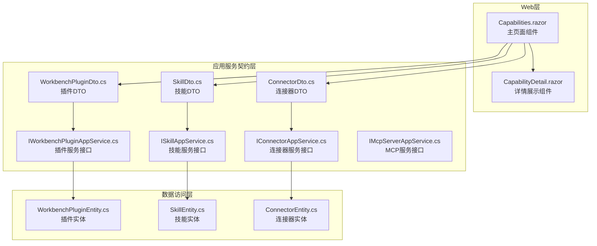
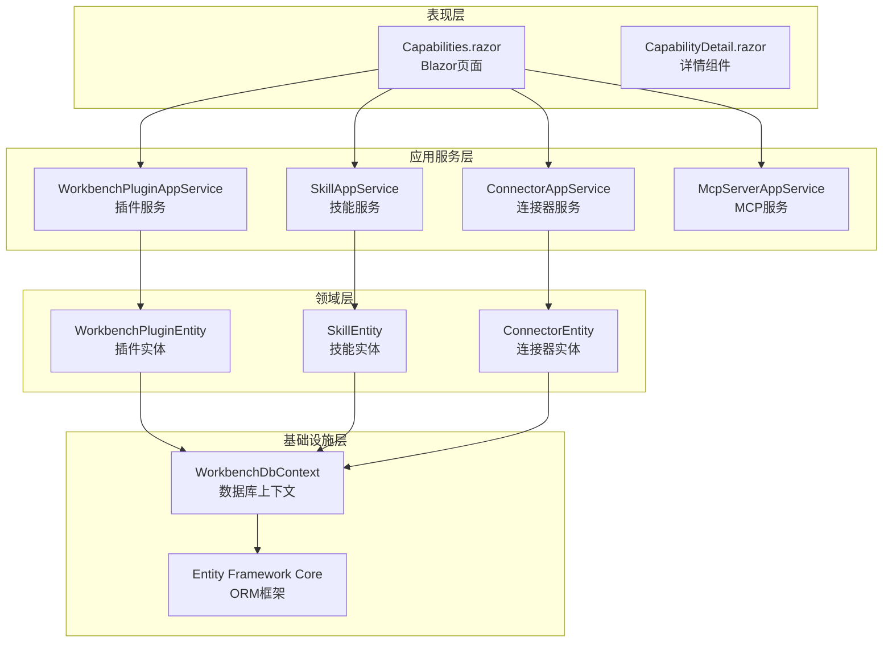
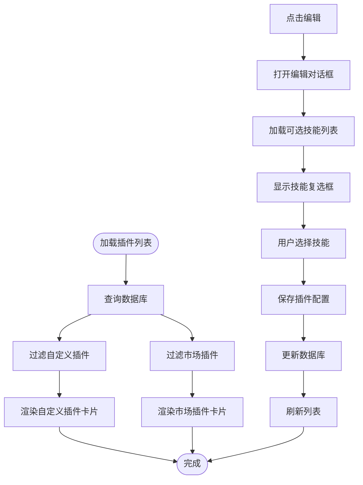
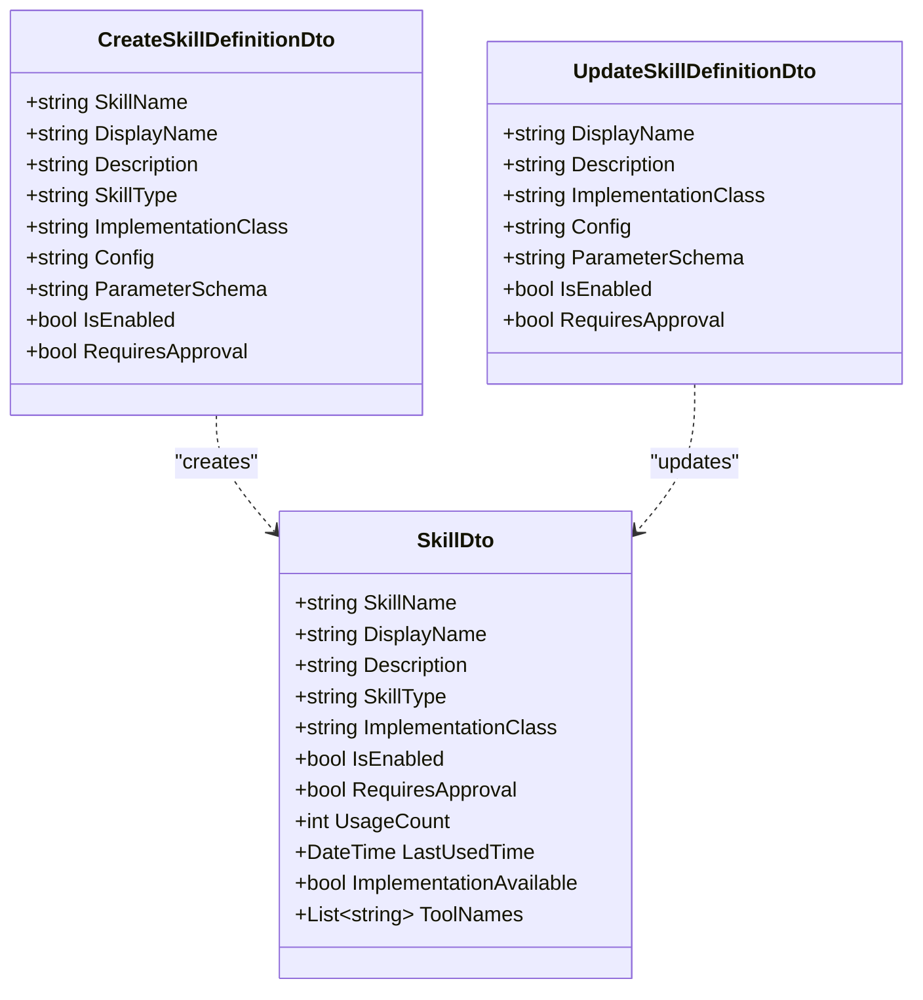
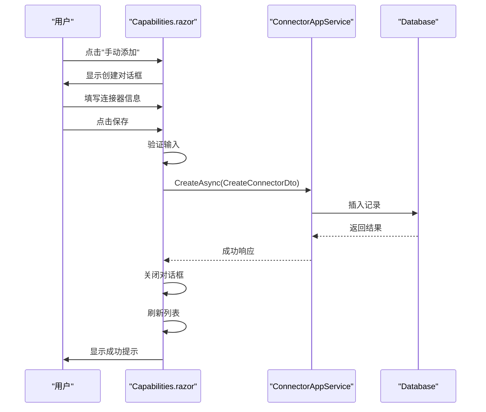
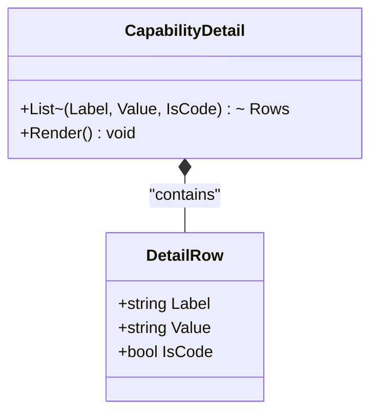
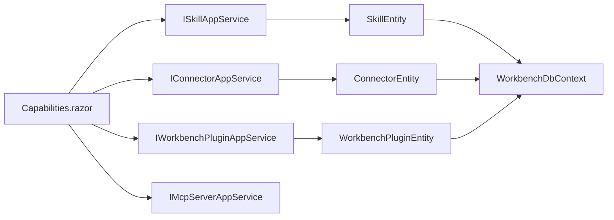
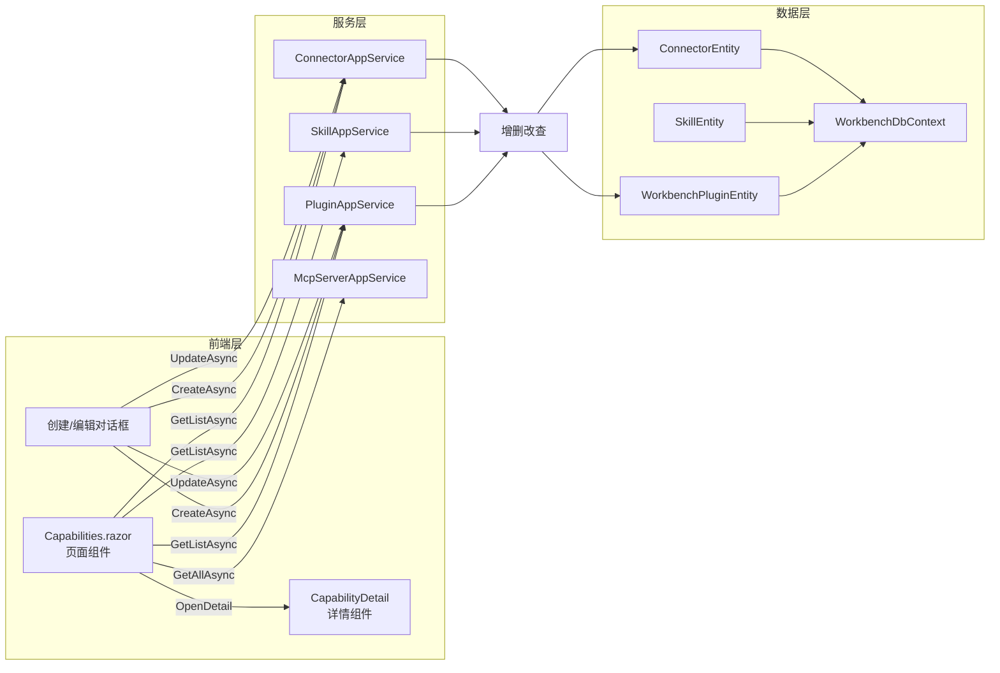

# 能力管理中心

<cite>
**Referenced Files in This Document **
- [Capabilities.razor](file://src/Agent/Workbench/H.Workbench.Web/Pages/Capabilities.razor)
- [CapabilityDetail.razor](file://src/Agent/Workbench/H.Workbench.Web/Components/CapabilityDetail.razor)
- [WorkbenchPluginDto.cs](file://src/Agent/Workbench/H.Workbench.Application.Contracts/Dtos/Plugins/WorkbenchPluginDto.cs)
- [SkillDto.cs](file://src/Agent/Workbench/H.Workbench.Application.Contracts/Dtos/Skills/SkillDto.cs)
- [ConnectorDto.cs](file://src/Agent/Workbench/H.Workbench.Application.Contracts/Dtos/Connectors/ConnectorDto.cs)
- [IWorkbenchPluginAppService.cs](file://src/Agent/Workbench/H.Workbench.Application.Contracts/Services/Plugins/IWorkbenchPluginAppService.cs)
- [ISkillAppService.cs](file://src/Agent/Workbench/H.Workbench.Application.Contracts/Services/Skills/ISkillAppService.cs)
- [IConnectorAppService.cs](file://src/Agent/Workbench/H.Workbench.Application.Contracts/Services/Connectors/IConnectorAppService.cs)
- [IMcpServerAppService.cs](file://src/Agent/Workbench/H.Workbench.Application.Contracts/Services/Mcps/IMcpServerAppService.cs)
- [WorkbenchPluginEntity.cs](file://src/Agent/Workbench/H.Workbench.EntityFrameworkCore/Entities/WorkbenchPluginEntity.cs)
- [SkillEntity.cs](file://src/Agent/Workbench/H.Workbench.EntityFrameworkCore/Entities/SkillEntity.cs)
- [ConnectorEntity.cs](file://src/Agent/Workbench/H.Workbench.EntityFrameworkCore/Entities/ConnectorEntity.cs)
</cite>

## Table of Contents
1. [Introduction](#introduction)
2. [Project Structure](#project-structure)
3. [Core Components](#core-components)
4. [Architecture Overview](#architecture-overview)
5. [Detailed Component Analysis](#detailed-component-analysis)
6. [Dependency Analysis](#dependency-analysis)
7. [Performance Considerations](#performance-considerations)
8. [Troubleshooting Guide](#troubleshooting-guide)
9. [Conclusion](#conclusion)

## Introduction

能力管理中心是AI工作台的核心功能模块，提供插件、技能和连接器的统一管理平台。该页面位于 `/workbench/capabilities` 路由下，是员工获取工具权限的前置步骤。管理员可以在此创建自定义插件并配置技能组合，管理连接器（如浏览器自动化、计算机控制）的启用状态，以及查看MCP服务列表。所有能力的启用状态直接影响员工在任务执行中可用的工具集。

## Project Structure

能力管理中心涉及多个层次的文件：

**Diagram sources **
- [Capabilities.razor:1-50](file://src/Agent/Workbench/H.Workbench.Web/Pages/Capabilities.razor#L1-L50)
- [WorkbenchPluginDto.cs:1-30](file://src/Agent/Workbench/H.Workbench.Application.Contracts/Dtos/Plugins/WorkbenchPluginDto.cs#L1-L30)
- [SkillDto.cs:1-30](file://src/Agent/Workbench/H.Workbench.Application.Contracts/Dtos/Skills/SkillDto.cs#L1-L30)
- [ConnectorDto.cs:1-30](file://src/Agent/Workbench/H.Workbench.Application.Contracts/Dtos/Connectors/ConnectorDto.cs#L1-L30)

**Section sources**
- [Capabilities.razor:1-100](file://src/Agent/Workbench/H.Workbench.Web/Pages/Capabilities.razor#L1-L100)
- [WorkbenchPluginDto.cs:1-65](file://src/Agent/Workbench/H.Workbench.Application.Contracts/Dtos/Plugins/WorkbenchPluginDto.cs#L1-L65)
- [SkillDto.cs:1-89](file://src/Agent/Workbench/H.Workbench.Application.Contracts/Dtos/Skills/SkillDto.cs#L1-L89)
- [ConnectorDto.cs:1-64](file://src/Agent/Workbench/H.Workbench.Application.Contracts/Dtos/Connectors/ConnectorDto.cs#L1-L64)

## Core Components

能力管理中心包含以下核心组件：

### 1. 主页面组件 (Capabilities.razor)

主页面采用标签页设计，分为三个主要视图：
- **插件标签**：管理自定义插件和插件市场中的插件
- **技能标签**：展示和管理所有可用技能
- **连接器标签**：管理自定义连接器、连接器市场和MCP服务

页面支持以下操作：
- 切换标签页动态加载对应数据
- 启用/停用各项能力
- 创建、编辑、删除自定义插件和连接器
- 查看各项能力的详细信息

**Section sources**
- [Capabilities.razor:1-200](file://src/Agent/Workbench/H.Workbench.Web/Pages/Capabilities.razor#L1-L200)
- [Capabilities.razor:350-500](file://src/Agent/Workbench/H.Workbench.Web/Pages/Capabilities.razor#L350-L500)

### 2. 详情展示组件 (CapabilityDetail.razor)

通用详情展示组件，用于在模态框中显示各项能力的详细属性。支持普通文本和代码块两种展示模式。

**Section sources**
- [CapabilityDetail.razor:1-24](file://src/Agent/Workbench/H.Workbench.Web/Components/CapabilityDetail.razor#L1-L24)

### 3. 数据模型

#### 插件模型 (WorkbenchPluginDto)

插件是打包好的技能组合，包含以下关键字段：
- `PluginKey`：唯一标识符
- `PluginName`：插件名称
- `Source`：来源类型（Market/Custom）
- `Icon`：图标emoji
- `IsEnabled`：启用状态
- `SkillKeys`：授予的技能名列表

**Section sources**
- [WorkbenchPluginDto.cs:1-65](file://src/Agent/Workbench/H.Workbench.Application.Contracts/Dtos/Plugins/WorkbenchPluginDto.cs#L1-L65)

#### 技能模型 (SkillDto)

技能代表具体的工具能力，包含：
- `SkillName`：技能名称
- `DisplayName`：显示名称
- `SkillType`：技能类型（Function/Planned）
- `ImplementationClass`：实现类名
- `IsEnabled`：启用状态
- `RequiresApproval`：是否需要审批
- `UsageCount`：调用次数
- `ToolNames`：工具方法名列表

**Section sources**
- [SkillDto.cs:1-89](file://src/Agent/Workbench/H.Workbench.Application.Contracts/Dtos/Skills/SkillDto.cs#L1-L89)

#### 连接器模型 (ConnectorDto)

连接器提供设备级能力，包含：
- `ConnectorKey`：唯一标识符
- `ConnectorName`：连接器名称
- `Source`：来源类型（Market/Custom）
- `Config`：JSON格式的配置信息
- `IsEnabled`：启用状态

**Section sources**
- [ConnectorDto.cs:1-64](file://src/Agent/Workbench/H.Workbench.Application.Contracts/Dtos/Connectors/ConnectorDto.cs#L1-L64)

## Architecture Overview

能力管理中心采用分层架构设计：

**Diagram sources **
- [Capabilities.razor:350-400](file://src/Agent/Workbench/H.Workbench.Web/Pages/Capabilities.razor#L350-L400)
- [WorkbenchPluginEntity.cs:1-50](file://src/Agent/Workbench/H.Workbench.EntityFrameworkCore/Entities/WorkbenchPluginEntity.cs#L1-L50)
- [SkillEntity.cs:1-50](file://src/Agent/Workbench/H.Workbench.EntityFrameworkCore/Entities/SkillEntity.cs#L1-L50)
- [ConnectorEntity.cs:1-50](file://src/Agent/Workbench/H.Workbench.EntityFrameworkCore/Entities/ConnectorEntity.cs#L1-L50)

## Detailed Component Analysis

### 插件管理功能

#### 插件列表展示

插件列表按来源分为两部分：
1. **自定义插件**：用户手动创建的插件，支持编辑和删除
2. **插件市场插件**：系统预置的插件，仅支持启用/停用

每个插件卡片显示：
- 图标和名称
- 描述信息
- 授予的技能数量和列表
- 启用/停用开关
- 操作按钮（编辑、删除）

**Diagram sources **
- [Capabilities.razor:30-80](file://src/Agent/Workbench/H.Workbench.Web/Pages/Capabilities.razor#L30-L80)
- [Capabilities.razor:400-500](file://src/Agent/Workbench/H.Workbench.Web/Pages/Capabilities.razor#L400-L500)

#### 插件创建流程

创建自定义插件时，用户需要：
1. 输入插件名称（必填）
2. 选择图标（可选，支持emoji）
3. 填写描述信息
4. 从技能列表中选择要授予的技能
5. 保存后插件立即生效

**Section sources**
- [Capabilities.razor:250-350](file://src/Agent/Workbench/H.Workbench.Web/Pages/Capabilities.razor#L250-L350)
- [WorkbenchPluginDto.cs:28-45](file://src/Agent/Workbench/H.Workbench.Application.Contracts/Dtos/Plugins/WorkbenchPluginDto.cs#L28-L45)

### 技能管理功能

#### 技能列表展示

技能列表展示所有可用技能，每个技能卡片显示：
- 技能名称和类型标签
- 描述信息
- 实现状态（待实现/实现类不可用）
- 启用/停用开关
- 技能标识

**Diagram sources **
- [SkillDto.cs:1-89](file://src/Agent/Workbench/H.Workbench.Application.Contracts/Dtos/Skills/SkillDto.cs#L1-L89)

#### 技能详情展示

点击技能卡片可查看详细信息，包括：
- 基本信息（名称、类型、状态）
- 调用统计（使用次数、最后使用时间）
- 工具方法列表
- 实现类信息
- 参数Schema（JSON格式）
- 配置信息（JSON格式）

**Section sources**
- [Capabilities.razor:100-150](file://src/Agent/Workbench/H.Workbench.Web/Pages/Capabilities.razor#L100-L150)
- [Capabilities.razor:650-700](file://src/Agent/Workbench/H.Workbench.Web/Pages/Capabilities.razor#L650-L700)

### 连接器管理功能

#### 连接器类型

系统支持两种主要连接器类型：
1. **浏览器自动化**：基于Playwright的真实浏览器操作
   - 打开网页
   - 点击元素
   - 输入文本
   - 读取渲染后文本
   - 截图存盘

2. **计算机控制**：本机操作能力
   - 截屏
   - 窗口激活
   - 键鼠输入
   - 默认每个动作需人工批准

#### 连接器创建流程

创建自定义连接器时，用户需要：
1. 输入连接器名称（必填）
2. 选择图标（可选）
3. 填写描述信息
4. 配置JSON格式的连接参数
5. 保存后连接器立即可用

**Diagram sources **
- [Capabilities.razor:150-200](file://src/Agent/Workbench/H.Workbench.Web/Pages/Capabilities.razor#L150-L200)
- [Capabilities.razor:520-600](file://src/Agent/Workbench/H.Workbench.Web/Pages/Capabilities.razor#L520-L600)
- [ConnectorDto.cs:26-40](file://src/Agent/Workbench/H.Workbench.Application.Contracts/Dtos/Connectors/ConnectorDto.cs#L26-L40)

#### MCP服务集成

连接器标签页还展示MCP（Model Context Protocol）服务列表，每个MCP服务显示：
- 服务标识和传输方式
- 端点URL
- 超时设置
- 启用状态
- 凭据信息（AuthToken、ApiKey）
- 请求头配置

**Section sources**
- [Capabilities.razor:200-250](file://src/Agent/Workbench/H.Workbench.Web/Pages/Capabilities.razor#L200-L250)
- [Capabilities.razor:700-750](file://src/Agent/Workbench/H.Workbench.Web/Pages/Capabilities.razor#L700-L750)

### 详情展示机制

CapabilityDetail组件采用统一的详情展示模式：

**Diagram sources **
- [CapabilityDetail.razor:1-24](file://src/Agent/Workbench/H.Workbench.Web/Components/CapabilityDetail.razor#L1-L24)

详情行根据`IsCode`标志决定展示方式：
- 普通文本：直接显示
- 代码块：使用等宽字体格式化显示（适用于JSON、类名、端点等）

**Section sources**
- [Capabilities.razor:620-750](file://src/Agent/Workbench/H.Workbench.Web/Pages/Capabilities.razor#L620-L750)

## Dependency Analysis

### 服务依赖关系

**Diagram sources **
- [Capabilities.razor:1-10](file://src/Agent/Workbench/H.Workbench.Web/Pages/Capabilities.razor#L1-L10)
- [IWorkbenchPluginAppService.cs:1-30](file://src/Agent/Workbench/H.Workbench.Application.Contracts/Services/Plugins/IWorkbenchPluginAppService.cs#L1-L30)
- [ISkillAppService.cs:1-30](file://src/Agent/Workbench/H.Workbench.Application.Contracts/Services/Skills/ISkillAppService.cs#L1-L30)
- [IConnectorAppService.cs:1-30](file://src/Agent/Workbench/H.Workbench.Application.Contracts/Services/Connectors/IConnectorAppService.cs#L1-L30)

### 数据流分析

**Diagram sources **
- [Capabilities.razor:370-420](file://src/Agent/Workbench/H.Workbench.Web/Pages/Capabilities.razor#L370-L420)
- [WorkbenchPluginEntity.cs:1-50](file://src/Agent/Workbench/H.Workbench.EntityFrameworkCore/Entities/WorkbenchPluginEntity.cs#L1-L50)
- [SkillEntity.cs:1-50](file://src/Agent/Workbench/H.Workbench.EntityFrameworkCore/Entities/SkillEntity.cs#L1-L50)
- [ConnectorEntity.cs:1-50](file://src/Agent/Workbench/H.Workbench.EntityFrameworkCore/Entities/ConnectorEntity.cs#L1-L50)

### 与员工设置的关联

能力管理中心是员工权限配置的前置步骤：
1. 在能力页面启用插件/连接器
2. 在员工设置页面的插件/连接器标签中勾选已启用的项
3. 员工获得对应工具的使用权限

这种设计实现了能力管理和权限分配的分离，便于集中管理能力库和灵活分配权限。

**Section sources**
- [Capabilities.razor:15-20](file://src/Agent/Workbench/H.Workbench.Web/Pages/Capabilities.razor#L15-L20)
- [Capabilities.razor:22-25](file://src/Agent/Workbench/H.Workbench.Web/Pages/Capabilities.razor#L22-L25)

## Performance Considerations

### 数据加载优化

1. **按需加载**：切换标签页时才加载对应数据，避免一次性加载所有数据
2. **分页支持**：所有查询都使用`PagedResultRequestDto`，支持分页和最大结果数限制
3. **缓存策略**：技能选项在打开插件对话框时单独加载，避免重复查询

### UI性能优化

1. **虚拟滚动**：对于大量数据，卡片网格采用CSS Grid布局，浏览器自动优化渲染
2. **防抖处理**：开关切换操作直接调用API，无额外延迟
3. **Toast通知**：使用轻量级Toast替代重型模态框，减少DOM操作

### 数据库查询优化

1. **索引设计**：实体类的主键和常用查询字段应建立索引
2. **批量操作**：支持批量启用/停用操作（当前为单个操作，可扩展）
3. **懒加载**：详情数据仅在用户点击查看时加载

**Section sources**
- [Capabilities.razor:370-420](file://src/Agent/Workbench/H.Workbench.Web/Pages/Capabilities.razor#L370-L420)
- [WorkbenchPluginDto.cs:58-65](file://src/Agent/Workbench/H.Workbench.Application.Contracts/Dtos/Plugins/WorkbenchPluginDto.cs#L58-L65)
- [SkillDto.cs:78-89](file://src/Agent/Workbench/H.Workbench.Application.Contracts/Dtos/Skills/SkillDto.cs#L78-L89)
- [ConnectorDto.cs:55-64](file://src/Agent/Workbench/H.Workbench.Application.Contracts/Dtos/Connectors/ConnectorDto.cs#L55-L64)

## Troubleshooting Guide

### 常见问题

#### 1. 插件创建失败

**症状**：点击保存后显示错误提示

**可能原因**：
- 插件名称为空或超过200字符
- 技能列表加载失败

**解决方案**：
- 检查插件名称是否符合要求
- 查看控制台网络请求，确认技能列表API是否正常
- 检查后端日志是否有异常

**Section sources**
- [Capabilities.razor:450-480](file://src/Agent/Workbench/H.Workbench.Web/Pages/Capabilities.razor#L450-L480)
- [WorkbenchPluginDto.cs:28-35](file://src/Agent/Workbench/H.Workbench.Application.Contracts/Dtos/Plugins/WorkbenchPluginDto.cs#L28-L35)

#### 2. 连接器配置无效

**症状**：保存连接器后无法正常使用

**可能原因**：
- JSON配置格式错误
- 配置参数不完整

**解决方案**：
- 使用JSON验证工具检查配置格式
- 参考连接器文档确认必需参数
- 查看后端日志确认配置解析是否成功

**Section sources**
- [Capabilities.razor:520-560](file://src/Agent/Workbench/H.Workbench.Web/Pages/Capabilities.razor#L520-L560)
- [ConnectorDto.cs:36-40](file://src/Agent/Workbench/H.Workbench.Application.Contracts/Dtos/Connectors/ConnectorDto.cs#L36-L40)

#### 3. 技能未生效

**症状**：插件已启用但员工无法使用对应工具

**可能原因**：
- 技能本身被禁用
- 员工未在员工设置中勾选该插件
- 技能实现类不可用

**解决方案**：
- 检查技能的`IsEnabled`状态
- 在员工设置页面确认插件已勾选
- 查看技能的`ImplementationAvailable`属性

**Section sources**
- [Capabilities.razor:100-130](file://src/Agent/Workbench/H.Workbench.Web/Pages/Capabilities.razor#L100-L130)
- [SkillDto.cs:18-24](file://src/Agent/Workbench/H.Workbench.Application.Contracts/Dtos/Skills/SkillDto.cs#L18-L24)

#### 4. 详情弹窗JSON显示异常

**症状**：详情中的JSON配置显示为原始字符串

**可能原因**：
- JSON格式不正确，PrettyJson方法解析失败

**解决方案**：
- 检查配置是否为有效JSON
- 查看`PrettyJson`方法的异常处理逻辑
- 手动格式化JSON后重新保存

**Section sources**
- [Capabilities.razor:730-750](file://src/Agent/Workbench/H.Workbench.Web/Pages/Capabilities.razor#L730-L750)

### 调试技巧

1. **浏览器开发者工具**：
   - 查看Network标签监控API请求
   - 检查Console标签的错误信息
   - 使用Elements标签检查DOM结构

2. **后端日志**：
   - 启用详细日志级别
   - 查看Entity Framework Core生成的SQL
   - 检查异常堆栈跟踪

3. **数据库直接查询**：
   - 使用数据库客户端直接查询实体表
   - 验证数据是否正确持久化
   - 检查外键关系和约束

## Conclusion

能力管理中心是AI工作台的核心管理模块，提供了插件、技能和连接器的统一管理平台。通过分层架构设计和清晰的数据流，实现了高效的能力管理和灵活的权限分配。

关键特性包括：
- **三合一管理界面**：插件、技能、连接器在同一页面统一管理
- **来源区分**：明确区分自定义资源和市场资源
- **技能组合配置**：插件可灵活选择授予的技能集合
- **详情可视化**：统一的详情展示组件，支持JSON格式化
- **实时状态切换**：启用/停用操作即时生效
- **员工权限前置**：能力管理是员工权限分配的基础

该模块的设计遵循了关注点分离原则，将能力定义、能力启用和权限分配三个环节解耦，既保证了管理的集中性，又提供了分配的灵活性。未来可扩展的方向包括批量操作支持、能力版本管理、使用情况统计等功能。