# 企业管理

<cite>
**本文引用的文件**   
- [EnterpriseDto.cs](file://src/System/Enterprise/H.Enterprise.Application.Contracts/Dtos/EnterpriseDto.cs)
- [EnterpriseUserDto.cs](file://src/System/Enterprise/H.Enterprise.Application.Contracts/Dtos/EnterpriseUserDto.cs)
- [IEnterpriseAppService.cs](file://src/System/Enterprise/H.Enterprise.Application.Contracts/Services/IEnterpriseAppService.cs)
- [IEnterpriseUserAppService.cs](file://src/System/Enterprise/H.Enterprise.Application.Contracts/Services/IEnterpriseUserAppService.cs)
- [EnterpriseAppService.cs](file://src/System/Enterprise/H.Enterprise.Application/Services/EnterpriseAppService.cs)
- [EnterpriseUserAppService.cs](file://src/System/Enterprise/H.Enterprise.Application/Services/EnterpriseUserAppService.cs)
- [EnterpriseEntity.cs](file://src/System/Enterprise/H.Enterprise.EntityFrameworkCore/Entities/EnterpriseEntity.cs)
- [EnterpriseUserEntity.cs](file://src/System/Enterprise/H.Enterprise.EntityFrameworkCore/Entities/EnterpriseUserEntity.cs)
- [Enums.cs](file://src/System/Enterprise/H.Enterprise.EntityFrameworkCore/Entities/Enums.cs)
- [EnterpriseDbContext.cs](file://src/System/Enterprise/H.Enterprise.EntityFrameworkCore/EnterpriseDbContext.cs)
- [EnterpriseTenantStore.cs](file://src/System/Enterprise/H.Enterprise.EntityFrameworkCore/EnterpriseTenantStore.cs)
- [EnterpriseApplicationContractsModule.cs](file://src/System/Enterprise/H.Enterprise.Application.Contracts/EnterpriseApplicationContractsModule.cs)
- [EnterpriseApplicationModule.cs](file://src/System/Enterprise/H.Enterprise.Application/EnterpriseApplicationModule.cs)
- [EnterpriseEntityFrameworkCoreModule.cs](file://src/System/Enterprise/H.Enterprise.EntityFrameworkCore/EnterpriseEntityFrameworkCoreModule.cs)
</cite>

## 目录
1. [简介](#简介)
2. [项目结构](#项目结构)
3. [核心组件](#核心组件)
4. [架构总览](#架构总览)
5. [详细组件分析](#详细组件分析)
6. [依赖关系分析](#依赖关系分析)
7. [性能与可扩展性](#性能与可扩展性)
8. [故障排查指南](#故障排查指南)
9. [结论](#结论)

## 简介
本文件面向 H.AppLab 平台中的“企业管理”功能，系统化梳理企业实体、用户关联、多租户实现、生命周期管理、API 契约以及数据库模式。该功能位于 System 层下的 Enterprise 模块，遵循 ABP 模块化架构，并提供：
- 企业基本信息与状态管理（待审核、已激活、已禁用）
- 数据库模式选择（共享数据库 / 独立数据库）
- 用户与企业之间的多对多关联及角色（Owner/Admin/Member）
- 默认企业设置与登录后自动选择
- 基于 ABP MultiTenancy 的自定义租户解析

## 项目结构
Enterprise 模块按 ABP 标准分层组织：
- Application.Contracts：对外暴露的应用服务接口与 DTO
- Application：应用服务实现，编排业务流程
- EntityFrameworkCore：领域实体、数据库上下文、迁移与租户存储实现
- 模块注册：通过 AbpModule 将 EF Core 与应用程序集装配到容器

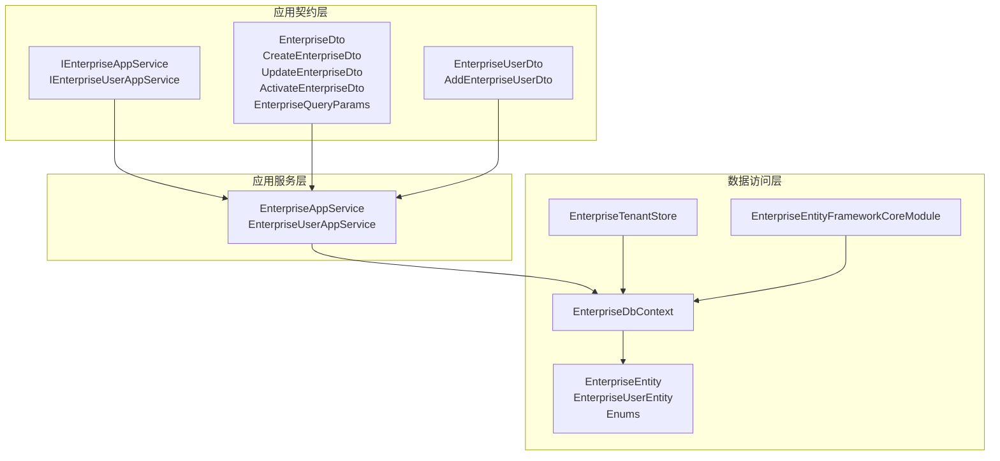

**图示来源**
- [IEnterpriseAppService.cs:1-82](file://src/System/Enterprise/H.Enterprise.Application.Contracts/Services/IEnterpriseAppService.cs#L1-L82)
- [IEnterpriseUserAppService.cs:1-35](file://src/System/Enterprise/H.Enterprise.Application.Contracts/Services/IEnterpriseUserAppService.cs#L1-L35)
- [EnterpriseDto.cs:1-136](file://src/System/Enterprise/H.Enterprise.Application.Contracts/Dtos/EnterpriseDto.cs#L1-L136)
- [EnterpriseUserDto.cs:1-36](file://src/System/Enterprise/H.Enterprise.Application.Contracts/Dtos/EnterpriseUserDto.cs#L1-L36)
- [EnterpriseAppService.cs:1-200](file://src/System/Enterprise/H.Enterprise.Application/Services/EnterpriseAppService.cs#L1-L200)
- [EnterpriseUserAppService.cs:1-133](file://src/System/Enterprise/H.Enterprise.Application/Services/EnterpriseUserAppService.cs#L1-L133)
- [EnterpriseEntity.cs:1-107](file://src/System/Enterprise/H.Enterprise.EntityFrameworkCore/Entities/EnterpriseEntity.cs#L1-L107)
- [EnterpriseUserEntity.cs:1-58](file://src/System/Enterprise/H.Enterprise.EntityFrameworkCore/Entities/EnterpriseUserEntity.cs#L1-L58)
- [Enums.cs:1-38](file://src/System/Enterprise/H.Enterprise.EntityFrameworkCore/Entities/Enums.cs#L1-L38)
- [EnterpriseDbContext.cs:1-83](file://src/System/Enterprise/H.Enterprise.EntityFrameworkCore/EnterpriseDbContext.cs#L1-L83)
- [EnterpriseTenantStore.cs:1-86](file://src/System/Enterprise/H.Enterprise.EntityFrameworkCore/EnterpriseTenantStore.cs#L1-L86)
- [EnterpriseEntityFrameworkCoreModule.cs:1-29](file://src/System/Enterprise/H.Enterprise.EntityFrameworkCore/EnterpriseEntityFrameworkCoreModule.cs#L1-L29)

**章节来源**
- [EnterpriseApplicationContractsModule.cs:1-9](file://src/System/Enterprise/H.Enterprise.Application.Contracts/EnterpriseApplicationContractsModule.cs#L1-L9)
- [EnterpriseApplicationModule.cs:1-15](file://src/System/Enterprise/H.Enterprise.Application/EnterpriseApplicationModule.cs#L1-L15)
- [EnterpriseEntityFrameworkCoreModule.cs:1-29](file://src/System/Enterprise/H.Enterprise.EntityFrameworkCore/EnterpriseEntityFrameworkCoreModule.cs#L1-L29)

## 核心组件
- 企业实体：承载企业名称、编码、描述、Logo、联系人信息、状态、数据库模式、连接字符串、激活信息与审计字段。
- 企业用户关联：维护用户与企业之间的多对多关系，记录角色、是否默认、加入时间等。
- 应用服务：提供企业的 CRUD、激活、启用/禁用、当前企业选择、自动选择等企业生命周期能力，以及企业用户管理。
- 数据上下文：定义表映射、索引、外键约束，并声明跨租户实体的语义。
- 租户存储：对接 ABP MultiTenancy，从企业表解析可激活且启用的租户配置，支持 Shared/Independent 两种数据库模式。

**章节来源**
- [EnterpriseEntity.cs:1-107](file://src/System/Enterprise/H.Enterprise.EntityFrameworkCore/Entities/EnterpriseEntity.cs#L1-L107)
- [EnterpriseUserEntity.cs:1-58](file://src/System/Enterprise/H.Enterprise.EntityFrameworkCore/Entities/EnterpriseUserEntity.cs#L1-L58)
- [IEnterpriseAppService.cs:1-82](file://src/System/Enterprise/H.Enterprise.Application.Contracts/Services/IEnterpriseAppService.cs#L1-L82)
- [IEnterpriseUserAppService.cs:1-35](file://src/System/Enterprise/H.Enterprise.Application.Contracts/Services/IEnterpriseUserAppService.cs#L1-L35)
- [EnterpriseDbContext.cs:1-83](file://src/System/Enterprise/H.Enterprise.EntityFrameworkCore/EnterpriseDbContext.cs#L1-L83)
- [EnterpriseTenantStore.cs:1-86](file://src/System/Enterprise/H.Enterprise.EntityFrameworkCore/EnterpriseTenantStore.cs#L1-L86)

## 架构总览
Enterprise 模块在 ABP 体系下提供企业级多租户能力：
- 企业作为租户实体存在，ID 即 TenantId
- 通过 EnterpriseTenantStore 实现 ITenantStore，为 ABP 提供租户配置
- 根据 DatabaseMode 决定连接字符串注入方式：Shared 使用全局默认连接；Independent 使用企业级独立连接
- 应用服务通过 EF Core 直接操作 Enterprise 与 EnterpriseUser 表，完成企业生命周期与用户角色管理

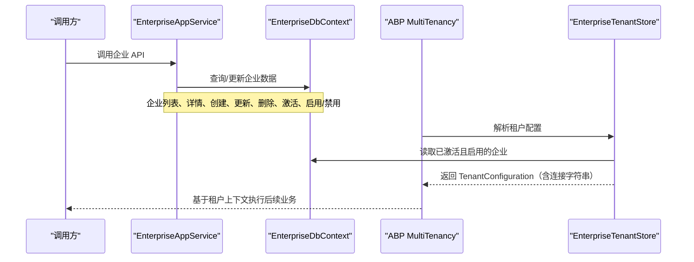

**图示来源**
- [EnterpriseAppService.cs:1-200](file://src/System/Enterprise/H.Enterprise.Application/Services/EnterpriseAppService.cs#L1-L200)
- [EnterpriseDbContext.cs:1-83](file://src/System/Enterprise/H.Enterprise.EntityFrameworkCore/EnterpriseDbContext.cs#L1-L83)
- [EnterpriseTenantStore.cs:1-86](file://src/System/Enterprise/H.Enterprise.EntityFrameworkCore/EnterpriseTenantStore.cs#L1-L86)

## 详细组件分析

### 企业实体与数据模型
企业实体包含以下核心属性：
- 标识与名称：Id（同时作为 TenantId）、Name
- 识别与展示：Code、Description、Logo
- 联系信息：ContactName、ContactPhone、ContactEmail
- 状态与模式：Status（Pending/Active/Disabled）、DatabaseMode（Shared/Independent）
- 连接字符串：ConnectionString（Independent 模式必填）
- 激活信息：IsActivated、ActivatedAt、ActivatedBy
- 审计字段：CreatedAt、UpdatedAt、CreatedBy、UpdatedBy
- 备注：Remark

企业用户关联实体包含：
- Id、EnterpriseId、UserId、UserName、Role、IsDefault、JoinedAt、CreatedAt、CreatedBy
- 与 EnterpriseEntity 一对多，用于表达用户与企业之间的多对多关系

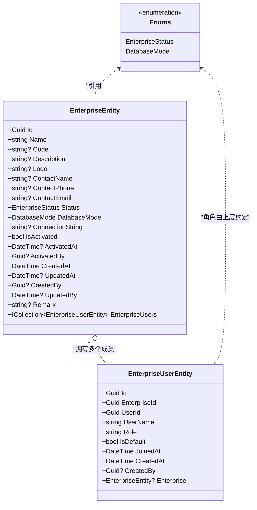

**图示来源**
- [EnterpriseEntity.cs:1-107](file://src/System/Enterprise/H.Enterprise.EntityFrameworkCore/Entities/EnterpriseEntity.cs#L1-L107)
- [EnterpriseUserEntity.cs:1-58](file://src/System/Enterprise/H.Enterprise.EntityFrameworkCore/Entities/EnterpriseUserEntity.cs#L1-L58)
- [Enums.cs:1-38](file://src/System/Enterprise/H.Enterprise.EntityFrameworkCore/Entities/Enums.cs#L1-L38)

**章节来源**
- [EnterpriseEntity.cs:1-107](file://src/System/Enterprise/H.Enterprise.EntityFrameworkCore/Entities/EnterpriseEntity.cs#L1-L107)
- [EnterpriseUserEntity.cs:1-58](file://src/System/Enterprise/H.Enterprise.EntityFrameworkCore/Entities/EnterpriseUserEntity.cs#L1-L58)
- [Enums.cs:1-38](file://src/System/Enterprise/H.Enterprise.EntityFrameworkCore/Entities/Enums.cs#L1-L38)

### 数据库模式与表结构
EF Core 配置了以下关键约束与索引：
- 企业表 Enterprise_Enterprises
  - 主键：Id
  - 唯一索引：Code
  - 普通索引：Status
  - 字段长度限制：Name(200)、Code(50)、Description(1000)、Logo(500)、ContactName(100)、ContactPhone(20)、ContactEmail(100)、ConnectionString(1000)、Remark(500)
- 企业用户表 Enterprise_EnterpriseUsers
  - 主键：Id
  - 复合唯一索引：(EnterpriseId, UserId)，保证同一企业下同一用户只有一条关联
  - 普通索引：UserId、Role
  - 外键：EnterpriseId → Enterprise_Enterprises.Id，级联删除

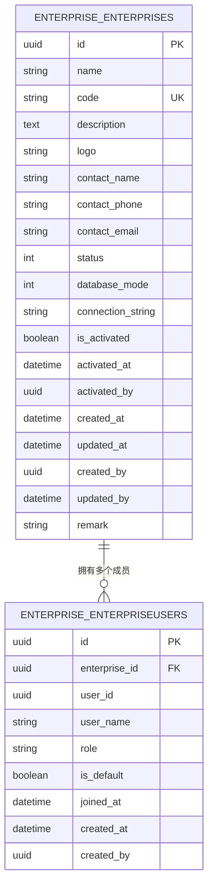

**图示来源**
- [EnterpriseDbContext.cs:1-83](file://src/System/Enterprise/H.Enterprise.EntityFrameworkCore/EnterpriseDbContext.cs#L1-L83)

**章节来源**
- [EnterpriseDbContext.cs:1-83](file://src/System/Enterprise/H.Enterprise.EntityFrameworkCore/EnterpriseDbContext.cs#L1-L83)

### 企业生命周期流程
企业生命周期包括创建、激活、启用/禁用、删除，以及与用户的角色管理。

#### 创建企业
- 输入：CreateEnterpriseDto（Name、可选 Code/Description/ContactName/ContactPhone/ContactEmail）
- 校验：Code 唯一性
- 行为：创建企业记录，状态初始为 Pending，未激活；若登录用户存在，自动成为 Owner，并标记为默认企业

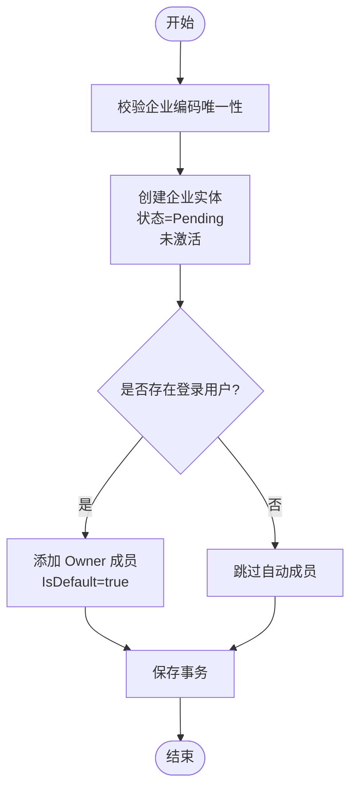

**图示来源**
- [EnterpriseAppService.cs:1-200](file://src/System/Enterprise/H.Enterprise.Application/Services/EnterpriseAppService.cs#L1-L200)

**章节来源**
- [EnterpriseAppService.cs:1-200](file://src/System/Enterprise/H.Enterprise.Application/Services/EnterpriseAppService.cs#L1-L200)

#### 激活企业
- 输入：ActivateEnterpriseDto（DatabaseMode、Independent 模式下必填 ConnectionString）
- 行为：设置数据库模式，写入连接字符串，标记已激活与激活时间

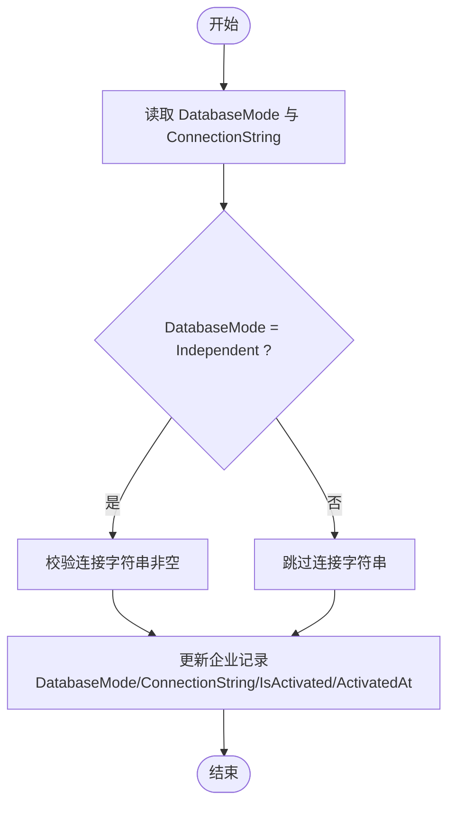

**图示来源**
- [EnterpriseAppService.cs:1-200](file://src/System/Enterprise/H.Enterprise.Application/Services/EnterpriseAppService.cs#L1-L200)
- [EnterpriseTenantStore.cs:1-86](file://src/System/Enterprise/H.Enterprise.EntityFrameworkCore/EnterpriseTenantStore.cs#L1-L86)

**章节来源**
- [EnterpriseAppService.cs:1-200](file://src/System/Enterprise/H.Enterprise.Application/Services/EnterpriseAppService.cs#L1-L200)
- [EnterpriseTenantStore.cs:1-86](file://src/System/Enterprise/H.Enterprise.EntityFrameworkCore/EnterpriseTenantStore.cs#L1-L86)

#### 启用/禁用企业
- EnableAsync：启用企业，使其可以被 ABP MultiTenancy 解析
- DisableAsync：禁用企业，阻止其被解析为有效租户

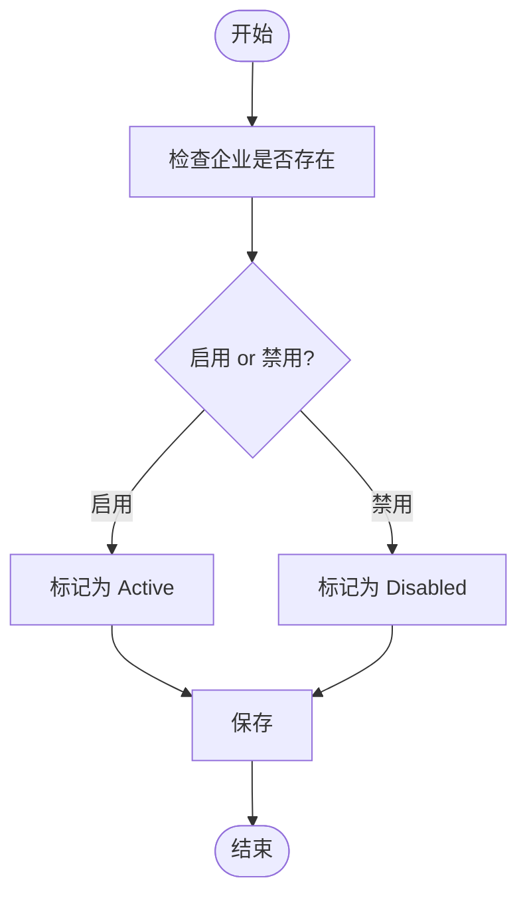

**图示来源**
- [IEnterpriseAppService.cs:1-82](file://src/System/Enterprise/H.Enterprise.Application.Contracts/Services/IEnterpriseAppService.cs#L1-L82)
- [Enums.cs:1-38](file://src/System/Enterprise/H.Enterprise.EntityFrameworkCore/Entities/Enums.cs#L1-L38)

**章节来源**
- [IEnterpriseAppService.cs:1-82](file://src/System/Enterprise/H.Enterprise.Application.Contracts/Services/IEnterpriseAppService.cs#L1-L82)
- [Enums.cs:1-38](file://src/System/Enterprise/H.Enterprise.EntityFrameworkCore/Entities/Enums.cs#L1-L38)

#### 删除企业
- 仅允许删除状态为 Pending 或 Disabled 的企业；Active 企业禁止删除

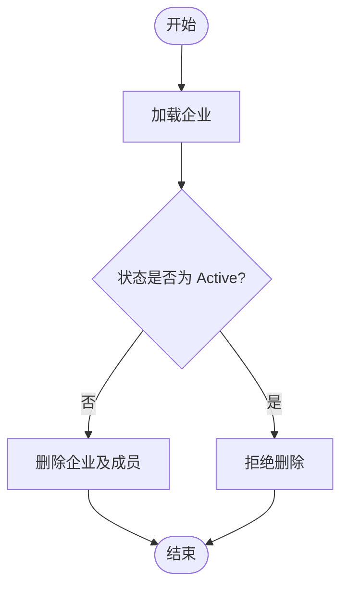

**图示来源**
- [EnterpriseAppService.cs:1-200](file://src/System/Enterprise/H.Enterprise.Application/Services/EnterpriseAppService.cs#L1-L200)

**章节来源**
- [EnterpriseAppService.cs:1-200](file://src/System/Enterprise/H.Enterprise.Application/Services/EnterpriseAppService.cs#L1-L200)

### 企业用户关联与角色管理
- 多对多关系：通过 EnterpriseUserEntity 表示用户与企业之间的关系
- 角色：Owner/Admin/Member（示例中默认 Member，创建时自动赋予 Owner）
- 默认企业：用户可设置一个默认企业，用于登录后自动选择
- 权限保护：不允许移除或修改 Owner 的角色

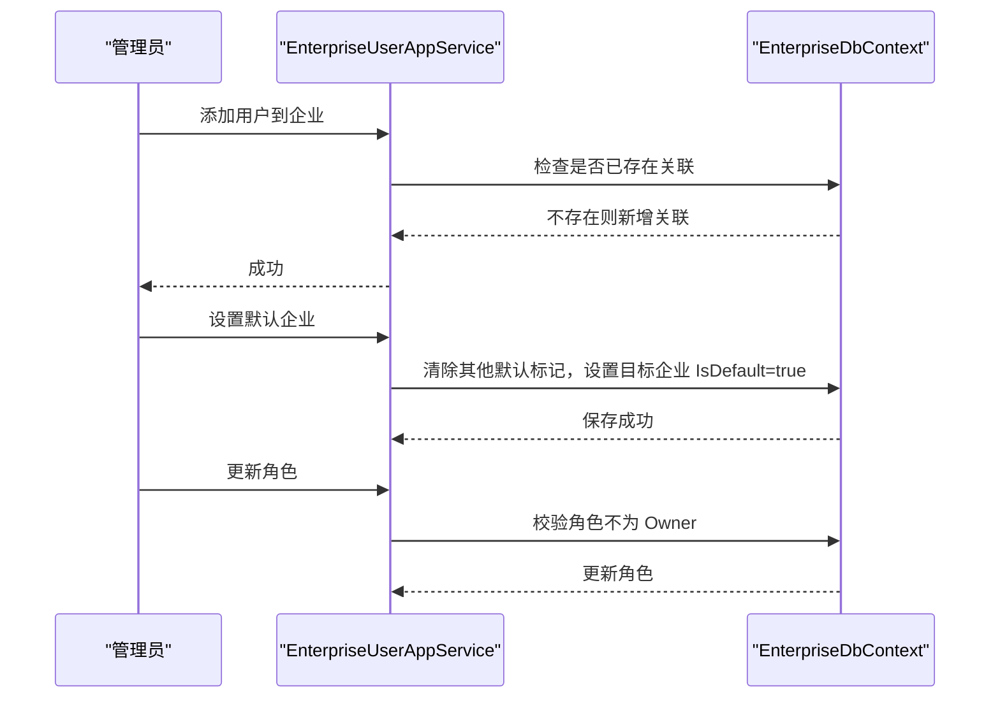

**图示来源**
- [IEnterpriseUserAppService.cs:1-35](file://src/System/Enterprise/H.Enterprise.Application.Contracts/Services/IEnterpriseUserAppService.cs#L1-L35)
- [EnterpriseUserAppService.cs:1-133](file://src/System/Enterprise/H.Enterprise.Application/Services/EnterpriseUserAppService.cs#L1-L133)

**章节来源**
- [EnterpriseUserAppService.cs:1-133](file://src/System/Enterprise/H.Enterprise.Application/Services/EnterpriseUserAppService.cs#L1-L133)

### 多租户架构与 ABP MultiTenancy 集成
- 自定义租户存储 EnterpriseTenantStore 实现 ITenantStore，从企业表中查找已激活且启用的企业
- 对于 Independent 模式，TenantConfiguration.ConnectionStrings 注入 Default、OrganizationDb、ApprovalDb 等多个 key 指向企业独立连接字符串
- ABP 框架据此切换连接字符串，实现真正的独立数据库隔离

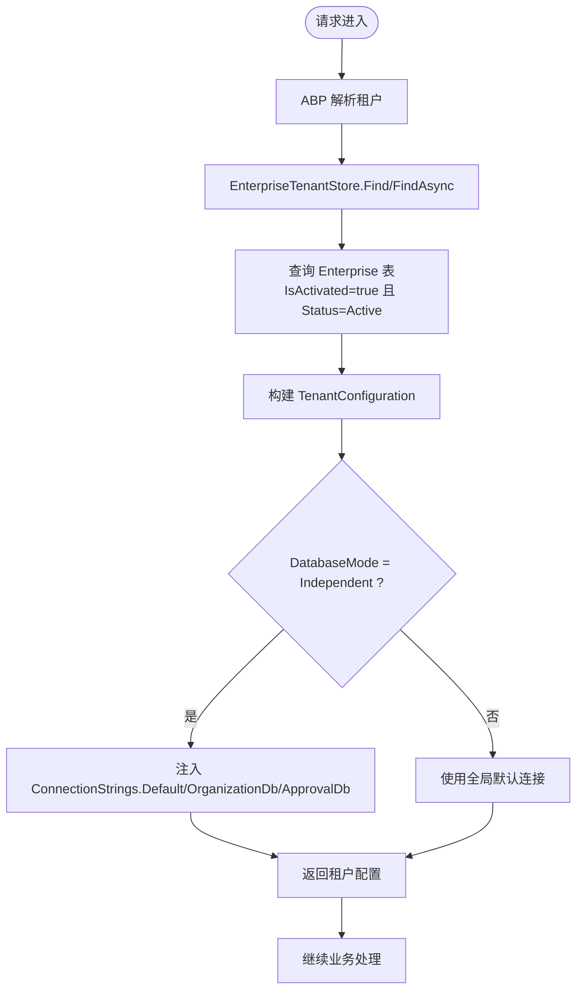

**图示来源**
- [EnterpriseTenantStore.cs:1-86](file://src/System/Enterprise/H.Enterprise.EntityFrameworkCore/EnterpriseTenantStore.cs#L1-L86)
- [Enums.cs:1-38](file://src/System/Enterprise/H.Enterprise.EntityFrameworkCore/Entities/Enums.cs#L1-L38)

**章节来源**
- [EnterpriseTenantStore.cs:1-86](file://src/System/Enterprise/H.Enterprise.EntityFrameworkCore/EnterpriseTenantStore.cs#L1-L86)

### API 接口定义概览
- IEnterpriseAppService
  - GetListAsync：分页查询企业，支持关键字、状态、数据库模式、激活状态过滤
  - GetByIdAsync：按 ID 获取企业详情
  - CreateAsync：创建企业（状态 Pending）
  - UpdateAsync：更新企业信息
  - UpdateCurrentEnterpriseAsync：当前企业所有者更新企业信息
  - DeleteAsync：删除企业（仅 Pending/Disabled）
  - ActivateAsync：激活企业（设置数据库模式与连接字符串）
  - EnableAsync：启用企业
  - DisableAsync：禁用企业
  - GetMyEnterprisesAsync：获取当前用户关联的所有企业
  - SelectEnterpriseAsync：选择企业（更新 Cookie Claims 与 TenantId）
  - AutoSelectEnterpriseAsync：登录后自动选择企业
  - GetCurrentEnterpriseAsync：获取当前选择的企业
  - GetCurrentEnterpriseRoleAsync：获取当前企业在当前用户中的角色

- IEnterpriseUserAppService
  - GetEnterpriseUsersAsync：获取企业用户列表
  - AddUserAsync：添加用户到企业
  - RemoveUserAsync：从企业移除用户（不可移除 Owner）
  - SetDefaultEnterpriseAsync：设置默认企业
  - UpdateUserRoleAsync：更新用户角色（不可修改 Owner）

**章节来源**
- [IEnterpriseAppService.cs:1-82](file://src/System/Enterprise/H.Enterprise.Application.Contracts/Services/IEnterpriseAppService.cs#L1-L82)
- [IEnterpriseUserAppService.cs:1-35](file://src/System/Enterprise/H.Enterprise.Application.Contracts/Services/IEnterpriseUserAppService.cs#L1-L35)

## 依赖关系分析
- 应用契约程序集通过 EnterpriseApplicationContractsModule 暴露程序集引用
- 应用层模块 EnterpriseApplicationModule 依赖 EnterpriseEntityFrameworkCoreModule
- EF Core 模块 EnterpriseEntityFrameworkCoreModule 负责注册 EnterpriseDbContext 与 EnsureCreated
- 应用服务依赖：
  - EnterpriseDbContext：CRUD 企业与企业用户
  - IHttpContextAccessor：获取当前用户、Cookie、Claims
  - IUserAppService（SystemPortal）：在企业创建时获取用户名填充 EnterpriseUserEntity.UserName

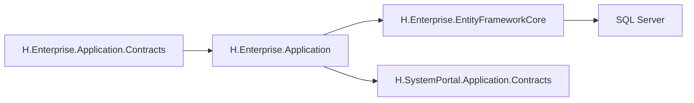

**图示来源**
- [EnterpriseApplicationContractsModule.cs:1-9](file://src/System/Enterprise/H.Enterprise.Application.Contracts/EnterpriseApplicationContractsModule.cs#L1-L9)
- [EnterpriseApplicationModule.cs:1-15](file://src/System/Enterprise/H.Enterprise.Application/EnterpriseApplicationModule.cs#L1-L15)
- [EnterpriseEntityFrameworkCoreModule.cs:1-29](file://src/System/Enterprise/H.Enterprise.EntityFrameworkCore/EnterpriseEntityFrameworkCoreModule.cs#L1-L29)
- [EnterpriseAppService.cs:1-200](file://src/System/Enterprise/H.Enterprise.Application/Services/EnterpriseAppService.cs#L1-L200)

**章节来源**
- [EnterpriseApplicationContractsModule.cs:1-9](file://src/System/Enterprise/H.Enterprise.Application.Contracts/EnterpriseApplicationContractsModule.cs#L1-L9)
- [EnterpriseApplicationModule.cs:1-15](file://src/System/Enterprise/H.Enterprise.Application/EnterpriseApplicationModule.cs#L1-L15)
- [EnterpriseEntityFrameworkCoreModule.cs:1-29](file://src/System/Enterprise/H.Enterprise.EntityFrameworkCore/EnterpriseEntityFrameworkCoreModule.cs#L1-L29)
- [EnterpriseAppService.cs:1-200](file://src/System/Enterprise/H.Enterprise.Application/Services/EnterpriseAppService.cs#L1-L200)

## 性能与可扩展性
- 查询优化
  - 列表查询使用 Include 预加载 EnterpriseUsers，减少 N+1 问题
  - 条件过滤使用 Where 链式组合，结合分页 Skip/Take
  - 租户解析使用 AsNoTracking 提升只读查询性能
- 索引设计
  - Code 唯一索引避免重复
  - Status 索引加速状态筛选
  - (EnterpriseId, UserId) 复合唯一索引保证关联唯一性
  - UserId、Role 索引优化用户与角色查询
- 可扩展点
  - 可通过扩展 EnterpriseTenantStore 增加更多连接字符串 key，适配新服务的独立库
  - 可增加角色枚举与权限策略，配合 ABP Authorization 进行细粒度控制
  - 可在 EnterpriseAppService 中增加软删除与审计日志

[本节为通用指导，不直接分析具体文件]

## 故障排查指南
- 无法解析租户
  - 确认企业 IsActivated=true 且 Status=Active
  - 检查 EnterpriseTenantStore 是否正确读取企业记录
  - Independent 模式下确保 ConnectionString 正确配置
- 无法创建企业
  - 检查 Code 唯一性冲突
  - 确认数据库连接正常
- 无法删除企业
  - Active 企业禁止删除，需先禁用或删除成员后再删除
- 无法设置默认企业
  - 确保用户已登录且已关联企业
  - 检查 EnterpriseUserEntity.IsDefault 是否正确更新
- 无法更新角色或移除成员
  - Owner 角色受保护，不可修改或移除
  - 检查用户是否确实属于该企业

**章节来源**
- [EnterpriseTenantStore.cs:1-86](file://src/System/Enterprise/H.Enterprise.EntityFrameworkCore/EnterpriseTenantStore.cs#L1-L86)
- [EnterpriseAppService.cs:1-200](file://src/System/Enterprise/H.Enterprise.Application/Services/EnterpriseAppService.cs#L1-L200)
- [EnterpriseUserAppService.cs:1-133](file://src/System/Enterprise/H.Enterprise.Application/Services/EnterpriseUserAppService.cs#L1-L133)

## 结论
Enterprise 模块以企业为核心实体，结合 ABP MultiTenancy 实现了灵活的多租户架构。通过 EnterpriseTenantStore 将企业状态与数据库模式接入 ABP 租户解析机制，支持 Shared 与 Independent 两种部署模式。企业生命周期管理覆盖注册、激活、启用/禁用与删除，用户关联与角色管理提供了完善的协作能力。建议在生产环境中：
- 合理划分 Shared/Independent 模式，平衡资源利用率与数据隔离
- 完善角色与权限策略，结合 ABP Authorization 细化访问控制
- 加强连接字符串与敏感信息的安全管理
- 建立监控与告警机制，及时排查租户解析异常与连接失败问题

[本节为总结性内容，不直接分析具体文件]