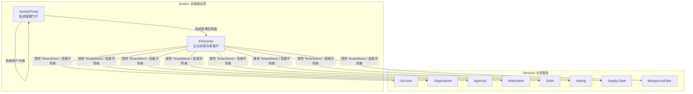
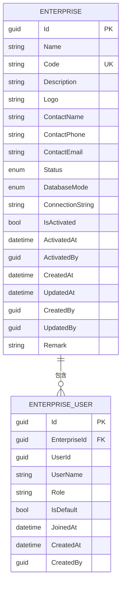
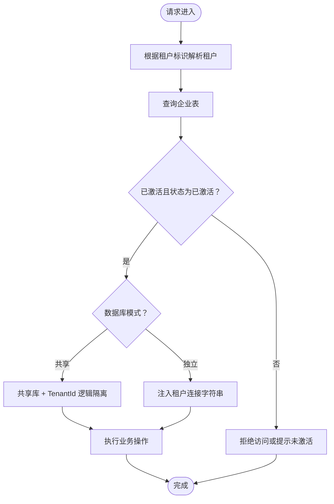
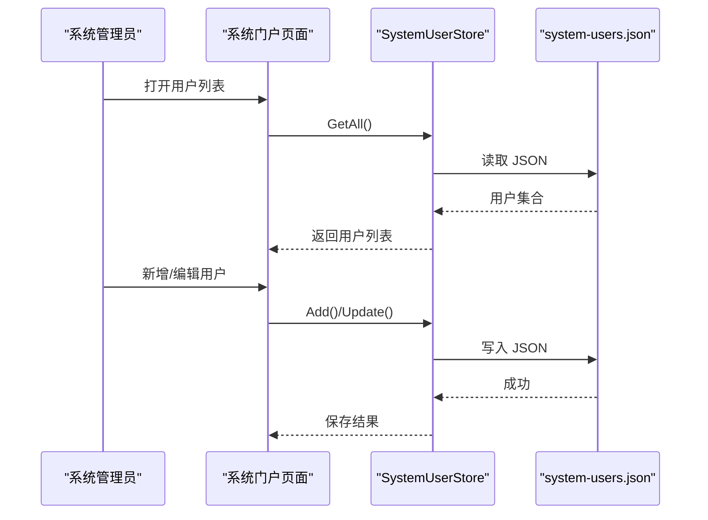
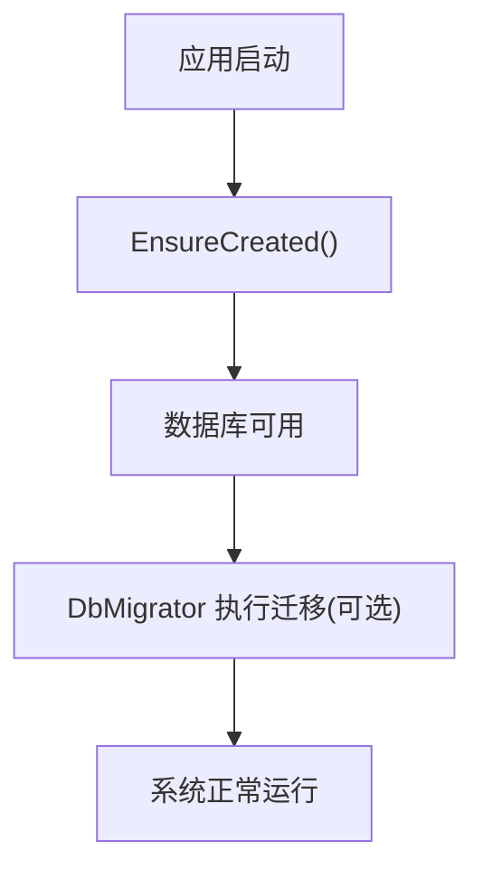
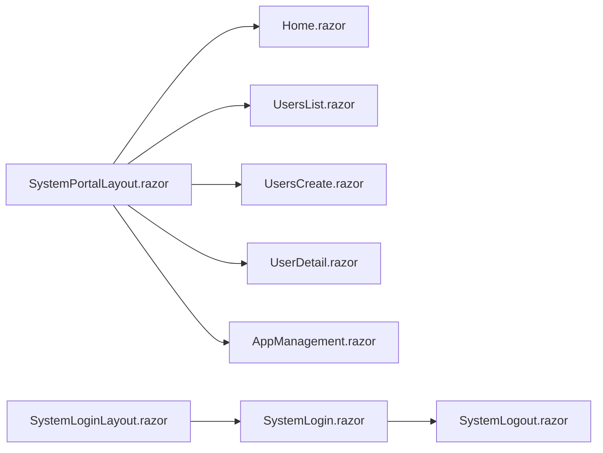
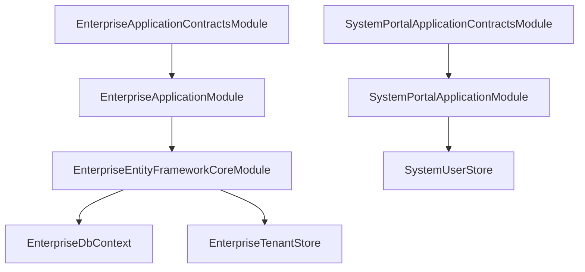

# 系统管理

<cite>
**本文引用的文件**   
- [README.md](file://README.md)
- [EnterpriseApplicationContractsModule.cs](file://src/System/Enterprise/H.Enterprise.Application.Contracts/EnterpriseApplicationContractsModule.cs)
- [EnterpriseApplicationModule.cs](file://src/System/Enterprise/H.Enterprise.Application/EnterpriseApplicationModule.cs)
- [EnterpriseEntityFrameworkCoreModule.cs](file://src/System/Enterprise/H.Enterprise.EntityFrameworkCore/EnterpriseEntityFrameworkCoreModule.cs)
- [EnterpriseDbContext.cs](file://src/System/Enterprise/H.Enterprise.EntityFrameworkCore/EnterpriseDbContext.cs)
- [EnterpriseTenantStore.cs](file://src/System/Enterprise/H.Enterprise.EntityFrameworkCore/EnterpriseTenantStore.cs)
- [EnterpriseEntity.cs](file://src/System/Enterprise/H.Enterprise.EntityFrameworkCore/Entities/EnterpriseEntity.cs)
- [EnterpriseUserEntity.cs](file://src/System/Enterprise/H.Enterprise.EntityFrameworkCore/Entities/EnterpriseUserEntity.cs)
- [Enums.cs](file://src/System/Enterprise/H.Enterprise.EntityFrameworkCore/Entities/Enums.cs)
- [SystemPortalApplicationContractsModule.cs](file://src/System/SystemPortal/H.SystemPortal.Application.Contracts/SystemPortalApplicationContractsModule.cs)
- [SystemPortalApplicationModule.cs](file://src/System/SystemPortal/H.SystemPortal.Application/SystemPortalApplicationModule.cs)
- [SystemPortalWebModule.cs](file://src/System/SystemPortal/H.SystemPortal.Web/SystemPortalWebModule.cs)
- [SystemUserStore.cs](file://src/System/SystemPortal/H.SystemPortal.Application/Services/SystemUserStore.cs)
- [SystemPortalLayout.razor](file://src/System/SystemPortal/H.SystemPortal.Web/Layout/SystemPortalLayout.razor)
- [Home.razor](file://src/System/SystemPortal/H.SystemPortal.Web/Pages/Home.razor)
- [SystemLogout.razor](file://src/System/SystemPortal/H.SystemPortal.Web/Pages/SystemLogout.razor)
- [UsersCreate.razor](file://src/System/SystemPortal/H.SystemPortal.Web/Pages/User/UsersCreate.razor)
- [UsersList.razor](file://src/System/SystemPortal/H.SystemPortal.Web/Pages/User/UsersList.razor)
- [UserDetail.razor](file://src/System/SystemPortal/H.SystemPortal.Web/Pages/User/UserDetail.razor)
- [AppManagement.razor](file://src/System/SystemPortal/H.SystemPortal.Web/Pages/AppManagement.razor)
</cite>

## 目录
1. [简介](#简介)
2. [项目结构](#项目结构)
3. [核心组件](#核心组件)
4. [架构总览](#架构总览)
5. [详细组件分析](#详细组件分析)
6. [依赖关系分析](#依赖关系分析)
7. [性能与容量规划](#性能与容量规划)
8. [故障排查指南](#故障排查指南)
9. [结论](#结论)

## 简介
本文件系统性地说明 H.AppLab 的系统管理能力，重点覆盖以下方面：
- 企业管理：企业实体维护、企业用户关联、企业状态与数据库模式管理。
- 多租户机制：基于 ABP 的 ITenantStore 自定义实现，支持共享数据库与独立数据库两种隔离策略。
- 系统门户：面向平台管理员的管理界面入口，包括系统用户管理与应用管理页面组织。
- 安全与运维：密码哈希、初始明文密码迁移、系统用户 JSON 存储、数据库自动创建等关键能力。

该文档既适合平台管理员快速上手系统管理功能，也适合开发者理解多租户与系统管理模块的实现细节。

## 项目结构
H.AppLab 采用模块化架构，系统级能力集中在 System 目录下，与 Services 下的企业级业务服务严格隔离。与企业相关的数据模型和租户解析逻辑位于 Enterprise 子域；系统门户的 Web 页面与应用契约位于 SystemPortal 子域。



**图表来源**
- [EnterpriseEntityFrameworkCoreModule.cs:10-29](file://src/System/Enterprise/H.Enterprise.EntityFrameworkCore/EnterpriseEntityFrameworkCoreModule.cs#L10-L29)
- [EnterpriseTenantStore.cs:1-86](file://src/System/Enterprise/H.Enterprise.EntityFrameworkCore/EnterpriseTenantStore.cs#L1-L86)
- [SystemPortalApplicationModule.cs:5-12](file://src/System/SystemPortal/H.SystemPortal.Application/SystemPortalApplicationModule.cs#L5-L12)

**章节来源**
- [README.md:1-73](file://README.md#L1-L73)

## 核心组件
- 企业管理数据层
  - 企业实体：承载企业名称、编码、联系人、状态、数据库模式、连接字符串等。
  - 企业用户关联：记录用户与企业之间的关系及角色、默认企业标记。
  - 枚举：企业状态与数据库模式。
- 多租户存储
  - 通过 ITenantStore 从企业表读取租户配置，并注入租户级别的连接字符串。
- 系统门户
  - 应用契约模块标记类。
  - 应用模块注册系统用户存储。
  - Web 模块标记类。
  - 系统用户存储：基于 JSON 文件的系统管理员账号 CRUD 与密码验证。

**章节来源**
- [EnterpriseEntity.cs:1-107](file://src/System/Enterprise/H.Enterprise.EntityFrameworkCore/Entities/EnterpriseEntity.cs#L1-L107)
- [EnterpriseUserEntity.cs:1-58](file://src/System/Enterprise/H.Enterprise.EntityFrameworkCore/Entities/EnterpriseUserEntity.cs#L1-L58)
- [Enums.cs:1-38](file://src/System/Enterprise/H.Enterprise.EntityFrameworkCore/Entities/Enums.cs#L1-L38)
- [EnterpriseTenantStore.cs:1-86](file://src/System/Enterprise/H.Enterprise.EntityFrameworkCore/EnterpriseTenantStore.cs#L1-L86)
- [SystemPortalApplicationContractsModule.cs:1-9](file://src/System/SystemPortal/H.SystemPortal.Application.Contracts/SystemPortalApplicationContractsModule.cs#L1-L9)
- [SystemPortalApplicationModule.cs:5-12](file://src/System/SystemPortal/H.SystemPortal.Application/SystemPortalApplicationModule.cs#L5-L12)
- [SystemPortalWebModule.cs:1-8](file://src/System/SystemPortal/H.SystemPortal.Web/SystemPortalWebModule.cs#L1-L8)
- [SystemUserStore.cs:1-235](file://src/System/SystemPortal/H.SystemPortal.Application/Services/SystemUserStore.cs#L1-L235)

## 架构总览
系统管理由“企业管理”和“系统门户”两部分组成。企业管理负责企业（租户）信息及其数据库模式；系统门户提供系统管理员的操作界面与系统用户管理。

```mermaid
classDiagram
    class EnterpriseEntity {
        +Guid Id
        +string Name
        +string Code
        +string Description
        +string Logo
        +string ContactName
        +string ContactPhone
        +string ContactEmail
        +EnterpriseStatus Status
        +DatabaseMode DatabaseMode
        +string ConnectionString
        +bool IsActivated
        +DateTime? ActivatedAt
        +Guid? ActivatedBy
        +DateTime CreatedAt
        +DateTime? UpdatedAt
        +Guid? CreatedBy
        +Guid? UpdatedBy
        +string Remark
    }

    class EnterpriseUserEntity {
        +Guid Id
        +Guid EnterpriseId
        +Guid UserId
        +string UserName
        +string Role
        +bool IsDefault
        +DateTime JoinedAt
        +DateTime CreatedAt
        +Guid? CreatedBy
    }

    class EnterpriseTenantStore {
        +Find(id)
        +Find(name)
        +FindAsync(id)
        +FindAsync(name)
        +GetListAsync(includeDetails)
    }

    class SystemUserStore {
        +GetAll()
        +FindById(id)
        +FindByUserName(userName)
        +FindByEmail(email)
        +FindByPhoneNumber(phone)
        +Add(user)
        +Update(user)
        +Delete(id)
        +VerifyPassword(user, password)
        +HashPassword(password)
    }

    EnterpriseEntity "1" o-- "*" EnterpriseUserEntity : "关联企业用户"
    EnterpriseTenantStore --> EnterpriseEntity : "读取租户配置"
    SystemUserStore ..> "JSON 文件" : "系统用户持久化"
```

**图表来源**
- [EnterpriseEntity.cs:1-107](file://src/System/Enterprise/H.Enterprise.EntityFrameworkCore/Entities/EnterpriseEntity.cs#L1-L107)
- [EnterpriseUserEntity.cs:1-58](file://src/System/Enterprise/H.Enterprise.EntityFrameworkCore/Entities/EnterpriseUserEntity.cs#L1-L58)
- [EnterpriseTenantStore.cs:1-86](file://src/System/Enterprise/H.Enterprise.EntityFrameworkCore/EnterpriseTenantStore.cs#L1-L86)
- [SystemUserStore.cs:1-235](file://src/System/SystemPortal/H.SystemPortal.Application/Services/SystemUserStore.cs#L1-L235)

## 详细组件分析

### 企业管理数据模型
- 企业实体用于表达一个租户的生命周期与运行环境：名称、编码、描述、Logo、联系人信息、状态、数据库模式、连接字符串、激活信息与审计字段。
- 企业用户关联用于将账户服务的用户与企业绑定，并记录冗余用户名、角色、是否默认企业、加入时间与创建者。
- 状态与数据库模式使用枚举明确区分待审核/已激活/已禁用以及共享数据库/独立数据库两种隔离策略。



**图表来源**
- [EnterpriseEntity.cs:1-107](file://src/System/Enterprise/H.Enterprise.EntityFrameworkCore/Entities/EnterpriseEntity.cs#L1-L107)
- [EnterpriseUserEntity.cs:1-58](file://src/System/Enterprise/H.Enterprise.EntityFrameworkCore/Entities/EnterpriseUserEntity.cs#L1-L58)
- [Enums.cs:1-38](file://src/System/Enterprise/H.Enterprise.EntityFrameworkCore/Entities/Enums.cs#L1-L38)
- [EnterpriseDbContext.cs:27-83](file://src/System/Enterprise/H.Enterprise.EntityFrameworkCore/EnterpriseDbContext.cs#L27-L83)

**章节来源**
- [EnterpriseEntity.cs:1-107](file://src/System/Enterprise/H.Enterprise.EntityFrameworkCore/Entities/EnterpriseEntity.cs#L1-L107)
- [EnterpriseUserEntity.cs:1-58](file://src/System/Enterprise/H.Enterprise.EntityFrameworkCore/Entities/EnterpriseUserEntity.cs#L1-L58)
- [Enums.cs:1-38](file://src/System/Enterprise/H.Enterprise.EntityFrameworkCore/Entities/Enums.cs#L1-L38)
- [EnterpriseDbContext.cs:1-83](file://src/System/Enterprise/H.Enterprise.EntityFrameworkCore/EnterpriseDbContext.cs#L1-L83)

### 多租户架构与租户隔离
- 自定义 ITenantStore 从企业表中查找已激活且状态为“已激活”的企业，返回 ABP 租户配置。
- 当企业数据库模式为“独立数据库”时，将企业的连接字符串注入到 Default、OrganizationDb、ApprovalDb 等多个键，ABP 框架在运行时优先使用租户级别连接字符串，从而实现物理库隔离。
- 当企业数据库模式为“共享数据库”时，不设置连接字符串，由 ABP 按共享库策略处理，结合 TenantId 进行逻辑隔离。



**图表来源**
- [EnterpriseTenantStore.cs:1-86](file://src/System/Enterprise/H.Enterprise.EntityFrameworkCore/EnterpriseTenantStore.cs#L1-L86)
- [Enums.cs:1-38](file://src/System/Enterprise/H.Enterprise.EntityFrameworkCore/Entities/Enums.cs#L1-L38)

**章节来源**
- [EnterpriseTenantStore.cs:1-86](file://src/System/Enterprise/H.Enterprise.EntityFrameworkCore/EnterpriseTenantStore.cs#L1-L86)

### 系统门户与系统用户管理
- 系统门户应用契约模块仅作为程序集标记，便于 ABP 扫描定位。
- 系统门户应用模块注册 SystemUserStore，作为单例服务供系统管理页面调用。
- SystemUserStore 以 JSON 文件形式持久化系统管理员账号，提供获取、新增、更新、删除、按条件查找与密码验证能力。
- 密码存储支持 PBKDF2（SHA-256），首次登录可接受“PLAIN:”前缀的明文密码，并在成功后自动替换为哈希值，兼顾初始化便利性与安全性。



**图表来源**
- [SystemPortalApplicationModule.cs:5-12](file://src/System/SystemPortal/H.SystemPortal.Application/SystemPortalApplicationModule.cs#L5-L12)
- [SystemUserStore.cs:1-235](file://src/System/SystemPortal/H.SystemPortal.Application/Services/SystemUserStore.cs#L1-L235)

**章节来源**
- [SystemPortalApplicationContractsModule.cs:1-9](file://src/System/SystemPortal/H.SystemPortal.Application.Contracts/SystemPortalApplicationContractsModule.cs#L1-L9)
- [SystemPortalApplicationModule.cs:5-12](file://src/System/SystemPortal/H.SystemPortal.Application/SystemPortalApplicationModule.cs#L5-L12)
- [SystemUserStore.cs:1-235](file://src/System/SystemPortal/H.SystemPortal.Application/Services/SystemUserStore.cs#L1-L235)

### 数据库上下文与迁移
- 企业数据库上下文声明企业与企业用户两个 DbSet，并通过 EF Core 配置表名、主键、长度、唯一索引与外键关系。
- 模块启动时确保数据库存在，适用于开发环境与轻量部署。
- 迁移工具通过 DbMigrator 控制台程序对每个领域分别执行迁移，保证数据库结构与代码同步。



**图表来源**
- [EnterpriseEntityFrameworkCoreModule.cs:10-29](file://src/System/Enterprise/H.Enterprise.EntityFrameworkCore/EnterpriseEntityFrameworkCoreModule.cs#L10-L29)
- [EnterpriseDbContext.cs:1-83](file://src/System/Enterprise/H.Enterprise.EntityFrameworkCore/EnterpriseDbContext.cs#L1-L83)

**章节来源**
- [EnterpriseEntityFrameworkCoreModule.cs:10-29](file://src/System/Enterprise/H.Enterprise.EntityFrameworkCore/EnterpriseEntityFrameworkCoreModule.cs#L10-L29)
- [EnterpriseDbContext.cs:1-83](file://src/System/Enterprise/H.Enterprise.EntityFrameworkCore/EnterpriseDbContext.cs#L1-L83)

### 前端页面与布局
- SystemPortalLayout 与 SystemLoginLayout 提供系统门户的整体布局与登录布局。
- Home 作为系统门户首页，SystemLogout 提供退出登录流程。
- 用户管理页面包括 UsersList、UsersCreate、UserDetail，用于系统管理员账号的增删改查与详情查看。
- AppManagement 作为应用管理入口页，用于展示与管理低代码应用元数据。



**图表来源**
- [SystemPortalLayout.razor](file://src/System/SystemPortal/H.SystemPortal.Web/Layout/SystemPortalLayout.razor)
- [Home.razor](file://src/System/SystemPortal/H.SystemPortal.Web/Pages/Home.razor)
- [SystemLogout.razor](file://src/System/SystemPortal/H.SystemPortal.Web/Pages/SystemLogout.razor)
- [UsersList.razor](file://src/System/SystemPortal/H.SystemPortal.Web/Pages/User/UsersList.razor)
- [UsersCreate.razor](file://src/System/SystemPortal/H.SystemPortal.Web/Pages/User/UsersCreate.razor)
- [UserDetail.razor](file://src/System/SystemPortal/H.SystemPortal.Web/Pages/User/UserDetail.razor)
- [AppManagement.razor](file://src/System/SystemPortal/H.SystemPortal.Web/Pages/AppManagement.razor)

**章节来源**
- [SystemPortalLayout.razor](file://src/System/SystemPortal/H.SystemPortal.Web/Layout/SystemPortalLayout.razor)
- [Home.razor](file://src/System/SystemPortal/H.SystemPortal.Web/Pages/Home.razor)
- [SystemLogout.razor](file://src/System/SystemPortal/H.SystemPortal.Web/Pages/SystemLogout.razor)
- [UsersList.razor](file://src/System/SystemPortal/H.SystemPortal.Web/Pages/User/UsersList.razor)
- [UsersCreate.razor](file://src/System/SystemPortal/H.SystemPortal.Web/Pages/User/UsersCreate.razor)
- [UserDetail.razor](file://src/System/SystemPortal/H.SystemPortal.Web/Pages/User/UserDetail.razor)
- [AppManagement.razor](file://src/System/SystemPortal/H.SystemPortal.Web/Pages/AppManagement.razor)

## 依赖关系分析
- 应用契约模块与应用程序模块均依赖 ABP 模块化体系，通过 DependsOn 与 ConfigureServices 装配服务。
- Enterprise 模块依赖 EntityFrameworkCore 模块以注册 DbContext 并确保数据库可用。
- SystemPortal 模块注册 SystemUserStore，使系统管理页面能直接访问系统用户数据。
- 多租户能力通过 EnterpriseTenantStore 注入 ABP 框架，影响所有后续业务服务的数据访问。



**图表来源**
- [EnterpriseApplicationContractsModule.cs:1-9](file://src/System/Enterprise/H.Enterprise.Application.Contracts/EnterpriseApplicationContractsModule.cs#L1-L9)
- [EnterpriseApplicationModule.cs:1-15](file://src/System/Enterprise/H.Enterprise.Application/EnterpriseApplicationModule.cs#L1-L15)
- [EnterpriseEntityFrameworkCoreModule.cs:10-29](file://src/System/Enterprise/H.Enterprise.EntityFrameworkCore/EnterpriseEntityFrameworkCoreModule.cs#L10-L29)
- [SystemPortalApplicationContractsModule.cs:1-9](file://src/System/SystemPortal/H.SystemPortal.Application.Contracts/SystemPortalApplicationContractsModule.cs#L1-L9)
- [SystemPortalApplicationModule.cs:5-12](file://src/System/SystemPortal/H.SystemPortal.Application/SystemPortalApplicationModule.cs#L5-L12)

**章节来源**
- [EnterpriseApplicationContractsModule.cs:1-9](file://src/System/Enterprise/H.Enterprise.Application.Contracts/EnterpriseApplicationContractsModule.cs#L1-L9)
- [EnterpriseApplicationModule.cs:1-15](file://src/System/Enterprise/H.Enterprise.Application/EnterpriseApplicationModule.cs#L1-L15)
- [EnterpriseEntityFrameworkCoreModule.cs:10-29](file://src/System/Enterprise/H.Enterprise.EntityFrameworkCore/EnterpriseEntityFrameworkCoreModule.cs#L10-L29)
- [SystemPortalApplicationContractsModule.cs:1-9](file://src/System/SystemPortal/H.SystemPortal.Application.Contracts/SystemPortalApplicationContractsModule.cs#L1-L9)
- [SystemPortalApplicationModule.cs:5-12](file://src/System/SystemPortal/H.SystemPortal.Application/SystemPortalApplicationModule.cs#L5-L12)

## 性能与容量规划
- 共享数据库模式
  - 优点：部署简单、资源复用率高。
  - 关注点：需合理设计 TenantId 过滤、索引与分页查询，避免跨租户热点。
- 独立数据库模式
  - 优点：强隔离、便于备份恢复与分库分表扩展。
  - 关注点：连接池与并发限制、各租户数据库规模差异可能带来的资源不均。
- 系统用户存储
  - JSON 文件读写采用锁保护，适合小规模系统管理员账号；若系统管理员数量增长，应考虑迁移到数据库或缓存方案。
- 数据库初始化
  - EnsureCreated 适合开发与测试；生产环境建议使用 DbMigrator 进行可控迁移。

[本节为通用指导，不涉及具体源码行]

## 故障排查指南
- 无法连接到企业数据库
  - 检查 EnterpriseDbContext 的连接字符串配置与数据库实例可用性。
  - 确认 EnterpriseEntityFrameworkCoreModule 是否正确读取配置并注册 DbContext。
- 租户解析失败或被拒绝
  - 确认企业记录处于“已激活”且状态为“Active”。
  - 核对 EnterpriseTenantStore 的 Find 方法与枚举取值是否匹配。
- 系统管理员登录失败
  - 检查 system-users.json 是否存在且格式正确。
  - 如密码为明文“PLAIN:xxx”，首次登录后会自动转换为哈希；请确认转换后的哈希可读。
- 用户管理页面数据异常
  - 检查 SystemUserStore 的 LoadData/SaveData 是否被其他进程同时修改。
  - 确认文件权限与路径在调试与发布模式下正确解析。

**章节来源**
- [EnterpriseDbContext.cs:1-83](file://src/System/Enterprise/H.Enterprise.EntityFrameworkCore/EnterpriseDbContext.cs#L1-L83)
- [EnterpriseEntityFrameworkCoreModule.cs:10-29](file://src/System/Enterprise/H.Enterprise.EntityFrameworkCore/EnterpriseEntityFrameworkCoreModule.cs#L10-L29)
- [EnterpriseTenantStore.cs:1-86](file://src/System/Enterprise/H.Enterprise.EntityFrameworkCore/EnterpriseTenantStore.cs#L1-L86)
- [SystemUserStore.cs:1-235](file://src/System/SystemPortal/H.SystemPortal.Application/Services/SystemUserStore.cs#L1-L235)

## 结论
H.AppLab 的系统管理模块围绕“企业（租户）”与“系统管理员”两条主线展开：
- 企业管理提供了企业生命周期、状态与数据库模式的全量建模，并通过 ITenantStore 接入 ABP 多租户框架，实现灵活的租户隔离。
- 系统门户提供系统管理员账号管理与应用管理入口，配合 JSON 存储实现轻量化的系统用户管理。
- 对于生产环境，建议结合 DbMigrator 管理数据库变更，评估 JSON 存储的扩展性，并根据租户规模选择共享库或独立库策略，以实现安全、稳定与可扩展的平台管理能力。

[本节为总结性内容，不涉及具体源码行]