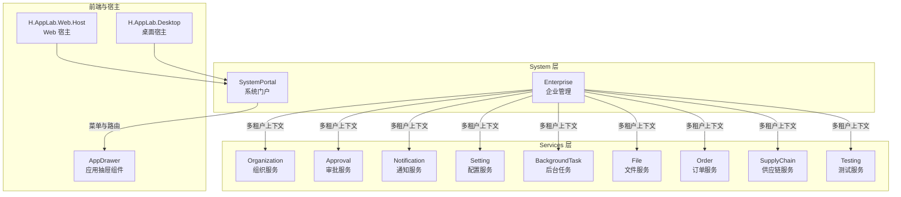
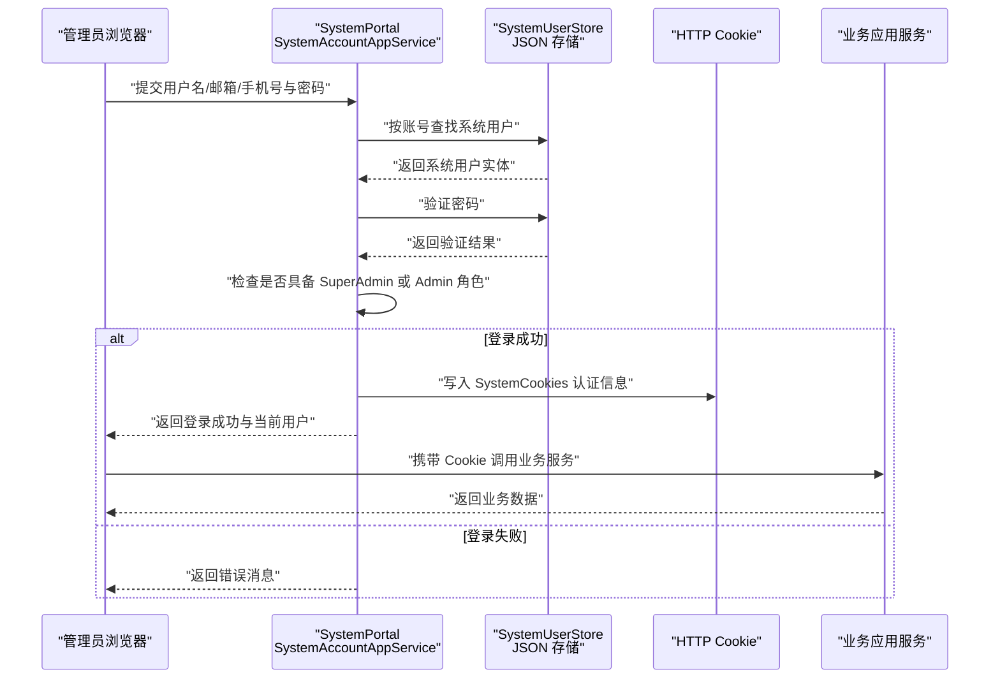
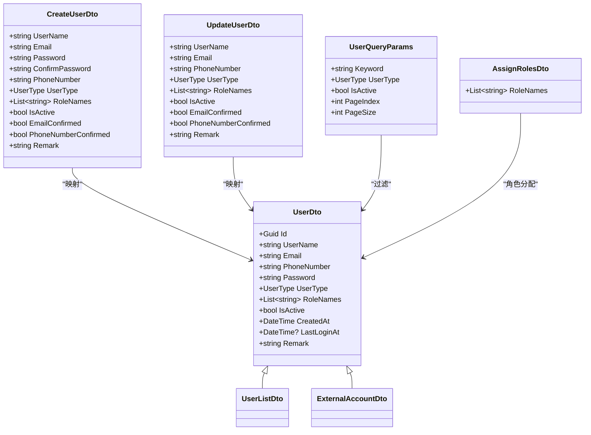
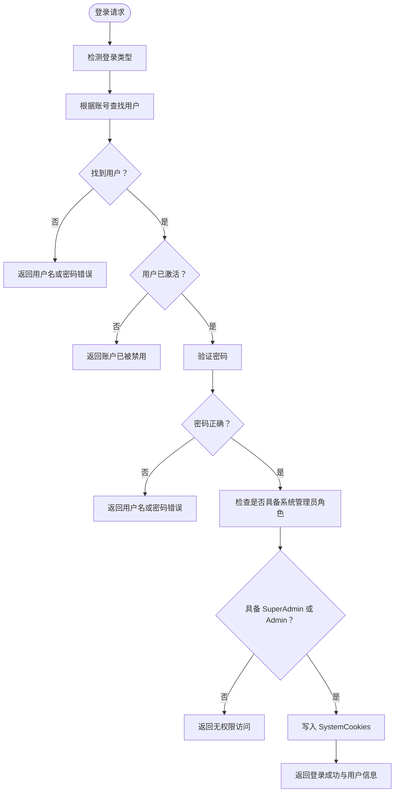
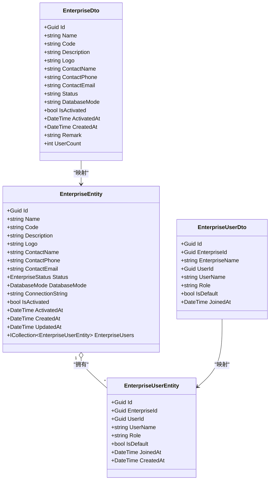
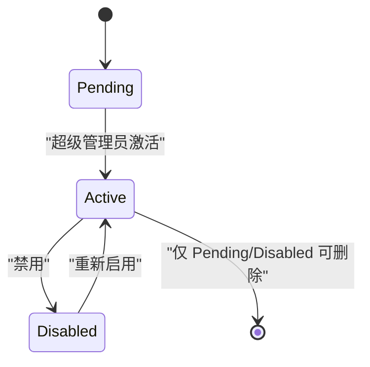
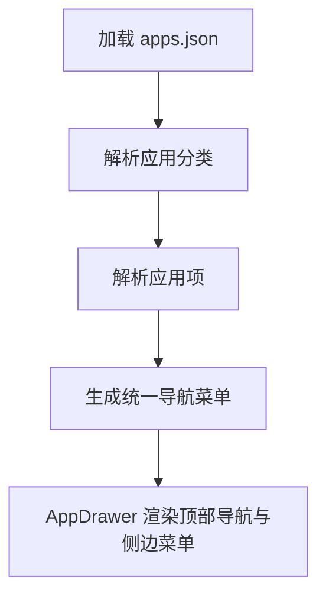
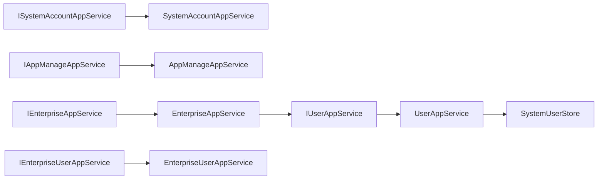

# 系统管理

<cite>
**本文引用的文件**   
- [README.md](file://README.md)
- [SystemRoleNames.cs](file://src/System/SystemPortal/H.SystemPortal.Application.Contracts/Constants/SystemRoleNames.cs)
- [UserType.cs](file://src/System/SystemPortal/H.SystemPortal.Application.Contracts/Enums/UserType.cs)
- [SystemPortalApplicationModule.cs](file://src/System/SystemPortal/H.SystemPortal.Application/SystemPortalApplicationModule.cs)
- [SystemPortalWebModule.cs](file://src/System/SystemPortal/H.SystemPortal.Web/SystemPortalWebModule.cs)
- [SystemPortalApplicationContractsModule.cs](file://src/System/SystemPortal/H.SystemPortal.Application.Contracts/SystemPortalApplicationContractsModule.cs)
- [UserDto.cs](file://src/System/SystemPortal/H.SystemPortal.Application.Contracts/Dtos/UserDto.cs)
- [IUserAppService.cs](file://src/System/SystemPortal/H.SystemPortal.Application.Contracts/Services/IUserAppService.cs)
- [ISystemAccountAppService.cs](file://src/System/SystemPortal/H.SystemPortal.Application.Contracts/Services/ISystemAccountAppService.cs)
- [IAppManageAppService.cs](file://src/System/SystemPortal/H.SystemPortal.Application.Contracts/Services/IAppManageAppService.cs)
- [UserAppService.cs](file://src/System/SystemPortal/H.SystemPortal.Application/Services/UserAppService.cs)
- [SystemAccountAppService.cs](file://src/System/SystemPortal/H.SystemPortal.Application/Services/SystemAccountAppService.cs)
- [AppManageAppService.cs](file://src/System/SystemPortal/H.SystemPortal.Application/Services/AppManageAppService.cs)
- [SystemUserStore.cs](file://src/System/SystemPortal/H.SystemPortal.Application/Services/SystemUserStore.cs)
- [system-users.json](file://src/System/SystemPortal/data/system-users.json)
- [apps.json](file://src/System/SystemPortal/data/apps.json)
- [EnterpriseDto.cs](file://src/System/Enterprise/H.Enterprise.Application.Contracts/Dtos/EnterpriseDto.cs)
- [EnterpriseUserDto.cs](file://src/System/Enterprise/H.Enterprise.Application.Contracts/Dtos/EnterpriseUserDto.cs)
- [IEnterpriseAppService.cs](file://src/System/Enterprise/H.Enterprise.Application.Contracts/Services/IEnterpriseAppService.cs)
- [IEnterpriseUserAppService.cs](file://src/System/Enterprise/H.Enterprise.Application.Contracts/Services/IEnterpriseUserAppService.cs)
- [EnterpriseEntity.cs](file://src/System/Enterprise/H.Enterprise.EntityFrameworkCore/Entities/EnterpriseEntity.cs)
- [EnterpriseUserEntity.cs](file://src/System/Enterprise/H.Enterprise.EntityFrameworkCore/Entities/EnterpriseUserEntity.cs)
- [Enums.cs](file://src/System/Enterprise/H.Enterprise.EntityFrameworkCore/Entities/Enums.cs)
- [EnterpriseAppService.cs](file://src/System/Enterprise/H.Enterprise.Application/Services/EnterpriseAppService.cs)
- [EnterpriseUserAppService.cs](file://src/System/Enterprise/H.Enterprise.Application/Services/EnterpriseUserAppService.cs)
</cite>

## 目录
1. [引言](#引言)
2. [项目结构](#项目结构)
3. [核心组件](#核心组件)
4. [架构总览](#架构总览)
5. [详细组件分析](#详细组件分析)
6. [依赖关系分析](#依赖关系分析)
7. [性能与运维特性](#性能与运维特性)
8. [管理员使用指南](#管理员使用指南)
9. [故障排查](#故障排查)
10. [结论](#结论)

## 引言
本文件面向 AppLab 的“系统管理”能力，重点说明以下主题：
- SystemPortal（系统门户）作为统一入口，如何聚合业务应用菜单、提供统一导航与权限控制。
- Enterprise（企业管理）领域模型：企业租户、企业用户、角色、数据库模式等基础多租户管理能力。
- 系统管理与业务应用的关系：系统管理为所有业务应用提供认证、权限、多租户等基础设施。
- 配置管理、系统监控、日志管理等运维相关能力的接入方式。
- 管理员视角的使用指南：用户管理、权限分配、系统配置、企业开通等常见操作。

根据仓库说明，AppLab 采用模块化架构，支持单体与按服务独立部署；System 层包含 Enterprise 与 SystemPortal，用于平台运营侧能力，并与 Services 下的企业级应用严格隔离。

**章节来源**
- [README.md:1-73](file://README.md#L1-L73)

## 项目结构
系统管理相关的代码集中在 `src/System` 下，分为两个子系统：
- SystemPortal：系统门户，负责系统级登录、系统用户管理、应用目录与分类管理。
- Enterprise：企业租户管理，负责企业实体、企业用户关联、企业激活与选择。

**图表来源**
- [README.md:1-73](file://README.md#L1-L73)
- [apps.json:1-155](file://src/System/SystemPortal/data/apps.json#L1-L155)

**章节来源**
- [README.md:1-73](file://README.md#L1-L73)

## 核心组件
- SystemPortal 应用契约模块：定义系统级角色常量、用户类型、系统门户应用契约。
- SystemPortal 应用模块：注册系统用户存储，承载系统级应用服务。
- SystemPortal Web 模块：标记 SystemPortal 的前端模块入口。
- Enterprise 应用契约模块：定义企业与企业用户的 DTO 与服务接口。
- Enterprise 应用模块：实现企业生命周期、企业用户关系、企业选择与自动选择逻辑。
- Enterprise EntityFrameworkCore 模块：定义企业实体、企业用户实体、数据库模式枚举、DbContext 与租户存储。

这些组件共同构成“系统管理”的基础设施，对外暴露统一的 API，对内支撑各业务应用的统一认证、权限与多租户上下文。

**章节来源**
- [SystemPortalApplicationContractsModule.cs:1-9](file://src/System/SystemPortal/H.SystemPortal.Application.Contracts/SystemPortalApplicationContractsModule.cs#L1-L9)
- [SystemPortalApplicationModule.cs:1-12](file://src/System/SystemPortal/H.SystemPortal.Application/SystemPortalApplicationModule.cs#L1-L12)
- [SystemPortalWebModule.cs:1-8](file://src/System/SystemPortal/H.SystemPortal.Web/SystemPortalWebModule.cs#L1-L8)
- [IEnterpriseAppService.cs:1-82](file://src/System/Enterprise/H.Enterprise.Application.Contracts/Services/IEnterpriseAppService.cs#L1-L82)
- [IEnterpriseUserAppService.cs:1-35](file://src/System/Enterprise/H.Enterprise.Application.Contracts/Services/IEnterpriseUserAppService.cs#L1-L35)

## 架构总览
SystemPortal 是系统管理入口，承担三类职责：
1. 系统级认证与授权：基于 Cookie 的系统管理员身份校验，限制 SuperAdmin/Admin 访问系统门户。
2. 系统用户管理：维护系统管理员账户、密码哈希、角色绑定、最后登录时间。
3. 应用目录管理：通过 JSON 文件维护应用分类与应用项，驱动 AppDrawer 的统一导航。

Enterprise 则提供多租户能力：
- 企业实体状态机：Pending/Active/Disabled。
- 数据库模式：Shared 或 Independent。
- 企业用户关系：UserId 与 EnterpriseId 的多对多映射，含角色与默认企业。
- 企业选择与自动选择：登录后根据用户关联企业数量与默认企业，决定是否直接进入某个企业。

**图表来源**
- [SystemAccountAppService.cs:1-176](file://src/System/SystemPortal/H.SystemPortal.Application/Services/SystemAccountAppService.cs#L1-L176)
- [SystemUserStore.cs:1-235](file://src/System/SystemPortal/H.SystemPortal.Application/Services/SystemUserStore.cs#L1-L235)
- [SystemRoleNames.cs:1-29](file://src/System/SystemPortal/H.SystemPortal.Application.Contracts/Constants/SystemRoleNames.cs#L1-L29)

## 详细组件分析

### SystemPortal：系统门户
SystemPortal 提供三个关键应用服务：
- IUserAppService：系统用户 CRUD、分页查询、角色分配、密码重置、状态启用禁用、最后登录时间更新。
- ISystemAccountAppService：系统登录、登出、获取当前系统用户。
- IAppManageAppService：应用分类与应用项的增删改查，数据持久化为 JSON。

#### 系统用户领域模型
SystemPortal 的用户模型以 `UserDto` 为中心，包含：
- 用户基本信息：ID、用户名、邮箱、手机号、密码哈希、用户类型、角色列表、是否激活、确认状态、锁定信息、创建与更新时间、备注。
- 外部账户扩展：Provider、ProviderKey、DisplayName、BoundAt。
- 登录与注册 DTO：LoginRequestDto、RegisterRequestDto、AuthResponseDto。
- 查询与分页：UserQueryParams、PagedResult<T>。

用户类型由角色推导：
- 若包含 SuperAdmin，则为超级管理员。
- 否则若包含 Admin，则为管理员。
- 否则为普通用户。

**图表来源**
- [UserDto.cs:1-186](file://src/System/SystemPortal/H.SystemPortal.Application.Contracts/Dtos/UserDto.cs#L1-L186)

#### 系统认证流程
SystemAccountAppService 实现系统登录：
- 根据账号内容判断登录类型：用户名、邮箱、手机号。
- 从 SystemUserStore 中查找用户并校验激活状态与密码。
- 校验是否具备 SuperAdmin 或 Admin 角色。
- 成功后写入 SystemCookies，设置过期策略：记住我 7 天，否则 24 小时。
- 登出时清除 SystemCookies。
- 获取当前用户时解析 ClaimsPrincipal，校验角色并返回用户 DTO。

**图表来源**
- [SystemAccountAppService.cs:1-176](file://src/System/SystemPortal/H.SystemPortal.Application/Services/SystemAccountAppService.cs#L1-L176)

**章节来源**
- [IUserAppService.cs:1-30](file://src/System/SystemPortal/H.SystemPortal.Application.Contracts/Services/IUserAppService.cs#L1-L30)
- [ISystemAccountAppService.cs:1-22](file://src/System/SystemPortal/H.SystemPortal.Application.Contracts/Services/ISystemAccountAppService.cs#L1-L22)
- [UserAppService.cs:1-260](file://src/System/SystemPortal/H.SystemPortal.Application/Services/UserAppService.cs#L1-L260)
- [SystemAccountAppService.cs:1-176](file://src/System/SystemPortal/H.SystemPortal.Application/Services/SystemAccountAppService.cs#L1-L176)
- [SystemUserStore.cs:1-235](file://src/System/SystemPortal/H.SystemPortal.Application/Services/SystemUserStore.cs#L1-L235)
- [SystemRoleNames.cs:1-29](file://src/System/SystemPortal/H.SystemPortal.Application.Contracts/Constants/SystemRoleNames.cs#L1-L29)
- [UserType.cs:1-22](file://src/System/SystemPortal/H.SystemPortal.Application.Contracts/Enums/UserType.cs#L1-L22)

### Enterprise：企业管理
Enterprise 提供企业全生命周期管理与企业用户关系管理：
- 企业实体：名称、编码、描述、Logo、联系人、状态、数据库模式、连接字符串、激活标志与时间。
- 企业用户关系：UserId、EnterpriseId、角色、是否默认企业、加入时间。
- 服务接口：企业列表、详情、创建、更新、删除、激活、启用、禁用、我的企业、选择企业、自动选择企业、当前企业、当前企业角色。
- 企业用户服务：获取企业用户、添加用户、移除用户、设置默认企业、更新角色。

**图表来源**
- [EnterpriseEntity.cs:1-107](file://src/System/Enterprise/H.Enterprise.EntityFrameworkCore/Entities/EnterpriseEntity.cs#L1-L107)
- [EnterpriseUserEntity.cs:1-58](file://src/System/Enterprise/H.Enterprise.EntityFrameworkCore/Entities/EnterpriseUserEntity.cs#L1-L58)
- [EnterpriseDto.cs:1-136](file://src/System/Enterprise/H.Enterprise.Application.Contracts/Dtos/EnterpriseDto.cs#L1-L136)
- [EnterpriseUserDto.cs:1-36](file://src/System/Enterprise/H.Enterprise.Application.Contracts/Dtos/EnterpriseUserDto.cs#L1-L36)

#### 企业激活与数据库模式
企业激活由超级管理员操作，设置数据库模式：
- Shared：共享数据库，通过 TenantId 逻辑隔离。
- Independent：独立数据库，每个企业独立数据库实例，需提供连接字符串。

企业状态包括 Pending、Active、Disabled；已激活的企业不可删除。

**图表来源**
- [Enums.cs:1-38](file://src/System/Enterprise/H.Enterprise.EntityFrameworkCore/Entities/Enums.cs#L1-L38)
- [EnterpriseAppService.cs:1-200](file://src/System/Enterprise/H.Enterprise.Application/Services/EnterpriseAppService.cs#L1-L200)

**章节来源**
- [IEnterpriseAppService.cs:1-82](file://src/System/Enterprise/H.Enterprise.Application.Contracts/Services/IEnterpriseAppService.cs#L1-L82)
- [IEnterpriseUserAppService.cs:1-35](file://src/System/Enterprise/H.Enterprise.Application.Contracts/Services/IEnterpriseUserAppService.cs#L1-L35)
- [EnterpriseAppService.cs:1-200](file://src/System/Enterprise/H.Enterprise.Application/Services/EnterpriseAppService.cs#L1-L200)
- [EnterpriseUserAppService.cs:1-133](file://src/System/Enterprise/H.Enterprise.Application/Services/EnterpriseUserAppService.cs#L1-L133)

### 应用目录与统一导航
AppManageAppService 将应用分类与应用项保存在 JSON 文件中，供前端 AppDrawer 读取并渲染统一导航。应用目录包括：
- 基础应用：组织管理、审批管理、通知管理、配置管理、后台任务、文件管理。
- 业务应用：供应链集成、订单管理。
- 低代码：应用开发。
- AI：AI 工作台。
- 工具：自动化测试。

该机制实现了“系统门户聚合各业务应用菜单”，并通过 AppCategoryInfo 与 AppItemInfo 描述分类图标、跳转地址与打开方式。

**图表来源**
- [AppManageAppService.cs:1-200](file://src/System/SystemPortal/H.SystemPortal.Application/Services/AppManageAppService.cs#L1-L200)
- [apps.json:1-155](file://src/System/SystemPortal/data/apps.json#L1-L155)

**章节来源**
- [IAppManageAppService.cs:1-41](file://src/System/SystemPortal/H.SystemPortal.Application.Contracts/Services/IAppManageAppService.cs#L1-L41)
- [AppManageAppService.cs:1-200](file://src/System/SystemPortal/H.SystemPortal.Application/Services/AppManageAppService.cs#L1-L200)
- [apps.json:1-155](file://src/System/SystemPortal/data/apps.json#L1-L155)

## 依赖关系分析
SystemPortal 与 Enterprise 在系统管理中扮演不同角色：
- SystemPortal 依赖 ABP 应用服务框架，并使用 IHttpContextAccessor 进行 Cookie 认证。
- Enterprise 依赖 EF Core DbContext 与企业实体，同时引用 SystemPortal 的 IUserAppService 以获取用户信息。
- 两者均通过 BaseOutput 统一返回包装，避免直接抛出异常到前端。

**图表来源**
- [IUserAppService.cs:1-30](file://src/System/SystemPortal/H.SystemPortal.Application.Contracts/Services/IUserAppService.cs#L1-L30)
- [UserAppService.cs:1-260](file://src/System/SystemPortal/H.SystemPortal.Application/Services/UserAppService.cs#L1-L260)
- [SystemAccountAppService.cs:1-176](file://src/System/SystemPortal/H.SystemPortal.Application/Services/SystemAccountAppService.cs#L1-L176)
- [AppManageAppService.cs:1-200](file://src/System/SystemPortal/H.SystemPortal.Application/Services/AppManageAppService.cs#L1-L200)
- [SystemUserStore.cs:1-235](file://src/System/SystemPortal/H.SystemPortal.Application/Services/SystemUserStore.cs#L1-L235)
- [IEnterpriseAppService.cs:1-82](file://src/System/Enterprise/H.Enterprise.Application.Contracts/Services/IEnterpriseAppService.cs#L1-L82)
- [EnterpriseAppService.cs:1-200](file://src/System/Enterprise/H.Enterprise.Application/Services/EnterpriseAppService.cs#L1-L200)
- [IEnterpriseUserAppService.cs:1-35](file://src/System/Enterprise/H.Enterprise.Application.Contracts/Services/IEnterpriseUserAppService.cs#L1-L35)
- [EnterpriseUserAppService.cs:1-133](file://src/System/Enterprise/H.Enterprise.Application/Services/EnterpriseUserAppService.cs#L1-L133)

**章节来源**
- [SystemPortalApplicationModule.cs:1-12](file://src/System/SystemPortal/H.SystemPortal.Application/SystemPortalApplicationModule.cs#L1-L12)
- [SystemPortalWebModule.cs:1-8](file://src/System/SystemPortal/H.SystemPortal.Web/SystemPortalWebModule.cs#L1-L8)
- [SystemPortalApplicationContractsModule.cs:1-9](file://src/System/SystemPortal/H.SystemPortal.Application.Contracts/SystemPortalApplicationContractsModule.cs#L1-L9)

## 性能与运维特性
- 系统用户存储采用 JSON 文件，读写加锁，适合小规模系统管理员账户场景；不适合高并发或大规模用户场景。
- 密码使用 PBKDF2 与盐值存储，首次明文密码会在首次验证后自动转为哈希，提升安全性。
- 应用目录通过 JSON 文件维护，便于快速调整菜单与分类；在生产环境中建议结合远程服务或配置中心增强一致性与版本控制。
- 企业数据使用 EF Core 持久化，支持分页、筛选、排序；企业用户关系支持角色与默认企业设置。
- 配置管理、后台任务、文件管理、通知服务等已在应用目录中暴露，可通过 SystemPortal 统一导航进入。

**章节来源**
- [SystemUserStore.cs:1-235](file://src/System/SystemPortal/H.SystemPortal.Application/Services/SystemUserStore.cs#L1-L235)
- [system-users.json:1-19](file://src/System/SystemPortal/data/system-users.json#L1-L19)
- [apps.json:1-155](file://src/System/SystemPortal/data/apps.json#L1-L155)
- [EnterpriseAppService.cs:1-200](file://src/System/Enterprise/H.Enterprise.Application/Services/EnterpriseAppService.cs#L1-L200)

## 管理员使用指南

### 登录系统门户
- 使用具备 SuperAdmin 或 Admin 角色的系统用户登录。
- 支持用户名、邮箱、手机号三种登录形式。
- 登录成功后会写入 SystemCookies，有效期根据“记住我”选项设置为 7 天或 24 小时。

**章节来源**
- [SystemAccountAppService.cs:1-176](file://src/System/SystemPortal/H.SystemPortal.Application/Services/SystemAccountAppService.cs#L1-L176)
- [SystemRoleNames.cs:1-29](file://src/System/SystemPortal/H.SystemPortal.Application.Contracts/Constants/SystemRoleNames.cs#L1-L29)

### 用户管理
- 新增系统用户：填写用户名、邮箱、手机号、密码、角色、是否激活等信息。
- 修改系统用户：可更新基本信息、角色、状态与备注。
- 启用/禁用用户：通过状态字段控制用户是否可用。
- 重置密码：管理员可为用户重置密码。
- 删除用户：删除系统用户记录。
- 分页查询：支持关键词、用户类型、激活状态筛选。

**章节来源**
- [IUserAppService.cs:1-30](file://src/System/SystemPortal/H.SystemPortal.Application.Contracts/Services/IUserAppService.cs#L1-L30)
- [UserAppService.cs:1-260](file://src/System/SystemPortal/H.SystemPortal.Application/Services/UserAppService.cs#L1-L260)

### 权限分配
- 为用户分配角色：SuperAdmin 或 Admin。
- 角色会自动推导用户类型：超级管理员、管理员或普通用户。
- 只有具备系统管理员角色的用户才能登录系统门户。

**章节来源**
- [UserAppService.cs:201-260](file://src/System/SystemPortal/H.SystemPortal.Application/Services/UserAppService.cs#L201-L260)
- [SystemRoleNames.cs:1-29](file://src/System/SystemPortal/H.SystemPortal.Application.Contracts/Constants/SystemRoleNames.cs#L1-L29)

### 应用目录管理
- 查看应用分类与应用项：通过 IAppManageAppService 获取所有分类与应用。
- 新增应用：指定分类名与应用项信息。
- 更新应用：根据应用 ID 更新应用项。
- 删除应用：根据应用 ID 删除应用项。
- 新增分类：添加新的应用分类。
- 删除分类：删除空分类。

**章节来源**
- [IAppManageAppService.cs:1-41](file://src/System/SystemPortal/H.SystemPortal.Application.Contracts/Services/IAppManageAppService.cs#L1-L41)
- [AppManageAppService.cs:1-200](file://src/System/SystemPortal/H.SystemPortal.Application/Services/AppManageAppService.cs#L1-L200)

### 企业开通与管理
- 创建企业：填写企业名称、编码、描述、联系人信息；创建者自动成为 Owner。
- 更新企业信息：仅企业 Owner 可修改当前企业信息。
- 删除企业：仅 Pending 或 Disabled 状态可删除。
- 激活企业：超级管理员设置数据库模式（Shared 或 Independent），Independent 模式需提供连接字符串。
- 启用/禁用企业：控制企业是否可用。
- 查看我的企业：列出当前用户关联的所有企业。
- 选择企业：更新 Cookie Claims，设置 TenantId。
- 自动选择企业：当用户仅有 1 个可用企业或存在默认企业时自动进入。

**章节来源**
- [IEnterpriseAppService.cs:1-82](file://src/System/Enterprise/H.Enterprise.Application.Contracts/Services/IEnterpriseAppService.cs#L1-L82)
- [EnterpriseAppService.cs:1-200](file://src/System/Enterprise/H.Enterprise.Application/Services/EnterpriseAppService.cs#L1-L200)

### 企业用户管理
- 查看企业用户：获取某企业的所有成员。
- 添加用户：将系统用户添加到企业并赋予角色。
- 移除用户：从企业中移除用户，不允许移除 Owner。
- 设置默认企业：用户可将某企业设为默认企业，登录后自动选择。
- 更新角色：更新用户在企业中的角色，不允许修改 Owner 角色。

**章节来源**
- [IEnterpriseUserAppService.cs:1-35](file://src/System/Enterprise/H.Enterprise.Application.Contracts/Services/IEnterpriseUserAppService.cs#L1-L35)
- [EnterpriseUserAppService.cs:1-133](file://src/System/Enterprise/H.Enterprise.Application/Services/EnterpriseUserAppService.cs#L1-L133)

### 运维功能入口
通过 SystemPortal 的应用目录，管理员可快速进入以下运维功能：
- 配置管理：基于 ABP SettingManagement 的配置定义与配置项管理。
- 后台任务：一次性或周期任务调度，支持 API 调用与 SQL 执行。
- 文件管理：对象存储文件管理，支持项目隔离、上传下载与在线预览。
- 通知管理：通知下发与管理。
- 组织管理、审批管理、订单管理、供应链集成、低代码应用开发、AI 工作台、自动化测试等业务应用。

**章节来源**
- [apps.json:1-155](file://src/System/SystemPortal/data/apps.json#L1-L155)

## 故障排查
- 登录失败：
  - 检查账号是否存在且已激活。
  - 检查密码是否正确。
  - 检查用户是否具备 SuperAdmin 或 Admin 角色。
- 用户不存在：
  - 检查系统用户 JSON 文件或 EF Core 数据是否完整。
- 企业无法删除：
  - 检查企业状态是否为 Active；已激活企业不可删除。
- 无法修改企业所有者：
  - Owner 角色不可修改，也不允许被移除。
- 应用目录未生效：
  - 检查 apps.json 路径与权限，确保服务端可读写。
- 密码问题：
  - 初始明文密码会在首次验证后自动转为哈希，注意不要重复使用明文格式。

**章节来源**
- [SystemAccountAppService.cs:1-176](file://src/System/SystemPortal/H.SystemPortal.Application/Services/SystemAccountAppService.cs#L1-L176)
- [UserAppService.cs:1-260](file://src/System/SystemPortal/H.SystemPortal.Application/Services/UserAppService.cs#L1-L260)
- [EnterpriseAppService.cs:1-200](file://src/System/Enterprise/H.Enterprise.Application/Services/EnterpriseAppService.cs#L1-L200)
- [EnterpriseUserAppService.cs:1-133](file://src/System/Enterprise/H.Enterprise.Application/Services/EnterpriseUserAppService.cs#L1-L133)
- [AppManageAppService.cs:1-200](file://src/System/SystemPortal/H.SystemPortal.Application/Services/AppManageAppService.cs#L1-L200)
- [SystemUserStore.cs:1-235](file://src/System/SystemPortal/H.SystemPortal.Application/Services/SystemUserStore.cs#L1-L235)

## 结论
SystemPortal 与 Enterprise 共同构成 AppLab 系统管理的核心：
- SystemPortal 提供统一登录、系统用户管理、应用目录与统一导航。
- Enterprise 提供多租户企业模型、企业用户关系、企业激活与选择。
- 两者为所有业务应用提供认证、权限、多租户等基础设施能力。
- 管理员可通过 SystemPortal 完成用户管理、权限分配、企业开通与运维功能入口访问。

在实际生产环境中，建议：
- 将系统用户存储从 JSON 迁移至数据库以提升并发与一致性。
- 将应用目录从本地 JSON 迁移至远程服务或配置中心。
- 强化审计日志与安全策略，特别是系统管理员与企业 Owner 的操作审计。
- 结合 ABP 的租户隔离与权限体系，进一步细化企业级权限控制。