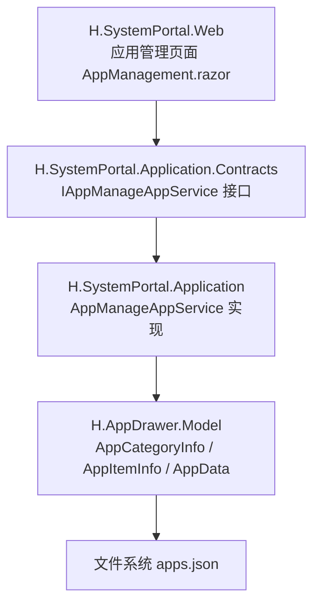
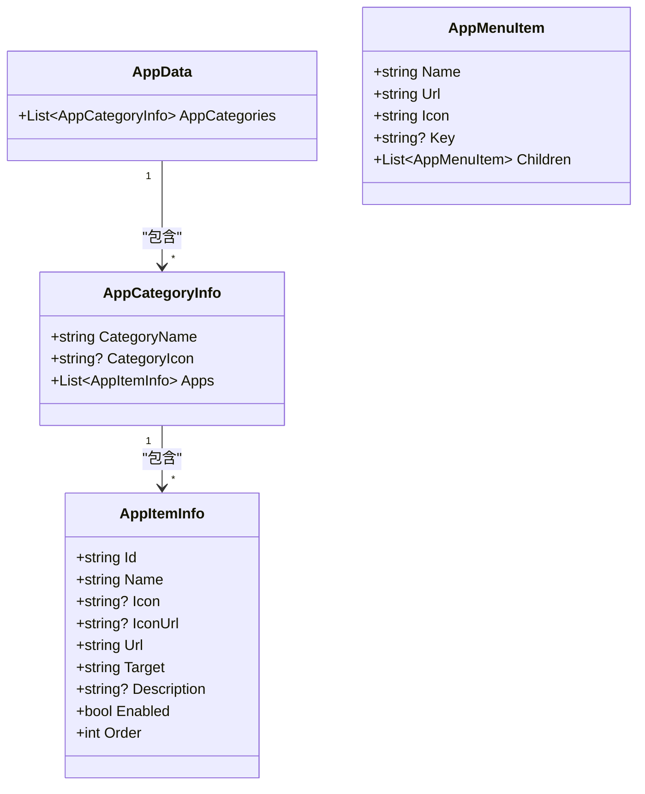
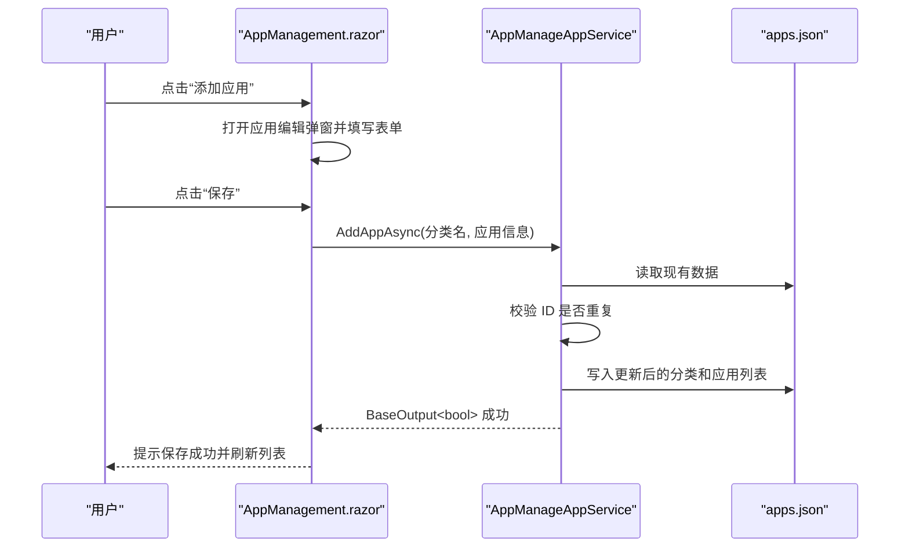
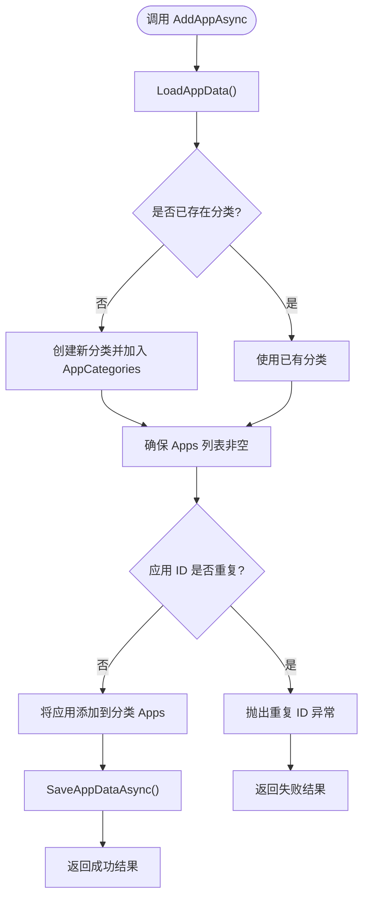
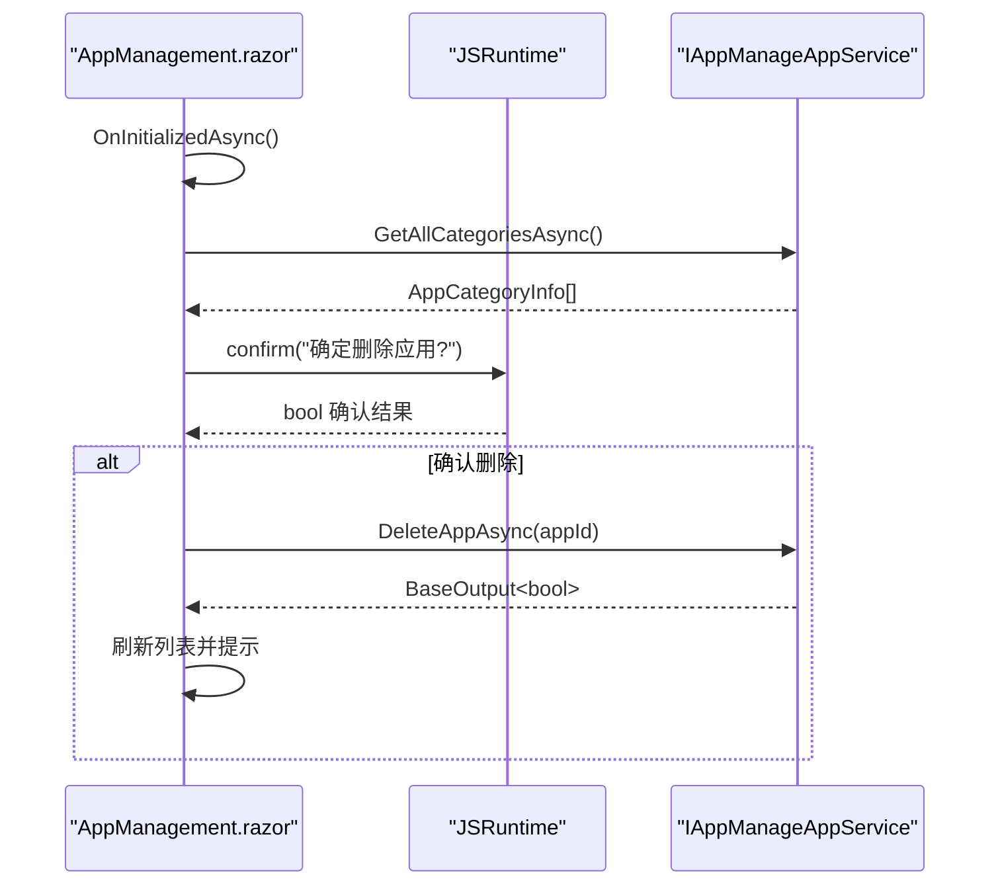
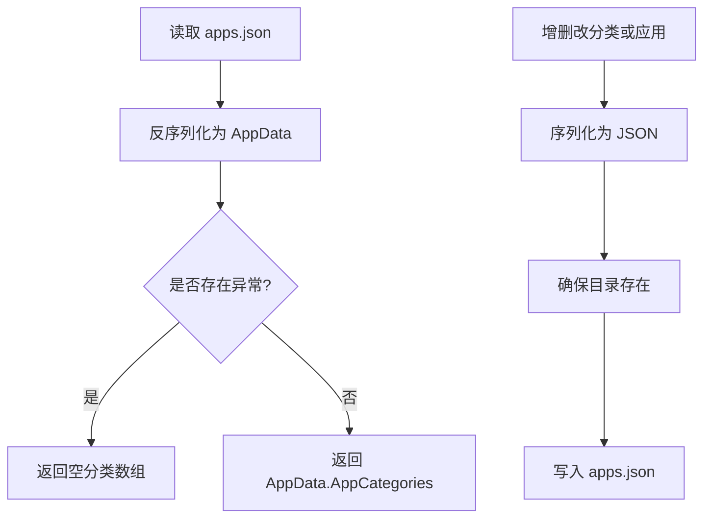
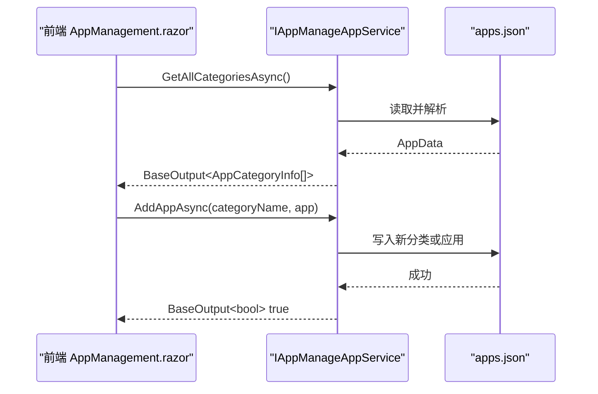
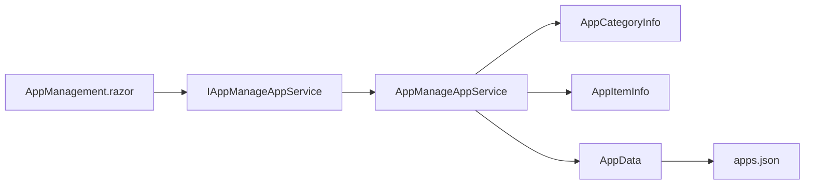

# 应用管理

<cite>
**本文引用的文件**   
- [IAppManageAppService.cs](file://src/System/SystemPortal/H.SystemPortal.Application.Contracts/Services/IAppManageAppService.cs)
- [AppManageAppService.cs](file://src/System/SystemPortal/H.SystemPortal.Application/Services/AppManageAppService.cs)
- [AppManagement.razor](file://src/System/SystemPortal/H.SystemPortal.Web/Pages/AppManagement.razor)
- [AppCategoryInfo、AppItemInfo（AppDrawerModels.cs）](file://src/Components/AppDrawer/H.AppDrawer.Model/AppDrawerModels.cs)
- [AppData（AppData.cs）](file://src/Components/AppDrawer/H.AppDrawer.Model/AppData.cs)
- [AppMenuItem（AppMenuItem.cs）](file://src/Components/AppDrawer/H.AppDrawer.Model/AppMenuItem.cs)
</cite>

## 目录
1. [引言](#引言)
2. [项目结构定位](#项目结构定位)
3. [核心职责与边界](#核心职责与边界)
4. [数据模型说明](#数据模型说明)
5. [架构总览](#架构总览)
6. [后端服务详解：AppManageAppService](#后端服务详解appmanageservice)
7. [前端组件详解：AppManagement.razor](#前端组件详解appmanagementrazor)
8. [apps.json 文件结构与读写流程](#appsjson-文件结构与读写流程)
9. [API 接口文档](#api-接口文档)
10. [使用场景与最佳实践](#使用场景与最佳实践)
11. [依赖关系分析](#依赖关系分析)
12. [性能与可靠性考虑](#性能与可靠性考虑)
13. [故障排查指南](#故障排查指南)
14. [结论](#结论)

## 引言
本文面向 H.AppLab 系统门户中的“应用管理”功能，围绕应用分类维护、应用菜单配置、以及 `apps.json` 文件的持久化读写进行完整说明。重点解释后端服务 `AppManageAppService` 的实现原理，包括应用的增删改查、分类树形结构管理；同时详细说明前端页面 `AppManagement.razor` 的用户交互流程，包括应用列表展示、分类管理界面和应用编辑弹窗。文档还给出数据模型字段定义、业务规则、HTTP API 使用方式，以及实际部署和运维建议。

## 项目结构定位
应用管理功能横跨系统门户的“应用层契约”“应用实现”和“Web 前端页面”，并与通用抽屉模型共享数据实体。关键位置如下：

- 应用管理服务接口：`src/System/SystemPortal/H.SystemPortal.Application.Contracts/Services/IAppManageAppService.cs`
- 应用管理服务实现：`src/System/SystemPortal/H.SystemPortal.Application/Services/AppManageAppService.cs`
- 应用管理前端页面：`src/System/SystemPortal/H.SystemPortal.Web/Pages/AppManagement.razor`
- 通用应用模型：`src/Components/AppDrawer/H.AppDrawer.Model/AppDrawerModels.cs`
- JSON 根数据模型：`src/Components/AppDrawer/H.AppDrawer.Model/AppData.cs`
- 子菜单项模型：`src/Components/AppDrawer/H.AppDrawer.Model/AppMenuItem.cs`

**图表来源**
- [AppManagement.razor:1-20](file://src/System/SystemPortal/H.SystemPortal.Web/Pages/AppManagement.razor#L1-L20)
- [IAppManageAppService.cs:1-41](file://src/System/SystemPortal/H.SystemPortal.Application.Contracts/Services/IAppManageAppService.cs#L1-L41)
- [AppManageAppService.cs:1-30](file://src/System/SystemPortal/H.SystemPortal.Application/Services/AppManageAppService.cs#L1-L30)
- [AppDrawerModels.cs:1-73](file://src/Components/AppDrawer/H.AppDrawer.Model/AppDrawerModels.cs#L1-L73)
- [AppData.cs:1-9](file://src/Components/AppDrawer/H.AppDrawer.Model/AppData.cs#L1-L9)

**章节来源**
- [IAppManageAppService.cs:1-41](file://src/System/SystemPortal/H.SystemPortal.Application.Contracts/Services/IAppManageAppService.cs#L1-L41)
- [AppManageAppService.cs:1-30](file://src/System/SystemPortal/H.SystemPortal.Application/Services/AppManageAppService.cs#L1-L30)
- [AppManagement.razor:1-20](file://src/System/SystemPortal/H.SystemPortal.Web/Pages/AppManagement.razor#L1-L20)

## 核心职责与边界
- 应用分类维护：新增、删除分类；分类下可包含零个或多个应用。
- 应用菜单配置：为每个应用配置标识、名称、图标、跳转地址、打开方式、启用状态、排序号、描述等。
- apps.json 持久化：通过文件系统保存应用分类与应用清单，供门户侧边栏或应用抽屉读取。
- 前端交互：提供添加/编辑应用、添加/删除分类、刷新列表、禁用提示等用户操作。

该功能不直接涉及数据库表，而是以 JSON 文件作为轻量级配置存储，适合小规模应用目录或开发测试环境。生产环境如需强一致性和并发控制，应扩展为数据库方案并保留 JSON 兼容结构。

**章节来源**
- [AppManageAppService.cs:1-30](file://src/System/SystemPortal/H.SystemPortal.Application/Services/AppManageAppService.cs#L1-L30)
- [AppManagement.razor:1-20](file://src/System/SystemPortal/H.SystemPortal.Web/Pages/AppManagement.razor#L1-L20)

## 数据模型说明
### AppCategoryInfo（应用分类信息）
- CategoryName：分类名称，用于唯一标识分类。
- CategoryIcon：可选的分类图标。
- Apps：该分类下的应用列表。

### AppItemInfo（应用项信息）
- Id：应用唯一标识。
- Name：应用显示名称。
- Icon：Emoji 或 Unicode 图标。
- IconUrl：图片类图标地址。
- Url：应用跳转地址。
- Target：打开方式 `_self` 或 `_blank`。
- Description：可选描述。
- Enabled：是否启用。
- Order：排序号。

### AppData（JSON 根对象）
- AppCategories：应用分类数组，表示整个应用目录。

### AppMenuItem（子菜单项）
- Name：菜单名称。
- Url：菜单链接。
- Icon：默认图标。
- Key：菜单唯一键，用于展开折叠状态。
- Children：子菜单集合。

**图表来源**
- [AppDrawerModels.cs:1-73](file://src/Components/AppDrawer/H.AppDrawer.Model/AppDrawerModels.cs#L1-L73)
- [AppData.cs:1-9](file://src/Components/AppDrawer/H.AppDrawer.Model/AppData.cs#L1-L9)
- [AppMenuItem.cs:1-21](file://src/Components/AppDrawer/H.AppDrawer.Model/AppMenuItem.cs#L1-L21)

**章节来源**
- [AppDrawerModels.cs:1-73](file://src/Components/AppDrawer/H.AppDrawer.Model/AppDrawerModels.cs#L1-L73)
- [AppData.cs:1-9](file://src/Components/AppDrawer/H.AppDrawer.Model/AppData.cs#L1-L9)
- [AppMenuItem.cs:1-21](file://src/Components/AppDrawer/H.AppDrawer.Model/AppMenuItem.cs#L1-L21)

## 架构总览
应用管理采用典型的三层结构：

- 表现层：Blazor 页面 `AppManagement.razor`，负责用户交互与本地表单校验。
- 应用服务层：`AppManageAppService` 暴露统一的增删改查能力，并处理 JSON 持久化。
- 数据模型层：共享 `AppCategoryInfo`、`AppItemInfo`、`AppData` 等类型，保证前后端数据结构一致。

**图表来源**
- [AppManagement.razor:891-972](file://src/System/SystemPortal/H.SystemPortal.Web/Pages/AppManagement.razor#L891-L972)
- [AppManageAppService.cs:1-30](file://src/System/SystemPortal/H.SystemPortal.Application/Services/AppManageAppService.cs#L1-L30)
- [AppManageAppService.cs:201-302](file://src/System/SystemPortal/H.SystemPortal.Application/Services/AppManageAppService.cs#L201-L302)

## 后端服务详解：AppManageAppService
### 职责概览
- 定位 `apps.json` 文件路径，支持从当前工作目录、发布输出目录或仓库目录逐级查找。
- 加载、解析、序列化、保存 `AppData`。
- 提供分类与应用的全量查询、新增、更新、删除能力。

### 关键方法
- GetAllCategoriesAsync：返回所有分类及其应用。
- AddAppAsync：按分类添加应用；若分类不存在则创建新分类；检查应用 ID 重复。
- UpdateAppAsync：根据应用 ID 找到对应应用并替换为新值。
- DeleteAppAsync：根据应用 ID 删除应用。
- AddCategoryAsync：新增分类，拒绝重复分类名。
- DeleteCategoryAsync：删除分类，若分类下仍有应用则拒绝删除。

### 文件定位策略
服务构造函数调用内部方法定位 JSON 文件，优先级包括：
- 可执行文件同级 `data/apps.json`。
- 仓库结构中向上搜索 `System/SystemPortal/data/apps.json`。
- 回退到当前工作目录下相对路径。

该策略确保开发运行与发布运行均能正确读写同一份配置文件。

### 数据持久化逻辑
- LoadAppData：若文件不存在返回空数据，避免启动失败。
- SaveAppDataAsync：格式化输出 JSON，自动创建目录后写盘。
- LoadAppsFromJson：对外暴露分类数组，捕获异常并返回空数组，增强容错性。

**图表来源**
- [AppManageAppService.cs:1-30](file://src/System/SystemPortal/H.SystemPortal.Application/Services/AppManageAppService.cs#L1-L30)
- [AppManageAppService.cs:201-302](file://src/System/SystemPortal/H.SystemPortal.Application/Services/AppManageAppService.cs#L201-L302)

**章节来源**
- [AppManageAppService.cs:1-30](file://src/System/SystemPortal/H.SystemPortal.Application/Services/AppManageAppService.cs#L1-L30)
- [AppManageAppService.cs:201-302](file://src/System/SystemPortal/H.SystemPortal.Application/Services/AppManageAppService.cs#L201-L302)

## 前端组件详解：AppManagement.razor
### 页面职责
- 展示应用分类与应用卡片。
- 提供添加应用、编辑应用、删除应用、添加分类、删除分类、刷新等操作。
- 通过注入的服务调用后端 API，并基于 `BaseOutput` 结果提示用户。

### 主要交互流程
- 初始化时加载分类与应用列表。
- 添加应用：弹出模态框，校验必填字段，调用 `AddAppAsync`，成功后刷新列表。
- 编辑应用：复用模态框，仅允许修改非 ID 字段，调用 `UpdateAppAsync`。
- 删除应用：确认对话框后调用 `DeleteAppAsync`，成功后刷新列表。
- 添加分类：输入分类名，调用 `AddCategoryAsync`。
- 删除分类：若分类下有应用则按钮禁用；确认后调用 `DeleteCategoryAsync`。

**图表来源**
- [AppManagement.razor:891-972](file://src/System/SystemPortal/H.SystemPortal.Web/Pages/AppManagement.razor#L891-L972)
- [IAppManageAppService.cs:1-41](file://src/System/SystemPortal/H.SystemPortal.Application.Contracts/Services/IAppManageAppService.cs#L1-L41)

**章节来源**
- [AppManagement.razor:1-20](file://src/System/SystemPortal/H.SystemPortal.Web/Pages/AppManagement.razor#L1-L20)
- [AppManagement.razor:891-972](file://src/System/SystemPortal/H.SystemPortal.Web/Pages/AppManagement.razor#L891-L972)

## apps.json 文件结构与读写流程
### 文件结构
`apps.json` 是一个 JSON 文件，其根对象为 `AppData`，包含一个 `AppCategories` 数组。每个分类对象包含分类名、可选图标和一个应用列表。应用对象包含标识、名称、图标、URL、打开方式、启用状态、排序号、描述等字段。

### 读流程
- 服务在启动时定位文件路径。
- 读取 JSON 文本并反序列化为 `AppData`。
- 对外暴露分类数组给前端展示。

### 写流程
- 增删改分类或应用后，序列化 `AppData` 并写回文件。
- 自动创建父目录，确保文件路径有效。
- 使用格式化输出便于人工编辑和维护。

**图表来源**
- [AppManageAppService.cs:201-302](file://src/System/SystemPortal/H.SystemPortal.Application/Services/AppManageAppService.cs#L201-L302)
- [AppData.cs:1-9](file://src/Components/AppDrawer/H.AppDrawer.Model/AppData.cs#L1-L9)

**章节来源**
- [AppManageAppService.cs:201-302](file://src/System/SystemPortal/H.SystemPortal.Application/Services/AppManageAppService.cs#L201-L302)
- [AppData.cs:1-9](file://src/Components/AppDrawer/H.AppDrawer.Model/AppData.cs#L1-L9)

## API 接口文档
以下接口由 `IAppManageAppService` 定义，并由 Blazor 客户端通过远程服务调用。

### 获取所有应用分类
- 方法：GetAllCategoriesAsync
- 参数：无
- 返回值：`BaseOutput<AppCategoryInfo[]>`
- 用途：获取全部分类及其中应用，用于渲染应用列表。

### 添加应用
- 方法：AddAppAsync
- 参数：
  - categoryName：分类名称；若不存在则创建。
  - app：应用信息对象。
- 返回值：`BaseOutput<bool>`，true 表示成功。
- 业务规则：
  - 同一分类内应用 ID 必须唯一。
  - 若分类不存在，自动创建。

### 更新应用
- 方法：UpdateAppAsync
- 参数：
  - appId：要更新的应用标识。
  - updatedApp：新的应用信息对象。
- 返回值：`BaseOutput<bool>`。
- 业务规则：
  - 应用 ID 必须存在于某个分类中，否则视为不存在。

### 删除应用
- 方法：DeleteAppAsync
- 参数：appId
- 返回值：`BaseOutput<bool>`。
- 业务规则：
  - 若应用不存在，返回失败。

### 添加分类
- 方法：AddCategoryAsync
- 参数：categoryName
- 返回值：`BaseOutput<bool>`。
- 业务规则：
  - 分类名不可重复。

### 删除分类
- 方法：DeleteCategoryAsync
- 参数：categoryName
- 返回值：`BaseOutput<bool>`。
- 业务规则：
  - 分类下若有应用，禁止删除。

**图表来源**
- [IAppManageAppService.cs:1-41](file://src/System/SystemPortal/H.SystemPortal.Application.Contracts/Services/IAppManageAppService.cs#L1-L41)
- [AppManageAppService.cs:1-30](file://src/System/SystemPortal/H.SystemPortal.Application/Services/AppManageAppService.cs#L1-L30)

**章节来源**
- [IAppManageAppService.cs:1-41](file://src/System/SystemPortal/H.SystemPortal.Application.Contracts/Services/IAppManageAppService.cs#L1-L41)
- [AppManageAppService.cs:1-30](file://src/System/SystemPortal/H.SystemPortal.Application/Services/AppManageAppService.cs#L1-L30)

## 使用场景与最佳实践
### 典型使用场景
- 系统管理员在门户中添加新应用，并将其归类到相应分类。
- 运营人员调整应用顺序、启用/禁用应用，以控制用户可见性。
- 开发人员在本地调试时快速注册临时应用，无需修改代码。

### 最佳实践建议
- 应用 ID 全局唯一且语义清晰，建议使用小写字母加下划线命名。
- 为重要应用设置合适的排序号，保证常用入口靠前。
- 对敏感或外部跳转地址，统一校验 URL 格式并在前端进行安全提示。
- 在多人协作环境中，避免同时编辑 `apps.json`，建议引入版本控制合并策略。
- 生产环境建议增加权限控制，限制只有管理员可访问应用管理页面。

[本节为通用指导，不直接分析具体文件]

## 依赖关系分析
- 前端页面依赖 `IAppManageAppService` 接口。
- 后端服务实现依赖 `AppCategoryInfo`、`AppItemInfo`、`AppData` 等模型。
- 模型位于通用抽屉模块中，被多个子系统复用。
- JSON 文件路径解析逻辑与服务生命周期绑定，避免每次请求重复计算。

**图表来源**
- [AppManagement.razor:1-20](file://src/System/SystemPortal/H.SystemPortal.Web/Pages/AppManagement.razor#L1-L20)
- [IAppManageAppService.cs:1-41](file://src/System/SystemPortal/H.SystemPortal.Application.Contracts/Services/IAppManageAppService.cs#L1-L41)
- [AppManageAppService.cs:1-30](file://src/System/SystemPortal/H.SystemPortal.Application/Services/AppManageAppService.cs#L1-L30)
- [AppDrawerModels.cs:1-73](file://src/Components/AppDrawer/H.AppDrawer.Model/AppDrawerModels.cs#L1-L73)
- [AppData.cs:1-9](file://src/Components/AppDrawer/H.AppDrawer.Model/AppData.cs#L1-L9)

**章节来源**
- [AppManageAppService.cs:1-30](file://src/System/SystemPortal/H.SystemPortal.Application/Services/AppManageAppService.cs#L1-L30)
- [AppDrawerModels.cs:1-73](file://src/Components/AppDrawer/H.AppDrawer.Model/AppDrawerModels.cs#L1-L73)
- [AppData.cs:1-9](file://src/Components/AppDrawer/H.AppDrawer.Model/AppData.cs#L1-L9)

## 性能与可靠性考虑
- 文件 I/O 频率较低，但每次增删改都会写盘，频繁操作可能影响响应时间。
- 当前实现未对并发写做锁保护，多实例部署时可能出现竞态条件。
- 建议在高频变更场景引入内存缓存，并在必要时落盘。
- 可对 JSON 文件增加校验机制，防止非法内容导致解析失败。
- 大文件场景可考虑分页加载分类或按需加载应用详情。

[本节为通用指导，不直接分析具体文件]

## 故障排查指南
- 无法加载应用列表：
  - 检查 `apps.json` 是否存在且可读。
  - 查看服务日志中是否输出未找到文件或解析失败的提示信息。
- 添加应用失败：
  - 检查应用 ID 是否重复。
  - 确认目标分类是否存在或允许创建。
- 删除分类失败：
  - 检查分类下是否还有应用。
- 前端提示“保存失败，请检查日志”：
  - 查看服务端控制台输出，确认异常消息。
  - 检查文件系统权限，确保服务有写入权限。

**章节来源**
- [AppManageAppService.cs:201-302](file://src/System/SystemPortal/H.SystemPortal.Application/Services/AppManageAppService.cs#L201-L302)
- [AppManagement.razor:891-972](file://src/System/SystemPortal/H.SystemPortal.Web/Pages/AppManagement.razor#L891-L972)

## 结论
H.AppLab 门户的应用管理功能通过简洁的 JSON 配置实现了应用分类与菜单的快速维护。后端服务封装了文件定位、数据加载与持久化逻辑，前端页面提供了完整的增删改查交互体验。对于小型项目或开发阶段，这种方案简单直观；对于生产环境，建议结合权限控制、并发锁、缓存与更严格的校验机制，以提升安全性与稳定性。

[本节为总结性内容，不直接分析具体文件]