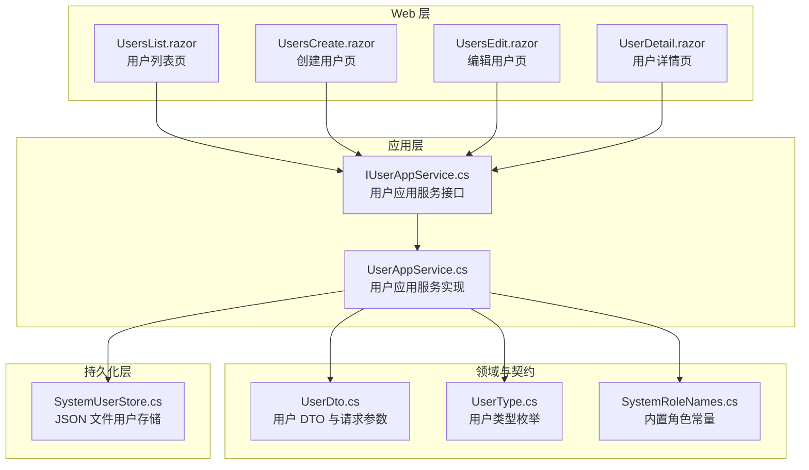
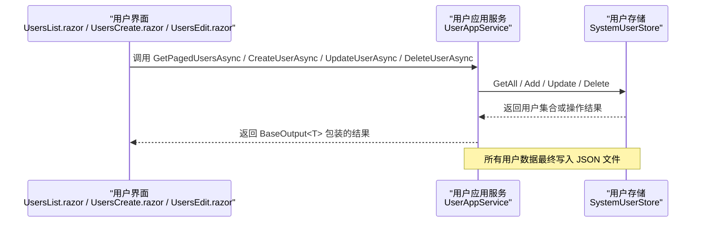
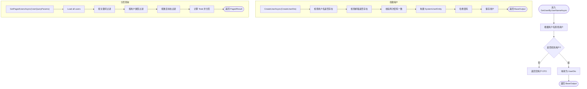
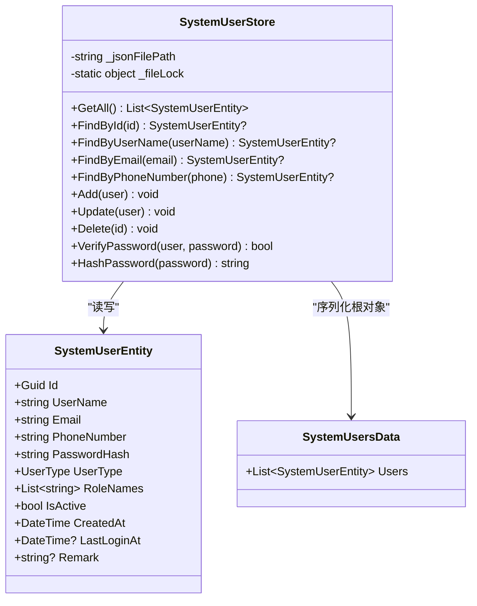
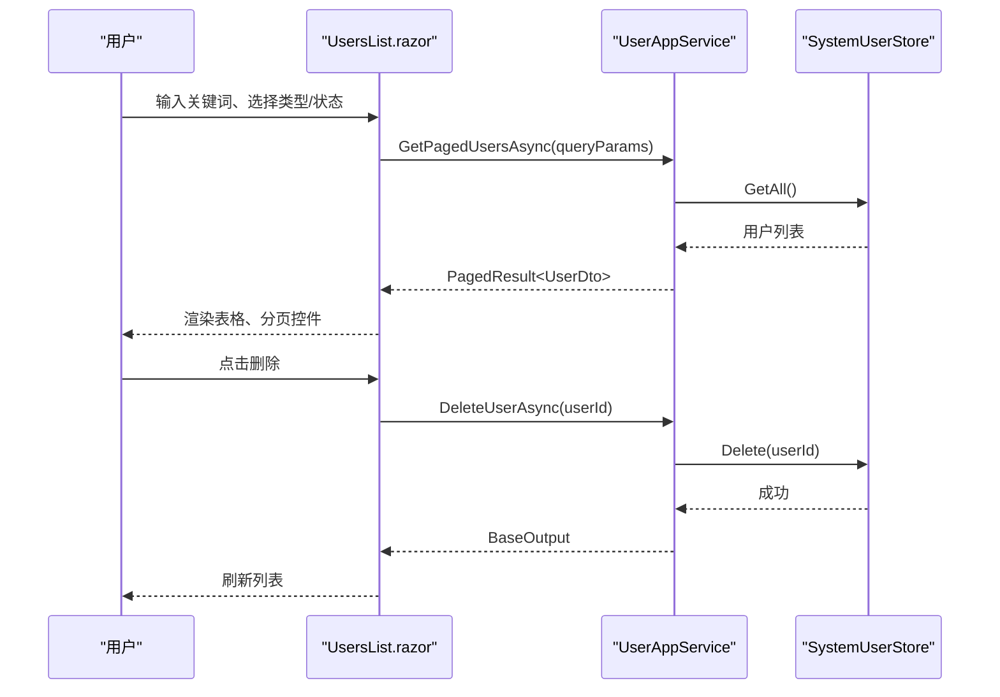
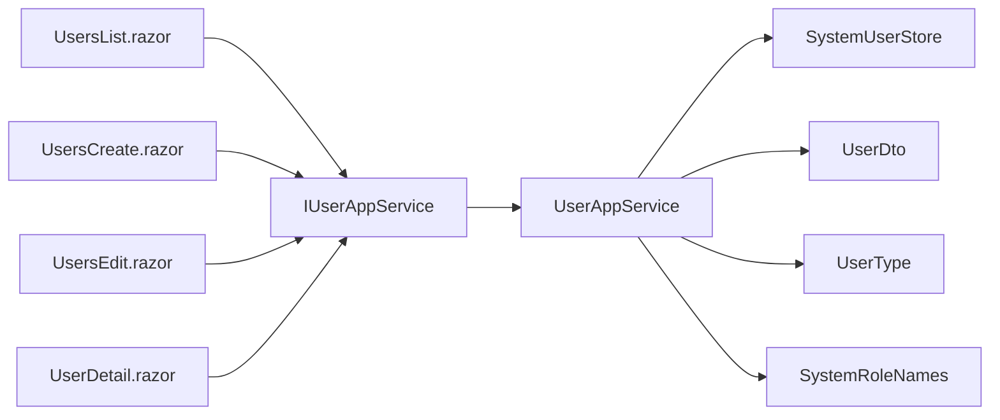

# 用户管理

<cite>
**本文引用的文件**   
- [IUserAppService.cs](file://src/System/SystemPortal/H.SystemPortal.Application.Contracts/Services/IUserAppService.cs)
- [UserAppService.cs](file://src/System/SystemPortal/H.SystemPortal.Application/Services/UserAppService.cs)
- [SystemUserStore.cs](file://src/System/SystemPortal/H.SystemPortal.Application/Services/SystemUserStore.cs)
- [UserDto.cs](file://src/System/SystemPortal/H.SystemPortal.Application.Contracts/Dtos/UserDto.cs)
- [UserType.cs](file://src/System/SystemPortal/H.SystemPortal.Application.Contracts/Enums/UserType.cs)
- [SystemRoleNames.cs](file://src/System/SystemPortal/H.SystemPortal.Application.Contracts/Constants/SystemRoleNames.cs)
- [UsersList.razor](file://src/System/SystemPortal/H.SystemPortal.Web/Pages/User/UsersList.razor)
- [UsersCreate.razor](file://src/System/SystemPortal/H.SystemPortal.Web/Pages/User/UsersCreate.razor)
- [UsersEdit.razor](file://src/System/SystemPortal/H.SystemPortal.Web/Pages/User/UsersEdit.razor)
- [UserDetail.razor](file://src/System/SystemPortal/H.SystemPortal.Web/Pages/User/UserDetail.razor)
</cite>

## 目录
1. [简介](#简介)
2. [项目结构](#项目结构)
3. [核心功能总览](#核心功能总览)
4. [架构总览](#架构总览)
5. [核心组件分析](#核心组件分析)
6. [数据模型说明](#数据模型说明)
7. [API 接口文档](#api-接口文档)
8. [前端用户管理界面说明](#前端用户管理界面说明)
9. [依赖关系分析](#依赖关系分析)
10. [性能与扩展性](#性能与扩展性)
11. [安全建议与最佳实践](#安全建议与最佳实践)
12. [故障排查指南](#故障排查指南)
13. [结论](#结论)

## 简介
本文件面向 H.AppLab 系统门户的用户管理功能，围绕 UserAppService 服务、SystemUserStore 持久化层、UserDto 数据模型以及前端页面组件展开，目标是帮助开发者快速理解并正确扩展系统用户管理能力。内容涵盖：
- 系统用户的增删改查、分页查询、搜索过滤
- 角色分配与用户类型推导
- 账户状态管理、密码重置、最后登录时间更新
- 前端用户列表展示、表单编辑、批量操作扩展点
- API 参数、返回值及调用流程
- 当前 JSON 文件存储实现的安全注意事项与改进建议

## 项目结构
用户管理相关代码主要分布在 SystemPortal 子模块中：
- Application.Contracts：定义应用服务接口、DTO、枚举和常量
- Application：实现业务逻辑和服务
- Web：Blazor 页面，提供用户管理的用户界面

图示来源
- [UsersList.razor:1-220](file://src/System/SystemPortal/H.SystemPortal.Web/Pages/User/UsersList.razor#L1-L220)
- [UsersCreate.razor:1-159](file://src/System/SystemPortal/H.SystemPortal.Web/Pages/User/UsersCreate.razor#L1-L159)
- [UsersEdit.razor:1-303](file://src/System/SystemPortal/H.SystemPortal.Web/Pages/User/UsersEdit.razor#L1-L303)
- [UserDetail.razor:1-130](file://src/System/SystemPortal/H.SystemPortal.Web/Pages/User/UserDetail.razor#L1-L130)
- [IUserAppService.cs:1-30](file://src/System/SystemPortal/H.SystemPortal.Application.Contracts/Services/IUserAppService.cs#L1-L30)
- [UserAppService.cs:1-260](file://src/System/SystemPortal/H.SystemPortal.Application/Services/UserAppService.cs#L1-L260)
- [SystemUserStore.cs:1-235](file://src/System/SystemPortal/H.SystemPortal.Application/Services/SystemUserStore.cs#L1-L235)
- [UserDto.cs:1-186](file://src/System/SystemPortal/H.SystemPortal.Application.Contracts/Dtos/UserDto.cs#L1-L186)
- [UserType.cs:1-22](file://src/System/SystemPortal/H.SystemPortal.Application.Contracts/Enums/UserType.cs#L1-L22)
- [SystemRoleNames.cs:1-29](file://src/System/SystemPortal/H.SystemPortal.Application.Contracts/Constants/SystemRoleNames.cs#L1-L29)

章节来源
- [IUserAppService.cs:1-30](file://src/System/SystemPortal/H.SystemPortal.Application.Contracts/Services/IUserAppService.cs#L1-L30)
- [UserAppService.cs:1-260](file://src/System/SystemPortal/H.SystemPortal.Application/Services/UserAppService.cs#L1-L260)
- [UsersList.razor:1-220](file://src/System/SystemPortal/H.SystemPortal.Web/Pages/User/UsersList.razor#L1-L220)

## 核心功能总览
用户管理功能由 IUserAppService 暴露，UserAppService 实现具体业务规则，SystemUserStore 负责 JSON 文件的读写。前端通过 Blazor 页面调用服务完成用户浏览、创建、编辑、删除、查看详情等操作。

主要能力包括：
- 按用户名、邮箱、ID 获取用户
- 创建用户（含用户名、邮箱、手机号、密码、角色、类型、状态、备注）
- 更新用户信息（基础信息、类型、角色、状态、验证标记、备注）
- 更新用户状态（激活/禁用）
- 重置密码
- 删除用户
- 检查用户名/邮箱是否已存在
- 校验用户名+密码
- 更新最后登录时间
- 分页查询用户（支持关键词、用户类型、状态过滤）
- 为用户分配角色、读取用户角色名称
- 前端用户列表搜索、分页、删除确认；创建/编辑表单；用户详情展示与第三方账号绑定展示

章节来源
- [IUserAppService.cs:1-30](file://src/System/SystemPortal/H.SystemPortal.Application.Contracts/Services/IUserAppService.cs#L1-L30)
- [UserAppService.cs:1-260](file://src/System/SystemPortal/H.SystemPortal.Application/Services/UserAppService.cs#L1-L260)
- [UsersList.razor:1-220](file://src/System/SystemPortal/H.SystemPortal.Web/Pages/User/UsersList.razor#L1-L220)

## 架构总览
用户管理采用分层架构：
- Web 层：Blazor 页面负责 UI 交互与表单处理
- 应用层：UserAppService 封装业务逻辑，协调 Store 进行数据操作
- 契约层：DTO、枚举、常量定义跨层数据结构
- 持久化层：SystemUserStore 使用 JSON 文件作为临时存储

图示来源
- [UsersList.razor:1-220](file://src/System/SystemPortal/H.SystemPortal.Web/Pages/User/UsersList.razor#L1-L220)
- [UsersCreate.razor:1-159](file://src/System/SystemPortal/H.SystemPortal.Web/Pages/User/UsersCreate.razor#L1-L159)
- [UsersEdit.razor:1-303](file://src/System/SystemPortal/H.SystemPortal.Web/Pages/User/UsersEdit.razor#L1-L303)
- [UserAppService.cs:1-260](file://src/System/SystemPortal/H.SystemPortal.Application/Services/UserAppService.cs#L1-L260)
- [SystemUserStore.cs:1-235](file://src/System/SystemPortal/H.SystemPortal.Application/Services/SystemUserStore.cs#L1-L235)

## 核心组件分析

### UserAppService 服务分析
UserAppService 是用户管理的主入口，职责包括：
- 根据用户名、邮箱、ID 查询用户
- 创建用户并哈希密码
- 更新用户基础信息与业务字段
- 更新用户激活状态
- 重置密码并重新哈希
- 删除用户
- 用户名/邮箱唯一性检查
- 用户名+密码校验
- 更新最后登录时间
- 分页查询用户（关键词、用户类型、状态过滤）
- 分配角色并根据角色推导用户类型
- 读取用户角色名称
- 将实体映射到 DTO

关键行为说明：
- 创建用户时会对用户名和邮箱进行唯一性校验，并对密码进行哈希存储
- 更新用户时保留已有角色除非显式传入新角色
- 状态切换仅修改 IsActive 字段
- 分页查询先将全部用户加载到内存，再进行 Where/Skip/Take 分页
- 角色分配后根据是否包含 SuperAdmin/Admin 推导 UserType

图示来源
- [UserAppService.cs:1-260](file://src/System/SystemPortal/H.SystemPortal.Application/Services/UserAppService.cs#L1-L260)

章节来源
- [UserAppService.cs:1-260](file://src/System/SystemPortal/H.SystemPortal.Application/Services/UserAppService.cs#L1-L260)

### SystemUserStore 持久化层分析
SystemUserStore 基于 JSON 文件存储用户数据，提供以下能力：
- 加载与保存 JSON 数据
- 按 ID、用户名、邮箱、手机号查找用户
- 添加、更新、删除用户
- 密码验证（支持明文前缀 PLAIN:xxx 自动升级为哈希）
- PBKDF2 密码哈希生成与时间安全比较

重要细节：
- 开发环境下 JSON 文件路径位于 System/SystemPortal/data/system-users.json
- 生产环境下位于 AppDomain.CurrentDomain.BaseDirectory/data/system-users.json
- 密码哈希格式为 Base64(salt + hash)，salt 长度 16 字节，hash 长度 32 字节
- VerifyPassword 支持首次从明文迁移到哈希存储
- 并发访问通过静态锁保护文件读写

图示来源
- [SystemUserStore.cs:1-235](file://src/System/SystemPortal/H.SystemPortal.Application/Services/SystemUserStore.cs#L1-L235)

章节来源
- [SystemUserStore.cs:1-235](file://src/System/SystemPortal/H.SystemPortal.Application/Services/SystemUserStore.cs#L1-L235)

### 前端 UserManagementComponent 相关页面分析
注意：当前仓库中没有名为 UserManagementComponent 的单一组件，用户管理功能由多个 Razor 页面共同实现：
- UsersList.razor：用户列表、搜索过滤、分页、删除确认
- UsersCreate.razor：创建用户表单，包含用户名、邮箱、密码、确认密码、手机号、用户类型、角色、激活状态、备注
- UsersEdit.razor：编辑用户表单，包含基础信息、类型、角色、激活状态、邮箱/手机验证标记、备注，并提供重置密码弹窗
- UserDetail.razor：用户详细信息展示，包括基本信息、第三方账号绑定列表（解绑逻辑待实现）

图示来源
- [UsersList.razor:1-220](file://src/System/SystemPortal/H.SystemPortal.Web/Pages/User/UsersList.razor#L1-L220)
- [UserAppService.cs:1-260](file://src/System/SystemPortal/H.SystemPortal.Application/Services/UserAppService.cs#L1-L260)
- [SystemUserStore.cs:1-235](file://src/System/SystemPortal/H.SystemPortal.Application/Services/SystemUserStore.cs#L1-L235)

章节来源
- [UsersList.razor:1-220](file://src/System/SystemPortal/H.SystemPortal.Web/Pages/User/UsersList.razor#L1-L220)
- [UsersCreate.razor:1-159](file://src/System/SystemPortal/H.SystemPortal.Web/Pages/User/UsersCreate.razor#L1-L159)
- [UsersEdit.razor:1-303](file://src/System/SystemPortal/H.SystemPortal.Web/Pages/User/UsersEdit.razor#L1-L303)
- [UserDetail.razor:1-130](file://src/System/SystemPortal/H.SystemPortal.Web/Pages/User/UserDetail.razor#L1-L130)

## 数据模型说明

### UserDto 用户数据传输对象
UserDto 用于在前后端之间传输用户数据，包含：
- 基本标识：Id、UserName、Email、PhoneNumber
- 认证与安全：Password（注意不应直接暴露）、IsActive、EmailConfirmed、PhoneNumberConfirmed、IsLocked、LockoutEnd、AccessFailedCount
- 业务属性：UserType、RoleNames、Remark
- 审计字段：CreatedAt、UpdatedAt、LastLoginAt、CreatedBy、UpdatedBy
- 第三方账号：ExternalAccounts（Provider、ProviderKey、DisplayName、BoundAt）

其他相关 DTO：
- CreateUserDto：创建用户请求体，包含用户名、邮箱、密码、确认密码、手机号、用户类型、角色、激活状态、验证标记、备注
- UpdateUserDto：更新用户请求体，字段与 UserDto 类似但不包含敏感密码字段
- UpdateUserStatusDto：仅包含 IsActive 与可选 Remark
- ResetPasswordDto：NewPassword、ConfirmPassword
- UserQueryParams：分页与过滤参数，包括 Keyword、UserType、IsActive、PageIndex、PageSize
- PagedResult<T>：通用分页结果 Items、Total、PageIndex、PageSize、TotalPages
- ExternalAccountDto：第三方账号绑定信息
- LoginRequestDto、RegisterRequestDto、AuthResponseDto：登录注册相关 DTO

章节来源
- [UserDto.cs:1-186](file://src/System/SystemPortal/H.SystemPortal.Application.Contracts/Dtos/UserDto.cs#L1-L186)

### 用户类型与角色常量
- UserType：Normal（普通用户）、Admin（管理员）、SuperAdmin（超级管理员）
- SystemRoleNames：SuperAdmin、Admin 两个内置角色，并提供 IsBuiltIn 判断方法

章节来源
- [UserType.cs:1-22](file://src/System/SystemPortal/H.SystemPortal.Application.Contracts/Enums/UserType.cs#L1-L22)
- [SystemRoleNames.cs:1-29](file://src/System/SystemPortal/H.SystemPortal.Application.Contracts/Constants/SystemRoleNames.cs#L1-L29)

## API 接口文档

### 用户查询接口
- GetUserByUserNameAsync(userName): 根据用户名获取用户
- GetUserByEmailAsync(email): 根据邮箱获取用户
- GetUserByIdAsync(userId): 根据 ID 获取用户
- GetUserDtoByIdAsync(userId): 别名，内部复用 GetUserByIdAsync

返回值统一为 BaseOutput<UserDto?>，当用户不存在时 Data 为空。

章节来源
- [IUserAppService.cs:1-30](file://src/System/SystemPortal/H.SystemPortal.Application.Contracts/Services/IUserAppService.cs#L1-L30)
- [UserAppService.cs:1-260](file://src/System/SystemPortal/H.SystemPortal.Application/Services/UserAppService.cs#L1-L260)

### 用户创建接口
- CreateUserAsync(UserDto user): 旧版接口，直接接收 UserDto
- CreateUserAsync(CreateUserDto dto, currentUserId?): 新版接口，包含用户名、邮箱、密码、确认密码、手机号、用户类型、角色、激活状态、验证标记、备注

业务规则：
- 用户名不可重复
- 邮箱不可重复
- 两次密码必须一致
- 密码会被哈希后存储

返回值：BaseOutput<UserDto>

章节来源
- [UserAppService.cs:1-260](file://src/System/SystemPortal/H.SystemPortal.Application/Services/UserAppService.cs#L1-L260)

### 用户更新接口
- UpdateUserAsync(UserDto user): 旧版接口，更新用户名、邮箱、手机号
- UpdateUserAsync(Guid userId, UpdateUserDto dto, currentUserId?): 新版接口，更新用户名、邮箱、手机号、用户类型、角色、激活状态、验证标记、备注

业务规则：
- 用户不存在则返回 false
- 未传入角色时保留原角色

返回值：BaseOutput<bool>

章节来源
- [UserAppService.cs:1-260](file://src/System/SystemPortal/H.SystemPortal.Application/Services/UserAppService.cs#L1-L260)

### 用户状态管理接口
- UpdateUserStatusAsync(Guid userId, UpdateUserStatusDto dto, currentUserId?): 设置 IsActive 并可选更新 Remark

业务规则：
- 用户不存在抛出异常

返回值：BaseOutput

章节来源
- [UserAppService.cs:1-260](file://src/System/SystemPortal/H.SystemPortal.Application/Services/UserAppService.cs#L1-L260)

### 密码管理接口
- ResetPasswordAsync(Guid userId, ResetPasswordDto dto): 校验两次密码一致后重新哈希并保存

业务规则：
- 两次密码不一致抛出异常
- 用户不存在抛出异常

返回值：BaseOutput

章节来源
- [UserAppService.cs:1-260](file://src/System/SystemPortal/H.SystemPortal.Application/Services/UserAppService.cs#L1-L260)

### 用户删除接口
- DeleteUserAsync(Guid userId): 删除指定用户

业务规则：
- 用户不存在抛出异常

返回值：BaseOutput

章节来源
- [UserAppService.cs:1-260](file://src/System/SystemPortal/H.SystemPortal.Application/Services/UserAppService.cs#L1-L260)

### 唯一性与认证校验接口
- ExistsByUserNameAsync(userName, excludeId?): 检查用户名是否已存在，可排除某用户 ID
- ExistsByEmailAsync(email, excludeId?): 检查邮箱是否已存在，可排除某用户 ID
- VerifyPasswordAsync(userName, password): 校验用户名与密码是否正确

返回值：BaseOutput<bool>

章节来源
- [UserAppService.cs:1-260](file://src/System/SystemPortal/H.SystemPortal.Application/Services/UserAppService.cs#L1-L260)

### 最后登录时间接口
- UpdateLastLoginTimeAsync(Guid userId): 若用户存在则更新 LastLoginAt 为当前 UTC 时间

返回值：BaseOutput

章节来源
- [UserAppService.cs:1-260](file://src/System/SystemPortal/H.SystemPortal.Application/Services/UserAppService.cs#L1-L260)

### 分页查询接口
- GetPagedUsersAsync(UserQueryParams queryParams): 支持关键词、用户类型、激活状态过滤，返回分页结果

过滤规则：
- 关键词匹配用户名、邮箱、手机号（不区分大小写）
- 用户类型精确匹配
- 激活状态精确匹配

分页规则：
- 先加载全部用户到内存
- 计算 Total 为过滤后总数
- 使用 Skip/Take 进行分页

返回值：BaseOutput<PagedResult<UserDto>>

章节来源
- [UserAppService.cs:1-260](file://src/System/SystemPortal/H.SystemPortal.Application/Services/UserAppService.cs#L1-L260)

### 角色管理接口
- AssignRolesToUserAsync(Guid userId, roleNames): 为用户分配角色列表，并根据角色推导 UserType
- GetUserRoleNamesAsync(Guid userId): 读取用户角色名称列表

业务规则：
- 用户不存在抛出异常
- 角色包含 SuperAdmin 则 UserType=SuperAdmin
- 角色包含 Admin 则 UserType=Admin
- 否则 UserType=Normal

返回值：BaseOutput 或 BaseOutput<List<string>>

章节来源
- [UserAppService.cs:1-260](file://src/System/SystemPortal/H.SystemPortal.Application/Services/UserAppService.cs#L1-L260)

## 前端用户管理界面说明

### 用户列表页面（UsersList.razor）
- 支持关键词搜索（用户名、邮箱、手机号）
- 支持按用户类型筛选（普通用户、管理员、超级管理员）
- 支持按状态筛选（激活、禁用）
- 显示用户列表：用户名、邮箱、手机号、第三方账号图标、用户类型标签、状态标签、最后登录时间
- 支持分页：上一页、下一页、当前页码与总条数
- 支持删除确认并调用后端删除接口
- 支持跳转到创建页面

章节来源
- [UsersList.razor:1-220](file://src/System/SystemPortal/H.SystemPortal.Web/Pages/User/UsersList.razor#L1-L220)

### 创建用户页面（UsersCreate.razor）
- 表单字段：用户名、邮箱、密码、确认密码、手机号、用户类型、角色（逗号分隔）、激活开关、备注
- 提交时将 rolesText 转换为 List<string> 并调用 CreateUserAsync
- 错误提示与提交中状态控制

章节来源
- [UsersCreate.razor:1-159](file://src/System/SystemPortal/H.SystemPortal.Web/Pages/User/UsersCreate.razor#L1-L159)

### 编辑用户页面（UsersEdit.razor）
- 表单字段：用户名、邮箱、手机号、用户类型、角色、激活开关、邮箱验证开关、手机验证开关、备注
- 提供“重置密码”弹窗，调用 ResetPasswordAsync
- 展示用户信息表：ID、创建时间、最后登录、更新时间
- 用户不存在时显示错误提示

章节来源
- [UsersEdit.razor:1-303](file://src/System/SystemPortal/H.SystemPortal.Web/Pages/User/UsersEdit.razor#L1-L303)

### 用户详情页面（UserDetail.razor）
- 展示用户基本信息：用户名、邮箱、手机号、用户类型、状态、邮箱验证、手机验证、最后登录、创建时间、更新时间、备注
- 展示第三方账号绑定列表：平台、账号ID、显示名称、绑定时间、解绑按钮（暂未实现）

章节来源
- [UserDetail.razor:1-130](file://src/System/SystemPortal/H.SystemPortal.Web/Pages/User/UserDetail.razor#L1-L130)

## 依赖关系分析

图示来源
- [IUserAppService.cs:1-30](file://src/System/SystemPortal/H.SystemPortal.Application.Contracts/Services/IUserAppService.cs#L1-L30)
- [UserAppService.cs:1-260](file://src/System/SystemPortal/H.SystemPortal.Application/Services/UserAppService.cs#L1-L260)
- [SystemUserStore.cs:1-235](file://src/System/SystemPortal/H.SystemPortal.Application/Services/SystemUserStore.cs#L1-L235)
- [UserDto.cs:1-186](file://src/System/SystemPortal/H.SystemPortal.Application.Contracts/Dtos/UserDto.cs#L1-L186)
- [UserType.cs:1-22](file://src/System/SystemPortal/H.SystemPortal.Application.Contracts/Enums/UserType.cs#L1-L22)
- [SystemRoleNames.cs:1-29](file://src/System/SystemPortal/H.SystemPortal.Application.Contracts/Constants/SystemRoleNames.cs#L1-L29)
- [UsersList.razor:1-220](file://src/System/SystemPortal/H.SystemPortal.Web/Pages/User/UsersList.razor#L1-L220)
- [UsersCreate.razor:1-159](file://src/System/SystemPortal/H.SystemPortal.Web/Pages/User/UsersCreate.razor#L1-L159)
- [UsersEdit.razor:1-303](file://src/System/SystemPortal/H.SystemPortal.Web/Pages/User/UsersEdit.razor#L1-L303)
- [UserDetail.razor:1-130](file://src/System/SystemPortal/H.SystemPortal.Web/Pages/User/UserDetail.razor#L1-L130)

章节来源
- [IUserAppService.cs:1-30](file://src/System/SystemPortal/H.SystemPortal.Application.Contracts/Services/IUserAppService.cs#L1-L30)
- [UserAppService.cs:1-260](file://src/System/SystemPortal/H.SystemPortal.Application/Services/UserAppService.cs#L1-L260)

## 性能与扩展性
当前实现的性能特征：
- 分页查询先加载全部用户到内存再过滤与分页，适用于小规模数据集；当用户量增长时需改为数据库分页与服务器端过滤
- JSON 文件读写通过静态锁保证一致性，但并发写入仍可能成为瓶颈
- 密码哈希使用 PBKDF2，迭代次数较高，适合安全性优先场景

优化建议：
- 引入 EF Core 或其他 ORM，实现真正的数据库分页与索引优化
- 对用户表建立用户名、邮箱、手机号的唯一索引
- 对关键词搜索增加全文索引或搜索引擎集成
- 将角色管理从字符串数组迁移至标准角色-用户关联表
- 对分页查询增加排序字段与默认排序策略

[本节为通用指导，不直接分析具体文件]

## 安全建议与最佳实践
- 不要在 DTO 中直接暴露 Password 字段；UserDto 中的 Password 应移除或在序列化时忽略
- 确保所有密码重置与更新接口具备服务端权限校验
- 限制密码复杂度与历史密码重用策略
- 启用登录失败计数与锁定机制（IsLocked、LockoutEnd、AccessFailedCount）
- 对敏感操作（删除、重置密码）记录审计日志
- 防止暴力破解：对 VerifyPasswordAsync 增加速率限制
- 对第三方账号绑定与解绑进行授权校验
- 生产环境避免明文密码存储；如仍有 PLAIN: 前缀，应在首次登录后强制重置密码

章节来源
- [UserDto.cs:1-186](file://src/System/SystemPortal/H.SystemPortal.Application.Contracts/Dtos/UserDto.cs#L1-L186)
- [SystemUserStore.cs:1-235](file://src/System/SystemPortal/H.SystemPortal.Application/Services/SystemUserStore.cs#L1-L235)

## 故障排查指南
常见问题与定位方法：
- 用户不存在异常：检查 DeleteUserAsync、ResetPasswordAsync、UpdateUserStatusAsync 等接口是否在用户不存在时抛错；前端需捕获并提示
- 用户名/邮箱重复：CreateUserAsync 会抛出异常；前端需在提交前调用 ExistsByUserNameAsync/ExistsByEmailAsync 做预校验
- 密码不一致：ResetPasswordAsync 与 CreateUserAsync 均校验两次密码；前端需在表单层面增加提示
- 分页结果为空：检查 UserQueryParams 的过滤条件是否过严；确认前端传递的 PageIndex、PageSize 是否正确
- 角色未生效：确认 AssignRolesToUserAsync 是否正确调用，且 DeriveUserType 是否根据角色正确推导 UserType
- JSON 文件写入失败：检查 SystemUserStore 的文件路径与权限；确认调试环境与生产环境路径配置

章节来源
- [UserAppService.cs:1-260](file://src/System/SystemPortal/H.SystemPortal.Application/Services/UserAppService.cs#L1-L260)
- [SystemUserStore.cs:1-235](file://src/System/SystemPortal/H.SystemPortal.Application/Services/SystemUserStore.cs#L1-L235)

## 结论
H.AppLab 系统门户的用户管理功能以 IUserAppService 为核心，配合 SystemUserStore 的 JSON 文件存储与前端 Blazor 页面，提供了完整的用户生命周期管理能力。当前实现适合中小规模系统演示与初期运行，但在生产环境中应逐步迁移到数据库存储、完善权限控制、增强安全策略与性能优化。建议在后续迭代中重点推进：
- 持久化层从 JSON 文件迁移到数据库
- 强化权限与审计机制
- 提升分页与搜索性能
- 完善第三方账号绑定与解绑流程
- 清理 DTO 中的敏感字段并在序列化层屏蔽

[本节为总结性内容，不直接分析具体文件]