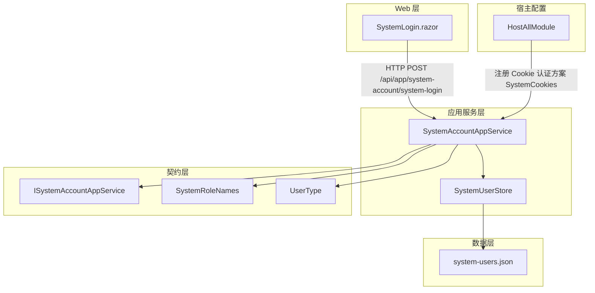
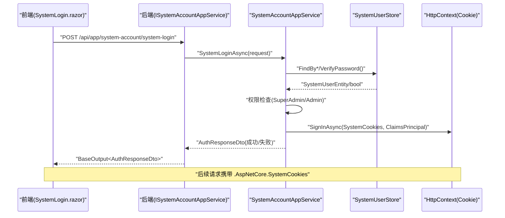
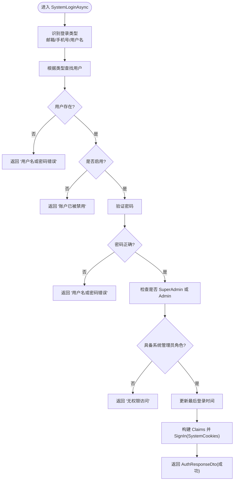
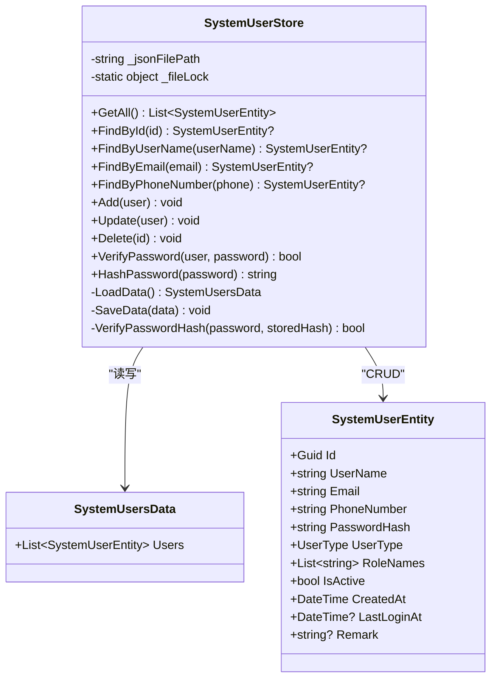
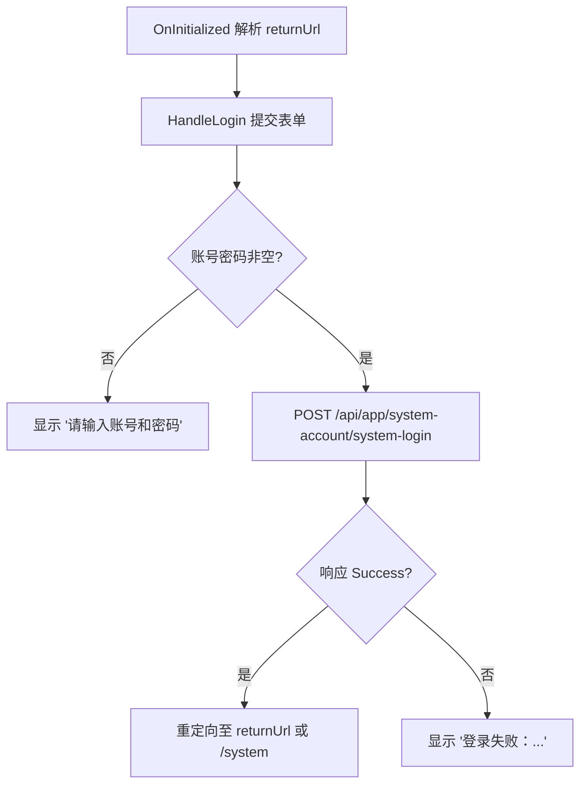
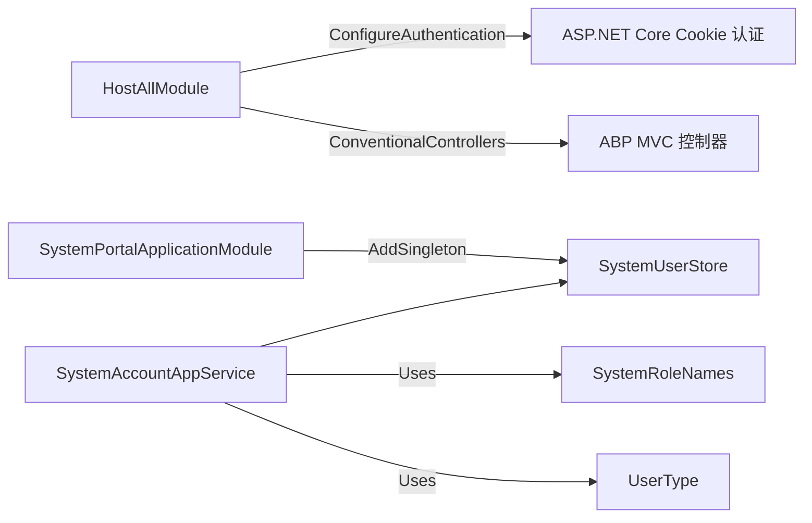
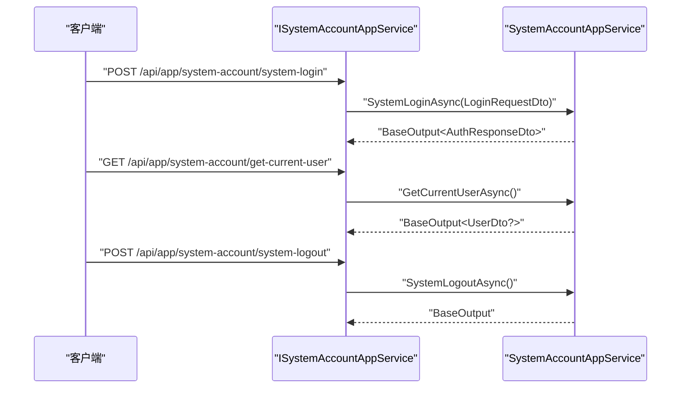

# 系统账户认证

<cite>
**本文引用的文件**   
- [SystemAccountAppService.cs](file://src/System/SystemPortal/H.SystemPortal.Application/Services/SystemAccountAppService.cs)
- [ISystemAccountAppService.cs](file://src/System/SystemPortal/H.SystemPortal.Application.Contracts/Services/ISystemAccountAppService.cs)
- [SystemUserStore.cs](file://src/System/SystemPortal/H.SystemPortal.Application/Services/SystemUserStore.cs)
- [SystemLogin.razor](file://src/System/SystemPortal/H.SystemPortal.Web/Pages/SystemLogin.razor)
- [system-users.json](file://src/System/SystemPortal/data/system-users.json)
- [SystemRoleNames.cs](file://src/System/SystemPortal/H.SystemPortal.Application.Contracts/Constants/SystemRoleNames.cs)
- [UserType.cs](file://src/System/SystemPortal/H.SystemPortal.Application.Contracts/Enums/UserType.cs)
- [SystemPortalApplicationModule.cs](file://src/System/SystemPortal/H.SystemPortal.Application/SystemPortalApplicationModule.cs)
- [HostAllModule.cs](file://src/Host/H.AppLab.Web.Host/H.AppLab.Web.Host/HostAllModule.cs)
</cite>

## 目录
1. [引言](#引言)
2. [项目结构](#项目结构)
3. [核心组件](#核心组件)
4. [架构总览](#架构总览)
5. [详细组件分析](#详细组件分析)
6. [依赖关系分析](#依赖关系分析)
7. [性能与扩展性](#性能与扩展性)
8. [API 接口文档](#api-接口文档)
9. [安全配置与最佳实践](#安全配置与最佳实践)
10. [故障排查指南](#故障排查指南)
11. [结论](#结论)

## 引言
本文面向 H.AppLab 系统门户的系统账户认证能力，围绕管理员登录、Cookie 认证、会话管理与权限校验展开。重点说明：
- SystemAccountAppService 的认证流程：账号识别、密码验证、会话创建、权限检查。
- SystemUserStore 的用户存储机制：JSON 文件持久化、缓存策略、内存管理、密码哈希。
- SystemLogin 前端页面的认证拦截逻辑：登录重定向、未授权处理、跳转行为。
- 认证相关 API：登录、登出、获取当前用户的安全调用方式。
- 认证配置与安全建议：Cookie 方案、CSRF、过期时间、密码强度等。

该子系统为“系统级”管理能力提供入口，仅允许具备 SuperAdmin 或 Admin 角色的用户访问。

## 项目结构
与系统账户认证直接相关的代码分布在以下模块：
- 应用服务层：SystemAccountAppService（认证业务）、SystemUserStore（用户数据存取）。
- 契约层：ISystemAccountAppService（API 定义）、SystemRoleNames（角色常量）、UserType（用户类型）。
- Web 页面层：SystemLogin.razor（系统登录页）。
- 宿主模块层：HostAllModule.cs（统一 Cookie 认证配置）。
- 数据层：system-users.json（默认系统用户数据存储文件）。

**图表来源**
- [SystemLogin.razor:1-119](file://src/System/SystemPortal/H.SystemPortal.Web/Pages/SystemLogin.razor#L1-L119)
- [SystemAccountAppService.cs:1-176](file://src/System/SystemPortal/H.SystemPortal.Application/Services/SystemAccountAppService.cs#L1-L176)
- [SystemUserStore.cs:1-235](file://src/System/SystemPortal/H.SystemPortal.Application/Services/SystemUserStore.cs#L1-L235)
- [ISystemAccountAppService.cs:1-22](file://src/System/SystemPortal/H.SystemPortal.Application.Contracts/Services/ISystemAccountAppService.cs#L1-L22)
- [SystemRoleNames.cs:1-29](file://src/System/SystemPortal/H.SystemPortal.Application.Contracts/Constants/SystemRoleNames.cs#L1-L29)
- [UserType.cs:1-22](file://src/System/SystemPortal/H.SystemPortal.Application.Contracts/Enums/UserType.cs#L1-L22)
- [HostAllModule.cs:100-160](file://src/Host/H.AppLab.Web.Host/H.AppLab.Web.Host/HostAllModule.cs#L100-L160)
- [system-users.json:1-19](file://src/System/SystemPortal/data/system-users.json#L1-L19)

**章节来源**
- [SystemAccountAppService.cs:1-176](file://src/System/SystemPortal/H.SystemPortal.Application/Services/SystemAccountAppService.cs#L1-L176)
- [SystemUserStore.cs:1-235](file://src/System/SystemPortal/H.SystemPortal.Application/Services/SystemUserStore.cs#L1-L235)
- [SystemLogin.razor:1-119](file://src/System/SystemPortal/H.SystemPortal.Web/Pages/SystemLogin.razor#L1-L119)
- [HostAllModule.cs:100-160](file://src/Host/H.AppLab.Web.Host/H.AppLab.Web.Host/HostAllModule.cs#L100-L160)

## 核心组件
- ISystemAccountAppService：定义系统账户认证接口，包含登录、获取当前用户、登出三个方法。
- SystemAccountAppService：实现系统账户认证，负责账号识别、密码校验、权限检查、Cookie 会话创建与销毁。
- SystemUserStore：基于 JSON 文件的用户存储，提供用户查询、添加、更新、删除以及密码哈希/校验。
- SystemLogin.razor：系统登录页面，负责收集凭据、调用登录 API、处理成功/失败反馈与页面跳转。
- HostAllModule：统一配置 ASP.NET Core Cookie 认证，注册 SystemCookies 方案及对应 Cookie 名称、过期时间、滑动过期、登录/拒绝路径。
- SystemRoleNames：系统内置角色常量（SuperAdmin、Admin），用于权限判断。
- UserType：用户类型枚举（Normal、Admin、SuperAdmin），与角色配合标识管理员身份。

**章节来源**
- [ISystemAccountAppService.cs:1-22](file://src/System/SystemPortal/H.SystemPortal.Application.Contracts/Services/ISystemAccountAppService.cs#L1-L22)
- [SystemAccountAppService.cs:1-176](file://src/System/SystemPortal/H.SystemPortal.Application/Services/SystemAccountAppService.cs#L1-L176)
- [SystemUserStore.cs:1-235](file://src/System/SystemPortal/H.SystemPortal.Application/Services/SystemUserStore.cs#L1-L235)
- [SystemLogin.razor:1-119](file://src/System/SystemPortal/H.SystemPortal.Web/Pages/SystemLogin.razor#L1-L119)
- [HostAllModule.cs:100-160](file://src/Host/H.AppLab.Web.Host/H.AppLab.Web.Host/HostAllModule.cs#L100-L160)
- [SystemRoleNames.cs:1-29](file://src/System/SystemPortal/H.SystemPortal.Application.Contracts/Constants/SystemRoleNames.cs#L1-L29)
- [UserType.cs:1-22](file://src/System/SystemPortal/H.SystemPortal.Application.Contracts/Enums/UserType.cs#L1-L22)

## 架构总览
系统账户认证的整体流程如下：
1. 前端 SystemLogin.razor 收集账号与密码，POST 到后端 /api/app/system-account/system-login。
2. SystemAccountAppService 解析输入，识别登录类型（邮箱、手机号或用户名），查找用户并校验状态与密码。
3. 校验通过后检查是否具备 SuperAdmin 或 Admin 角色；通过后更新最后登录时间。
4. 通过 HttpContext.SignInAsync 写入 SystemCookies 方案下的 ClaimsPrincipal，建立 Cookie 会话。
5. 后续请求可通过 GetCurrentUserAsync 从 Cookie 中读取当前用户并返回 UserDto。
6. 登出时调用 SignOutAsync 清除 SystemCookies 方案下的会话。

**图表来源**
- [SystemLogin.razor:40-119](file://src/System/SystemPortal/H.SystemPortal.Web/Pages/SystemLogin.razor#L40-L119)
- [SystemAccountAppService.cs:23-119](file://src/System/SystemPortal/H.SystemPortal.Application/Services/SystemAccountAppService.cs#L23-L119)
- [SystemUserStore.cs:1-235](file://src/System/SystemPortal/H.SystemPortal.Application/Services/SystemUserStore.cs#L1-L235)
- [HostAllModule.cs:120-150](file://src/Host/H.AppLab.Web.Host/H.AppLab.Web.Host/HostAllModule.cs#L120-L150)

## 详细组件分析

### SystemAccountAppService 认证流程
- 账号识别：
  - 若输入包含 @ 且符合邮箱正则，则视为邮箱登录。
  - 若输入匹配中国大陆手机号正则，则视为手机号登录。
  - 否则按用户名查找。
- 用户校验：
  - 不存在则返回“用户名或密码错误”。
  - 已禁用则返回“账户已被禁用”。
  - 密码不匹配则返回“用户名或密码错误”。
- 权限检查：
  - 必须具有 SuperAdmin 或 Admin 角色之一，否则返回“无权限访问”。
- 会话创建：
  - 将用户 Id、UserName、Email 与角色写入 ClaimsIdentity，使用 SystemCookies 方案进行 SignIn。
  - RememberMe=true 时 Cookie 有效期为 7 天；否则为 24 小时。
- 登出与会话读取：
  - SystemLogoutAsync 调用 SignOutAsync 清除 SystemCookies。
  - GetCurrentUserAsync 显式 AuthenticateAsync(SystemCookies)，解析 UserId 后查库并再次权限校验，返回 UserDto 或 null。

**图表来源**
- [SystemAccountAppService.cs:23-119](file://src/System/SystemPortal/H.SystemPortal.Application/Services/SystemAccountAppService.cs#L23-L119)
- [SystemRoleNames.cs:1-29](file://src/System/SystemPortal/H.SystemPortal.Application.Contracts/Constants/SystemRoleNames.cs#L1-L29)

**章节来源**
- [SystemAccountAppService.cs:23-119](file://src/System/SystemPortal/H.SystemPortal.Application/Services/SystemAccountAppService.cs#L23-L119)

### SystemUserStore 用户存储机制
- 数据结构：
  - SystemUserEntity：用户实体，包含 Id、UserName、Email、PhoneNumber、PasswordHash、UserType、RoleNames、IsActive、CreatedAt、LastLoginAt、Remark。
  - SystemUsersData：根对象，包含 Users 列表。
- 文件路径：
  - DEBUG 环境：项目根目录相对路径 System/SystemPortal/data/system-users.json。
  - 发布环境：运行目录 data/system-users.json。
- 并发控制：
  - 使用静态 _fileLock 对象对 LoadData/SaveData 加锁，避免多进程/多线程并发读写造成文件损坏。
- 读取与写入：
  - LoadData：文件不存在时返回空集合；存在则反序列化为 SystemUsersData。
  - SaveData：确保目录存在，以缩进格式序列化，使用 UnsafeRelaxedJsonEscaping 编码。
- 用户操作：
  - GetAll/FindById/FindByUserName/FindByPhoneNumber/FindByEmail：基础查询。
  - Add/Update/Delete：增删改后保存。
- 密码安全：
  - HashPassword：PBKDF2 (RFC2898)，SHA256，迭代 100000 次，盐长度 16，输出 Base64(salt+hash)。
  - VerifyPassword：支持初始明文前缀 PLAIN:xxx，首次验证成功后自动转为哈希存储；之后使用固定时间比较防时序攻击。
- 内存与缓存策略：
  - 每次操作均从磁盘加载整个文件，未引入内存缓存。适合少量系统用户场景；高并发或大量用户时应考虑数据库或分布式缓存。

**图表来源**
- [SystemUserStore.cs:1-235](file://src/System/SystemPortal/H.SystemPortal.Application/Services/SystemUserStore.cs#L1-L235)

**章节来源**
- [SystemUserStore.cs:1-235](file://src/System/SystemPortal/H.SystemPortal.Application/Services/SystemUserStore.cs#L1-L235)

### SystemLogin 前端认证拦截逻辑
- 页面路由：/system/login，标记 AllowAnonymous，允许匿名访问。
- 布局：@layout SystemLoginLayout，表明使用系统登录布局。
- 表单交互：
  - 收集 Account 与 Password，提交到 /api/app/system-account/system-login。
  - 成功时显示成功消息并重定向至 returnUrl（默认为 /system）。
  - 失败时显示错误信息，禁止跳转。
- 错误处理：
  - 捕获 NavigationException 透传，其他异常转换为错误提示。
- 未授权处理：
  - 未登录访问受保护资源时，由 Cookie 认证中间件重定向到 /system/login（由 HostAllModule 配置 SystemCookies 方案）。

**图表来源**
- [SystemLogin.razor:1-119](file://src/System/SystemPortal/H.SystemPortal.Web/Pages/SystemLogin.razor#L1-L119)
- [HostAllModule.cs:120-150](file://src/Host/H.AppLab.Web.Host/H.AppLab.Web.Host/HostAllModule.cs#L120-L150)

**章节来源**
- [SystemLogin.razor:1-119](file://src/System/SystemPortal/H.SystemPortal.Web/Pages/SystemLogin.razor#L1-L119)

## 依赖关系分析
- SystemPortalApplicationModule：注册 SystemUserStore 为单例，供应用服务注入使用。
- HostAllModule：
  - 注册 HttpClient 与 HttpContextAccessor。
  - 配置 Cookie 认证默认方案与 SystemCookies 方案，设置 Cookie 名称为 .AspNetCore.SystemCookies，登录/拒绝路径分别为 /account/login 与 /system/login。
  - 关闭 ABP AntiForgery 自动验证，适配 WASM JSON API + Cookie 认证模式，SameSite 提供 CSRF 保护。
  - 注册各模块控制器，包括 SystemPortalApplicationModule 对应的控制器装配。
- SystemAccountAppService：
  - 依赖 SystemUserStore 与 IHttpContextAccessor。
  - 使用 SystemRoleNames 常量进行权限判断。
  - 使用 UserType 枚举填充 UserDto。

**图表来源**
- [HostAllModule.cs:100-160](file://src/Host/H.AppLab.Web.Host/H.AppLab.Web.Host/HostAllModule.cs#L100-L160)
- [SystemPortalApplicationModule.cs:1-12](file://src/System/SystemPortal/H.SystemPortal.Application/SystemPortalApplicationModule.cs#L1-L12)
- [SystemAccountAppService.cs:1-176](file://src/System/SystemPortal/H.SystemPortal.Application/Services/SystemAccountAppService.cs#L1-L176)

**章节来源**
- [HostAllModule.cs:100-160](file://src/Host/H.AppLab.Web.Host/H.AppLab.Web.Host/HostAllModule.cs#L100-L160)
- [SystemPortalApplicationModule.cs:1-12](file://src/System/SystemPortal/H.SystemPortal.Application/SystemPortalApplicationModule.cs#L1-L12)
- [SystemAccountAppService.cs:1-176](file://src/System/SystemPortal/H.SystemPortal.Application/Services/SystemAccountAppService.cs#L1-L176)

## 性能与扩展性
- 用户存储性能：
  - 每次读写均加载完整 JSON 文件，适合少量系统管理员账户。
  - 并发写通过文件级锁串行化，避免竞争条件。
- 可扩展方向：
  - 将 SystemUserStore 替换为 EF Core 或其他持久化后端，提高并发与查询效率。
  - 增加用户会话缓存（如 Redis）以减少频繁磁盘 IO。
  - 支持多租户系统管理员隔离与审计日志。
- 密码哈希成本：
  - PBKDF2 迭代 100000 次，兼顾安全性与性能；可根据硬件调整迭代次数。

[本节为通用性能讨论，不直接分析具体文件]

## API 接口文档
以下接口由 ISystemAccountAppService 定义并通过 ABP 传统控制器暴露。

- 登录
  - 方法：SystemLoginAsync
  - 请求体：LoginRequestDto（包含 Account、Password、RememberMe）
  - 返回：BaseOutput<AuthResponseDto>
  - 行为：
    - 账号识别（邮箱/手机号/用户名）
    - 用户状态与密码校验
    - 权限检查（SuperAdmin 或 Admin）
    - 成功后写入 SystemCookies 会话
  - 安全考虑：
    - 建议在 HTTPS 下调用，防止 Cookie 泄露。
    - 服务端记录登录尝试与失败原因，便于审计与风控。

- 获取当前用户
  - 方法：GetCurrentUserAsync
  - 返回：BaseOutput<UserDto?>
  - 行为：
    - 从 SystemCookies 方案解析 ClaimsPrincipal
    - 校验用户有效性与系统管理员角色
    - 返回 UserDto 或 null
  - 安全考虑：
    - 未登录或无权限时返回空数据，不泄露敏感信息。

- 登出
  - 方法：SystemLogoutAsync
  - 返回：BaseOutput
  - 行为：
    - 清除 SystemCookies 方案下的会话
  - 安全考虑：
    - 客户端应清理本地状态并跳转到安全页面。

**图表来源**
- [ISystemAccountAppService.cs:1-22](file://src/System/SystemPortal/H.SystemPortal.Application.Contracts/Services/ISystemAccountAppService.cs#L1-L22)
- [SystemAccountAppService.cs:23-176](file://src/System/SystemPortal/H.SystemPortal.Application/Services/SystemAccountAppService.cs#L23-L176)

**章节来源**
- [ISystemAccountAppService.cs:1-22](file://src/System/SystemPortal/H.SystemPortal.Application.Contracts/Services/ISystemAccountAppService.cs#L1-L22)
- [SystemAccountAppService.cs:23-176](file://src/System/SystemPortal/H.SystemPortal.Application/Services/SystemAccountAppService.cs#L23-L176)

## 安全配置与最佳实践
- Cookie 认证方案
  - 默认方案：登录路径 /account/login，拒绝路径 /account/login。
  - 系统方案（SystemCookies）：登录路径 /system/login，拒绝路径 /system/login，Cookie 名称 .AspNetCore.SystemCookies。
  - 过期策略：默认 24 小时，支持滑动过期；登录时可设置为 7 天（RememberMe）。
- CSRF 防护
  - 关闭 ABP AntiForgery 自动验证，适配 WASM JSON API + Cookie 认证，依赖 SameSite Cookie 提供 CSRF 保护。
- 密码安全
  - 使用 PBKDF2 + SHA256 + 随机盐，迭代 100000 次。
  - 首次登录可将明文前缀 PLAIN:xxx 自动升级为哈希存储。
  - 固定时间比较防时序攻击。
- 权限模型
  - 系统管理员角色：SuperAdmin、Admin。
  - 仅具备上述角色的用户可访问系统门户。
- 推荐实践
  - 强制 HTTPS，禁用不安全 Cookie。
  - 设置合理的会话超时与最大并发登录数。
  - 记录登录事件与失败日志，接入审计平台。
  - 定期轮换密钥与更新密码策略。
  - 限制登录尝试次数，防止暴力破解。

**章节来源**
- [HostAllModule.cs:100-160](file://src/Host/H.AppLab.Web.Host/H.AppLab.Web.Host/HostAllModule.cs#L100-L160)
- [SystemUserStore.cs:1-235](file://src/System/SystemPortal/H.SystemPortal.Application/Services/SystemUserStore.cs#L1-L235)
- [SystemRoleNames.cs:1-29](file://src/System/SystemPortal/H.SystemPortal.Application.Contracts/Constants/SystemRoleNames.cs#L1-L29)

## 故障排查指南
- 无法登录
  - 检查 system-users.json 是否存在且可读。
  - 确认用户 IsActive 为 true。
  - 确认用户具备 SuperAdmin 或 Admin 角色。
  - 检查密码是否正确，或是否仍为 PLAIN:xxx 前缀。
- 登录后立即被重定向到 /system/login
  - 检查浏览器是否禁用了 Cookie。
  - 检查 Cookie 名称是否为 .AspNetCore.SystemCookies。
  - 检查请求是否走 HTTPS，以及 SameSite 配置是否被代理修改。
- 获取当前用户为空
  - 检查 Cookie 是否过期或被清除。
  - 检查当前用户是否仍具备系统管理员角色且处于启用状态。
- 并发写入导致数据损坏
  - 检查是否有多个进程同时写入 system-users.json。
  - 建议迁移到数据库或使用分布式锁。

**章节来源**
- [SystemUserStore.cs:1-235](file://src/System/SystemPortal/H.SystemPortal.Application/Services/SystemUserStore.cs#L1-L235)
- [SystemAccountAppService.cs:23-176](file://src/System/SystemPortal/H.SystemPortal.Application/Services/SystemAccountAppService.cs#L23-L176)
- [HostAllModule.cs:100-160](file://src/Host/H.AppLab.Web.Host/H.AppLab.Web.Host/HostAllModule.cs#L100-L160)

## 结论
H.AppLab 系统门户的系统账户认证通过 SystemAccountAppService 与 SystemUserStore 协作，结合 ASP.NET Core Cookie 认证方案 SystemCookies，实现了安全的系统管理员登录、会话管理与权限校验。SystemLogin 前端页面提供了清晰的登录体验与错误反馈。当前实现以 JSON 文件作为用户存储，适用于小规模系统管理员场景；在生产环境中建议迁移至数据库并增强并发与审计能力。同时，遵循 HTTPS、Cookie 安全、密码强度与访问控制等最佳实践，可有效降低安全风险。