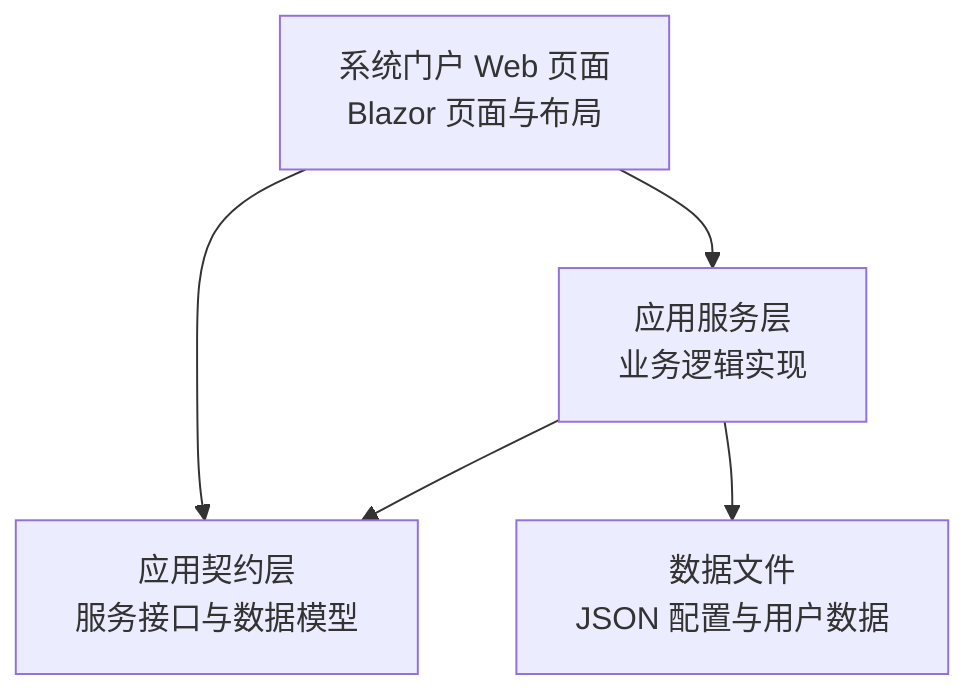
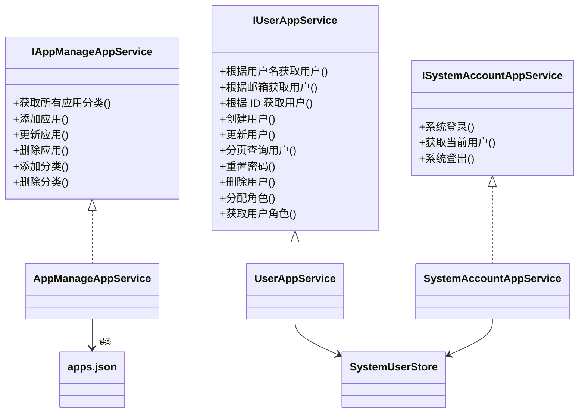
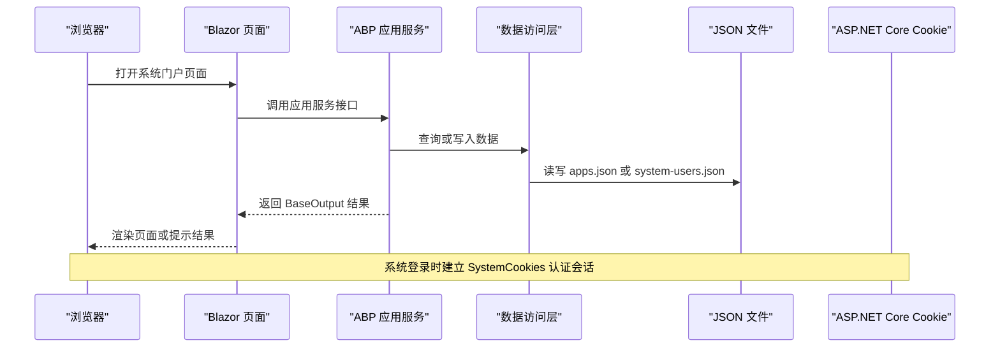
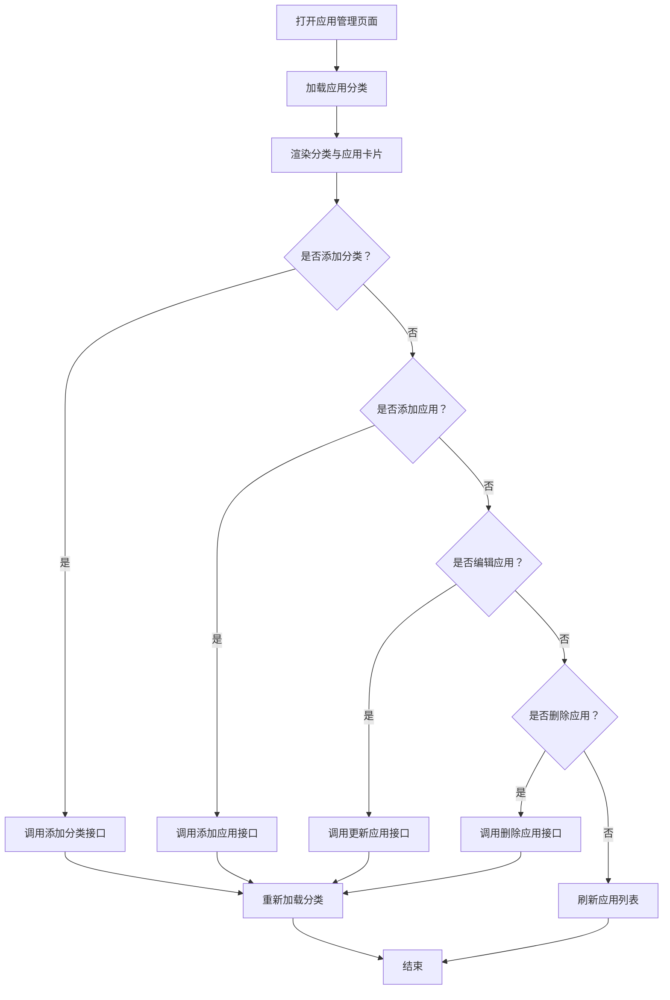
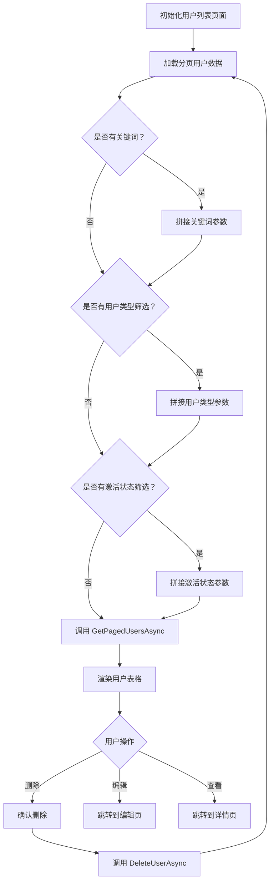
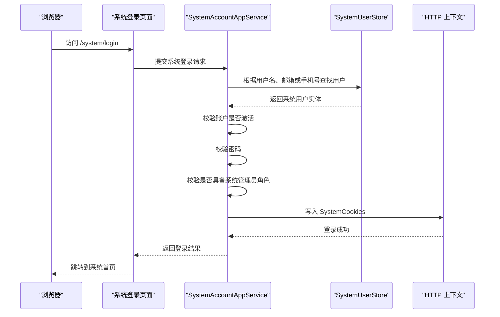
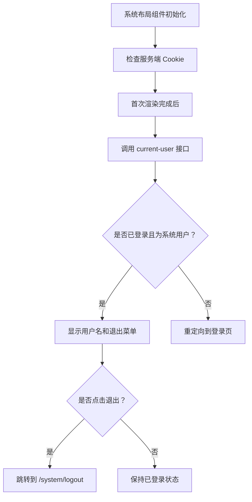
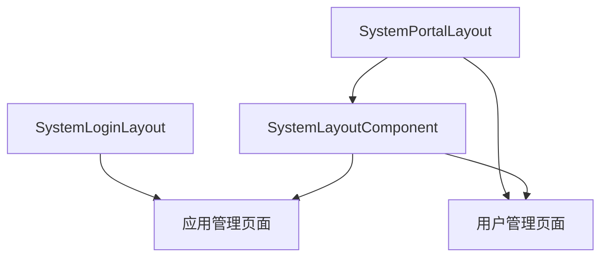
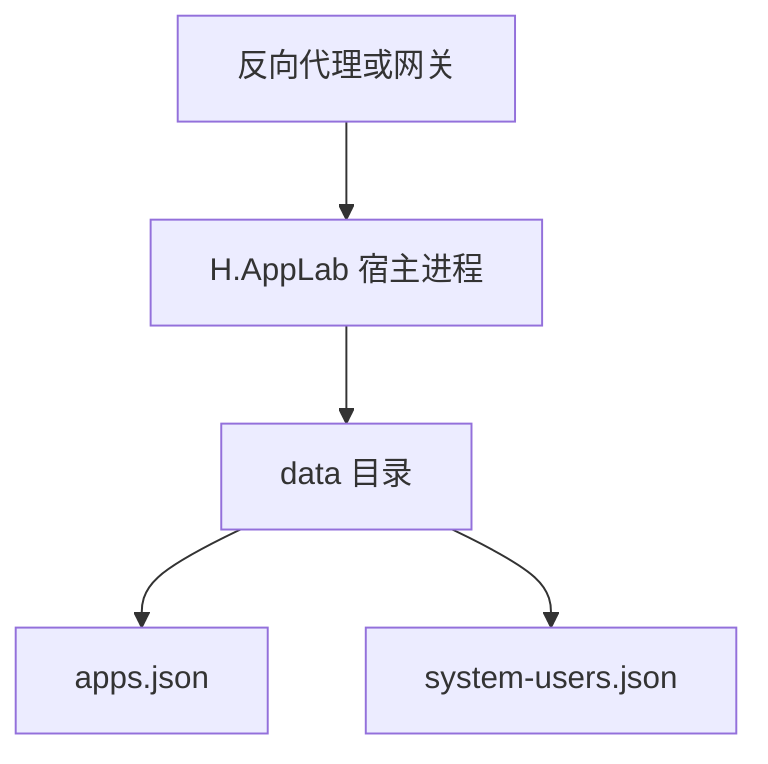

# 系统门户

<cite>
**本文引用的文件**   
- [应用管理页面](file://src/System/SystemPortal/H.SystemPortal.Web/Pages/AppManagement.razor)
- [用户列表页面](file://src/System/SystemPortal/H.SystemPortal.Web/Pages/User/UsersList.razor)
- [创建用户页面](file://src/System/SystemPortal/H.SystemPortal.Web/Pages/User/UsersCreate.razor)
- [编辑用户页面](file://src/System/SystemPortal/H.SystemPortal.Web/Pages/User/UsersEdit.razor)
- [系统登录页面](file://src/System/SystemPortal/H.SystemPortal.Web/Pages/SystemLogin.razor)
- [系统登录布局](file://src/System/SystemPortal/H.SystemPortal.Web/Layout/SystemLoginLayout.razor)
- [系统门户布局](file://src/System/SystemPortal/H.SystemPortal.Web/Layout/SystemPortalLayout.razor)
- [系统布局组件](file://src/System/SystemPortal/H.SystemPortal.Web/Components/SystemLayoutComponent.razor)
- [应用管理服务接口](file://src/System/SystemPortal/H.SystemPortal.Application.Contracts/Services/IAppManageAppService.cs)
- [用户管理服务接口](file://src/System/SystemPortal/H.SystemPortal.Application.Contracts/Services/IUserAppService.cs)
- [系统账户服务接口](file://src/System/SystemPortal/H.SystemPortal.Application.Contracts/Services/ISystemAccountAppService.cs)
- [用户数据模型与请求模型](file://src/System/SystemPortal/H.SystemPortal.Application.Contracts/Dtos/UserDto.cs)
- [应用管理服务实现](file://src/System/SystemPortal/H.SystemPortal.Application/Services/AppManageAppService.cs)
- [用户管理服务实现](file://src/System/SystemPortal/H.SystemPortal.Application/Services/UserAppService.cs)
- [系统账户服务实现](file://src/System/SystemPortal/H.SystemPortal.Application/Services/SystemAccountAppService.cs)
- [系统用户存储实现](file://src/System/SystemPortal/H.SystemPortal.Application/Services/SystemUserStore.cs)
- [应用目录配置文件](file://src/System/SystemPortal/data/apps.json)
</cite>

## 目录

1. [引言](#引言)
2. [项目结构](#项目结构)
3. [核心模块总览](#核心模块总览)
4. [系统架构](#系统架构)
5. [应用管理功能](#应用管理功能)
6. [用户管理功能](#用户管理功能)
7. [系统账户认证机制](#系统账户认证机制)
8. [前端界面设计](#前端界面设计)
9. [API 接口文档](#api-接口文档)
10. [部署配置指南](#部署配置指南)
11. [常见问题与故障排查](#常见问题与故障排查)
12. [结论](#结论)

## 引言

H.AppLab 的系统门户是面向平台管理员的统一入口，用于管理本平台的各类子应用、系统用户以及系统账户认证。它不是一个单一页面，而是由多个 Blazor 页面、布局组件、应用服务与 JSON 数据文件共同组成的完整子系统。

从职责划分来看，系统门户围绕三大核心模块展开：

| 模块 | 主要职责 | 关键文件 |
|---|---|---|
| 应用管理 | 维护应用分类、应用菜单、启用状态与应用跳转地址，并读写 `apps.json` | [应用管理页面](file://src/System/SystemPortal/H.SystemPortal.Web/Pages/AppManagement.razor)、[应用管理服务实现](file://src/System/SystemPortal/H.SystemPortal.Application/Services/AppManageAppService.cs)、[应用目录配置文件](file://src/System/SystemPortal/data/apps.json) |
| 用户管理 | 对系统用户进行增删改查、角色分配、状态控制、分页查询和密码重置 | [用户列表页面](file://src/System/SystemPortal/H.SystemPortal.Web/Pages/User/UsersList.razor)、[创建用户页面](file://src/System/SystemPortal/H.SystemPortal.Web/Pages/User/UsersCreate.razor)、[编辑用户页面](file://src/System/SystemPortal/H.SystemPortal.Web/Pages/User/UsersEdit.razor)、[用户管理服务实现](file://src/System/SystemPortal/H.SystemPortal.Application/Services/UserAppService.cs) |
| 系统账户认证 | 提供管理员登录、Cookie 认证、会话判断和登出能力 | [系统登录页面](file://src/System/SystemPortal/H.SystemPortal.Web/Pages/SystemLogin.razor)、[系统账户服务实现](file://src/System/SystemPortal/H.SystemPortal.Application/Services/SystemAccountAppService.cs)、[系统用户存储实现](file://src/System/SystemPortal/H.SystemPortal.Application/Services/SystemUserStore.cs) |

## 项目结构

系统门户的代码位于 `System/SystemPortal` 目录下，采用 ABP 风格的分层组织方式：Web 层负责页面与布局，Application.Contracts 层定义对外服务契约和数据模型，Application 层实现业务逻辑，data 目录存放持久化用的 JSON 文件。

**图表来源**   
- [系统门户布局](file://src/System/SystemPortal/H.SystemPortal.Web/Layout/SystemPortalLayout.razor)
- [应用管理服务接口](file://src/System/SystemPortal/H.SystemPortal.Application.Contracts/Services/IAppManageAppService.cs)
- [应用管理服务实现](file://src/System/SystemPortal/H.SystemPortal.Application/Services/AppManageAppService.cs)
- [应用目录配置文件](file://src/System/SystemPortal/data/apps.json)

Web 层包含以下关键页面：

| 页面或布局 | 路由 | 用途 |
|---|---|---|
| 系统登录页面 | `/system/login` | 管理员账号登录入口 |
| 系统门户布局 | 作为系统管理页面的统一布局 | 提供侧边栏菜单、顶部导航和用户下拉菜单 |
| 系统布局组件 | 内部复用组件 | 实现登录状态检测、菜单高亮、退出登录等通用行为 |
| 应用管理页面 | `/system/apps` | 维护应用分类和应用菜单 |
| 用户列表页面 | `/system/users` | 分页查询、搜索、删除系统用户 |
| 创建用户页面 | `/system/users/create` | 新增系统用户 |
| 编辑用户页面 | `/system/users/{Id:guid}/edit` | 修改用户信息、角色、状态并重置密码 |

**章节来源**   
- [系统门户布局](file://src/System/SystemPortal/H.SystemPortal.Web/Layout/SystemPortalLayout.razor)
- [系统布局组件](file://src/System/SystemPortal/H.SystemPortal.Web/Components/SystemLayoutComponent.razor)
- [系统登录布局](file://src/System/SystemPortal/H.SystemPortal.Web/Layout/SystemLoginLayout.razor)

## 核心模块总览

系统门户的三个核心模块通过 ABP 的 `IAppService` 体系暴露给前端调用。每个模块都有清晰的契约定义和业务实现：

**图表来源**   
- [应用管理服务接口](file://src/System/SystemPortal/H.SystemPortal.Application.Contracts/Services/IAppManageAppService.cs)
- [用户管理服务接口](file://src/System/SystemPortal/H.SystemPortal.Application.Contracts/Services/IUserAppService.cs)
- [系统账户服务接口](file://src/System/SystemPortal/H.SystemPortal.Application.Contracts/Services/ISystemAccountAppService.cs)
- [应用管理服务实现](file://src/System/SystemPortal/H.SystemPortal.Application/Services/AppManageAppService.cs)
- [用户管理服务实现](file://src/System/SystemPortal/H.SystemPortal.Application/Services/UserAppService.cs)
- [系统账户服务实现](file://src/System/SystemPortal/H.SystemPortal.Application/Services/SystemAccountAppService.cs)
- [系统用户存储实现](file://src/System/SystemPortal/H.SystemPortal.Application/Services/SystemUserStore.cs)

## 系统架构

系统门户的整体请求流程可以分为前端页面、应用服务、数据存储三个层次。前端通过依赖注入的服务接口发起请求；后端服务处理业务规则；数据最终落盘到 JSON 文件或 ASP.NET Core Cookie。

**图表来源**   
- [系统登录页面](file://src/System/SystemPortal/H.SystemPortal.Web/Pages/SystemLogin.razor)
- [系统账户服务实现](file://src/System/SystemPortal/H.SystemPortal.Application/Services/SystemAccountAppService.cs)
- [系统用户存储实现](file://src/System/SystemPortal/H.SystemPortal.Application/Services/SystemUserStore.cs)
- [应用管理服务实现](file://src/System/SystemPortal/H.SystemPortal.Application/Services/AppManageAppService.cs)

该架构具有以下特点：

- **分层清晰**：Web 层不直接操作 JSON 文件，也不直接操作 Cookie，而是通过应用服务完成。
- **契约先行**：服务接口集中在 `Application.Contracts`，便于前端代理生成和单元测试。
- **无数据库依赖**：系统门户使用 JSON 文件存储应用配置和系统用户，适合轻量部署和小规模平台。
- **安全边界明确**：只有拥有超级管理员或管理员角色的用户才能进入系统门户。

**章节来源**   
- [系统账户服务实现](file://src/System/SystemPortal/H.SystemPortal.Application/Services/SystemAccountAppService.cs)
- [系统用户存储实现](file://src/System/SystemPortal/H.SystemPortal.Application/Services/SystemUserStore.cs)
- [应用管理服务实现](file://src/System/SystemPortal/H.SystemPortal.Application/Services/AppManageAppService.cs)

## 应用管理功能

### 功能目标

应用管理用于维护 H.AppLab 平台中所有可访问的子应用。其核心目标是让管理员能够：

1. 查看按分类组织的应用列表。
2. 添加、编辑、删除应用。
3. 添加、删除应用分类。
4. 控制应用的启用状态、排序、图标、跳转地址和目标窗口。
5. 将变更持久化到 `apps.json`。

### 数据模型

应用数据以 JSON 形式存储在 `data/apps.json` 中，根结构包含多个分类，每个分类下包含若干应用条目。典型字段包括：

| 字段 | 含义 |
|---|---|
| `appCategories` | 应用分类数组 |
| `categoryName` | 分类名称 |
| `apps` | 分类下的应用列表 |
| `id` | 应用唯一标识 |
| `name` | 应用显示名称 |
| `icon` | Emoji 图标 |
| `iconUrl` | 外部图标地址 |
| `url` | 应用跳转地址 |
| `target` | 打开方式，例如 `_self` 或 `_blank` |
| `enabled` | 是否启用 |
| `order` | 排序号 |

**章节来源**   
- [应用目录配置文件](file://src/System/SystemPortal/data/apps.json)

### 应用管理页面

`/system/apps` 页面是一个完整的单页应用管理界面。它提供：

- 应用分类展示。
- 每个分类下的应用卡片网格。
- 添加应用模态框。
- 添加分类模态框。
- 编辑和删除应用操作。
- 刷新分类与应用列表。

页面通过依赖注入获取 `IAppManageAppService`，并调用其后端接口。前端还使用 `H.Util.Blazor.HToastService` 向用户反馈保存成功或失败消息。

**图表来源**   
- [应用管理页面](file://src/System/SystemPortal/H.SystemPortal.Web/Pages/AppManagement.razor)
- [应用管理服务接口](file://src/System/SystemPortal/H.SystemPortal.Application.Contracts/Services/IAppManageAppService.cs)

### 应用服务实现

`AppManageAppService` 负责定位并读写 `apps.json`。它的文件查找逻辑会优先尝试运行目录和输出目录中的 `data/apps.json`，如果找不到，则向上递归查找仓库路径中的 `System/SystemPortal/data/apps.json`。这样可以兼容开发环境和发布环境。

应用管理的后端流程如下：

| 操作 | 后端逻辑 |
|---|---|
| 获取分类 | 加载 JSON，返回分类数组 |
| 添加应用 | 检查分类是否存在，若不存在则创建分类；检查应用 ID 是否重复；追加应用并保存 |
| 更新应用 | 按应用 ID 查找并替换应用 |
| 删除应用 | 按应用 ID 查找并移除应用 |
| 添加分类 | 检查分类是否已存在，不存在则创建空分类 |
| 删除分类 | 通常应校验分类下是否还有应用，避免误删 |

需要注意：当前 `AppManageAppService` 的公开接口中没有“启用/禁用单个应用”的方法，但前端页面在 UI 上展示了启用状态。如果实际启用状态需要持久化，应在服务层补充对应方法，并在保存时同步到 JSON。

**章节来源**   
- [应用管理页面](file://src/System/SystemPortal/H.SystemPortal.Web/Pages/AppManagement.razor)
- [应用管理服务接口](file://src/System/SystemPortal/H.SystemPortal.Application.Contracts/Services/IAppManageAppService.cs)
- [应用管理服务实现](file://src/System/SystemPortal/H.SystemPortal.Application/Services/AppManageAppService.cs)
- [应用目录配置文件](file://src/System/SystemPortal/data/apps.json)

## 用户管理功能

### 功能目标

用户管理用于维护系统门户内的系统用户。支持的功能包括：

- 分页查询用户。
- 按用户名、邮箱、手机号关键词搜索。
- 按用户类型筛选：普通用户、管理员、超级管理员。
- 按激活状态筛选。
- 创建用户。
- 编辑用户信息。
- 分配角色。
- 控制账户激活状态。
- 重置用户密码。
- 删除用户。

### 数据模型

用户相关的数据模型集中在 `Dtos/UserDto.cs`，主要包括：

| 模型 | 用途 |
|---|---|
| `UserDto` | 用户基础信息，包含用户名、邮箱、手机号、角色、状态、创建时间、最后登录时间等 |
| `UserListDto` | 用户列表扩展信息，如创建者名称 |
| `CreateUserDto` | 创建用户请求体 |
| `UpdateUserDto` | 更新用户请求体 |
| `UpdateUserStatusDto` | 更新用户状态请求体 |
| `ResetPasswordDto` | 重置密码请求体 |
| `UserQueryParams` | 分页与筛选参数 |
| `PagedResult<T>` | 分页结果封装 |
| `ExternalAccountDto` | 第三方绑定账户信息 |
| `AuthResponseDto` | 登录响应体 |

**章节来源**   
- [用户数据模型与请求模型](file://src/System/SystemPortal/H.SystemPortal.Application.Contracts/Dtos/UserDto.cs)

### 用户列表页面

`/system/users` 页面是用户管理的主入口。它使用 `IUserAppService.GetPagedUsersAsync` 获取分页数据，并通过前端表格展示用户名、邮箱、手机号、第三方账号、用户类型、状态、最后登录时间和操作按钮。

关键交互包括：

- 输入关键词后回车触发搜索。
- 选择用户类型和状态后点击搜索。
- 点击上一页、下一页切换分页。
- 点击删除前弹出确认框。
- 点击查看跳转到用户详情页。
- 点击编辑跳转到编辑页。

**图表来源**   
- [用户列表页面](file://src/System/SystemPortal/H.SystemPortal.Web/Pages/User/UsersList.razor)
- [用户管理服务接口](file://src/System/SystemPortal/H.SystemPortal.Application.Contracts/Services/IUserAppService.cs)

### 创建用户页面

`/system/users/create` 页面使用表单收集用户名、邮箱、密码、确认密码、手机号、用户类型、角色、激活状态和备注。提交时将逗号分隔的角色文本拆分为字符串列表，再调用 `CreateUserAsync`。

前端会捕获 `ArgumentException` 并将错误信息显示在表单下方，同时防止重复提交。

### 编辑用户页面

`/system/users/{Id:guid}/edit` 页面先通过 `GetUserDtoByIdAsync` 加载用户详情，再填充更新表单。支持：

- 修改用户名、邮箱、手机号。
- 修改用户类型。
- 修改角色（逗号分隔）。
- 切换账户激活状态。
- 切换邮箱和手机号验证状态。
- 重置密码。
- 保存修改。

重置密码通过独立弹窗完成，成功后显示 Toast 提示。

**章节来源**   
- [创建用户页面](file://src/System/SystemPortal/H.SystemPortal.Web/Pages/User/UsersCreate.razor)
- [编辑用户页面](file://src/System/SystemPortal/H.SystemPortal.Web/Pages/User/UsersEdit.razor)

### 用户管理服务实现

`UserAppService` 基于 `SystemUserStore` 实现对系统用户的内存式 CRUD。它负责：

- 将 DTO 映射为 `SystemUserEntity`。
- 校验用户名和邮箱是否重复。
- 校验两次密码是否一致。
- 对用户状态进行更新。
- 重置用户密码。
- 删除用户。
- 分页查询用户。
- 更新最后登录时间。

分页查询会在内存中对用户集合进行关键词模糊匹配、用户类型过滤和激活状态过滤，然后取指定页码的数据。

需要注意：当前实现没有显式实现分页切片逻辑，而是返回整个过滤后的集合；真正的分页切片需要在后续版本中完善，否则大数据量时可能影响性能。

**章节来源**   
- [用户管理服务实现](file://src/System/SystemPortal/H.SystemPortal.Application/Services/UserAppService.cs)
- [用户管理服务接口](file://src/System/SystemPortal/H.SystemPortal.Application.Contracts/Services/IUserAppService.cs)

## 系统账户认证机制

### 认证目标

系统账户认证用于保护系统门户的管理功能。它不是普通业务系统的用户注册登录流程，而是专门面向平台管理员的安全通道。认证目标包括：

1. 仅允许系统管理员登录。
2. 支持用户名、邮箱、手机号三种登录账号形式。
3. 使用 ASP.NET Core Cookie 维持登录状态。
4. 提供当前用户信息查询接口。
5. 提供系统登出接口。
6. 前端在未登录时自动重定向到登录页。

### 登录流程

**图表来源**   
- [系统登录页面](file://src/System/SystemPortal/H.SystemPortal.Web/Pages/SystemLogin.razor)
- [系统账户服务实现](file://src/System/SystemPortal/H.SystemPortal.Application/Services/SystemAccountAppService.cs)
- [系统用户存储实现](file://src/System/SystemPortal/H.SystemPortal.Application/Services/SystemUserStore.cs)

### 登录参数与响应

前端登录页面提交的是 `/api/app/system-account/system-login`，请求体包含：

| 字段 | 类型 | 说明 |
|---|---|---|
| `account` | 字符串 | 用户名、邮箱或手机号 |
| `password` | 字符串 | 密码 |
| `rememberMe` | 布尔值 | 是否记住登录状态 |

服务端返回 `BaseOutput<AuthResponseDto>`，其中 `AuthResponseDto` 包含：

| 字段 | 类型 | 说明 |
|---|---|---|
| `success` | 布尔值 | 登录是否成功 |
| `message` | 字符串 | 登录提示信息 |
| `user` | `UserDto` | 登录用户信息 |

### Cookie 认证与会话管理

`SystemAccountAppService` 使用名为 `SystemCookies` 的认证方案。登录成功后，服务端会构造 `ClaimsIdentity`，并写入 Cookie。记住我选项会影响过期时间：默认 24 小时，开启记住我时为 7 天。

`GetCurrentUserAsync` 会根据 Cookie 解析当前用户，并再次校验用户是否激活、是否具备系统管理员角色。未登录或无权限时返回空用户。

### 前端登录状态检测

`SystemLayoutComponent` 是系统门户布局的核心组件。它在前端执行两步登录状态检测：

1. 在服务端预渲染阶段，检查是否存在 `.AspNetCore.SystemCookies`。
2. 在客户端 WASM 阶段，调用 `/api/app/system-account/current-user` 精确验证登录状态。

如果检测到未登录，会将当前 URL 作为 `returnUrl` 参数重定向到 `/system/login`。登录后，组件还会显示用户名和退出登录菜单。

**图表来源**   
- [系统布局组件](file://src/System/SystemPortal/H.SystemPortal.Web/Components/SystemLayoutComponent.razor)
- [系统账户服务实现](file://src/System/SystemPortal/H.SystemPortal.Application/Services/SystemAccountAppService.cs)

**章节来源**   
- [系统登录页面](file://src/System/SystemPortal/H.SystemPortal.Web/Pages/SystemLogin.razor)
- [系统账户服务实现](file://src/System/SystemPortal/H.SystemPortal.Application/Services/SystemAccountAppService.cs)
- [系统布局组件](file://src/System/SystemPortal/H.SystemPortal.Web/Components/SystemLayoutComponent.razor)
- [用户数据模型与请求模型](file://src/System/SystemPortal/H.SystemPortal.Application.Contracts/Dtos/UserDto.cs)

## 前端界面设计

### 布局体系

系统门户的前端布局分为两层：

| 层级 | 组件 | 职责 |
|---|---|---|
| 页面级布局 | `SystemPortalLayout.razor` | 定义系统管理页面的主布局，提供侧边栏菜单项 |
| 通用布局组件 | `SystemLayoutComponent.razor` | 实现顶部导航、侧边栏、内容区、登录状态和退出登录 |
| 登录布局 | `SystemLoginLayout.razor` | 提供深色渐变背景、居中标题卡片和登录表单样式 |

`SystemPortalLayout` 固定了四个顶层菜单：首页、用户管理、企业管理、应用管理。这些菜单通过 `AppMenuItem` 模型描述，包含名称、URL 和图标。

### 登录页面设计

登录页面采用简洁的卡片式设计：

- 深色渐变背景。
- 白色圆角卡片。
- 标题和副标题居中。
- 账号和密码输入框。
- 登录按钮禁用状态。
- 成功和错误提示区域。

样式方面使用了渐变色主按钮、圆角输入框、聚焦阴影和响应式间距。

### 用户管理界面设计

用户管理页面使用统一的组件库风格：

- `HCard` 作为内容容器。
- `HTable` 展示表格数据。
- `HModal` 用于重置密码弹窗。
- `HToastService` 显示操作结果。
- 自定义开关控件用于激活状态。
- 标签组件用于用户类型和状态展示。

### 应用管理界面设计

应用管理页面采用更丰富的视觉结构：

- 分类区块卡片。
- 应用卡片网格。
- 启用与禁用状态的视觉差异。
- 添加应用和添加分类模态框。
- 工具栏按钮组。
- 应用图标支持 Emoji 和外部图片 URL。

**图表来源**   
- [系统门户布局](file://src/System/SystemPortal/H.SystemPortal.Web/Layout/SystemPortalLayout.razor)
- [系统布局组件](file://src/System/SystemPortal/H.SystemPortal.Web/Components/SystemLayoutComponent.razor)
- [系统登录布局](file://src/System/SystemPortal/H.SystemPortal.Web/Layout/SystemLoginLayout.razor)
- [应用管理页面](file://src/System/SystemPortal/H.SystemPortal.Web/Pages/AppManagement.razor)
- [用户列表页面](file://src/System/SystemPortal/H.SystemPortal.Web/Pages/User/UsersList.razor)

**章节来源**   
- [系统门户布局](file://src/System/SystemPortal/H.SystemPortal.Web/Layout/SystemPortalLayout.razor)
- [系统布局组件](file://src/System/SystemPortal/H.SystemPortal.Web/Components/SystemLayoutComponent.razor)
- [系统登录布局](file://src/System/SystemPortal/H.SystemPortal.Web/Layout/SystemLoginLayout.razor)
- [应用管理页面](file://src/System/SystemPortal/H.SystemPortal.Web/Pages/AppManagement.razor)
- [用户列表页面](file://src/System/SystemPortal/H.SystemPortal.Web/Pages/User/UsersList.razor)
- [创建用户页面](file://src/System/SystemPortal/H.SystemPortal.Web/Pages/User/UsersCreate.razor)
- [编辑用户页面](file://src/System/SystemPortal/H.SystemPortal.Web/Pages/User/UsersEdit.razor)

## API 接口文档

本节整理系统门户涉及的后端服务接口。所有接口都继承自 ABP 的 `IAppService`，并以 `BaseOutput<T>` 作为统一返回值包装。

### 应用管理接口

| 接口方法 | 参数 | 返回值 | 说明 |
|---|---|---|---|
| `GetAllCategoriesAsync` | 无 | `BaseOutput<AppCategoryInfo[]>` | 获取所有应用分类 |
| `AddAppAsync` | 分类名称、应用信息 | `BaseOutput<bool>` | 添加应用 |
| `UpdateAppAsync` | 应用 ID、更新后的应用信息 | `BaseOutput<bool>` | 更新应用 |
| `DeleteAppAsync` | 应用 ID | `BaseOutput<bool>` | 删除应用 |
| `AddCategoryAsync` | 分类名称 | `BaseOutput<bool>` | 添加分类 |
| `DeleteCategoryAsync` | 分类名称 | `BaseOutput<bool>` | 删除分类 |

**章节来源**   
- [应用管理服务接口](file://src/System/SystemPortal/H.SystemPortal.Application.Contracts/Services/IAppManageAppService.cs)

### 用户管理接口

| 接口方法 | 参数 | 返回值 | 说明 |
|---|---|---|---|
| `GetUserByUserNameAsync` | 用户名 | `BaseOutput<UserDto?>` | 根据用户名获取用户 |
| `GetUserByEmailAsync` | 邮箱 | `BaseOutput<UserDto?>` | 根据邮箱获取用户 |
| `GetUserByIdAsync` | 用户 ID | `BaseOutput<UserDto?>` | 根据 ID 获取用户 |
| `GetUserDtoByIdAsync` | 用户 ID | `BaseOutput<UserDto>` | 获取用户 DTO |
| `CreateUserAsync` | 用户 DTO 或创建请求 DTO | `BaseOutput<UserDto>` | 创建用户 |
| `UpdateUserAsync` | 用户 ID、更新请求 DTO | `BaseOutput<bool>` | 更新用户 |
| `UpdateUserStatusAsync` | 用户 ID、状态更新 DTO | `BaseOutput` | 更新用户激活状态 |
| `ResetPasswordAsync` | 用户 ID、重置密码 DTO | `BaseOutput` | 重置用户密码 |
| `DeleteUserAsync` | 用户 ID | `BaseOutput` | 删除用户 |
| `GetPagedUsersAsync` | 分页查询参数 | `BaseOutput<PagedResult<UserDto>>` | 分页查询用户 |
| `AssignRolesToUserAsync` | 用户 ID、角色名列表 | `BaseOutput` | 为用户分配角色 |
| `GetUserRoleNamesAsync` | 用户 ID | `BaseOutput<List<string>>` | 获取用户角色名 |

**章节来源**   
- [用户管理服务接口](file://src/System/SystemPortal/H.SystemPortal.Application.Contracts/Services/IUserAppService.cs)

### 系统账户接口

| 接口方法 | 参数 | 返回值 | 说明 |
|---|---|---|---|
| `SystemLoginAsync` | `LoginRequestDto` | `BaseOutput<AuthResponseDto>` | 系统管理员登录 |
| `GetCurrentUserAsync` | 无 | `BaseOutput<UserDto?>` | 获取当前登录的系统用户 |
| `SystemLogoutAsync` | 无 | `BaseOutput` | 系统登出 |

**章节来源**   
- [系统账户服务接口](file://src/System/SystemPortal/H.SystemPortal.Application.Contracts/Services/ISystemAccountAppService.cs)

### 公共数据模型

#### 用户数据模型

| 字段 | 类型 | 说明 |
|---|---|---|
| `Id` | Guid | 用户 ID |
| `UserName` | 字符串 | 用户名 |
| `Email` | 字符串 | 邮箱 |
| `PhoneNumber` | 字符串 | 手机号 |
| `UserType` | 枚举 | 用户类型 |
| `RoleNames` | 字符串列表 | 角色名列表 |
| `LoginMode` | 可空字符串 | 登录模式 |
| `IsActive` | 布尔值 | 是否激活 |
| `EmailConfirmed` | 布尔值 | 邮箱是否已验证 |
| `PhoneNumberConfirmed` | 布尔值 | 手机号是否已验证 |
| `CreatedAt` | DateTime | 创建时间 |
| `UpdatedAt` | 可空 DateTime | 更新时间 |
| `LastLoginAt` | 可空 DateTime | 最后登录时间 |
| `Remark` | 可空字符串 | 备注 |

#### 分页查询参数

| 字段 | 类型 | 说明 |
|---|---|---|
| `Keyword` | 可空字符串 | 用户名、邮箱或手机号关键词 |
| `UserType` | 可空枚举 | 用户类型筛选 |
| `IsActive` | 可空布尔值 | 激活状态筛选 |
| `PageIndex` | 整数 | 页码，默认 1 |
| `PageSize` | 整数 | 每页数量，默认 10 |

**章节来源**   
- [用户数据模型与请求模型](file://src/System/SystemPortal/H.SystemPortal.Application.Contracts/Dtos/UserDto.cs)

## 部署配置指南

### 数据文件位置

系统门户依赖两个 JSON 文件：

| 文件 | 用途 | 部署建议 |
|---|---|---|
| `apps.json` | 应用分类与应用菜单 | 放置在宿主程序运行目录的 `data/apps.json`，或仓库路径中的 `System/SystemPortal/data/apps.json` |
| `system-users.json` | 系统用户数据 | 发布模式下位于 `data/system-users.json`；调试模式下位于仓库相对路径 |

`AppManageAppService` 会自动探测 `apps.json` 的位置，因此一般不需要额外配置。但 `SystemUserStore` 的文件路径在当前实现中偏向静态路径，生产环境应确保 `data/system-users.json` 存在于宿主程序运行目录。

### 权限要求

系统门户只允许具备以下角色的用户登录：

- 超级管理员。
- 管理员。

普通用户即使能访问系统门户页面，也会被 `SystemAccountAppService` 拒绝登录或被拦截重定向到登录页。

### 部署注意事项

1. **文件可写性**：应用管理和用户管理都会写入 JSON 文件，部署目录必须对运行账户可写。
2. **并发安全**：当前实现没有强一致的并发锁，高并发写入 JSON 可能存在竞争条件。
3. **数据备份**：由于数据保存在 JSON 文件中，部署时应定期备份 `data/apps.json` 和 `data/system-users.json`。
4. **安全策略**：系统门户应放在受保护的域名或反向代理之后，避免未授权访问。
5. **HTTPS**：登录过程中会设置 Cookie，生产环境建议使用 HTTPS。
6. **环境变量**：如果需要更换 Cookie 名称、认证方案或文件路径，应通过依赖注入或配置扩展点改造现有服务。

### 推荐部署结构

**图表来源**   
- [应用管理服务实现](file://src/System/SystemPortal/H.SystemPortal.Application/Services/AppManageAppService.cs)
- [系统用户存储实现](file://src/System/SystemPortal/H.SystemPortal.Application/Services/SystemUserStore.cs)

**章节来源**   
- [应用管理服务实现](file://src/System/SystemPortal/H.SystemPortal.Application/Services/AppManageAppService.cs)
- [系统用户存储实现](file://src/System/SystemPortal/H.SystemPortal.Application/Services/SystemUserStore.cs)

## 常见问题与故障排查

### 问题一：应用管理无法加载应用分类

**可能原因：**

- `apps.json` 不存在。
- `apps.json` 文件格式不正确。
- 宿主程序启动目录与期望目录不一致。
- 运行账户没有读取文件的权限。

**排查步骤：**

1. 确认 `data/apps.json` 是否存在。
2. 检查 JSON 语法是否正确。
3. 查看 `AppManageAppService.FindAppsJsonFile` 的实际查找路径。
4. 检查文件系统权限。

**章节来源**   
- [应用管理服务实现](file://src/System/SystemPortal/H.SystemPortal.Application/Services/AppManageAppService.cs)
- [应用目录配置文件](file://src/System/SystemPortal/data/apps.json)

### 问题二：系统登录提示无权限访问

**可能原因：**

- 用户没有超级管理员或管理员角色。
- 用户处于禁用状态。
- 密码错误。
- 账号格式识别错误。

**排查步骤：**

1. 检查用户是否被禁用。
2. 检查用户角色是否包含系统管理员角色。
3. 检查密码是否正确。
4. 检查账号是否为有效邮箱或手机号。

**章节来源**   
- [系统账户服务实现](file://src/System/SystemPortal/H.SystemPortal.Application/Services/SystemAccountAppService.cs)

### 问题三：登录后前端仍然跳转回登录页

**可能原因：**

- Cookie 未被正确写入或携带。
- `current-user` 接口返回未登录。
- 用户不具备系统管理员角色。
- 前端 WASM 环境与后端 Cookie 不同源。

**排查步骤：**

1. 检查浏览器网络请求是否包含 Cookie。
2. 调用 `/api/app/system-account/current-user` 查看返回结果。
3. 检查用户角色。
4. 检查跨域和 Cookie 安全属性。

**章节来源**   
- [系统布局组件](file://src/System/SystemPortal/H.SystemPortal.Web/Components/SystemLayoutComponent.razor)
- [系统账户服务实现](file://src/System/SystemPortal/H.SystemPortal.Application/Services/SystemAccountAppService.cs)

### 问题四：用户创建失败

**可能原因：**

- 用户名已存在。
- 邮箱已存在。
- 两次密码不一致。
- 前端传递的角色列表为空或格式异常。

**排查步骤：**

1. 检查用户名是否重复。
2. 检查邮箱是否重复。
3. 检查前端表单校验。
4. 检查角色文本是否正确拆分。

**章节来源**   
- [用户管理服务实现](file://src/System/SystemPortal/H.SystemPortal.Application/Services/UserAppService.cs)
- [创建用户页面](file://src/System/SystemPortal/H.SystemPortal.Web/Pages/User/UsersCreate.razor)

### 问题五：密码重置失败

**可能原因：**

- 两次密码不一致。
- 用户不存在。
- 前端弹窗数据未正确绑定。

**排查步骤：**

1. 检查重置密码表单校验。
2. 检查用户 ID 是否正确。
3. 检查后端异常信息。

**章节来源**   
- [编辑用户页面](file://src/System/SystemPortal/H.SystemPortal.Web/Pages/User/UsersEdit.razor)
- [用户管理服务实现](file://src/System/SystemPortal/H.SystemPortal.Application/Services/UserAppService.cs)

### 问题六：系统用户数据丢失或损坏

**可能原因：**

- 手动编辑 `system-users.json` 导致格式错误。
- 并发写入导致文件损坏。
- 部署目录不可写导致写入失败。

**排查步骤：**

1. 恢复备份文件。
2. 检查 JSON 格式。
3. 限制多实例并发写入。
4. 考虑迁移到数据库。

**章节来源**   
- [系统用户存储实现](file://src/System/SystemPortal/H.SystemPortal.Application/Services/SystemUserStore.cs)

## 结论

H.AppLab 的系统门户是一个结构清晰、职责明确的平台管理入口。它通过 Blazor 页面提供直观的管理界面，通过 ABP 应用服务暴露统一的 API，并通过 JSON 文件实现轻量数据持久化。

系统门户的优势在于：

- 部署简单，无需关系型数据库即可运行。
- 模块边界清晰，应用管理、用户管理和系统账户认证相互独立。
- 前端布局复用性好，登录状态检测和菜单导航逻辑集中在布局组件中。
- 向后扩展方便，可以通过新增应用分类和应用条目快速接入新业务。

同时，当前实现也存在一些可改进空间：

- 用户分页查询尚未做真正的数据切片，大规模用户场景需要优化。
- JSON 文件并发写入缺乏强一致性保护。
- 应用启用状态的前端展示与服务端持久化接口需要进一步对齐。
- 生产环境建议逐步将 JSON 存储迁移到数据库，以获得更好的事务性、索引能力和备份策略。

对于运维人员，最重要的是保障 `data` 目录的可写性和数据安全；对于开发者，建议优先完善用户分页、应用启用状态同步和文件写入并发保护，再在此基础上扩展更多系统管理能力。