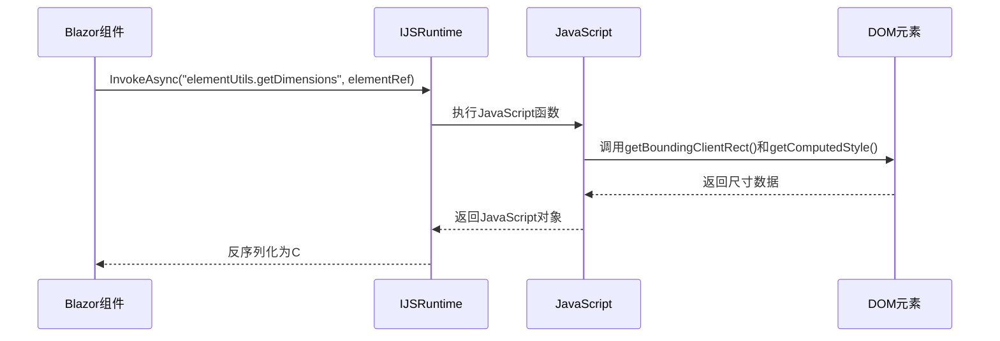
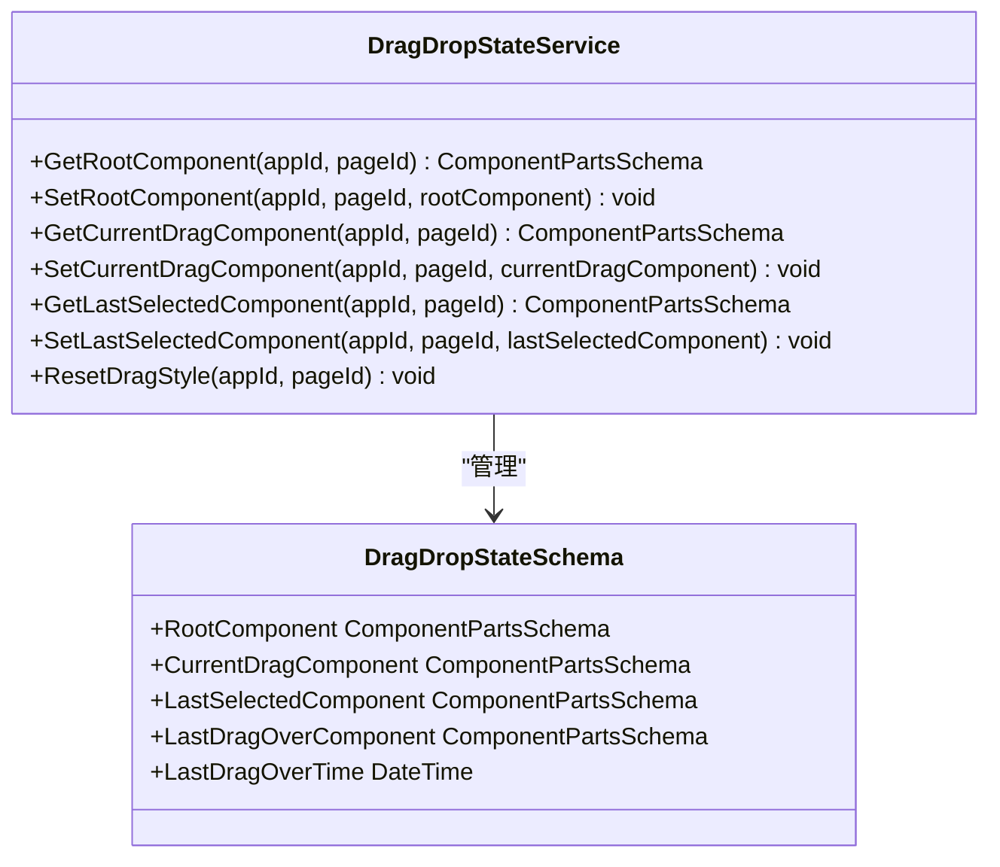

# DOM操作工具函数

<cite>
**本文档引用的文件**  
- [elementUtils.js](file://src/DesignEngine/H.LowCode.DesignEngineBase/wwwroot/js/elementUtils.js)
- [DraggableItem.razor](file://src/DesignEngine/H.LowCode.DesignEngineBase/DraggableComponents/DraggableItem.razor)
- [DragDropElementDimensions.cs](file://src/DesignEngine/H.LowCode.DesignEngineBase/Dtos/DragDropElementDimensions.cs)
- [DragDropStateService.cs](file://src/DesignEngine/H.LowCode.DesignEngineBase/Services/DragDropStateService.cs)
- [DragDropStateSchema.cs](file://src/DesignEngine/H.LowCode.DesignEngineBase/Services/DragDropStateService.cs#L203-L237)
</cite>

## 目录
1. [简介](#简介)
2. [核心功能概述](#核心功能概述)
3. [elementUtils.js 详细分析](#elementutilsjs-详细分析)
4. [与Blazor的互操作实现](#与blazor的互操作实现)
5. [拖拽状态管理机制](#拖拽状态管理机制)
6. [性能优化策略](#性能优化策略)
7. [使用场景与示例](#使用场景与示例)
8. [结论](#结论)

## 简介
本文件详细文档化了 `elementUtils.js` 中提供的JavaScript工具函数，重点分析其在Blazor低代码设计引擎中的作用。这些工具函数解决了Blazor在精确DOM测量方面的局限性，特别是在实现组件拖拽、布局计算和视觉反馈等交互功能时的关键作用。通过JavaScript互操作（JS Interop），前端能够高效获取元素尺寸、应用变换动画并优化拖拽性能。

## 核心功能概述
`elementUtils.js` 是一个轻量级的JavaScript工具库，专为增强Blazor应用中的DOM操作能力而设计。它主要提供以下核心功能：
- **精确DOM测量**：获取元素的精确尺寸、边距和容器信息
- **高性能变换操作**：通过`transform`属性实现流畅的视觉动画
- **性能优化工具**：提供节流函数以优化高频事件处理
- **浏览器特性检测**：检测对3D变换的支持情况

这些功能共同支撑了低代码平台中复杂的拖拽交互和实时布局预览。

## elementUtils.js 详细分析

### getDimensions 方法
该方法用于获取元素的完整尺寸信息，包括考虑margin的实际尺寸。

**参数**  
- `element`: 要测量的DOM元素

**返回值**  
返回一个包含以下属性的对象：
- `width`: 元素的CSS宽度（不包括margin）
- `height`: 元素的CSS高度（不包括margin）
- `actualWidth`: 实际占用宽度（包括左右margin）
- `actualHeight`: 实际占用高度（包括上下margin）
- `containerWidth`: 父容器的宽度
- `margin`: 包含四个方向margin值的对象
- `offsetTop`: 元素相对于视口顶部的距离
- `offsetLeft`: 元素相对于视口左侧的距离

```javascript
getDimensions: function (element) {
    if (!element) return null;
    
    const rect = element.getBoundingClientRect();
    const computedStyle = window.getComputedStyle(element);
    const containerWidth = element.parentElement ? element.parentElement.getBoundingClientRect().width : 0;
    
    const margin = {
        top: parseFloat(computedStyle.marginTop),
        right: parseFloat(computedStyle.marginRight),
        bottom: parseFloat(computedStyle.marginBottom),
        left: parseFloat(computedStyle.marginLeft)
    };
    
    return {
        width: rect.width,
        height: rect.height,
        actualWidth: rect.width + margin.left + margin.right,
        actualHeight: rect.height + margin.top + margin.bottom,
        containerWidth: containerWidth,
        margin: margin,
        offsetTop: rect.top,
        offsetLeft: rect.left
    };
}
```

**实现细节**  
1. 使用 `getBoundingClientRect()` 获取元素在视口中的位置和尺寸
2. 通过 `getComputedStyle()` 获取计算后的样式，确保获取的是最终渲染值
3. 计算包含margin的实际尺寸，这对于布局对齐和碰撞检测至关重要
4. 同时获取父容器宽度，用于计算相对位置和布局约束

**Section sources**
- [elementUtils.js](file://src/DesignEngine/H.LowCode.DesignEngineBase/wwwroot/js/elementUtils.js#L2-L34)

### getContainerInfo 方法
获取父容器的尺寸和内边距信息。

```javascript
getContainerInfo: function (element) {
    if (!element || !element.parentElement) return null;
    
    const container = element.parentElement;
    const containerRect = container.getBoundingClientRect();
    const computedStyle = window.getComputedStyle(container);
    
    return {
        width: containerRect.width,
        height: containerRect.height,
        padding: {
            top: parseFloat(computedStyle.paddingTop),
            right: parseFloat(computedStyle.paddingRight),
            bottom: parseFloat(computedStyle.paddingBottom),
            left: parseFloat(computedStyle.paddingLeft)
        }
    };
}
```

**Section sources**
- [elementUtils.js](file://src/DesignEngine/H.LowCode.DesignEngineBase/wwwroot/js/elementUtils.js#L36-L53)

### setTransform 与 clearTransform 方法
用于高效地设置和清除元素的变换属性。

```javascript
setTransform: function (element, transform) {
    if (!element) return;
    element.style.transform = transform;
    element.style.willChange = 'transform';
},

clearTransform: function (element) {
    if (!element) return;
    element.style.transform = '';
    element.style.willChange = 'auto';
}
```

**性能优化**：通过设置 `willChange: 'transform'`，提示浏览器提前优化该元素的变换性能，通常会触发GPU加速。

**Section sources**
- [elementUtils.js](file://src/DesignEngine/H.LowCode.DesignEngineBase/wwwroot/js/elementUtils.js#L55-L68)

### throttle 方法
节流函数，用于限制高频事件的执行频率。

```javascript
throttle: function (func, limit) {
    let inThrottle;
    return function() {
        const args = arguments;
        const context = this;
        if (!inThrottle) {
            func.apply(context, args);
            inThrottle = true;
            setTimeout(() => inThrottle = false, limit);
        }
    }
}
```

**应用场景**：在拖拽过程中，`onDragOver` 事件会高频触发，使用节流可以避免性能瓶颈。

**Section sources**
- [elementUtils.js](file://src/DesignEngine/H.LowCode.DesignEngineBase/wwwroot/js/elementUtils.js#L70-L83)

## 与Blazor的互操作实现

### JS Interop 调用流程
Blazor组件通过 `IJSRuntime` 调用JavaScript函数，实现DOM操作。



**Diagram sources**
- [DraggableItem.razor](file://src/DesignEngine/H.LowCode.DesignEngineBase/DraggableComponents/DraggableItem.razor#L100-L108)
- [elementUtils.js](file://src/DesignEngine/H.LowCode.DesignEngineBase/wwwroot/js/elementUtils.js#L2-L34)

### C# 数据结构映射
JavaScript返回的尺寸数据被映射到C#的DTO对象。

```csharp
internal class DragDropElementDimensions
{
    public double Width { get; set; }
    public double Height { get; set; }
    public double ActualWidth { get; set; }
    public double ActualHeight { get; set; }
    public double ContainerWidth { get; set; }
    public DragDropElementMargin Margin { get; set; }
    public double OffsetTop { get; set; }
    public double OffsetLeft { get; set; }
}

internal class DragDropElementMargin
{
    public double Top { get; set; }
    public double Right { get; set; }
    public double Bottom { get; set; }
    public double Left { get; set; }
}
```

**Section sources**
- [DragDropElementDimensions.cs](file://src/DesignEngine/H.LowCode.DesignEngineBase/Dtos/DragDropElementDimensions.cs#L4-L22)

### 在DraggableItem中的实际应用
`DraggableItem.razor` 组件在初始化后加载并使用 `elementUtils.js`。

```csharp
protected override async Task OnAfterRenderAsync(bool firstRender)
{
    if (firstRender)
    {
        await JSRuntime.InvokeAsync<IJSObjectReference>("import", "./_content/H.LowCode.DesignEngineBase/js/elementUtils.js");
        await UpdateDimensions();
        RegisterEventDispatcher();
    }
}

private async Task UpdateDimensions()
{
    try
    {
        dimensions = await JSRuntime.InvokeAsync<DragDropElementDimensions>("elementUtils.getDimensions", itemRef);
    }
    catch (Exception ex)
    {
        Console.WriteLine($"Error getting element dimensions: {ex.Message}");
    }
}
```

**Section sources**
- [DraggableItem.razor](file://src/DesignEngine/H.LowCode.DesignEngineBase/DraggableComponents/DraggableItem.razor#L98-L115)

## 拖拽状态管理机制

### DragDropStateService 服务
该服务负责管理整个设计面板的拖拽状态。



**Diagram sources**
- [DragDropStateService.cs](file://src/DesignEngine/H.LowCode.DesignEngineBase/Services/DragDropStateService.cs#L7-L237)

### 状态数据结构
`DragDropStateSchema` 存储了关键的拖拽状态信息。

**关键属性**：
- `CurrentDragComponent`: 当前正在拖拽的组件
- `LastSelectedComponent`: 最后选中的组件
- `LastDragOverComponent`: 最后一次拖拽经过的组件
- `LastDragOverTime`: 最后一次拖拽时间

**Section sources**
- [DragDropStateService.cs](file://src/DesignEngine/H.LowCode.DesignEngineBase/Services/DragDropStateService.cs#L203-L237)

## 性能优化策略

### 视觉反馈优化
通过CSS变换实现流畅的拖拽动画效果。

```css
transition: transform 0.25s cubic-bezier(0.2, 0, 0.2, 1);
transform: translate3d(x, y, 0);
will-change: transform;
```

### 防抖与节流
在 `OnDragOver` 事件中实现更新间隔控制，避免过度渲染。

```csharp
private const int UPDATE_INTERVAL_MS = 16; // ~60fps
var now = DateTime.Now;
if ((now - lastUpdateTime).TotalMilliseconds < UPDATE_INTERVAL_MS)
    return;
lastUpdateTime = now;
```

### GPU加速
使用 `translate3d` 触发GPU硬件加速，提升动画性能。

```javascript
currentDragComponent.DesignState.AnimationTransform = $"translate3d({dragOffsetX}px, {dragOffsetY}px, 0) scale(1.05)";
```

## 使用场景与示例

### 计算拖拽元素的绝对坐标
```csharp
// 在拖拽过程中，获取鼠标相对于画布的坐标
var dragOffsetX = clientX - initialX;
var dragOffsetY = clientY - initialY;

// 应用变换
await JSRuntime.InvokeVoidAsync("elementUtils.setTransform", 
    currentDragElement, 
    $"translate3d({dragOffsetX}px, {dragOffsetY}px, 0)");
```

### 实现兄弟组件的让位动画
```csharp
// 当拖拽元素经过其他组件时，计算需要移动的距离
var moveDistanceX = dimensions.ActualWidth;
var moveDistanceY = 0;

// 应用让位变换
child.DesignState.AnimationTransform = $"translate3d({moveDistanceX}px, {moveDistanceY}px, 0) scale(0.95)";
```

### 响应式布局计算
```javascript
// 计算每行可容纳的组件数量
var itemsPerRow = Math.Floor(containerWidth / actualWidth);
```

## 结论
`elementUtils.js` 作为Blazor应用与原生DOM操作之间的桥梁，有效弥补了Blazor在精确DOM测量和高性能动画方面的不足。通过精心设计的JS Interop调用，实现了流畅的拖拽体验和实时的布局反馈。其核心价值在于：
1. **精确测量**：提供包含margin的实际尺寸，解决布局计算难题
2. **性能优化**：通过变换和节流机制确保交互流畅性
3. **状态同步**：与C#服务端状态完美配合，实现一致的用户体验

该工具库的设计模式为Blazor应用中的复杂交互提供了优秀的实践范例。