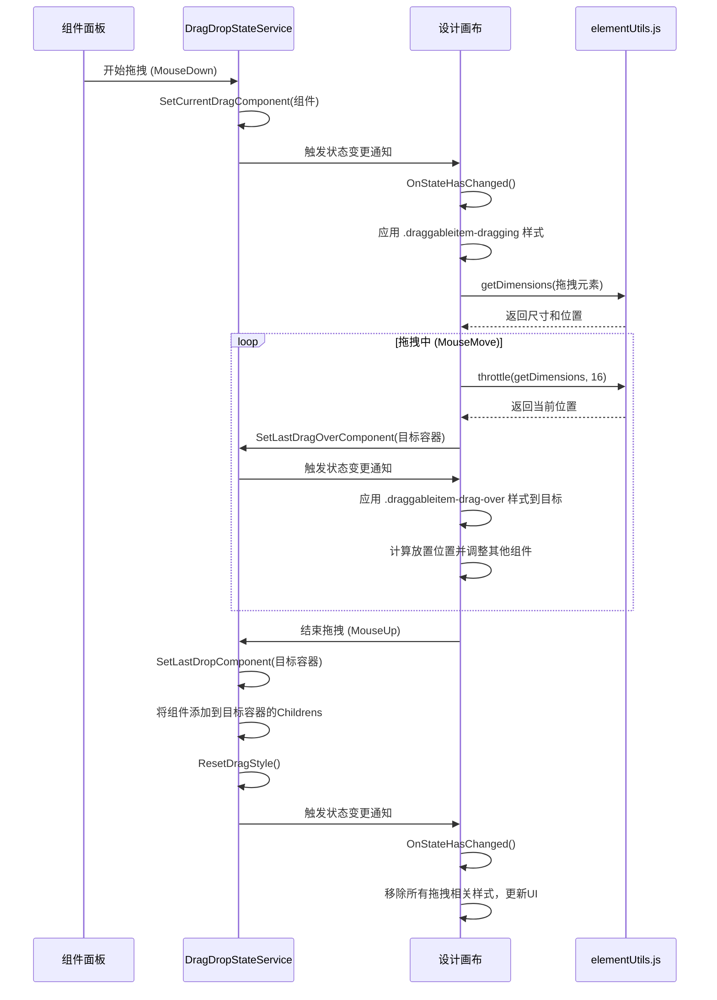

# UI组件与交互

<cite>
**本文档引用的文件**   
- [DragItem.razor.css](file://src/DesignEngine/H.LowCode.DesignEngine/ComponentPanel/DragItem.razor.css)
- [DragItem.razor.css](file://src/DesignEngine/H.LowCode.PartsDesignEngine/ComponentPanel/DragItem.razor.css)
- [PageSetting.razor.css](file://src/DesignEngine/H.LowCode.DesignEngine/SettingPanel/PageSetting.razor.css)
- [DraggableContainer.razor.css](file://src/DesignEngine/H.LowCode.DesignEngineBase/DraggableComponents/DraggableContainer.razor.css)
- [DraggableItem.razor.css](file://src/DesignEngine/H.LowCode.DesignEngineBase/DraggableComponents/DraggableItem.razor.css)
- [DragDropStateService.cs](file://src/DesignEngine/H.LowCode.DesignEngineBase/Services/DragDropStateService.cs)
- [elementUtils.js](file://src/DesignEngine/H.LowCode.DesignEngineBase/wwwroot/js/elementUtils.js)
- [DesignEngineModule.cs](file://src/DesignEngine/H.LowCode.DesignEngine/DesignEngineModule.cs)
- [PartsDesignEngineModule.cs](file://src/DesignEngine/H.LowCode.PartsDesignEngine/PartsDesignEngineModule.cs)
</cite>

## 目录
1. [组件面板与属性设置面板的样式定义](#组件面板与属性设置面板的样式定义)
2. [拖拽状态管理服务](#拖拽状态管理服务)
3. [DOM操作工具函数](#dom操作工具函数)
4. [组件拖拽交互流程](#组件拖拽交互流程)

## 组件面板与属性设置面板的样式定义

### DragItem.razor.css 样式分析
`DragItem.razor.css` 文件定义了组件面板中可拖拽组件项的视觉样式与布局。该样式应用于 `.dragitem` 类，确保组件在面板中以一致的外观呈现。

```css
.dragitem {
    float: left;
    width: 6.8rem;
    height: 2.2rem;
    margin: 4px;
    cursor: pointer;
    display: flex;
    justify-content: center;
    align-items: center;
    color: #333;
    background-color: #f5f7fa;
}

.dragitem:hover {
    border: #409eff dashed 1px;
    color: #409eff;
}
```

**样式说明：**
- **布局与尺寸**：使用 `float: left` 实现组件项的横向排列，固定宽度 `6.8rem` 和高度 `2.2rem`，并设置 `4px` 的外边距，形成网格化布局。
- **交互反馈**：默认光标为 `pointer`，当鼠标悬停时，边框变为蓝色虚线（`#409eff dashed 1px`），文字颜色也变为蓝色，提供清晰的视觉反馈，提示用户该元素可被操作。

此样式文件在两个路径下存在，分别位于 `H.LowCode.DesignEngine` 和 `H.LowCode.PartsDesignEngine` 模块中，表明该样式被多个设计引擎模块复用。

**Section sources**
- [DragItem.razor.css](file://src/DesignEngine/H.LowCode.DesignEngine/ComponentPanel/DragItem.razor.css)
- [DragItem.razor.css](file://src/DesignEngine/H.LowCode.PartsDesignEngine/ComponentPanel/DragItem.razor.css)

### PageSetting.razor.css 样式分析
`PageSetting.razor.css` 文件定义了页面属性设置面板中各个设置项的样式。

```css
.pagesetting-item {
    margin: 5px 15px 20px 10px;
}
```

**样式说明：**
- **布局**：为每个设置项设置了不均匀的外边距（上5px、右15px、下20px、左10px），这种设计可能旨在创建一种非对称但有节奏的视觉层次，使设置面板的布局更具可读性。

**Section sources**
- [PageSetting.razor.css](file://src/DesignEngine/H.LowCode.DesignEngine/SettingPanel/PageSetting.razor.css)

### DraggableItem.razor.css 样式分析
`DraggableItem.razor.css` 文件定义了在设计画布上可拖拽组件的详细样式，包括选中、悬停、拖拽过程中的各种视觉状态。

```css
.draggableitem {
    position: relative;
    display: flex;
    height: 100%;
    margin: 1px;
    border: #ffffff solid 2px;
    background-color: #ffffff;
    transform: translate3d(0, 0, 0);
    backface-visibility: hidden;
    perspective: 1000px;
    transition: all 0.2s ease-out;
    cursor: grab;
}

.draggableitem-selected {
    outline: #1890ff solid 2px;
    box-shadow: 0 4px 12px rgba(24, 144, 255, 0.15);
}

.draggableitem-dragging {
    cursor: grabbing;
    box-shadow: 0 8px 24px rgba(0, 0, 0, 0.15);
    z-index: 9999;
}

.draggableitem-drag-over {
    background-color: rgba(24, 144, 255, 0.05);
    border-color: #1890ff;
    border-style: dashed;
}
```

**样式说明：**
- **基础状态**：`.draggableitem` 使用 `translate3d` 启用硬件加速，`backface-visibility` 和 `perspective` 优化3D变换性能，`transition` 提供平滑的动画过渡。
- **选中状态**：`.draggableitem-selected` 通过蓝色实线轮廓和阴影突出显示当前选中的组件。
- **拖拽状态**：`.draggableitem-dragging` 在拖拽时改变光标为 `grabbing`，增加阴影深度，并将 `z-index` 提升至9999，确保其位于最顶层。
- **目标区域反馈**：`.draggableitem-drag-over` 在组件被拖拽到其上方时，改变背景色和边框为蓝色虚线，直观地指示放置位置。

**Section sources**
- [DraggableItem.razor.css](file://src/DesignEngine/H.LowCode.DesignEngineBase/DraggableComponents/DraggableItem.razor.css)

## 拖拽状态管理服务

### DragDropStateService 核心功能
`DragDropStateService` 是一个核心服务，负责管理整个拖拽过程中的所有状态。它被注册为单例服务，确保在整个应用生命周期内状态的一致性。

```csharp
public class DragDropStateService
{
    private IDictionary<string, DragDropStateSchema> schemaStates = new Dictionary<string, DragDropStateSchema>();

    public ComponentPartsSchema GetCurrentDragComponent(string appId, string pageId)
    {
        var stateSchema = GetStateSchema(appId, pageId);
        return stateSchema?.CurrentDragComponent;
    }

    public void SetCurrentDragComponent(string appId, string pageId, ComponentPartsSchema currentDragComponent)
    {
        SetStateSchema(appId, pageId, (stateSchema) => {
            stateSchema.CurrentDragComponent = currentDragComponent;
        });
    }

    // ... 其他状态的获取和设置方法
}
```

**状态管理说明：**
- **状态存储**：使用 `schemaStates` 字典，以 `appId-pageId` 作为键来存储每个页面的独立状态对象 `DragDropStateSchema`。
- **关键状态**：
  - `CurrentDragComponent`：存储当前正在被拖拽的组件。
  - `LastDragOverComponent`：存储上一个被悬停的组件，用于在拖拽离开时清除其视觉反馈。
  - `LastSelectedComponent`：存储最后被选中的组件，用于实现组件的选中逻辑。
  - `RootComponent`：存储页面的根组件，是整个组件树的起点。

### 服务注入与生命周期协同
`DragDropStateService` 通过依赖注入（DI）容器在 `DesignEngineModule.cs` 和 `PartsDesignEngineModule.cs` 中被注册为单例。

```csharp
// DesignEngineModule.cs
public override void ConfigureServices(ServiceConfigurationContext context)
{
    context.Services.AddAntDesign();
    context.Services.AddSingleton(typeof(DragDropStateService));
}
```

**生命周期协同：**
- **注入**：任何需要访问拖拽状态的Blazor组件都可以通过 `[Inject]` 属性注入 `DragDropStateService`。
- **状态同步**：当组件的 `OnInitialized` 或 `OnParametersSet` 生命周期方法被调用时，组件可以从服务中读取当前状态并更新自身UI。当用户进行拖拽操作时，组件调用服务的 `Set` 方法更新状态，服务内部的逻辑会确保状态的正确性。
- **重置**：提供了 `ResetComponent` 和 `ResetDragStyle` 等方法，用于在特定操作（如取消选择）后清理状态和样式。

**Section sources**
- [DragDropStateService.cs](file://src/DesignEngine/H.LowCode.DesignEngineBase/Services/DragDropStateService.cs)
- [DesignEngineModule.cs](file://src/DesignEngine/H.LowCode.DesignEngine/DesignEngineModule.cs)
- [PartsDesignEngineModule.cs](file://src/DesignEngine/H.LowCode.PartsDesignEngine/PartsDesignEngineModule.cs)

## DOM操作工具函数

### elementUtils.js 功能分析
`elementUtils.js` 是一个JavaScript模块，提供了在Blazor应用中与DOM进行交互的工具函数，主要用于精确计算拖拽过程中的坐标和尺寸。

```javascript
window.elementUtils = {
    getDimensions: function (element) {
        if (!element) return null;
        const rect = element.getBoundingClientRect();
        const computedStyle = window.getComputedStyle(element);
        const margin = {
            top: parseFloat(computedStyle.marginTop),
            right: parseFloat(computedStyle.marginRight),
            bottom: parseFloat(computedStyle.marginBottom),
            left: parseFloat(computedStyle.marginLeft)
        };
        return {
            width: rect.width,
            height: rect.height,
            actualWidth: rect.width + margin.left + margin.right,
            actualHeight: rect.height + margin.top + margin.bottom,
            offsetTop: rect.top,
            offsetLeft: rect.left
        };
    },

    setTransform: function (element, transform) {
        if (!element) return;
        element.style.transform = transform;
        element.style.willChange = 'transform';
    },

    throttle: function (func, limit) {
        let inThrottle;
        return function() {
            const args = arguments;
            const context = this;
            if (!inThrottle) {
                func.apply(context, args);
                inThrottle = true;
                setTimeout(() => inThrottle = false, limit);
            }
        }
    }
};
```

**函数说明：**
- **`getDimensions`**：获取元素的精确尺寸，包括 `offsetTop` 和 `offsetLeft`（相对于视口的位置），以及计算了 `margin` 的实际尺寸。这对于判断拖拽元素在画布中的位置至关重要。
- **`setTransform`**：直接操作元素的 `transform` CSS属性，用于实现拖拽时的平滑移动动画。设置 `willChange: 'transform'` 可以提示浏览器提前优化该属性的渲染。
- **`throttle`**：节流函数，用于限制高频率事件（如 `mousemove`）的处理频率，防止因频繁的DOM操作导致性能下降。

**Section sources**
- [elementUtils.js](file://src/DesignEngine/H.LowCode.DesignEngineBase/wwwroot/js/elementUtils.js)

## 组件拖拽交互流程

### 完整交互流程图解
以下流程图描述了从组件拖拽开始到释放生成新页面元素的完整过程。



**Diagram sources**
- [DragDropStateService.cs](file://src/DesignEngine/H.LowCode.DesignEngineBase/Services/DragDropStateService.cs)
- [elementUtils.js](file://src/DesignEngine/H.LowCode.DesignEngineBase/wwwroot/js/elementUtils.js)
- [DraggableItem.razor.css](file://src/DesignEngine/H.LowCode.DesignEngineBase/DraggableComponents/DraggableItem.razor.css)

### 流程详细说明
1.  **拖拽开始**：
    - 用户在组件面板中点击一个组件（`MouseDown` 事件）。
    - 事件处理程序调用 `DragDropStateService` 的 `SetCurrentDragComponent` 方法，将该组件标记为当前拖拽项。
    - 服务内部状态更新，并通知所有监听该状态的组件（如设计画布）进行刷新。
    - 设计画布组件检测到 `CurrentDragComponent` 不为空，为该组件应用 `.draggableitem-dragging` 样式，并使用 `elementUtils.getDimensions` 获取其初始位置。

2.  **拖拽中**：
    - 用户移动鼠标（`MouseMove` 事件），此事件被节流（`throttle`）以优化性能。
    - 设计画布持续获取鼠标位置，并通过 `elementUtils.getDimensions` 计算出鼠标指针相对于各个可放置容器的位置。
    - 当鼠标悬停在一个有效的容器上时，调用 `SetLastDragOverComponent` 更新服务状态。
    - 服务通知设计画布，画布为该容器应用 `.draggableitem-drag-over` 样式，提供视觉反馈。同时，系统会计算新组件的插入位置，并可能为其他组件应用 `.draggableitem-moving` 样式来“让位”。

3.  **拖拽结束**：
    - 用户松开鼠标（`MouseUp` 事件）。
    - 事件处理程序获取 `LastDragOverComponent` 作为目标容器。
    - 调用 `DragDropStateService` 的方法，将 `CurrentDragComponent` 作为子组件添加到目标容器的 `Childrens` 列表中。
    - 调用 `ResetDragStyle` 清理所有与拖拽相关的临时状态和样式。
    - 服务再次通知UI，设计画布重新渲染，显示出新添加的组件。

此流程通过 `DragDropStateService` 统一管理状态，`elementUtils.js` 精确处理DOM，以及CSS样式提供即时的视觉反馈，共同实现了流畅的低代码拖拽构建体验。

**Section sources**
- [DragDropStateService.cs](file://src/DesignEngine/H.LowCode.DesignEngineBase/Services/DragDropStateService.cs)
- [elementUtils.js](file://src/DesignEngine/H.LowCode.DesignEngineBase/wwwroot/js/elementUtils.js)
- [DraggableItem.razor.css](file://src/DesignEngine/H.LowCode.DesignEngineBase/DraggableComponents/DraggableItem.razor.css)
- [DragItem.razor.css](file://src/DesignEngine/H.LowCode.DesignEngine/ComponentPanel/DragItem.razor.css)