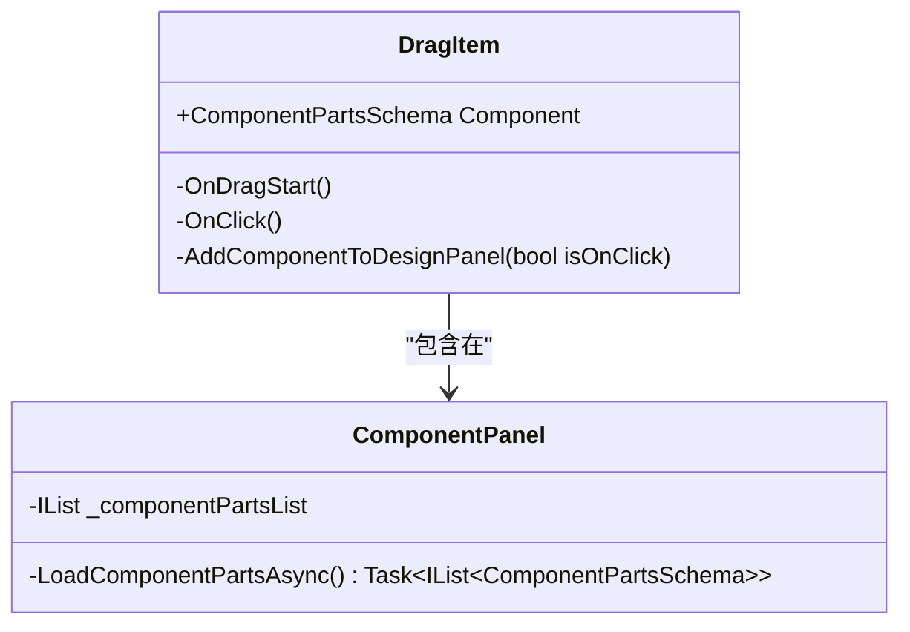
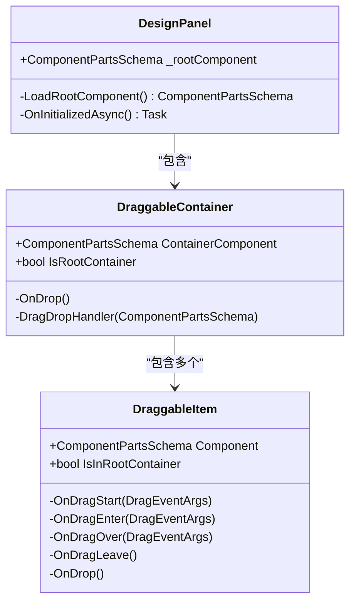
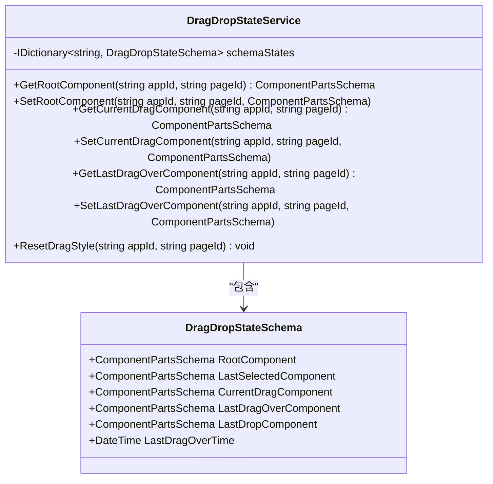
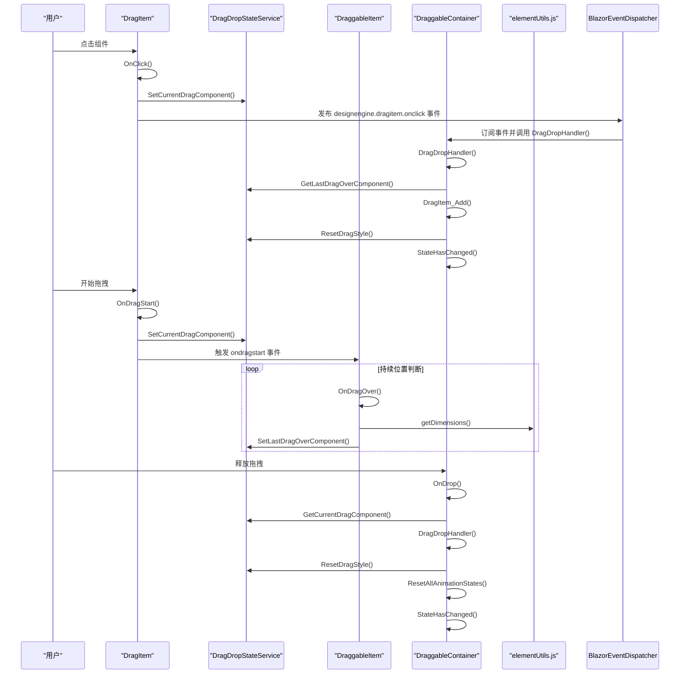

# 拖拽交互完整流程

<cite>
**本文档引用文件**  
- [DragDropStateService.cs](file://src/DesignEngine/H.LowCode.DesignEngineBase/Services/DragDropStateService.cs)
- [DragItem.razor](file://src/DesignEngine/H.LowCode.DesignEngine/ComponentPanel/DragItem.razor)
- [DraggableContainer.razor](file://src/DesignEngine/H.LowCode.DesignEngineBase/DraggableComponents/DraggableContainer.razor)
- [DraggableItem.razor](file://src/DesignEngine/H.LowCode.DesignEngineBase/DraggableComponents/DraggableItem.razor)
- [elementUtils.js](file://src/DesignEngine/H.LowCode.DesignEngineBase/wwwroot/js/elementUtils.js)
- [ComponentPartsSchema.cs](file://src/Common/H.LowCode.MetaSchema.DesignEngine/ComponentPartsSchema.cs)
- [ComponentDesignStateSchema.cs](file://src/Common/H.LowCode.MetaSchema.DesignEngine/PropertySchemas/ComponentDesignStateSchema.cs)
- [ComponentSchemaBase.cs](file://src/Common/H.LowCode.MetaSchema/ComponentSchemaBase.cs)
- [AppSchemaBase.cs](file://src/Common/H.LowCode.MetaSchema/AppSchemaBase.cs)
- [PageSchemaBase.cs](file://src/Common/H.LowCode.MetaSchema/PageSchemaBase.cs)
</cite>

## 目录
1. [交互流程概述](#交互流程概述)
2. [核心组件与服务](#核心组件与服务)
3. [拖拽状态管理机制](#拖拽状态管理机制)
4. [拖拽交互时序分析](#拖拽交互时序分析)
5. [视觉反馈与CSS类切换](#视觉反馈与css类切换)
6. [位置判断与JavaScript工具函数](#位置判断与javascript工具函数)
7. [页面元数据生成](#页面元数据生成)
8. [错误处理机制](#错误处理机制)
9. [关键代码片段](#关键代码片段)

## 交互流程概述

低代码平台的拖拽交互流程从用户在组件面板点击并拖拽组件开始，到在设计画布上释放生成新元素结束。整个过程涉及多个组件、服务和工具函数的协同工作，确保用户体验流畅且数据状态一致。

该流程按时间序列可分为以下几个关键阶段：
1. **拖拽开始（OnPointerDown）**：用户点击组件面板中的组件，触发拖拽开始事件。
2. **状态更新（DragDropStateService）**：拖拽状态服务记录当前拖拽的组件及其状态。
3. **视觉反馈（CSS类切换）**：通过动态切换CSS类实现拖拽过程中的视觉反馈效果。
4. **位置判断（elementUtils.js）**：持续调用JavaScript工具函数进行元素位置判断。
5. **元素生成（OnDrop）**：在画布上释放时，生成页面元数据并更新应用模式（AppSchema）。

此流程确保了用户在设计界面中能够直观地构建页面结构，同时保持底层数据模型的同步更新。

## 核心组件与服务

拖拽交互流程涉及多个核心组件和服务，它们共同协作完成整个交互过程。

### 组件面板（ComponentPanel）
组件面板是拖拽交互的入口点，展示所有可用的可拖拽组件。每个组件以`DragItem`形式呈现，支持拖拽和点击操作。



**图示来源**  
- [DragItem.razor](file://src/DesignEngine/H.LowCode.DesignEngine/ComponentPanel/DragItem.razor)
- [ComponentPanel.razor](file://src/DesignEngine/H.LowCode.DesignEngine/ComponentPanel/ComponentPanel.razor)

### 设计面板（DesignPanel）
设计面板是拖拽的目标区域，包含一个可拖拽容器（DraggableContainer），用于接收并排列拖拽进来的组件。



**图示来源**  
- [DesignPanel.razor](file://src/DesignEngine/H.LowCode.DesignEngine/DesignPanel/DesignPanel.razor)
- [DraggableContainer.razor](file://src/DesignEngine/H.LowCode.DesignEngineBase/DraggableComponents/DraggableContainer.razor)
- [DraggableItem.razor](file://src/DesignEngine/H.LowCode.DesignEngineBase/DraggableComponents/DraggableItem.razor)

### 拖拽状态服务（DragDropStateService）
`DragDropStateService`是拖拽交互的核心状态管理服务，负责维护拖拽过程中的各种状态信息。



**图示来源**  
- [DragDropStateService.cs](file://src/DesignEngine/H.LowCode.DesignEngineBase/Services/DragDropStateService.cs)

## 拖拽状态管理机制

`DragDropStateService`通过`DragDropStateSchema`对象为每个应用-页面组合维护独立的状态上下文。这种设计确保了多页面编辑时的状态隔离。

### 状态存储结构
状态服务使用字典`schemaStates`以`{appId}-{pageId}`为键存储状态，避免了全局状态污染。

```csharp
private IDictionary<string, DragDropStateSchema> schemaStates = new Dictionary<string, DragDropStateSchema>();
```

### 状态获取与设置
通过`GetStateSchema`和`SetStateSchema`方法实现状态的安全访问和更新：

```csharp
private DragDropStateSchema GetStateSchema(string appId, string pageId)
{
    string key = $"{appId}-{pageId}";
    if (schemaStates.TryGetValue(key, out DragDropStateSchema schema))
        return schema;
    return null;
}

private void SetStateSchema(string appId, string pageId, Action<DragDropStateSchema> action)
{
    string key = $"{appId}-{pageId}";
    if (schemaStates.TryGetValue(key, out DragDropStateSchema stateSchema))
        action(stateSchema);
    else
    {
        stateSchema = new();
        action(stateSchema);
        schemaStates[key] = stateSchema;
    }
}
```

### 关键状态属性
`DragDropStateSchema`包含以下关键状态属性：

| 属性名 | 类型 | 说明 |
|--------|------|------|
| `RootComponent` | `ComponentPartsSchema` | 根组件，包含所有子组件 |
| `LastSelectedComponent` | `ComponentPartsSchema` | 最后选中的组件 |
| `CurrentDragComponent` | `ComponentPartsSchema` | 当前正在拖拽的组件 |
| `LastDragOverComponent` | `ComponentPartsSchema` | 最后一次拖拽经过的组件 |
| `LastDropComponent` | `ComponentPartsSchema` | 最后一次放置的组件 |
| `LastDragOverTime` | `DateTime` | 最后一次拖拽经过的时间 |

**本节来源**  
- [DragDropStateService.cs](file://src/DesignEngine/H.LowCode.DesignEngineBase/Services/DragDropStateService.cs)

## 拖拽交互时序分析

以下是拖拽交互的完整时序流程，展示了各组件与服务之间的调用顺序和数据流向。



**图示来源**  
- [DragItem.razor](file://src/DesignEngine/H.LowCode.DesignEngine/ComponentPanel/DragItem.razor)
- [DraggableItem.razor](file://src/DesignEngine/H.LowCode.DesignEngineBase/DraggableComponents/DraggableItem.razor)
- [DraggableContainer.razor](file://src/DesignEngine/H.LowCode.DesignEngineBase/DraggableComponents/DraggableContainer.razor)
- [DragDropStateService.cs](file://src/DesignEngine/H.LowCode.DesignEngineBase/Services/DragDropStateService.cs)
- [elementUtils.js](file://src/DesignEngine/H.LowCode.DesignEngineBase/wwwroot/js/elementUtils.js)

## 视觉反馈与CSS类切换

拖拽过程中的视觉反馈通过动态修改组件的CSS类和内联样式实现，提供直观的用户交互体验。

### CSS类映射
`DraggableItem`组件使用`ClassMapper`动态管理CSS类：

```csharp
private void SetClassMap()
{
    DraggableItemClassMapper.Clear()
        .If("draggableitem-selected", () => Component.DesignState.IsSelected)
        .If("draggableitem-component", () => Component.IsContainer == false)
        .If("draggableitem-container", () => Component.IsContainer);

    DraggableItemBoxClassMapper.Clear()
        .If("draggableitem-box-layout", () => Component.IsContainer)
        .If("draggableitem-animating", () => Component.DesignState.IsAnimating);
}
```

### 内联样式动态更新
组件的内联样式根据拖拽状态实时更新：

```html
<div class="draggableitem-box @DraggableItemBoxClassMapper.Class"
    style="float:left;
        width: @((Component.Style.ItemWidth > 4 ? Component.Style.ItemWidth : (IsInRootContainer ? 24/PageCascading.PageLayout : 24))  /24 * 100)%;
        min-height: @(Component.Style.ItemHeight)px;
        transform: @Component.DesignState.AnimationTransform;
        will-change: @(Component.DesignState.IsAnimating || isDragging ? "transform" : "auto");
        transition: @(Component.DesignState.IsAnimating && !isDragging ? "transform 0.25s cubic-bezier(0.2, 0, 0.2, 1)" : "none");
        z-index: @(isDragging ? "9999" : (Component.DesignState.IsAnimating ? "100" : "auto"));
        position: @(isDragging ? "relative" : "static");
        opacity: @(isDragging ? "0.8" : "1");
        @Component.Style.DefaultStyle @Component.Style.CustomStyle">
```

### 拖拽状态样式
不同拖拽状态对应不同的视觉效果：

| 状态 | 样式变化 | 说明 |
|------|---------|------|
| 开始拖拽 | `opacity: 0.8`, `z-index: 9999` | 降低透明度，提升层级 |
| 拖拽经过 | `box-shadow: 0 8px 24px rgba(0,0,0,0.15)` | 添加阴影效果 |
| 选中状态 | 边框高亮，显示操作图标 | 显示删除、复制等操作按钮 |
| 动画进行中 | `transition: transform 0.25s cubic-bezier(0.2, 0, 0.2, 1)` | 平滑动画效果 |

**本节来源**  
- [DraggableItem.razor](file://src/DesignEngine/H.LowCode.DesignEngineBase/DraggableComponents/DraggableItem.razor)
- [ComponentDesignStateSchema.cs](file://src/Common/H.LowCode.MetaSchema.DesignEngine/PropertySchemas/ComponentDesignStateSchema.cs)

## 位置判断与JavaScript工具函数

拖拽过程中的位置判断依赖于JavaScript工具函数`elementUtils.js`，通过Blazor的JS互操作实现高性能的位置计算。

### elementUtils.js功能
`elementUtils.js`提供了以下核心功能：

```javascript
window.elementUtils = {
    // 获取元素尺寸信息（包含margin）
    getDimensions: function (element) {
        if (!element) return null;
        
        const rect = element.getBoundingClientRect();
        const computedStyle = window.getComputedStyle(element);
        const containerWidth = element.parentElement ? element.parentElement.getBoundingClientRect().width : 0;
        
        const margin = {
            top: parseFloat(computedStyle.marginTop),
            right: parseFloat(computedStyle.marginRight),
            bottom: parseFloat(computedStyle.marginBottom),
            left: parseFloat(computedStyle.marginLeft)
        };
        
        return {
            width: rect.width,
            height: rect.height,
            actualWidth: rect.width + margin.left + margin.right,
            actualHeight: rect.height + margin.top + margin.bottom,
            containerWidth: containerWidth,
            margin: margin,
            offsetTop: rect.top,
            offsetLeft: rect.left
        };
    },
    
    // 获取容器信息
    getContainerInfo: function (element) {
        if (!element || !element.parentElement) return null;
        
        const container = element.parentElement;
        const containerRect = container.getBoundingClientRect();
        const computedStyle = window.getComputedStyle(container);
        
        return {
            width: containerRect.width,
            height: containerRect.height,
            padding: {
                top: parseFloat(computedStyle.paddingTop),
                right: parseFloat(computedStyle.paddingRight),
                bottom: parseFloat(computedStyle.paddingBottom),
                left: parseFloat(computedStyle.paddingLeft)
            }
        };
    },

    // 设置元素的transform属性（优化性能）
    setTransform: function (element, transform) {
        if (!element) return;
        element.style.transform = transform;
        element.style.willChange = 'transform';
    },

    // 节流函数，用于优化拖拽性能
    throttle: function (func, limit) {
        let inThrottle;
        return function() {
            const args = arguments;
            const context = this;
            if (!inThrottle) {
                func.apply(context, args);
                inThrottle = true;
                setTimeout(() => inThrottle = false, limit);
            }
        }
    }
};
```

### Blazor中的调用
在`DraggableItem.razor`中通过`IJSRuntime`调用JavaScript函数：

```csharp
protected override async Task OnAfterRenderAsync(bool firstRender)
{
    if (firstRender)
    {
        await JSRuntime.InvokeAsync<IJSObjectReference>("import", "./_content/H.LowCode.DesignEngineBase/js/elementUtils.js");
        await UpdateDimensions();
    }
}

private async Task UpdateDimensions()
{
    try
    {
        dimensions = await JSRuntime.InvokeAsync<DragDropElementDimensions>("elementUtils.getDimensions", itemRef);
    }
    catch (Exception ex)
    {
        Console.WriteLine($"Error getting element dimensions: {ex.Message}");
    }
}
```

### 防抖机制
为了提升性能，拖拽过程中的位置更新采用了防抖机制：

```csharp
private void OnDragOver(DragEventArgs dragEventArgs)
{
    var now = DateTime.Now;
    if ((now - lastUpdateTime).TotalMilliseconds < UPDATE_INTERVAL_MS)
        return;

    lastUpdateTime = now;
    // 处理拖拽逻辑
}
```

**本节来源**  
- [elementUtils.js](file://src/DesignEngine/H.LowCode.DesignEngineBase/wwwroot/js/elementUtils.js)
- [DraggableItem.razor](file://src/DesignEngine/H.LowCode.DesignEngineBase/DraggableComponents/DraggableItem.razor)

## 页面元数据生成

当用户在画布上释放拖拽的组件时，系统会生成相应的页面元数据并更新应用模式。

### 组件数据结构
`ComponentPartsSchema`是组件的核心数据结构，包含设计时和运行时所需的所有信息：

```csharp
public class ComponentPartsSchema : ComponentSchemaBase
{
    [JsonPropertyName("compid")]
    public string ComponentId { get; set; } = ShortIdGenerator.Generate();

    [JsonPropertyName("libid")]
    public string LibraryId { get; set; }

    [JsonPropertyName("cn")]
    public string ComponentName { get; set; }

    [JsonPropertyName("ct")]
    public int ComponentType { get; set; }

    [JsonPropertyName("frag")]
    public ComponentPartsFragmentSchema Fragment { get; set; }

    [JsonPropertyName("ds")]
    public ComponentPartsDataSourceSchema DataSource { get; set; } = new();

    [JsonPropertyName("attrdefgroups")]
    public IEnumerable<ComponentPartsAttributeDefineGroupSchema> AttributeDefineGroups { get; set; } = [];

    [JsonPropertyName("childs")]
    public IList<ComponentPartsSchema> Childrens { get; set; } = [];

    [JsonIgnore]
    public ComponentDesignStateSchema DesignState { get; set; } = new();

    [JsonIgnore]
    public Action Refresh { get; set; }

    public ComponentPartsSchema DeepClone()
    {
        // 深拷贝实现
    }
}
```

### 深拷贝机制
新添加的组件通过`DeepClone`方法创建副本，确保每个实例都有唯一的ID：

```csharp
public ComponentPartsSchema DeepClone()
{
    ComponentPartsSchema newComponent = ObjectExtension.DeepClone(this);
    newComponent.Id = ShortIdGenerator.Generate();
    newComponent.ParentId = string.Empty;
    newComponent.Name = $"{newComponent.ComponentName}_{Random.Shared.Next(100, 999)}";
    newComponent.DesignState.IsSelected = false;
    newComponent.Refresh = Refresh;
    DeepCloneRecursive(newComponent, this);
    return newComponent;
}
```

### 元数据更新流程
1. 创建组件副本
2. 设置父级ID
3. 添加到目标容器的子组件列表
4. 更新UI状态

```csharp
private void DragItem_Add(ComponentPartsSchema containerComponent, ComponentPartsSchema currentDragComponent, ComponentPartsSchema dragOverComponent, bool isSelected = false)
{
    currentDragComponent.ParentId = containerComponent.Id;
    currentDragComponent.DesignState.IsDroppedFromComponentPanel = false;

    if (isSelected)
    {
        currentDragComponent.DesignState.IsSelected = isSelected;
        DragDropStateService.SetLastSelectedComponent(PageCascading.AppId, PageCascading.PageId, currentDragComponent);
    }
    currentDragComponent.Refresh = StateHasChanged;

    if (dragOverComponent != null)
    {
        containerComponent.Childrens.InsertBefore(dragOverComponent, currentDragComponent);
    }
    else
    {
        containerComponent.Childrens.Add(currentDragComponent);
    }
}
```

**本节来源**  
- [ComponentPartsSchema.cs](file://src/Common/H.LowCode.MetaSchema.DesignEngine/ComponentPartsSchema.cs)
- [DraggableContainer.razor](file://src/DesignEngine/H.LowCode.DesignEngineBase/DraggableComponents/DraggableContainer.razor)

## 错误处理机制

系统在拖拽交互过程中实现了多层次的错误处理机制，确保用户体验的稳定性和数据的完整性。

### 空值检查
在关键操作前进行空值检查，防止空引用异常：

```csharp
private void Init()
{
    if (Component == null)
        throw new NullReferenceException(nameof(Component));
}

private void LoadRootComponent()
{
    var rootComponent = DragDropStateService.GetRootComponent(PageCascading.AppId, PageCascading.PageId);
    if (rootComponent == null)
    {
        rootComponent = new ComponentPartsSchema();
        rootComponent.Name = "root";
        rootComponent.Refresh = StateHasChanged;
    }
    return rootComponent;
}
```

### JavaScript互操作异常处理
在调用JavaScript函数时捕获异常，避免前端崩溃：

```csharp
private async Task UpdateDimensions()
{
    try
    {
        dimensions = await JSRuntime.InvokeAsync<DragDropElementDimensions>("elementUtils.getDimensions", itemRef);
    }
    catch (Exception ex)
    {
        Console.WriteLine($"Error getting element dimensions: {ex.Message}");
    }
}
```

### 状态重置机制
提供专门的状态重置方法，确保异常情况下的状态一致性：

```csharp
public void ResetDragStyle(string appId, string pageId)
{
    var stateSchema = GetStateSchema(appId, pageId);
    if (stateSchema == null) return;

    if (stateSchema.CurrentDragComponent != null)
    {
        stateSchema.CurrentDragComponent.DesignState.AnimationTransform = string.Empty;
        stateSchema.CurrentDragComponent.DesignState.IsAnimating = false;
    }

    if (stateSchema.LastSelectedComponent != null)
    {
        stateSchema.LastSelectedComponent.DesignState.IsSelected = false;
        stateSchema.LastSelectedComponent.RefreshState();
    }

    if (stateSchema.LastDragOverComponent != null)
    {
        stateSchema.LastDragOverComponent.DesignState.DragEffectStyle = string.Empty;
        stateSchema.LastDragOverComponent.DesignState.AnimationTransform = string.Empty;
        stateSchema.LastDragOverComponent.DesignState.IsAnimating = false;
    }
}
```

### 事件订阅管理
实现`IAsyncDisposable`接口，确保事件订阅的正确清理：

```csharp
public async ValueTask DisposeAsync()
{
    if (IsInRootContainer)
    {
        BlazorEventDispatcher.Unsubscribe("designengine.pagesetting.pagelayout.onchange", OnPageLayoutChange);
    }
}
```

**本节来源**  
- [DragDropStateService.cs](file://src/DesignEngine/H.LowCode.DesignEngineBase/Services/DragDropStateService.cs)
- [DraggableItem.razor](file://src/DesignEngine/H.LowCode.DesignEngineBase/DraggableComponents/DraggableItem.razor)
- [DraggableContainer.razor](file://src/DesignEngine/H.LowCode.DesignEngineBase/DraggableComponents/DraggableContainer.razor)

## 关键代码片段

### 拖拽开始处理
```csharp
private void OnDragStart(DragEventArgs dragEventArgs)
{
    isDragging = true;
    initialX = dragEventArgs.ClientX;
    initialY = dragEventArgs.ClientY;
    lastDragX = initialX;
    lastDragY = initialY;
    lastUpdateTime = DateTime.Now;

    Component.DesignState.DragEffectStyle = "box-shadow: 0 8px 24px rgba(0,0,0,0.15); transform-origin: center;";
    DragDropStateService.SetCurrentDragComponent(PageCascading.AppId, PageCascading.PageId, Component);
    ResetAllAnimationStates();
}
```

### 拖拽释放处理
```csharp
private void OnDrop()
{
    var currentDragComponent = DragDropStateService.GetCurrentDragComponent(PageCascading.AppId, PageCascading.PageId);
    DragDropHandler(currentDragComponent);
    DragDropStateService.ResetDragStyle(PageCascading.AppId, PageCascading.PageId);
    ResetAllAnimationStates();
}
```

### 拖拽处理核心逻辑
```csharp
private void DragDropHandler(ComponentPartsSchema currentDragComponent)
{
    var dragOverComponent = DragDropStateService.GetLastDragOverComponent(PageCascading.AppId, PageCascading.PageId);
    
    if (currentDragComponent.DesignState.IsDroppedFromComponentPanel)
    {
        DragItem_Add(ContainerComponent, currentDragComponent, dragOverComponent);
    }
    else
    {
        bool isInnerContainer = ContainerComponent.Childrens.Any(t => t.Id == currentDragComponent.Id);
        if (isInnerContainer)
        {
            DraggableItem_Sorting(ContainerComponent, currentDragComponent, dragOverComponent);
        }
        else
        {
            DragItem_Move(ContainerComponent, currentDragComponent, dragOverComponent);
        }
    }

    StateHasChanged();
    DragDropStateService.SetLastDragOverComponent(PageCascading.AppId, PageCascading.PageId, null);
}
```

### 组件添加逻辑
```csharp
private void DragItem_Add(ComponentPartsSchema containerComponent, ComponentPartsSchema currentDragComponent, ComponentPartsSchema dragOverComponent, bool isSelected = false)
{
    currentDragComponent.ParentId = containerComponent.Id;
    currentDragComponent.DesignState.IsDroppedFromComponentPanel = false;

    if (isSelected)
    {
        currentDragComponent.DesignState.IsSelected = isSelected;
        DragDropStateService.SetLastSelectedComponent(PageCascading.AppId, PageCascading.PageId, currentDragComponent);
    }
    currentDragComponent.Refresh = StateHasChanged;

    if (dragOverComponent != null)
    {
        containerComponent.Childrens.InsertBefore(dragOverComponent, currentDragComponent);
    }
    else
    {
        containerComponent.Childrens.Add(currentDragComponent);
    }
}
```

**本节来源**  
- [DraggableItem.razor](file://src/DesignEngine/H.LowCode.DesignEngineBase/DraggableComponents/DraggableItem.razor)
- [DraggableContainer.razor](file://src/DesignEngine/H.LowCode.DesignEngineBase/DraggableComponents/DraggableContainer.razor)
- [DragDropStateService.cs](file://src/DesignEngine/H.LowCode.DesignEngineBase/Services/DragDropStateService.cs)