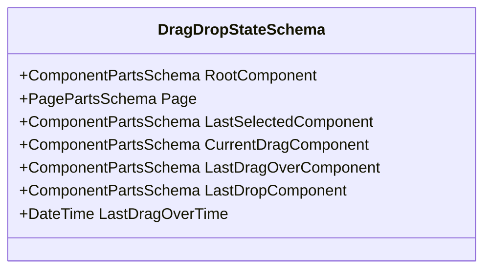
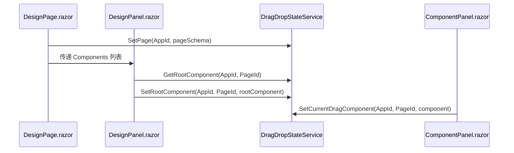
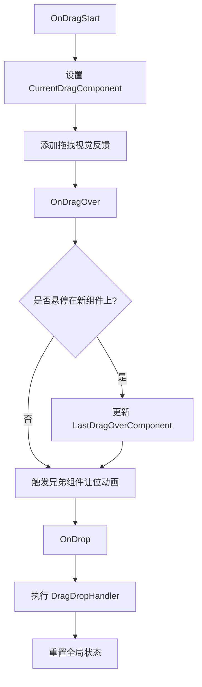
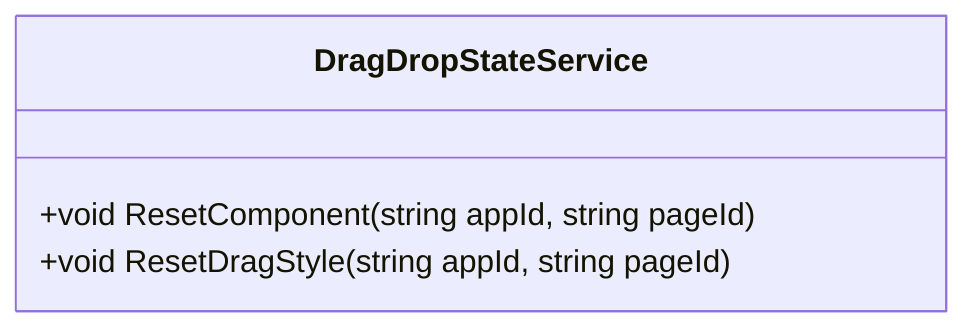

# 拖拽状态管理服务

<cite>
**本文档引用的文件**   
- [DragDropStateService.cs](file://src/DesignEngine/H.LowCode.DesignEngineBase/Services/DragDropStateService.cs)
- [DraggableItem.razor](file://src/DesignEngine/H.LowCode.DesignEngineBase/DraggableComponents/DraggableItem.razor)
- [DraggableContainer.razor](file://src/DesignEngine/H.LowCode.DesignEngineBase/DraggableComponents/DraggableContainer.razor)
- [DesignPage.razor](file://src/DesignEngine/H.LowCode.DesignEngine/Pages/DesignPage.razor)
- [DesignPanel.razor](file://src/DesignEngine/H.LowCode.DesignEngine/DesignPanel/DesignPanel.razor)
- [DragItem.razor](file://src/DesignEngine/H.LowCode.DesignEngine/ComponentPanel/DragItem.razor)
</cite>

## 目录
1. [引言](#引言)
2. [核心属性与状态管理](#核心属性与状态管理)
3. [服务初始化与依赖注入](#服务初始化与依赖注入)
4. [拖拽事件处理流程](#拖拽事件处理流程)
5. [状态变更通知机制](#状态变更通知机制)
6. [状态重置与异常恢复](#状态重置与异常恢复)
7. [并发操作处理](#并发操作处理)
8. [最佳实践与代码示例](#最佳实践与代码示例)

## 引言
拖拽状态管理服务（DragDropStateService）是Blazor低代码设计器中的核心全局状态容器，负责在多个可拖拽组件之间协调和共享拖拽相关的状态信息。该服务通过依赖注入机制被所有相关的UI组件（如DraggableItem、DraggableContainer等）所使用，确保了跨组件状态的一致性和同步性。本文档将深入解析该服务的设计与实现，详细说明其如何管理拖拽状态、处理事件以及与其他组件协同工作。

## 核心属性与状态管理

### DragDropStateSchema 核心属性
`DragDropStateSchema` 类是拖拽状态服务的数据模型，定义了所有需要在应用中共享的核心状态属性。



**Diagram sources**
- [DragDropStateService.cs](file://src/DesignEngine/H.LowCode.DesignEngineBase/Services/DragDropStateService.cs#L203-L237)

**Section sources**
- [DragDropStateService.cs](file://src/DesignEngine/H.LowCode.DesignEngineBase/Services/DragDropStateService.cs#L203-L237)

#### 属性详解
- **RootComponent**: 存储当前页面的根组件对象，作为所有可拖拽组件的父容器，是构建组件树结构的基础。
- **Page**: 存储当前页面的元数据信息，如页面ID、名称和布局等。
- **LastSelectedComponent**: 记录最后一次被选中的组件，即使该组件失去焦点，此属性仍保留其引用，用于实现“最后选中”逻辑。
- **CurrentDragComponent**: 标识当前正在被拖拽的组件对象，是拖拽操作的核心状态。
- **LastDragOverComponent**: 记录鼠标指针最后一次悬停在其上方的组件，用于实现放置时的视觉反馈和逻辑判断。
- **LastDropComponent**: 记录最后一次成功放置的组件，可用于撤销操作或日志记录。
- **LastDragOverTime**: 记录最后一次拖拽到某个组件上方的时间戳，可用于处理拖拽延迟或防抖逻辑。

## 服务初始化与依赖注入

### 服务注册与生命周期
`DragDropStateService` 是一个通过依赖注入（DI）容器管理的单例服务。它在应用启动时被注册，确保在整个应用生命周期内只有一个实例存在，从而保证了状态的全局唯一性。

### 组件初始化流程
多个关键组件在初始化时会与 `DragDropStateService` 进行交互，建立其状态上下文。



**Diagram sources**
- [DesignPage.razor](file://src/DesignEngine/H.LowCode.DesignEngine/Pages/DesignPage.razor#L79-L84)
- [DesignPanel.razor](file://src/DesignEngine/H.LowCode.DesignEngine/DesignPanel/DesignPanel.razor#L30-L35)
- [DragItem.razor](file://src/DesignEngine/H.LowCode.DesignEngine/ComponentPanel/DragItem.razor#L42)

**Section sources**
- [DesignPage.razor](file://src/DesignEngine/H.LowCode.DesignEngine/Pages/DesignPage.razor#L79-L84)
- [DesignPanel.razor](file://src/DesignEngine/H.LowCode.DesignEngine/DesignPanel/DesignPanel.razor#L30-L35)
- [DragItem.razor](file://src/DesignEngine/H.LowCode.DesignEngine/ComponentPanel/DragItem.razor#L42)

#### 初始化步骤
1.  **页面加载 (DesignPage)**: 当 `DesignPage` 组件初始化时，它会从后端服务加载页面元数据 (`PagePartsSchema`)，然后调用 `DragDropStateService.SetPage()` 将页面信息存储到全局状态中。
2.  **面板构建 (DesignPanel)**: `DesignPanel` 组件在初始化时，首先尝试从 `DragDropStateService` 获取根组件。如果不存在，则创建一个新的根组件，并通过 `SetRootComponent()` 方法将其注册到全局状态。这确保了所有拖拽操作都基于同一个组件树。
3.  **拖拽开始 (ComponentPanel)**: 当用户从组件面板 (`ComponentPanel`) 拖拽一个新组件时，`DragItem` 组件会创建该组件的深拷贝，并立即通过 `SetCurrentDragComponent()` 方法将其设置为当前拖拽对象，从而启动拖拽流程。

## 拖拽事件处理流程

### 事件处理器集成
`DragDropStateService` 与 `DraggableItem` 和 `DraggableContainer` 组件的原生拖拽事件（`OnDragStart`, `OnDragOver`, `OnDrop`）紧密集成。



**Diagram sources**
- [DraggableItem.razor](file://src/DesignEngine/H.LowCode.DesignEngineBase/DraggableComponents/DraggableItem.razor#L178-L185)
- [DraggableContainer.razor](file://src/DesignEngine/H.LowCode.DesignEngineBase/DraggableComponents/DraggableContainer.razor#L70-L74)

**Section sources**
- [DraggableItem.razor](file://src/DesignEngine/H.LowCode.DesignEngineBase/DraggableComponents/DraggableItem.razor#L178-L185)
- [DraggableContainer.razor](file://src/DesignEngine/H.LowCode.DesignEngineBase/DraggableComponents/DraggableContainer.razor#L70-L74)

#### 详细流程
1.  **OnDragStart**: 在 `DraggableItem` 的 `OnDragStart` 事件中，服务被调用以设置 `CurrentDragComponent`。这标志着拖拽操作的开始，并为被拖拽的组件添加了阴影等视觉反馈。
2.  **OnDragOver**: 在 `DraggableContainer` 的 `OnDragOver` 事件中，服务被用来获取 `CurrentDragComponent` 和 `LastDragOverComponent`。通过比较，可以判断鼠标是否悬停在了一个新的目标容器上。如果是，则更新 `LastDragOverComponent` 并触发兄弟组件的“让位”动画，为放置腾出空间。
3.  **OnDrop**: 当在 `DraggableContainer` 上释放时，`OnDrop` 事件被触发。`DragDropHandler` 方法会根据 `CurrentDragComponent` 的来源（是来自组件面板还是页面内部）执行不同的逻辑（新增、排序或移动），并在操作完成后调用 `ResetDragStyle()` 来清理状态。

## 状态变更通知机制

### SetStateSchema 方法
服务内部通过 `SetStateSchema` 方法来安全地修改状态，这是实现状态变更通知的核心。

```csharp
private void SetStateSchema(string appId, string pageId, Action<DragDropStateSchema> action)
{
    string key = $"{appId}-{pageId}";

    if (schemaStates.TryGetValue(key, out DragDropStateSchema stateSchema))
        action(stateSchema);
    else
    {
        stateSchema = new();
        action(stateSchema);
        schemaStates[key] = stateSchema;
    }
}
```

**Section sources**
- [DragDropStateService.cs](file://src/DesignEngine/H.LowCode.DesignEngineBase/Services/DragDropStateService.cs#L110-L128)

#### 机制分析
- **键值存储**: 状态以字典 `schemaStates` 的形式存储，键由 `appId` 和 `pageId` 拼接而成，实现了多页面、多应用的隔离。
- **原子性操作**: `SetStateSchema` 接收一个 `Action<DragDropStateSchema>` 委托。如果指定键的状态已存在，则直接在现有对象上执行操作；否则，创建一个新对象，执行操作后存入字典。这种方式确保了状态修改的原子性。
- **直接引用修改**: 由于 `DragDropStateSchema` 是引用类型，`SetStateSchema` 内部对 `stateSchema` 对象的修改会直接反映到字典中存储的实例上。当其他组件通过 `GetCurrentDragComponent()` 等方法获取该对象时，它们拿到的是同一个引用，因此能立即看到最新的状态变化，实现了“通知”效果。

## 状态重置与异常恢复

### 重置方法
服务提供了两个关键的重置方法，用于清理状态和恢复UI。



**Diagram sources**
- [DragDropStateService.cs](file://src/DesignEngine/H.LowCode.DesignEngineBase/Services/DragDropStateService.cs#L148-L185)

**Section sources**
- [DragDropStateService.cs](file://src/DesignEngine/H.LowCode.DesignEngineBase/Services/DragDropStateService.cs#L148-L185)

#### 方法详解
- **ResetComponent**: 此方法将 `LastSelectedComponent`、`CurrentDragComponent` 和 `LastDragOverComponent` 三个核心引用属性重置为 `default`（即 `null`）。这通常在组件销毁或页面切换时调用，用于彻底清除特定页面的拖拽上下文。
- **ResetDragStyle**: 这是一个更精细的重置方法，专门用于UI清理。它会：
    1.  清除 `CurrentDragComponent` 的 `AnimationTransform` 和 `IsAnimating` 状态。
    2.  如果 `LastSelectedComponent` 存在，则将其 `IsSelected` 设为 `false` 并刷新其状态。
    3.  清除 `LastDragOverComponent` 的 `DragEffectStyle` 和动画状态。
    4.  遍历根组件下的所有子组件，重置它们的动画状态。
    该方法在 `OnDragEnd` 和 `OnDrop` 事件的末尾被调用，确保拖拽操作结束后，所有相关的视觉反馈都被清除。

## 并发操作处理

### 线程安全考量
在Blazor WebAssembly应用中，所有代码通常在单个UI线程上执行，因此 `DragDropStateService` 的字典操作（`TryGetValue`, `Add`）在默认情况下是线程安全的，无需额外的锁机制。

### 防抖与性能优化
虽然服务本身不直接处理并发，但与之集成的UI组件实现了防抖机制来优化性能。

```csharp
private const int UPDATE_INTERVAL_MS = 16; // 约60fps的更新频率
private DateTime lastUpdateTime = DateTime.MinValue;

private void OnDragOver(DragEventArgs dragEventArgs)
{
    var now = DateTime.Now;
    if ((now - lastUpdateTime).TotalMilliseconds < UPDATE_INTERVAL_MS)
        return;
    lastUpdateTime = now;
    // ... 处理逻辑
}
```

**Section sources**
- [DraggableItem.razor](file://src/DesignEngine/H.LowCode.DesignEngineBase/DraggableComponents/DraggableItem.razor#L199-L205)

此代码片段展示了 `DraggableItem` 组件如何通过限制 `OnDragOver` 事件的处理频率（约每16毫秒一次）来防止因鼠标快速移动而产生的过多状态更新，从而避免了不必要的UI重渲染。

## 最佳实践与代码示例

### 状态重置最佳实践
在组件的 `Dispose` 方法中调用 `ResetComponent` 是一个良好的实践，可以防止内存泄漏。

```csharp
public void Dispose()
{
    DragDropStateService.ResetComponent(PageCascading.AppId, PageCascading.PageId);
}
```

**Section sources**
- [DraggableContainer.razor](file://src/DesignEngine/H.LowCode.DesignEngineBase/DraggableComponents/DraggableContainer.razor#L254)

### 异常恢复代码示例
以下是一个在 `OnDragEnd` 事件中进行异常恢复的完整示例，它确保了无论拖拽过程是否正常结束，UI状态都能被正确清理。

```csharp
private void OnDragEnd(DragEventArgs e)
{
    isDragging = false;
    // ... 重置本地变量

    // 清理所有拖动相关的样式和状态
    Component.DesignState.DragEffectStyle = string.Empty;
    Component.DesignState.AnimationTransform = string.Empty;
    Component.DesignState.IsAnimating = false;
    
    // 重置所有组件的动画状态
    ResetAllAnimationStates();
    
    // 使用DragDropStateService的重置方法确保状态一致性
    DragDropStateService.ResetDragStyle(PageCascading.AppId, PageCascading.PageId);
}
```

**Section sources**
- [DraggableItem.razor](file://src/DesignEngine/H.LowCode.DesignEngineBase/DraggableComponents/DraggableItem.razor#L220-L237)