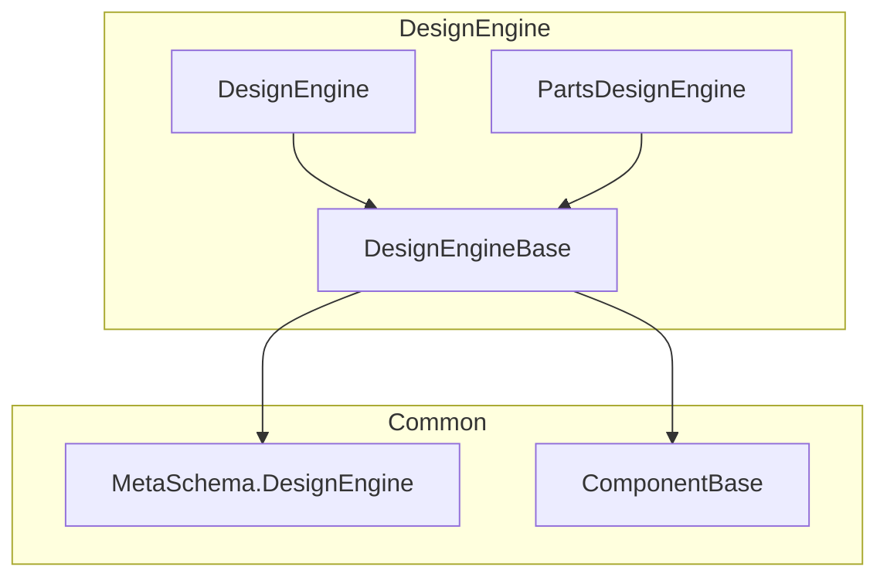
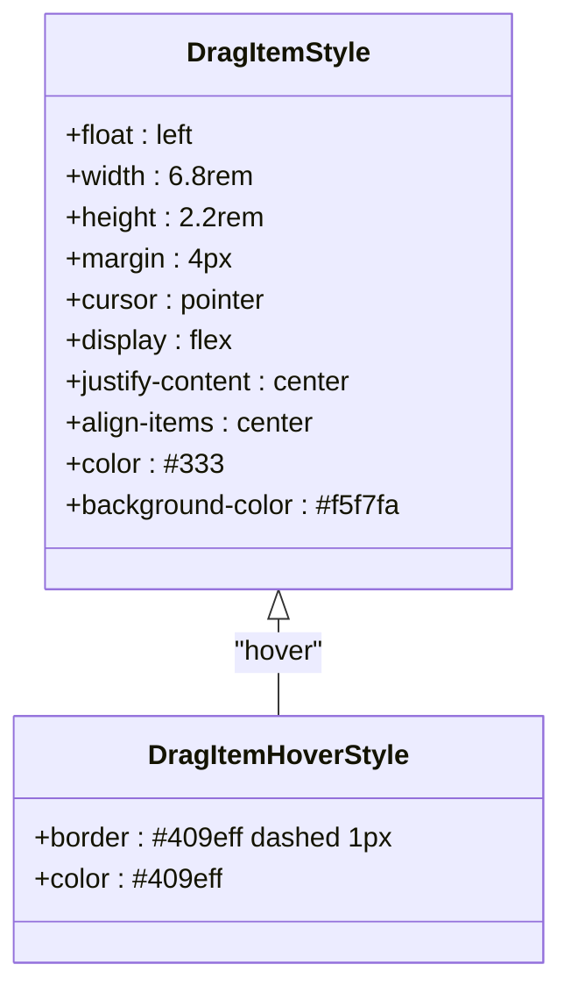
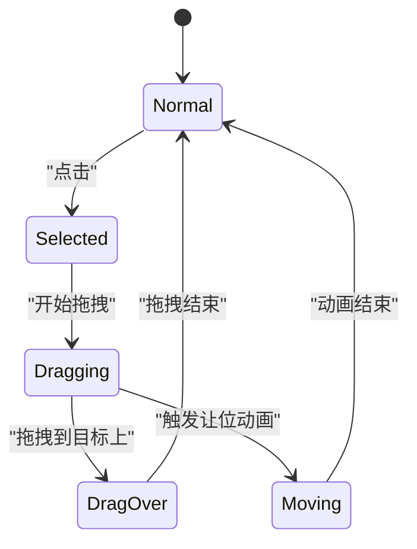
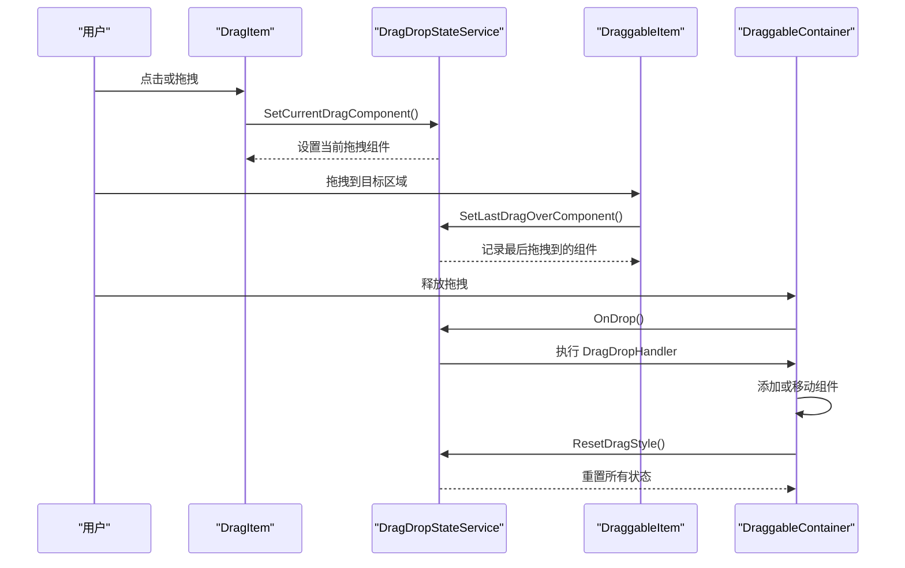

# 拖拽项视觉设计

<cite>
**本文档中引用的文件**   
- [DragItem.razor.css](file://src/DesignEngine/H.LowCode.DesignEngine/ComponentPanel/DragItem.razor.css)
- [DragItem.razor](file://src/DesignEngine/H.LowCode.DesignEngine/ComponentPanel/DragItem.razor)
- [DraggableItem.razor.css](file://src/DesignEngine/H.LowCode.DesignEngineBase/DraggableComponents/DraggableItem.razor.css)
- [DraggableItem.razor](file://src/DesignEngine/H.LowCode.DesignEngineBase/DraggableComponents/DraggableItem.razor)
- [DraggableContainer.razor](file://src/DesignEngine/H.LowCode.DesignEngineBase/DraggableComponents/DraggableContainer.razor)
- [ComponentItem.razor](file://src/DesignEngine/H.LowCode.DesignEngineBase/DraggableComponents/ComponentItem.razor)
- [ComponentPartsSchema.cs](file://src/Common/H.LowCode.MetaSchema.DesignEngine/ComponentPartsSchema.cs)
</cite>

## 目录
1. [引言](#引言)
2. [项目结构分析](#项目结构分析)
3. [核心组件分析](#核心组件分析)
4. [DragItem.razor.css 样式详解](#dragitemrazorcss-样式详解)
5. [DraggableItem 组件实现机制](#draggableitem-组件实现机制)
6. [组件绑定与数据模型](#组件绑定与数据模型)
7. [拖拽交互逻辑分析](#拖拽交互逻辑分析)
8. [响应式设计与高分辨率适配](#响应式设计与高分辨率适配)
9. [结论](#结论)

## 引言
本文档详细说明了在低代码设计引擎中，`DragItem.razor.css` 文件定义的 CSS 类如何控制组件面板中可拖拽项的外观与布局。通过深入分析样式规则对边框、阴影、过渡动画、悬停效果的实现机制，并结合 Blazor 组件模板分析其与 `DraggableItem` 组件的绑定关系，全面阐述了拖拽项的视觉设计体系。文档还提供了实际样式应用示例，展示了不同组件类型在拖拽面板中的视觉差异化呈现，并探讨了响应式设计考量及在高分辨率屏幕下的适配策略。

## 项目结构分析
项目采用分层架构设计，主要分为 `Common`、`DesignEngine` 和 `RenderEngine` 三大模块。`DesignEngine` 模块负责设计时的用户界面和交互逻辑，其中 `H.LowCode.DesignEngine` 和 `H.LowCode.PartsDesignEngine` 子模块分别处理主设计面板和部件设计面板的可拖拽项。`DragItem.razor.css` 文件位于 `ComponentPanel` 目录下，是控制组件面板中可拖拽项视觉表现的核心样式文件。

**Diagram sources**
- [DragItem.razor.css](file://src/DesignEngine/H.LowCode.DesignEngine/ComponentPanel/DragItem.razor.css)
- [ComponentPartsSchema.cs](file://src/Common/H.LowCode.MetaSchema.DesignEngine/ComponentPartsSchema.cs)

## 核心组件分析
系统中的核心可拖拽组件包括 `DragItem`、`DraggableItem` 和 `DraggableContainer`。`DragItem` 是组件面板中的可拖拽项，用于将组件添加到设计面板；`DraggableItem` 是设计面板中已放置的可拖拽组件实例；`DraggableContainer` 是用于容纳其他组件的容器。这些组件通过 `DragDropStateService` 服务进行状态管理和事件通信，形成了完整的拖拽交互体系。

**Section sources**
- [DragItem.razor](file://src/DesignEngine/H.LowCode.DesignEngine/ComponentPanel/DragItem.razor)
- [DraggableItem.razor](file://src/DesignEngine/H.LowCode.DesignEngineBase/DraggableComponents/DraggableItem.razor)
- [DraggableContainer.razor](file://src/DesignEngine/H.LowCode.DesignEngineBase/DraggableComponents/DraggableContainer.razor)

## DragItem.razor.css 样式详解
`DragItem.razor.css` 文件定义了 `.dragitem` 类，该类控制了组件面板中可拖拽项的基本外观和交互效果。

### 基础布局与外观
`.dragitem` 类通过以下属性定义了可拖拽项的基础样式：
- **浮动布局**：`float: left` 使多个可拖拽项在面板中水平排列。
- **尺寸控制**：`width: 6.8rem; height: 2.2rem` 定义了项的固定尺寸，确保视觉一致性。
- **居中对齐**：`display: flex; justify-content: center; align-items: center` 实现了内容在项内的水平和垂直居中。
- **视觉样式**：`color: #333; background-color: #f5f7fa` 定义了默认的文字颜色和背景色，提供清晰的视觉层次。

### 悬停效果
`.dragitem:hover` 选择器定义了鼠标悬停时的视觉反馈：
- **边框变化**：`border: #409eff dashed 1px` 将边框变为蓝色虚线，明确指示该项可交互。
- **文字变色**：`color: #409eff` 将文字颜色变为蓝色，增强视觉反馈，提升用户体验。

**Diagram sources**
- [DragItem.razor.css](file://src/DesignEngine/H.LowCode.DesignEngine/ComponentPanel/DragItem.razor.css)

## DraggableItem 组件实现机制
`DraggableItem` 组件是设计面板中可拖拽项的核心实现，其样式和行为由 `DraggableItem.razor.css` 文件定义。

### 外层容器样式
`.draggableitem-box` 类定义了外层容器的样式：
- **固定高度**：`height: 85px` 为容器提供统一的高度基准。
- **边框与过渡**：`border: #f0f2f5 solid 2px` 定义了浅灰色边框，`transition: all 0.25s cubic-bezier(0.2, 0, 0.2, 1)` 为所有属性变化添加平滑的过渡动画。
- **3D 变换优化**：`backface-visibility: hidden; transform-style: preserve-3d` 优化了 3D 变换的性能。

### 内层项样式
`.draggableitem` 类定义了内层可拖拽项的样式：
- **相对定位**：`position: relative` 允许内部元素进行绝对定位。
- **光标样式**：`cursor: grab` 在鼠标悬停时显示抓取光标，直观地提示用户可以拖拽。
- **过渡效果**：`transition: all 0.2s ease-out` 为状态变化提供流畅的动画。

### 交互状态样式
组件定义了多种交互状态的样式类：
- **选中状态**：`.draggableitem-selected` 添加蓝色实线轮廓和阴影，明确指示当前选中项。
- **拖拽中状态**：`.draggableitem-dragging` 提升 `z-index` 至 9999，确保拖拽项位于最上层，并增加阴影深度。
- **拖拽目标状态**：`.draggableitem-drag-over` 改变背景色和边框样式，清晰地指示可放置区域。
- **让位动画状态**：`.draggableitem-moving` 降低透明度，视觉上表示该组件正在为拖拽项让位。

**Diagram sources**
- [DraggableItem.razor.css](file://src/DesignEngine/H.LowCode.DesignEngineBase/DraggableComponents/DraggableItem.razor.css)

## 组件绑定与数据模型
`DragItem` 和 `DraggableItem` 组件通过 `ComponentPartsSchema` 数据模型与后端逻辑进行绑定。

### 数据模型结构
`ComponentPartsSchema` 类是可拖拽项的核心数据模型，其关键属性包括：
- **标识信息**：`ComponentId`、`ComponentName`、`Label` 用于唯一标识和显示组件。
- **类型信息**：`ComponentType` 区分原子组件和组合组件，`IsContainer` 标记是否为容器。
- **设计状态**：`DesignState` 属性（`[JsonIgnore]`）存储设计时的临时状态，如 `IsSelected`、`IsAnimating` 等，这些状态不持久化。

### 组件绑定机制
在 `DragItem.razor` 中，通过 `[Parameter] public ComponentPartsSchema Component { get; set; }` 将数据模型注入组件。组件的显示内容 `@Component.Label` 直接绑定到模型的 `Label` 属性。当用户点击或拖拽时，组件会调用 `DragDropStateService` 服务，将 `Component` 的深拷贝（通过 `DeepClone()` 方法）传递给设计面板，实现了数据的解耦和安全传递。

**Section sources**
- [DragItem.razor](file://src/DesignEngine/H.LowCode.DesignEngine/ComponentPanel/DragItem.razor)
- [DraggableItem.razor](file://src/DesignEngine/H.LowCode.DesignEngineBase/DraggableComponents/DraggableItem.razor)
- [ComponentPartsSchema.cs](file://src/Common/H.LowCode.MetaSchema.DesignEngine/ComponentPartsSchema.cs)

## 拖拽交互逻辑分析
系统的拖拽交互逻辑通过 Blazor 事件和 `DragDropStateService` 服务协同实现。

### 事件流分析

**Diagram sources**
- [DragItem.razor](file://src/DesignEngine/H.LowCode.DesignEngine/ComponentPanel/DragItem.razor)
- [DraggableItem.razor](file://src/DesignEngine/H.LowCode.DesignEngineBase/DraggableComponents/DraggableItem.razor)
- [DraggableContainer.razor](file://src/DesignEngine/H.LowCode.DesignEngineBase/DraggableComponents/DraggableContainer.razor)
- [DragDropStateService.cs](file://src/DesignEngine/H.LowCode.DesignEngineBase/Services/DragDropStateService.cs)

### 实际应用示例
不同类型的组件在拖拽面板中通过 `ComponentItem` 组件进行差异化呈现：
- **表单组件**：显示为带有输入框图标的项，背景色为浅蓝色。
- **容器组件**：显示为带有网格图标的项，背景色为浅灰色，尺寸更大。
- **按钮组件**：显示为带有手形图标的项，背景色为浅绿色。

这种视觉差异化帮助用户快速识别组件类型，提升设计效率。

## 响应式设计与高分辨率适配
系统通过多种机制实现响应式设计和高分辨率适配。

### 响应式布局
`DraggableItem` 组件的宽度通过计算动态设置：`width: @((Component.Style.ItemWidth > 4 ? Component.Style.ItemWidth : (IsInRootContainer ? 24/PageCascading.PageLayout : 24)) /24 * 100)%`。该表达式根据 `PageLayout`（如 12 或 24 列）动态计算宽度百分比，确保在不同屏幕尺寸下都能合理布局。

### 高分辨率适配
- **GPU 加速**：大量使用 `transform: translate3d()` 和 `backface-visibility: hidden`，触发 GPU 硬件加速，确保在高分辨率屏幕上动画流畅。
- **防抖机制**：在 `OnDragOver` 事件中使用 `UPDATE_INTERVAL_MS` 常量（约 16ms）限制更新频率，防止在高刷新率屏幕上产生性能瓶颈。
- **清晰的视觉反馈**：使用 `box-shadow` 和 `rgba` 颜色值，在高 PPI 屏幕上提供细腻的视觉层次。

## 结论
本文档全面分析了低代码平台中拖拽项的视觉设计体系。`DragItem.razor.css` 通过简洁的 CSS 规则定义了组件面板中可拖拽项的基础样式和悬停效果。`DraggableItem` 组件利用丰富的 CSS 类和 Blazor 事件，实现了复杂的拖拽交互、动画效果和状态管理。通过 `ComponentPartsSchema` 数据模型，实现了组件与数据的紧密绑定。整个系统采用响应式设计，并通过 GPU 加速等技术确保在高分辨率屏幕上的流畅体验。这一设计模式为构建直观、高效的低代码设计界面提供了坚实的基础。