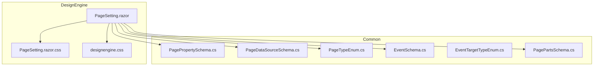
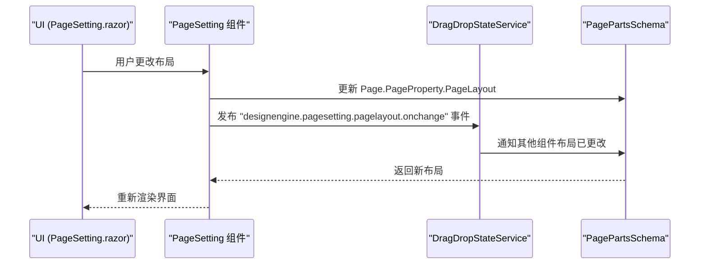
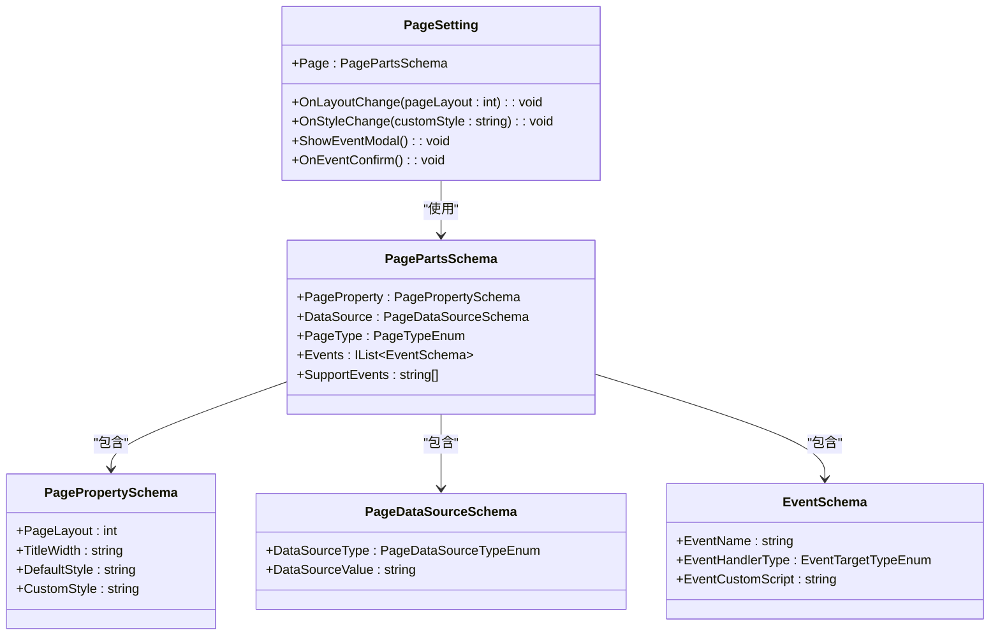
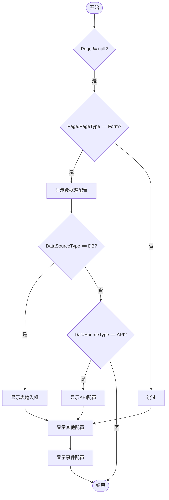
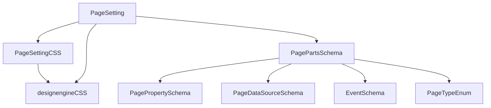

# 页面属性设置界面

<cite>
**本文档引用的文件**  
- [PageSetting.razor.css](file://src/DesignEngine/H.LowCode.DesignEngine/SettingPanel/PageSetting.razor.css)
- [PageSetting.razor](file://src/DesignEngine/H.LowCode.DesignEngine/SettingPanel/PageSetting.razor)
- [PagePropertySchema.cs](file://src/Common/H.LowCode.MetaSchema/PropertySchemas/PagePropertySchema.cs)
- [PageDataSourceSchema.cs](file://src/Common/H.LowCode.MetaSchema/DataSourceSchemas/PageDataSourceSchema.cs)
- [PageTypeEnum.cs](file://src/Common/H.LowCode.MetaSchema/Enums/PageTypeEnum.cs)
- [EventSchema.cs](file://src/Common/H.LowCode.MetaSchema/PropertySchemas/EventSchema.cs)
- [EventTargetTypeEnum.cs](file://src/Common/H.LowCode.MetaSchema/Enums/EventTargetTypeEnum.cs)
- [PagePartsSchema.cs](file://src/Common/H.LowCode.MetaSchema.DesignEngine/PagePartsSchema.cs)
- [designengine.css](file://src/DesignEngine/H.LowCode.DesignEngine/wwwroot/designengine.css)
</cite>

## 目录
1. [简介](#简介)
2. [项目结构](#项目结构)
3. [核心组件](#核心组件)
4. [架构概览](#架构概览)
5. [详细组件分析](#详细组件分析)
6. [依赖分析](#依赖分析)
7. [性能考量](#性能考量)
8. [故障排除指南](#故障排除指南)
9. [结论](#结论)

## 简介
本文档深入解析 `PageSetting.razor.css` 在页面属性配置面板中的作用，说明其定义的布局结构、表单控件样式、标签对齐方式及响应式断点设置。结合 `SettingPanel` 组件分析 CSS 类如何与 Blazor 的 `EditForm`、`InputText` 等组件协同工作，实现动态属性编辑界面。展示页面背景色、尺寸、边距等配置项的 UI 呈现逻辑，并解释主题变量的使用方式以支持未来主题扩展。

## 项目结构
项目采用模块化分层架构，主要分为 `meta`（元数据）、`src`（源码）和工具模块。`src` 目录下包含 `Common`（通用组件）、`DesignEngine`（设计引擎）、`RenderEngine`（渲染引擎）等核心模块。页面属性设置功能位于 `DesignEngine` 模块的 `SettingPanel` 组件中，通过 `PageSetting.razor` 和 `PageSetting.razor.css` 实现。

**图示来源**
- [PageSetting.razor](file://src/DesignEngine/H.LowCode.DesignEngine/SettingPanel/PageSetting.razor)
- [PageSetting.razor.css](file://src/DesignEngine/H.LowCode.DesignEngine/SettingPanel/PageSetting.razor.css)
- [designengine.css](file://src/DesignEngine/H.LowCode.DesignEngine/wwwroot/designengine.css)
- [PagePropertySchema.cs](file://src/Common/H.LowCode.MetaSchema/PropertySchemas/PagePropertySchema.cs)
- [PageDataSourceSchema.cs](file://src/Common/H.LowCode.MetaSchema/DataSourceSchemas/PageDataSourceSchema.cs)
- [PageTypeEnum.cs](file://src/Common/H.LowCode.MetaSchema/Enums/PageTypeEnum.cs)
- [EventSchema.cs](file://src/Common/H.LowCode.MetaSchema/PropertySchemas/EventSchema.cs)
- [EventTargetTypeEnum.cs](file://src/Common/H.LowCode.MetaSchema/Enums/EventTargetTypeEnum.cs)
- [PagePartsSchema.cs](file://src/Common/H.LowCode.MetaSchema.DesignEngine/PagePartsSchema.cs)

**本节来源**
- [PageSetting.razor](file://src/DesignEngine/H.LowCode.DesignEngine/SettingPanel/PageSetting.razor)
- [PageSetting.razor.css](file://src/DesignEngine/H.LowCode.DesignEngine/SettingPanel/PageSetting.razor.css)

## 核心组件
`PageSetting.razor` 是页面属性配置面板的核心组件，它使用 Blazor 框架构建，通过绑定 `PagePartsSchema` 模型实现对页面属性的动态编辑。其对应的 CSS 文件 `PageSetting.razor.css` 定义了 `.pagesetting-item` 类，用于统一配置项的外边距，确保 UI 布局的一致性。

**本节来源**
- [PageSetting.razor](file://src/DesignEngine/H.LowCode.DesignEngine/SettingPanel/PageSetting.razor)
- [PageSetting.razor.css](file://src/DesignEngine/H.LowCode.DesignEngine/SettingPanel/PageSetting.razor.css)

## 架构概览
系统采用前后端分离架构，`DesignEngine` 负责可视化设计，`RenderEngine` 负责运行时渲染。`PageSetting` 组件作为 `DesignEngine` 的一部分，通过 `DragDropStateService` 获取当前编辑的 `PagePartsSchema` 实例，并利用 Blazor 的数据绑定机制 (`@bind-Value`) 将 UI 操作实时同步到模型中。

**图示来源**
- [PageSetting.razor](file://src/DesignEngine/H.LowCode.DesignEngine/SettingPanel/PageSetting.razor)
- [DragDropStateService.cs](file://src/DesignEngine/H.LowCode.DesignEngineBase/Services/DragDropStateService.cs)
- [PagePartsSchema.cs](file://src/Common/H.LowCode.MetaSchema.DesignEngine/PagePartsSchema.cs)

## 详细组件分析

### PageSetting 组件分析
`PageSetting` 组件根据 `Page` 模型的状态动态渲染不同的配置项。其核心功能包括布局选择、数据源配置、自定义样式编辑和事件管理。

#### 布局与样式结构
组件使用 `div` 容器和 `label` 标签构建表单项，通过 `pagesetting-item` CSS 类控制外边距。Ant Design Blazor 的 `RadioGroup`、`Input`、`TextArea` 等组件用于提供用户交互。

**图示来源**
- [PageSetting.razor](file://src/DesignEngine/H.LowCode.DesignEngine/SettingPanel/PageSetting.razor)
- [PagePartsSchema.cs](file://src/Common/H.LowCode.MetaSchema.DesignEngine/PagePartsSchema.cs)
- [PagePropertySchema.cs](file://src/Common/H.LowCode.MetaSchema/PropertySchemas/PagePropertySchema.cs)
- [PageDataSourceSchema.cs](file://src/Common/H.LowCode.MetaSchema/DataSourceSchemas/PageDataSourceSchema.cs)
- [EventSchema.cs](file://src/Common/H.LowCode.MetaSchema/PropertySchemas/EventSchema.cs)

#### 条件渲染逻辑
组件使用 Razor 语法进行条件渲染。当 `Page.PageType` 为 `Form` 时，显示数据源配置区域。根据 `DataSourceType` 的不同，动态显示“表”或“API”输入框。

**图示来源**
- [PageSetting.razor](file://src/DesignEngine/H.LowCode.DesignEngine/SettingPanel/PageSetting.razor)
- [PageTypeEnum.cs](file://src/Common/H.LowCode.MetaSchema/Enums/PageTypeEnum.cs)

**本节来源**
- [PageSetting.razor](file://src/DesignEngine/H.LowCode.DesignEngine/SettingPanel/PageSetting.razor)
- [PagePartsSchema.cs](file://src/Common/H.LowCode.MetaSchema.DesignEngine/PagePartsSchema.cs)
- [PagePropertySchema.cs](file://src/Common/H.LowCode.MetaSchema/PropertySchemas/PagePropertySchema.cs)
- [PageDataSourceSchema.cs](file://src/Common/H.LowCode.MetaSchema/DataSourceSchemas/PageDataSourceSchema.cs)
- [PageTypeEnum.cs](file://src/Common/H.LowCode.MetaSchema/Enums/PageTypeEnum.cs)
- [EventSchema.cs](file://src/Common/H.LowCode.MetaSchema/PropertySchemas/EventSchema.cs)

## 依赖分析
`PageSetting` 组件依赖于多个核心模型和样式文件。`PagePartsSchema` 作为数据模型，聚合了页面的所有配置信息。`PagePropertySchema` 和 `PageDataSourceSchema` 提供了具体的属性定义。`designengine.css` 提供了全局样式覆盖，确保组件在 `settingpanel` 容器中正确显示。

**图示来源**
- [PageSetting.razor](file://src/DesignEngine/H.LowCode.DesignEngine/SettingPanel/PageSetting.razor)
- [PageSetting.razor.css](file://src/DesignEngine/H.LowCode.DesignEngine/SettingPanel/PageSetting.razor.css)
- [designengine.css](file://src/DesignEngine/H.LowCode.DesignEngine/wwwroot/designengine.css)
- [PagePartsSchema.cs](file://src/Common/H.LowCode.MetaSchema.DesignEngine/PagePartsSchema.cs)
- [PagePropertySchema.cs](file://src/Common/H.LowCode.MetaSchema/PropertySchemas/PagePropertySchema.cs)
- [PageDataSourceSchema.cs](file://src/Common/H.LowCode.MetaSchema/DataSourceSchemas/PageDataSourceSchema.cs)
- [EventSchema.cs](file://src/Common/H.LowCode.MetaSchema/PropertySchemas/EventSchema.cs)
- [PageTypeEnum.cs](file://src/Common/H.LowCode.MetaSchema/Enums/PageTypeEnum.cs)

**本节来源**
- [PageSetting.razor](file://src/DesignEngine/H.LowCode.DesignEngine/SettingPanel/PageSetting.razor)
- [PageSetting.razor.css](file://src/DesignEngine/H.LowCode.DesignEngine/SettingPanel/PageSetting.razor.css)
- [designengine.css](file://src/DesignEngine/H.LowCode.DesignEngine/wwwroot/designengine.css)

## 性能考量
组件的性能主要受数据绑定和事件发布的影响。`OnLayoutChange` 方法通过 `BlazorEventDispatcher` 发布事件，避免了直接操作 DOM，保证了响应式更新的效率。`TextArea` 的 `OnChange` 事件在用户输入时触发，应考虑防抖处理以优化性能。

## 故障排除指南
- **问题：配置项未保存**
  - 检查 `@bind-Value` 是否正确绑定到 `Page` 模型的属性。
  - 确认 `Page` 模型是否为引用类型且在父组件中正确传递。
- **问题：UI 样式错乱**
  - 检查 `designengine.css` 是否被正确加载。
  - 确认 `settingpanel` 容器的高度是否设置为 100%。
- **问题：事件配置模态框不显示**
  - 检查 `_eventVisible` 变量的绑定是否正确。
  - 确认 `Modal` 组件的 `Width` 属性是否设置合理。

**本节来源**
- [PageSetting.razor](file://src/DesignEngine/H.LowCode.DesignEngine/SettingPanel/PageSetting.razor)

## 结论
`PageSetting.razor.css` 通过定义 `.pagesetting-item` 类，为页面属性配置面板提供了统一的布局间距。`PageSetting.razor` 组件巧妙地结合 Blazor 的数据绑定和条件渲染，实现了动态、响应式的属性编辑界面。通过 `PagePropertySchema` 和 `PageDataSourceSchema` 等模型，系统将复杂的页面配置逻辑抽象为清晰的数据结构，为未来的主题扩展和功能迭代奠定了坚实的基础。