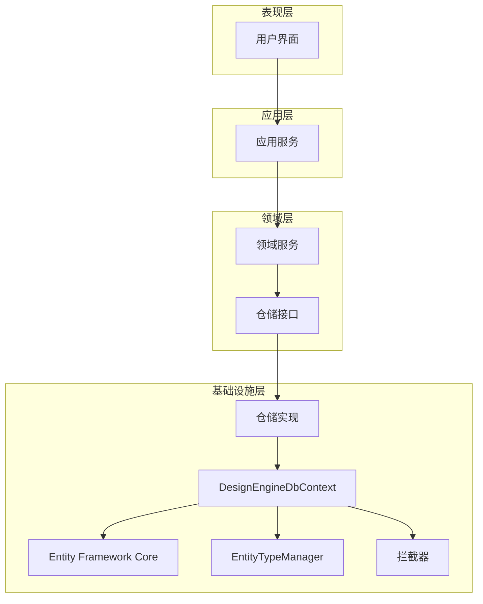
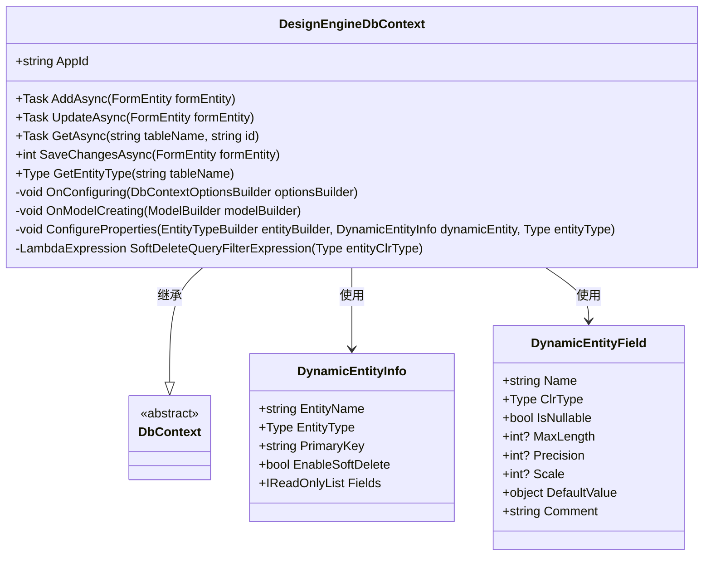
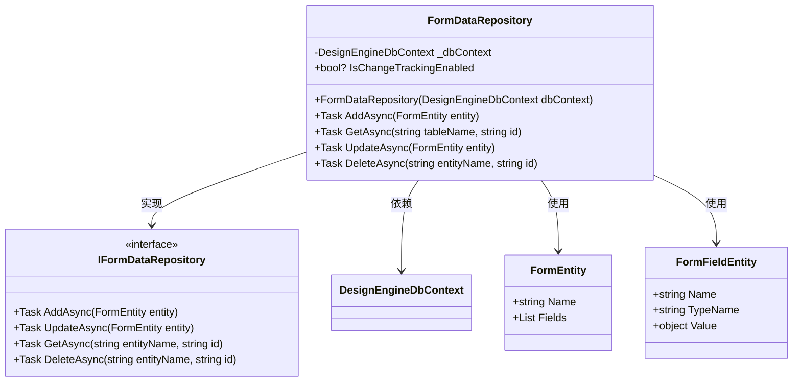
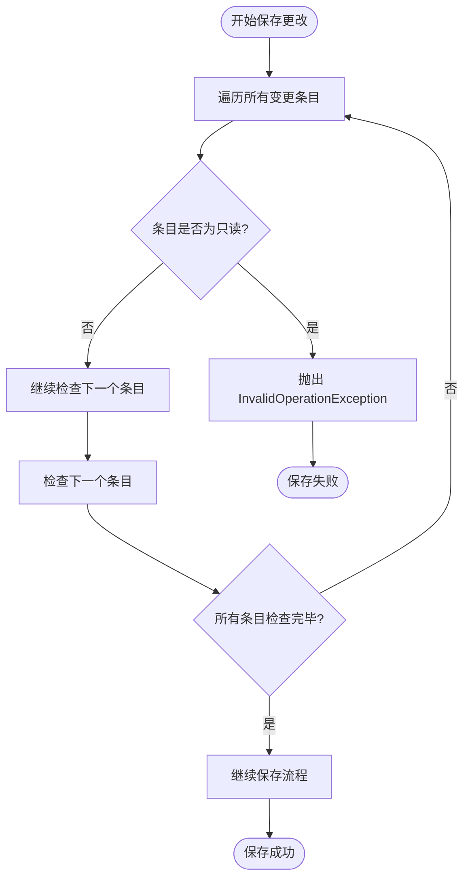
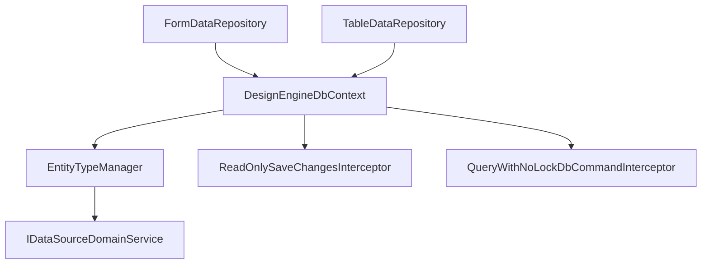

# Entity Framework Core仓储实现

<cite>
**本文档引用的文件**  
- [DesignEngineDbContext.cs](file://src/DesignEngine/H.LowCode.DesignEngine.EntityFrameworkCore/EntityFrameworkCore/DesignEngineDbContext.cs)
- [FormDataRepository.cs](file://src/DesignEngine/H.LowCode.DesignEngine.EntityFrameworkCore/DataRepositories/FormDataRepository.cs)
- [TableDataRepository.cs](file://src/DesignEngine/H.LowCode.DesignEngine.EntityFrameworkCore/DataRepositories/TableDataRepository.cs)
- [EntityTypeManager.cs](file://src/DesignEngine/H.LowCode.DesignEngine.EntityFrameworkCore/EntityManager/EntityTypeManager.cs)
- [ReadOnlySaveChangesInterceptor.cs](file://src/DesignEngine/H.LowCode.DesignEngine.EntityFrameworkCore/EntityFrameworkCore/Extensions/ReadOnlySaveChangesInterceptor.cs)
- [QueryWithNoLockDbCommandInterceptor.cs](file://src/DesignEngine/H.LowCode.DesignEngine.EntityFrameworkCore/EntityFrameworkCore/Extensions/QueryWithNoLockDbCommandInterceptor.cs)
- [IFormDataRepository.cs](file://src/DesignEngine/H.LowCode.DesignEngine.Domain/DataRepositories/IFormDataRepository.cs)
- [EntityBase.cs](file://src/Common/H.LowCode.Entity/Base/EntityBase.cs)
</cite>

## 目录
1. [引言](#引言)
2. [项目结构](#项目结构)
3. [核心组件](#核心组件)
4. [架构概述](#架构概述)
5. [详细组件分析](#详细组件分析)
6. [依赖分析](#依赖分析)
7. [性能考量](#性能考量)
8. [故障排除指南](#故障排除指南)
9. [结论](#结论)

## 引言
本文档详细解析基于Entity Framework Core的数据库仓储实现，重点阐述`FormDataRepository`和`TableDataRepository`如何通过`DesignEngineDbContext`访问关系型数据库，实现表单与表格数据的增删改查（CRUD）操作。文档将深入分析`DbContext`的实体映射配置、查询优化策略（如使用`NoLock`提示）以及通过`EntityTypeManager`动态管理实体类型的机制。同时，将探讨`ReadOnlySaveChangesInterceptor`等扩展组件在保障数据一致性方面的作用。最后，对比JSON文件存储，说明EF Core在事务支持、并发控制和复杂查询方面的优势，以及相应的配置与迁移管理方法。

## 项目结构
本项目采用分层架构，主要分为`Common`、`DesignEngine`和`RenderEngine`三大模块。`Common`模块存放跨领域共享的实体、配置和基础类。`DesignEngine`和`RenderEngine`分别负责设计时和运行时的功能，两者都实现了基于EF Core的数据访问层。`DesignEngine.EntityFrameworkCore`项目是分析的核心，它包含了`DesignEngineDbContext`、仓储实现、实体类型管理器和EF Core拦截器等关键组件。

**Section sources**
- [DesignEngineDbContext.cs](file://src/DesignEngine/H.LowCode.DesignEngine.EntityFrameworkCore/EntityFrameworkCore/DesignEngineDbContext.cs)
- [FormDataRepository.cs](file://src/DesignEngine/H.LowCode.DesignEngine.EntityFrameworkCore/DataRepositories/FormDataRepository.cs)

## 核心组件
核心组件包括`DesignEngineDbContext`、`FormDataRepository`、`TableDataRepository`、`EntityTypeManager`以及`ReadOnlySaveChangesInterceptor`和`QueryWithNoLockDbCommandInterceptor`两个拦截器。`DesignEngineDbContext`是EF Core的数据库上下文，负责管理实体的生命周期和数据库连接。`FormDataRepository`和`TableDataRepository`是具体的仓储实现，为上层业务逻辑提供数据访问接口。`EntityTypeManager`负责在运行时动态创建和管理实体类型。拦截器则用于在数据保存和查询执行前进行干预，以实现特定的业务规则和性能优化。

**Section sources**
- [DesignEngineDbContext.cs](file://src/DesignEngine/H.LowCode.DesignEngine.EntityFrameworkCore/EntityFrameworkCore/DesignEngineDbContext.cs)
- [FormDataRepository.cs](file://src/DesignEngine/H.LowCode.DesignEngine.EntityFrameworkCore/DataRepositories/FormDataRepository.cs)
- [TableDataRepository.cs](file://src/DesignEngine/H.LowCode.DesignEngine.EntityFrameworkCore/DataRepositories/TableDataRepository.cs)
- [EntityTypeManager.cs](file://src/DesignEngine/H.LowCode.DesignEngine.EntityFrameworkCore/EntityManager/EntityTypeManager.cs)
- [ReadOnlySaveChangesInterceptor.cs](file://src/DesignEngine/H.LowCode.DesignEngine.EntityFrameworkCore/EntityFrameworkCore/Extensions/ReadOnlySaveChangesInterceptor.cs)
- [QueryWithNoLockDbCommandInterceptor.cs](file://src/DesignEngine/H.LowCode.DesignEngine.EntityFrameworkCore/EntityFrameworkCore/Extensions/QueryWithNoLockDbCommandInterceptor.cs)

## 架构概述
系统采用经典的领域驱动设计（DDD）分层架构，分为表现层、应用层、领域层和基础设施层。在基础设施层，`DesignEngineDbContext`作为EF Core的入口，通过仓储模式（Repository Pattern）为领域层提供数据访问服务。`EntityTypeManager`利用反射和动态程序集技术，在运行时根据元数据配置动态生成实体类，实现了高度的灵活性。EF Core拦截器则提供了非侵入式的横切关注点（如只读保护和查询优化）实现方式。

**Diagram sources**
- [DesignEngineDbContext.cs](file://src/DesignEngine/H.LowCode.DesignEngine.EntityFrameworkCore/EntityFrameworkCore/DesignEngineDbContext.cs)
- [FormDataRepository.cs](file://src/DesignEngine/H.LowCode.DesignEngine.EntityFrameworkCore/DataRepositories/FormDataRepository.cs)
- [EntityTypeManager.cs](file://src/DesignEngine/H.LowCode.DesignEngine.EntityFrameworkCore/EntityManager/EntityTypeManager.cs)

## 详细组件分析

### DesignEngineDbContext 分析
`DesignEngineDbContext`是整个数据访问层的核心。它继承自`DbContext`，并重写了`OnModelCreating`和`OnConfiguring`方法。

#### OnModelCreating 方法
该方法在模型创建时被调用，负责配置实体与数据库表的映射关系。其核心逻辑是通过`EntityTypeManager`加载所有动态实体（`LoadDynamicEntities`），然后为每个实体执行以下配置：
1.  **表映射**：使用`ToTable`方法将实体类型映射到指定的表名。
2.  **属性映射**：调用`ConfigureProperties`方法，根据`DynamicEntityInfo`中的字段信息，为每个属性配置数据类型、长度、精度、是否可空、默认值和注释。
3.  **主键配置**：使用`HasKey`方法指定主键字段。
4.  **查询过滤器**：如果实体启用了软删除（`EnableSoftDelete`），则添加一个查询过滤器`HasQueryFilter`，自动在所有查询中添加`IsDeleted = 0`的条件，实现逻辑删除。

**Diagram sources**
- [DesignEngineDbContext.cs](file://src/DesignEngine/H.LowCode.DesignEngine.EntityFrameworkCore/EntityFrameworkCore/DesignEngineDbContext.cs)

#### OnConfiguring 方法
该方法在上下文配置时被调用，用于设置数据库连接和注册服务。关键配置包括：
1.  **注册拦截器**：添加了`ReadOnlySaveChangesInterceptor`和`QueryWithNoLockDbCommandInterceptor`。
2.  **替换验证服务**：使用`CustomizeRelationalModelValidator`来处理可能的表重复注册问题。

### FormDataRepository 分析
`FormDataRepository`实现了`IFormDataRepository`接口，是`FormEntity`数据访问的具体实现。

#### 接口契约
`IFormDataRepository`定义了对表单数据的基本CRUD操作：
- `Task<bool> AddAsync(FormEntity entity)`：异步添加新实体。
- `Task<bool> UpdateAsync(FormEntity entity)`：异步更新现有实体。
- `Task<FormEntity> GetAsync(string entityName, string id)`：根据实体名和ID异步获取实体。
- `Task<bool> DeleteAsync(string entityName, string id)`：根据实体名和ID异步删除实体。

#### 实现分析
`FormDataRepository`的实现非常简洁，它通过依赖注入获取`DesignEngineDbContext`实例，并将大部分操作委托给`DbContext`。
- `AddAsync`和`GetAsync`方法直接调用了`DbContext`中对应的`AddAsync`和`GetAsync`方法。
- `UpdateAsync`和`DeleteAsync`方法尚未实现（`NotImplementedException`），这表明该功能可能仍在开发中或由其他机制处理。

**Diagram sources**
- [FormDataRepository.cs](file://src/DesignEngine/H.LowCode.DesignEngine.EntityFrameworkCore/DataRepositories/FormDataRepository.cs)
- [IFormDataRepository.cs](file://src/DesignEngine/H.LowCode.DesignEngine.Domain/DataRepositories/IFormDataRepository.cs)

### EntityTypeManager 分析
`EntityTypeManager`是实现动态实体的关键组件。它在运行时根据元数据（如JSON配置文件）动态创建.NET类型。

#### 工作流程
1.  **初始化程序集**：`InitDynamicAssembly`方法创建一个名为`H.LowCode.DynamicEntity`的动态程序集和模块，所有动态生成的实体类都将定义于此。
2.  **加载元数据**：通过`IDataSourceDomainService`从`caseapp`应用中获取所有实体的元数据（字段、主键、是否启用软删除等）。
3.  **创建实体类型**：对于每个元数据实体，调用`EntityFactory.CreateEntityType`方法，在动态模块中创建一个新的`Type`。该方法会为每个字段定义属性。
4.  **缓存信息**：将创建的`Type`和元数据信息封装成`DynamicEntityInfo`对象，并缓存起来，避免重复创建。

#### 与DbContext的集成
`DesignEngineDbContext`在`OnModelCreating`方法中调用`_entityTypeManager.LoadDynamicEntities()`来获取所有动态实体信息，并据此配置EF Core模型。这使得EF Core能够识别并映射这些在编译时不存在的实体。

**Section sources**
- [EntityTypeManager.cs](file://src/DesignEngine/H.LowCode.DesignEngine.EntityFrameworkCore/EntityManager/EntityTypeManager.cs)
- [DesignEngineDbContext.cs](file://src/DesignEngine/H.LowCode.DesignEngine.EntityFrameworkCore/EntityFrameworkCore/DesignEngineDbContext.cs)

### 扩展组件分析

#### ReadOnlySaveChangesInterceptor
该拦截器实现了`SaveChangesInterceptor`，用于在数据保存前进行检查。

##### 作用
防止被标记为“只读”的实体被修改、删除或添加。它通过检查实体的元数据（`Metadata.FindAnnotation`）中是否存在名为`Custom:ReadOnly`且值为`true`的注解来判断实体是否为只读。

##### 工作流程
- 在`SavingChanges`和`SavingChangesAsync`方法中，遍历`ChangeTracker`中所有状态为`Added`、`Modified`或`Deleted`的实体条目。
- 对于每个条目，调用`IsReadOnly`方法检查其是否为只读。
- 如果发现任何只读实体被修改，则抛出`InvalidOperationException`异常，阻止保存操作。

**Diagram sources**
- [ReadOnlySaveChangesInterceptor.cs](file://src/DesignEngine/H.LowCode.DesignEngine.EntityFrameworkCore/EntityFrameworkCore/Extensions/ReadOnlySaveChangesInterceptor.cs)

#### QueryWithNoLockDbCommandInterceptor
该拦截器实现了`DbCommandInterceptor`，用于在SQL命令执行前修改其文本。

##### 作用
实现查询优化，通过在`SELECT`语句的`FROM`和`JOIN`子句后自动添加`WITH (NOLOCK)`提示，来减少锁争用，提高查询性能。`WITH (NOLOCK)`提示允许查询读取未提交的数据（脏读），适用于对数据一致性要求不高的场景。

##### 工作流程
- 在`ReaderExecuting`方法中，拦截即将执行的`DbCommand`。
- 使用正则表达式`TableAliasRegex`匹配SQL语句中所有`FROM [TableName] AS [Alias]`或`JOIN [TableName] AS [Alias]`的模式，但不包含`WITH (NOLOCK)`的。
- 将匹配到的模式替换为`$& WITH (NOLOCK)`，其中`$&`代表整个匹配的字符串。
- 修改后的SQL命令将包含`WITH (NOLOCK)`提示，然后被发送到数据库执行。

**Section sources**
- [QueryWithNoLockDbCommandInterceptor.cs](file://src/DesignEngine/H.LowCode.DesignEngine.EntityFrameworkCore/EntityFrameworkCore/Extensions/QueryWithNoLockDbCommandInterceptor.cs)

## 依赖分析
系统各组件之间存在清晰的依赖关系。`FormDataRepository`和`TableDataRepository`直接依赖`DesignEngineDbContext`。`DesignEngineDbContext`依赖`EntityTypeManager`来获取实体模型信息，并通过构造函数注入。`EntityTypeManager`依赖`IDataSourceDomainService`来获取元数据。`DbContext`在配置时注册了`ReadOnlySaveChangesInterceptor`和`QueryWithNoLockDbCommandInterceptor`，形成了对这些拦截器的依赖。这种依赖注入的设计使得组件之间松耦合，易于测试和维护。

**Diagram sources**
- [FormDataRepository.cs](file://src/DesignEngine/H.LowCode.DesignEngine.EntityFrameworkCore/DataRepositories/FormDataRepository.cs)
- [TableDataRepository.cs](file://src/DesignEngine/H.LowCode.DesignEngine.EntityFrameworkCore/DataRepositories/TableDataRepository.cs)
- [DesignEngineDbContext.cs](file://src/DesignEngine/H.LowCode.DesignEngine.EntityFrameworkCore/EntityFrameworkCore/DesignEngineDbContext.cs)
- [EntityTypeManager.cs](file://src/DesignEngine/H.LowCode.DesignEngine.EntityFrameworkCore/EntityManager/EntityTypeManager.cs)

## 性能考量
本实现通过多种方式优化性能：
1.  **动态实体缓存**：`EntityTypeManager`缓存了已创建的动态实体类型，避免了重复的类型生成开销。
2.  **查询优化**：`QueryWithNoLockDbCommandInterceptor`通过减少锁争用，显著提升了高并发读取场景下的查询性能。
3.  **延迟加载与变更跟踪**：EF Core内置的变更跟踪机制可以精确地生成更新SQL，避免了全表更新。
4.  **潜在优化点**：`FormDataRepository`中的`GetAsync`方法返回的是`FormEntity`对象，这涉及到从数据库实体到`FormEntity`的转换。对于大数据量的查询，可以考虑提供直接返回`IQueryable`的方法，以支持更灵活的分页和过滤。

## 故障排除指南
- **实体类型找不到**：如果`GetEntityType`方法抛出`ArgumentException`，请检查`EntityTypeManager`加载的元数据是否正确，确保`dynamicEntities`列表中包含该实体。
- **保存更改失败**：如果保存操作抛出`InvalidOperationException`并提示“Entity is marked as read-only”，请检查相关实体的元数据或注解，确认其是否被错误地标记为只读。
- **查询未使用NOLOCK**：如果生成的SQL没有包含`WITH (NOLOCK)`，请检查`QueryWithNoLockDbCommandInterceptor`是否已正确注册到`DbContextOptionsBuilder`中。
- **动态实体创建失败**：如果`EntityFactory.CreateEntityType`失败，请检查传入的字段定义（如类型、名称）是否符合.NET类型创建的规范。

**Section sources**
- [DesignEngineDbContext.cs](file://src/DesignEngine/H.LowCode.DesignEngine.EntityFrameworkCore/EntityFrameworkCore/DesignEngineDbContext.cs#L190-L199)
- [ReadOnlySaveChangesInterceptor.cs](file://src/DesignEngine/H.LowCode.DesignEngine.EntityFrameworkCore/EntityFrameworkCore/Extensions/ReadOnlySaveChangesInterceptor.cs#L10-L15)
- [QueryWithNoLockDbCommandInterceptor.cs](file://src/DesignEngine/H.LowCode.DesignEngine.EntityFrameworkCore/EntityFrameworkCore/Extensions/QueryWithNoLockDbCommandInterceptor.cs#L25-L30)

## 结论
本文档详细解析了基于Entity Framework Core的动态仓储实现。该设计通过`EntityTypeManager`实现了高度的灵活性，能够根据运行时元数据动态映射数据库表。`DesignEngineDbContext`作为核心，不仅管理实体映射和数据访问，还通过拦截器机制优雅地实现了只读保护和查询优化等横切关注点。尽管`FormDataRepository`的部分方法尚未实现，但其整体架构清晰，遵循了良好的设计原则。相较于JSON文件存储，该EF Core实现提供了强大的事务支持、并发控制能力和复杂的LINQ查询功能，更适合构建企业级应用。通过合理的配置和迁移管理，可以确保数据库模式与应用逻辑的同步演进。