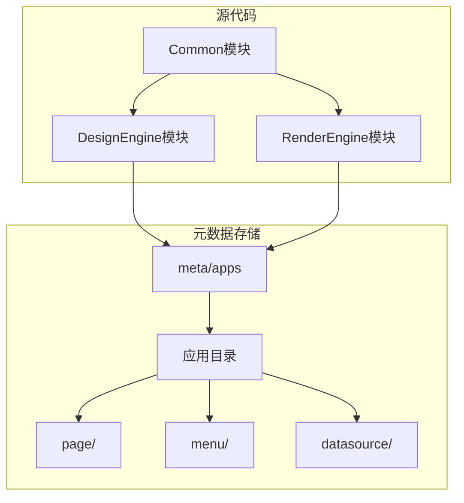
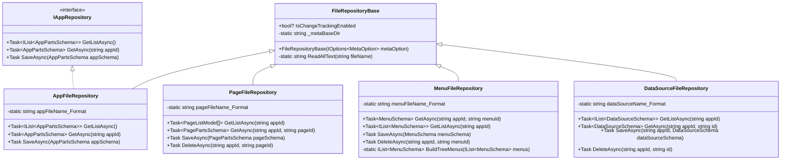

# JSON文件仓储实现

<cite>
**本文档引用的文件**  
- [FileRepositoryBase.cs](file://src/DesignEngine/H.LowCode.DesignEngine.Repository.JsonFile/Base/FileRepositoryBase.cs)
- [AppFileRepository.cs](file://src/DesignEngine/H.LowCode.DesignEngine.Repository.JsonFile/Repositories/AppFileRepository.cs)
- [PageFileRepository.cs](file://src/DesignEngine/H.LowCode.DesignEngine.Repository.JsonFile/Repositories/PageFileRepository.cs)
- [MenuFileRepository.cs](file://src/DesignEngine/H.LowCode.DesignEngine.Repository.JsonFile/Repositories/MenuFileRepository.cs)
- [DataSourceFileRepository.cs](file://src/DesignEngine/H.LowCode.DesignEngine.Repository.JsonFile/Repositories/DataSourceFileRepository.cs)
- [IAppRepository.cs](file://src/DesignEngine/H.LowCode.DesignEngine.Domain/MetaRepositories/IAppRepository.cs)
- [MetaOption.cs](file://src/Common/H.LowCode.Configuration/Options/MetaOption.cs)
- [caseapp.json](file://meta/apps/caseapp/caseapp.json)
- [0lgu6xpop.json](file://meta/apps/caseapp/page/0lgu6xpop.json)
- [5omcgxevf.json](file://meta/apps/caseapp/menu/5omcgxevf.json)
- [iumn5yg5t.json](file://meta/apps/caseapp/datasource/iumn5yg5t.json)
</cite>

## 目录
1. [简介](#简介)
2. [项目结构](#项目结构)
3. [核心组件](#核心组件)
4. [架构概述](#架构概述)
5. [详细组件分析](#详细组件分析)
6. [依赖分析](#依赖分析)
7. [性能考量](#性能考量)
8. [故障排除指南](#故障排除指南)
9. [结论](#结论)

## 简介
本文档深入分析基于JSON文件的仓储实现机制，重点阐述`FileRepositoryBase`作为所有文件仓储基类的设计原理，包括元数据序列化、反序列化、文件路径管理与读写异常处理。详细说明`AppFileRepository`如何实现`IAppRepository`接口，完成应用元数据在`meta/apps`目录下的持久化存储与加载流程。解释`PageFileRepository`、`MenuFileRepository`和`DataSourceFileRepository`对各自领域对象的文件操作逻辑，以及如何通过约定的文件命名规则（如GUID.json）维护数据一致性。提供JSON仓储的性能瓶颈分析、并发访问控制策略及适用场景建议。

## 项目结构
项目采用分层架构设计，将设计引擎（DesignEngine）与渲染引擎（RenderEngine）分离，各自拥有独立的JSON文件仓储实现。核心元数据模型定义在`H.LowCode.MetaSchema`中，而仓储逻辑位于`H.LowCode.DesignEngine.Repository.JsonFile`和`H.LowCode.RenderEngine.Repository.JsonFile`模块中。元数据以JSON格式存储在`meta/apps`目录下，按应用ID组织为子目录，并进一步按类型（page、menu、datasource）分类存储。



**图示来源**
- [FileRepositoryBase.cs](file://src/DesignEngine/H.LowCode.DesignEngine.Repository.JsonFile/Base/FileRepositoryBase.cs)
- [meta/apps](file://meta/apps)

## 核心组件
核心组件包括`FileRepositoryBase`基类、`AppFileRepository`、`PageFileRepository`、`MenuFileRepository`和`DataSourceFileRepository`。这些类共同构成了基于文件系统的元数据持久化层，通过统一的接口契约（如`IAppRepository`）与上层业务逻辑解耦。

**本节来源**
- [FileRepositoryBase.cs](file://src/DesignEngine/H.LowCode.DesignEngine.Repository.JsonFile/Base/FileRepositoryBase.cs)
- [AppFileRepository.cs](file://src/DesignEngine/H.LowCode.DesignEngine.Repository.JsonFile/Repositories/AppFileRepository.cs)

## 架构概述
系统采用模块化设计，仓储层位于领域层（Domain）与基础设施层（Infrastructure）之间。`FileRepositoryBase`提供基础文件操作，具体仓储类实现领域接口，完成特定实体的CRUD操作。元数据配置通过`MetaOption`注入，确保路径可配置。



**图示来源**
- [FileRepositoryBase.cs](file://src/DesignEngine/H.LowCode.DesignEngine.Repository.JsonFile/Base/FileRepositoryBase.cs)
- [AppFileRepository.cs](file://src/DesignEngine/H.LowCode.DesignEngine.Repository.JsonFile/Repositories/AppFileRepository.cs)
- [PageFileRepository.cs](file://src/DesignEngine/H.LowCode.DesignEngine.Repository.JsonFile/Repositories/PageFileRepository.cs)
- [MenuFileRepository.cs](file://src/DesignEngine/H.LowCode.DesignEngine.Repository.JsonFile/Repositories/MenuFileRepository.cs)
- [DataSourceFileRepository.cs](file://src/DesignEngine/H.LowCode.DesignEngine.Repository.JsonFile/Repositories/DataSourceFileRepository.cs)
- [IAppRepository.cs](file://src/DesignEngine/H.LowCode.DesignEngine.Domain/MetaRepositories/IAppRepository.cs)

## 详细组件分析
### FileRepositoryBase 分析
`FileRepositoryBase`是所有文件仓储的抽象基类，负责管理元数据文件的基础路径和提供通用文件读取方法。

#### 设计原理
该类通过依赖注入接收`MetaOption`，初始化`_metaBaseDir`为`AppsFilePath`，确保所有子类共享统一的根路径。`ReadAllText`方法封装了文件存在性检查和UTF-8编码的文本读取，若文件不存在则抛出`FileNotFoundException`。

```csharp
public abstract class FileRepositoryBase
{
    protected static string _metaBaseDir;

    public FileRepositoryBase(IOptions<MetaOption> metaOption)
    {
        _metaBaseDir = metaOption.Value.AppsFilePath;
        IsChangeTrackingEnabled = false;
    }

    protected static string ReadAllText(string fileName)
    {
        if (!File.Exists(fileName))
            throw new FileNotFoundException(fileName);

        return File.ReadAllText(fileName, Encoding.UTF8);
    }
}
```

**本节来源**
- [FileRepositoryBase.cs](file://src/DesignEngine/H.LowCode.DesignEngine.Repository.JsonFile/Base/FileRepositoryBase.cs)

### AppFileRepository 分析
`AppFileRepository`实现了`IAppRepository`接口，负责应用元数据的持久化。

#### 持久化存储与加载流程
- **加载列表**：遍历`_metaBaseDir`下的所有子目录，将每个目录下与目录名同名的`.json`文件（如`caseapp/caseapp.json`）反序列化为`AppPartsSchema`对象并返回列表。
- **加载单个**：根据`appId`构造文件路径并读取JSON内容，反序列化为`AppPartsSchema`。
- **保存**：将`AppPartsSchema`的`ModifiedTime`更新为当前UTC时间，根据`appId`构造文件路径，确保目录存在后，将对象序列化为JSON并写入文件。

```csharp
public class AppFileRepository : FileRepositoryBase, IAppRepository
{
    private static string appFileName_Format = @"{0}\{1}\{2}.json";

    public async Task SaveAsync(AppPartsSchema appSchema)
    {
        ArgumentNullException.ThrowIfNull(appSchema);
        ArgumentException.ThrowIfNullOrEmpty(appSchema.Id);

        appSchema.ModifiedTime = DateTime.UtcNow;

        string fileName = string.Format(appFileName_Format, _metaBaseDir, appSchema.Id, appSchema.Id);

        string fileDirectory = Path.GetDirectoryName(fileName);
        if (!Directory.Exists(fileDirectory))
            Directory.CreateDirectory(fileDirectory);

        File.WriteAllText(fileName, appSchema.ToJson(), Encoding.UTF8);
        await Task.CompletedTask;
    }
}
```

**本节来源**
- [AppFileRepository.cs](file://src/DesignEngine/H.LowCode.DesignEngine.Repository.JsonFile/Repositories/AppFileRepository.cs)
- [IAppRepository.cs](file://src/DesignEngine/H.LowCode.DesignEngine.Domain/MetaRepositories/IAppRepository.cs)

### PageFileRepository 分析
`PageFileRepository`负责页面元数据的文件操作。

#### 文件操作逻辑
- **获取列表**：读取指定应用`page`目录下的所有JSON文件，构建`PageListModel`列表并按`Order`排序。
- **获取单个**：根据`appId`和`pageId`构造路径，读取并反序列化`PagePartsSchema`。
- **保存与删除**：与`AppFileRepository`类似，保存时更新时间戳并写入文件；删除时检查文件存在性后直接删除。

```csharp
public class PageFileRepository : FileRepositoryBase, IPageRepository
{
    private static string pageFileName_Format = @"{0}\{1}\page\{2}.json";

    public Task SaveAsync(PagePartsSchema pageSchema)
    {
        // ... 更新 ModifiedTime, 确保目录存在, 写入文件
    }

    public Task DeleteAsync(string appId, string pageId)
    {
        string fileName = string.Format(pageFileName_Format, _metaBaseDir, appId, pageId);
        if (!File.Exists(fileName))
            return Task.CompletedTask;

        File.Delete(fileName);
        return Task.CompletedTask;
    }
}
```

**本节来源**
- [PageFileRepository.cs](file://src/DesignEngine/H.LowCode.DesignEngine.Repository.JsonFile/Repositories/PageFileRepository.cs)

### MenuFileRepository 分析
`MenuFileRepository`处理菜单元数据，其特色在于支持树形结构。

#### 树形结构构建
`GetListAsync`方法读取所有菜单文件后，调用`BuildTreeMenus`将扁平列表转换为树形结构。它使用字典缓存所有菜单，遍历列表时将`ParentId`为空的菜单作为根节点，非空的则查找其父节点并添加到`Childrens`集合中，最后按`Order`排序。

```csharp
private static IList<MenuSchema> BuildTreeMenus(IList<MenuSchema> menus)
{
    var treeMenus = new List<MenuSchema>();
    var menuDic = new Dictionary<string, MenuSchema>();

    foreach (var m in menus) menuDic[m.Id] = m;

    foreach (var menu in menus)
    {
        if (menu.ParentId.IsNullOrEmpty())
            treeMenus.Add(menu);
        else
        {
            if (menuDic.TryGetValue(menu.ParentId, out var parentMenu))
            {
                parentMenu.Childrens.Add(menu);
                parentMenu.Childrens = parentMenu.Childrens.OrderBy(t => t.Order).ToList();
            }
            else
                throw new KeyNotFoundException($"ParentId not found: {menu.ParentId}");
        }
    }

    return treeMenus.OrderBy(t => t.Order).ToList();
}
```

**本节来源**
- [MenuFileRepository.cs](file://src/DesignEngine/H.LowCode.DesignEngine.Repository.JsonFile/Repositories/MenuFileRepository.cs)

### DataSourceFileRepository 分析
`DataSourceFileRepository`管理数据源元数据。

#### 文件操作逻辑
其逻辑与其他仓储类似，`GetListAsync`读取`datasource`目录下所有文件并按`Order`排序。`SaveAsync`和`DeleteAsync`方法实现标准的增删改查。

```csharp
public class DataSourceFileRepository : FileRepositoryBase, IDataSourceRepository
{
    private static string dataSourceName_Format = @"{0}\{1}\datasource\{2}.json";

    public async Task SaveAsync(string appId, DataSourceSchema dataSourceSchema)
    {
        // ... 更新 ModifiedTime, 确保目录存在, 写入文件
    }
}
```

**本节来源**
- [DataSourceFileRepository.cs](file://src/DesignEngine/H.LowCode.DesignEngine.Repository.JsonFile/Repositories/DataSourceFileRepository.cs)

## 依赖分析
### 依赖关系图
```mermaid
graph TD
MetaOption --> FileRepositoryBase : "注入"
FileRepositoryBase --> AppFileRepository : "继承"
FileRepositoryBase --> PageFileRepository : "继承"
FileRepositoryBase --> MenuFileRepository : "继承"
FileRepositoryBase --> DataSourceFileRepository : "继承"
IAppRepository --> AppFileRepository : "实现"
IPageRepository --> PageFileRepository : "实现"
IMenuRepository --> MenuFileRepository : "实现"
IDataSourceRepository --> DataSourceFileRepository : "实现"
AppFileRepository --> "meta/apps/[appId]/[appId].json" : "读写"
PageFileRepository --> "meta/apps/[appId]/page/[pageId].json" : "读写"
MenuFileRepository --> "meta/apps/[appId]/menu/[menuId].json" : "读写"
DataSourceFileRepository --> "meta/apps/[appId]/datasource/[dsId].json" : "读写"
```

**图示来源**
- [FileRepositoryBase.cs](file://src/DesignEngine/H.LowCode.DesignEngine.Repository.JsonFile/Base/FileRepositoryBase.cs)
- [MetaOption.cs](file://src/Common/H.LowCode.Configuration/Options/MetaOption.cs)

## 性能考量
### 性能瓶颈分析
- **文件I/O开销**：每次操作都涉及磁盘读写，频繁操作可能导致性能下降。
- **全量读取**：`GetListAsync`方法需读取目录下所有文件，当文件数量庞大时，内存和I/O压力显著增加。
- **序列化开销**：JSON序列化/反序列化在大数据量时消耗CPU资源。

### 并发访问控制
当前实现未内置显式并发控制（如文件锁）。在多进程或高并发场景下，同时写入同一文件可能导致数据损坏。建议通过外部机制（如分布式锁）或升级到数据库仓储来解决。

### 适用场景建议
- **适用**：低频更新、小型应用、开发/测试环境、配置存储。
- **不适用**：高并发、大数据量、需要复杂查询或事务支持的生产环境。

## 故障排除指南
### 常见问题
- **文件找不到**：确保`MetaOption.AppsFilePath`配置正确，且目标文件存在。
- **JSON解析错误**：检查文件内容是否符合对应Schema的JSON结构。
- **权限不足**：确保应用对`meta`目录有读写权限。
- **数据不一致**：避免手动编辑JSON文件，应通过API操作以保证`ModifiedTime`等字段正确更新。

**本节来源**
- [FileRepositoryBase.cs](file://src/DesignEngine/H.LowCode.DesignEngine.Repository.JsonFile/Base/FileRepositoryBase.cs)
- [AppFileRepository.cs](file://src/DesignEngine/H.LowCode.DesignEngine.Repository.JsonFile/Repositories/AppFileRepository.cs)

## 结论
基于JSON文件的仓储实现提供了一种简单、直观的元数据持久化方案，特别适合低代码平台的元数据管理。`FileRepositoryBase`通过统一基类封装了基础文件操作，各具体仓储类遵循约定的文件命名规则（`{appId}/{type}/{id}.json`），实现了清晰的职责分离。尽管存在性能和并发瓶颈，但其轻量级和易调试的特性使其在特定场景下极具价值。未来可考虑引入缓存层或支持多种仓储实现（如数据库）以提升灵活性和性能。