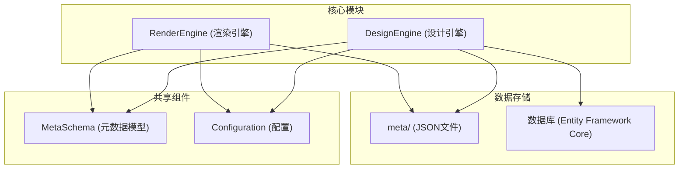
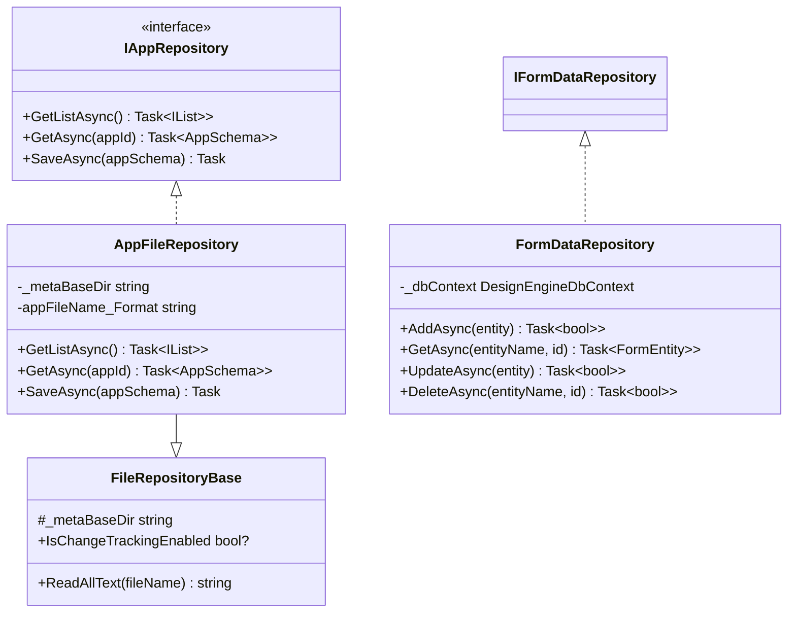
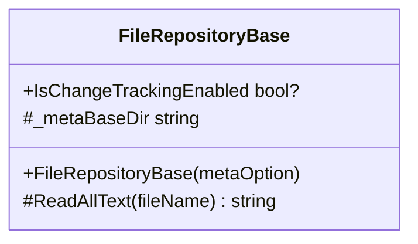
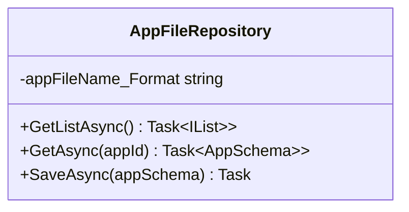
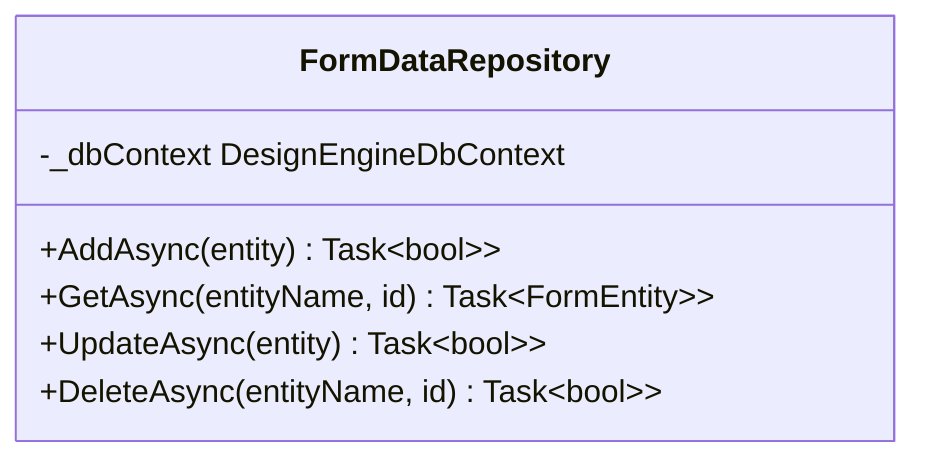
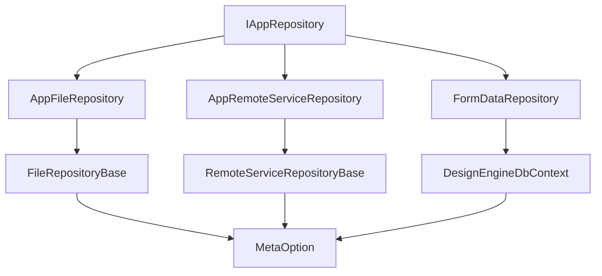

# 仓储实现层

<cite>
**本文档引用文件**  
- [FileRepositoryBase.cs](file://src/DesignEngine/H.LowCode.DesignEngine.Repository.JsonFile/Base/FileRepositoryBase.cs)
- [AppFileRepository.cs](file://src/DesignEngine/H.LowCode.DesignEngine.Repository.JsonFile/Repositories/AppFileRepository.cs)
- [IAppRepository.cs](file://src/DesignEngine/H.LowCode.DesignEngine.Domain/MetaRepositories/IAppRepository.cs)
- [FormDataRepository.cs](file://src/DesignEngine/H.LowCode.DesignEngine.EntityFrameworkCore/DataRepositories/FormDataRepository.cs)
- [IFormDataRepository.cs](file://src/DesignEngine/H.LowCode.DesignEngine.Domain/DataRepositories/IFormDataRepository.cs)
- [FileRepositoryBase.cs](file://src/RenderEngine/H.LowCode.RenderEngine.Repository.JsonFile/Base/FileRepositoryBase.cs)
- [AppFileRepository.cs](file://src/RenderEngine/H.LowCode.RenderEngine.Repository.JsonFile/Repositories/AppFileRepository.cs)
</cite>

## 目录
1. [引言](#引言)
2. [项目结构](#项目结构)
3. [核心组件](#核心组件)
4. [架构概览](#架构概览)
5. [详细组件分析](#详细组件分析)
6. [依赖分析](#依赖分析)
7. [性能考量](#性能考量)
8. [结论](#结论)

## 引言
本文档旨在深入分析低代码平台中设计引擎与渲染引擎的仓储层（Repository Layer）设计，重点阐述其多后端支持机制。通过分析 `FileRepositoryBase`、`AppFileRepository`、`FormDataRepository` 等关键类，揭示系统如何通过接口抽象与依赖注入实现存储策略的灵活切换，支持文件系统、数据库和远程服务等多种持久化方式。

## 项目结构
本项目采用分层架构，核心模块包括 `DesignEngine`（设计引擎）和 `RenderEngine`（渲染引擎），两者共享元数据定义（`MetaSchema`），但拥有独立的仓储实现。元数据以 JSON 文件形式存储在 `meta` 目录下，结构清晰，按应用（apps）和部件（parts）组织。



**图示来源**
- [FileRepositoryBase.cs](file://src/DesignEngine/H.LowCode.DesignEngine.Repository.JsonFile/Base/FileRepositoryBase.cs)
- [AppFileRepository.cs](file://src/DesignEngine/H.LowCode.DesignEngine.Repository.JsonFile/Repositories/AppFileRepository.cs)
- [FormDataRepository.cs](file://src/DesignEngine/H.LowCode.DesignEngine.EntityFrameworkCore/DataRepositories/FormDataRepository.cs)

## 核心组件
系统的核心在于其仓储层的设计，通过定义统一的接口（如 `IAppRepository`）和提供多种实现（文件、数据库、远程服务），实现了数据访问的解耦。`FileRepositoryBase` 作为文件存储的基类，封装了文件读写的基础逻辑，而 `AppFileRepository` 则是其具体实现，负责应用元数据的序列化与持久化。

**中文来源**
- [FileRepositoryBase.cs](file://src/DesignEngine/H.LowCode.DesignEngine.Repository.JsonFile/Base/FileRepositoryBase.cs#L1-L30)
- [AppFileRepository.cs](file://src/DesignEngine/H.LowCode.DesignEngine.Repository.JsonFile/Repositories/AppFileRepository.cs#L1-L70)

## 架构概览
系统的架构遵循领域驱动设计（DDD）原则，将数据访问逻辑封装在仓储层。设计引擎和渲染引擎通过各自的 `Domain` 模块定义仓储接口，并在 `EntityFrameworkCore` 和 `Repository.JsonFile` 模块中提供具体实现。这种设计使得上层业务逻辑无需关心底层数据存储细节。



**图示来源**
- [IAppRepository.cs](file://src/DesignEngine/H.LowCode.DesignEngine.Domain/MetaRepositories/IAppRepository.cs#L1-L14)
- [AppFileRepository.cs](file://src/DesignEngine/H.LowCode.DesignEngine.Repository.JsonFile/Repositories/AppFileRepository.cs#L1-L70)
- [FileRepositoryBase.cs](file://src/DesignEngine/H.LowCode.DesignEngine.Repository.JsonFile/Base/FileRepositoryBase.cs#L1-L30)
- [FormDataRepository.cs](file://src/DesignEngine/H.LowCode.DesignEngine.EntityFrameworkCore/DataRepositories/FormDataRepository.cs#L1-L40)
- [IFormDataRepository.cs](file://src/DesignEngine/H.LowCode.DesignEngine.Domain/DataRepositories/IFormDataRepository.cs#L1-L21)

## 详细组件分析

### 文件仓储基类分析
`FileRepositoryBase` 是所有基于文件的仓储实现的基类，它提供了跨平台的文件操作基础。

#### 类图分析


**图示来源**
- [FileRepositoryBase.cs](file://src/DesignEngine/H.LowCode.DesignEngine.Repository.JsonFile/Base/FileRepositoryBase.cs#L1-L30)

#### 实现细节
- **构造函数注入**：通过 `IOptions<MetaOption>` 注入配置，获取元数据根目录 `_metaBaseDir`。
- **静态字段**：`_metaBaseDir` 被声明为 `static`，确保所有继承类共享同一个元数据路径。
- **文件读取**：`ReadAllText` 方法封装了文件存在性检查和 UTF-8 编码的读取，是安全读取 JSON 文件的基础。

**中文来源**
- [FileRepositoryBase.cs](file://src/DesignEngine/H.LowCode.DesignEngine.Repository.JsonFile/Base/FileRepositoryBase.cs#L1-L30)

### 应用文件仓储分析
`AppFileRepository` 实现了 `IAppRepository` 接口，负责应用元数据的 CRUD 操作。

#### 类图分析


**图示来源**
- [AppFileRepository.cs](file://src/DesignEngine/H.LowCode.DesignEngine.Repository.JsonFile/Repositories/AppFileRepository.cs#L1-L70)

#### 实现细节
- **文件路径格式**：使用 `appFileName_Format` 常量定义文件路径模板 `{0}\{1}\{2}.json`，其中 `{0}` 是元数据根目录，`{1}` 是应用ID，`{2}` 是文件名。
- **获取应用列表**：`GetListAsync` 方法遍历 `_metaBaseDir` 下的所有子目录，为每个目录尝试读取同名的 `.json` 文件，并反序列化为 `AppPartsSchema` 对象。
- **获取单个应用**：`GetAsync` 方法根据 `appId` 构造文件路径，直接读取并反序列化。
- **保存应用**：`SaveAsync` 方法在保存前会更新 `ModifiedTime` 字段，并确保目标目录存在，然后将对象序列化为 JSON 并写入文件。

**中文来源**
- [AppFileRepository.cs](file://src/DesignEngine/H.LowCode.DesignEngine.Repository.JsonFile/Repositories/AppFileRepository.cs#L1-L70)

### 数据库仓储分析
`FormDataRepository` 展示了基于 Entity Framework Core 的数据库访问模式。

#### 类图分析


**图示来源**
- [FormDataRepository.cs](file://src/DesignEngine/H.LowCode.DesignEngine.EntityFrameworkCore/DataRepositories/FormDataRepository.cs#L1-L40)

#### 实现细节
- **依赖注入**：通过构造函数注入 `DesignEngineDbContext`，这是 EF Core 的核心上下文。
- **数据操作**：`AddAsync` 和 `GetAsync` 方法直接调用 `_dbContext` 的对应方法，体现了典型的 ORM 模式。
- **未实现方法**：`UpdateAsync` 和 `DeleteAsync` 方法抛出 `NotImplementedException`，表明该实现可能不完整或仅用于演示。

**中文来源**
- [FormDataRepository.cs](file://src/DesignEngine/H.LowCode.DesignEngine.EntityFrameworkCore/DataRepositories/FormDataRepository.cs#L1-L40)

### 仓储接口与解耦机制
`IAppRepository` 接口定义了应用元数据访问的标准契约。

#### 接口定义
```csharp
public interface IAppRepository
{
    Task<IList<AppPartsSchema>> GetListAsync();
    Task<AppPartsSchema> GetAsync(string appId);
    Task SaveAsync(AppPartsSchema appSchema);
}
```

#### 解耦机制
- **接口抽象**：上层业务逻辑（如 `AppDomainService`）仅依赖 `IAppRepository` 接口，不关心具体实现。
- **依赖注入**：在应用启动时，通过 DI 容器将 `IAppRepository` 接口绑定到具体的实现类（如 `AppFileRepository` 或 `AppRemoteServiceRepository`）。
- **动态切换**：通过修改配置或 DI 注册，可以轻松地在文件存储、数据库存储和远程服务之间切换，而无需修改业务逻辑代码。

**中文来源**
- [IAppRepository.cs](file://src/DesignEngine/H.LowCode.DesignEngine.Domain/MetaRepositories/IAppRepository.cs#L1-L14)

## 依赖分析
系统通过模块化设计实现了良好的依赖管理。



**图示来源**
- [IAppRepository.cs](file://src/DesignEngine/H.LowCode.DesignEngine.Domain/MetaRepositories/IAppRepository.cs#L1-L14)
- [AppFileRepository.cs](file://src/DesignEngine/H.LowCode.DesignEngine.Repository.JsonFile/Repositories/AppFileRepository.cs#L1-L70)
- [FileRepositoryBase.cs](file://src/DesignEngine/H.LowCode.DesignEngine.Repository.JsonFile/Base/FileRepositoryBase.cs#L1-L30)

## 性能考量
- **文件存储**：适用于小型应用或开发环境，简单直接，但并发读写和性能扩展性较差。
- **数据库存储**：适用于生产环境，支持事务、并发和复杂查询，性能更优，但增加了系统复杂性。
- **远程服务**：适用于微服务架构，实现了存储与应用的完全解耦，但引入了网络延迟和可靠性问题。

## 结论
该低代码平台的仓储层设计体现了高度的灵活性和可扩展性。通过 `FileRepositoryBase` 提供统一的文件操作基础，`AppFileRepository` 实现了元数据的文件持久化，而 `FormDataRepository` 则展示了与数据库集成的模式。`IAppRepository` 接口与依赖注入机制的结合，使得系统能够轻松支持多种存储后端，为未来的功能扩展（如远程服务）奠定了坚实的基础。