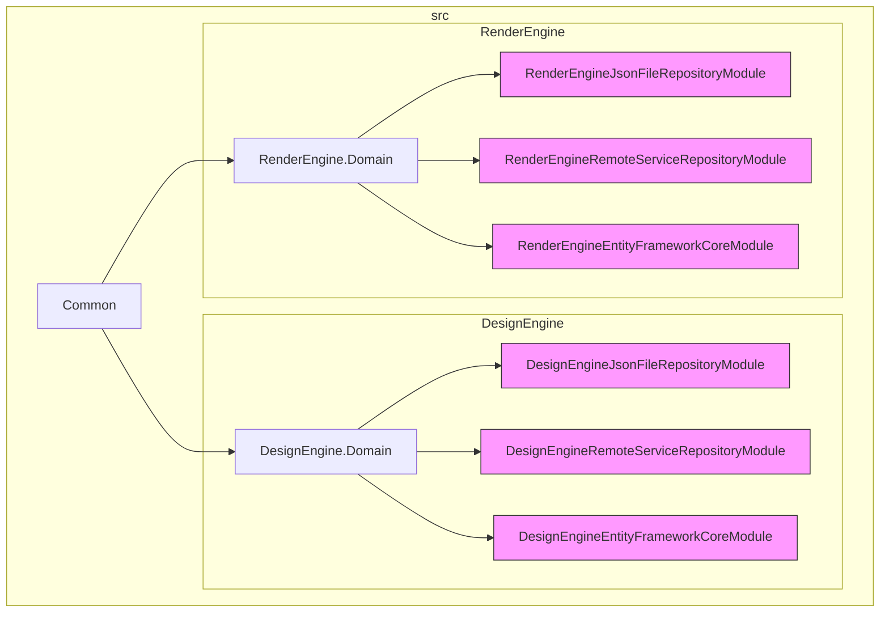

# 仓储接口与依赖注入

<cite>
**本文档引用的文件**  
- [IAppRepository.cs](file://src/DesignEngine/H.LowCode.DesignEngine.Domain/MetaRepositories/IAppRepository.cs)
- [DesignEngineJsonFileRepositoryModule.cs](file://src/DesignEngine/H.LowCode.DesignEngine.Repository.JsonFile/DesignEngineJsonFileRepositoryModule.cs)
- [DesignEngineRemoteServiceRepositoryModule.cs](file://src/DesignEngine/H.LowCode.DesignEngine.Repository.RemoteService/DesignEngineRemoteServiceRepositoryModule.cs)
- [DesignEngineEntityFrameworkCoreModule.cs](file://src/DesignEngine/H.LowCode.DesignEngine.EntityFrameworkCore/DesignEngineEntityFrameworkCoreModule.cs)
- [AppFileRepository.cs](file://src/DesignEngine/H.LowCode.DesignEngine.Repository.JsonFile/Repositories/AppFileRepository.cs)
- [AppRemoteServiceRepository.cs](file://src/DesignEngine/H.LowCode.DesignEngine.Repository.RemoteService/Repositories/AppRemoteServiceRepository.cs)
- [AppFileRepository.cs](file://src/RenderEngine/H.LowCode.RenderEngine.Repository.JsonFile/Repositories/AppFileRepository.cs)
- [AppRemoteServiceRepository.cs](file://src/RenderEngine/H.LowCode.RenderEngine.Repository.RemoteService/Repositories/AppRemoteServiceRepository.cs)
- [MetaOption.cs](file://src/Common/H.LowCode.Configuration/Options/MetaOption.cs)
</cite>

## 目录
1. [引言](#引言)
2. [项目结构分析](#项目结构分析)
3. [仓储接口抽象设计](#仓储接口抽象设计)
4. [仓储实现模块注册机制](#仓储实现模块注册机制)
5. [运行时存储策略动态切换](#运行时存储策略动态切换)
6. [多仓储共存与优先级配置](#多仓储共存与优先级配置)
7. [最佳实践与扩展建议](#最佳实践与扩展建议)

## 引言
本文件系统阐述低代码平台中仓储模式的接口抽象设计与依赖注入机制。重点分析 `IAppRepository` 等接口如何定义统一的数据访问契约，实现领域层与基础设施层的解耦。详细说明 `DesignEngineJsonFileRepositoryModule`、`DesignEngineRemoteServiceRepositoryModule` 和 `DesignEngineEntityFrameworkCoreModule` 三个模块如何通过依赖注入容器注册不同的仓储实现，并解释在运行时如何根据配置动态切换 JSON 文件、数据库或远程服务等存储策略。

## 项目结构分析
项目采用分层架构设计，核心模块包括 `DesignEngine`（设计引擎）和 `RenderEngine`（渲染引擎），两者共享 `Common` 基础组件。数据访问层通过仓储模式（Repository Pattern）实现，具体实现分散在不同的模块中。



**图示来源**  
- [DesignEngineJsonFileRepositoryModule.cs](file://src/DesignEngine/H.LowCode.DesignEngine.Repository.JsonFile/DesignEngineJsonFileRepositoryModule.cs)
- [DesignEngineRemoteServiceRepositoryModule.cs](file://src/DesignEngine/H.LowCode.DesignEngine.Repository.RemoteService/DesignEngineRemoteServiceRepositoryModule.cs)
- [DesignEngineEntityFrameworkCoreModule.cs](file://src/DesignEngine/H.LowCode.DesignEngine.EntityFrameworkCore/DesignEngineEntityFrameworkCoreModule.cs)

## 仓储接口抽象设计
仓储接口定义在 `DesignEngine.Domain` 和 `RenderEngine.Domain` 模块的 `MetaRepositories` 目录下，为元数据（应用、页面、菜单等）提供统一的数据访问契约。

### 核心仓储接口

```mermaid
classDiagram
class IAppRepository {
+Task<AppSchemaBase> GetAsync(string appId)
+Task<List<AppSchemaBase>> GetAllAsync()
+Task SaveAsync(AppSchemaBase app)
+Task DeleteAsync(string appId)
}
class IPageRepository {
+Task<PageSchemaBase> GetAsync(string pageId)
+Task<List<PageSchemaBase>> GetByAppIdAsync(string appId)
+Task SaveAsync(PageSchemaBase page)
+Task DeleteAsync(string pageId)
}
class IMenuRepository {
+Task<MenuSchema> GetAsync(string menuId)
+Task<List<MenuSchema>> GetByAppIdAsync(string appId)
+Task SaveAsync(MenuSchema menu)
+Task DeleteAsync(string menuId)
}
class IDataSourceRepository {
+Task<DataSourceSchema> GetAsync(string dsId)
+Task<List<DataSourceSchema>> GetByAppIdAsync(string appId)
+Task SaveAsync(DataSourceSchema ds)
+Task DeleteAsync(string dsId)
}
IAppRepository <|-- AppFileRepository : "实现"
IAppRepository <|-- AppRemoteServiceRepository : "实现"
IAppRepository <|-- AppEfCoreRepository : "实现"
IPageRepository <|-- PageFileRepository : "实现"
IPageRepository <|-- PageRemoteServiceRepository : "实现"
IPageRepository <|-- PageEfCoreRepository : "实现"
IMenuRepository <|-- MenuFileRepository : "实现"
IMenuRepository <|-- MenuRemoteServiceRepository : "实现"
IMenuRepository <|-- MenuEfCoreRepository : "实现"
IDataSourceRepository <|-- DataSourceFileRepository : "实现"
IDataSourceRepository <|-- DataSourceRemoteServiceRepository : "实现"
IDataSourceRepository <|-- DataSourceEfCoreRepository : "实现"
```


**图示来源**  
- [IAppRepository.cs](file://src/DesignEngine/H.LowCode.DesignEngine.Domain/MetaRepositories/IAppRepository.cs)
- [IPageRepository.cs](file://src/DesignEngine/H.LowCode.DesignEngine.Domain/MetaRepositories/IPageRepository.cs)
- [IMenuRepository.cs](file://src/DesignEngine/H.LowCode.DesignEngine.Domain/MetaRepositories/IMenuRepository.cs)
- [IDataSourceRepository.cs](file://src/DesignEngine/H.LowCode.DesignEngine.Domain/MetaRepositories/IDataSourceRepository.cs)

**本节来源**  
- [IAppRepository.cs](file://src/DesignEngine/H.LowCode.DesignEngine.Domain/MetaRepositories/IAppRepository.cs)

## 仓储实现模块注册机制
系统通过模块化的方式注册不同的仓储实现，每个实现模块负责将其具体的仓储类注册到依赖注入容器中。

### JSON 文件仓储模块
`DesignEngineJsonFileRepositoryModule` 负责注册基于 JSON 文件的仓储实现。

```csharp
public class DesignEngineJsonFileRepositoryModule : AbpModule
{
    public override void ConfigureServices(ServiceConfigurationContext context)
    {
        context.Services.AddTransient<IAppRepository, AppFileRepository>();
        context.Services.AddTransient<IPageRepository, PageFileRepository>();
        context.Services.AddTransient<IMenuRepository, MenuFileRepository>();
        context.Services.AddTransient<IDataSourceRepository, DataSourceFileRepository>();
    }
}
```

**本节来源**  
- [DesignEngineJsonFileRepositoryModule.cs](file://src/DesignEngine/H.LowCode.DesignEngine.Repository.JsonFile/DesignEngineJsonFileRepositoryModule.cs)

### 远程服务仓储模块
`DesignEngineRemoteServiceRepositoryModule` 负责注册基于远程 API 调用的仓储实现。

```csharp
public class DesignEngineRemoteServiceRepositoryModule : AbpModule
{
    public override void ConfigureServices(ServiceConfigurationContext context)
    {
        context.Services.AddTransient<IAppRepository, AppRemoteServiceRepository>();
        context.Services.AddTransient<IPageRepository, PageRemoteServiceRepository>();
        context.Services.AddTransient<IMenuRepository, MenuRemoteServiceRepository>();
        context.Services.AddTransient<IDataSourceRepository, DataSourceRemoteServiceRepository>();
    }
}
```

**本节来源**  
- [DesignEngineRemoteServiceRepositoryModule.cs](file://src/DesignEngine/H.LowCode.DesignEngine.Repository.RemoteService/DesignEngineRemoteServiceRepositoryModule.cs)

### Entity Framework Core 仓储模块
`DesignEngineEntityFrameworkCoreModule` 负责注册基于数据库的仓储实现。

```csharp
public class DesignEngineEntityFrameworkCoreModule : AbpModule
{
    public override void ConfigureServices(ServiceConfigurationContext context)
    {
        context.Services.AddAbpDbContext<DesignEngineDbContext>(options =>
        {
            options.AddDefaultRepositories<IAppRepository, AppSchemaBase>();
            options.AddDefaultRepositories<IPageRepository, PageSchemaBase>();
            options.AddDefaultRepositories<IMenuRepository, MenuSchemaBase>();
            options.AddDefaultRepositories<IDataSourceRepository, DataSourceSchema>();
        });
    }
}
```

**本节来源**  
- [DesignEngineEntityFrameworkCoreModule.cs](file://src/DesignEngine/H.LowCode.DesignEngine.EntityFrameworkCore/DesignEngineEntityFrameworkCoreModule.cs)

## 运行时存储策略动态切换
系统通过配置文件 `MetaOption` 中的 `StorageType` 配置项来决定运行时使用哪种仓储实现。

### 配置驱动的仓储选择
```csharp
public class MetaOption
{
    public StorageType StorageType { get; set; } = StorageType.JsonFile;
    
    public string? RemoteServiceUrl { get; set; }
    public string? ConnectionString { get; set; }
}

public enum StorageType
{
    JsonFile,
    RemoteService,
    Database
}
```

在应用启动时，根据 `appsettings.json` 中的配置，动态决定加载哪个仓储模块：

```json
{
  "MetaOption": {
    "StorageType": "Database",
    "ConnectionString": "Server=localhost;Database=LowCode;Trusted_Connection=true;"
  }
}
```

**本节来源**  
- [MetaOption.cs](file://src/Common/H.LowCode.Configuration/Options/MetaOption.cs)

## 多仓储共存与优先级配置
虽然系统设计上支持多种仓储实现，但在实际运行时，通常通过条件注册确保只激活一种策略，避免冲突。

### 条件注册示例
```csharp
public override void ConfigureServices(ServiceConfigurationContext context)
{
    var configuration = context.Services.GetConfiguration();
    var storageType = configuration.GetValue<StorageType>("MetaOption:StorageType");
    
    switch (storageType)
    {
        case StorageType.JsonFile:
            context.Services.AddTransient<IAppRepository, AppFileRepository>();
            break;
        case StorageType.RemoteService:
            context.Services.AddTransient<IAppRepository, AppRemoteServiceRepository>();
            break;
        case StorageType.Database:
            context.Services.AddAbpDbContext<DesignEngineDbContext>(options =>
                options.AddDefaultRepository<AppSchemaBase, IAppRepository>());
            break;
    }
}
```

### 优先级与覆盖规则
1. **配置优先**：`appsettings.json` 中的 `StorageType` 决定最终使用的仓储。
2. **后注册覆盖**：如果多个模块注册了同一接口，后注册的实现会覆盖先注册的（取决于 DI 容器行为）。
3. **显式条件控制**：推荐使用 `if` 或 `switch` 语句进行显式条件判断，确保单一实现被注册。

## 最佳实践与扩展建议
为确保系统的灵活性与可扩展性，建议遵循以下最佳实践：

1. **接口隔离**：保持仓储接口的职责单一，避免臃肿接口。
2. **配置驱动**：所有存储策略的选择都应通过配置文件控制，无需重新编译。
3. **模块化注册**：将不同存储实现封装在独立模块中，便于启用/禁用。
4. **运行时验证**：在应用启动时验证所选存储类型的配置项是否完整（如数据库连接字符串、远程服务地址）。
5. **扩展性设计**：新增存储类型（如 Redis、MongoDB）时，只需实现对应仓储接口并创建新模块，无需修改现有代码。

通过上述设计，系统实现了领域逻辑与数据访问的完全解耦，支持在不同环境（开发、测试、生产）中灵活切换数据存储策略，极大提升了系统的可维护性和部署灵活性。