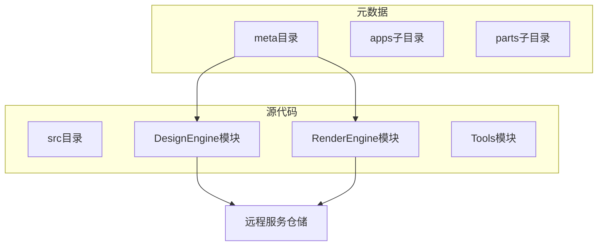
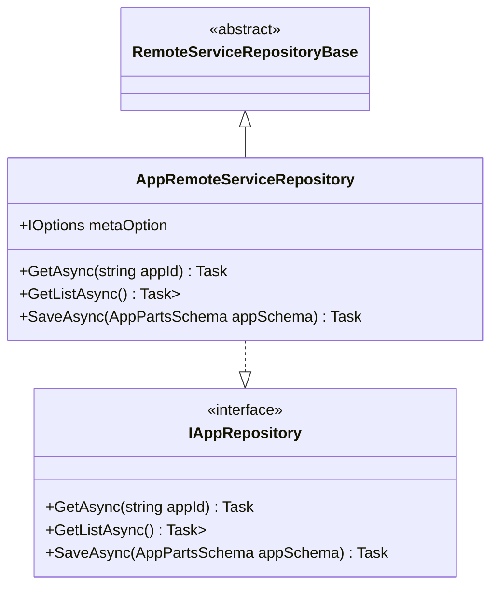
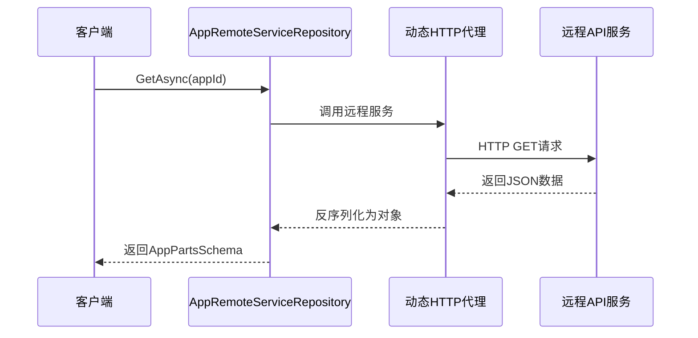
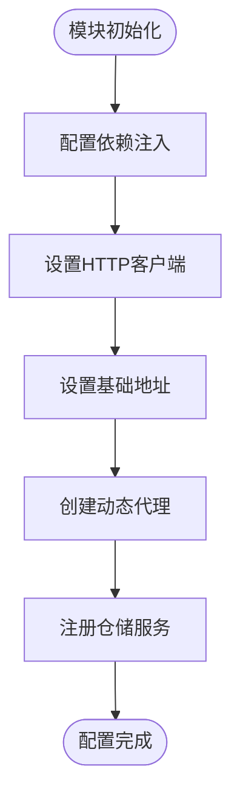
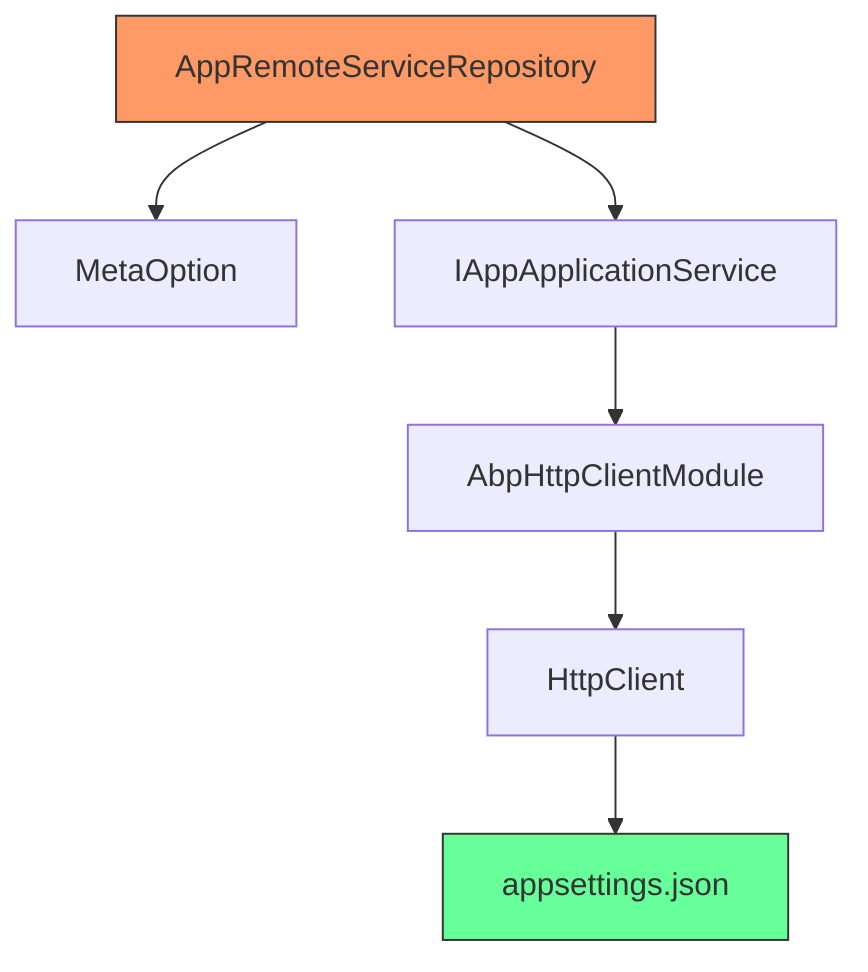

# 远程服务仓储实现

<cite>
**本文档引用文件**   
- [RemoteServiceRepositoryBase.cs](file://src/DesignEngine/H.LowCode.DesignEngine.Repository.RemoteService/Base/RemoteServiceRepositoryBase.cs)
- [AppRemoteServiceRepository.cs](file://src/DesignEngine/H.LowCode.DesignEngine.Repository.RemoteService/Repositories/AppRemoteServiceRepository.cs)
- [DesignEngineHostClientModule.cs](file://src/DesignEngine/H.LowCode.DesignEngine.Host.Client/DesignEngineHostClientModule.cs)
- [appsettings.json](file://src/DesignEngine/H.LowCode.DesignEngine.Host.Client/wwwroot/appsettings.json)
- [IAppApplicationService.cs](file://src/DesignEngine/H.LowCode.DesignEngine.Application.Contracts/AppServices/IAppApplicationService.cs)
</cite>

## 目录
1. [引言](#引言)
2. [项目结构](#项目结构)
3. [核心组件](#核心组件)
4. [架构概述](#架构概述)
5. [详细组件分析](#详细组件分析)
6. [依赖分析](#依赖分析)
7. [性能考虑](#性能考虑)
8. [故障排除指南](#故障排除指南)
9. [结论](#结论)

## 引言
本文档全面解析远程服务仓储模式，重点描述`RemoteServiceRepositoryBase`如何封装HTTP客户端调用，处理认证、重试、超时等横切关注点。详细说明`AppRemoteServiceRepository`等具体实现类如何通过RESTful API与远程元数据服务通信，完成应用、页面、菜单和数据源的远程读写操作。分析请求序列化、响应反序列化、错误码映射及缓存策略的实现细节。阐述该模式在微服务架构中的集成方式、网络延迟影响及容错机制，提供服务地址配置、API版本管理和安全认证的实践指南。

## 项目结构
本项目采用模块化分层架构，主要分为`meta`元数据目录和`src`源代码目录。`meta`目录存放应用、菜单、页面等JSON格式的元数据文件。`src`目录包含多个子系统，包括设计引擎、渲染引擎和工具模块。设计引擎和渲染引擎各自拥有独立的远程服务仓储实现，通过`RemoteServiceRepositoryBase`基类提供统一的远程调用抽象。

**Diagram sources**
- [meta目录](file://meta)
- [src目录](file://src)

## 核心组件
远程服务仓储模式的核心组件包括`RemoteServiceRepositoryBase`基类、具体仓储实现类（如`AppRemoteServiceRepository`）、HTTP客户端配置和动态API代理。这些组件共同协作，为上层应用提供透明的远程数据访问能力。

**Section sources**
- [RemoteServiceRepositoryBase.cs](file://src/DesignEngine/H.LowCode.DesignEngine.Repository.RemoteService/Base/RemoteServiceRepositoryBase.cs)
- [AppRemoteServiceRepository.cs](file://src/DesignEngine/H.LowCode.DesignEngine.Repository.RemoteService/Repositories/AppRemoteServiceRepository.cs)

## 架构概述
系统采用分层架构，客户端通过依赖注入获取仓储实例，仓储层通过动态生成的HTTP代理调用远程API服务。ABP框架的`AddHttpClientProxies`方法根据应用服务契约自动生成强类型的HTTP客户端，实现了服务接口的远程调用。

**Diagram sources**
- [DesignEngineHostClientModule.cs](file://src/DesignEngine/H.LowCode.DesignEngine.Host.Client/DesignEngineHostClientModule.cs)
- [IAppApplicationService.cs](file://src/DesignEngine/H.LowCode.DesignEngine.Application.Contracts/AppServices/IAppApplicationService.cs)

## 详细组件分析

### 远程服务仓储基类分析
`RemoteServiceRepositoryBase`作为抽象基类，为所有远程仓储提供统一的基础。虽然当前实现为空，但其设计意图是封装HTTP客户端、认证、重试、超时等跨切面功能。

**Diagram sources**
- [RemoteServiceRepositoryBase.cs](file://src/DesignEngine/H.LowCode.DesignEngine.Repository.RemoteService/Base/RemoteServiceRepositoryBase.cs)
- [AppRemoteServiceRepository.cs](file://src/DesignEngine/H.LowCode.DesignEngine.Repository.RemoteService/Repositories/AppRemoteServiceRepository.cs)

### 应用远程服务仓储分析
`AppRemoteServiceRepository`实现了`IAppRepository`接口，通过依赖注入获取`MetaOption`配置。该类目前的方法实现为`NotImplementedException`，表明其设计为通过动态代理调用远程服务。

**Diagram sources**
- [AppRemoteServiceRepository.cs](file://src/DesignEngine/H.LowCode.DesignEngine.Repository.RemoteService/Repositories/AppRemoteServiceRepository.cs)
- [IAppApplicationService.cs](file://src/DesignEngine/H.LowCode.DesignEngine.Application.Contracts/AppServices/IAppApplicationService.cs)

### HTTP客户端配置分析
`DesignEngineHostClientModule`模块负责配置HTTP客户端和动态代理。`ConfigureHttpClient`方法设置基础地址，`ConfigureHttpClientProxies`方法根据服务契约生成强类型代理。

**Diagram sources**
- [DesignEngineHostClientModule.cs](file://src/DesignEngine/H.LowCode.DesignEngine.Host.Client/DesignEngineHostClientModule.cs)

## 依赖分析
系统依赖ABP框架的HTTP客户端模块实现动态代理，通过`AbpHttpClientModule`和`AddHttpClientProxies`方法生成服务代理。仓储层依赖`MetaOption`配置获取服务地址，客户端依赖`appsettings.json`中的`RemoteServices`配置。

**Diagram sources**
- [DesignEngineHostClientModule.cs](file://src/DesignEngine/H.LowCode.DesignEngine.Host.Client/DesignEngineHostClientModule.cs)
- [appsettings.json](file://src/DesignEngine/H.LowCode.DesignEngine.Host.Client/wwwroot/appsettings.json)

## 性能考虑
远程服务调用的主要性能瓶颈在于网络延迟。建议实施客户端缓存策略，对不频繁变更的元数据进行缓存。同时，合理配置HTTP客户端的超时和重试策略，避免因网络波动导致的服务不可用。

## 故障排除指南
当远程服务调用失败时，首先检查`appsettings.json`中的`BaseUrl`配置是否正确。其次确认远程API服务是否正常运行。可通过浏览器直接访问API端点验证服务状态。最后检查网络连接和防火墙设置。

**Section sources**
- [appsettings.json](file://src/DesignEngine/H.LowCode.DesignEngine.Host.Client/wwwroot/appsettings.json)
- [DesignEngineHostClientModule.cs](file://src/DesignEngine/H.LowCode.DesignEngine.Host.Client/DesignEngineHostClientModule.cs)

## 结论
远程服务仓储模式通过抽象基类和动态代理机制，实现了本地数据访问与远程服务调用的统一接口。该模式提高了代码的可维护性和可测试性，同时利用ABP框架的强大功能简化了分布式系统的开发复杂度。未来可在此基础上扩展缓存、熔断、监控等企业级功能。