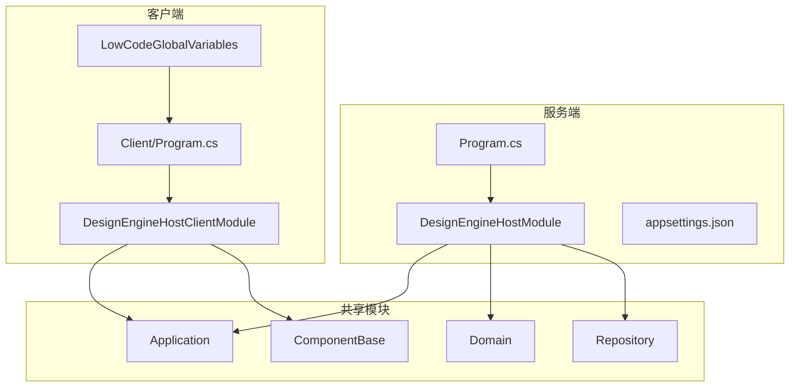
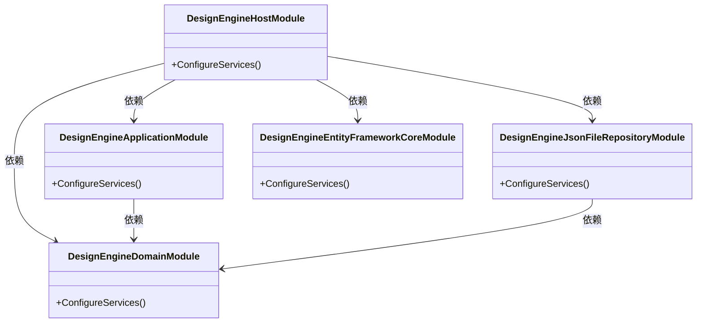
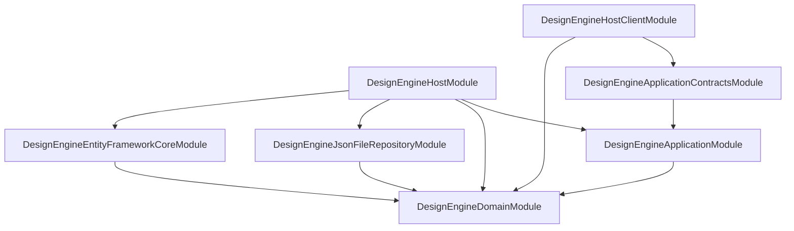

# 宿主配置与启动流程

<cite>
**本文档引用的文件**  
- [Program.cs](file://src/DesignEngine/H.LowCode.DesignEngine.Host/Program.cs)
- [appsettings.json](file://src/DesignEngine/H.LowCode.DesignEngine.Host/appsettings.json)
- [DesignEngineHostModule.cs](file://src/DesignEngine/H.LowCode.DesignEngine.Host/DesignEngineHostModule.cs)
- [Program.cs](file://src/DesignEngine/H.LowCode.DesignEngine.Host.Client/Program.cs)
- [LowCodeGlobalVariables.cs](file://src/DesignEngine/H.LowCode.DesignEngine.Host.Client/LowCodeGlobalVariables.cs)
- [DesignEngineApplicationModule.cs](file://src/DesignEngine/H.LowCode.DesignEngine.Application/DesignEngineApplicationModule.cs)
- [DesignEngineDomainModule.cs](file://src/DesignEngine/H.LowCode.DesignEngine.Domain/DesignEngineDomainModule.cs)
- [DesignEngineJsonFileRepositoryModule.cs](file://src/DesignEngine/H.LowCode.DesignEngine.Repository.JsonFile/DesignEngineJsonFileRepositoryModule.cs)
- [DesignEngineEntityFrameworkCoreModule.cs](file://src/DesignEngine/H.LowCode.DesignEngine.EntityFrameworkCore/DesignEngineEntityFrameworkCoreModule.cs)
- [LowCodeComponentBaseModule.cs](file://src/Common/H.LowCode.ComponentBase/LowCodeComponentBaseModule.cs)
- [LowCodeDefaultComponentModule.cs](file://src/Common/H.LowCode.Components.Defaults/LowCodeDefaultComponentModule.cs)
- [LowCodeWorkbenchModule.cs](file://src/DesignEngine/H.LowCode.Workbench/LowCodeWorkbenchModule.cs)
- [DesignEngineModule.cs](file://src/DesignEngine/H.LowCode.DesignEngine/DesignEngineModule.cs)
- [PartsDesignEngineModule.cs](file://src/DesignEngine/H.LowCode.PartsDesignEngine/PartsDesignEngineModule.cs)
- [MyAppModule.cs](file://src/DesignEngine/H.LowCode.MyApp/MyAppModule.cs)
- [DesignEngineHostClientModule.cs](file://src/DesignEngine/H.LowCode.DesignEngine.Host.Client/DesignEngineHostClientModule.cs)
</cite>

## 目录
1. [简介](#简介)
2. [项目结构](#项目结构)
3. [核心组件](#核心组件)
4. [架构概览](#架构概览)
5. [详细组件分析](#详细组件分析)
6. [依赖分析](#依赖分析)
7. [性能考虑](#性能考虑)
8. [故障排除指南](#故障排除指南)
9. [结论](#结论)

## 简介
本文档详细描述了低代码平台中设计引擎的宿主应用（Host）配置与系统启动流程。重点分析了服务注册、模块依赖、配置加载及客户端启动逻辑，旨在为开发者提供清晰的系统初始化路径和扩展指导。

## 项目结构
设计引擎宿主应用采用模块化分层架构，主要分为服务端（Host）与客户端（Client）两部分，通过ABP框架实现依赖注入与模块协调。



**图示来源**
- [Program.cs](file://src/DesignEngine/H.LowCode.DesignEngine.Host/Program.cs)
- [DesignEngineHostModule.cs](file://src/DesignEngine/H.LowCode.DesignEngine.Host/DesignEngineHostModule.cs)
- [Program.cs](file://src/DesignEngine/H.LowCode.DesignEngine.Host.Client/Program.cs)

## 核心组件

### 服务端启动流程
服务端通过`Program.cs`启动，使用ABP框架的`AddApplicationAsync<T>`方法加载`DesignEngineHostModule`，完成模块化服务注册。

**关键步骤：**
1. 创建WebApplicationBuilder
2. 注册Razor组件与控制器
3. 配置响应压缩
4. 使用Autofac作为DI容器
5. 加载`DesignEngineHostModule`
6. 构建应用并运行

```csharp
var builder = WebApplication.CreateBuilder(args);
builder.Host.UseAutofac();
await builder.AddApplicationAsync<DesignEngineHostModule>();
var app = builder.Build();
await app.InitializeApplicationAsync();
await app.RunAsync();
```

**中文标签：**
- **builder**: Web应用构建器
- **AddApplicationAsync**: 异步添加ABP应用模块
- **InitializeApplicationAsync**: 初始化应用服务

**中文注释：**
- 启用Autofac以支持更灵活的依赖注入
- `InitializeApplicationAsync`触发模块的`OnApplicationInitialization`方法

**宿主配置与启动流程**
- [Program.cs](file://src/DesignEngine/H.LowCode.DesignEngine.Host/Program.cs#L1-L77)

### 客户端启动流程
客户端为Blazor WebAssembly应用，其`Program.cs`通过`WebAssemblyHostBuilder`创建宿主，并加载`DesignEngineHostClientModule`。

```csharp
var builder = WebAssemblyHostBuilder.CreateDefault(args);
var application = await builder.AddApplicationAsync<DesignEngineHostClientModule>(options =>
{
    options.UseAutofac();
});
var host = builder.Build();
await application.InitializeApplicationAsync(host.Services);
await host.RunAsync();
```

该流程确保了客户端模块的依赖注入与服务初始化。

**宿主配置与启动流程**
- [Program.cs](file://src/DesignEngine/H.LowCode.DesignEngine.Host.Client/Program.cs#L1-L20)

## 架构概览
系统采用ABP模块化架构，通过`[DependsOn]`特性声明模块依赖，实现分层解耦。



**图示来源**
- [DesignEngineHostModule.cs](file://src/DesignEngine/H.LowCode.DesignEngine.Host/DesignEngineHostModule.cs)
- [DesignEngineApplicationModule.cs](file://src/DesignEngine/H.LowCode.DesignEngine.Application/DesignEngineApplicationModule.cs)
- [DesignEngineDomainModule.cs](file://src/DesignEngine/H.LowCode.DesignEngine.Domain/DesignEngineDomainModule.cs)

## 详细组件分析

### DesignEngineHostModule 分析
`DesignEngineHostModule`是服务端核心模块，协调所有子模块的依赖注入。

```csharp
[DependsOn(
    typeof(AbpAutofacModule),
    typeof(AbpAspNetCoreMvcModule),
    typeof(DesignEngineApplicationModule),
    typeof(DesignEngineEntityFrameworkCoreModule),
    typeof(DesignEngineJsonFileRepositoryModule),
    typeof(LowCodeWorkbenchModule),
    typeof(DesignEngineModule),
    typeof(MyAppModule),
    typeof(PartsDesignEngineModule),
    typeof(LowCodeDefaultComponentModule),
    typeof(LowCodeComponentBaseModule)
)]
public class DesignEngineHostModule : AbpModule
{
    public override void ConfigureServices(ServiceConfigurationContext context)
    {
        ConfigureAutoApiControllers();
        context.Services.AddSingleton(new LowCodeAppState(true));
    }

    private void ConfigureAutoApiControllers()
    {
        Configure<AbpAspNetCoreMvcOptions>(options =>
        {
            options.ConventionalControllers.Create(typeof(DesignEngineApplicationModule).Assembly);
        });
    }
}
```

**功能说明：**
- **自动API控制器**：扫描`DesignEngineApplicationModule`程序集，自动生成REST API端点
- **应用状态**：注册`LowCodeAppState`为单例，用于全局状态管理

**宿主配置与启动流程**
- [DesignEngineHostModule.cs](file://src/DesignEngine/H.LowCode.DesignEngine.Host/DesignEngineHostModule.cs#L1-L54)

### 配置文件分析 (appsettings.json)
`appsettings.json`定义了系统关键配置：

```json
{
  "ConnectionStrings": {
    "Default": "Server=(localdb)\\MSSQLLocalDB;Database=H_LowCode;Trusted_Connection=True;TrustServerCertificate=True"
  },
  "Meta": {
    "appsFilePath": "../../../meta/apps",
    "partsFilePath": "../../../meta/parts"
  },
  "RemoteServices": {
    "Default": {
      "BaseUrl": "https://localhost:5181"
    }
  },
  "Sites": [
    {
      "AppId": "caseapp",
      "SiteUrl": "https://localhost:5191"
    }
  ]
}
```

**配置项说明：**
- **ConnectionStrings::Default**: 数据库连接字符串，使用LocalDB
- **Meta::appsFilePath**: 元数据应用文件存储路径
- **Meta::partsFilePath**: 元数据部件文件存储路径
- **RemoteServices::Default::BaseUrl**: 远程服务基础地址，用于API调用
- **Sites**: 多站点配置，定义应用ID与访问URL

这些配置在模块中通过`context.Services.GetConfiguration()`读取并注入服务。

**宿主配置与启动流程**
- [appsettings.json](file://src/DesignEngine/H.LowCode.DesignEngine.Host/appsettings.json#L1-L32)

### 仓储模块分析
系统支持多种仓储实现，通过模块配置切换。

#### JSON文件仓储
`DesignEngineJsonFileRepositoryModule`注册基于JSON文件的仓储实现：

```csharp
context.Services.AddScoped<IAppRepository, AppFileRepository>();
context.Services.AddScoped<IMenuRepository, MenuFileRepository>();
// ... 其他仓储
context.Services.Configure<MetaOption>(configuration.GetSection(MetaOption.SectionName));
```

**特点：**
- 无数据库依赖
- 元数据存储于`meta`目录下的JSON文件
- 适用于开发与轻量级部署

**宿主配置与启动流程**
- [DesignEngineJsonFileRepositoryModule.cs](file://src/DesignEngine/H.LowCode.DesignEngine.Repository.JsonFile/DesignEngineJsonFileRepositoryModule.cs#L8-L24)

#### Entity Framework Core 仓储
`DesignEngineEntityFrameworkCoreModule`注册基于EF Core的仓储：

```csharp
context.Services.AddScoped<IFormDataRepository, FormDataRepository>();
context.Services.AddDbContext<DesignEngineDbContext>(options =>
{
    var connectionString = context.Services.GetConfiguration().GetConnectionString("Default");
    options.UseSqlServer(connectionString);
});
```

**特点：**
- 使用SQL Server持久化数据
- 支持复杂查询与事务
- 适用于生产环境

**宿主配置与启动流程**
- [DesignEngineEntityFrameworkCoreModule.cs](file://src/DesignEngine/H.LowCode.DesignEngine.EntityFrameworkCore/DesignEngineEntityFrameworkCoreModule.cs#L10-L25)

### 客户端模块分析
`DesignEngineHostClientModule`配置客户端服务：

```csharp
[DependsOn(
    typeof(AbpAutofacWebAssemblyModule),
    typeof(AbpHttpClientModule),
    typeof(DesignEngineApplicationContractsModule),
    // ... 其他模块
)]
public class DesignEngineHostClientModule : AbpModule
{
    public override void ConfigureServices(ServiceConfigurationContext context)
    {
        ConfigureHttpClient(context, environment);
        ConfigureHttpClientProxies(context);
        context.Services.AddSingleton(new LowCodeAppState(true));
    }

    private void ConfigureHttpClientProxies(ServiceConfigurationContext context)
    {
        context.Services.AddHttpClientProxies(
            typeof(DesignEngineApplicationContractsModule).Assembly,
            RemoteServiceName
        );
    }
}
```

**功能：**
- **HttpClient代理**：自动生成API代理类，简化远程调用
- **单例应用状态**：与服务端共享`LowCodeAppState`

**宿主配置与启动流程**
- [DesignEngineHostClientModule.cs](file://src/DesignEngine/H.LowCode.DesignEngine.Host.Client/DesignEngineHostClientModule.cs#L13-L62)

### 全局变量分析
`LowCodeGlobalVariables`提供客户端全局运行时变量：

```csharp
public static class LowCodeGlobalVariables
{
    public static readonly Type LowCodeDefaultLayout = typeof(DesignEngineBase.DesignEngineNavLayout);
    
    public static readonly Assembly[] AdditionalAssemblies =
        [
            typeof(Workbench._Imports).Assembly,
            typeof(DesignEngine._Imports).Assembly,
            typeof(PartsDesignEngine._Imports).Assembly,
            typeof(MyApp._Imports).Assembly
        ];
}
```

**用途：**
- **LowCodeDefaultLayout**: 指定默认布局组件
- **AdditionalAssemblies**: 在Razor组件映射中包含额外程序集，支持跨模块组件渲染

**宿主配置与启动流程**
- [LowCodeGlobalVariables.cs](file://src/DesignEngine/H.LowCode.DesignEngine.Host.Client/LowCodeGlobalVariables.cs#L1-L17)

## 依赖分析
系统依赖关系清晰，采用分层架构。



**图示来源**
- [DesignEngineHostModule.cs](file://src/DesignEngine/H.LowCode.DesignEngine.Host/DesignEngineHostModule.cs)
- [DesignEngineHostClientModule.cs](file://src/DesignEngine/H.LowCode.DesignEngine.Host.Client/DesignEngineHostClientModule.cs)

## 性能考虑
- **响应压缩**：启用Brotli压缩，减少网络传输量
- **静态文件缓存**：设置`Cache-Control: public,max-age=600`，提升前端性能
- **数据库连接**：EF Core使用连接池，优化数据库访问

## 故障排除指南
- **API 404错误**：检查`DesignEngineHostModule`中`ConfigureAutoApiControllers`是否正确执行
- **依赖注入失败**：确认模块的`[DependsOn]`特性包含所需模块
- **元数据加载失败**：检查`appsettings.json`中`Meta::appsFilePath`路径是否正确
- **客户端代理调用失败**：验证`RemoteServices::Default::BaseUrl`是否可达

**宿主配置与启动流程**
- [DesignEngineHostModule.cs](file://src/DesignEngine/H.LowCode.DesignEngine.Host/DesignEngineHostModule.cs#L1-L54)
- [appsettings.json](file://src/DesignEngine/H.LowCode.DesignEngine.Host/appsettings.json#L1-L32)

## 结论
设计引擎的宿主应用通过ABP模块化架构实现了高度解耦与灵活配置。服务端`Program.cs`启动流程清晰，`DesignEngineHostModule`有效协调了应用、领域、仓储各层。`appsettings.json`集中管理关键配置，支持数据库与存储模式切换。客户端通过`LowCodeGlobalVariables`提供全局变量，支持多模块集成。该架构为系统扩展与维护提供了坚实基础。