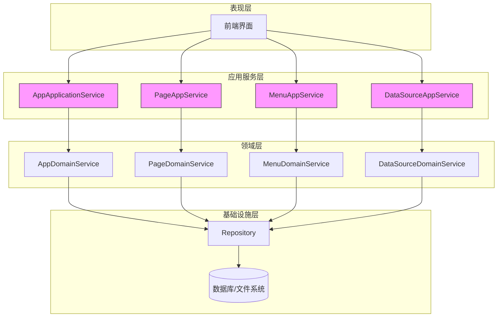
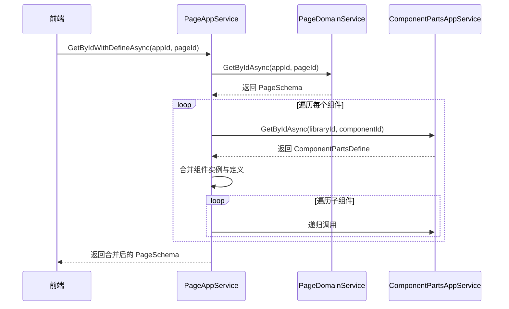
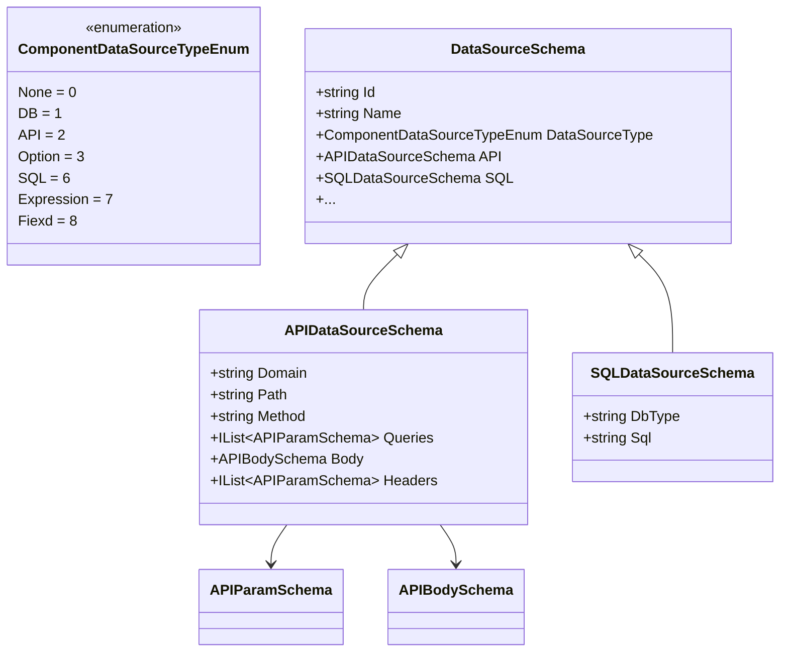

# 应用服务层

<cite>
**本文档中引用的文件**  
- [AppApplicationService.cs](file://src\DesignEngine\H.LowCode.DesignEngine.Application\AppServices\AppApplicationService.cs)
- [IAppApplicationService.cs](file://src\DesignEngine\H.LowCode.DesignEngine.Application.Contracts\AppServices\IAppApplicationService.cs)
- [PageAppService.cs](file://src\DesignEngine\H.LowCode.DesignEngine.Application\AppServices\PageAppService.cs)
- [IPageAppService.cs](file://src\DesignEngine\H.LowCode.DesignEngine.Application.Contracts\AppServices\IPageAppService.cs)
- [MenuAppService.cs](file://src\DesignEngine\H.LowCode.DesignEngine.Application\AppServices\MenuAppService.cs)
- [IMenuAppService.cs](file://src\DesignEngine\H.LowCode.DesignEngine.Application.Contracts\AppServices\IMenuAppService.cs)
- [DataSourceAppService.cs](file://src\DesignEngine\H.LowCode.DesignEngine.Application\AppServices\DataSourceAppService.cs)
- [IDataSourceAppService.cs](file://src\DesignEngine\H.LowCode.DesignEngine.Application.Contracts\AppServices\IDataSourceAppService.cs)
- [APIDataSourceSchema.cs](file://src\Common\H.LowCode.MetaSchema\DataSourceSchemas\APIDataSourceSchema.cs)
- [SQLDataSourceSchema.cs](file://src\Common\H.LowCode.MetaSchema\DataSourceSchemas\SQLDataSourceSchema.cs)
- [ComponentDataSourceTypeEnum.cs](file://src\Common\H.LowCode.MetaSchema\Enums\ComponentDataSourceTypeEnum.cs)
</cite>

## 目录
1. [引言](#引言)
2. [应用服务层架构概览](#应用服务层架构概览)
3. [核心服务实现分析](#核心服务实现分析)
4. [服务间调用与依赖关系](#服务间调用与依赖关系)
5. [数据转换与AutoMapper应用](#数据转换与automapper应用)
6. [典型API调用流程示例](#典型api调用流程示例)
7. [异常处理机制](#异常处理机制)
8. [总结](#总结)

## 引言

应用服务层是低代码设计引擎的核心协调层，位于前端用户界面与后端领域层之间。它负责接收用户请求，协调领域服务执行业务逻辑，管理事务边界，并将领域实体转换为前端可消费的数据传输对象（DTO）。本文档深入解析 `AppApplicationService`、`PageAppService`、`MenuAppService` 和 `DataSourceAppService` 四个核心应用服务的实现逻辑与职责划分，阐明其作为系统“指挥官”的关键作用。

## 应用服务层架构概览

应用服务层遵循典型的分层架构模式，其核心职责是作为领域层（Domain Layer）与表现层（Presentation Layer）之间的桥梁。该层的实现位于 `src\DesignEngine\H.LowCode.DesignEngine.Application\AppServices` 目录下，每个服务都遵循“接口+实现”的契约设计模式。



**图示来源**
- [AppApplicationService.cs](file://src\DesignEngine\H.LowCode.DesignEngine.Application\AppServices\AppApplicationService.cs)
- [PageAppService.cs](file://src\DesignEngine\H.LowCode.DesignEngine.Application\AppServices\PageAppService.cs)
- [MenuAppService.cs](file://src\DesignEngine\H.LowCode.DesignEngine.Application\AppServices\MenuAppService.cs)
- [DataSourceAppService.cs](file://src\DesignEngine\H.LowCode.DesignEngine.Application\AppServices\DataSourceAppService.cs)

## 核心服务实现分析

### AppApplicationService：应用管理服务

`AppApplicationService` 是管理低代码应用（App）的核心服务，实现了 `IAppApplicationService` 接口。它主要负责应用的查询、保存等操作。

**服务契约 (IAppApplicationService)**
```csharp
public interface IAppApplicationService : IApplicationService
{
    Task<IList<AppListModel>> GetAppsAsync();
    Task<IList<AppPartsSchema>> GetListAsync();
    Task<AppPartsSchema> GetByIdAsync(string appId);
    Task<bool> SaveAsync(AppPartsSchema appSchema);
}
```

**实现逻辑分析**
- **依赖注入**：通过 `LazyServiceProvider` 获取 `IAppDomainService` 和站点配置 `SiteOption`。
- **获取应用列表**：`GetAppsAsync` 方法调用领域服务获取所有应用的 Schema，然后将其映射为包含站点 URL 的 `AppListModel` 列表。
- **保存应用**：`SaveAsync` 方法对输入参数进行空值校验后，委托给领域服务执行持久化操作。

**Section sources**
- [AppApplicationService.cs](file://src\DesignEngine\H.LowCode.DesignEngine.Application\AppServices\AppApplicationService.cs#L1-L53)
- [IAppApplicationService.cs](file://src\DesignEngine\H.LowCode.DesignEngine.Application.Contracts\AppServices\IAppApplicationService.cs#L1-L16)

### PageAppService：页面管理服务

`PageAppService` 负责管理应用内的页面（Page），其功能最为复杂，体现了服务层协调多个领域对象的能力。

**服务契约 (IPageAppService)**
```csharp
public interface IPageAppService : IApplicationService
{
    Task<List<PageListModel>> GetListAsync(string appId);
    Task<PagePartsSchema> GetByIdAsync(string appId, string pageId);
    Task<PagePartsSchema> GetByIdWithDefineAsync(string appId, string pageId);
    Task<bool> SaveAsync(PagePartsSchema pageSchema);
    Task<bool> DeleteAsync(string appId, string pageId);
    Task<ComponentPartsSchema> GetPageComponentAsync(string appId, string pageId, string componentId);
}
```

**实现逻辑分析**
- **依赖注入**：除了 `IPageDomainService`，还依赖 `IComponentPartsAppService`，体现了服务间的协作。
- **获取页面并合并组件定义**：`GetByIdWithDefineAsync` 是其核心方法。它不仅从领域层获取页面 Schema，还通过 `MergeComponentPartsDefineRecursive` 方法递归地将页面中每个组件的实例与最新的组件定义（Component Parts Define）进行合并。这确保了即使组件定义已更新，旧的页面实例也能继承新特性。
- **获取特定组件**：`GetPageComponentAsync` 方法允许前端精确获取页面中的某个组件实例，并同样执行组件定义的合并。



**Diagram sources**
- [PageAppService.cs](file://src\DesignEngine\H.LowCode.DesignEngine.Application\AppServices\PageAppService.cs#L1-L111)

**Section sources**
- [PageAppService.cs](file://src\DesignEngine\H.LowCode.DesignEngine.Application\AppServices\PageAppService.cs#L1-L111)
- [IPageAppService.cs](file://src\DesignEngine\H.LowCode.DesignEngine.Application.Contracts\AppServices\IPageAppService.cs#L1-L20)

### MenuAppService：菜单管理服务

`MenuAppService` 负责管理应用的菜单结构，其实现相对直接。

**服务契约 (IMenuAppService)**
```csharp
public interface IMenuAppService : IApplicationService
{
    Task<IList<MenuSchema>> GetListAsync(string appId);
    Task<MenuSchema> GetByIdAsync(string appId, string menuId);
    Task<bool> SaveAsync(MenuSchema menuSchema);
    Task<bool> DeleteAsync(string appId, string menuId);
}
```

**实现逻辑分析**
- **CRUD操作**：该服务提供了对菜单项的完整增删改查（CRUD）支持。
- **参数校验**：在 `SaveAsync` 方法中，使用 `ArgumentNullException.ThrowIfNull` 和 `ArgumentException.ThrowIfNullOrEmpty` 对输入参数进行严格校验，体现了良好的防御性编程实践。
- **委托模式**：所有业务逻辑均委托给 `IMenuDomainService` 执行，保持了应用服务层的轻量级。

**Section sources**
- [MenuAppService.cs](file://src\DesignEngine\H.LowCode.DesignEngine.Application\AppServices\MenuAppService.cs#L1-L43)
- [IMenuAppService.cs](file://src\DesignEngine\H.LowCode.DesignEngine.Application.Contracts\AppServices\IMenuAppService.cs#L1-L15)

### DataSourceAppService：数据源管理服务

`DataSourceAppService` 负责管理页面组件所依赖的数据源，其特点是需要对数据进行筛选和转换。

**服务契约 (IDataSourceAppService)**
```csharp
public interface IDataSourceAppService : IApplicationService
{
    Task<IList<DataSourceListModel>> GetListAsync(string appId, DataSourceInput input);
    Task<DataSourceSchema> GetByIdAsync(string appId, string id);
    Task<bool> SaveAsync(string appId, DataSourceSchema dataSourceSchema);
    Task<bool> DeleteAsync(string appId, string id);
}
```

**实现逻辑分析**
- **数据转换与筛选**：`GetListAsync` 方法是其关键。它首先从领域层获取所有数据源，然后将其转换为轻量级的 `DataSourceListModel` DTO。转换过程中，对于 API 类型的数据源，会将方法和路径拼接成一个描述性字符串（`Extra` 字段）。最后，根据输入参数 `input.DataSourceType` 进行筛选并按顺序排序。
- **枚举类型**：数据源类型由 `ComponentDataSourceTypeEnum` 枚举定义，包括 `None`、`DB`、`API`、`SQL` 等，为系统提供了灵活的数据接入能力。



**Diagram sources**
- [DataSourceAppService.cs](file://src\DesignEngine\H.LowCode.DesignEngine.Application\AppServices\DataSourceAppService.cs#L1-L63)
- [APIDataSourceSchema.cs](file://src\Common\H.LowCode.MetaSchema\DataSourceSchemas\APIDataSourceSchema.cs#L1-L65)
- [SQLDataSourceSchema.cs](file://src\Common\H.LowCode.MetaSchema\DataSourceSchemas\SQLDataSourceSchema.cs#L1-L19)
- [ComponentDataSourceTypeEnum.cs](file://src\Common\H.LowCode.MetaSchema\Enums\ComponentDataSourceTypeEnum.cs#L1-L21)

**Section sources**
- [DataSourceAppService.cs](file://src\DesignEngine\H.LowCode.DesignEngine.Application\AppServices\DataSourceAppService.cs#L1-L63)
- [IDataSourceAppService.cs](file://src\DesignEngine\H.LowCode.DesignEngine.Application.Contracts\AppServices\IDataSourceAppService.cs#L1-L16)

## 服务间调用与依赖关系

应用服务层并非完全孤立，`PageAppService` 与 `ComponentPartsAppService` 之间存在明确的依赖关系。当需要获取组件的最新定义时，`PageAppService` 会通过依赖注入获取 `IComponentPartsAppService` 的实例，并调用其 `GetByIdAsync` 方法。这种服务间的协作使得应用服务层能够组合来自不同领域的信息，为前端提供更丰富、更完整的数据视图。

## 数据转换与AutoMapper应用

虽然在提供的代码片段中未直接看到 `AutoMapper` 的配置，但 `AppApplicationService` 中的 `GetAppsAsync` 方法明确展示了数据转换的意图：将 `AppPartsSchema` 实体转换为 `AppListModel` DTO。`AutoMapper` 在此场景下的典型应用方式如下：

```csharp
// AutoMapper 配置示例 (通常在启动类中配置)
CreateMap<AppPartsSchema, AppListModel>()
    .ForMember(dest => dest.SiteUrl, opt => opt.MapFrom(src => _sites.FirstOrDefault(t => t.AppId == src.Id)?.SiteUrl))
    .ForMember(dest => dest.Id, opt => opt.MapFrom(src => src.Id))
    .ForMember(dest => dest.Name, opt => opt.MapFrom(src => src.Name));
```

这种映射配置将复杂的对象转换逻辑从服务代码中剥离，使服务代码更加简洁、专注于业务协调。

## 典型API调用流程示例

**场景：前端请求获取一个包含最新组件定义的页面**

1.  **请求**：前端发起 `GET /api/app-services/page/get-by-id-with-define?appId=caseapp&pageId=0lgu6xpop`。
2.  **路由**：请求被路由到 `PageAppService.GetByIdWithDefineAsync` 方法。
3.  **获取页面**：`PageAppService` 调用 `PageDomainService.GetByIdAsync` 从文件系统或数据库中加载 `0lgu6xpop.json` 文件，反序列化为 `PagePartsSchema` 对象。
4.  **合并组件定义**：服务遍历页面中的每个组件，调用 `ComponentPartsAppService.GetByIdAsync` 获取对应组件库和组件ID的最新定义，并将定义的属性合并到组件实例中。
5.  **返回结果**：最终合并完成的 `PagePartsSchema` 对象被序列化为 JSON 并返回给前端。

## 异常处理机制

该应用服务层采用了多种异常处理策略：
- **参数校验**：使用 `ArgumentNullException` 和 `ArgumentException` 在方法入口处进行防御性校验。
- **业务异常**：在 `PageAppService.GetPageComponentAsync` 中，当找不到指定页面或组件时，抛出 `BusinessException`，这是一种明确的业务逻辑异常，便于前端进行针对性处理。
- **框架异常**：底层的 ABP 框架会自动处理未捕获的异常，并将其转换为标准的 HTTP 错误响应。

## 总结

应用服务层在低代码设计引擎中扮演着至关重要的协调者角色。`AppApplicationService`、`PageAppService`、`MenuAppService` 和 `DataSourceAppService` 四个服务各司其职，通过清晰的接口契约、对领域服务的委托调用以及对DTO的转换，有效地隔离了前端与复杂的领域逻辑。`PageAppService` 中体现的服务间调用和组件定义合并逻辑，展示了其处理复杂业务场景的能力。整体设计遵循了高内聚、低耦合的原则，为系统的可维护性和可扩展性奠定了坚实的基础。